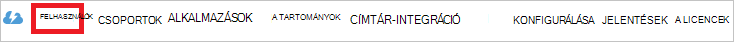

<properties
    pageTitle="Oktatóprogram: Azure Active Directory-integráció a Tableau Online |} Microsoft Azure"
    description="Egyszeri bejelentkezés Azure Active Directory és Tableau Online közötti konfigurálásának ismertetése."
    services="active-directory"
    documentationCenter=""
    authors="jeevansd"
    manager="femila"
    editor=""/>

<tags
    ms.service="active-directory"
    ms.workload="identity"
    ms.tgt_pltfrm="na"
    ms.devlang="na"
    ms.topic="article"
    ms.date="10/18/2016"
    ms.author="jeedes"/>

# Oktatóprogram: Azure Active Directory-integráció a Tableau Online

Ebből az oktatóanyagból megismerheti, hogyan Tableau Online integrálása az Azure Active Directory (Azure Active Directory).

Azure AD az Online Tableau integrálása biztosít a következő előnyökkel jár:

- Az Azure Active Directory, aki rendelkezik hozzáféréssel Tableau Online megadhatja, hogy
- Engedélyezheti a felhasználóknak, hogy automatikusan első jelentkezett-on (Single Sign-On) online Tableau az Azure Active Directory-fiókok
- A fiókokat az egy központi helyen – az Azure klasszikus portálra

Ha többet szeretne tudni a szoftver alkalmazás integrálása az Azure AD meg, hogy, ismerje meg, [az access alkalmazás és az egyszeri bejelentkezés az Azure Active Directory címtárral](active-directory-appssoaccess-whatis.md).

## Előfeltételek

Azure Active Directory integráció Tableau online van szükség az alábbiakat:

- Az Azure Active Directory-előfizetéssel
- Egy **Tableau Online** egyszeri bejelentkezés engedélyezett előfizetés

> [AZURE.NOTE] Az oktatóprogram lépéseit teszteléséhez nem használata ajánlott munkakörnyezetben.

Az oktatóprogram lépéseit teszteléséhez célszerű követnie az alábbi javaslatokat:

- Erre akkor szükség, ne használja a termelési környezetén.
- Ha nincs telepítve az Azure Active Directory próba környezetben, kattint egy hónap próba [Itt](https://azure.microsoft.com/pricing/free-trial/).

## Forgatókönyv leírása
Ebben az oktatóanyagban tesztelni Azure AD az egyszeri bejelentkezés tesztkörnyezetben. Az alkalmazási példát, ebben az oktatóanyagban tagolt két fő építőelemek áll:

1. A gyűjteményből Tableau Online hozzáadása
2. Beállítása és tesztelése Azure Active Directory egyszeri bejelentkezés

## A gyűjteményből Tableau Online hozzáadása
Konfigurálja az Azure Active Directory integrálása a Tableau Online, meg kell Tableau Online hozzáadása a gyűjteményből az felügyelt szoftver alkalmazáslistát.

**A gyűjteményből Tableau Online felvenni, hajtsa végre az alábbi lépéseket:**

1. Az **Azure klasszikus portálon**kattintson a bal oldali navigációs területen kattintson az **Active Directory**. 

    ![Az Active Directory][1]

2. A **címtár** listából válassza ki a címtárban, amelynek a címtár-integrációs engedélyezni szeretné.

3. Nyissa meg az alkalmazások nézetben, a címtár-nézetben, kattintson a felső menüben **alkalmazásokat** .

    ![Alkalmazások][2]

4. Kattintson a **Hozzáadás** az oldal alján.

    ![Alkalmazások][3]

5. **Milyen feladatot szeretne tenni** párbeszédpanelen kattintson **a gyűjteményből az alkalmazások felvétele**.

    ![Alkalmazások][4]

6. A Keresés mezőbe írja be **Az Online Tableau**.

    

7. Az eredmény ablaktáblában **Tableau Online**szolgáltatást válassza ki, és válassza a **kész** , az alkalmazás hozzáadása parancsra.

    

##  Beállítása és tesztelése Azure Active Directory egyszeri bejelentkezés
Ebben a részben, beállítása és tesztelése Azure Active Directory egyszeri bejelentkezés a Tableau online "Britta Simon" nevű próba felhasználón alapuló.

Egyszeri bejelentkezés a munkát Azure AD meg kell adni szeretné, hogy mi a megfelelőjük a felhasználó a Tableau online-ban egy felhasználó az Azure Active Directory. Más szóval hivatkozás Azure AD-felhasználó, és a kapcsolódó felhasználó Tableau online közötti kapcsolat kell létrehozni.
A hivatkozás kapcsolat jön létre a értéket a **felhasználó nevét** a **felhasználónév** Tableau Online értékként Azure Active Directory hozzárendelésével.

Állítsa be, és Azure Active Directory egyszeri bejelentkezés Tableau online tesztelése, a következő építőelemek szükséges:

1. **[Azure Active Directory konfigurálása az egyszeri bejelentkezés](#configuring-azure-ad-single-single-sign-on)** - engedélyezése a felhasználóknak, hogy ezzel a szolgáltatással.
2. **[Felhasználó létrehozása az Azure Active Directory tesztelése](#creating-an-azure-ad-test-user)** - Azure Active Directory egyszeri bejelentkezéssel való Britta Simon ellenőrzéséhez.
4. **[Felhasználó létrehozása a Tableau Online tesztelése](#creating-a-Tableau-Online-test-user)** - van-e egy megfelelője a Britta Simon Tableau Online az Azure Active Directory ábrázolása amelyen van csatolva.
5. **[Az Azure Active Directory hozzárendelése tesztelje a felhasználó](#assigning-the-azure-ad-test-user)** - ahhoz, hogy Britta Simon Azure AD az egyszeri bejelentkezés használata.
5. **[Tesztelés egyszeri bejelentkezés](#testing-single-sign-on)** - ellenőrzéséhez, hogy működik-e a konfigurációs.

### Azure Active Directory egyszeri bejelentkezés beállítása

Ez a szakasz célja Azure AD az egyszeri bejelentkezés az Azure klasszikus portálon engedélyezheti és az egyszeri bejelentkezés beállítása a Tableau Online alkalmazás.

**Azure Active Directory egyszeri bejelentkezés beállítása a Tableau online, hajtsa végre az alábbi lépéseket:**

1. A felső sávon kattintson a **Quick Start**.

    ![Egyszeri bejelentkezés beállítása][6]
2. Az klasszikus portálon **Tableau Online** alkalmazás integrációs lapján kattintson **konfigurálása az egyszeri bejelentkezés** a **Konfigurálása az egyszeri bejelentkezés** párbeszédpanel megnyitásához.

    ![Egyszeri bejelentkezés beállítása][7] 

3. **Hogyan szeretné, hogy jelentkezzen be az Tableau Online felhasználók** lapon válassza az **Azure Active Directory Single Sign-On**, és kattintson a **Tovább gombra**.
    
    

4. Az **Alkalmazás beállításainak megadása** párbeszédpanel lapon hajtsa végre az alábbi lépéseket: 

    

    egy. Az bejelentkezési a URL-cím mezőbe írja be az URL-cím használata a következő mintát:`https://sso.online.tableau.com`

    c billentyűkombinációt. Kattintson a **Tovább**gombra.

5. **Konfigurálása az egyszeri bejelentkezés Tableau online** lapján kattintson a **metaadat-alapú letöltése**, majd mentse a fájlt a számítógépen.

    

6. Jelölje ki az egyszeri bejelentkezéses konfigurációs megerősítő, és kattintson a **Tovább gombra**.
    
    ![Azure Active Directory Single Sign-On][10]

7. Az **egyszeri bejelentkezés megerősítés** lapon kattintson a **Befejezés**gombra.  
    
    ![Azure Active Directory Single Sign-On][11]
8. Egy másik böngészőablakban bejelentkezéses az Tableau Online alkalmazás. Nyissa meg a **beállítások ikonra** , majd a **hitelesítés**

    

9. **Hitelesítés típusa** csoportban. Jelöljön be ahhoz, hogy SAML **egyszeri bejelentkezés a SAML együtt** jelölőnégyzetet.

    

10. Görgessen lefelé, amíg **az Tableau Online metaadat-fájl importálása** szakaszban.  Kattintson a Tallózás gombra, és Azure Active Directory letöltött a metaadat-fájl importálása. Kattintson az **Alkalmaz**.

    

11. A **Hol.van Előfeltételek** csoportban a megfelelő identitásszolgáltató állítás nevét, e-mail címét, Utónév és Vezetéknév beszúrása. Úgy juthat az Azure Active Directory ezt az információt:

    egy. Térjen vissza az Azure Active Directory. Az Azure klasszikus portálon **Tableau Online** alkalmazás integrációs lapján a menüben, a képernyő tetején kattintson a **attribútumok**elemre. Másolja az értékeket a neve: userprincipalname, givenname és a vezetéknevet.
     
    

    b. Váltson a Tableau Online alkalmazás, majd a **Tableau Online attribútumok** szakasz beállítása a következőképpen:
    
    -  E-mail: **Posta** vagy a **userprincipalname**
    -  Utónév: **givenname**
    -  Vezetéknév: **Vezetéknév**

    

### Azure AD-próba felhasználó létrehozása
Ebben a szakaszban a klasszikus portálon Britta Simon nevű próba felhasználó létrehozása.

![Azure Active Directory-felhasználó létrehozása][20]

**Teszt felhasználó létrehozása az Azure Active Directory, hajtsa végre az alábbi lépéseket:**

1. Az **Azure klasszikus portálon**kattintson a bal oldali navigációs területen kattintson az **Active Directory**.
    
     

2. A **címtár** listából válassza ki a címtárban, amelynek a címtár-integrációs engedélyezni szeretné.

3. A menüben, a képernyő tetején, a felhasználók listájának megjelenítéséhez kattintson a **felhasználók**elemre.
    
     

4. **Felhasználó hozzáadása**elemre az alsó eszköztáron a **Felhasználó hozzáadása** párbeszédpanel megnyitásához.

     

5. A párbeszédpanel **közli velünk a felhasználóra vonatkozó** lapon hajtsa végre az alábbi lépéseket:
 
     

    egy. Felhasználó típusa jelölje be az új felhasználó a szervezet.

    b. A felhasználónév **szövegmezőbe**írja be a **BrittaSimon**.

    c billentyűkombinációt. Kattintson a **Tovább**gombra.

6.  A **Felhasználói profil** párbeszédpanel lapon hajtsa végre az alábbi lépéseket:

     

    egy. Az **első neve** mezőbe írja be a **Britta**.  

    b. Az **Utolsó neve** mezőbe írja be, **Simon**.

    c billentyűkombinációt. A **Megjelenítendő név** mezőbe írja be a **Britta Simon**.

    d. A **szerepkör** listában jelölje ki a **felhasználót**.

    e. Kattintson a **Tovább**gombra.

7. A párbeszédpanel **ideiglenes jelszót kérjen** lapon kattintson a **Hozzon létre**.

     

8. A párbeszédpanel **ideiglenes jelszót első** lapon hajtsa végre az alábbi lépéseket:

     

    egy. Jegyezze fel az **Új jelszót**az érték.

    b. Kattintson a **kész**gombra.   

### Egy Tableau Online próba-felhasználó létrehozása

Ebben a részben egy Britta Simon Tableau Online nevű felhasználót hoz létre.

1. **Tableau Online**kattintson a **beállítások ikonra** , majd a **hitelesítési** szakaszban. Görgessen le, **Válassza a felhasználók** szakaszban. Kattintson a **felhasználók hozzáadása** , majd **Írja be E-mail címét**.

    
2. Válassza a **felhasználók felvétele az egyszeri bejelentkezés (SSO) hitelesítési**. Az **E-mail címeket adjon meg** a szövegdoboz felvételebritta.simon@contoso.com

    

3.  Kattintson a **létrehozása**gombra.

### Az Azure Active Directory-próba felhasználói hozzárendelése

Ebben a részben Britta Simon használandó Azure egyszeri bejelentkezés a saját hozzáférést biztosít Tableau Online engedélyezése.

![Felhasználó hozzárendelése][200] 

**Tableau Online Britta Simon rendelni, hajtsa végre az alábbi lépéseket:**

1. A klasszikus portál kattintva nyissa meg az alkalmazások nézetben, a címtár-nézetben, kattintson az **alkalmazások** parancsra a felső menüben.

    ![Felhasználó hozzárendelése][201] 

3. Alkalmazások listájában válassza **Az Online Tableau**.

     

4. A felső sávon kattintson a **felhasználók**elemre.

    ![Felhasználó hozzárendelése][203] 

5. Az összes felhasználó listában válassza a **Britta Simon**.

6. Az alsó eszköztáron kattintson a **hozzárendelni**.

    ![Felhasználó hozzárendelése][205]

### Egyszeri bejelentkezés tesztelése

Ez a szakasz célja a Azure Active Directory egyszeri bejelentkezéses beállítások tesztelése a Access panelen.

Ha a Tableau Online csempére az Access panel gombra kattint, meg kell kérjen automatikusan aláírt-on az Tableau Online alkalmazás.

## További források

* [A szoftver alkalmazások integrálása az Azure Active Directory oktatóanyagok listája](active-directory-saas-tutorial-list.md)
* [Mi az access alkalmazás és az egyszeri bejelentkezés az Azure Active Directory címtárral?](active-directory-appssoaccess-whatis.md)

<!--Image references-->

[1]: ./media/active-directory-saas-tableauonline-tutorial/tutorial_general_01.png
[2]: ./media/active-directory-saas-tableauonline-tutorial/tutorial_general_02.png
[3]: ./media/active-directory-saas-tableauonline-tutorial/tutorial_general_03.png
[4]: ./media/active-directory-saas-tableauonline-tutorial/tutorial_general_04.png

[5]: ./media/active-directory-saas-tableauonline-tutorial/tutorial_general_05.png
[6]: ./media/active-directory-saas-tableauonline-tutorial/tutorial_general_06.png
[7]:  ./media/active-directory-saas-tableauonline-tutorial/tutorial_general_050.png
[10]: ./media/active-directory-saas-tableauonline-tutorial/tutorial_general_060.png
[11]: ./media/active-directory-saas-tableauonline-tutorial/tutorial_general_070.png
[20]: ./media/active-directory-saas-tableauonline-tutorial/tutorial_general_100.png

[200]: ./media/active-directory-saas-tableauonline-tutorial/tutorial_general_200.png
[201]: ./media/active-directory-saas-tableauonline-tutorial/tutorial_general_201.png
[203]: ./media/active-directory-saas-tableauonline-tutorial/tutorial_general_203.png
[204]: ./media/active-directory-saas-tableauonline-tutorial/tutorial_general_204.png
[205]: ./media/active-directory-saas-tableauonline-tutorial/tutorial_general_205.png
