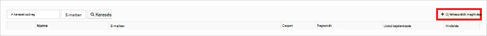

<properties
    pageTitle="Oktatóprogram: Azure Active Directory-integráció a UserEcho |} Microsoft Azure"
    description="Megtudhatja, hogy miként konfigurálása az egyszeri bejelentkezés Azure Active Directory és UserEcho között."
    services="active-directory"
    documentationCenter=""
    authors="jeevansd"
    manager="femila"
    editor=""/>

<tags
    ms.service="active-directory"
    ms.workload="identity"
    ms.tgt_pltfrm="na"
    ms.devlang="na"
    ms.topic="article"
    ms.date="10/20/2016"
    ms.author="jeedes"/>

# Oktatóprogram: Azure Active Directory-integráció a UserEcho

Ebben az oktatóanyagban célja mutatja, hogy miként UserEcho integrálása az Azure Active Directory (Azure Active Directory).  
UserEcho integrálása az Azure Active Directory biztosít a következő előnyökkel jár: 

- Az Azure Active Directory, aki rendelkezik hozzáféréssel UserEcho megadhatja, hogy 
- Engedélyezheti a felhasználóknak, hogy automatikusan első jelentkezett-on való UserEcho (Single Sign-On) az Azure Active Directory-fiókok
- A fiókokat az egy központi helyen – az Azure klasszikus portálra

Ha többet szeretne tudni a szoftver alkalmazás integrálása az Azure AD meg, hogy, ismerje meg, [az access alkalmazás és az egyszeri bejelentkezés az Azure Active Directory címtárral](active-directory-appssoaccess-whatis.md).

## Előfeltételek 

Azure Active Directory integráció a UserEcho van szükség az alábbiakat:

- Az Azure Active Directory-előfizetéssel
- Egy UserEcho egyszeri bejelentkezés engedélyezett előfizetés

> [AZURE.NOTE] Az oktatóprogram lépéseit teszteléséhez nem használata ajánlott munkakörnyezetben.

Az oktatóprogram lépéseit teszteléséhez célszerű követnie az alábbi javaslatokat:

- Erre akkor szükség, ne használja a termelési környezetén.
- Ha nincs telepítve az Azure Active Directory próba környezetben, kattint egy hónap próba [Itt](https://azure.microsoft.com/pricing/free-trial/). 

 
## Forgatókönyv leírása
Ebben az oktatóanyagban célja lehetővé teszi az Azure Active Directory egyszeri bejelentkezés tesztkörnyezetben tesztelése.  
Az alkalmazási példát, ebben az oktatóanyagban tagolt két fő építőelemek áll:

1. UserEcho hozzáadása a gyűjteményből 
2. Beállítása és tesztelése Azure Active Directory egyszeri bejelentkezés

## UserEcho hozzáadása a gyűjteményből
Konfigurálja az Azure Active Directory integrálása a UserEcho, meg kell UserEcho hozzáadása az felügyelt szoftver alkalmazáslistában a gyűjteményből.

**A gyűjteményből UserEcho felvételéhez hajtsa végre az alábbi lépéseket:**

1. Az **Azure klasszikus portálon**kattintson a bal oldali navigációs területen kattintson az **Active Directory**. 

    ![Az Active Directory][1]

2. A **címtár** listából válassza ki a címtárban, amelynek a címtár-integrációs engedélyezni szeretné.

3. Nyissa meg az alkalmazások nézetben, a címtár-nézetben, kattintson a felső menüben **alkalmazásokat** .

    ![Alkalmazások][2]

4. Kattintson a **Hozzáadás** az oldal alján.

    ![Alkalmazások][3]

5. **Milyen feladatot szeretne tenni** párbeszédpanelen kattintson **a gyűjteményből az alkalmazások felvétele**.

    ![Alkalmazások][4]

6. A Keresés mezőbe írja be a **UserEcho**.

    

7. Az eredmény ablaktáblában jelölje ki a **UserEcho**, és válassza a **kész** , az alkalmazás hozzáadása gombra.

    

##  Beállítása és tesztelése Azure Active Directory egyszeri bejelentkezés
Ez a szakasz célja mutatja, hogy állítsa be, és a "Britta Simon" nevű próba felhasználón alapuló UserEcho Azure AD az egyszeri bejelentkezés tesztelése.

Az egyszeri bejelentkezési a munkát az Azure Active Directory kell, hogy mi az a partner felhasználó UserEcho az Azure Active Directory-felhasználónak. Más szóval Azure AD-felhasználó, és a kapcsolódó felhasználó UserEcho hivatkozás viszonya kell létrehozni.  
A hivatkozás kapcsolat jön létre által az Azure Active Directory UserEcho **felhasználónév** értékként a **felhasználó neve** értéket rendeli.
 
Állítsa be, és Azure Active Directory egyszeri bejelentkezéssel való UserEcho tesztelése, az alábbi építőelemeket szükséges:

1. **[Azure Active Directory konfigurálása az egyszeri bejelentkezés](#configuring-azure-ad-single-single-sign-on)** - engedélyezése a felhasználóknak, hogy ezzel a szolgáltatással.
2. **[Felhasználó létrehozása az Azure Active Directory tesztelése](#creating-an-azure-ad-test-user)** - Azure Active Directory egyszeri bejelentkezéssel való Britta Simon ellenőrzéséhez.
4. **[Felhasználó létrehozása egy UserEcho tesztelése](#creating-a-userecho-test-user)** - van-e egy megfelelője a Britta Simon UserEcho, amelyen az Azure Active Directory ábrázolt csatolt.
5. **[Az Azure Active Directory hozzárendelése tesztelje a felhasználó](#assigning-the-azure-ad-test-user)** - ahhoz, hogy Britta Simon Azure AD az egyszeri bejelentkezés használata.
5. **[Tesztelés egyszeri bejelentkezés](#testing-single-sign-on)** - ellenőrzéséhez, hogy működik-e a konfigurációs.

### Azure Active Directory Single Sign-On konfigurálása

Ez a szakasz célja Azure AD az egyszeri bejelentkezés az Azure klasszikus portálon engedélyezése és a UserEcho alkalmazásban az egyszeri bejelentkezés beállítása. 

**Állítson be Azure AD az egyszeri bejelentkezés UserEcho, hajtsa végre az alábbi lépéseket:**

1. Az Azure klasszikus portálon **UserEcho** alkalmazás integrációs lapon kattintson **konfigurálása az egyszeri bejelentkezés** a **Konfigurálása az egyszeri bejelentkezés** párbeszédpanel megnyitásához.

    ![Egyszeri bejelentkezés beállítása][6] 

2. **Hogyan szeretné, hogy jelentkezzen be az UserEcho felhasználók** lapon válassza az **Azure Active Directory Single Sign-On**, és kattintson a **Tovább gombra**.

     

3. Az **Alkalmazás beállításainak megadása** párbeszédpanel lapon hajtsa végre az alábbi lépéseket:

     

    egy. **Bejelentkezési a URL-cím** mezőbe írja be a UserEcho alkalmazás bejelentkezni a felhasználók által használt URL-CÍMÉT (például: *https://fabrikam.UserEcho.com/*).

    b. Kattintson a **Tovább**gombra.
 
 
4. A **beállítás az egyszeri bejelentkezés UserEcho a** lapon hajtsa végre az alábbi lépéseket:

     

    egy. Kattintson a **tanúsítvány letöltése**, és mentse a fájlt a számítógépen.

    b. Kattintson a **Tovább**gombra.

1. Egy másik böngészőablakban jelentkezzen be a UserEcho vállalati webhely rendszergazdaként.

1. Kattintson az eszköztáron a képernyő tetején kattintson a felhasználó nevére kattintva bontsa ki a menüt, és válassza a **telepítés**.

     

1. Kattintson a **integrációs lehetőségeit**.

     

1. Kattintson a **webhely**hivatkozásra, és válassza **az egyszeri bejelentkezés (SAML2)**.

     

1. **Egyszeri bejelentkezés (SAML)** lapon végezze el az alábbi lépéseket:

     

    egy. A **SAML engedélyező**jelölje ki a **Igen**. 

    b. Az Azure klasszikus portálon kattintson a konfigurálás egyszeri bejelentkezés UserEcho párbeszédpanel lapon másolja az **Egyszeri bejelentkezéses szolgáltatás URL-címe** értéket, és beilleszti a **SAML egyszeri bejelentkezési URL-cím** mezőbe.

    c billentyűkombinációt. Az Azure klasszikus portálon kattintson a konfigurálás egyszeri bejelentkezés UserEcho párbeszédpanel lapon a **Távoli kijelentkezés URL-címe** értéket másolja és illessze be a **távoli logoout URL-címe** mezőben lévő értéket. 

    d. Nyissa meg a letöltött tanúsítvány a Jegyzettömbben, a tartalom másolása és beillesztése a **X.509-es tanúsítvány** mezőben lévő értéket.    

    e. Kattintson a **Mentés**gombra.

6. Az Azure klasszikus portálon válassza ki az egyszeri bejelentkezéses konfigurációs megerősítő, és kattintson a **Tovább gombra**. 

    ![Azure Active Directory Single Sign-On][10]

7. Az **egyszeri bejelentkezés megerősítés** lapon kattintson a **Befejezés**gombra.  

    ![Azure Active Directory Single Sign-On][11]

### Azure AD-próba felhasználó létrehozása
Ez a szakasz célja vizsgálat felhasználó létrehozása az Azure-Britta Simon nevű klasszikus portálon.

![Azure Active Directory-felhasználó létrehozása][20]

**Teszt felhasználó létrehozása az Azure Active Directory, hajtsa végre az alábbi lépéseket:**

1. Az **Azure klasszikus portálon**kattintson a bal oldali navigációs területen kattintson az **Active Directory**.

      

2. A **címtár** listából válassza ki a címtárban, amelynek a címtár-integrációs engedélyezni szeretné.

3. A menüben, a képernyő tetején, a felhasználók listájának megjelenítéséhez kattintson a **felhasználók**elemre.

     
 
4. **Felhasználó hozzáadása**elemre az alsó eszköztáron a **Felhasználó hozzáadása** párbeszédpanel megnyitásához. 

     

5. A párbeszédpanel **közli velünk a felhasználóra vonatkozó** lapon hajtsa végre az alábbi lépéseket: 

      

    egy. Felhasználó típusa jelölje be az új felhasználó a szervezet.

    b. A felhasználónév **szövegmezőbe**írja be a **BrittaSimon**.

    c billentyűkombinációt. Kattintson a **Tovább**gombra.

6.  A **Felhasználói profil** párbeszédpanel lapon hajtsa végre az alábbi lépéseket: 

     
 
    egy. Az **első neve** mezőbe írja be a **Britta**.  

    b. Az **Utolsó neve** mezőbe írja be, **Simon**.

    c billentyűkombinációt. A **Megjelenítendő név** mezőbe írja be a **Britta Simon**.

    d. A **szerepkör** listában jelölje ki a **felhasználót**.
    e. Kattintson a **Tovább**gombra.

7. A párbeszédpanel **ideiglenes jelszót kérjen** lapon kattintson a **Hozzon létre**.

     
 
8. A párbeszédpanel **ideiglenes jelszót első** lapon hajtsa végre az alábbi lépéseket:

     
  
    egy. Jegyezze fel az **Új jelszót**az érték.

    b. Kattintson a **kész**gombra.   

  
 
### UserEcho próba felhasználó létrehozása

Ez a szakasz célja Britta Simon nevű UserEcho felhasználó létrehozása.

**Britta Simon nevű UserEcho felhasználó létrehozása, hajtsa végre az alábbi lépéseket:**

1. Bejelentkezés a UserEcho vállalati webhelyre rendszergazdaként.

1. Kattintson az eszköztáron a képernyő tetején kattintson a felhasználó nevére kattintva bontsa ki a menüt, és válassza a **telepítés**.

     

1. Kattintson a **felhasználók**, a **felhasználók** szakasz kibontásához.

     

1. Kattintson a **felhasználók**elemre.

     

1. Kattintson az **Új felhasználók meghívása**.

    

1. Az **Új felhasználók meghívása** párbeszédpanelen hajtsa végre az alábbi lépéseket:

     

    egy. Az **neve** mezőbe írja be a **Britta Simon**.

    b. Az **E-mail** mezőbe írja be a Britta meg e-mail címét az Azure klasszikus portálon.

    c billentyűkombinációt. Kattintson a **Meghívás**gombra.

Meghívás a rendszer elküldi a Britta, amely lehetővé teszi, hogy UserEcho használatának megkezdéséhez. 

### Az Azure Active Directory-próba felhasználói hozzárendelése

Ez a szakasz célja Britta Simon Azure egyszeri bejelentkezés a saját hozzáférést biztosít UserEcho használandó engedélyezése.

![Felhasználó hozzárendelése][200] 

**Britta Simon hozzárendelése UserEcho, hajtsa végre az alábbi lépéseket:**

1. Az Azure klasszikus portál kattintva nyissa meg az alkalmazások nézetben, a címtár-nézetben, kattintson az **alkalmazások** parancsra a felső menüben.

    ![Felhasználó hozzárendelése][201] 

2. Az alkalmazások listájában jelölje ki a **UserEcho**.

     

1. A felső sávon kattintson a **felhasználók**elemre.

    ![Felhasználó hozzárendelése][203] 

1. A felhasználók listában jelölje ki a **Britta Simon**.

2. Az alsó eszköztáron kattintson a **hozzárendelni**.

    ![Felhasználó hozzárendelése][205]

### Egyszeri bejelentkezés tesztelése

Ez a szakasz célja a Azure Active Directory egyszeri bejelentkezéses beállítások tesztelése a Access panelen.  
Amikor az Access panel a UserEcho mozaik gombra kattint, meg kell első automatikusan aláírt-on az UserEcho alkalmazás.

## További források

* [A szoftver alkalmazások integrálása az Azure Active Directory oktatóanyagok listája](active-directory-saas-tutorial-list.md)
* [Mi az access alkalmazás és az egyszeri bejelentkezés az Azure Active Directory címtárral?](active-directory-appssoaccess-whatis.md)

<!--Image references-->

[1]: ./media/active-directory-saas-userecho-tutorial/tutorial_general_01.png
[2]: ./media/active-directory-saas-userecho-tutorial/tutorial_general_02.png
[3]: ./media/active-directory-saas-userecho-tutorial/tutorial_general_03.png
[4]: ./media/active-directory-saas-userecho-tutorial/tutorial_general_04.png

[6]: ./media/active-directory-saas-userecho-tutorial/tutorial_general_05.png
[10]: ./media/active-directory-saas-userecho-tutorial/tutorial_general_06.png
[11]: ./media/active-directory-saas-userecho-tutorial/tutorial_general_07.png
[20]: ./media/active-directory-saas-userecho-tutorial/tutorial_general_100.png

[200]: ./media/active-directory-saas-userecho-tutorial/tutorial_general_200.png
[201]: ./media/active-directory-saas-userecho-tutorial/tutorial_general_201.png
[203]: ./media/active-directory-saas-userecho-tutorial/tutorial_general_203.png
[204]: ./media/active-directory-saas-userecho-tutorial/tutorial_general_204.png
[205]: ./media/active-directory-saas-userecho-tutorial/tutorial_general_205.png

