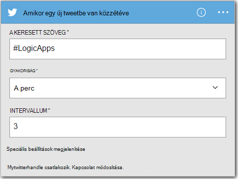

<properties
    pageTitle="Hozzon létre egy logikájának alkalmazás |} Microsoft Azure"
    description="Megtudhatja, hogy miként szoftver szolgáltatások csatlakozás logika alkalmazás létrehozása céljából"
    authors="jeffhollan"
    manager="dwrede"
    editor=""
    services="logic-apps"
    documentationCenter=""/>

<tags
    ms.service="logic-apps"
    ms.workload="na"
    ms.tgt_pltfrm="na"
    ms.devlang="na"
    ms.topic="get-started-article"
    ms.date="10/18/2016"
    ms.author="jehollan"/>

# Csatlakozás a szoftver szolgáltatások logika új alkalmazás létrehozása

Ez a témakör bemutatja, hogyan, mindössze néhány perc alatt kezdéshez [Azure logika](app-service-logic-what-are-logic-apps.md)alkalmazással. Módszeren végigvezetjük, amellyel érdekes twitterre küldése e-mailek egyszerű munkafolyamat.

Ebben az esetben használatához szükséges:

- Az Azure előfizetéssel
- A Twitter-fiók
- Outlook.com- vagy szolgáltatott az Office 365-ös postaláda

## Logika twitterre e-mailben való új alkalmazás létrehozása

1. Az [Azure portál irányítópult](https://portal.azure.com)válassza az **Új**. 
2. A Keresés sáv összefüggés-alkalmazásokban keresni, és válassza a **Logika alkalmazás**. Is válassza az **Új**, **webes + Mobile**, és jelölje ki **Logika alkalmazást**. 
3. Írjon be egy nevet az logika számára, válassza ki a helyet, az erőforráscsoport, és válassza a **Create**.  Ha bejelöli a **PIN-kód irányítópult** a logikájának alkalmazásban nyílnak meg automatikusan egyszer rendszerbe.  
4. Az első alkalommal a logika megnyitása után kijelölhet egy sablonból indításához.  Most kattintson az **Üres logika alkalmazás** össze a nulláról. 
1. Az első tételt, létre kell hoznia az eseményindító.  Ez a megfelelő eseményt az összefüggés-alkalmazás elindul.  Keresse meg a **twitter** a kiváltó ok mező Keresés mezőbe, és jelölje ki.
7. Most fog beírt indíthatja el a kívánt keresőkifejezést.  A **gyakoriság** és **intervallum** meghatározza, hogy milyen gyakran jelölje be a logika alkalmazás új twitterre (és vissza, amely során az összes twitterre idő módosítva).
    

5. Az **új lépést** gombra, és válassza a **Hozzáadás művelet** vagy a **Hozzáadás a megadott feltétel**
6. Ha a **művelet hozzáadása**lehetőséget választja, az művelet kiválasztásához a [rendelkezésre álló összekötők](../connectors/apis-list.md) is kereshet. Válassza például **Outlook.com - E-mail küldése** egy outlook.com címet az e-mail küldése:  
    

7. Most töltse ki a kívánt e-mail paramétereinek kell:  

8. Végezetül választhatja ki a **Mentés** a logikájának alkalmazásnak live.

## Kezelése a logikájának-alkalmazás létrehozása után

Most már az logika alkalmazás már működik. Azt rendszeresen ellenőrzi, hogy twitterre együtt a keresett kifejezést a megadott. Amikor talál egy egyező tweetbe, akkor küld e-mailben. Végül akkor fogja megtudhatja, hogy miként letilthatja az alkalmazást, vagy ha látja milyen módon.

1. Az [Azure portál](https://portal.azure.com)

1. Kattintson a **Tallózás gombra** a képernyő bal oldalán, és válassza az **Alkalmazások logika**.

2. Kattintson az új logika alkalmazás éppen létrehozott aktuális állapotát, és általános információkat.

3. Ha szerkeszteni szeretné az új logika alkalmazást, kattintson a **Szerkesztés**gombra.

5. Ha ki szeretné kapcsolni az alkalmazást, kattintson a **letiltása** parancssávon.

1. Lync-logikájának alkalmazás fut alábbi Futtatás és a kiváltó ok mező előzményeinek megtekintése  Kattinthat a **frissítése** a legfrissebb adatok megjelenítéséhez.

5 perc ugyanúgy tudja beállítani egy egyszerű logikai alkalmazást futtató a felhőben. Logika alkalmazás funkcionalitásának használatával kapcsolatos további információért olvassa el a [logika alkalmazás szolgáltatások használata]című témakört. A saját maguk logikájának alkalmazás definíciók kapcsolatos további tudnivalókért lásd: a [logikájának alkalmazás definíciók Szerző](app-service-logic-author-definitions.md).

<!-- Shared links -->
[Azure portal]: https://portal.azure.com
[Logika app funkcióinak használata]: app-service-logic-create-a-logic-app.md
