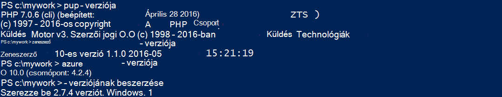
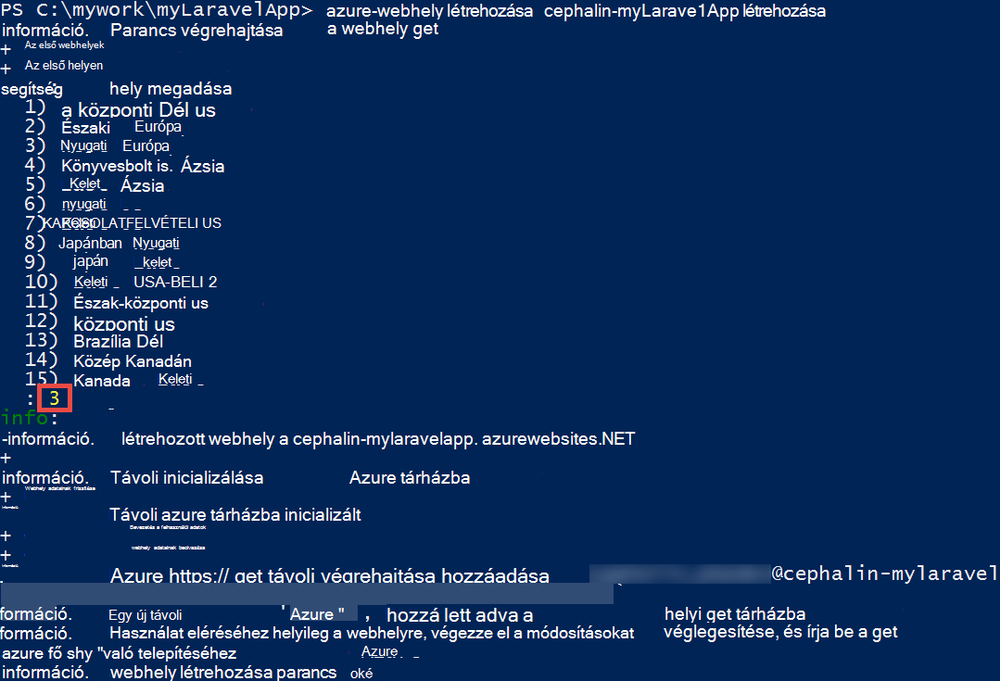
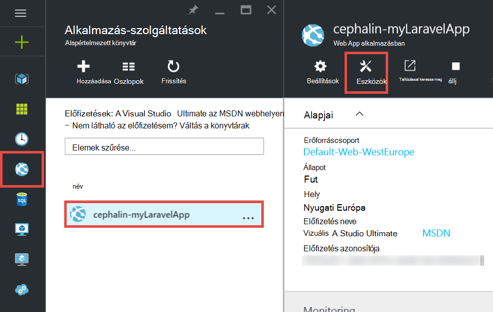
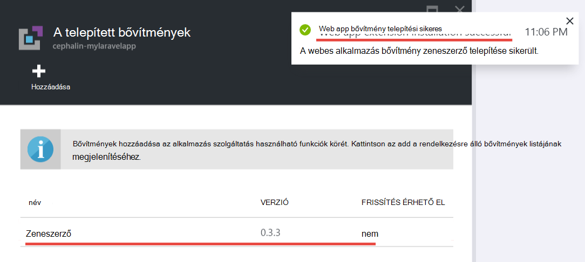
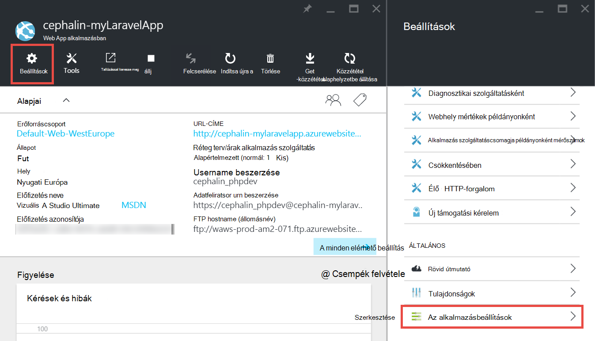
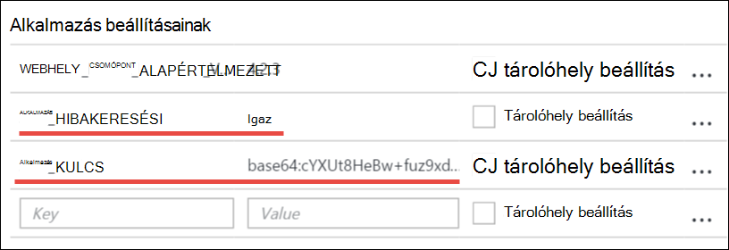
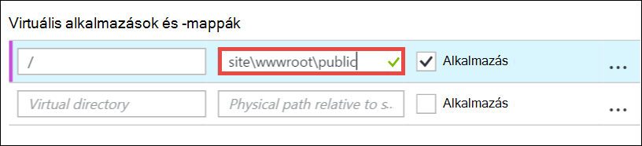
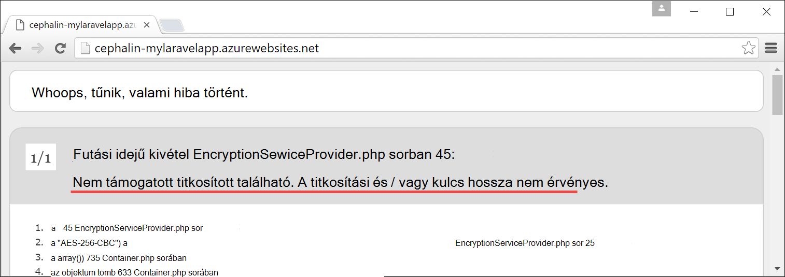

<properties
    pageTitle="Hozzon létre, beállítása és PHP webalkalmazást ügyfélszámítógépekre való Azure"
    description="Egy oktatóprogram, amely szemlélteti, hogyan lehet, hogy az Azure alkalmazás szolgáltatás futtatása (Laravel) PHP webalkalmazást. További információ a kiválasztott PHP keretrendszer követelményeknek Azure-alkalmazás szolgáltatás konfigurálása."
    services="app-service\web"
    documentationCenter="php"
    authors="cephalin"
    manager="wpickett"
    editor=""
    tags="mysql"/>

<tags
    ms.service="app-service-web"
    ms.workload="web"
    ms.tgt_pltfrm="na"
    ms.devlang="PHP"
    ms.topic="article"
    ms.date="06/03/2016" 
    ms.author="cephalin"/>

# Hozzon létre, konfigurálása és Azure PHP webalkalmazást telepítése

[AZURE.INCLUDE [tabs](../../includes/app-service-web-get-started-nav-tabs.md)]

Ebből az oktatóanyagból megtudhatja, létrehozása, beállítása és üzembe Azure PHP webalkalmazást, és hogyan Azure megfelelnek a PHP web app alkalmazás szolgáltatás konfigurálása. Az oktatóprogram végére futó élő [Azure App](../app-service/app-service-value-prop-what-is.md)szolgáltatásban [Laravel](https://www.laravel.com/) webalkalmazás működő lesz.

Az Azure PHP fejlesztői, áttelepítheti a kedvenc PHP keretrendszer. Ebben az oktatóanyagban Laravel használ, egyszerűen, egy konkrét alkalmazás példaként. Ismerkedhet meg: 

- Mely számjegy használatával terjesztése
- PHP verzió
- Amely nem szerepel a legfelső szintű alkalmazás címtárban útmutató fájl használata
- Access-környezet-specifikus változók
- Az Azure-alkalmazás frissítése

Mi, itt megtudhatja, hogy miként más PHP web Apps alkalmazások Azure telepítendő alkalmazhat.

>[AZURE.INCLUDE [app-service-linux](../../includes/app-service-linux.md)] 

## Előfeltételek

- Telepítse [PHP 5.6.x](http://php.net/downloads.php) (PHP 7 támogatása a béta)
- [Zeneszerző](https://getcomposer.org/download/) telepítése
- Telepítse az [Azure CLI](../xplat-cli-install.md)
- [Mely számjegy](http://www.git-scm.com/downloads) telepítése
- Microsoft Azure-fiók beszerzése. Ha nem rendelkeznek fiókkal, akkor [Jelentkezzen be az ingyenes próbaverzióra](/pricing/free-trial/?WT.mc_id=A261C142F) , vagy [a Visual Studio előfizetői előnyeinek aktiválása](/pricing/member-offers/msdn-benefits-details/?WT.mc_id=A261C142F).

>[AZURE.NOTE] Lásd: a művelet webalkalmazást. [Alkalmazás szolgáltatás próbálja meg](http://go.microsoft.com/fwlink/?LinkId=523751) közvetlenül, és hozzon létre egy rövid életű starter alkalmazásban – nem kötelező hitelkártya, nincs nyilatkozatát.

## A fejlesztők számítógépen PHP (Laravel) alkalmazás létrehozása

1. Nyissa meg egy új Windows parancssor, PowerShell ablakában, Linux rendszerhéj vagy OS X Terminálszolgáltatások. A következő parancsokat ellenőrizze, hogy a szükséges eszközök megfelelően van-e telepítve a számítógépen. 

        php --version
        composer --version
        azure --version
        git --version

    

    Ha még nem telepítette az eszközök, olvassa el a [vonatkozó követelmények](#Prerequisites) letöltési hivatkozások.
    
2. Telepítés Laravel a következőhöz hasonlóan:

        composer global require "laravel/installer

3. `CD`az munkakönyvtárat, és hozzon létre egy új Laravel alkalmazás következőhöz hasonlóan:

        cd <working_directory>
        laravel new <app_name>

4. `CD`az újonnan létrehozott `<app_name>` könyvtárat és az alkalmazás próba következőhöz hasonlóan:

        cd <app_name>
        php artisan serve
        
    Látnia kell a Laravel indítóképernyő nyissa meg a böngészőben http://localhost:8000 most és.
    
    
    
Úgy távol, csak a normál Laravel munkafolyamatot, és jelenleg nem Itt megtudhatja, <a href="https://laravel.com/docs/5.2" rel="nofollow">Laravel</a>. Így érdemes áthelyezni.

## Az Azure web app létrehozása, és mely számjegy telepítési beállítása

>[AZURE.NOTE] "Várakozás! Mi történik, ha szeretnék FTP üzembe helyezéséhez?" Van egy [FTP oktatóprogram](web-sites-php-mysql-deploy-use-ftp.md) az igényeinek. 

Az Azure CLI egy webalkalmazás létrehozása az Azure alkalmazás szolgáltatás, és mely számjegy környezet, amelyben a parancs az egysoros tagjának beállítja. Vegyük ehhez.

1. ASM módba módosítása, és jelentkezzen be az Azure:

        azure config mode asm
        azure login
    
    Kövesse a Súgó üzenet, folytassa a bejelentkezési folyamatot.
    
    

4. Futtassa a létrehozása az Azure web app mely számjegy telepítés parancsot. Amikor a rendszer kéri, adja meg a kívánt terület számát.

        azure site create --git <app_name>
    
    
    
    >[AZURE.NOTE] Ha soha nem beállította telepítési hitelesítő adatok Azure-előfizetéséhez, kérni fogja tabulátorok létrehozására. A hitelesítő adatokat nem Azure-fiók hitelesítő adatait, csak a mely számjegy telepítések és FTP bejelentkezések alkalmazás szolgáltatást használják. 
    
    Ez a parancs az aktuális könyvtár hoz létre egy új mely számjegy tárházba (a `git init`) és a kapcsolódó azt a tárat, mely számjegy távoli Azure-ban (a `git remote add`).

<a name="configure"/>
## Az Azure webalkalmazás konfigurálása

Az Azure-ban használata Laravel-alkalmazást frissítenie kell néhány dolog, amit a figyelmet. A hasonló gyakorlat a PHP keretrendszer megválasztott fog sikerülni.

- Állítsa be a PHP 5.5.9 vagy újabb. Lásd: a [Legújabb Laravel 5,2 Kiszolgálóigény](https://laravel.com/docs/5.2#server-requirements) kiszolgálóigény teljes listáját. A lista többi Azure-féle PHP-telepítések már beállított bővítmények. 
- A környezet változók az alkalmazás beállítása van szüksége. Laravel használja a `.env` környezet változót egyszerű beállítás fájlt. Jó helyen jár, mivel azt nem kellene kell lekötött az adatforrás-vezérlő (lásd: [Laravel környezet konfigurációja](https://laravel.com/docs/5.2/configuration#environment-configuration), helyette elrendezéstípus az Azure web app alkalmazás beállításait.
- Győződjön meg arról, hogy a Laravel alkalmazás bejegyzés pontra `public/index.php`, először betöltött. [Laravel életciklus áttekintése](https://laravel.com/docs/5.2/lifecycle#lifecycle-overview)című témakörben találhat. Más szóval, be kell állítania a web app legfelső szintű URL-cím, mutasson a `public` címtár.
- Mivel az egy composer.json Azure-zeneszerző bővítmény engedélyezése Úgy, hogy ezzel a beállítással beszerzése a szükséges csomagokat, amikor rendszerbe állítják a aggódnia zeneszerző `git push`. Kényelmesebbé kérdése. Zeneszerző automatizálási nem engedélyezi, ha csak szeretné eltávolítani `/vendor` a a `.gitignore` , hogy mely számjegy tartalmazza a fájl ("un-figyelmen kívül hagyja a") mindent a `vendor` címtár véglegesítése és programkódot telepít.

Vegyük konfigurálása egymás után az alábbi műveleteket.

4. Állítsa a Laravel alkalmazás igénylő PHP-verziót.

        azure site set --php-version 5.6

    Ezzel elkészült a PHP verzió beállítása! 
    
4. Új készítése `APP_KEY` az Azure a web App alkalmazásban, és állítsa be az alkalmazás beállítása az Azure webalkalmazást.

        php artisan key:generate --show
        azure site appsetting add APP_KEY="<output_of_php_artisan_key:generate_--show>"

4. Is, kapcsolja be a Laravel hibakeresési annak érdekében, hogy minden rejtélyes preempt `Whoops, looks like something went wrong.` lapot.

        azure site appsetting add APP_DEBUG=true

    A beállítás a környezeti változók ezzel elkészült!
    
    >[AZURE.NOTE] Várjon, most egy kicsit csökkentheti, és magyarázza el, mit jelent az Laravel és Azure leírása az alábbi. Laravel használja a `.env` fájl a legfelső szintű címtárban kiszolgálóneveket környezeti változók az alkalmazásra, ahol megtalálja a sor `APP_DEBUG=true` (és még `APP_KEY=...`). Ez a változó érhető el a `config/app.php` kóddal     `'debug' => env('APP_DEBUG', false),`. [env()](https://laravel.com/docs/5.2/helpers#method-env) a vonatkozik, a PHP [getenv()](http://php.net/manual/en/function.getenv.php) alkalmazó Laravel segítő mód.
    >
    >Azonban `.env` figyelmen kívül hagyja mely számjegy ennek neve mert a `.gitignore` a legfelső szintű címtárban fájlt. Egyszerűen helyezi, `.env`  
 a helyi mely számjegy a tárházba nem tolódik Azure és a többi a fájlokat. Természetesen egyszerűen eltávolíthatja az adott sor `.gitignore`, de azt korábban már kialakított, hogy a fájl elvégzése az adatforrás-vezérlő nem ajánlott. Ennek ellenére van szüksége Azure-ban adja meg, ezek a környezeti változók lehetőséget. 
    >
    >A jó hír az, hogy az alkalmazás beállításainak Azure App szolgáltatásban támogatja-e [getenv()](http://php.net/manual/en/function.getenv.php)  
 a PHP. Igen, miközben FTP- vagy más módon használhatja az manuális feltöltése egy `.env` fájl az Azure, csak adhatja meg a kívánt változók Azure alkalmazás beállításainak nélkül, egy `.env` , csak megismert Azure-ban. Továbbá ha egy változó, mind a `.env` fájlt, és az alkalmazás Azure-beállítások az Azure alkalmazás beállítása wins.     

4. A utolsó két tevékenységet (a virtuális könyvtár beállítása és zeneszerző engedélyezése) az [Azure portál](https://portal.azure.com)elő kell készítenie, így jelentkezzen be az Azure-fiók a [portálon](https://portal.azure.com) .

4. Kezdve a bal oldali menüben kattintson az **Alkalmazás szolgáltatások** > **&lt;alkalmazásnév >** > **eszközök**.

    
    
    >[AZURE.TIP] Ha **beállításai** helyett **eszközök**elemre kattintva is hozzáférhet az **Alkalmazás beállításai**  
 , amely lehetővé teszi, hogy a lap megadása PHP verzió, a beállítások alkalmazást, és csak did virtuális könyvtárak jelennek meg. 
    
4. Kattintson a **bővítmények** > **hozzáadása** -bővítmény hozzáadása.

4. Jelölje ki a **Zeneszerző** a **Válassza a kiterjesztés** [lap](../azure-portal-overview.md) (*lap*: a portáloldalon a megnyíló vízszintesen).

4. Az **Elfogadás jogi feltételek** lap kattintson **az OK gombra** . 

5. Kattintson **az OK gombra** az **kiterjesztés felvétele** lap.

    Amikor befejezte Azure ad a bővítmény, meg kell jelennie egy rövid előugró üzenet sarokban, valamint a **bővítmények** lap  **Zeneszerző** szerepel.

    

    Engedélyezése zeneszerző ezzel elkészült!
    
4. **Vissza a lap a web App alkalmazásban, kattintson az** > **Alkalmazás beállításait**.

    

    Az **Alkalmazás beállításai** lap jegyezze fel a korábban beállított PHP-verziója:

    

    és az alkalmazás beállításainak felvett:
    
    

4. Görgessen a lap aljára, és mutasson a **site\wwwroot\public** **site\wwwroot**helyett a legfelső szintű virtuális könyvtár módosíthatja.

    

4. Kattintson a **Mentés** elemre a lap tetején.

    Ezzel elkészült a virtuális könyvtár beállítása! 

## A web app mely számjegy (és környezeti változók beállítása) telepítése

Készen áll a kód most telepítése. Fogja megadható vissza ebben a parancssor vagy Terminálszolgáltatások.

4. A a módosítások véglegesítése, és a kód üzembe az Azure web App alkalmazásban, mint ahogyan bármelyik mely számjegy adattárban:

        git add .
        git commit -m "Hurray! My first commit for my Azure app!"
        git push azure master 

    Futtatásakor `git push`, kérni fogja adni a mely számjegy telepítési jelszót. Ha kéri hitelesítő adatait telepítési `azure site create` korábbi, írja be a használt jelszót.
    
5. Ismerkedjen meg a böngészőben a parancs futtatásával:

        azure site browse

    A böngésző jelenjen meg a Laravel indítóképernyő.
    
    
    
    Gratulálunk, most futtatja a Laravel webalkalmazást Azure-ban.
             
## Gyakori hibák elhárítása

Íme néhány a hibák mutatjuk be, amikor ebben az oktatóanyagban számított:

- [Azure CLI jeleníti meg, "" hely"nem egy azure parancs"](#clierror)
- [Webalkalmazás HTTP 403 hibát jeleníti meg.](#http403)
- [Web app jeleníti meg a "Whoops, látványtervek, például a hiba történt."](#whoops)
- [Web app jeleníti meg a "Ahol nem támogatott titkosító talált."](#encryptor)

### Azure CLI jeleníti meg, "" hely"nem egy azure parancs"

Futtatásakor `azure site *` a parancssori terminálablakba hibaüzenet jelenik meg`error:   'site' is not an azure command. See 'azure help'.` 

Ez általában a "ARM" (Azure erőforrás-kezelő) módban váltás az eredmény. Probléma megoldásához váltson vissza "ASM" (Azure Szolgáltatáskezelés) módba futtatásával `azure config mode asm`.

### Webalkalmazás HTTP 403 hibát jeleníti meg.

Telepítette a webalkalmazás sikeresen az Azure, de az Azure webalkalmazást választékát át, amikor egy `HTTP 403` vagy`You do not have permission to view this directory or page.`

Ennek oka valószínűleg, mert a web app nem találja a belépési pontjához a Laravel alkalmazásba. Győződjön meg arról, hogy megváltozott-e a legfelső szintű virtuális könyvtár mutasson a `site\wwwroot\public`, ahol a Laravel `index.php` van (lásd: [az Azure webalkalmazás konfigurálása](#configure)).

### Web app jeleníti meg a "Whoops, látványtervek, például a hiba történt."

Telepítette a webalkalmazás sikeresen az Azure, de az Azure webalkalmazást választékát át, amikor megjelenik ez az rejtélyes üzenet`Whoops, looks like something went wrong.`

Kifejezőbb hibaüzenet, hogy engedélyezhesse Laravel megadásával `APP_DEBUG` környezeti `true` (lásd: [az Azure webalkalmazás konfigurálása](#configure)).

### Web app jeleníti meg a "Ahol nem támogatott titkosító talált."

Telepítette a webalkalmazás sikeresen az Azure, de böngészés közben az Azure web App alkalmazásban, az alábbi hibaüzenetet kapja:

    
Ez egy kisebb hiba, de legalább még nem rejtélyes óta Laravel hibakeresési bekapcsolta. A hiba karakterlánc a Laravel fórumokon szemléltetés keresés láthatja, hogy annak oka, hogy nincs beállítva a APP_KEY `.env`, vagy a lehetőséget választja, akinek nem `.env` egyáltalán Azure-ban. Jeleníthetjük meg felvételével beállítás `APP_KEY` meg az Azure app beállítása (lásd: [az Azure webalkalmazás konfigurálása](#configure)).
    
## Következő lépések

Útmutató: adatok hozzáadása az alkalmazás létrehozásával [Azure-ban MySQL-adatbázishoz](../store-php-create-mysql-database.md). Is nézze meg a további hasznos hivatkozások az PHP az alábbi Azure-ban:

- [PHP Developer Center](/develop/php/).
- [Egy webalkalmazás létrehozása az Azure piactérről](app-service-web-create-web-app-from-marketplace.md)
- [PHP konfigurálása az Azure alkalmazás szolgáltatás Web Apps alkalmazásokban](web-sites-php-configure.md)
- [Azure App szolgáltatásban többhelyes funkció WordPress átalakítása](web-sites-php-convert-wordpress-multisite.md)
- [Vállalati szintű WordPress Azure alkalmazás szolgáltatása](web-sites-php-enterprise-wordpress.md)
