<properties 
    pageTitle="Azure CDN Azure alkalmazás szolgáltatás használata" 
    description="Azure alkalmazás szolgáltatás integrált Azure CDN zárólap származó tartalmat kiszolgáló webalkalmazást telepítéséről útmutatást ad meg, oktatóanyagok" 
    services="app-service\web,cdn" 
    documentationCenter=".net" 
    authors="cephalin" 
    manager="wpickett" 
    editor="jimbe"/>

<tags 
    ms.service="app-service" 
    ms.workload="tbd" 
    ms.tgt_pltfrm="na" 
    ms.devlang="dotnet" 
    ms.topic="article" 
    ms.date="07/01/2016" 
    ms.author="cephalin"/>


# <a name="use-azure-cdn-in-azure-app-service"></a>Azure CDN Azure alkalmazás szolgáltatás használata

[Alkalmazás szolgáltatás](http://go.microsoft.com/fwlink/?LinkId=529714) is integrálódik [Azure CDN](/services/cdn/), az [Alkalmazás szolgáltatás Web Apps alkalmazások](http://go.microsoft.com/fwlink/?LinkId=529714) járó globális méretezési funkciók hozzáadása a web app tartalmát globálisan kiszolgáló csomópontok közelében ügyfelei megtartásával (az összes aktuális csomópont hely frissített listája megtalálható [Itt](http://msdn.microsoft.com/library/azure/gg680302.aspx)). Statikus képek szolgáló például esetben integrálás lényegesen növelheti a Azure alkalmazás szolgáltatás Web Apps alkalmazások teljesítményének és jelentősen javítja a webalkalmazás felhasználói felület világszerte. 

Web Apps alkalmazások integrálása az Azure CDN is biztosít a következő előnyökkel jár:

- Tartalomterjesztési (a képekre, a parancsprogramokat és a stíluslapok) integrálni a webalkalmazás [folyamatos telepítési](app-service-continuous-deployment.md) folyamatának részeként
- Egyszerűen frissítse a web App alkalmazással Azure alkalmazás szolgáltatás, jQuery vagy betöltő verziók például NuGet csomagok 
- A webes alkalmazás és a CDN-felszolgált tartalom kezelése az ugyanazt a Visual Studio felületről
- ASP.NET hozzákapcsolása és minification integrálása az Azure CDN

[AZURE.INCLUDE [app-service-web-to-api-and-mobile](../../includes/app-service-web-to-api-and-mobile.md)] 

## <a name="what-you-will-build"></a>Mit fog összeállítása ##

Fogja telepíteni webalkalmazást Azure alkalmazás szolgáltatás az alapértelmezett ASP.NET MVC sablon használatával a Visual Studióban, tartalom kiszolgálására a képet, vezérlő művelet eredménye, és az alapértelmezett JavaScript és CSS-fájlok, például egy beépített Azure CDN-kód hozzáadása és konfigurálása a visszalépési mechanizmusa az abban az esetben, ha a CDN nem elérhető kapcsolat felszolgált kötegeket is kódírás.

## <a name="what-you-will-need"></a>Amire szüksége lesz ##

Ez az oktatóanyag az alábbi előfeltételek foglalja magában:

-   Az aktív [Microsoft Azure-fiók](/account/)
-   Visual Studio 2015 együtt az [Azure SDK a .NET rendszerhez](http://go.microsoft.com/fwlink/p/?linkid=323510&clcid=0x409). Ha használja a Visual Studio, a lépések eltérőek lehetnek.

> [AZURE.NOTE] Az oktatóprogram elvégzéséhez Azure-fiók van szüksége:
> + [Nyissa meg az ingyenes Azure-fiók](/pricing/free-trial/) is - credits kap próbálja ki az fizetett Azure szolgáltatások is használhatja, és a azokat megszokott után is választhatja, hogy a fiók, és használata ingyenes Azure szolgáltatások, például a Web Apps alkalmazások.
> + [Visual Studio előfizetői előnyeinek aktiválása](/pricing/member-offers/msdn-benefits-details/) is – a Visual Studio előfizetés lépve credits havonta fizetett Azure szolgáltatások használható.
>
> Ha azt szeretné, mielőtt feliratkozna az Azure-fiók kezdéshez Azure alkalmazás szolgáltatással, nyissa meg a [Próbálja alkalmazás szolgáltatás](http://go.microsoft.com/fwlink/?LinkId=523751), ahol azonnal létrehozhat egy rövid életű starter web app alkalmazás szolgáltatásban. Nem kötelező, hitelkártyák Nincs nyilatkozatát.

## <a name="deploy-a-web-app-to-azure-with-an-integrated-cdn-endpoint"></a>Webes alkalmazások terjesztése az Azure-integrált CDN-végponttal ##

Ebben a részben fogja telepíteni az alapértelmezett ASP.NET MVC alkalmazás sablon a Visual Studio Skype 2015 vállalati App szolgáltatásba, és integrálása egy új CDN-végpontot. Az alábbi lépéseket:

1. A Visual Studio Skype 2015 vállalati, hozzon létre egy új ASP.NET webalkalmazást a menüsor megjelenítése az ismételt megjelenítéséhez **Fájl > Új > a Project > webes > ASP.NET webalkalmazás**. Adja meg egy nevet, és kattintson az **OK gombra**.

    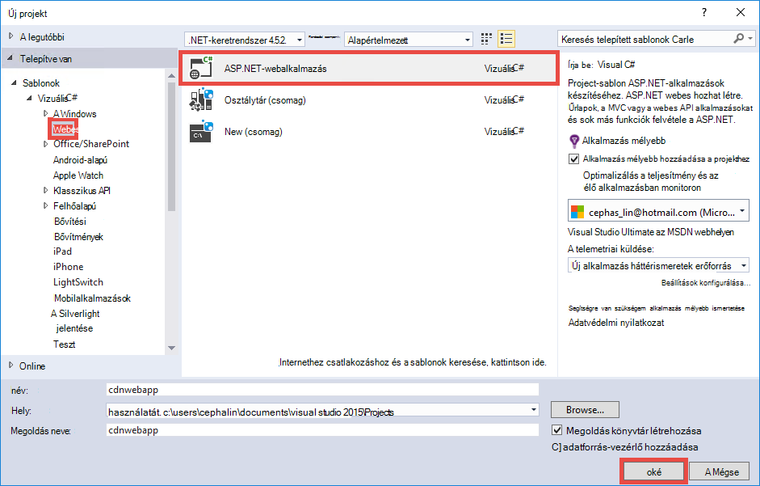

3. Jelölje ki a **MVC** , és kattintson az **OK gombra**.

    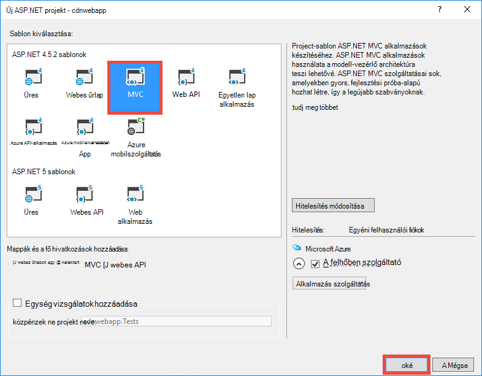

4. Ha még nem bejelentkezett az Azure-fiókjába még, kattintson a fiók ikonra a jobb felső sarokban, és hajtsa végre a párbeszédpanel bejelentkezni az Azure-fiókjába. Amikor elkészült, az alkalmazás beállítása az alább látható módon, majd kattintson az **Új** alkalmazás szolgáltatás az alkalmazás új csomag létrehozása gombra.  

    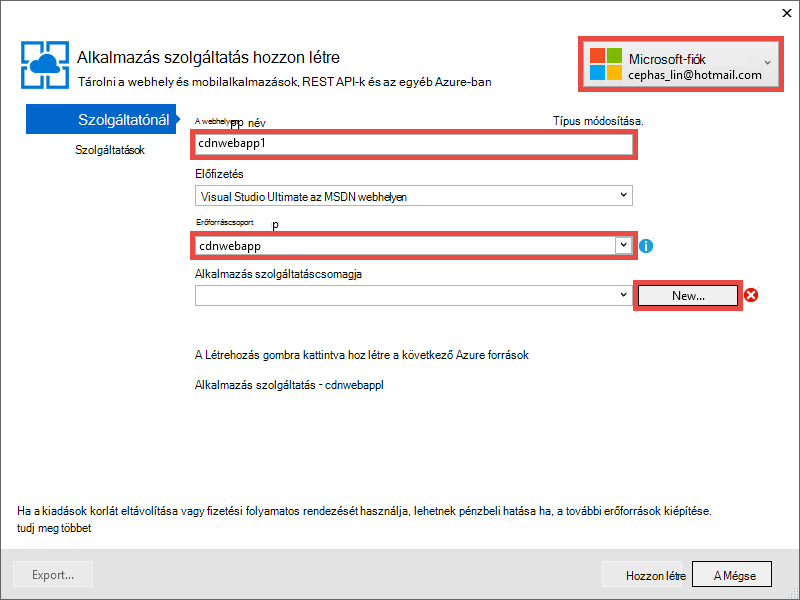

5. Új alkalmazás szolgáltatás csomag beállítása párbeszédpanelen alább látható módon, és kattintson az **OK gombra**. 

    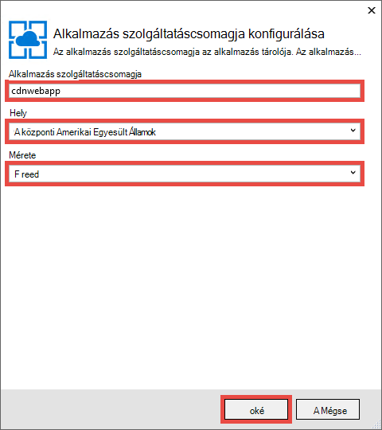

8. Kattintson a **Létrehozás** a webalkalmazás létrehozása.

    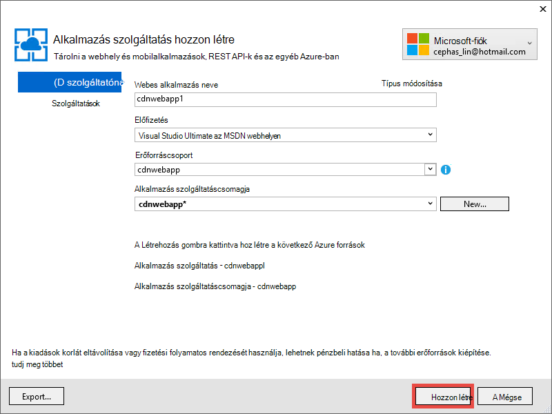

9. ASP.NET-alkalmazás létrehozása után a projekt közzététele Azure Azure alkalmazás szolgáltatási tevékenység ablakban kattintva **Közzététel `<app name>` a Web App most**. Kattintson a **Közzététel** a folyamat befejezéséhez.

    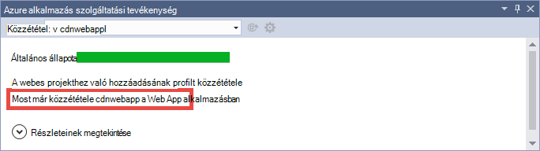

    Amikor befejeződött a közzétételi látni fogja az közzétett webalkalmazást a böngészőben. 

1. CDN végpont létrehozása, jelentkezzen be az [Azure-portálon](https://portal.azure.com). 
2. Kattintson a **+ Új** > **Media + CDN** > **CDN**.

    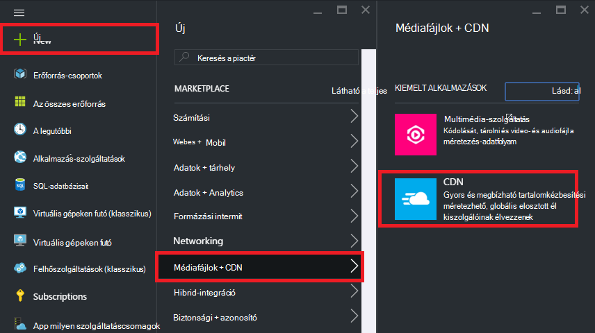

3. Adja meg a **hely**, az **erőforráscsoport**, **árak réteg** **CDN**, majd kattintson a **Létrehozás** gombra.

    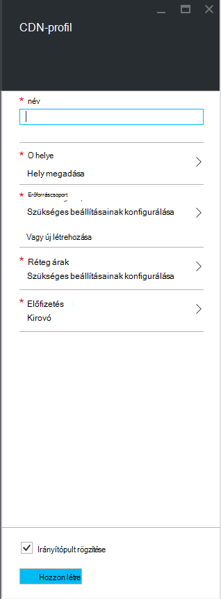   

4. **CDN-profil** lap kattintson **a + végpont** gombra. Adja meg egy nevet, jelölje be a **Webalkalmazás** az **Origin típusa** legördülő menü és a web App alkalmazásban, a **származási hostname (állomásnév)** legördülő, majd kattintson a **Hozzáadás**gombra.  

    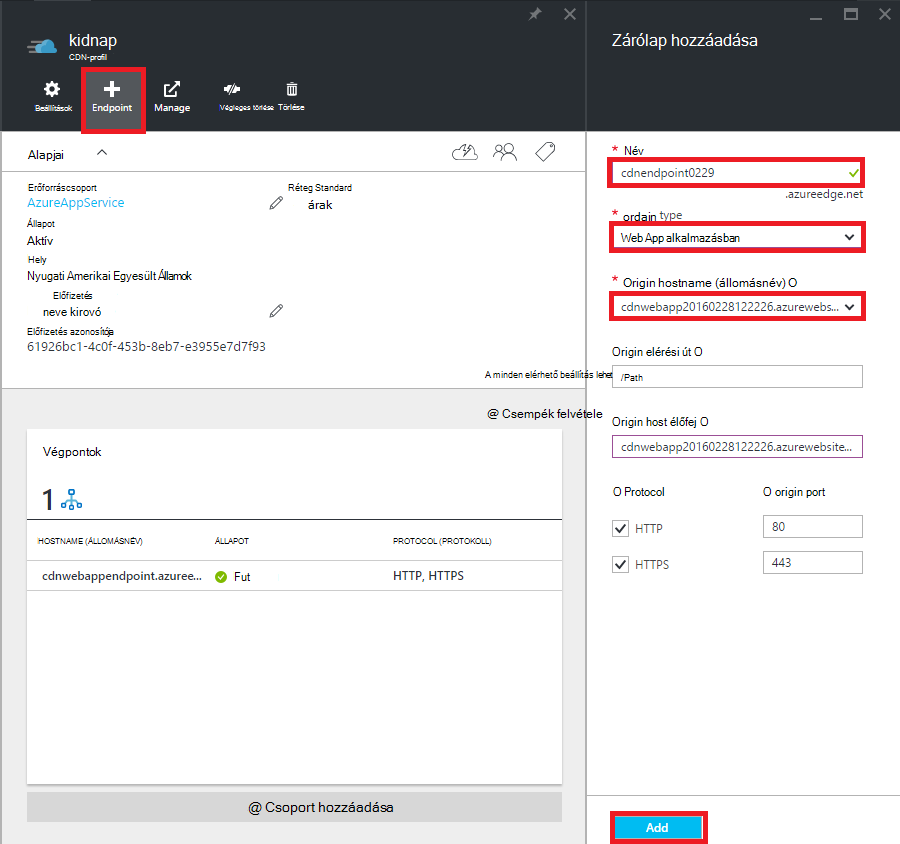


    > [AZURE.NOTE] Amikor létrejött a CDN-végpontot, a **Végpontok** lap kell követnie CDN URL-CÍMÉT, és integrálva van az origin tartományt. Amíg az összes CDN-csomópont hely kell teljesen propagálja az új CDN-végpontot konfiguráció is eltarthat. 

3. Vissza a **végpontot** lap, kattintson a nevére az imént létrehozott CDN-végpontot.

    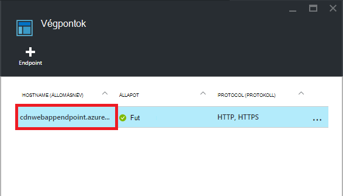

3. Kattintson a **Konfigurálás** gombra. A **beállítás** a lap jelölje be a **gyorsítótár minden egyedi URL-CÍMÉT** a **lekérdezési karakterlánc gyorsítótárazás viselkedése** legördülő listája, majd kattintson a **Mentés** gombra.


    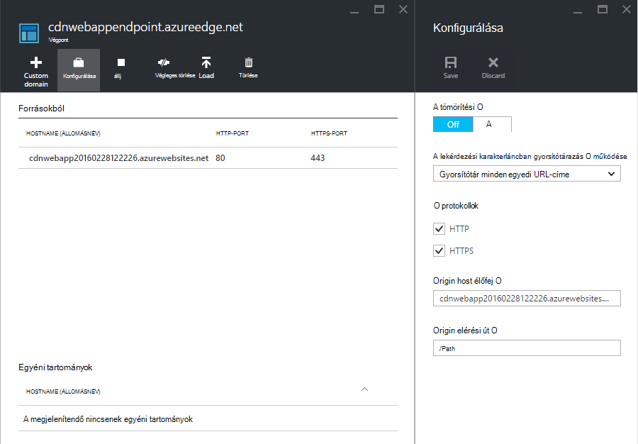

Engedélyezi ezt a beállítást, ha a gyorsítótárazott külön bejegyzésként ugyanaz a hivatkozás elérhető különböző lekérdezés karakterláncok kell.

>[AZURE.NOTE] A lekérdezési karakterlánc segítségével, így nem kell az e oktatóanyag, miközben szeretne tenni a korai óta bármilyen módosítást kényelmesebbé lehető itt fog propagálása az a CDN-csomópontok időt vehet igénybe, és nem szeretné, hogy az a CDN-gyorsítótár (frissítése CDN-tartalom tárgyalja később) be clog nem lekérdezés-karakterlánc-engedélyező tartalmakat.

2. Nyissa meg most a CDN végpontjának címe. Ha készen áll a végpontot, meg kell jelennie a web app jelenik meg. Ha egy **HTTP 404-es** hibaüzenet jelenik meg, az a CDN-végpontot nem áll készen. Előfordulhat, hogy várnia él csomópontok kell propagálja a CDN konfiguráció egy óra. 

    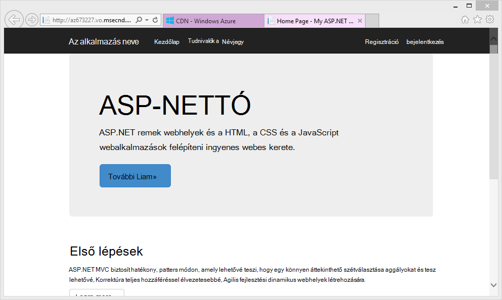

1. Ezután próbálkozzon a **~/Content/bootstrap.css** fájlt a ASP.NET projektben eléréséhez. A böngésző ablakában, nyissa meg * *http://*&lt;cdnName >*.azureedge.net/Content/bootstrap.css**. A beállítás Ez az URL a következő:

        http://az673227.azureedge.net/Content/bootstrap.css

    Amely megfelel az alábbi origin URL-címet a CDN-végpont:

        http://cdnwebapp.azurewebsites.net/Content/bootstrap.css

    Amikor visszalép * *http://*&lt;cdnName >*.azureedge.net/Content/bootstrap.css**, kérni fogja az Azure-ban az webalkalmazásból kapott bootstrap.css letöltése. 

    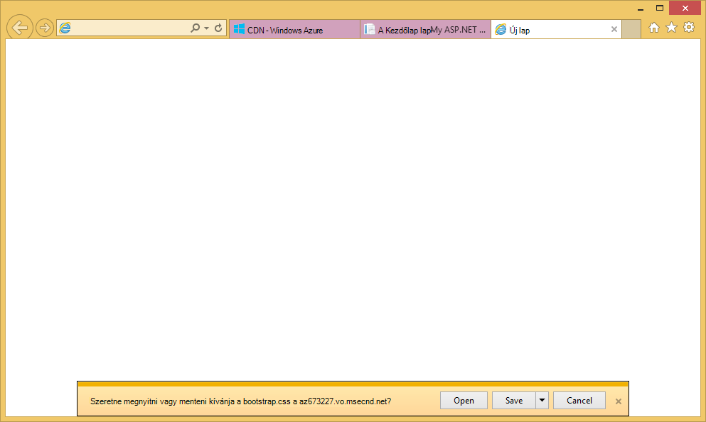

Hasonlóképpen érheti el minden nyilvánosan elérhető URL-CÍMÉT a * *http://*&lt;serviceName >*.cloudapp.net/** egyenesen az a CDN-végpontot. Példa:

-   A Script elérési .js fájl
-   Minden olyan tartalom a szülőszakasz/Content címkéje fájl elérési útja
-   Bármely vezérlő művelet 
-   Ha a lekérdezési karakterlánc engedélyezve van a CDN végpont, a lekérdezési karakterlánc bármely URL-címe
-   A teljes Azure web app, ha az összes tartalom nyilvános

Figyelje meg, hogy nem lehet mindig célszerű (vagy általában célszerű) kiszolgálására egy teljes Azure webalkalmazás Azure CDN keresztül. A telepítés által okozott problémák vannak:

-   Ez a módszer igényli a teljes webhely nyilvánosak, mivel a Azure CDN magánjellegű tartalmakat nem szolgál.
-   Ha valamilyen okból offline állapotba kerül az a CDN-végpontot, e ütemezett karbantartás vagy felhasználói hiba, a teljes web app offline állapotba kerül kivéve, ha a vevők átirányíthatja az origin URL-cím * *http://*&lt;sitename >*.azurewebsites.net/**. 
-   Még az egyéni beállításokkal gyorsítótár-vezérlők (lásd: [konfigurálása gyorsítótár-beállításai az Azure-webalkalmazásban statikus fájlokat](#configure-caching-options-for-static-files-in-your-azure-web-app)) a CDN-végpont nem javítja a nagyon dinamikus tartalom. Ha a Kezdőlap lap betöltése a CDN-végpontot, a fenti, értesítés, amely legalább 5 másodperc tartott betöltése alapértelmezett kezdőlapja meglehetősen egyszerű lap első alkalommal próbált. Tegyük fel, hogy mi történne ügyfélprogram az ezen az oldalon dinamikus tartalommal percenként frissítenie kell. Megfelelője a CDN-végpont gyakori gyorsítótár mért sikertelen találatok rövid gyorsítótár lejárat felszolgálásához egy CDN-végpontot dinamikus tartalom van szükség. Ez az Azure webalkalmazást teljesítményének hurts, és defeats a CDN célját.

Ez esetben határozza meg, milyen tartalmakat szolgáló az Azure CDN-eseti alapon az Azure-webalkalmazásban. Emiatt már rendelkezik látott egyes tartalom fájlok elérése az a CDN-végpontot. E kell követnie egy adott vezérlő művelet keresztül az a CDN-végpontot kiszolgálására a [vezérlő műveletek Azure CDN-től a tartalmat](#serve-content-from-controller-actions-through-azure-cdn).

## <a name="configure-caching-options-for-static-files-in-your-azure-web-app"></a>Az Azure-webalkalmazásban statikus fájlok gyorsítótár beállításainak konfigurálása ##

Azure CDN-integrációval az Azure-webalkalmazásban megadhatja, hogy gyorsítótárba helyezhető az a CDN-végpont statikus tartalommá módját. Ehhez nyissa meg a *Web.config* a ASP.NET projektből (pl. **cdnwebapp**), és adja hozzá a `<staticContent>` elem `<system.webServer>`. Az alábbi XML konfigurálja a gyorsítótár 3 nap múlva lejár.  

    <system.webServer>
      <staticContent>
        <clientCache cacheControlMode="UseMaxAge" cacheControlMaxAge="3.00:00:00"/>
      </staticContent>
      ...
    </system.webServer>

Miután ezt megtette, az Azure-webalkalmazásban összes statikus fájl megfigyelheti az a CDN-gyorsítótár ugyanezt a szabályt. Pontosabban szabályozhatja a gyorsítótár beállításainak hozzáadása *egy fájlt* egy mappába, és adja hozzá a beállításokat. Például hozzáadása *egy fájlt* a *\Content* mappába, és a tartalom cserélje ki az alábbi XML-fájl:

    <?xml version="1.0"?>
    <configuration>
      <system.webServer>
        <staticContent>
          <clientCache cacheControlMode="UseMaxAge" cacheControlMaxAge="15.00:00:00"/>
        </staticContent>
      </system.webServer>
    </configuration>

E beállítás hatására a *\Content* mappából, hogy gyorsítótárba helyezhető-15 nap összes statikus fájlokat.

További információt, hogy miként kell beállítani a `<clientCache>` elem, lásd: [ügyfél gyorsítótárának &lt;clientCache >](http://www.iis.net/configreference/system.webserver/staticcontent/clientcache).

A következő szakaszban lehet is megtudhatja, hogyan konfigurálása a gyorsítótár beállításainak vezérlő művelet eredménye az a CDN-gyorsítótár.

## <a name="serve-content-from-controller-actions-through-azure-cdn"></a>A vezérlő műveletek Azure CDN keresztül tartalmat ##

Web Apps alkalmazások integrálása Azure CDN, esetén viszonylag egyszerű vezérlő műveletek az Azure CDN-től a tartalmat. Újra Ha úgy dönt, hogy a teljes Azure webalkalmazás keresztül a CDN szolgálnak, akkor nem kell kövesse az alábbi lépéseket minden mivel az összes vezérlő műveletek elérhetők az a CDN már. De lehet már ki emelni, a [Deploy az Azure-webappokban az integrált CDN zárólap](#deploy-a-web-app-to-azure-with-an-integrated-cdn-endpoint)okokból kifolyólag, előfordulhat, hogy ez ellen döntse el, és válassza inkább a válassza ki a vezérlő az Azure CDN szolgáló. [Martin Balliauw](https://twitter.com/maartenballiauw) bemutatja, hogyan egy kis játék a [csökkentése késés az Azure CDN a weben](http://channel9.msdn.com/events/TechDays/Techdays-2014-the-Netherlands/Reducing-latency-on-the-web-with-the-Windows-Azure-CDN)MemeGenerator vezérlő tesz. E fog egyszerűen Reprodukálja, itt.

Tegyük fel, hogy a webalkalmazásban szeretne előállítani memes alapján fiatal tokmányba Norris képként ( [Zsolt](http://www.flickr.com/photos/alan-light/218493788/)fény fényképpel) jelennek meg:


Van egy egyszerű `Index` műveletet, amely lehetővé teszi a felhasználóknak a felsőfokú melléknevek adhat meg a képet, majd hozza létre a meme után azok bejegyzéseket tehet közzé a műveletet. Mivel ez éppen tokmányba Norris, várható válhat menet népszerű globálisan a lapon. Ez a jó példa félig dinamikus tartalom felszolgálásához az Azure CDN. 

Kövesse a fenti vezérlő művelet beállítása:

1. A *\Controllers* mappában .cs *MemeGeneratorController.cs* nevű új fájl létrehozása, és cserélje le a tartalom a következő kódot. A fájl elérési útját helyettesítő `~/Content/chuck.bmp` és a CDN nevét `yourCDNName`.


        using System;
        using System.Collections.Generic;
        using System.Diagnostics;
        using System.Drawing;
        using System.IO;
        using System.Net;
        using System.Web.Hosting;
        using System.Web.Mvc;
        using System.Web.UI;

        namespace cdnwebapp.Controllers
        {
          public class MemeGeneratorController : Controller
          {
            static readonly Dictionary<string, Tuple<string ,string>> Memes = new Dictionary<string, Tuple<string, string>>();

            public ActionResult Index()
            {
              return View();
            }

            [HttpPost, ActionName("Index")]
            public ActionResult Index_Post(string top, string bottom)
            {
              var identifier = Guid.NewGuid().ToString();
              if (!Memes.ContainsKey(identifier))
              {
                Memes.Add(identifier, new Tuple<string, string>(top, bottom));
              }

              return Content("<a href=\"" + Url.Action("Show", new {id = identifier}) + "\">here's your meme</a>");
            }

            [OutputCache(VaryByParam = "*", Duration = 1, Location = OutputCacheLocation.Downstream)]
            public ActionResult Show(string id)
            {
              Tuple<string, string> data = null;
              if (!Memes.TryGetValue(id, out data))
              {
                return new HttpStatusCodeResult(HttpStatusCode.NotFound);
              }

              if (Debugger.IsAttached) // Preserve the debug experience
              {
                return Redirect(string.Format("/MemeGenerator/Generate?top={0}&bottom={1}", data.Item1, data.Item2));
              }
              else // Get content from Azure CDN
              {
                return Redirect(string.Format("http://<yourCDNName>.azureedge.net/MemeGenerator/Generate?top={0}&bottom={1}", data.Item1, data.Item2));
              }
            }

            [OutputCache(VaryByParam = "*", Duration = 3600, Location = OutputCacheLocation.Downstream)]
            public ActionResult Generate(string top, string bottom)
            {
              string imageFilePath = HostingEnvironment.MapPath("~/Content/chuck.bmp");
              Bitmap bitmap = (Bitmap)Image.FromFile(imageFilePath);

              using (Graphics graphics = Graphics.FromImage(bitmap))
              {
                SizeF size = new SizeF();
                using (Font arialFont = FindBestFitFont(bitmap, graphics, top.ToUpperInvariant(), new Font("Arial Narrow", 100), out size))
                {
                    graphics.DrawString(top.ToUpperInvariant(), arialFont, Brushes.White, new PointF(((bitmap.Width - size.Width) / 2), 10f));
                }
                using (Font arialFont = FindBestFitFont(bitmap, graphics, bottom.ToUpperInvariant(), new Font("Arial Narrow", 100), out size))
                {
                    graphics.DrawString(bottom.ToUpperInvariant(), arialFont, Brushes.White, new PointF(((bitmap.Width - size.Width) / 2), bitmap.Height - 10f - arialFont.Height));
                }
              }
              MemoryStream ms = new MemoryStream();
              bitmap.Save(ms, System.Drawing.Imaging.ImageFormat.Png);
              return File(ms.ToArray(), "image/png");
            }

            private Font FindBestFitFont(Image i, Graphics g, String text, Font font, out SizeF size)
            {
              // Compute actual size, shrink if needed
              while (true)
              {
                size = g.MeasureString(text, font);

                // It fits, back out
                if (size.Height < i.Height &&
                     size.Width < i.Width) { return font; }

                // Try a smaller font (90% of old size)
                Font oldFont = font;
                font = new Font(font.Name, (float)(font.Size * .9), font.Style);
                oldFont.Dispose();
              }
            }
          }
        }

2. Kattintson a jobb gombbal az alapértelmezett `Index()` művelet, és válassza a **Nézet hozzáadása**.

    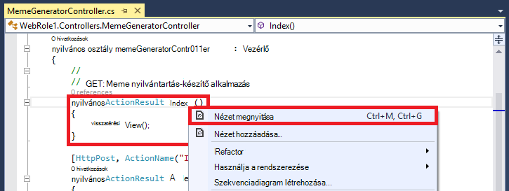

3.  Fogadja el az alábbi beállításokat, és kattintson a **Hozzáadás**gombra.

    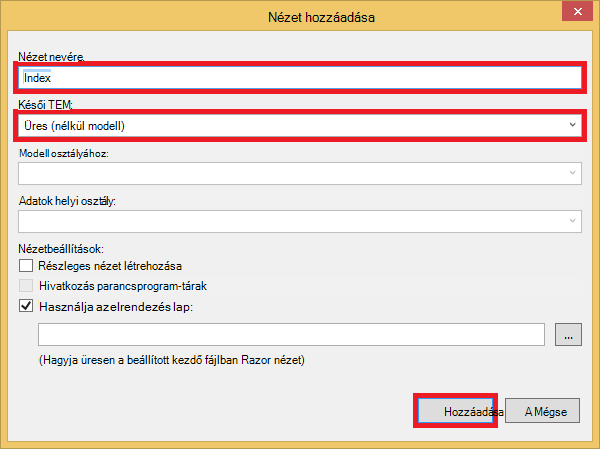

4. Nyissa meg az új *Views\MemeGenerator\Index.cshtml* , és cserélje le a tartalom a következő egyszerű HTML a felsőfokú melléknevek elküldése:

        <h2>Meme Generator</h2>
        
        <form action="" method="post">
            <input type="text" name="top" placeholder="Enter top text here" />
            <br />
            <input type="text" name="bottom" placeholder="Enter bottom text here" />
            <br />
            <input class="btn" type="submit" value="Generate meme" />
        </form>

5. Ismét közzététele az Azure web App alkalmazásban, és kattintson az * *http://*&lt;serviceName >*.cloudapp.net/MemeGenerator/Index** a böngészőben. 

Amikor az űrlapértékek elküldése `/MemeGenerator/Index`, a `Index_Post` művelet módszer mutató hivatkozást ad vissza az `Show` művelet módszer a megfelelő beviteli azonosítójú. Ha a hivatkozás gombra kattint, érhető el a következő kódot:  

    [OutputCache(VaryByParam = "*", Duration = 1, Location = OutputCacheLocation.Downstream)]
    public ActionResult Show(string id)
    {
      Tuple<string, string> data = null;
      if (!Memes.TryGetValue(id, out data))
      {
        return new HttpStatusCodeResult(HttpStatusCode.NotFound);
      }

      if (Debugger.IsAttached) // Preserve the debug experience
      {
        return Redirect(string.Format("/MemeGenerator/Generate?top={0}&bottom={1}", data.Item1, data.Item2));
      }
      else // Get content from Azure CDN
      {
        return Redirect(string.Format("http://<yourCDNName>.azureedge.net/MemeGenerator/Generate?top={0}&bottom={1}", data.Item1, data.Item2));
      }
    }

Ha a helyi hibakereső van csatolva, majd fog kapni a normál hibakeresési felület és a helyi átirányítást. Ha elindult a Azure web App alkalmazásban, majd azt úgy irányítja át a:

    http://<yourCDNName>.azureedge.net/MemeGenerator/Generate?top=<formInput>&bottom=<formInput>

Amely megfelel az alábbi origin URL-címet a CDN-végpont:

    http://<yourSiteName>.azurewebsites.net/cdn/MemeGenerator/Generate?top=<formInput>&bottom=<formInput>

URL-CÍMÉT a korábban alkalmazott szabályhoz átírásának, miután tényleges a CDN végpontra kap gyorsítótárazott fájl:

    http://<yourSiteName>.azurewebsites.net/MemeGenerator/Generate?top=<formInput>&bottom=<formInput>

Ezután felhasználhatja a `OutputCacheAttribute` a attribútum a `Generate` használatával adja meg, hogyan művelet eredménye gyorsítótárba, amely az Azure CDN akkor figyelembe veszi. Az alábbi kód adja meg a gyorsítótár lejárati 1 óra (3600 másodpercet).

    [OutputCache(VaryByParam = "*", Duration = 3600, Location = OutputCacheLocation.Downstream)]

Hasonlóképpen, szolgálhat olyan vezérlő tevékenységtől tartalmat az Azure-webalkalmazásban keresztül az Azure CDN a kívánt gyorsítótárazási lehetőség.

A következő szakaszban lehet megtudhatja, hogy miként kiszolgálására a kötegelt és minified parancsprogramokat és a CSS Azure CDN keresztül. 

## <a name="integrate-aspnet-bundling-and-minification-with-azure-cdn"></a>ASP.NET hozzákapcsolása és minification integrálása az Azure CDN ##

Parancsfájlok és CSS stíluslapok ritkán módosíthatja, és az Azure CDN-gyorsítótár elsődleges vár. A teljes webhely alkalmazását az Azure CDN szolgáló legkönnyebben hozzákapcsolása és minification integrálása az Azure CDN. Azonban [az Azure web app szolgálják statikus tartalmak és a Azure CDN a webhely lapjait az Azure CDN zárólap Integrate](#deploy-a-web-app-to-azure-with-an-integrated-cdn-endpoint)ismertetett okokból ellen ezt a módszert választhatja, mint lehet megtudhatja, hogy miként adunk ASP.NET hozzákapcsolása és minification, a kívánt develper felület megőrizve:

-   Nagy hibakeresési mód élmény
-   Egyszerűsített telepítési
-   Az ügyfelek számára a parancsfájlt vagy egyéni Stíluslap verziófrissítések azonnali frissítések
-   Ha a CDN-végpontot nem sikerül alaplekérdezések mechanizmusa
-   Kód módosításának kisméretűvé alakítása

A projektben ASP.NET [Integrate az Azure web app szolgálják statikus tartalmak és a Azure CDN a webhely lapjait az Azure CDN zárólap](#deploy-a-web-app-to-azure-with-an-integrated-cdn-endpoint)létrehozott, nyissa meg a *App_Start\BundleConfig.cs* , és tekintse meg a `bundles.Add()` módszer hívásokat.

    public static void RegisterBundles(BundleCollection bundles)
    {
        bundles.Add(new ScriptBundle("~/bundles/jquery").Include(
                    "~/Scripts/jquery-{version}.js"));
        ...
    }

Az első `bundles.Add()` utasítás hozzáad egy parancsprogramot az első lépésekhez a virtuális könyvtár `~/bundles/jquery`. Ezután nyissa meg *Views\Shared\_Layout.cshtml* hogyan script az első lépésekhez címke leképezésének módját megjelenítéséhez. Látnia kell a következő sort Razor kód megkeresése:

    @Scripts.Render("~/bundles/jquery")

Razor kód futtatásakor a Azure web App alkalmazásban ezt meg egy `<script>` címkét a parancsprogram köteget, az alábbihoz hasonló: 

    <script src="/bundles/jquery?v=FVs3ACwOLIVInrAl5sdzR2jrCDmVOWFbZMY6g6Q0ulE1"></script>

Azonban, hogy futtatásakor a Visual Studióban beírásával `F5`, akkor fogja jeleníti meg a minden parancsfájl az első lépésekhez egyenként (fenti esetben csak egy parancsprogram jelenik meg az első lépésekhez):

    <script src="/Scripts/jquery-1.10.2.js"></script>

Ez lehetővé teszi, hogy a fejlesztői környezet JavaScript-kód hibakeresési, miközben csökkentése egyidejű ügyfélkapcsolatok (hozzákapcsolása), és javítása a fájl letöltése teljesítmény (minification) gyártási. Azure CDN-integrációval megtartása remek lehetőség. Ezenkívül leképezett az első lépésekhez már tartalmazza az automatikusan generált verzió karakterlánc, mivel kívánt való replikáció a funkció, hogy ha frissíti a NuGet jQuery verzióból, frissíthető, az ügyfél oldalán minél korábban beállítást.

Kövesse az alábbi integrációs ASP.NET hozzákapcsolása és minification a CDN végponttal.

1. Vissza a *App_Start\BundleConfig.cs*, módosítsa a `bundles.Add()` módszereket, amelyekkel használja egy másik [az első lépésekhez konstruktor](http://msdn.microsoft.com/library/jj646464.aspx), egy CDN címet ad meg. Ehhez cserélje le a `RegisterBundles` módszer definition kódot a következő:  
    
        public static void RegisterBundles(BundleCollection bundles)
        {
          bundles.UseCdn = true;
          var version = System.Reflection.Assembly.GetAssembly(typeof(Controllers.HomeController))
            .GetName().Version.ToString();
          var cdnUrl = "http://<yourCDNName>.azureedge.net/{0}?" + version;

          bundles.Add(new ScriptBundle("~/bundles/jquery", string.Format(cdnUrl, "bundles/jquery")).Include(
                "~/Scripts/jquery-{version}.js"));

          bundles.Add(new ScriptBundle("~/bundles/jqueryval", string.Format(cdnUrl, "bundles/jqueryval")).Include(
                "~/Scripts/jquery.validate*"));

          // Use the development version of Modernizr to develop with and learn from. Then, when you're
          // ready for production, use the build tool at http://modernizr.com to pick only the tests you need.
          bundles.Add(new ScriptBundle("~/bundles/modernizr", string.Format(cdnUrl, "bundles/modernizr")).Include(
                "~/Scripts/modernizr-*"));

          bundles.Add(new ScriptBundle("~/bundles/bootstrap", string.Format(cdnUrl, "bundles/bootstrap")).Include(
                "~/Scripts/bootstrap.js",
                "~/Scripts/respond.js"));

          bundles.Add(new StyleBundle("~/Content/css", string.Format(cdnUrl, "Content/css")).Include(
                "~/Content/bootstrap.css",
                "~/Content/site.css"));
        }


    Helyére ne felejtse el `<yourCDNName>` az Azure CDN a nevet.

    Az egyszerű szavakat, állít be `bundles.UseCdn = true` gondosan megfogalmazott CDN URL-címe hozzáadott minden az első lépésekhez és. Ha például az első konstruktort be a kódot:

        new ScriptBundle("~/bundles/jquery", string.Format(cdnUrl, "bundles/jquery"))

    megegyezik a következővel: 

        new ScriptBundle("~/bundles/jquery", string.Format(cdnUrl, "http://<yourCDNName>.azureedge.net/bundles/jquery?<W.X.Y.Z>"))

    Ez a konstruktor Ez az ASP.NET hozzákapcsolása és minification jeleníti meg, amikor helyileg indítja egyéni parancsfájlok, de a megadott CDN-cím használata a szóban forgó parancsfájl eléréséhez. Megjegyzendő, két fontos jellemzőit gondosan megfogalmazott CDN URL-címe:
    
    - Az a CDN URL-CÍMÉT az origin mező is `http://<yourSiteName>.azurewebsites.net/bundles/jquery?<W.X.Y.Z>`, amely olyan, hogy valójában a parancsprogram az első lépésekhez a webalkalmazás virtuális könyvtár.
    - CDN-konstruktor használja, mivel a CDN parancsprogram-az első lépésekhez már nem címkében az automatikusan generált verzió karakterlánc leképezett URL-címét. Egyedi verzió karakterlánc manuálisan kell létrehozni, minden alkalommal, amikor a parancsprogram az első lépésekhez gyorsítótár mért sikertelen az Azure CDN a találatok kényszerítése módosul. Egy időben Ez a verzió egyedi karakterlánc állandónak kell a telepítés után a kötegben telepíti, teljes méret az Azure CDN a gyorsítótár-találatok élettartama keresztül.

3. A lekérdezési karakterlánc `<W.X.Y.Z>` *Properties\AssemblyInfo.cs* lekéri a ASP.NET projektben. A telepítési munkafolyamatot, amely tartalmazza az összeállítás-verzió növekvő, minden alkalommal, amikor az Azure segítségével teszi közzé is. Vagy *Properties\AssemblyInfo.cs* csak módosíthatja a projekt automatikusan növeléséről a verziószámot tartalmazó karakterlánc, minden alkalommal, amikor hoz létre, a helyettesítő karakter használata "*". Például módosítása `AssemblyVersion` alább látható módon:
    
        [assembly: AssemblyVersion("1.0.0.*")]
    
    Egyszerűsítheti a telepítés élettartama egy egyedi karakterláncot létrehozása más stratégia itt működni fog.

3. Közzétenni az ASP.NET-alkalmazást, és a Kezdőlap lap eléréséhez.
 
4. A HTML-kódot az oldal megtekintése. Látnia kell a CDN való megjelenítését, minden alkalommal, amikor a változtatásokat az Azure web App alkalmazásban ismét közzéteheti egyedi verzió karakterláncot tartalmazó URL-cím megjelenítéséhez. Példa:  
    
        ...
        <link href="http://az673227.azureedge.net/Content/css?1.0.0.25449" rel="stylesheet"/>
        <script src="http://az673227.azureedge.net/bundles/modernizer?1.0.0.25449"></script>
        ...
        <script src="http://az673227.azureedge.net/bundles/jquery?1.0.0.25449"></script>
        <script src="http://az673227.azureedge.net/bundles/bootstrap?1.0.0.25449"></script>
        ...

5. A Visual Studióban, az ASP.NET alkalmazás hibakeresése a Visual Studióban beírásával `F5`., 

6. A HTML-kódot az oldal megtekintése. Minden egyes külön-külön való megjelenítését, hogy egy egységes hibakeresési felület a Visual Studióban lehet parancsfájl továbbra is látni fogja.  
    
        ...
        <link href="/Content/bootstrap.css" rel="stylesheet"/>
        <link href="/Content/site.css" rel="stylesheet"/>
        <script src="/Scripts/modernizr-2.6.2.js"></script>
        ...
        <script src="/Scripts/jquery-1.10.2.js"></script>
        <script src="/Scripts/bootstrap.js"></script>
        <script src="/Scripts/respond.js"></script>
        ...    

## <a name="fallback-mechanism-for-cdn-urls"></a>CDN-URL-címek alaplekérdezések mechanizmusa ##

Bármilyen okból sikertelen az Azure CDN-végpontot, ha azt szeretné, a weblap és ügyeljen arra, elég a JavaScript- és betöltő megoldásként origin webkiszolgálón eléréséhez. Elveszíti a web App miatt CDN elérhetetlenség, de sokkal több nagyon gyenge hálózati minőség elveszíti a parancsprogramokat és a stíluslapok kulcsfontosságú lap funkcióit képek elég komoly.

Az [első lépésekhez](http://msdn.microsoft.com/library/system.web.optimization.bundle.aspx) osztály [CdnFallbackExpression](http://msdn.microsoft.com/library/system.web.optimization.bundle.cdnfallbackexpression.aspx) , amely lehetővé teszi, hogy az a CDN-hiba alaplekérdezések eljárás konfigurálása nevű tulajdonságot tartalmazza. Ez a tulajdonság használatához kövesse az alábbi lépéseket:

1. Nyissa meg a ASP.NET projekt *App_Start\BundleConfig.cs*, ahová felvette a CDN URL-címet az egyes [az első lépésekhez konstruktor](http://msdn.microsoft.com/library/jj646464.aspx), és hozzáadása `CdnFallbackExpression` négy helyen kód egy alaplekérdezések mechanizmusa hozzáadása az alapértelmezett kötegeket látható módon.  
    
        public static void RegisterBundles(BundleCollection bundles)
        {
          var version = System.Reflection.Assembly.GetAssembly(typeof(BundleConfig))
            .GetName().Version.ToString();
          var cdnUrl = "http://cdnurl.azureedge.net/.../{0}?" + version;
          bundles.UseCdn = true;

          bundles.Add(new ScriptBundle("~/bundles/jquery", string.Format(cdnUrl, "bundles/jquery")) 
                { CdnFallbackExpression = "window.jquery" }
                .Include("~/Scripts/jquery-{version}.js"));

          bundles.Add(new ScriptBundle("~/bundles/jqueryval", string.Format(cdnUrl, "bundles/jqueryval")) 
                { CdnFallbackExpression = "$.validator" }
                .Include("~/Scripts/jquery.validate*"));

          // Use the development version of Modernizr to develop with and learn from. Then, when you're
          // ready for production, use the build tool at http://modernizr.com to pick only the tests you need.
          bundles.Add(new ScriptBundle("~/bundles/modernizr", string.Format(cdnUrl, "bundles/modernizer")) 
                { CdnFallbackExpression = "window.Modernizr" }
                .Include("~/Scripts/modernizr-*"));

          bundles.Add(new ScriptBundle("~/bundles/bootstrap", string.Format(cdnUrl, "bundles/bootstrap"))     
                { CdnFallbackExpression = "$.fn.modal" }
                .Include(
                        "~/Scripts/bootstrap.js",
                        "~/Scripts/respond.js"));

          bundles.Add(new StyleBundle("~/Content/css", string.Format(cdnUrl, "Content/css")).Include(
                "~/Content/bootstrap.css",
                "~/Content/site.css"));
        }

    Ha `CdnFallbackExpression` van nem null parancsfájl van beékelt ellenőrizze, hogy a köteg sikeresen betöltött-e, és, ha nem, az első lépésekhez eléréséhez közvetlenül a webes forráskiszolgálóval a HTML-be. Ez a tulajdonság kell a JavaScript-kifejezés, amely azt vizsgálja, hogy a megfelelő CDN az első lépésekhez megfelelően töltődik be kell állítani. A kifejezés minden az első lépésekhez ellenőrzéséhez szükséges működik aszerint, hogy a tartalmat. A fenti alapértelmezett kötegeket:
    
    - `window.jquery`jquery-{verzió} .js könyvjelzőnév
    - `$.validator`a könyvjelzőnév jquery.validate.js
    - `window.Modernizr`a könyvjelzőnév .js modernizer-{verzió}
    - `$.fn.modal`bootstrap.js könyvjelzőnév
    
    Akkor lehet, hogy láthatta, hogy e nem adta meg az CdnFallbackExpression a `~/Cointent/css` az első lépésekhez. Ennek oka, hogy jelenleg csak egy [System.Web.Optimization hibáját](https://aspnetoptimization.codeplex.com/workitem/104) beszúrhatja egy `<script>` helyett a várható a visszalépési CSS-címke `<link>` címke.
    
    Van, akkor jó helyen jár, egy jó [Stílus az első lépésekhez Visszalépés](https://github.com/EmberConsultingGroup/StyleBundleFallback) [Decemberéig tanácsadási csoport](https://github.com/EmberConsultingGroup)által kínált. 

2. Használni szeretné a megoldáshoz CSS, .cs új fájl létrehozása a ASP.NET projekt *App_Start* mappába *StyleBundleExtensions.cs*, és cserélje le a tartalmát a [GitHub kódot](https://github.com/EmberConsultingGroup/StyleBundleFallback/blob/master/Website/App_Start/StyleBundleExtensions.cs). 

4. A *App_Start\StyleFundleExtensions.cs*nevezze át a névtér az ASP.NET-alkalmazás névtér (pl. **cdnwebapp**). 

3. Való visszatéréshez `App_Start\BundleConfig.cs` és cserélje ki az utolsó `bundles.Add` utasítás a következő kódot:  

        bundles.Add(new StyleBundle("~/Content/css", string.Format(cdnUrl, "Content/css"))
          .IncludeFallback("~/Content/css", "sr-only", "width", "1px")
          .Include(
            "~/Content/bootstrap.css",
            "~/Content/site.css"));

    Az új bővítmény módszert használja az azonos arról ellenőrizni a DOM-a HTML-kód parancsfájl a egy egyező osztálynév, a szabály neve és a szabály érték, ha nem sikerül az egyezés a CSS-fájlok az első lépésekhez, és visszatérhet a forráskiszolgálóval webes esik definiálva.

4. Újra közzététele az Azure-webalkalmazást, és a Kezdőlap lap eléréséhez. 
5. A HTML-kódot az oldal megtekintése. Keresse meg a parancsfájlok bejuttatott az alábbihoz hasonló:    
    
    ```
    ...
    <link href="http://az673227.azureedge.net/Content/css?1.0.0.25474" rel="stylesheet"/>
<script>(function() {
                var loadFallback,
                    len = document.styleSheets.length;
                for (var i = 0; i < len; i++) {
                    var sheet = document.styleSheets[i];
                    if (sheet.href.indexOf('http://az673227.azureedge.net/Content/css?1.0.0.25474') !== -1) {
                        var meta = document.createElement('meta');
                        meta.className = 'sr-only';
                        document.head.appendChild(meta);
                        var value = window.getComputedStyle(meta).getPropertyValue('width');
                        document.head.removeChild(meta);
                        if (value !== '1px') {
                            document.write('<link href="/Content/css" rel="stylesheet" type="text/css" />');
                        }
                    }
                }
                return true;
            }())||document.write('<script src="/Content/css"><\/script>');</script>

    <script src="http://az673227.azureedge.net/bundles/modernizer?1.0.0.25474"></script>
    <script>(window.Modernizr)||document.write('<script src="/bundles/modernizr"><\/script>');</script>
    ... 
    <script src="http://az673227.azureedge.net/bundles/jquery?1.0.0.25474"></script>
    <script>(window.jquery)||document.write('<script src="/bundles/jquery"><\/script>');</script>

    <script src="http://az673227.azureedge.net/bundles/bootstrap?1.0.0.25474"></script>
    <script>($.fn.modal)||document.write('<script src="/bundles/bootstrap"><\/script>');</script>
    ...
    ```

    Figyelje meg, hogy a CSS-fájlok az első lépésekhez bejuttatott parancsfájl továbbra is tartalmaz az errant tartós a a `CdnFallbackExpression` tulajdonság a sorban lévő:

        }())||document.write('<script src="/Content/css"><\/script>');</script>

    De óta első része a. kifejezés mindig true (a közvetlenül fölötte, amely a vonalra) ad vissza, a document.write() függvény soha nem futtathatók.

6. Annak ellenőrzéséhez, hogy működik-e a visszalépési parancsfájl, térjen vissza a lap a CDN-végpontot, és kattintson a **Leállítás**gombra.

    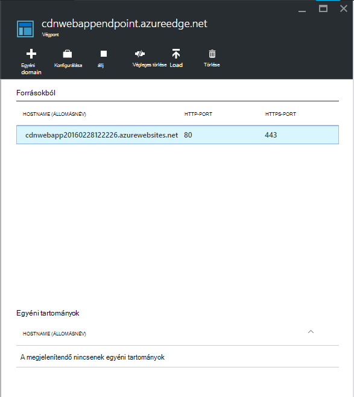

7. Frissítse a böngészőablakot, az Azure webalkalmazásban. Most már látnia kell, hogy az összes parancsfájlok és stíluslapok megfelelően betöltve.

## <a name="more-information"></a>További információ 
- [Az Azure Tartalomkézbesítési hálózatai (CDN) – áttekintés](../cdn/cdn-overview.md)
- [Azure CDN használatával](../cdn/cdn-create-new-endpoint.md)
- [Egy felhőalapú szolgáltatásba integrálása az Azure CDN](../cdn/cdn-cloud-service-with-cdn.md)
- [ASP.NET hozzákapcsolása és Minification](http://www.asp.net/mvc/tutorials/mvc-4/bundling-and-minification)

