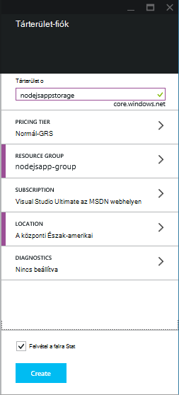

<properties
    pageTitle="Az Azure-táblából szolgáltatással node.js webalkalmazás"
    description="Ebben az oktatóanyagban útmutatást ad az Azure-táblából szolgáltatás használata az Azure-alkalmazás szolgáltatás webalkalmazásokban adattárolásra üzemelteti, amely Node.js alkalmazásból."
    tags="azure-portal"
    services="app-service\web, storage"
    documentationCenter="nodejs"
    authors="rmcmurray"
    manager="wpickett"
    editor=""/>

<tags
    ms.service="storage"
    ms.workload="storage"
    ms.tgt_pltfrm="na"
    ms.devlang="nodejs"
    ms.topic="article"
    ms.date="08/11/2016"
    ms.author="robmcm"/>

# Az Azure-táblából szolgáltatással node.js webalkalmazás

## – Áttekintés

Ebben az oktatóanyagban bemutatja, hogyan mentheti és nyithatja adatok az [Azure alkalmazás szolgáltatás](http://go.microsoft.com/fwlink/?LinkId=529714) Web Apps alkalmazásokban is [csomópontot] alkalmazásból Azure adatkezelés által megadott táblázat szolgáltatás használatával. Ebben az oktatóanyagban feltételezi, hogy nincs néhány előzetes használatában csomópontot, és [mely számjegy].

Ismerkedhet meg:

* A csomópont-modulok telepítése npm (csomópont csomag kezelő) használata

* Az Azure-táblából szolgáltatás használata

* Hogyan használhatók az Azure CLI egy webalkalmazás létrehozása.

Ebben az oktatóanyagban követve egy egyszerű webes gyűjt "Feladatlista" alkalmazást, amely lehetővé teszi a hozhat létre, beolvasása és -feladatok végrehajtásával. A feladatok tábla szolgáltatásban tárolja.

Az alábbiakban a kész alkalmazást:

![Egy üres tasklist megjelenítő weblap][node-table-finished]

>[AZURE.NOTE] Ha azt szeretné, mielőtt feliratkozna az Azure-fiók használatbavételéhez Azure alkalmazás szolgáltatás, [Próbálja meg alkalmazás szolgáltatás](http://go.microsoft.com/fwlink/?LinkId=523751), ahol azonnal létrehozhat egy rövid életű starter web app alkalmazás szolgáltatásban megnyitásához. Nem kötelező, hitelkártyák Nincs nyilatkozatát.

## Előfeltételek

Ez a cikk utasításait követve, előtt győződjön meg arról, hogy az alábbi programok telepítése:

* [csomópont] verzió 0.10.24 vagy újabb

* [Mely számjegy]

[AZURE.INCLUDE [create-account-and-websites-note](../../includes/create-account-and-websites-note.md)]

## Tárterület-fiók létrehozása

Azure tároló fiókot létrehozni. Az alkalmazás a feladatlista-elemek tárolása ebben a fiókban fogja használni.

1.  Jelentkezzen be az [Azure-portálon](https://portal.azure.com/).

2. Kattintson a portál bal alul az **Új** ikonra, majd kattintson az **adatok + tárhely** > **tároló**. Írja be a tárterület-fiók egy egyedi nevet, és hozzon létre egy új [erőforráscsoport](../azure-resource-manager/resource-group-overview.md) azt.

    

    A tároló fiók létrehozásakor a **értesítések** gomb fog flash zöld **SUCCESS** , és a tárterület-fiókot a lap megnyitva, kattintva jelenítse meg, hogy az Ön által létrehozott új erőforráscsoport tartozik.

5. A tároló fiók lap, kattintson a **Beállítások** > **kulcsok**. Az access elsődleges kulcs másolja a vágólapra.

    ![Hívóbetű][portal-storage-access-keys]

##Modul telepítése, és állványon készítése

Ez a szakasz hozzon létre egy új csomópont alkalmazást, és npm használatával adja hozzá a modul csomagokat. Ehhez az alkalmazáshoz a [Express] és [Azure] modulok fogja használni. A Express modul modell nézet vezérlő keretet biztosít csomópontot, miközben az Azure modulok kapcsolatot a táblázat szolgáltatást biztosít.

### Express telepítése és állványon készítése

1. A parancssorból **tasklist** és váltás nevű új könyvtár létrehozása a könyvtárra.  

2. Írja be a következő parancsot a Express modul telepítése.

        npm install express-generator@4.2.0 -g

    Az operációs rendszertől függően előfordulhat, hogy kell életbe léptetni "sudo" a parancs előtt:

        sudo npm install express-generator@4.2.0 -g

    A kimenet jelenik meg a következőhöz hasonló:

        express-generator@4.2.0 /usr/local/lib/node_modules/express-generator
        ├── mkdirp@0.3.5
        └── commander@1.3.2 (keypress@0.1.0)

    > [AZURE.NOTE] A "-g" paramétert a modul globálisan telepíti. Úgy, hogy ábrázolásakor **express** anélkül, hogy további elérési útja írja be a web app állványon létrehozásához.

4. Az alkalmazás a állványon létrehozásához írja be a **sürgős** parancsot:

        express

    Ez a parancs megjelenik a következőhöz hasonló:

           create : .
           create : ./package.json
           create : ./app.js
           create : ./public
           create : ./public/images
           create : ./routes
           create : ./routes/index.js
           create : ./routes/users.js
           create : ./public/stylesheets
           create : ./public/stylesheets/style.css
           create : ./views
           create : ./views/index.jade
           create : ./views/layout.jade
           create : ./views/error.jade
           create : ./public/javascripts
           create : ./bin
           create : ./bin/www

           install dependencies:
             $ cd . && npm install

           run the app:
             $ DEBUG=my-application ./bin/www

    Ekkor több új könyvtárak és a **tasklist** könyvtárban.

### További modul telepítése

A fájlok egy adott **express** hoz létre **package.json**van. Ez a fájl modul függőségek listáját tartalmazza. Később alkalmazás szolgáltatás Web Apps az alkalmazás telepítésekor a fájl határozza meg, hogy mely modulokat a Azure telepítésére van szükség.

A parancssorból írja be a következő parancsot a **package.json** fájlban leírt modulokat telepítéséhez. Előfordulhat, hogy "sudo" használni.

    npm install

Ez a parancs megjelenik a következőhöz hasonló:

    debug@0.7.4 node_modules\debug

    cookie-parser@1.0.1 node_modules\cookie-parser
    ├── cookie-signature@1.0.3
    └── cookie@0.1.0

    [...]

Ezután írja be a következő parancsot a [azure], [csomópont-uuid], [nconf] és [aszinkron] modul telepítése:

    npm install azure-storage node-uuid async nconf --save

A **– mentése** jelző hozzáadja ezeket a modulokat bejegyzéseinek az **package.json** fájlhoz.

Ez a parancs megjelenik a következőhöz hasonló:

    async@0.9.0 node_modules\async

    node-uuid@1.4.1 node_modules\node-uuid

    nconf@0.6.9 node_modules\nconf
    ├── ini@1.2.1
    ├── async@0.2.9
    └── optimist@0.6.0 (wordwrap@0.0.2, minimist@0.0.10)

    [...]

## Az alkalmazás létrehozása

Most, hogy készen áll az alkalmazás létrehozására.

### Adatmodell létrehozása

A *modell* , amely az adatokat, az alkalmazás objektum. Az alkalmazás csak a modell egy tevékenység objektumra, amely jelöl egy elemet a feladatlistát a. Feladatok választania kell az alábbi mezőket:

- PartitionKey
- RowKey
- név (karakterlánc)
- kategória (karakterlánc)
- Befejezett (logikai)

**PartitionKey** és **RowKey** használják a táblázat szolgáltatás táblázat kulcsként. További tudnivalókért olvassa el a [a táblázat szolgáltatás-adatmodell ismertetése](https://msdn.microsoft.com/library/azure/dd179338.aspx)című témakört.

1. A **tasklist** címtárban **modellek**nevű új könyvtár létrehozása.

2. A **modellek** címtárban **task.js**nevű új fájl létrehozása. Ez a fájl a modellt, az alkalmazás által létrehozott tevékenységek is tartalmaz.

3. A **task.js** fájl elején adja hozzá a szükséges tárak hivatkozni szeretne, a következő kódot:

        var azure = require('azure-storage');
        var uuid = require('node-uuid');
        var entityGen = azure.TableUtilities.entityGenerator;

4. Adja hozzá a következő kódot meghatározása és a tevékenység-objektum exportálása. Az objektum a felelős a táblázatban való csatlakozáshoz.

        module.exports = Task;

        function Task(storageClient, tableName, partitionKey) {
          this.storageClient = storageClient;
          this.tableName = tableName;
          this.partitionKey = partitionKey;
          this.storageClient.createTableIfNotExists(tableName, function tableCreated(error) {
            if(error) {
              throw error;
            }
          });
        };

5. Adja hozzá a következő kódot további módszerek definiálása a a tevékenység objektumra, amely lehetővé teszi a táblában tárolt adatok interakciók:

        Task.prototype = {
          find: function(query, callback) {
            self = this;
            self.storageClient.queryEntities(this.tableName, query, null, function entitiesQueried(error, result) {
              if(error) {
                callback(error);
              } else {
                callback(null, result.entries);
              }
            });
          },

          addItem: function(item, callback) {
            self = this;
            // use entityGenerator to set types
            // NOTE: RowKey must be a string type, even though
            // it contains a GUID in this example.
            var itemDescriptor = {
              PartitionKey: entityGen.String(self.partitionKey),
              RowKey: entityGen.String(uuid()),
              name: entityGen.String(item.name),
              category: entityGen.String(item.category),
              completed: entityGen.Boolean(false)
            };
            self.storageClient.insertEntity(self.tableName, itemDescriptor, function entityInserted(error) {
              if(error){  
                callback(error);
              }
              callback(null);
            });
          },

          updateItem: function(rKey, callback) {
            self = this;
            self.storageClient.retrieveEntity(self.tableName, self.partitionKey, rKey, function entityQueried(error, entity) {
              if(error) {
                callback(error);
              }
              entity.completed._ = true;
              self.storageClient.updateEntity(self.tableName, entity, function entityUpdated(error) {
                if(error) {
                  callback(error);
                }
                callback(null);
              });
            });
          }
        }

6. Mentse és zárja be a **task.js** fájlt.

### A vezérlő létrehozása

Egy *vezérlő* HTTP-kérelmeket kezeli, és a HTML-válasz-alapú.

1. A **tasklist/útvonalak** címtárban **tasklist.js** nevű új fájl létrehozása, és nyissa meg a szövegszerkesztőben.

2. A következő kód hozzáadása a **tasklist.js**. Az azure és aszinkron modulok, **tasklist.js**által használt betöltése. Ez a **TaskList** , a függvény, amely a korábban definiált **tevékenység** objektum egy példányának átadott is határozza meg:

        var azure = require('azure-storage');
        var async = require('async');

        module.exports = TaskList;

3. Adja meg a **TaskList** objektumot.

        function TaskList(task) {
          this.task = task;
        }

4. Adja hozzá a következő módszerek **TaskList**:

        TaskList.prototype = {
          showTasks: function(req, res) {
            self = this;
            var query = new azure.TableQuery()
              .where('completed eq ?', false);
            self.task.find(query, function itemsFound(error, items) {
              res.render('index',{title: 'My ToDo List ', tasks: items});
            });
          },

          addTask: function(req,res) {
            var self = this;
            var item = req.body.item;
            self.task.addItem(item, function itemAdded(error) {
              if(error) {
                throw error;
              }
              res.redirect('/');
            });
          },

          completeTask: function(req,res) {
            var self = this;
            var completedTasks = Object.keys(req.body);
            async.forEach(completedTasks, function taskIterator(completedTask, callback) {
              self.task.updateItem(completedTask, function itemsUpdated(error) {
                if(error){
                  callback(error);
                } else {
                  callback(null);
                }
              });
            }, function goHome(error){
              if(error) {
                throw error;
              } else {
               res.redirect('/');
              }
            });
          }
        }

### App.js módosítása

1. A **tasklist** címtárból a **app.js** fájlra. A fájl korábbi verziójában készült az **Expressz** parancs futtatásával.

2. A fájl elején adja hozzá az alábbiak szerint töltse be az azure modul, állítsa be a táblázat nevet, partíciót billentyűt, és ebben a példában által használt tárterület hitelesítő adatainak beállítása:

        var azure = require('azure-storage');
        var nconf = require('nconf');
        nconf.env()
             .file({ file: 'config.json', search: true });
        var tableName = nconf.get("TABLE_NAME");
        var partitionKey = nconf.get("PARTITION_KEY");
        var accountName = nconf.get("STORAGE_NAME");
        var accountKey = nconf.get("STORAGE_KEY");

    > [AZURE.NOTE] nconf konfigurációs értékeinek betöltése környezeti változók vagy a **config.json** fájlt, és később hozunk létre.

3. A app.js fájl görgessen le, ahol azt láthatja, hogy a következő parancsot:

        app.use('/', routes);
        app.use('/users', users);

    A fenti sorok cserélje le a kód alább látható módon. Ez elindítja a <strong>feladat</strong> példányát kapcsolatot a tárterület-fiókjába. Ez a <strong>TaskList</strong>, milyen azt közli a táblázat szolgáltatással átadott:

        var TaskList = require('./routes/tasklist');
        var Task = require('./models/task');
        var task = new Task(azure.createTableService(accountName, accountKey), tableName, partitionKey);
        var taskList = new TaskList(task);

        app.get('/', taskList.showTasks.bind(taskList));
        app.post('/addtask', taskList.addTask.bind(taskList));
        app.post('/completetask', taskList.completeTask.bind(taskList));

4. Mentse a **app.js** fájlt.

### A tárgymutató megjelenítésének módosítása

1. Nyissa meg a **tasklist/views/index.jade** fájlt egy szövegszerkesztőben.

2. A fájl teljes tartalmának cserélje le a következő kódot. Ez a nézet, amely megjeleníti a meglévő tevékenységek és az új tevékenységek felvétele és a meglévőket megjelölése befejeződött űrlapot tartalmaz határozza meg.

        extends layout

        block content
          h1= title
          br

          form(action="/completetask", method="post")
            table.table.table-striped.table-bordered
              tr
                td Name
                td Category
                td Date
                td Complete
              if (typeof tasks === "undefined")
                tr
                  td
              else
                each task in tasks
                  tr
                    td #{task.name._}
                    td #{task.category._}
                    - var day   = task.Timestamp._.getDate();
                    - var month = task.Timestamp._.getMonth() + 1;
                    - var year  = task.Timestamp._.getFullYear();
                    td #{month + "/" + day + "/" + year}
                    td
                      input(type="checkbox", name="#{task.RowKey._}", value="#{!task.completed._}", checked=task.completed._)
            button.btn(type="submit") Update tasks
          hr
          form.well(action="/addtask", method="post")
            label Item Name:
            input(name="item[name]", type="textbox")
            label Item Category:
            input(name="item[category]", type="textbox")
            br
            button.btn(type="submit") Add item

3. Mentse, és zárja be a **index.jade** fájlt.

### A globális elrendezésének módosítása

A **nézetek** könyvtár **layout.jade** fájl más **.jade** fájlok globális sablon. Ebben a lépésben fog módosíthatja, hogy az [Betöltő Twitter](https://github.com/twbs/bootstrap), amely egy eszközkészlet, amely megkönnyíti a jó megjelenésű webalkalmazást tervezése.

Töltse le és bontsa ki a fájlokat a [Twitter betöltő](http://getbootstrap.com/). A **css** betöltő mappát a **bootstrap.min.css** fájl másolja a **nyilvános/stíluslapok** könyvtár az alkalmazás.

A **nézetek** mappájából nyissa meg a **layout.jade** , és a teljes tartalma lecserélése a következőre:

    doctype html
    html
      head
        title= title
        link(rel='stylesheet', href='/stylesheets/bootstrap.min.css')
        link(rel='stylesheet', href='/stylesheets/style.css')
      body.app
        nav.navbar.navbar-default
          div.navbar-header
          a.navbar-brand(href='/') My Tasks
        block content

### Konfigurációs fájl létrehozása

Az alkalmazás futtatásához helyi meghajtóra, azt fogja üzembe Azure tároló hitelesítő adatokat a konfigurációs fájl. Hozzon létre egy * *config.json* *, a következő JSON nevű fájlt:

    {
        "STORAGE_NAME": "<storage account name>",
        "STORAGE_KEY": "<storage access key>",
        "PARTITION_KEY": "mytasks",
        "TABLE_NAME": "tasks"
    }

**Tárterület fióknév** cserélje le a korábban létrehozott tároló fiók nevére, és **tároló hívóbetű** cserélje ki az elsődleges hívóbetű a tárterület-fiókjához. Példa:

    {
        "STORAGE_NAME": "nodejsappstorage",
        "STORAGE_KEY": "KG0oDd..."
        "PARTITION_KEY": "mytasks",
        "TABLE_NAME": "tasks"
    }

Mentse a fájlt *egy címtár szinttel feljebb* mint a **tasklist** könyvtár jelennek meg:

    parent/
      |-- config.json
      |-- tasklist/

Ennek az az oka, hogy kerülje a konfigurációs fájl az adatforrás-vezérlő, ahol válhat nyilvános. Ha azt telepítéséhez az alkalmazás Azure fogjuk használni a környezeti változók helyett a konfigurációs fájl.

## Az alkalmazás futtatásához helyi meghajtóra

Az alkalmazás a helyi számítógépre, hajtsa végre az alábbi lépéseket:

1. A parancssorból váltson könyvtárak **tasklist** .

2. A következő parancs használatával indítsa el az alkalmazást a helyi meghajtóra:

        npm start

3. Nyisson meg egy webböngészőt, és kattintson a http://127.0.0.1:3000.

    Ez a példa hasonló weblap jelenik meg.

    ![Weblapon egy üres tasklist megjelenítése][node-table-finished]

4. Hozzon létre egy új teendő, írja be a nevét, és a kategória, és kattintson az **Elem hozzáadása**gombra. 

6. Feladat megjelölése készként megjelölendő, jelölje be a **teljes** , és kattintson a **Tevékenységek frissítése**.

    ![Az új elemet a listában a tevékenységek képe][node-table-list-items]

Annak ellenére, hogy az alkalmazás helyben fut, akkor az adatok van tárolása az Azure-táblából szolgáltatásban.

## Az Azure alkalmazás telepítése

Ez a szakasz lépéseit az Azure parancssori eszközök segítségével hozzon létre egy új web app alkalmazás szolgáltatásban, és mely számjegy használatával az alkalmazás telepítéséhez. A fenti lépések végrehajtása rendelkeznie kell egy Azure-előfizetést.

> [AZURE.NOTE] Ezeket a lépéseket is is elvégezheti az [Azure-portálon](https://portal.azure.com/). [Építse fel és telepítse az Azure alkalmazás szolgáltatás Node.js webalkalmazást]látható.
>
> Ha ez az első web App alkalmazásban nem hozott létre, ez az alkalmazás terjesztése az Azure-portálra kell használnia.

Első lépésként telepítse az [Azure CLI] a parancssorból a következő parancs megadásával:

    npm install azure-cli -g

### Közzétételi beállítások importálása

Ebben a lépésben a letöltendő képekről az előfizetés információt tartalmazó fájlt.

1. Írja be a következő parancsot:

        azure account download

    Ez a parancs elindítja a böngészőben, és a letöltés lapja. Ha a rendszer kéri, jelentkezzen be az Azure-előfizetéséhez társított-fiókjával.

    <!-- ![The download page][download-publishing-settings] -->

    A fájl letöltése automatikusan elindul; Ha nem, kattinthat a hivatkozást a kézi letöltéséhez a fájl lapon az elején. Mentse a fájlt, és jegyezze fel a fájl elérési útját.

2. Adja meg a beállítások importálása a következő parancsot:

        azure account import <path-to-file>

    Adja meg a letöltött fájl közzétételi beállítások elérési utat és a fájl nevét az előző lépésben.

3. Miután importálta az beállításokat, a közzétételi beállításokat tartalmazó fájl törlése Már nincs szükség, és a bizalmas információkra vonatkozó Azure-előfizetése tartalmazza.

### Hozzon létre egy alkalmazás szolgáltatás web App alkalmazásban

1. A parancssorból váltson könyvtárak **tasklist** .

2. A következő parancs használatával hozzon létre új webalkalmazást.

        azure site create --git

    Kéri a web app nevét és helyét. Adjon meg egy egyedi nevet, és válassza az adott földrajzi helyen Azure tárterület-fiókját.

    A `--git` paraméter hoz létre egy mely számjegy tárházba Azure a webalkalmazás. Ha nincs létezik, és hozzáadja a [távoli mely számjegy] nevű "azure", amely közzétételére szolgál az Azure alkalmazást is állíthatja mely számjegy összegyűjti az aktuális mappában. Végül létrehoz egy **web.config** fájl, amely tartalmazza a host csomópont alkalmazások Azure által használt beállítások. Ha nincs megadva a `--git` paraméter, de a címtárban tartalmaz egy mely számjegy tárházba, a parancs továbbra is létrehozza a ": azure távoli.

    Ez a parancs befejeződése után jelenik meg az alábbihoz hasonló eredményt ad. Figyelje meg, hogy a sor elejére **a létrehozott** webhely tartalmaz-e a web app URL-CÍMÉT.

        info:   Executing command site create
        help:   Need a site name
        Name: TableTasklist
        info:   Using location southcentraluswebspace
        info:   Executing `git init`
        info:   Creating default .gitignore file
        info:   Creating a new web site
        info:   Created web site at  tabletasklist.azurewebsites.net
        info:   Initializing repository
        info:   Repository initialized
        info:   Executing `git remote add azure https://username@tabletasklist.azurewebsites.net/TableTasklist.git`
        info:   site create command OK

    > [AZURE.NOTE] Ha ez a első alkalmazás szolgáltatás web app-előfizetése, utasításai használni az Azure-portált a webalkalmazás létrehozása. További tudnivalókért lásd: [építse fel és telepítse az Azure alkalmazás szolgáltatás Node.js webalkalmazást].

### Környezeti-változó beállítása

Ebben a lépésben a web app konfigurációjának Azure környezetben változók ad hozzá.
A parancssorból adja meg az alábbiakat:

    azure site appsetting add
        STORAGE_NAME=<storage account name>;STORAGE_KEY=<storage access key>;PARTITION_KEY=mytasks;TABLE_NAME=tasks

Csere **<storage account name>** a tároló nevű fiókot, a korábban létrehozott és a csere **<storage access key>** tároló fiókjának elsődleges hozzáférési kulccsal. (Az értékeket használja, amely a korábban létrehozott config.json fájlként.)

Azt is megteheti beállíthatja, hogy a környezeti változók az [Azure-portálon](https://portal.azure.com/):

1.  Nyissa meg a **Tallózás**gombra kattintva a web app lap > **Web Apps alkalmazások** > a web app nevét.

1.  A web App alkalmazásban a lap, kattintson az **Összes** > **Alkalmazás beállításait**.

    <!--  -->

1.  Görgessen le az **alkalmazás beállításai** csoportban, és adja hozzá a kulcs/érték párokká.

    

1. Kattintson a **MENTÉS**gombra.

### Az alkalmazás közzététele

Az alkalmazás közzétételéhez érvényesíteni a kód fájlok mely számjegy és azure/minta majd leküldéses.

1. A telepítési hitelesítő adatainak beállítása.

        azure site deployment user set <name> <password>

2. Adja meg, és véglegesítse a alkalmazás fájlok.

        git add .
        git commit -m "adding files"

3. A Jóváhagyás leküldéses az alkalmazás szolgáltatás web App alkalmazásba:

        git push azure master

    Használja az **fő** a cél ág. A telepítési végén jelenik meg egy kimutatást, a következőhöz hasonló:

        To https://username@tabletasklist.azurewebsites.net/TableTasklist.git
         * [new branch]      master -> master

4. Miután a leküldéses művelet befejeződött, tallózással keresse meg a web app URL-címe a korábban kapott a `azure create site` paranccsal tekintheti meg az alkalmazást.

## Következő lépések

Az ebben a cikkben leírt lépéseket ismertetik a táblázat szolgáltatással adatok tárolására, miközben [MongoDB](https://mlab.com/azure/)is használhatja. 

## További források

[Azure CLI]

## Mi változott
* Módosítása egy segédvonalat a webhelyekre alkalmazás szolgáltatáshoz lásd: [Azure alkalmazás szolgáltatás, és a hatás a meglévő Azure-szolgáltatások](http://go.microsoft.com/fwlink/?LinkId=529714)

<!-- URLs -->

[Építse fel és telepítse az Azure alkalmazás szolgáltatás Node.js webalkalmazást]: web-sites-nodejs-develop-deploy-mac.md
[Azure Developer Center]: /develop/nodejs/

[csomópont]: http://nodejs.org
[Mely számjegy]: http://git-scm.com
[Express]: http://expressjs.com
[for free]: http://windowsazure.com
[Távoli mely számjegy]: http://git-scm.com/docs/git-remote

[Azure CLI]: ../xplat-cli-install.md

[Azure]: https://github.com/Azure/azure-sdk-for-node
[csomópont-uuid]: https://www.npmjs.com/package/node-uuid
[nconf]: https://www.npmjs.com/package/nconf
[aszinkron]: https://www.npmjs.com/package/async

[Azure Portal]: https://portal.azure.com

[Create and deploy a Node.js application to an Azure Web Site]: web-sites-nodejs-develop-deploy-mac.md
 
<!-- Image References -->

[node-table-finished]: ./media/storage-nodejs-use-table-storage-web-site/table_todo_empty.png
[node-table-list-items]: ./media/storage-nodejs-use-table-storage-web-site/table_todo_list.png
[download-publishing-settings]: ./media/storage-nodejs-use-table-storage-web-site/azure-account-download-cli.png
[portal-new]: ./media/storage-nodejs-use-table-storage-web-site/plus-new.png
[portal-storage-account]: ./media/storage-nodejs-use-table-storage-web-site/new-storage.png
[portal-quick-create-storage]: ./media/storage-nodejs-use-table-storage-web-site/quick-storage.png
[portal-storage-access-keys]: ./media/storage-nodejs-use-table-storage-web-site/manage-access-keys.png
[go-to-dashboard]: ./media/storage-nodejs-use-table-storage-web-site/go_to_dashboard.png
[web-configure]: ./media/storage-nodejs-use-table-storage-web-site/sql-task-configure.png
[app-settings-save]: ./media/storage-nodejs-use-table-storage-web-site/savebutton.png
[app-settings]: ./media/storage-nodejs-use-table-storage-web-site/storage-tasks-appsettings.png
