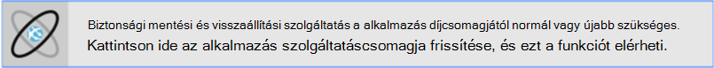
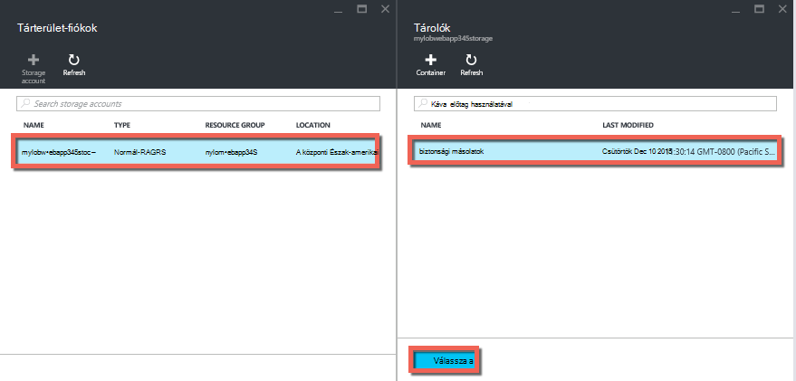
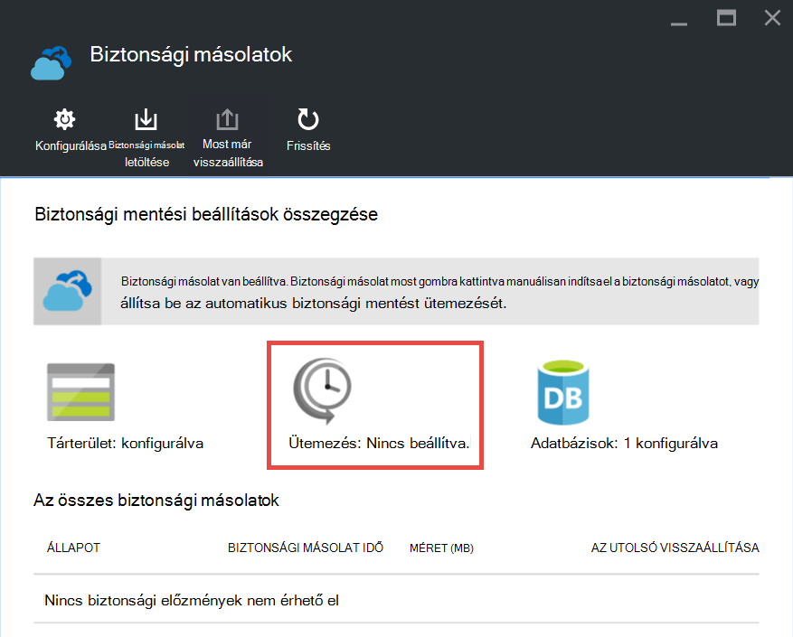

<properties 
    pageTitle="Készítsen biztonsági másolatot az alkalmazás Azure-ban" 
    description="Megtudhatja, hogy miként biztonsági másolatait az alkalmazások létrehozása az Azure alkalmazás szolgáltatás." 
    services="app-service" 
    documentationCenter="" 
    authors="cephalin" 
    manager="wpickett" 
    editor="jimbe"/>

<tags 
    ms.service="app-service" 
    ms.workload="na" 
    ms.tgt_pltfrm="na" 
    ms.devlang="na" 
    ms.topic="article" 
    ms.date="07/06/2016" 
    ms.author="cephalin"/>

# Készítsen biztonsági másolatot az alkalmazás Azure-ban

A biztonsági mentési és visszaállítási szolgáltatás [Azure App](../app-service/app-service-value-prop-what-is.md) szolgáltatásban segítségével egyszerűen alkalmazás biztonsági másolatok automatikusan vagy manuálisan. Az alkalmazás visszaállíthatja az előző állapotát, vagy hozzon létre egy új alkalmazást, az eredeti alkalmazás biztonsági másolatok alapján. 

Az alkalmazás visszaállítása biztonsági másolatból a további tudnivalókért lásd [Azure-alkalmazás visszaállítása](web-sites-restore.md).

## Mi a biztonsági másolat módja 
Alkalmazás szolgáltatás készíthető az alábbi adatokat:

* Alkalmazás-konfiguráció
* Fájl tartalma
* Bármely Azure SQL-adatbázisait vagy az alkalmazás (választhatja a biztonsági mentés szerepeltetni melyeket) kapcsolódik (ClearDB) Azure MySQL-adatbázisok

Ezt az információt a Azure tárhely és a megadott tároló biztonsági másolat. 

> [AZURE.NOTE] Minden egyes biztonsági másolat egy teljes offline másolatot az alkalmazást, nem növekményes frissítésre.

## Követelmények és korlátozások

* A biztonsági mentése és visszaállítása a funkcióhoz az alkalmazás szolgáltatáscsomagja a **szabványos** réteg vagy magasabb legyen. További információt a méretezés a alkalmazás díjcsomagjától egy újabb szint című témakörben olvashat az [Azure-alkalmazás mentése méretezni](web-sites-scale.md). Figyelje meg, hogy **prémium** réteg lehetővé teszi, hogy **szabványos** réteg-nál nagyobb számú napi biztonsági másolatok.
* Azure tároló fiókot és ugyanabban az előfizetésben használni kívánt biztonsági másolatot az App tároló van szüksége. Azure tároló fiókok további tudnivalókért lásd: a [hivatkozások](#moreaboutstorage) Ez a cikk végén.
* Biztonsági másolatok lehet akár 10GB alkalmazás és az adatbázis tartalmát. Hiba lép fel, ha a biztonsági másolat mérete meghaladja a. 

## Hozzon létre egy kézi biztonsági mentése

2. Az [Azure-portálon](https://portal.azure.com)nyissa meg az alkalmazást a lap, és válassza a **Beállítások**, majd a **másolatok**. A **biztonsági másolatok** lap jelenik meg.
    
    ![Biztonsági másolatok lap][ChooseBackupsPage]

    >[AZURE.NOTE]Ha az alábbi üzenet jelenik meg, kattintson rá, a alkalmazás díjcsomagjától frissítése, a folytatás előtt a biztonsági másolatok.
[Azure-alkalmazás mentése méretezni](web-sites-scale.md) talál további információt.  
    >

3. Kattintson a **biztonsági másolatok** lap **tároló: nincs beállítva** tárterület-fiókok konfigurálása.

    ![Válassza a tárterület-fiók][ChooseStorageAccount]
    
4. A biztonsági mentés helyének kiválasztása a **Tárhely** és a **tároló**kiválasztásával. Az azonos előfizetéséhez, mint az alkalmazásban, készítsen biztonsági másolatot szeretne a tárterület-fiókot kell tartoznia. Ha kívánja, létrehozhat egy új tárterület-fiókot vagy új tároló a megfelelő rögzítéséhez. Amikor elkészült, kattintson a **Kijelölés**gombra.
    
    
    
5. A **Biztonsági beállítások megadása** lap, amely még nyitva maradt, az **Adatbázis beállítások**gombra, majd jelölje ki az adatbázisok szeretne szerepeltetni a biztonsági másolatok (SQL-adatbázis vagy MySQL), majd kattintson az **OK gombra**.  

    

    > [AZURE.NOTE]  Az adatbázis szeretné jeleníteni a listában a kapcsolati karakterlánc léteznie kell a **kapcsolati karakterláncot** az alkalmazás az **alkalmazás beállításai** lap című szakaszát.

6. A **Biztonsági beállítások megadása** lap kattintson a **Mentés**gombra.  

7. A **biztonsági másolatok** lap parancssávon kattintson a **Biztonsági mentés gombra**.
    
    ![BackUpNow gomb][BackUpNow]
    
    Folyamatban üzenet jelenik meg a biztonsági mentés során.

Miután beállította a tárhely és a biztonsági másolatok tároló, teheti egy kézi biztonsági bármikor.  

## Az automatikus biztonsági mentések beállítása

1. Kattintson a **biztonsági másolatok** lap **Ütemezés: nincs beállítva**. 

    
    
1. A **Biztonsági másolat ütemezési beállítások** lap **Ütemezett biztonsági másolat** beállítása **a**, majd az ütemezés konfigurálása tetszés szerint, és kattintson az **OK gombra**.
    
    ![Az automatikus biztonsági mentés engedélyezése][SetAutomatedBackupOn]
    
4. A **Biztonsági beállítások megadása** lap, amely még nyitva maradt kattintson a **Tárhely beállításai**parancsra, majd a biztonsági mentés helyének kiválasztása a **Tárhely** és a **tároló**kiválasztásával. Az azonos előfizetéséhez, mint az alkalmazásban, készítsen biztonsági másolatot szeretne a tárterület-fiókot kell tartoznia. Ha kívánja, létrehozhat egy új tárterület-fiókot vagy új tároló a megfelelő rögzítéséhez. Amikor elkészült, kattintson a **Kijelölés**gombra.
    
    
    
5. A **Biztonsági beállítások megadása** lap a **Adatbázis beállítások**gombra, majd jelölje ki az adatbázisok szeretne szerepeltetni a biztonsági másolatok (SQL-adatbázis vagy MySQL), majd kattintson az **OK gombra**.  

    

    > [AZURE.NOTE]  Az adatbázis szeretné jeleníteni a listában a kapcsolati karakterlánc léteznie kell a **kapcsolati karakterláncot** az alkalmazás az **alkalmazás beállításai** lap című szakaszát.

6. A **Biztonsági beállítások megadása** lap kattintson a **Mentés**gombra.  

## Az alkalmazás biztonsági csak része

Előfordul, hogy nem kívánt biztonsági másolatot készíteni az alkalmazás összes elemét. Íme néhány példa:

-   [Heti biztonsági mentések beállítása](web-sites-backup.md#configure-automated-backups) az alkalmazás statikus tartalommá, hogy soha nem változik, például a régi blogbejegyzések vagy a képeket tartalmazó.
-   Az alkalmazás több mint 10GB-nyi (Ez lehet biztonsági másolatot készíteni, egy időben max összeg) tartalma tartalmaz.
-   Nem szeretné, készítsen biztonsági másolatot a naplófájlok.

Részleges biztonsági másolatok szolgálat tájékoztatja Önt pontosan milyen biztonsági másolatot szeretne fájlok lehetőséget.

### A biztonsági másolat fájlok kizárása

Ha nem szeretné a biztonsági másolatok fájlok és mappák, hozzon létre egy `_backup.filter` fájl D:\home\site\wwwroot mappájában található az alkalmazást, és adja meg a listát a fájlok és mappák ott a kizárandó. Hozzáféréssel a legegyszerűbben, a [Kudu konzol](https://github.com/projectkudu/kudu/wiki/Kudu-console)keresztül. 

Tegyük fel, amely tartalmazza a naplófájlokat és az elmúlt év, hogy többé nem lesz módosítása statikus képek alkalmazást. Már rendelkezik az alkalmazás, a régi képeket tartalmazó teljes biztonsági másolatot. Most már szeretne biztonsági másolatot készíteni az alkalmazás minden nap, de nem szeretne fizetni a naplófájlok vagy soha ne módosítsa az statikus kép fájlok tárolásához.

![A napló mappára][LogsFolder]
![képek mappába][ImagesFolder]
    
A lépések alatti megjelenítése a hogyan szeretné kizárása ezeket a fájlokat a biztonsági másolatból.

1. Nyissa meg a `http://{yourapp}.scm.azurewebsites.net/DebugConsole` , és kiválogathatja azokat a mappákat, amelyeket el szeretne rejteni a biztonsági mentés. Ebben a példában célszerű kizárja a következő fájlokat és mappákat, hogy a felhasználói felület látható:

        D:\home\site\wwwroot\Logs
        D:\home\LogFiles
        D:\home\site\wwwroot\Images\2013
        D:\home\site\wwwroot\Images\2014
        D:\home\site\wwwroot\Images\brand.png

    [AZURE.NOTE] Az utolsó sor jeleníti meg, hogy kizárhatja személyek fájlok mappákat is.

2. Hozzon létre egy nevű fájlt `_backup.filter` és a fenti lista helyezi el a fájlt, törölni azonban `D:\home`. Egy fájl soronkénti vagy könyvtár sorolja fel. A fájl tartalmát úgy kell:

    \site\wwwroot\Logs \LogFiles \site\wwwroot\Images\2013 \site\wwwroot\Images\2014 \site\wwwroot\Images\brand.png

3. Fájl feltöltése a `D:\home\site\wwwroot\` könyvtár a webhelyére [ftp](web-sites-deploy.md#ftp) vagy bármelyik másik módszert. Ha kívánja, létrehozhatja a fájlt közvetlenül a `http://{yourapp}.scm.azurewebsites.net/DebugConsole` , és szúrja be a tartalom van.

4. Biztonsági másolatok volna megszokott meg, [kézzel](#create-a-manual-backup) és [automatikusan](#configure-automated-backups)ugyanúgy futtatni.

Most a fájlokat és mappákat, amelyek a megadott `_backup.filter` kell zárni a biztonsági mentés. Ebben a példában a naplófájlokat és a 2013-at és 2014 képfájlokat már nem készül, illetve brand.png.

>[AZURE.NOTE] A webhely részleges biztonsági mentés visszaállítása a ugyanúgy [rendszeres biztonsági másolatának visszaállítása](web-sites-restore.md). A helyreállítási folyamat hajt végre a megfelelő dolog.
>
>Amikor helyreáll a teljes biztonsági mentést, a webhely összes tartalmát helyére bármilyen szerepel-e a biztonsági mentés. Ha egy fájlt a webhelyen, de nem a biztonsági másolat a kap törli. De amikor helyreáll a részleges biztonsági, mint marad-e a minden olyan tartalom, a Feketelistára tett könyvtárak egyikét, vagy bármely Feketelistára tett fájl található.

## Biztonsági másolatok tárolási módja

Miután kiválasztotta egy vagy több biztonsági másolatok az alkalmazás, a biztonsági másolatok is látható lesz a tárterület-fiókját, valamint az alkalmazás, a **tárolók** lap. A tárterület-fiókot minden egyes biztonsági másolat áll egy .zip biztonsági adatokat tartalmazó és egy .xml fájl, amely tartalmazza a .zip fájl tartalmát a jegyzék. Bontsa ki, és keresse meg ezeket a fájlokat, ha el szeretne érni a biztonsági mentés végrehajtása egy alkalmazás visszaállítása nélkül.

Az adatbázis biztonsági mentése az alkalmazáshoz a .zip fájl legfelső szintű vannak tárolva. SQL-adatbázishoz BACPAC fájl (fájl kiterjesztés nélkül), és lehet importálni. Az BACPAC exportálás alapuló új SQL-adatbázis létrehozása, olvassa el a [felhasználó új adatbázis létrehozásához BACPAC fájl importálása](http://technet.microsoft.com/library/hh710052.aspx).

> [AZURE.WARNING] A **websitebackups** tárolóban lévő fájlokat módosítása okozhatják a biztonsági mentés érvénytelen és ezért nem visszaállítható válik.

## Következő lépések
Az alkalmazás visszaállítása biztonsági másolatból a további tudnivalókért lásd [Azure-alkalmazás visszaállítása](web-sites-restore.md). Is biztonsági mentése és visszaállítása a REST API-t használ szolgáltatási alkalmazás alkalmazások (lásd: a [Biztonsági mentése és visszaállítása alkalmazás szolgáltatás alkalmazások használata többi](websites-csm-backup.md)).

>[AZURE.NOTE] Ha azt szeretné, mielőtt feliratkozna az Azure-fiók kezdéshez Azure alkalmazás szolgáltatással, nyissa meg a [Próbálja alkalmazás szolgáltatás](http://go.microsoft.com/fwlink/?LinkId=523751), ahol azonnal létrehozhat egy rövid életű starter web app alkalmazás szolgáltatásban. Nem kötelező, hitelkártyák Nincs nyilatkozatát.

<!-- IMAGES -->
[ChooseBackupsPage]: ./media/web-sites-backup/01ChooseBackupsPage.png
[ChooseStorageAccount]: ./media/web-sites-backup/02ChooseStorageAccount.png
[IncludedDatabases]: ./media/web-sites-backup/03IncludedDatabases.png
[BackUpNow]: ./media/web-sites-backup/04BackUpNow.png
[BackupProgress]: ./media/web-sites-backup/05BackupProgress.png
[SetAutomatedBackupOn]: ./media/web-sites-backup/06SetAutomatedBackupOn.png
[Frequency]: ./media/web-sites-backup/07Frequency.png
[StartDate]: ./media/web-sites-backup/08StartDate.png
[StartTime]: ./media/web-sites-backup/09StartTime.png
[SaveIcon]: ./media/web-sites-backup/10SaveIcon.png
[ImagesFolder]: ./media/web-sites-backup/11Images.png
[LogsFolder]: ./media/web-sites-backup/12Logs.png
[GhostUpgradeWarning]: ./media/web-sites-backup/13GhostUpgradeWarning.png
 
