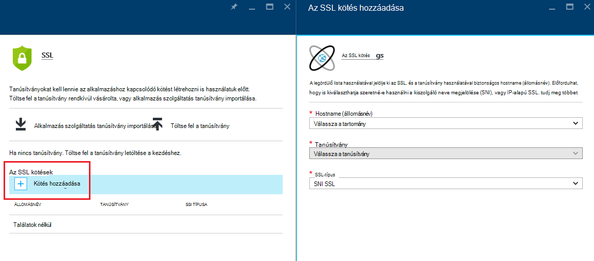
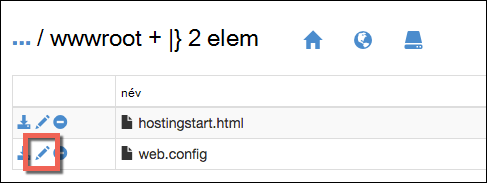

<properties
    pageTitle="Az alkalmazás egyéni tartományát HTTPS biztonságos |} Microsoft Azure"
    description="Megtudhatja, hogyan biztonságos az egyéni tartománynév Azure alkalmazás szolgáltatás alkalmazását egy SSL-tanúsítvány kötés konfigurálásával. Megtanulhatja az SSL-tanúsítvány beszerzése több eszközökről is."
    services="app-service"
    documentationCenter=".net"
    authors="cephalin"
    manager="wpickett"
    editor="jimbe"
    tags="top-support-issue"/>

<tags
    ms.service="app-service"
    ms.workload="na"
    ms.tgt_pltfrm="na"
    ms.devlang="na"
    ms.topic="article"
    ms.date="08/08/2016"
    ms.author="cephalin"/>

# Az alkalmazás egyéni tartományát HTTPS biztonságos

> [AZURE.SELECTOR]
- [SSL-tanúsítvány Azure-ban megvásárlása](web-sites-purchase-ssl-web-site.md)
- [Máshol használja az SSL-tanúsítvány](web-sites-configure-ssl-certificate.md)

Ez a cikk bemutatja, hogyan engedélyezhet HTTPS webalkalmazást, a mobilalkalmazásban kódmentes vagy egyéni tartománynevet használó [Azure alkalmazás szolgáltatás](../app-service/app-service-value-prop-what-is.md) API alkalmazás. Csak kiszolgálói hitelesítési lefedi. Ha kölcsönös hitelesítés (ügyfél-hitelesítés is beleértve), lásd: [Hogyan szeretné konfigurálása TLS kölcsönös hitelesítés alkalmazás szolgáltatáshoz](app-service-web-configure-tls-mutual-auth.md).

Biztonságos HTTPS az alkalmazás, amely rendelkezik egyéni tartománynévvel, vegyen fel egy tanúsítványt, hogy a tartomány nevét. Alapértelmezés szerint az Azure titkosítja a ** \*. azurewebsites.net** egy egyetlen SSL-tanúsítvány, így ügyfelei már hozzáférhet az alkalmazás a tartományhoz helyettesítő * *https://*&lt;alkalmazásnév >*. azurewebsites.net**. De ha szeretne egyéni tartományt használni, például **contoso.com**, **www.contoso.com**, és ** \*. contoso.com**, az alapértelmezett tanúsítványt nem tudja biztosítani, hogy. Ezenkívül minden [helyettesítő tanúsítványok](https://casecurity.org/2014/02/26/pros-and-cons-of-single-domain-multi-domain-and-wildcard-certificates/), például az alapértelmezett tanúsítványt nem olyan biztonságos, mint az egyéni tartomány és a tanúsítvány használatával, hogy az egyéni tartomány.   

>[AZURE.NOTE] A segítség bármikor a [Azure fórumok](https://azure.microsoft.com/support/forums/)Azure szakértőktől. Személyre szabott támogatásának nyissa meg a [Azure támogatja](https://azure.microsoft.com/support/options/) , és kattintson az **Első támogatja**.

## Mire van szüksége
Biztonságos HTTPS az egyéni tartománynevét, az Azure-ban, egyéni tartomány egyéni SSL-tanúsítvány kell kötni. Mielőtt egyéni tanúsítványának kell tegye a következőket:

- **Az egyéni tartomány beállítása** - alkalmazás szolgáltatás csak lehetővé teszi, hogy hozzáadása egy tanúsítványt, amely már be van állítva az alkalmazás a tartománynév. Útmutatásért lásd: a [térkép egyéni tartománynevet az Azure alkalmazásba](web-sites-custom-domain-name.md). 
- **Egyszerű réteg vagy újabb szerkezetének kialakítása** App milyen szolgáltatáscsomagok az alsó árak rétegek nem támogatott egyéni SSL-tanúsítványok. Című cikkben olvashat [Azure-alkalmazás mentése méretezni](web-sites-scale.md). 
- Az **SSL-tanúsítvány beszerzése** – Ha még nem rendelkezik, kell egy megbízható [hitelesítésszolgáltató](http://en.wikipedia.org/wiki/Certificate_authority) (CA) beszerzéséhez. A tanúsítvány az alábbi követelmények kell megfelelnie:

    - Aláírta egy megbízható hitelesítésszolgáltató (nincs magánjellegű hitelesítésszolgáltató kiszolgálók).
    - A titkos kulcs tartalmaz.
    - Fő exchange által létrehozott, és exportálása egy. PFX fájlt.
    - Legalább 2048 bites titkosítást használ.
    - A tárgy neve megegyezik a biztonságos szüksége van az egyéni tartomány. Biztonságos egy tanúsítvánnyal több tartományt, akkor használja helyettesítő nevét (például ** \*. contoso.com**), vagy adjon meg subjectAltName értékeket.
    - A hitelesítésszolgáltató által használt összes **[köztes](http://en.wikipedia.org/wiki/Intermediate_certificate_authorities)** rendszer egyesíti. Egyéb esetben futtathatja irreproducible interoperability problémákat tapasztal a egyes ügyfelek.

        >[AZURE.NOTE] Az első SSL-tanúsítvány, amely megfelel az összes legegyszerűbben         [az Azure-portálon közvetlenül](web-sites-purchase-ssl-web-site.md)vásárolni. Ez a cikk bemutatja, hogyan, manuális és kötése az egyéni tartomány App szolgáltatásban.
        >   
        > **Elliptikus görbe titkosítás (ECC) tanúsítványok** alkalmazás szolgáltatással, de ez a cikk hatókörén kívüli is dolgozhat. A pontos eljárás ECC tanúsítványok létrehozása a hitelesítésszolgáltató használata.

## Lépés: 1. SSL-tanúsítvány beszerzése

Hitelesítésszolgáltató ad a SSL tanúsítvány különféle különböző ár pontokon, mert el az SSL-tanúsítvány vásárlása típusának kiválasztásához. Biztonságos egyetlen tartománynév (**www.contoso.com**), csak szüksége van egy egyszerű tanúsítványt. Több tartománynevet biztonságos (**contoso.com** *és* **www.contoso.com** 
*és* **mail.contoso.com**), szüksége van egy [helyettesítő tanúsítvány](http://en.wikipedia.org/wiki/Wildcard_certificate) vagy a [Másodlagos tulajdonosneve](http://en.wikipedia.org/wiki/SubjectAltName) tanúsítvány (`subjectAltName`).

Ha tudja, hogy melyik SSL-tanúsítvány megvásárlására, egy tanúsítványt aláírási kérése (CSR) hitelesítésszolgáltató céljából. Ha kapott kért tanúsítvány vissza hitelesítésszolgáltatótól, majd létre .pfx fájl a a tanúsítvány. Ezeket a lépéseket a eszközzel lehetőség hajthatják végre. Az alábbiakban a gyakori eszközök lépéseit:

- [Certreq.exe lépéseket](#bkmk_certreq) - tanúsítvány igénylések létrehozása a Windows-segédprogram. Windows XP és Windows Server 2000 része a Windows mióta.
- [IIS-kezelő lépések](#bkmk_iismgr) – a választási lehetőségek, ha már tisztában van, az eszköz.
- [OpenSSL lépéseket](#bkmk_openssl) – egy [megnyitott-forrást, platformok eszköz](https://www.openssl.org). Annak segítségével SSL-tanúsítvány beolvasása bármely platform nyújt segítséget.
- az első lépések [OpenSSL használatával subjectAltName lépéseket](#bkmk_subjectaltname) - `subjectAltName` tanúsítványok.

Ha azt szeretné, tesztelje a telepítő alkalmazás szolgáltatásban, mielőtt vásárolt tanúsítvány, [önaláírt tanúsítványt](https://en.wikipedia.org/wiki/Self-signed_certificate)hozhat létre. Ebben az oktatóanyagban is biztosít hozható létre két módon:

- [Önaláírt tanúsítvány, Certreq.exe lépések](#bkmk_sscertreq)
- [Önaláírt tanúsítvány, OpenSSL lépések](#bkmk_ssopenssl)

### Szerezzen be egy tanúsítványt Certreq.exe használatával

1. Hozzon létre egy fájlt (már pl. **myrequest.txt**van hátra), és másolja azt a következő szöveget, és mentse azt egy munkakönyvtár. Cserélje le a `<your-domain>` helyőrző az egyéni tartománynévvel, az alkalmazás.

        [NewRequest]
        Subject = "CN=<your-domain>"  ; E.g. "CN=www.contoso.com", or "CN=*.contoso.com" for a wildcard certificate
        Exportable = TRUE
        KeyLength = 2048              ; Required minimum is 2048
        KeySpec = 1
        KeyUsage = 0xA0
        MachineKeySet = True
        ProviderName = "Microsoft RSA SChannel Cryptographic Provider"
        ProviderType = 12
        HashAlgorithm = SHA256

        [EnhancedKeyUsageExtension]
        OID=1.3.6.1.5.5.7.3.1         ; Server Authentication

    Az ügyfélszolgálati képviselő kiválasztható, és az egyéb lehetőségekről további tudnivalókért lásd: a [Certreq hivatkozási dokumentáció](https://technet.microsoft.com/library/dn296456.aspx).

4. A parancssorba `CD` a munkakönyvtárat, és a Futtatás a következő parancsot a CSR létrehozása:

        certreq -new myrequest.txt myrequest.csr

    **myrequest.CSR** most az aktuális munkakönyvtár jön létre.

5. **Myrequest.csr** SSL-tanúsítvány beszerzése hitelesítésszolgáltatótól nyújt. Töltse fel a fájlt, vagy másolja a tartalmát szövegszerkesztőben webes űrlap.

    Microsoft megbízható hitelesítésszolgáltató listájáért lásd: [Microsoft megbízható Root Certificate Program: a résztvevők][cas].

6. Miután a hitelesítésszolgáltató tanúsítvány válaszolt, (. Mentse a munkakönyvtár CER) fájlt. Futtassa a következő parancsot a függőben lévő CSR befejezéséhez.

        certreq -accept -user <certificate-name>.cer

    Ez a parancs a kész tanúsítvány tárolja a tanúsítvány a Windows áruházból.

6. Ha a hitelesítésszolgáltató köztes használ, telepítse őket folytatás előtt. Általában származnak egy külön letölthető a hitelesítésszolgáltatótól, és a különböző webes kiszolgálótípusok számos formátumban. Jelölje ki a verziót a Microsoft az IIS.

    Miután letöltötte a tanúsítványok, kattintson a jobb gombbal a Windows Intézőben mindegyiket, és válassza a  **tanúsítvány telepítése**. Az alapértelmezett értékek használata a **Tanúsítvány importálása varázsló**, és folytassa a **következő** kijelölése, amíg befejeződik az Importálás gombra.

7. Az SSL-tanúsítvány exportálása a tanúsítvány áruházból, nyomja le az ENTER `Win` + `R` és **certmgr.msc parancsot** tanúsítvány Manager rovatokhoz futtatása. Válassza a **személyes** > **tanúsítványok**. A **Kiadott** oszlopban meg kell jelennie egy bejegyzést, az egyéni tartománynevet, és a hitelesítésszolgáltató használva a tanúsítvány létrehozása a kiállító oszlop **Szerint** .

    ![az alábbi tanúsítvány manager beszúrása][certmgr]

9. Kattintson a jobb gombbal a tanúsítványt, és válassza ki az **Összes tevékenységhez** > **exportálja**. Az **Exportálás varázsló tanúsítvány**kattintson a **Tovább gombra**, majd válassza az **Igen, a titkos kulcs exportálását**, és ezután kattintson a **Tovább** gombra.

    ![A titkos kulcs exportálása][certwiz1]

10. Válassza a **Személyes információkat Exchange - PKCS #12**, **Ha lehetséges tanúsítvány elérési minden tanúsítvány belefoglalása**, **minden további tulajdonság exportálása**. Kattintson a **Tovább gombra**.

    ![tanúsítványok és a bővített tulajdonságai][certwiz2]

11. Jelölje be a **jelszót**, és adja meg, és erősítse meg a jelszót. Kattintson a **Tovább**gombra.

    ![a jelszó megadása][certwiz3]

12. Az exportált tanúsítvány, a bővítmény **.pfx**a szükséges egy elérési utat és a fájlnevet. Kattintson a **Tovább gombra** a befejezéshez.

    ![Adja meg a fájl elérési útja][certwiz4]

Most már készen áll az exportált PFX fájl feltöltése alkalmazás szolgáltatás. Lásd: [lépés: 2. Töltse fel, majd az egyéni SSL-tanúsítvány kötést](#bkmk_configuressl).

### Szerezzen be egy tanúsítványt az IIS-kezelővel

1. Egy ügyfélszolgálati képviselő az IIS-kezelővel szeretne küldeni a hitelesítésszolgáltató készítése. Egy ügyfélszolgálati képviselő létrehozása a további tudnivalókért lásd: a [kérése egy internetes kiszolgálói tanúsítvány (IIS 7)][iiscsr].

3. Az SSL-tanúsítvány beszerzése a hitelesítésszolgáltató CSR nyújt. Microsoft megbízható hitelesítésszolgáltató listájáért lásd: [Microsoft megbízható Root Certificate Program: a résztvevők][cas].

3. Töltse ki az ügyfélszolgálati képviselő a tanúsítvány, amely a hitelesítésszolgáltató visszaküldi azt. Az ügyfélszolgálati képviselő végrehajtásával kapcsolatos további tudnivalókért lásd: [az Internet kiszolgálói tanúsítvány (IIS 7) telepítése][installcertiis].

4. Ha a hitelesítésszolgáltató köztes használ, telepítse őket folytatás előtt. Általában származnak egy külön letölthető a hitelesítésszolgáltatótól, és a különböző webes kiszolgálótípusok számos formátumban. Jelölje ki a verziót a Microsoft az IIS.

    Miután letöltötte a tanúsítványok, kattintson a jobb gombbal a Windows Intézőben mindegyiket, és válassza a **tanúsítvány telepítése**. 
    Az alapértelmezett értékek használata a **Tanúsítvány importálása varázsló**, és folytassa a **következő** kijelölése, amíg befejeződik az Importálás gombra.

4. Az SSL-tanúsítványt az IIS-kezelő exportálhatja. A tanúsítvány exportálása a további tudnivalókért lásd: a [tanúsítvány (IIS 7) exportálása][exportcertiis]. 

    >[AZURE.IMPORTANT] Az **Exportálás varázsló tanúsítvány**győződjön meg arról, **Igen, a titkos kulcs exportálását** választja  
    >
    >![A titkos kulcs exportálása][certwiz1]  
    >
    > és is válassza a **Személyes információkat Exchange - PKCS #12**, **Ha lehetséges tanúsítvány elérési minden tanúsítvány belefoglalása**,     **minden további tulajdonság exportálása**.
    >
    >![tanúsítványok és a bővített tulajdonságai][certwiz2]

Most már készen áll az exportált PFX fájl feltöltése alkalmazás szolgáltatás. Lásd: [lépés: 2. Töltse fel, majd az egyéni SSL-tanúsítvány kötést](#bkmk_configuressl).

### Szerezzen be egy tanúsítványt OpenSSL használatával

1. Egy parancssori terminálablakba `CD` be munkakönyvtárat készítése egy titkos kulcs és CSR a következő parancs futtatásával:

        openssl req -sha256 -new -nodes -keyout myserver.key -out server.csr -newkey rsa:2048

2. Amikor a rendszer kéri, írja be a megfelelő adatokat. Példa:

        Country Name (2 letter code)
        State or Province Name (full name) []: Washington
        Locality Name (eg, city) []: Redmond
        Organization Name (eg, company) []: Microsoft
        Organizational Unit Name (eg, section) []: Azure
        Common Name (eg, YOUR name) []: www.microsoft.com
        Email Address []:

        Please enter the following 'extra' attributes to be sent with your certificate request

        A challenge password []:

    Ha elkészült, rendelkeznie kell két fájlokat a munkakönyvtár a: **myserver.key** és **server.csr**. 
    A **server.csr** az ügyfélszolgálati képviselő tartalmazza, és később szükség lenne **myserver.key** .

3. Az SSL-tanúsítvány beszerzése a hitelesítésszolgáltató CSR nyújt. Microsoft megbízható hitelesítésszolgáltató listájáért lásd: [Microsoft megbízható Root Certificate Program: a résztvevők][cas].

4. Miután a hitelesítésszolgáltató küld Önnek a kért tanúsítványt, mentse a **myserver.crt** a a munkakönyvtár nevű fájlt. Ha a hitelesítésszolgáltató biztosít szöveg formátumban, egyszerűen a tartalmat másol **myserver.crt** szövegszerkesztőben, és mentse. A fájl a következő hasonlóan kell kinéznie:

        -----BEGIN CERTIFICATE-----
        MIIDJDCCAgwCCQCpCY4o1LBQuzANBgkqhkiG9w0BAQUFADBUMQswCQYDVQQGEwJV
        UzELMAkGA1UECBMCV0ExEDAOBgNVBAcTB1JlZG1vbmQxEDAOBgNVBAsTB0NvbnRv
        c28xFDASBgNVBAMTC2NvbnRvc28uY29tMB4XDTE0MDExNjE1MzIyM1oXDTE1MDEx
        NjE1MzIyM1owVDELMAkGA1UEBhMCVVMxCzAJBgNVBAgTAldBMRAwDgYDVQQHEwdS
        ZWRtb25kMRAwDgYDVQQLEwdDb250b3NvMRQwEgYDVQQDEwtjb250b3NvLmNvbTCC
        ASIwDQYJKoZIhvcNAQEBBQADggEPADCCAQoCggEBAN96hBX5EDgULtWkCRK7DMM3
        enae1LT9fXqGlbA7ScFvFivGvOLEqEPD//eLGsf15OYHFOQHK1hwgyfXa9sEDPMT
        3AsF3iWyF7FiEoR/qV6LdKjeQicJ2cXjGwf3G5vPoIaYifI5r0lhgOUqBxzaBDZ4
        xMgCh2yv7NavI17BHlWyQo90gS2X5glYGRhzY/fGp10BeUEgIs3Se0kQfBQOFUYb
        ktA6802lod5K0OxlQy4Oc8kfxTDf8AF2SPQ6BL7xxWrNl/Q2DuEEemjuMnLNxmeA
        Ik2+6Z6+WdvJoRxqHhleoL8ftOpWR20ToiZXCPo+fcmLod4ejsG5qjBlztVY4qsC
        AwEAATANBgkqhkiG9w0BAQUFAAOCAQEAVcM9AeeNFv2li69qBZLGDuK0NDHD3zhK
        Y0nDkqucgjE2QKUuvVSPodz8qwHnKoPwnSrTn8CRjW1gFq5qWEO50dGWgyLR8Wy1
        F69DYsEzodG+shv/G+vHJZg9QzutsJTB/Q8OoUCSnQS1PSPZP7RbvDV9b7Gx+gtg
        7kQ55j3A5vOrpI8N9CwdPuimtu6X8Ylw9ejWZsnyy0FMeOPpK3WTkDMxwwGxkU3Y
        lCRTzkv6vnHrlYQxyBLOSafCB1RWinN/slcWSLHADB6R+HeMiVKkFpooT+ghtii1
        A9PdUQIhK9bdaFicXPBYZ6AgNVuGtfwyuS5V6ucm7RE6+qf+QjXNFg==
        -----END CERTIFICATE-----

5. A parancssori terminálablakba **myserver.key** és **myserver.crt** **myserver.pfx** exportálása a következő parancsot:

        openssl pkcs12 -export -out myserver.pfx -inkey myserver.key -in myserver.crt

    Amikor a rendszer kéri, adja meg a .pfx fájl védelméhez jelszót.

    > [AZURE.NOTE] Ha a hitelesítésszolgáltató köztes használ, szerepelnie kell őket a a `-certfile` paraméter. Általában származnak egy külön letölthető a hitelesítésszolgáltatótól, és a különböző webes kiszolgálótípusok számos formátumban. Jelölje ki a verziót, a `.pem` bővítmény.
    >
    > A `openssl -export` parancs például a következő példa, amely hoz létre, amely tartalmazza a köztes **betétlap-cets.pem** fájlból .pfx fájl kell kinéznie:
    >  
    > `openssl pkcs12 -chain -export -out myserver.pfx -inkey myserver.key -in myserver.crt -certfile intermediate-cets.pem`

Most már készen áll az exportált PFX fájl feltöltése alkalmazás szolgáltatás. Lásd: [lépés: 2. Töltse fel, majd az egyéni SSL-tanúsítvány kötést](#bkmk_configuressl).

### Szerezzen be egy SubjectAltName tanúsítványt OpenSSL használatával

1. Hozzon létre egy **sancert.cnf**nevű fájlt, a következő szöveggel másolja, és mentse azt egy munkakönyvtár:

        # -------------- BEGIN custom sancert.cnf -----
        HOME = .
        oid_section = new_oids
        [ new_oids ]
        [ req ]
        default_days = 730
        distinguished_name = req_distinguished_name
        encrypt_key = no
        string_mask = nombstr
        req_extensions = v3_req # Extensions to add to certificate request
        [ req_distinguished_name ]
        countryName = Country Name (2 letter code)
        countryName_default =
        stateOrProvinceName = State or Province Name (full name)
        stateOrProvinceName_default =
        localityName = Locality Name (eg, city)
        localityName_default =
        organizationalUnitName  = Organizational Unit Name (eg, section)
        organizationalUnitName_default  =
        commonName              = Your common name (eg, domain name)
        commonName_default      = www.mydomain.com
        commonName_max = 64
        [ v3_req ]
        subjectAltName=DNS:ftp.mydomain.com,DNS:blog.mydomain.com,DNS:*.mydomain.com
        # -------------- END custom sancert.cnf -----

    A sor kezdődő `subjectAltName`, az érték cserélje ki az összes tartománynevek védeni kívánt (kívül  `commonName`). Példa:

        subjectAltName=DNS:sales.contoso.com,DNS:support.contoso.com,DNS:fabrikam.com

    Nem kell módosítása bármely más mezőre, beleértve a `commonName`. A rendszer kéri a következő néhány lépésekben megadhatja őket.

1. Egy parancssori terminálablakba `CD` a munkakönyvtárat, és a Futtatás a következő parancsot:

        openssl req -sha256 -new -nodes -keyout myserver.key -out server.csr -newkey rsa:2048 -config sancert.cnf

2. Amikor a rendszer kéri, írja be a megfelelő adatokat. Példa:

        Country Name (2 letter code) []: US
        State or Province Name (full name) []: Washington
        Locality Name (eg, city) []: Redmond
        Organizational Unit Name (eg, section) []: Azure
        Your common name (eg, domain name) []: www.microsoft.com

    Miután elkészült, rendelkeznie kell két munkaidő címtárában: **myserver.key** és **server.csr**. 
    A **server.csr** az ügyfélszolgálati képviselő tartalmazza, és később szükség lenne **myserver.key** .

3. Az SSL-tanúsítvány beszerzése a hitelesítésszolgáltató CSR nyújt. Microsoft megbízható hitelesítésszolgáltató listájáért lásd: [Microsoft megbízható Root Certificate Program: a résztvevők][cas].

4. Miután a hitelesítésszolgáltató küld Önnek a kért tanúsítványt, mentse a **myserver.crt**nevű fájlt. Ha a hitelesítésszolgáltató biztosít szöveg formátumban, egyszerűen a tartalmat másol **myserver.crt** szövegszerkesztőben, és mentse. A fájl a következő hasonlóan kell kinéznie:

        -----BEGIN CERTIFICATE-----
        MIIDJDCCAgwCCQCpCY4o1LBQuzANBgkqhkiG9w0BAQUFADBUMQswCQYDVQQGEwJV
        UzELMAkGA1UECBMCV0ExEDAOBgNVBAcTB1JlZG1vbmQxEDAOBgNVBAsTB0NvbnRv
        c28xFDASBgNVBAMTC2NvbnRvc28uY29tMB4XDTE0MDExNjE1MzIyM1oXDTE1MDEx
        NjE1MzIyM1owVDELMAkGA1UEBhMCVVMxCzAJBgNVBAgTAldBMRAwDgYDVQQHEwdS
        ZWRtb25kMRAwDgYDVQQLEwdDb250b3NvMRQwEgYDVQQDEwtjb250b3NvLmNvbTCC
        ASIwDQYJKoZIhvcNAQEBBQADggEPADCCAQoCggEBAN96hBX5EDgULtWkCRK7DMM3
        enae1LT9fXqGlbA7ScFvFivGvOLEqEPD//eLGsf15OYHFOQHK1hwgyfXa9sEDPMT
        3AsF3iWyF7FiEoR/qV6LdKjeQicJ2cXjGwf3G5vPoIaYifI5r0lhgOUqBxzaBDZ4
        xMgCh2yv7NavI17BHlWyQo90gS2X5glYGRhzY/fGp10BeUEgIs3Se0kQfBQOFUYb
        ktA6802lod5K0OxlQy4Oc8kfxTDf8AF2SPQ6BL7xxWrNl/Q2DuEEemjuMnLNxmeA
        Ik2+6Z6+WdvJoRxqHhleoL8ftOpWR20ToiZXCPo+fcmLod4ejsG5qjBlztVY4qsC
        AwEAATANBgkqhkiG9w0BAQUFAAOCAQEAVcM9AeeNFv2li69qBZLGDuK0NDHD3zhK
        Y0nDkqucgjE2QKUuvVSPodz8qwHnKoPwnSrTn8CRjW1gFq5qWEO50dGWgyLR8Wy1
        F69DYsEzodG+shv/G+vHJZg9QzutsJTB/Q8OoUCSnQS1PSPZP7RbvDV9b7Gx+gtg
        7kQ55j3A5vOrpI8N9CwdPuimtu6X8Ylw9ejWZsnyy0FMeOPpK3WTkDMxwwGxkU3Y
        lCRTzkv6vnHrlYQxyBLOSafCB1RWinN/slcWSLHADB6R+HeMiVKkFpooT+ghtii1
        A9PdUQIhK9bdaFicXPBYZ6AgNVuGtfwyuS5V6ucm7RE6+qf+QjXNFg==
        -----END CERTIFICATE-----

5. A parancssori com.microsoft.skypeforbusiness.Plugin **myserver.key** és **myserver.crt** **myserver.pfx** exportálása a következő parancsot:

        openssl pkcs12 -export -out myserver.pfx -inkey myserver.key -in myserver.crt

    Amikor a rendszer kéri, adja meg a .pfx fájl védelméhez jelszót.

    > [AZURE.NOTE] Ha a hitelesítésszolgáltató köztes használ, szerepelnie kell őket a a `-certfile` paraméter. Általában származnak egy külön letölthető a hitelesítésszolgáltatótól, és a különböző webes kiszolgálótípusok számos formátumban. Jelölje ki a verziót, a `.pem` bővítmény).
    >
    > A `openssl -export` parancs például a következő példa, amely hoz létre, amely tartalmazza a köztes **betétlap-cets.pem** fájlból .pfx fájl kell kinéznie:
    >  
    > `openssl pkcs12 -chain -export -out myserver.pfx -inkey myserver.key -in myserver.crt -certfile intermediate-cets.pem`

Most már készen áll az exportált PFX fájl feltöltése alkalmazás szolgáltatás. Lásd: [lépés: 2. Töltse fel, majd az egyéni SSL-tanúsítvány kötést](#bkmk_configuressl).

### Önaláírt tanúsítvány használatával Certreq.exe készítése ###

>[AZURE.IMPORTANT] Önaláírt tanúsítványok vannak csak tesztelése céljából. A legtöbb böngészőben hibák vissza, amikor egy önaláírt tanúsítvány által biztosított webhelyén. Egyes böngészőkben is elutasíthatják nyissa meg azt a webhelyet. 

1. Hozzon létre egy szövegfájlt (pl. **mycert.txt**), másolja azt a következő szöveget, és mentse a fájlt munkakönyvtárat. Cserélje le a `<your-domain>` helyőrző az egyéni tartománynévvel, az alkalmazás.

        [NewRequest]
        Subject = "CN=<your-domain>"  ; E.g. "CN=www.contoso.com", or "CN=*.contoso.com" for a wildcard certificate
        Exportable = TRUE
        KeyLength = 2048              ; KeyLength can be 2048, 4096, 8192, or 16384 (required minimum is 2048)
        KeySpec = 1
        KeyUsage = 0xA0
        MachineKeySet = True
        ProviderName = "Microsoft RSA SChannel Cryptographic Provider"
        ProviderType = 12
        HashAlgorithm = SHA256
        RequestType = Cert            ; Self-signed certificate
        ValidityPeriod = Years
        ValidityPeriodUnits = 1

        [EnhancedKeyUsageExtension]
        OID=1.3.6.1.5.5.7.3.1         ; Server Authentication

    A fontos paraméter `RequestType = Cert`, amely meghatározza, hogy önaláírt tanúsítványt. 
    Az ügyfélszolgálati képviselő kiválasztható, és az egyéb lehetőségekről további tudnivalókért lásd: a [Certreq hivatkozási dokumentáció](https://technet.microsoft.com/library/dn296456.aspx).

4. A parancssorba `CD` a munkakönyvtár és a Futtatás a következő parancsot:

        certreq -new mycert.txt mycert.crt
    
    Az új önaláírt tanúsítványt most már telepítve van a tárolóban található.

7. A tanúsítvány exportálása a tanúsítvány áruházból, nyomja le az ENTER `Win` + `R` és futtatása **certmgr.msc parancsot** tanúsítvány Manager elindítására. Válassza a **személyes** > **tanúsítványok**. A **Kiadott** oszlopban meg kell jelennie egy bejegyzést, az egyéni tartománynevet, és a hitelesítésszolgáltató használva a tanúsítvány létrehozása a kiállító oszlop **Szerint** .

    ![az alábbi tanúsítvány manager beszúrása][certmgr]

9. Kattintson a jobb gombbal a tanúsítványt, és válassza ki az **Összes tevékenységhez** > **exportálja**. Az **Exportálás varázsló tanúsítvány**kattintson a **Tovább gombra**, majd válassza az **Igen, a titkos kulcs exportálását**, és ezután kattintson a **Tovább** gombra.

    ![A titkos kulcs exportálása][certwiz1]

10. Válassza a **Személyes információkat Exchange - PKCS #12**, **Ha lehetséges tanúsítvány elérési minden tanúsítvány belefoglalása**, **minden további tulajdonság exportálása**. Kattintson a **Tovább gombra**.

    ![tanúsítványok és a bővített tulajdonságai][certwiz2]

11. Jelölje be a **jelszót**, és adja meg, és erősítse meg a jelszót. Kattintson a **Tovább**gombra.

    ![a jelszó megadása][certwiz3]

12. Az exportált tanúsítvány, a bővítmény **.pfx**a szükséges egy elérési utat és a fájlnevet. Kattintson a **Tovább gombra** a befejezéshez.

    ![Adja meg a fájl elérési útja][certwiz4]

Most már készen áll az exportált PFX fájl feltöltése alkalmazás szolgáltatás. Lásd: [lépés: 2. Töltse fel, majd az egyéni SSL-tanúsítvány kötést](#bkmk_configuressl).

###Önaláírt tanúsítvány használatával OpenSSL készítése ###

>[AZURE.IMPORTANT] Önaláírt tanúsítványok vannak csak tesztelése céljából. A legtöbb böngészőben hibák vissza, amikor egy önaláírt tanúsítvány által biztosított webhelyén. Egyes böngészőkben is elutasíthatják nyissa meg azt a webhelyet. 

1. Hozzon létre egy szövegfájlt, névvel ellátott **serverauth.cnf**, majd a következő tartalmat másol, és mentse a munkakönyvtárat:

        [ req ]
        default_bits           = 2048
        default_keyfile        = privkey.pem
        distinguished_name     = req_distinguished_name
        attributes             = req_attributes
        x509_extensions        = v3_ca

        [ req_distinguished_name ]
        countryName         = Country Name (2 letter code)
        countryName_min         = 2
        countryName_max         = 2
        stateOrProvinceName     = State or Province Name (full name)
        localityName            = Locality Name (eg, city)
        0.organizationName      = Organization Name (eg, company)
        organizationalUnitName      = Organizational Unit Name (eg, section)
        commonName          = Common Name (eg, your app's domain name)
        commonName_max          = 64
        emailAddress            = Email Address
        emailAddress_max        = 40

        [ req_attributes ]
        challengePassword       = A challenge password
        challengePassword_min       = 4
        challengePassword_max       = 20

        [ v3_ca ]
         subjectKeyIdentifier=hash
         authorityKeyIdentifier=keyid:always,issuer:always
         basicConstraints = CA:false
         keyUsage=nonRepudiation, digitalSignature, keyEncipherment
         extendedKeyUsage = serverAuth

2. Egy parancssori com.microsoft.skypeforbusiness.Plugin `CD` a munkakönyvtárat, és a Futtatás a következő parancsot:

        openssl req -sha256 -x509 -nodes -days 365 -newkey rsa:2048 -keyout myserver.key -out myserver.crt -config serverauth.cnf

    Ez a parancs két fájlokat hoz létre: **myserver.crt** (az önaláírt tanúsítványt) és **myserver.key** (a titkos kulcs), az **serverauth.cnf**beállításai alapján.

3. A tanúsítvány .pfx fájl exportálása a következő parancs futtatásával:

        openssl pkcs12 -export -out myserver.pfx -inkey myserver.key -in myserver.crt

    Amikor a rendszer kéri, adja meg a .pfx fájl védelméhez jelszót.

Most már készen áll az exportált PFX fájl feltöltése alkalmazás szolgáltatás. Lásd: [lépés: 2. Töltse fel, majd az egyéni SSL-tanúsítvány kötést](#bkmk_configuressl).

## Lépés: 2. Töltse fel és kötést létrehozni az egyéni SSL-tanúsítvány

Áthelyezése előtt olvassa el a [szükséges](#bkmk_domainname) szakasz, és ellenőrizze az alábbiakat:

- az Azure-alkalmazást, megfelelteti tartomány van
- az alkalmazás **egyszerű** réteg vagy újabb operációs rendszert futtató és
- Ha az SSL-tanúsítvány, az egyéni tartomány hitelesítésszolgáltatótól.

1. A böngészőben nyissa meg a ** [Azure-portálon.](https://portal.azure.com/)**
2.  Kattintson a lap bal szélén a **Alkalmazás szolgáltatás** lehetőségre.
3.  Kattintson a alkalmazást, amelyhez hozzá szeretné rendelni a tanúsítvány nevét. 
4.  A **Beállítások**területen kattintson **az SSL-tanúsítványok**
5.  Kattintson a **tanúsítvány feltöltése**
6.  Jelölje ki a .pfx fájl exportált az [1](#bkmk_getcert) , és adja meg a jelszót, Ön által létrehozott előtt. Kattintson a **Feltöltés** töltse fel a tanúsítvány. Ekkor megjelennek a feltöltött tanúsítvány vissza az **SSL-tanúsítvány** lap.
7. Az **ssl kötések** szakaszban kattintson a **kötések hozzáadása**
8. Az **SSL kötelező hozzáadása** lap a legördülő lista használatával válassza ki az SSL, és a tanúsítvány használatával, biztonságos. Előfordulhat, hogy is kiválaszthatja szeretné-e használni a **[Kiszolgáló neve megjelölése (SNI)](http://en.wikipedia.org/wiki/Server_Name_Indication)** , vagy IP-alapú SSL.

    

       •    IP based SSL associates a certificate with a domain name by mapping the dedicated public IP address of the server to the domain name. This requires each domain name (contoso.com, fabricam.com, etc.) associated with your service to have a dedicated IP address. This is the traditional          method of associating SSL certificates with a web server.
       •    SNI based SSL is an extension to SSL and **[Transport Layer Security](http://en.wikipedia.org/wiki/Transport_Layer_Security)** (TLS) that allows multiple domains to share the same IP address, with separate security certificates for each domain. Most modern browsers (including Internet Explorer, Chrome, Firefox and Opera) support SNI, however older browsers may not support SNI. For more information on SNI, see the **[Server Name Indication](http://en.wikipedia.org/wiki/Server_Name_Indication)** article on Wikipedia.
     
9. Kattintson a **Kötelező hozzáadása** a módosítások mentéséhez és az SSL protokoll engedélyezése gombra.

## 3 a lépést. A tartomány névmegfeleltetés (IP alapú SSL csak) módosítása

Ha csak a **SNI SSL** kötések használja, átugorja ezt a szakaszt. Több **SNI SSL** kötések is közös munka a hozzárendelt az alkalmazást a meglévő megosztott IP-címet. Azonban hoz létre egy **IP-alapú SSL** kötés, ha alkalmazás szolgáltatás hoz létre egy dedikált IP-címet a kötés, mert az **IP-alapú SSL** szükséges. Csak egy dedikált IP cím hozhatók létre, ezért csak egy **IP-alapú SSL** kötés lehet adni.

Miatt a dedikált IP-cím meg kell további az alkalmazás beállítása, ha:

- Csak [az A rekord hozzárendelése az egyéni tartományát használni](web-sites-custom-domain-name.md#a) az Azure-alkalmazást, és hozzá egy **IP-alapú SSL** kötés. Ebben az esetben kell megfelelteti a meglévő egy bejegyzésre, mutasson a dedikált IP-címet, ezeket a lépéseket követve:

    1. Konfigurálása után egy IP-alapú SSL kötés, és az alkalmazás hozzá van rendelve egy dedikált IP-címet. Az IP-cím az alkalmazást, jobbra fent a **állomásnevekké** szakasz a beállítások csoportban az **Egyéni tartomány** lapon talál. Megjelenik **a külső IP-** cím
    
        

    2. [Az A rekordot a következő új IP-cím egyéni tartománynevét az megfelelteti](web-sites-custom-domain-name.md#a).

- Már rendelkezik egy vagy több **SNI SSL** kötések az alkalmazást, és közvetlenül a felvétele után egy **IP-alapú SSL** kötés. Elkészülte után a kötés, a * &lt;alkalmazásnév >*. azurewebsites.net tartomány nevét az új IP-cím mutat. Ennélfogva minden meglévő [CNAME hozzárendelése az egyéni tartomány](web-sites-custom-domain-name.md#cname) * &lt;alkalmazásnév >*. azurewebsites.net, beleértve a projektfeladatokat a **SNI SSL** biztonságos, is megkapja az új címet, és az **IP-alapú SSL** csak létrejön a forgalmat. Ebben az esetben, el kell küldenie a **SNI SSL** -forgalmat vissza az eredeti megosztott IP-cím ezeket a lépéseket követve:

    1. Azonosítsa az összes [egyéni tartományok CNAME-hozzárendelések](web-sites-custom-domain-name.md#cname) az alkalmazás, amely tartalmaz egy **SNI SSL** kötés.

    2. Minden CNAME rekordot, megfelelteti **sni.** &lt;alkalmazásnév >. helyett azurewebsites.net &lt;alkalmazásnév >. azurewebsites.net.

## Lépés: 4. Az egyéni tartomány HTTPS tesztelése

A még hátralévő feladatokat most, hogy győződjön meg arról, hogy HTTPS-az egyéni tartomány működik-e. A különböző böngészők, tallózással `https://<your.custom.domain>` kattintva megtekintheti, hogy az alkalmazás mentése szolgál.

- Ha az alkalmazás ad a tanúsítvány érvényesítési hibákat, valószínűleg használ önaláírt tanúsítvány.

- Ha nem, amely az esetet, előfordulhat, hogy kilépett köztes meg a .pfx tanúsítvány exportálásakor. Térjen vissza [a keresett](#bkmk_domainname) ellenőrizze, hogy a CSR megfelel az összes alkalmazás szolgáltatás.

## HTTPS be az alkalmazásba

Ha továbbra is engedélyezni szeretné a HTTP-hozzáférést a alkalmazásba, ugorja át ezt a lépést. Teszi alkalmazás szolgáltatás *nem* a hivatkozási HTTPS, hogy látogatói továbbra is elérheti az alkalmazás HTTP használatával. Ha az alkalmazás, a HTTPS hivatkozási, a átírása szabály meghatározhatja a `web.config` fájlt az alkalmazás. Minden alkalmazás szolgáltatás alkalmazás ezt a fájlt, függetlenül attól, az alkalmazás nyelvi keretében tartalmaz.

> [AZURE.NOTE] Nincs kérések nyelvspecifikus átirányítását. ASP.NET MVC helyett a átírása szabályt is használhatja a [RequireHttps](http://msdn.microsoft.com/library/system.web.mvc.requirehttpsattribute.aspx) szűrő `web.config` (lásd: [egy biztonságos ASP.NET MVC 5 alkalmazás webalkalmazást Deploy](web-sites-dotnet-deploy-aspnet-mvc-app-membership-oauth-sql-database.md)).

Kövesse az alábbi lépéseket:

1. Nyissa meg az alkalmazás a Kudu hibakeresési konzolt. A cím `https://<appname>.scm.azurewebsites.net/DebugConsole`.

2. A hibakeresési konzolban, CD- `D:\home\site\wwwroot`.

3. Nyissa meg `web.config` ceruza gombra kattintva.

    

    Ha a Visual Studio vagy mely számjegy alkalmazás telepítéséhez alkalmazás szolgáltatás automatikusan létrehozza a megfelelő `web.config` alkalmazás legfelső szintű az .NET, PHP, Node.js vagy Python számára. 
    Ha `web.config` nem létezik, futtatása `touch web.config` hozza létre a webes parancssorba. Vagy a helyi projekt létrehozni a dokumentumot, és telepítsen újra a kódot.

4. Ha létrehozott egy `web.config`, a következő kódot másol, és mentse. Ha egy meglévő web.config megnyitása, majd másolja a teljes egyszerűen `<rule>` be nyomon követése a `web.config`'s `configuration/system.webServer/rewrite/rules` elemet.

        <?xml version="1.0" encoding="UTF-8"?>
        <configuration>
          <system.webServer>
            <rewrite>
              <rules>
                <!-- BEGIN rule TAG FOR HTTPS REDIRECT -->
                <rule name="Force HTTPS" enabled="true">
                  <match url="(.*)" ignoreCase="false" />
                  <conditions>
                    <add input="{HTTPS}" pattern="off" />
                  </conditions>
                  <action type="Redirect" url="https://{HTTP_HOST}/{R:1}" appendQueryString="true" redirectType="Permanent" />
                </rule>
                <!-- END rule TAG FOR HTTPS REDIRECT -->
              </rules>
            </rewrite>
          </system.webServer>
        </configuration>

    Ez a szabály egy HTTP 301 (Állandó átirányítás) a HTTPS protokollt adja vissza, valahányszor a felhasználó kér HTTP használatával. Https://contoso.com átirányítja a http://contoso.com.

    >[AZURE.IMPORTANT] Ha már más `<rule>` a címkéket a `web.config`, helyezze el a másolt `<rule>` címke elé, a másik `<rule>` címkék.

4. Mentse a fájlt a Kudu hibakeresési konzolban. Meg kell életbe léptetéséhez összes kérés haladéktalanul átirányítása HTTPS.

További információt az IIS URL-cím Átírásának modulon az [URL-cím Átírásának](http://www.iis.net/downloads/microsoft/url-rewrite) dokumentációjában.

## További források ##
- [Microsoft Azure az Adatvédelmi központ](/support/trust-center/security/)
- [Nem zárolt Azure webhelyek konfigurációs beállításai](/blog/2014/01/28/more-to-explore-configuration-options-unlocked-in-windows-azure-web-sites/)
- [Diagnosztikai naplózás engedélyezése](web-sites-enable-diagnostic-log.md)
- [Web Apps alkalmazások Azure alkalmazás szolgáltatás beállítása](web-sites-configure.md)
- [Azure Kezelőportálja segítségével](https://manage.windowsazure.com)

>[AZURE.NOTE] Ha azt szeretné, mielőtt feliratkozna az Azure-fiók használatbavételéhez Azure alkalmazás szolgáltatás, nyissa meg a [Próbálja alkalmazás szolgáltatás](http://go.microsoft.com/fwlink/?LinkId=523751), ahol azonnal létrehozhat egy rövid életű starter alkalmazásban az alkalmazás szolgáltatás. Nem kötelező, hitelkártyák Nincs nyilatkozatát.

[customdomain]: web-sites-custom-domain-name.md
[iiscsr]: http://technet.microsoft.com/library/cc732906(WS.10).aspx
[cas]: http://social.technet.microsoft.com/wiki/contents/articles/31634.microsoft-trusted-root-certificate-program-participants-v-2016-april.aspx
[installcertiis]: http://technet.microsoft.com/library/cc771816(WS.10).aspx
[exportcertiis]: http://technet.microsoft.com/library/cc731386(WS.10).aspx
[openssl]: http://www.openssl.org/
[portal]: https://manage.windowsazure.com/
[tls]: http://en.wikipedia.org/wiki/Transport_Layer_Security
[staticip]: ./media/web-sites-configure-ssl-certificate/staticip.png
[website]: ./media/web-sites-configure-ssl-certificate/sslwebsite.png
[scale]: ./media/web-sites-configure-ssl-certificate/sslscale.png
[standard]: ./media/web-sites-configure-ssl-certificate/sslreserved.png
[pricing]: /pricing/details/
[configure]: ./media/web-sites-configure-ssl-certificate/sslconfig.png
[uploadcert]: ./media/web-sites-configure-ssl-certificate/ssluploadcert.png
[uploadcertdlg]: ./media/web-sites-configure-ssl-certificate/ssluploaddlg.png
[sslbindings]: ./media/web-sites-configure-ssl-certificate/sslbindings.png
[sni]: http://en.wikipedia.org/wiki/Server_Name_Indication
[certmgr]: ./media/web-sites-configure-ssl-certificate/waws-certmgr.png
[certwiz1]: ./media/web-sites-configure-ssl-certificate/waws-certwiz1.png
[certwiz2]: ./media/web-sites-configure-ssl-certificate/waws-certwiz2.png
[certwiz3]: ./media/web-sites-configure-ssl-certificate/waws-certwiz3.png
[certwiz4]: ./media/web-sites-configure-ssl-certificate/waws-certwiz4.png

