<properties
    pageTitle="Csatlakozás Azure App szolgáltatásban webalkalmazást vgx.dll gyorsítótár az Memcache protokollon keresztül |} Microsoft Azure"
    description="Az alkalmazás Azure szolgáltatás egy webalkalmazás csatlakoztatása vgx.dll gyorsítótár Memcache protokoll használatával"
    services="app-service\web"
    documentationCenter="php"
    authors="SyntaxC4"
    manager="wpickett"
    editor="riande"/>

<tags
    ms.service="app-service-web"
    ms.devlang="php"
    ms.topic="get-started-article"
    ms.tgt_pltfrm="windows"
    ms.workload="na"
    ms.date="02/29/2016"
    ms.author="cfowler"/>

# <a name="connect-a-web-app-in-azure-app-service-to-redis-cache-via-the-memcache-protocol"></a>Csatlakozás Azure App szolgáltatásban webalkalmazást vgx.dll gyorsítótár az Memcache protokollon keresztül

Ebben a cikkben megismerheti az [Azure](http://go.microsoft.com/fwlink/?LinkId=529714) -App szolgáltatásban WordPress webalkalmazást keresztüli [Azure vgx.dll gyorsítótár] [ 12] használata a [Memcache] [ 13] Protocol (protokoll). Ha egy meglévő web App alkalmazásban, amely a memóriában gyorsítótárazás Memcached kiszolgálót használ, áttelepítése az Azure alkalmazás szolgáltatás, és segítségével az első fél gyorsítótárazási megoldás a Microsoft Azure-ban vagy kis módosítással az alkalmazás kódját. Emellett használhatja a meglévő Memcache hozhat létre nagyon méretezhető, szakértelmét elosztott alkalmazások Azure vgx.dll gyorsítótár az Azure App szolgáltatásban a memóriában gyorsítótárazás, például a .NET, PHP, Node.js, Java és Python népszerű alkalmazás keretek használata közben.  

Alkalmazás szolgáltatás Web Apps lehetővé teszi, hogy az alkalmazás példánkban a Web Apps alkalmazások Memcache kiigazítás, amely egy helyi Memcached kiszolgáló, amely végpontként Memcache proxy Azure vgx.dll gyorsítótár hívásainak gyorsítótárazás együtt. Minden olyan alkalmazás, amely közli, hogy az adatok mentése Memcache protokoll használata vgx.dll gyorsítótár szolgáltatás lehetővé teszi. Ez a Memcache kiigazítás működik protocol szintre, de használható minden alkalmazás vagy alkalmazás keretrendszer mindaddig, amíg a Memcache protokoll használatával kommunikál.

[AZURE.INCLUDE [app-service-web-to-api-and-mobile](../../includes/app-service-web-to-api-and-mobile.md)] 

## <a name="prerequisites"></a>Előfeltételek

Amennyiben a Memcache protokoll használatával kommunikál a Web Apps alkalmazások Memcache kiigazítás használható bármely alkalmazásban. Ebben az adott esetben hivatkozást alkalmazása a méretezhető WordPress webhely, amely a Microsoft Azure piactéren lévő kiépítése.

Kövesse a következő cikkekben ismertetett lépéseket:

* [Egy példánya az Azure vgx.dll gyorsítótár-szolgáltatás kiépítése][0]
* [Azure-ban méretezhető WordPress webhely terjesztése][1]

Ha a rendszerbe méretezhető WordPress webhelyen és egy kiépítéstől vgx.dll gyorsítótár-példány már készen áll a Memcache kiigazítás az Azure-alkalmazás szolgáltatás webalkalmazásokban engedélyezése folytatásához fogja.

## <a name="enable-the-web-apps-memcache-shim"></a>A Web Apps alkalmazások Memcache kiigazítás engedélyezése

Memcache kiigazítás konfigurálásához három alkalmazás beállításainak kell létrehoznia. Ezt megteheti módszerek, többek között az [Azure-portálra](http://go.microsoft.com/fwlink/?LinkId=529715)a [Klasszikus portál]számos[3], az [Azure PowerShell-parancsmagok] [ 5] vagy a [parancssor Azure][5]. Ebben a bejegyzésben alkalmazásában fogom használni az [Azure-portálon] [ 4] az alkalmazás beállításainak megadása. Az alábbi értékeket is lehet beolvasni a vgx.dll gyorsítótár-példány a **Beállítások** lap.

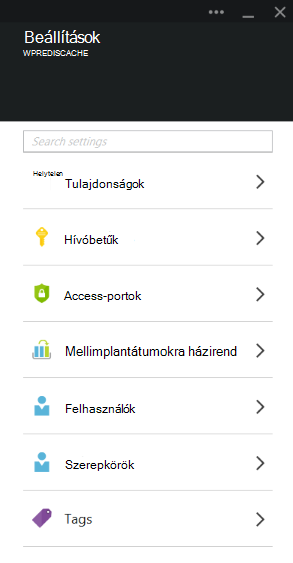

### <a name="add-redishost-app-setting"></a>Adja hozzá a REDIS_HOST app beállítása

Az első alkalmazás beállítása, létre kell hoznia a **Vgx.dll\_HOST** app beállítása. Ez a beállítás állítja be a cél, amelyhez a kiigazítás továbbítja a gyorsítótár információkat. Az érték a REDIS_HOST alkalmazás beállításához szükséges is lehet beolvasni a vgx.dll gyorsítótár-példány a **Tulajdonságok** lap.

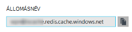

Az alkalmazás beállítás kulcs beállítása **Vgx.dll\_HOST** és az alkalmazás Vgx.dll gyorsítótár-példány a **Hostname (állomásnév)** beállítás értékét.

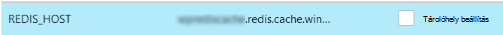

### <a name="add-rediskey-app-setting"></a>Adja hozzá a REDIS_KEY app beállítása

A második alkalmazás beállítása, létre kell hoznia a **Vgx.dll\_kulcs** app beállítása. Ez a beállítás biztosít, biztonságos hozzáférés szükséges a hitelesítési jogkivonat az vgx.dll gyorsítótár-példányt. Az érték a REDIS_KEY app beállítása a **hívóbetűk** lap vgx.dll gyorsítótár-példány a szükséges meghallgathatja.

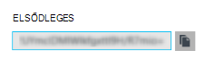

Az alkalmazás beállítás kulcs beállítása **Vgx.dll\_kulcs** és az **Elsődleges kulcs** vgx.dll gyorsítótár-példány az alkalmazás beállítás értékét.

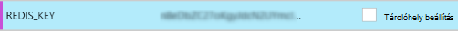

### <a name="add-memcacheshimredisenable-app-setting"></a>Adja hozzá a MEMCACHESHIM_REDIS_ENABLE app beállítása

A legutóbbi alkalmazás beállítás szolgál, ahhoz, hogy a Memcache kiigazítás Web Apps alkalmazások csatlakoztatása az Azure vgx.dll gyorsítótár és a gyorsítótár továbbítása REDIS_HOST és REDIS_KEY használja a hívásokat. Az alkalmazás beállítás kulcs beállítása **MEMCACHESHIM\_vgx.dll\_engedélyezése** és a **true**értéket.

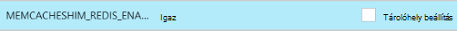

Ha végzett a három (3) alkalmazás beállítások hozzáadása kattintson a **Mentés**gombra.

## <a name="enable-memcache-extension-for-php"></a>PHP Memcache bővítmény engedélyezése

Ahhoz, hogy az alkalmazás a Memcache protocol beszélni szeretne telepítse a Memcache kiterjesztés PHP – a WordPress webhely nyelvi keretét szükség.

### <a name="download-the-phpmemcache-extension"></a>A bővítmény php_memcache letöltése

Tallózással keresse meg azt a [PECL][6]. A gyorsítótár kategóriában kattintson a [memcache][7]. A letöltések oszlopban DLL hivatkozásra.

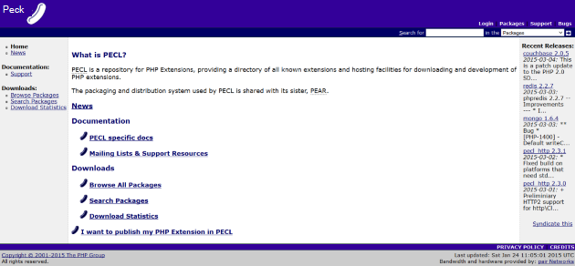

Töltse le a Web Apps alkalmazások engedélyezett PHP verzióját a szál nem biztonságos (NTS) x86 hivatkozására. (Alapértelmezett érték PHP 5.4-es)

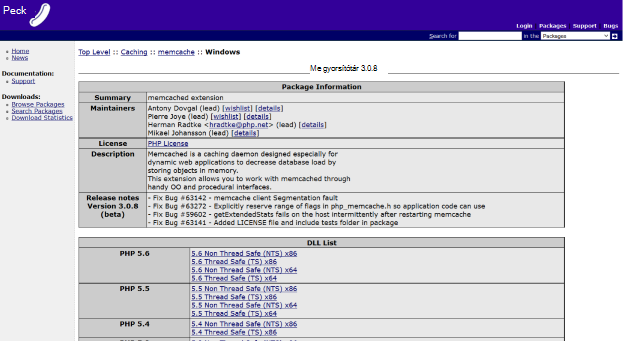

### <a name="enable-the-phpmemcache-extension"></a>A php_memcache bővítmény engedélyezése

Miután letöltötte a fájlt, csomagolja ki, és töltse fel a **php\_memcache.dll** be a **d:\\otthoni\\webhely\\wwwroot\\bin\\mellék\\ ** címtár. A php_memcache.dll feltöltése a webalkalmazásba, után ahhoz, hogy a bővítmény a PHP futtatókörnyezet szükséges. Ahhoz, hogy a Memcache bővítmény az Azure-portálon, nyissa meg az **Alkalmazás beállításai** lap a web App, majd adja hozzá az új alkalmazás beállítása az kulccsal **PHP\_bővítmények** az érték **bin\\mellék\\php_memcache.dll**.


> [AZURE.NOTE] Ha a web app több PHP-bővítmény betöltése, PHP_EXTENSIONS értékének kell dll-fájlok relatív út vesszővel tagolt listáját.


Miután elkészült, kattintson a **Mentés**gombra.

## <a name="install-memcache-wordpress-plugin"></a>Memcache WordPress beépülő modul telepítése

> [AZURE.NOTE] Letöltheti a [Memcached objektum-gyorsítótár beépülő modul](https://wordpress.org/plugins/memcached/) WordPress.org is.

WordPress bővítmények lapon kattintson az **Új hozzáadása**gombra.

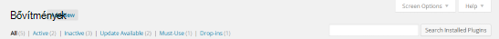

A Keresés mezőbe írja be a **memcached** , és nyomja le az **ENTER billentyűt**.

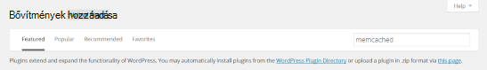

**Objektum-gyorsítótár Memcached** keresse meg a listában, majd kattintson a **Telepítés gombra**.

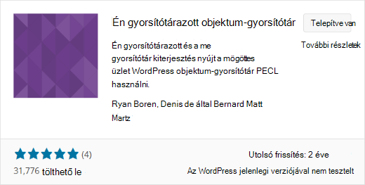

### <a name="enable-the-memcache-wordpress-plugin"></a>A Memcache WordPress beépülő modul engedélyezése

>[AZURE.NOTE] Kövesse a blogban [ahhoz, hogy a Web Apps alkalmazások egy webhely bővítményt,] hogy miként[ 8] Visual Studio Team Services telepítése.

Az a `wp-config.php` fájlt, és adja meg a következő kód feletti a megjegyzést a fájl végét közelében szerkesztésének megszakítása elemet.

```php
$memcached_servers = array(
    'default' => array('localhost:' . getenv("MEMCACHESHIM_PORT"))
);
```

Miután kód van már beillesztett, monaco automatikusan menti a dokumentumot.

A következő lépésként az objektum-gyorsítótár beépülő modul engedélyezése. Ez történik, húzza az **objektum-cache.php** **memcached wp-tartalom/bővítmények** mappából a Memcache objektum-gyorsítótár-szolgáltatás engedélyezéséhez a **wp-tartalom** mappába.

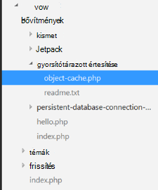

Most, hogy az **objektum-cache.php** fájlt a **wp-tartalom** mappában van, a Memcached objektum-gyorsítótár engedélyezve van.

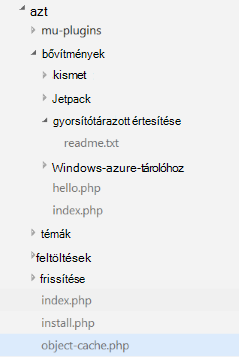

## <a name="verify-the-memcache-object-cache-plugin-is-functioning"></a>Ellenőrizze, hogy működik-e a Memcache objektum-gyorsítótár beépülő modul

Összes lépését ahhoz, hogy a Web Apps alkalmazások Memcache kiigazítás állnak a teljes. Beállítást balra, ellenőrizze, hogy az adatok van-e a gyorsítótár vgx.dll példány feltöltése.

### <a name="enable-the-non-ssl-port-support-in-azure-redis-cache"></a>Azure vgx.dll gyorsítótárban az-SSL port támogatásának engedélyezése

>[AZURE.NOTE] Ez a cikk ír időpontjában a vgx.dll CLI nem támogatja az SSL-kapcsolatot, így szükség-e az alábbi lépéseket.

Az Azure-portálon nyissa meg a webalkalmazás létrehozott vgx.dll gyorsítótár-példányt. Miután a gyorsítótár lap megnyitva, kattintson a **Beállítások** gombra.

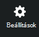

**Access-portok** válasszon a listából.

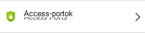

**Csak a SSL hozzáférésének engedélyezése**, kattintson a **nem** gombra.

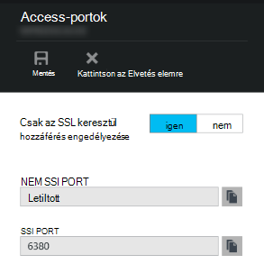

Láthatja, hogy az SSL-nem port most már van-e beállítva. Kattintson a **Mentés**gombra.

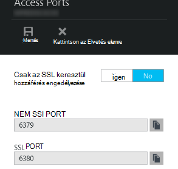

### <a name="connect-to-azure-redis-cache-from-redis-cli"></a>Kapcsolódás a vgx.dll cli Azure vgx.dll gyorsítótár

>[AZURE.NOTE] Ez a lépés feltételezi, hogy vgx.dll helyi számítógépen telepítve van a fejlesztés számítógépen. [Telepítse a vgx.dll helyileg használatával ezeket az utasításokat][9].

Nyissa meg a parancssori konzolt megválasztott, és írja be a következő parancsot:

```shell
redis-cli –h <hostname-for-redis-cache> –a <primary-key-for-redis-cache> –p 6379
```

Cserélje le a ** &lt;hostname (állomásnév)-a-vgx.dll-gyorsítótár&gt; ** a tényleges xxxxx.redis.cache.windows.net hostname (állomásnév), és a ** &lt;elsődleges kulcs-a-vgx.dll-gyorsítótár&gt; ** a gyorsítótár access kulccsal, nyomja le az **ENTER billentyűt**. Miután a CLI csatlakozik az vgx.dll gyorsítótár-példányt, ki bármely vgx.dll parancsot. Az alábbi képernyőképen lehet választotta, a billentyűparancsok listáját.

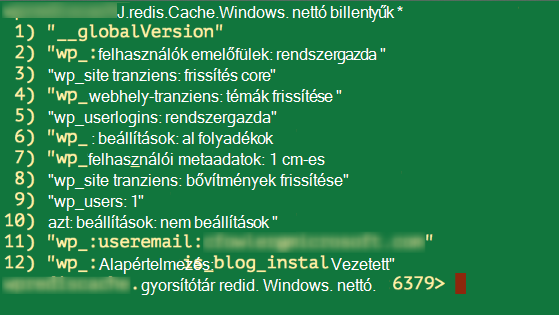

A hívás a billentyűparancsok listáját a kell egy értéket adnak eredményül. Ha nem, próbálja meg a web app lépés, és próbálkozzon újra.

## <a name="conclusion"></a>Elfogadásáról

Gratulálok! A WordPress alkalmazás ekkor megjelenik a teljesítmény növelése támogatási központosított a memóriában gyorsítótárat. Ne feledje, hogy a Web Apps alkalmazások Memcache kiigazítás kínál Memcache jegyzetlapon programnyelv vagy alkalmazás keretrendszer függetlenül. Ha visszajelzést szeretne küldeni vagy kérdésfeltevés a Web Apps alkalmazások Memcache kiigazítás kapcsolatban küldés [MSDN] fórumokban[ 10] vagy [Stackoverflow][11].

>[AZURE.NOTE] Ha azt szeretné, mielőtt feliratkozna az Azure-fiók használatbavételéhez Azure alkalmazás szolgáltatás, [Próbálja meg alkalmazás szolgáltatás](http://go.microsoft.com/fwlink/?LinkId=523751), ahol azonnal létrehozhat egy rövid életű starter web app alkalmazás szolgáltatásban megnyitásához. Nem kötelező, hitelkártyák Nincs nyilatkozatát.

## <a name="whats-changed"></a>Mi változott
* Módosítása egy segédvonalat a webhelyekre alkalmazás szolgáltatáshoz lásd: [Azure alkalmazás szolgáltatás és hatása a meglévő Azure-szolgáltatások](http://go.microsoft.com/fwlink/?LinkId=529714)


[0]: ../redis-cache/cache-dotnet-how-to-use-azure-redis-cache.md#create-a-cache
[1]: http://bit.ly/1t0KxBQ
[2]: http://manage.windowsazure.com
[3]: http://portal.azure.com
[4]: ../powershell-install-configure.md
[5]: /downloads
[6]: http://pecl.php.net
[7]: http://pecl.php.net/package/memcache
[8]: http://blog.syntaxc4.net/post/2015/02/05/how-to-enable-a-site-extension-in-azure-websites.aspx
[9]: http://redis.io/download#installation
[10]: https://social.msdn.microsoft.com/Forums/home?forum=windowsazurewebsitespreview
[11]: http://stackoverflow.com/questions/tagged/azure-web-sites
[12]: /services/cache/
[13]: http://memcached.org
