<properties
   pageTitle="ASP.NET-5 webes alkalmazás létrehozása a Visual Studio kód"
   description="Ebben az oktatóanyagban azt szemlélteti, hogyan hozhat létre egy ASP.NET 5 web App alkalmazásban a Visual Studio kód használatával."
   services="app-service\web"
   documentationCenter=".net"
   authors="erikre"
   manager="wpickett"
   editor="jimbe"/>

<tags
    ms.service="app-service-web" 
    ms.workload="web" 
    ms.tgt_pltfrm="dotnet" 
    ms.devlang="na" 
    ms.topic="article" 
    ms.date="02/26/2016" 
    ms.author="cephalin"/>

# ASP.NET-5 webes alkalmazás létrehozása a Visual Studio kód

## – Áttekintés

Ebből az oktatóanyagból megtudhatja, hogyan hozhat létre egy ASP.NET 5 web App alkalmazásban [A Visual Studio (kód VIEWBEN)](http://code.visualstudio.com//Docs/whyvscode) használ, és [Azure alkalmazás](../app-service/app-service-value-prop-what-is.md)szolgáltatás üzembe. 

> [AZURE.NOTE] Bár ez a cikk a web Apps alkalmazások hivatkozik, akkor is érinti API-alkalmazások és a mobilalkalmazások. 

ASP.NET 5 ASP.NET jelentős újratervezése. ASP.NET 5 új Megnyitás-forrás- és platformok keretét .NET használatával modern felhőalapú webes alkalmazásfejlesztésről. További információ című témakörben [ASP.NET 5](http://docs.asp.net/en/latest/conceptual-overview/aspnet.html). Azure alkalmazás szolgáltatás web Apps alkalmazások tudni olvassa el a [Web Apps alkalmazások – áttekintés](app-service-web-overview.md)című témakört.

[AZURE.INCLUDE [app-service-web-try-app-service.md](../../includes/app-service-web-try-app-service.md)]

## Előfeltételek  

* Telepítse [és kódot](http://code.visualstudio.com/Docs/setup).
* Telepítés [Node.js](http://nodejs.org) - Node.js egy gyors és méretezhető kiszolgáló alkalmazások használatáról JavaScript készítéséhez platform. Csomópont a futtatókörnyezet (csomópont), és [npm](http://www.npmjs.com/) csomópont modulok csomag kezelőjének. Az ASP.NET 5-webappokban scaffold ebben az oktatóanyagban npm fogja használni.
* Mely számjegy - telepítés alábbi pontokon kezdeményezheti telepítheti: [Chocolatey](https://chocolatey.org/packages/git) vagy [mely számjegy-scm.com](http://git-scm.com/downloads). Ha új, hogy mely számjegy, [mely számjegy-scm.com](http://git-scm.com/downloads) válassza ki, és válassza a **Használatát, mely számjegy a Windows parancssor**lehetőséget. Miután telepítette a mely számjegy, is kell meg mely számjegy felhasználó nevét, és e-mailben, szükség van az oktatóprogram belül (Ha a jóváhagyás elvégzéséhez VIEWBEN kódból).  

## ASP.NET 5 és DNX telepítése
ASP.NET-5/DNX (a .NET végrehajtási környezet), modern felhő és web Apps alkalmazások OS X, az Linux és a Windows rendszeren futó készítéséhez lean .NET Papírhalom. Azt épített az alapoktól kezdve-alkalmazást, amely a felhőbe rendszerbe, vagy futtassa a helyszíni egy optimalizált fejlesztési keretrendszer megadását. Áll elemes összetevőket a minimális átfedés, így megőrzi az rugalmasság közben hozhat létre, a megoldások.

Ez az oktatóanyag első ASP.NET az 5 és DNX legújabb fejlesztési-verzióra, és-alkalmazások létrehozásába lett tervezve. Az alábbi utasítások Windows vonatkoznak. Részletesebb telepítési OS X, az Linux és a Windows című cikkben olvashat [ASP.NET-5 telepítése és DNX](https://code.visualstudio.com/Docs/ASPnet5#_installing-aspnet-5-and-dnx). 

1. .NET verzió Manager (DNVM) telepítése a Windows rendszerben, nyisson meg egy parancssort, és futtassa a következő parancsot.

        @powershell -NoProfile -ExecutionPolicy unrestricted -Command "&{$Branch='dev';iex ((new-object net.webclient).DownloadString('https://raw.githubusercontent.com/aspnet/Home/dev/dnvminstall.ps1'))}"

    Ez a DNVM parancsfájl töltse le és mozgatófogantyúit, hogy a felhasználói profil könyvtárában. 

2. **Indítsa újra a Windows** DNVM telepítésének befejezéséhez. 

    A Windows újraindítása után nyithatja meg a parancssort ellenőrizze DNVM helyét megadásával a következőket:

        where dnvm

    A parancssor egy elérési utat megjelenik az alábbihoz hasonló.

    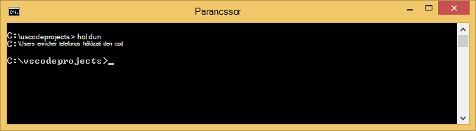

3. Most, hogy DNVM, az alkalmazások futtatásához DNX letöltéséhez kell használnia. Futtassa a következő parancsot:

        dnvm upgrade

    Ellenőrizze a DNVM és az aktív futtatókörnyezet megtekintése beírásával a következő parancsot:

        dnvm list

    A parancssor jelennek meg az aktív futtatókörnyezet részleteit.

    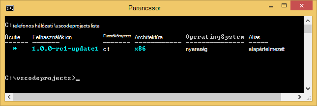

    Ha egynél több DNX futtatókörnyezet szerepel a listában, válassza ki a következő (vagy újabb verziójára) az aktív DNX futtatókörnyezet adni a parancssorba írja be. Állítsa be az azonos verzióban, a webalkalmazásban később az oktatóprogram létrehozásakor a ASP.NET 5 nyilvántartás-készítő alkalmazás által használt. *Előfordulhat az aktív futtatókörnyezet módosítsa, ha a beállítás a legkésőbbi elérhető: nem.*

        dnvm use 1.0.0-update1 –p

> [AZURE.NOTE] Részletesebb telepítési OS X, az Linux és a Windows című cikkben olvashat [ASP.NET-5 telepítése és DNX](https://code.visualstudio.com/Docs/ASPnet5#_installing-aspnet-5-and-dnx). 

## A web app létrehozása 

Ez a szakasz megtudhatja, hogy hogyan scaffold új alkalmazás ASP.NET webalkalmazást. A csomópont-csomag kezelő (npm) használandó [Yeoman](http://yeoman.io/) telepítése (alkalmazás állványon eszköz – az VIEWBEN kód egyenértékű a Visual Studio **Fájl > Új projekt** művelet), [Grunt](http://gruntjs.com/) (JavaScript tevékenység runner), és [Bower](http://bower.io/) (ügyfél egymás csomag kezelő). 

1. Nyisson meg egy parancssorablakot rendszergazdaként, és keresse meg a helyet, ahová a ASP.NET projekt létrehozása. Például a legfelső szintű C: a *vscodeprojects* könyvtár létrehozása\.

2. Írja be a következő a parancssorablakban Yeoman és a segítő eszközök telepítése.

        npm install -g yo grunt-cli generator-aspnet bower

    > [AZURE.NOTE] Figyelmeztetés javaslat, hogy a npm verziójában elavult jelenhetnek meg. Ez a figyelmeztetés ebben az oktatóanyagban nem érinti.

3. Írja be a következő a parancssorablakban hozza létre a projekt mappát, és az alkalmazás scaffold.

        yo aspnet

4. A nyílbillentyűk segítségével válassza ki a **Webes alkalmazás egyszerű** ASP.NET 5 nyilvántartás-készítő alkalmazás menüre, és nyomja le a ** &lt;Enter >**.

    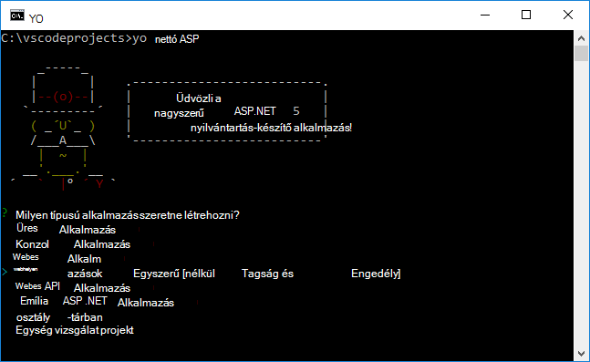

5. Állítsa a nevét az új ASP.NET-webalkalmazást **SampleWebApp**. Ez a név választhat egy másik nevet az oktatóprogram során használt, kell helyett a **SampleWebApp**minden előfordulását. Amikor megnyomja ** &lt;Enter >**, Yeoman **SampleWebApp** és azokat a fájlokat az új alkalmazás nevű új mappát hoz létre.

6. A parancssorba módosítsa az új projekt mappa könyvtárak:

        cd SampleWebApp

7. Is a parancssorban az alkalmazás futtatásához szükséges NuGet csomagok telepítése, írja be a következő parancsot:

        dnu restore

8. Nyissa meg a VIEWBEN kód megadásakor a következő parancsot:

        code .

## A web app helyi futtatása

Most, hogy a web App alkalmazásban létrehozott, és a lekért alkalmazás NuGet csomagokat, futtathatja a web app helyi meghajtóra.

1. A **Parancs színpaletta** VIEWBEN kódban írja be az alábbi módon jelenítheti meg a Futtatás parancs elérhető beállításokat:

        dnx: Run Command

    > [AZURE.NOTE] Ha a Omnisharp kiszolgáló jelenleg nem fut, a program ekkor elkezdi. Írja be újra a fenti parancsot.

    Ezután jelölje be a webes alkalmazás futtatásához a következő parancsot:
        
        dnx web - (SampleWebApp)

    A parancssorablakban jelennek meg, hogy az alkalmazás indítása. Ha a parancs nem jelenik meg ez az üzenet, ellenőrizze, az alsó bal corning VIEWBEN kód hibákat a projektben.
    
    > [AZURE.NOTE]Kiállító parancs a **Parancs paletta** igényel egy **>** karaktert a parancssorban az elején. A részletek, a **webhely** parancs a *project.json* fájlban kapcsolatos tekinthet meg.   
    > Ha a parancs nem jelenik meg, vagy nem érhető el, szükség lehet a C# bővítmény telepítése. Futtatása `>Extensions: Install Extension` és `ext install c#` C# bővítmények telepítése.

2. Nyissa meg a böngészőt, és keresse meg az alábbi URL-címet.

    **http://localhost:5000**

    Az alapértelmezett lapján, a web App alkalmazásban a következőképpen jelenik meg.

    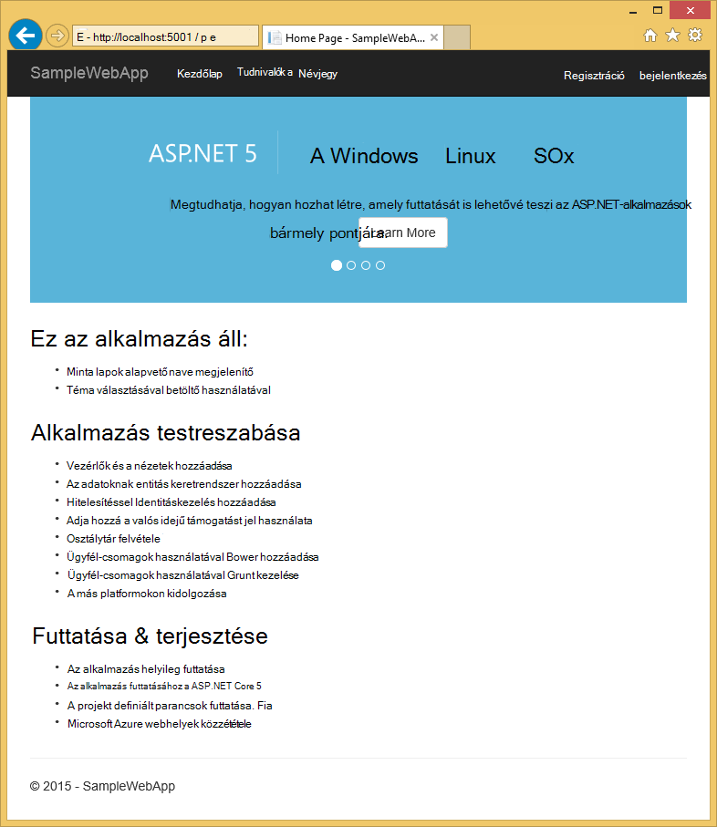

3. Zárja be a böngészőt. A **Parancssorablakban**nyomja le a **Ctrl + C billentyűkombinációt** , és zárja be az alkalmazást, és zárja be a **Parancssorablakban**. 

## Egy webalkalmazás létrehozása az Azure-portálon

Az alábbi lépésekkel végigvezeti Önt webalkalmazás létrehozása az Azure-portálon.

1. Jelentkezzen be az [Azure-portálon](https://portal.azure.com).

2. Kattintson az **Új** elemre a képernyő tetején a portál balra.

3. Kattintson a **Web Apps alkalmazások > Web App**.

    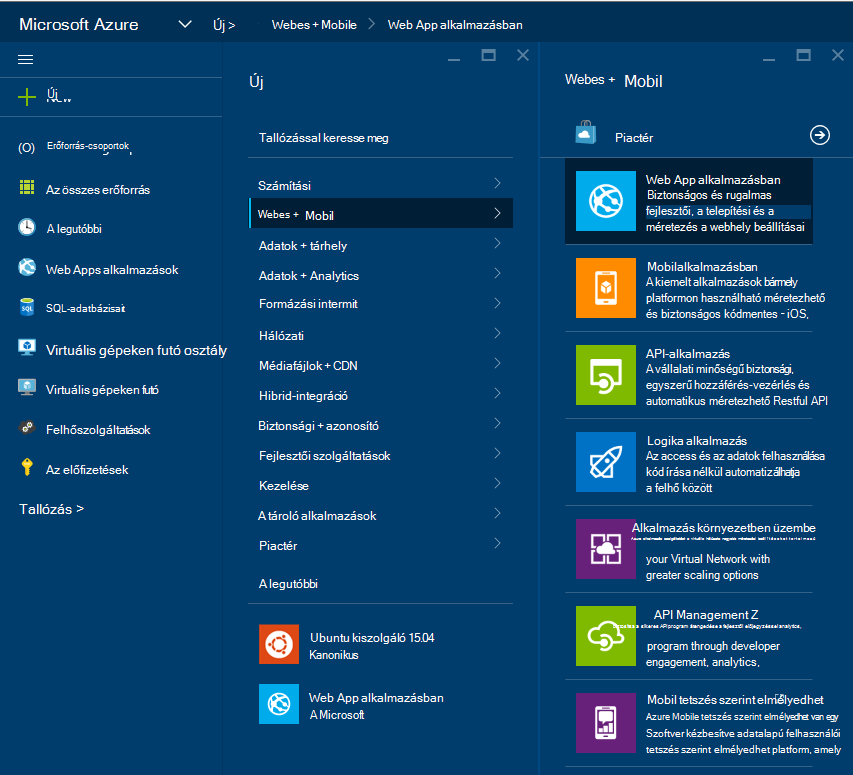

4. Adja meg **nevét**, például **SampleWebAppDemo**értékét. Megjegyzés: Ez a név igénylő egyedinek kell lennie, és a portálon kényszeríti, amikor megpróbálja írja be a nevét. Ezért ha egy másik érték megadása lehetőséget választja, kell helyettesítő minden előfordulásakor **SampleWebAppDemo** ebben az oktatóanyagban láthatja az adott értéket. 

5. Jelölje ki a egy meglévő **Alkalmazás szolgáltatás tervezése** , vagy hozzon létre egy újat. Ha létrehoz egy új tervet, jelölje be a árak réteg, helyét és egyéb beállításokat. További tájékoztatást a App milyen szolgáltatáscsomagok témakörben, [Azure alkalmazás szolgáltatás csomagok meg szeretné vizsgálni áttekintése](../app-service/azure-web-sites-web-hosting-plans-in-depth-overview.md).

    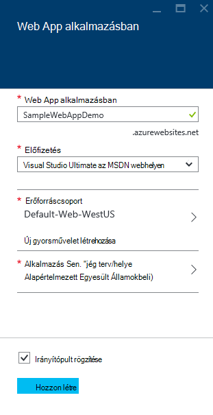

6. Kattintson a **létrehozása**gombra.

    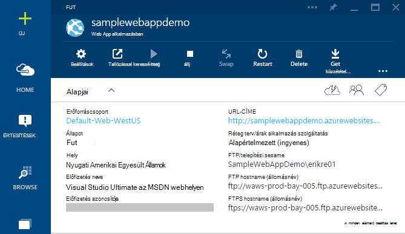

## Az új web App mely számjegy közzététel engedélyezése

Mely számjegy rendszer elosztott verzió vezérlő, telepítse az Azure alkalmazás szolgáltatás webes alkalmazást is használhatja. A kódot a webalkalmazás egy helyi mely számjegy tárban tárolnak írhat fog tárolni, és fogja beállítaná a kód Azure egy távoli tárházba közvetítheti.   

1. Jelentkezzen be az [Azure-portálon](https://portal.azure.com).

2. Kattintson a **Tallózás gombra**.

3. Kattintson a **Web Apps** az Azure-előfizetéséhez társított webalkalmazások listájának megtekintése.

4. Jelölje ki a web App alkalmazásban létrehozott ebben az oktatóanyagban.

5. Kattintson a web app lap **Beállítások** > **folyamatos telepítési**. 

    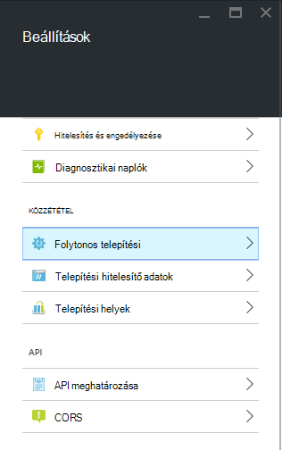

6. Kattintson a **Válassza az adatforrás > helyi mely számjegy tárházba**.

7. Kattintson az **OK gombra**.

    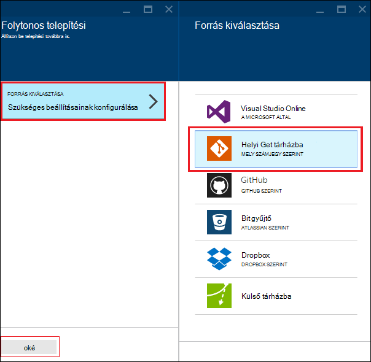

8. Ha korábban már nem állított telepítési hitelesítő adatok közzétételi webalkalmazást vagy más alkalmazás szolgáltatási alkalmazást, teheti meg most:

    * Kattintson a **Beállítások** > **telepítési hitelesítő adatait**. A **telepítési hitelesítő adatainak beállítása** lap jelenik meg.

    * Hozzon létre egy felhasználónevet és jelszót.  Meg kell erre a jelszóra később mely számjegy beállításakor.

    * Kattintson a **Mentés**gombra.

9. Kattintson a lap a webalkalmazás **beállításai > Tulajdonságok**. **Mely Számjegy URL-címe**alatt jelenik meg a távoli mely számjegy tárházba fogja telepítendő URL-CÍMÉT.

10. Másolja a későbbi felhasználásra a **Mely Számjegy URL-címe** értéket az oktatóprogram során.

    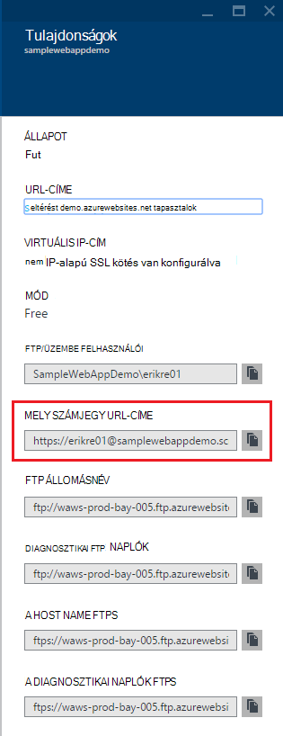

## A web app Azure alkalmazás szolgáltatás közzététele

Ebben a részben létrehoz egy helyi mely számjegy tárházba és a leküldéses az, hogy a tárházba való Azure Azure szeretne telepíteni, a web App alkalmazásban.

1. VIEWBEN kódot jelölje ki a **mely számjegy** lehetőségeket a bal oldali navigációs sávon.

    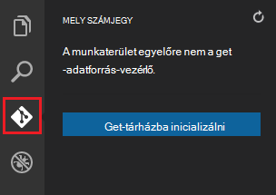

2. Jelölje ki, **mely számjegy tárházba inicializálni** ellenőrizze, hogy a munkaterület mely számjegy verziókövetés alatt. 

    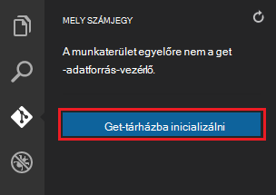

3. Nyissa meg a parancssorablakban és könyvtárak megváltoztatása a web App a címtárhoz. Ezután adja meg a következő parancsot:

        git config core.autocrlf false

    Ez a parancs megakadályozza, hogy a szöveget, ahol CRLF végződések javítása és LF végződések javítása játszik szerepet kapcsolatos problémát.

4. VIEWBEN kód, a jóváhagyás üzenet hozzáadása, majd kattintson az **Összes jóváhagyás** jelölőnégyzet ikonra.

    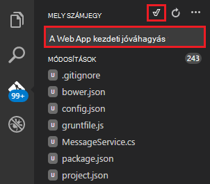

5. Mely számjegy feldolgozás után láthatja, hogy nincsenek-e a **változások**a mely számjegy ablakban megjelenő fájlok. 

    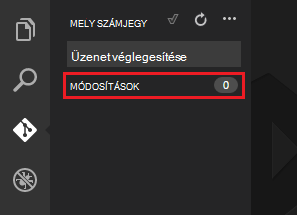

6. Módosítsa a parancssorablakban hol a parancssor ikonra mutat, a címtárhoz hol található a web App alkalmazásban.

7. A web App-frissítések terjesztése mely számjegy URL-cím (".git" végződő) előbb másolt használatával a távoli hivatkozás létrehozása.

        git remote add azure [URL for remote repository]

8. Állítsa be a helyben mentheti a hitelesítő adatait, így azok automatikusan hozzáfűzi a leküldéses parancsokra létrehozott VIEWBEN kódból mely számjegy.

        git config credential.helper store

9. A módosítások leküldéses az Azure a következő parancs megadásával. A kezdeti leküldéses Azure, után minden leküldéses parancs teheti VIEWBEN kódból fogja. 

        git push -u azure master

    A korábbi Azure-ban létrehozott jelszó megadását kéri. **Megjegyzés: A jelszó nem lesz látható.**

    A fenti parancs kimenetét, hogy befejeződött-e a telepítési üzenet végződik.

        remote: Deployment successful.
        To https://user@testsite.scm.azurewebsites.net/testsite.git
        [new branch]      master -> master

> [AZURE.NOTE] Ha az alkalmazás módosítást, újbóli közvetlenül a VIEWBEN kódot a beépített mely számjegy funkció használata a követi a **leküldéses** beállítás **Az összes véglegesítése** lehetőség választásával. A **leküldéses** lehetőség is érhető el a legördülő menüben a **Összes véglegesítése** és **frissítése** gomb mellett található.

Ha együttműködés projektekben kell figyelembe GitHub való elhelyezésével az Azure terjesztése terjesztése.

## Futtassa az alkalmazást az Azure-ban
Most, hogy a web App alkalmazásban, akkor kezdje futtassa az alkalmazást, amíg az Azure-ban tárolt telepítette. 

Ez kétféleképpen lehet végrehajtani:

* Nyissa meg a böngészőt, és írja be az alábbi képlettel történik a webes alkalmazás nevére.   

        http://SampleWebAppDemo.azurewebsites.net
 
* Az Azure-portálon keresse meg a web app lap a webalkalmazás, és kattintson a **Tallózás gombra** az alkalmazás megtekintése 
* az alapértelmezett böngészőben.

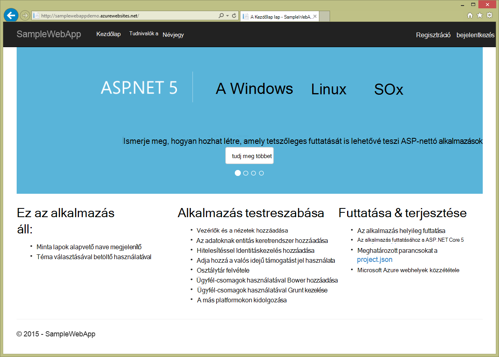

## Összefoglalás
Ebben az oktatóprogramban egy webalkalmazás létrehozása a VIEWBEN kódot és Azure kell üzembe megtanulta azt. További információt a VIEWBEN kódot, olvassa el, [Miért Visual Studio Code?](https://code.visualstudio.com/Docs/) Tudni az alkalmazás szolgáltatás web Apps alkalmazások olvassa el a [Web Apps alkalmazások – áttekintés](app-service-web-overview.md)című témakört. 
