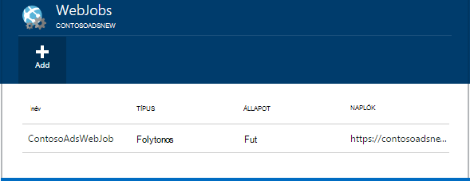
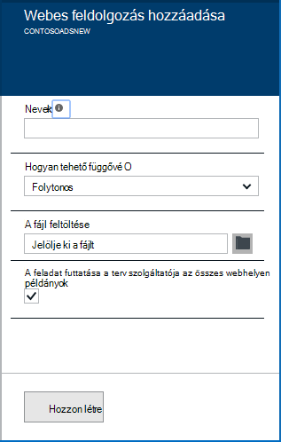
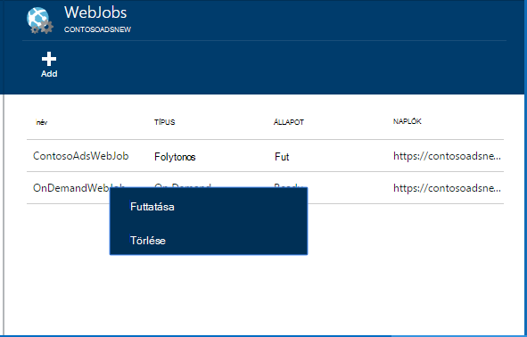
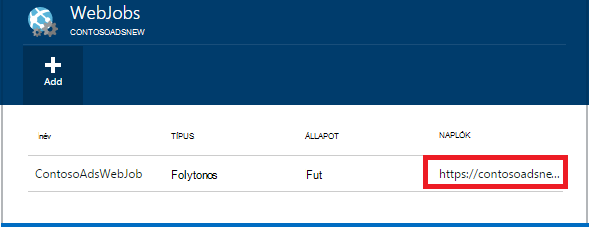

<properties 
    pageTitle="Futtassa a háttérben futó feladatokat WebJobs" 
    description="Megtudhatja, hogy miként futtatása a háttérben futó feladatokat az Azure-webalkalmazásokban." 
    services="app-service" 
    documentationCenter="" 
    authors="tdykstra" 
    manager="wpickett" 
    editor="jimbe"/>

<tags 
    ms.service="app-service" 
    ms.workload="na" 
    ms.tgt_pltfrm="na" 
    ms.devlang="na" 
    ms.topic="article" 
    ms.date="04/27/2016" 
    ms.author="tdykstra"/>

# <a name="run-background-tasks-with-webjobs"></a>Futtassa a háttérben futó feladatokat WebJobs

## <a name="overview"></a>– Áttekintés

Futtathatja a programok és parancsfájlok WebJobs az [Alkalmazás szolgáltatás](http://go.microsoft.com/fwlink/?LinkId=529714) webalkalmazásban háromféleképpen: igény szerinti folyamatosan, vagy ütemezés. Nem WebJobs használatához külön költség nélkül.

Ebből a cikkből megtudhatja, hogyan WebJobs telepítse az [Azure Portal](https://portal.azure.com)segítségével. A Visual Studio vagy kézbesítési folytonos folyamat üzembe olvashat megtudhatja, [hogy miként Web Apps alkalmazások terjesztése Azure WebJobs](websites-dotnet-deploy-webjobs.md).

Az Azure WebJobs SDK leegyszerűsíti a tevékenységek programozási sok WebJobs. További tudnivalókért olvassa el a [Mi az a WebJobs SDK](websites-dotnet-webjobs-sdk.md)című témakört.

 Azure függvények (jelenleg az előzetes verzió) a programok és a parancsfájlok futtatásának Azure App szolgáltatásban egy másik módja. További információ az [Azure függvények áttekintése](../azure-functions/functions-overview.md)című témakörben találhat.

[AZURE.INCLUDE [app-service-web-to-api-and-mobile](../../includes/app-service-web-to-api-and-mobile.md)] 

## <a name="acceptablefiles"></a>A Programok telepítése és parancsfájlok elfogadható fájltípusok

A következő fájltípusok elfogadott:

* .cmd, .bat, .exe (windows cmd használata)
* .ps1 (a powershell használatával)
* .SH (bash használata)
* .php (php használata)
* .PY (python használata)
* .js (csomópont használata)
* .JAR (java használata)

## <a name="CreateOnDemand"></a>Hozzon létre egy az igény szerinti WebJob a portálon

1. Jelölje ki a az [Azure-portálon](https://portal.azure.com) **Web App** lap kattintson **összes beállításai > WebJobs** a **WebJobs** lap megjelenítéséhez.
    
    
    
5. Kattintson a **hozzáadása**gombra. Megjelenik a **WebJob hozzáadása** párbeszédpanel.
    
    
    
2. A **név**mezőben adja meg a WebJob nevét. A név egy betűt vagy egy számot kell kezdődnie, és nem tartalmazhat speciális karaktereket más, mint "-" és "_".
    
4. **Hogyan kell a Futtatás** párbeszédpanelen válassza a **igény szerinti futtatása**.
    
3. A **Fájl feltöltése** párbeszédpanelen kattintson a mappaikonra, és keresse meg a parancsfájlt tartalmazó zip-fájl. A zip-fájl a program vagy parancsfájl futtatásához szükséges támogató fájlokat és a végrehajtható fájl (.exe .cmd .bat .sh .php .py .js) tartalmazhat.
    
5. Jelölje be a **Létrehozás** töltse fel a parancsfájl a web App alkalmazásban. 
    
    A WebJob megadott neve megjelenik a **WebJobs** lap listában.
    
6. A WebJob futtatásához kattintson a jobb gombbal a nevére a listában, és kattintson a **Futtatás**parancsra.
    
    
    
## <a name="CreateContinuous"></a>Hozzon létre egy folyamatosan működő WebJob

1. A folyamatos végrehajtó WebJob létrehozásához kövesse ezeket a lépéseket, hogy fut egyszer, de **hogyan kell a Futtatás** párbeszédpanelen válassza a **folyamatos**egy WebJob hozhat létre.

2. Szeretne beírni, vagy állítsa le a folyamatos WebJob, kattintson a jobb gombbal a WebJob a listában, és **indítása** és **leállítása**gombra.
    
> [AZURE.NOTE] Ha egynél több példány fut a web App alkalmazásban, egy folyamatosan működő WebJob összes a példányok fog futni. Igény szerinti és az ütemezett WebJobs futtathat egy példányát, a terheléselosztás, a Microsoft Azure-e jelölve.
    
> Folytonos WebJobs futtatásához a megbízható és összes előfordulását, engedélyezze a mindig a * konfigurációs beállításával kapcsolatban a web app más módszerekkel is megakadályozhatja a fut, amikor a SCM kezelőben nem túl sokáig dolgozik.

## <a name="CreateScheduledCRON"></a>Hozzon létre egy ütemezett WebJob CRON kifejezéssel

Ez a módszer Basic, a normál vagy a prémium üzemmód futásának webalkalmazások számára érhető el, és engedélyezhető az alkalmazást a **Mindig a** beállítás van szükség.

Egy a igény szerinti WebJob alakítani egy ütemezett WebJob, egyszerűen tartalmaz egy `settings.job` fájl a legfelső szintű WebJob zip-fájljait. A JSON-fájl tartalmaznia kell egy `schedule` egy [CRON kifejezés](https://en.wikipedia.org/wiki/Cron)az alábbi példában egy tulajdonságot.

6 mezők tevődik össze a CRON kifejezés: `{second} {minute} {hour} {day} {month} {day of the week}`.

Például a WebJob 15 percenként elindítani a `settings.job` szeretné, hogy:

```json
{
    "schedule": "0 */15 * * * *"
}
``` 

Más CRON ütemezés példák:

- Óránként (azaz, amikor a percek számát értéke 0):`0 0 * * * *` 
- Óránként a 9-es AM 5 délután:`0 0 9-17 * * *` 
- A 9:30 de naponta:`0 30 9 * * *`
- A 9:30 de hét mindennap:`0 30 9 * * 1-5`

**Megjegyzés**: Ha üzembe helyezné a Visual Studio WebJob, ügyeljen arra, hogy a megjelölés a `settings.job` fájltulajdonságok másolatként"Ha újabb".


## <a name="CreateScheduled"></a>Hozzon létre egy ütemezett WebJob az Azure ütemterv használata

A következő helyettesítő technika tesz az Azure ütemezőt. Ebben az esetben a WebJob nem rendelkezik közvetlen ismerete az ütemtervet. Ehelyett az Azure ütemező kap konfigurálva, hogy a WebJob időközönként elindítani. 

Az Azure-portálon még nem rendelkezik az azt jelenti, hogy hozzon létre egy ütemezett WebJob, de, amíg funkció hozzáadása a [Klasszikus portál](http://manage.windowsazure.com)használatával is megteheti.

1. A [Klasszikus portálon](http://manage.windowsazure.com) nyissa meg a WebJob lapot, és kattintson a **Hozzáadás**gombra.

1. **Hogyan kell a Futtatás** párbeszédpanelen válassza a **időközönként futtassa**.
    
    ![Új ütemezett feladat][NewScheduledJob]
    
2. A feladat **Ütemező régió** , és kattintson a jobb alsó párbeszédpanel a folytassa a következő képernyőn a nyílra.

3. A **Projekt létrehozása** párbeszédpanelen válassza ki a használni kívánt **ismétlődési** : **egyszeri** vagy **ismétlődő feldolgozás**.
    
    ![Ismétlődés ütemezése][SchdRecurrence]
    
4. Is adja meg a **kezdési** időpontját: **most** vagy **egy adott időpontban**.
    
    ![Ütemezés kezdetének][SchdStart]
    
5. Ha szeretne egy adott időben kezdődjenek, válassza a kezdési idő érték a **Kezdési alapja**.
    
    ![Egy adott időpontban Kimutatás indítása][SchdStartOn]
    
6. Ha úgy döntött, hogy egy ismétlődő feladatot, akkor a **Ismétlődés minden** előfordulás és a **Befejezési a** vezérlőt, amellyel a befejezési időpontot adja meg az ismétlődési megadása lehetőséget.
    
    ![Ismétlődés ütemezése][SchdRecurEvery]
    
7. Ha úgy dönt, hogy a **hét**, jelölje be a **Egy adott ütemezés szerint** , és adja meg a feladat futtatása, amelyet a hét napjait.
    
    ![A hét napjai ütemezése][SchdWeeksOnParticular]
    
8. Ha válassza ki a **hónap** , és jelölje be a **Egy adott ütemezés szerint** , beállíthatja, hogy a feladat a hónap adott számozott **nap** futtatásához. 
    
    ![A hónap adott dátumok ütemezése][SchdMonthsOnPartDays]
    
9. Ha úgy dönt, hogy a **Hét napjai**, melyik napon vagy a hét napjai választhat a hónap azt szeretné, hogy a feladat futtatását.
    
    ![A hónap adott hét napjainak ütemezése][SchdMonthsOnPartWeekDays]
    
10. Végezetül is használhatja az **előfordulások** beállítás a hónap mely hét választható (első, második, harmadik stb.) a feladatot a hét napjai megadott futtatni szeretné.
    
    ![Egy adott hetek adott hét napjai ütemezése][SchdMonthsOnPartWeekDaysOccurences]
    
11. Miután létrehozott egy vagy több feladatok, a nevük állapotuk, ütemezés típusa és egyéb adatokat tartalmazó WebJobs lapon jelenik meg. A legutóbbi 30 WebJobs a korábbi adatok karbantartása.
    
    ![Feladatok lista][WebJobsListWithSeveralJobs]
    
### <a name="Scheduler"></a>Ütemezett feladatok és Azure ütemező

Ütemezett feladat további beállíthatók a [Klasszikus portál](http://manage.windowsazure.com)Azure ütemező oldalát.

1.  WebJobs lapján kattintson a feladat **ütemezése** hivatkozásra kattintva nyissa meg azt a Azure ütemezőt portáloldalon. 
    
    ![Azure ütemező mutató hivatkozás][LinkToScheduler]
    
2. Az ütemező lapon kattintson a feladat.
    
    ![A Feladatütemező portáloldalon feladat][SchedulerPortal]
    
3. Megnyílik a **feladat művelet** lap, ahol további beállításokat adhat meg a feladatot. 
    
    ![Feladat művelet PageInScheduler][JobActionPageInScheduler]
    
## <a name="ViewJobHistory"></a>A előzményeinek megtekintése

1. Egy projekt, beleértve a WebJobs SDK létrehozott feladatok végrehajtása előzmények megtekintéséhez kattintson a megfelelő hivatkozásra a WebJobs lap **Naplók** oszlopában. (Is használhatja a vágólap ikonjának másolja a vágólapra az URL-cím, a naplófájl fájl lap sorból.)
    
    
        
2. A WebJob a hivatkozására való kattintás megnyitja a részleteket tartalmazó lapot. Ezen a lapon megjelenik a parancs futtatása, az utolsó alkalommal fut, és a megoldás sikeres vagy sikertelen nevét. A **Legutóbbi feladat fut**kattintson a további részletek megtekintéséhez egy olyan időpontra.
    
    ![WebJobDetails][WebJobDetails]
    
3. Megjelenik a **WebJob futtatása részleteket tartalmazó** lapot. Kattintson a **Váltása a kimeneti** látni a szöveget a napló tartalmát. A kimeneti napló-szöveg formátumban van. 
    
    ![Webes feladat futtatása részletei][WebJobRunDetails]
    
4. A kimenet szöveget külön böngészőablakban megtekintéséhez kattintson a **Letöltés** hivatkozásra. Töltse le a szöveget magát, kattintson a jobb gombbal a hivatkozásra, és használja a böngésző beállításai mentéséhez a fájl tartalmát.
    
    ![Töltse le a naplózás][DownloadLogOutput]
    
5. A **WebJobs** hivatkozásra a lap tetején az előzmények irányítópulton WebJobs listájának eléréséhez kényelmesen biztosít.
    
    ![WebJobs lista csatolása][WebJobsLinkToDashboardList]
    
    ![Az előzmények irányítópulton WebJobs listája][WebJobsListInJobsDashboard]
    
    Az alábbi hivatkozásokra kattintva megnyitja a WebJob Részletek lap a kijelölt projektre vonatkozóan.


## <a name="WHPNotes"></a>Jegyzetek
    
- Web Apps alkalmazások ingyenes módban is időkorlátja, után 20 perc, ha nincs kérelmek a scm (telepítés) webhely és a web app-portálon nem nyílnak meg az Azure. A tényleges webhelyet kérések visszaállítása Ez nem.
- A folyamatos feladat kódját van szüksége ahhoz, hogy futtatni végtelen ciklusban.
- Folytonos feladatok folyamatosan futtatása csak akkor, amikor fel a web app.
- Egyszerű és a mindig a szabványos módok ajánlat funkció, ha engedélyezve van, megakadályozza, hogy a web Apps alkalmazások valamit üresjárati.
- Folyamatosan futó WebJobs csak hibakeresési. Ütemezett vagy igény szerinti WebJobs hibakeresése során nem támogatott.

## <a name="NextSteps"></a>Következő lépések
 
További tudnivalókért lásd: [Azure WebJobs ajánlott erőforrások][WebJobsRecommendedResources].

[PSonWebJobs]:http://blogs.msdn.com/b/nicktrog/archive/2014/01/22/running-powershell-web-jobs-on-azure-websites.aspx
[WebJobsRecommendedResources]:http://go.microsoft.com/fwlink/?LinkId=390226

[OnDemandWebJob]: ./media/web-sites-create-web-jobs/01aOnDemandWebJob.png
[WebJobsList]: ./media/web-sites-create-web-jobs/02aWebJobsList.png
[NewContinuousJob]: ./media/web-sites-create-web-jobs/03aNewContinuousJob.png
[NewScheduledJob]: ./media/web-sites-create-web-jobs/04aNewScheduledJob.png
[SchdRecurrence]: ./media/web-sites-create-web-jobs/05SchdRecurrence.png
[SchdStart]: ./media/web-sites-create-web-jobs/06SchdStart.png
[SchdStartOn]: ./media/web-sites-create-web-jobs/07SchdStartOn.png
[SchdRecurEvery]: ./media/web-sites-create-web-jobs/08SchdRecurEvery.png
[SchdWeeksOnParticular]: ./media/web-sites-create-web-jobs/09SchdWeeksOnParticular.png
[SchdMonthsOnPartDays]: ./media/web-sites-create-web-jobs/10SchdMonthsOnPartDays.png
[SchdMonthsOnPartWeekDays]: ./media/web-sites-create-web-jobs/11SchdMonthsOnPartWeekDays.png
[SchdMonthsOnPartWeekDaysOccurences]: ./media/web-sites-create-web-jobs/12SchdMonthsOnPartWeekDaysOccurences.png
[RunOnce]: ./media/web-sites-create-web-jobs/13RunOnce.png
[WebJobsListWithSeveralJobs]: ./media/web-sites-create-web-jobs/13WebJobsListWithSeveralJobs.png
[WebJobLogs]: ./media/web-sites-create-web-jobs/14WebJobLogs.png
[WebJobDetails]: ./media/web-sites-create-web-jobs/15WebJobDetails.png
[WebJobRunDetails]: ./media/web-sites-create-web-jobs/16WebJobRunDetails.png
[DownloadLogOutput]: ./media/web-sites-create-web-jobs/17DownloadLogOutput.png
[WebJobsLinkToDashboardList]: ./media/web-sites-create-web-jobs/18WebJobsLinkToDashboardList.png
[WebJobsListInJobsDashboard]: ./media/web-sites-create-web-jobs/19WebJobsListInJobsDashboard.png
[LinkToScheduler]: ./media/web-sites-create-web-jobs/31LinkToScheduler.png
[SchedulerPortal]: ./media/web-sites-create-web-jobs/32SchedulerPortal.png
[JobActionPageInScheduler]: ./media/web-sites-create-web-jobs/33JobActionPageInScheduler.png
 
