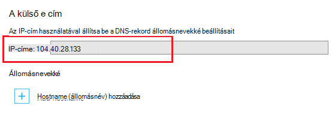

<properties
    pageTitle="Egyéni tartománynév hozzárendelése az Azure-alkalmazásokban"
    description="Megtudhatja, hogy miként egyéni tartománynevet (méltóság tartomány) megfeleltetése Azure alkalmazás szolgáltatás alkalmazását."
    services="app-service"
    documentationCenter=""
    authors="cephalin"
    manager="wpickett"
    editor="jimbe"
    tags="top-support-issue"/>

<tags
    ms.service="app-service"
    ms.workload="na"
    ms.tgt_pltfrm="na"
    ms.devlang="na"
    ms.topic="article"
    ms.date="07/27/2016"
    ms.author="cephalin"/>

# Egyéni tartománynév hozzárendelése az Azure-alkalmazásokban

[AZURE.INCLUDE [web-selector](../../includes/websites-custom-domain-selector.md)]

Ez a cikk bemutatja, hogyan kézi megfeleltetéséhez egyéni tartománynevet a web App alkalmazásban, mobilalkalmazás kódmentes vagy API-alkalmazás [Azure App](../app-service/app-service-value-prop-what-is.md)szolgáltatásban. 

Az alkalmazás már megtalálható a azurewebsites.net egyedi altartományt. Például ha **contoso**az alkalmazás nevére, majd a tartomány nevét is **contoso.azurewebsites.net**. Azonban leképezheti az egyéni tartomány neve alkalmazásba úgy, hogy az URL-CÍMÉT, például: `www.contoso.com`, márka tükrözi.

>[AZURE.NOTE] Segítségért felkeresheti az [Azure fórumok](https://azure.microsoft.com/support/forums/)Azure szakértőktől. Nyissa meg a [webhely támogatja az Azure](https://azure.microsoft.com/support/options/) még magasabb szintű támogatást, és kattintson az **Első támogatja**.

[AZURE.INCLUDE [introfooter](../../includes/custom-dns-web-site-intro-notes.md)]

## Egyéni tartomány vásárlása az Azure-portálon

Ha még nem már vásárolt egy egyéni tartománynevet, vásárolhat egyet, és kezelheti a közvetlenül a az alkalmazás beállításai az [Azure-portálon](https://portal.azure.com). Ezt a beállítást megkönnyíti egyéni tartományt feleltesse meg az alkalmazást, hogy az alkalmazás [Azure forgalom Manager](web-sites-traffic-manager-custom-domain-name.md) használja, vagy sem. 

Útmutatásért lásd: az [alkalmazás szolgáltatás egyéni tartománynév vásárlásához](custom-dns-web-site-buydomains-web-app.md).

## Feleltesse meg egy egyéni tartományt vásárolta, külső felhasználókkal

Ha már vásárolt egy egyéni tartományt [Azure DNS-](https://azure.microsoft.com/services/dns/) ből, vagy külső szolgáltatóról, három fő lépésből áll az egyéni tartomány hozzárendelése az alkalmazást:

1. [ *(Csak egy a rekordot)* beszerzése app IP-címet](#vip).
2. [Feleltesse meg, hogy az alkalmazás a tartomány DNS-rekordok létrehozása](#createdns). 
    - **Hol**: a tartományregisztráló saját tartománykezelési eszközzel (pl. Azure DNS, GoDaddy stb.).
    - **Miért**: így a tartományregisztrálója lefagyását megtudhatja, a kívánt egyéni tartományt az Azure alkalmazásba.
1. [Az egyéni tartománynév az Azure-alkalmazás engedélyezése](#enable).
    - **Hol**: az [Azure-portálon](https://portal.azure.com).
    - **Miért**: így tudja, hogy az alkalmazás végzett az egyéni tartománynevet kérelmekre válaszolni.
3. [A DNS ellenőrzése propagálása](#verify).

### A tartományok képezhető típusai

Azure alkalmazás szolgáltatás lehetővé teszi a feleltesse meg az alkalmazás a következő kategóriák tartományait.

- **Legfelső szintű tartomány** - a tartomány nevét a tartományregisztrálónál lefoglalt (jelöli a `@` általában állomás rekord,). Például **: contoso.com**.
- **Altartomány** – egy tetszőleges tartomány, amely a legfelső szintű tartomány csoportban. Például: **www.contoso.com** (jelöli a `www` állomás rekord).  Különböző altartományokat azonos legfelső szintű tartomány képezhető le más alkalmazások Azure-ban.
- **Helyettesítő tartomány** - [bármely altartomány, amelynek bal szélső DNS címke `*` ](https://en.wikipedia.org/wiki/Wildcard_DNS_record) (például a rekordjait üzemelteti `*` és `*.blogs`). Ha például ** \*. contoso.com**.

### Használhatja a DNS-rekordok típusai

Attól függően, hogy a segítségre van szüksége két különböző típusú normál DNS-rekordok is használhatja az egyéni tartomány megfeleltetése: 

- [A](https://en.wikipedia.org/wiki/List_of_DNS_record_types#A) - az egyéni tartománynevet az Azure alkalmazás virtuális IP-cím közvetlenül térképeket. 
- [CNAME](https://en.wikipedia.org/wiki/CNAME_record) - megfeleltetések az egyéni tartománynevet az alkalmazás Azure tartománynevére, * *&lt;*alkalmazásnév*>. azurewebsites.net**. 

A CNAME előnye, hogy azt is fennáll, IP-cím változását keresztül. Ha törlése és hozza létre az alkalmazást, vagy egy újabb árak réteg átállítása visszatérhet a **megosztott** réteg, az alkalmazás virtuális IP-cím változhat. Egy módosítása keresztül egy CNAME rekordot még érvényes, mivel az A rekord frissítésére van szüksége. 

Az oktatóprogram lépéseit az A rekordot a és a CNAME rekordot a mutatja.

>[AZURE.IMPORTANT] Ne hozzon létre egy CNAME rekordot a legfelső szintű tartomány (azaz a "legfelső szintű rekord"). További tudnivalókért olvassa el a [Miért nem egy CNAME rekordot használható a gyökértartomány](http://serverfault.com/questions/613829/why-cant-a-cname-record-be-used-at-the-apex-aka-root-of-a-domain)című témakört.
Feleltesse meg a legfelső szintű tartomány az Azure-alkalmazást, használja inkább egy A rekordot.

## Lépés: 1. *(Csak egy a rekordot)* Beszerzése app IP-cím
Rekord helyett egyéni tartománynevet megfeleltetéséhez az Azure-alkalmazás IP-cím meg kell. Rendelje az használja egy CNAME rekordot, ha a lépés kihagyását, és helyezze át a következő szakaszban az alakzatot.

1.  Jelentkezzen be az [Azure-portálon](https://portal.azure.com).

2.  Kattintson az **Alkalmazás szolgáltatások** a bal oldali menüben.

4.  Kattintson a sablonra, majd kattintson az **egyéni tartományok**.

6.  Jegyezze fel a IP-címének állomásnevekké szakasz fölé.

    

7.  Ez a portál lap nyitva hagyása. Ön lesz térjen vissza az azt a DNS-rekordok létrehozása után.

## Lépés: 2. A DNS-rekord létrehozása

Jelentkezzen be a tartományregisztrálója és azok eszközzel hozzáadása egy A rekordot vagy a CNAME rekordot. Minden tartományregisztráló felhasználói felület is némileg eltér, ezért nézze át a szolgáltató dokumentációt. Jó helyen jár az alábbiakban néhány tippet olvashat.

1.  A lap megkereséséhez a DNS-rekordok kezelésére szolgáló. Keresse meg a hivatkozásokat, vagy a **Tartománynevet**, **DNS**vagy **Név kiszolgáló kezelése**feliratú webhely részeinek. A hivatkozás gyakran megtekintése a fiók adatait, és majd keres egy hivatkozást, például **a tartományok**is megkeresheti.
2.  Keresse meg a hivatkozás, amellyel a DNS-rekordok hozzáadása és szerkesztése. Ez az valószínűleg az **zónafájl** vagy a **DNS-rekordok** hivatkozásra, vagy egy **Speciális** beállításai hivatkozásra.
3.  Hozza létre a rekordot, és mentse a módosításokat.
    - [Itt áll útmutatók egy A rekordot](#a).
    - [Itt áll útmutatók egy CNAME rekordot](#cname).

### Hozzon létre egy A rekordot.

Az Azure-alkalmazás IP-cím hozzárendelése egy rekord használatához ténylegesen létrehozásához szükséges az A rekord és a TXT rekord. Az A rekordot a DNS-feloldási magát, és a TXT-rekord szolgál, hogy az egyéni tartománynév tulajdonjogának igazolása az Azure. 

Állítsa be az alábbi képlettel történik a rekord (@ általában az a gyökértartomány jelöl):
 
<table cellspacing="0" border="1">
  <tr>
    <th>Teljesen minősített tartománynév példa</th>
    <th>A Host</th>
    <th>Érték</th>
  </tr>
  <tr>
    <td>a contoso.com (legfelső szintű)</td>
    <td>@</td>
    <td>Az IP-cím <a href="#vip">lépés 1</a></td>
  </tr>
  <tr>
    <td>www.contoso.com (sub)</td>
    <td>www</td>
    <td>Az IP-cím <a href="#vip">lépés 1</a></td>
  </tr>
  <tr>
    <td>*. contoso.com (helyettesítő karakter)</td>
    <td>*</td>
    <td>Az IP-cím <a href="#vip">lépés 1</a></td>
  </tr>
</table>

A további TXT rekord veszi fel az használni, amely a hozzárendeli &lt; *altartomány*>. &lt; *rootdomain*> való &lt; *Alkalmazásnév*>. azurewebsites.net. Állítsa be a TXT rekord a az alábbi képlettel történik:

<table cellspacing="0" border="1">
  <tr>
    <th>Teljesen minősített tartománynév példa</th>
    <th>A TXT-szolgáltató</th>
    <th>TXT-érték</th>
  </tr>
  <tr>
    <td>a contoso.com (legfelső szintű)</td>
    <td>@</td>
    <td>&lt;<i>Alkalmazásnév</i>>. azurewebsites.net</td>
  </tr>
  <tr>
    <td>www.contoso.com (sub)</td>
    <td>www</td>
    <td>&lt;<i>Alkalmazásnév</i>>. azurewebsites.net</td>
  </tr>
  <tr>
    <td>*. contoso.com (helyettesítő karakter)</td>
    <td>*</td>
    <td>&lt;<i>Alkalmazásnév</i>>. azurewebsites.net</td>
  </tr>
</table>

###Hozzon létre egy CNAME rekordot

Ha egy CNAME rekordot feleltesse meg az Azure-alkalmazás használt alapértelmezett tartománynevet használ, egy további TXT rekordot, mint a-rekord nem szükséges. 

>[AZURE.IMPORTANT] Ne hozzon létre egy CNAME rekordot a legfelső szintű tartomány (azaz a "legfelső szintű rekord"). További tudnivalókért olvassa el a [Miért nem egy CNAME rekordot használható a gyökértartomány](http://serverfault.com/questions/613829/why-cant-a-cname-record-be-used-at-the-apex-aka-root-of-a-domain)című témakört.
Feleltesse meg a legfelső szintű tartomány az Azure-alkalmazást, használja inkább az [A rekordot](#a) .

Állítsa be az alábbi képlettel történik a CNAME rekord (@ általában az a gyökértartomány jelöl):

<table cellspacing="0" border="1">
  <tr>
    <th>Teljesen minősített tartománynév példa</th>
    <th>CNAME Host</th>
    <th>CNAME értéket.</th>
  </tr>
  <tr>
    <td>www.contoso.com (sub)</td>
    <td>www</td>
    <td>&lt;<i>Alkalmazásnév</i>>. azurewebsites.net</td>
  </tr>
  <tr>
    <td>*. contoso.com (helyettesítő karakter)</td>
    <td>*</td>
    <td>&lt;<i>Alkalmazásnév</i>>. azurewebsites.net</td>
  </tr>
</table>

##3 a lépést. Az egyéni tartománynév-alkalmazás engedélyezése

Vissza az **Egyéni tartományok** fel az Azure-portálra a (lásd az [lépés 1](#vip)) kell a teljes tartománynevét (FQDN) az egyéni tartomány felvétele a listára.

1.  Ha még nem tette, jelentkezzen be az [Azure-portálon](https://portal.azure.com).

2.  Az Azure-portálon kattintson a **Szolgáltatások alkalmazás** a bal oldali menüben.

3.  Kattintson az alkalmazást, majd kattintson az **egyéni tartományok** > **hozzáadása hostname (állomásnév)**.

4.  A teljesen minősített tartománynév az egyéni tartomány hozzáadása a lista (például **www.contoso.com**).

    

    >[AZURE.NOTE] Azure megpróbálja ellenőrizni a tartománynevet, amely Itt adhat meg. Győződjön meg arról, hogy-e, amelynek a [2](#createdns)létrehozott DNS-rekord ugyanarra a tartománynévre. 

5.  Kattintson az **érvényesítés**gombra.

6.  **Érvényesítése** Azure kattintás után a program szolgáltatás tartomány hitelesítése a munkafolyamat elindításához. Ez ellenőrzi, hogy a tartomány tulajdonjogát, valamint a hostname (állomásnév) rendelkezésre állásának és a jelentés sikeres vagy a elfogadott guidence olvashat a hiba kijavításához a hiba részletes.    

7.  Sikeres érvényességi **hozzáadása hostname (állomásnév)** után gomb aktívvá válik, és meg tudják a hozzárendelése hostname (állomásnév). 

8.  Azure befejeződése után az új egyéni tartománynév beállítása után nyissa meg az egyéni tartománynevet a böngészőben. A böngészőben nyíljon meg az Azure alkalmazást, ami azt jelenti, hogy az egyéni tartománynevet megfelelően van-e beállítva.

> [AZURE.NOTE] Ha DNS-rekord már használja (a tartomány aktív szolgáló forgalom helyzet), és kell preemptively kötést létrehozni a web App alkalmazásban, a tartomány hitelesítése, egyszerűen létrehozhat egy TXT-rekordok példaként az alábbi táblázatban látható. A további TXT rekord veszi fel az használni, amely a hozzárendeli &lt; *altartomány*>. &lt; *rootdomain*> való &lt; *Alkalmazásnév*>. azurewebsites.net. 
> <table cellspacing="0" border="1">
  <tr>
    <th>Teljesen minősített tartománynév példa</th>
    <th>A TXT-szolgáltató</th>
    <th>TXT-érték</th>
  </tr>
  <tr>
    <td>a contoso.com (legfelső szintű)</td>
    <td>awverify.contoso.com</td>
    <td>&lt;<i>Alkalmazásnév</i>>. azurewebsites.net</td>
  </tr>
  <tr>
    <td>www.contoso.com (sub)</td>
    <td>awverify.www.contoso.com</td>
    <td>&lt;<i>Alkalmazásnév</i>>. azurewebsites.net</td>
  </tr>
    <tr>
    <td>*. contoso.com (sub)</td>
    <td>awverify.*.contoso.com</td>
    <td>&lt;<i>Alkalmazásnév</i>>. azurewebsites.net</td>
  </tr>
</table>
A DNS-rekord létrehozása után térjen vissza az Azure-portálra, és az egyéni tartománynév hozzáadása a web App alkalmazásban.
 

##Ellenőrizze a DNS-propagálása

Beállítási lépések után eltarthat egy kis időt, a módosítások propagálása, attól függően, hogy a DNS-szolgáltatónál. Ellenőrizheti, hogy a DNS-propagálása [http://digwebinterface.com/](http://digwebinterface.com/)a várt módon működnek-e. Után nyissa meg azt a webhelyet, adja meg a állomásnevekké a mezőben lévő értéket, és kattintson a **alaposabban meg**. Ellenőrizze az eredmények kattintva erősítse meg, ha a legutóbbi változtatások érvénybe léptek.  

> [AZURE.NOTE] A DNS-bejegyzések terjesztését órát is igénybe vehet fel 48 (előfordul, hogy már). Ha minden helyesen van beállítva, van szüksége a sikeres propagálása léptetése.

## Következő lépések
Megtudhatja, hogy miként biztonságos az egyéni tartománynevet a HTTPS [megvásárlása SSL-tanúsítvány Azure-ban](web-sites-purchase-ssl-web-site.md) vagy a [másutt az SSL-tanúsítvány használatával](web-sites-configure-ssl-certificate.md).

>[AZURE.NOTE] Ha azt szeretné, mielőtt feliratkozna az Azure-fiók kezdéshez Azure alkalmazás szolgáltatással, nyissa meg a [Próbálja alkalmazás szolgáltatás](http://go.microsoft.com/fwlink/?LinkId=523751), ahol azonnal létrehozhat egy rövid életű starter web app alkalmazás szolgáltatásban. Nem kötelező, hitelkártyák Nincs nyilatkozatát.

[Azure DNS – első lépések](../dns/dns-getstarted-create-dnszone.md)  
[Egy webalkalmazás DNS-rekordok létrehozása az egyéni tartomány](../dns/dns-web-sites-custom-domain.md)  
[Azure DNS a meghatalmazott tartomány](../dns/dns-domain-delegation.md)

<!-- Images -->
[subdomain]: media/web-sites-custom-domain-name/azurewebsites-subdomain.png
