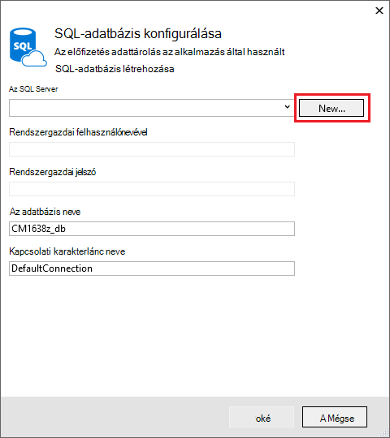
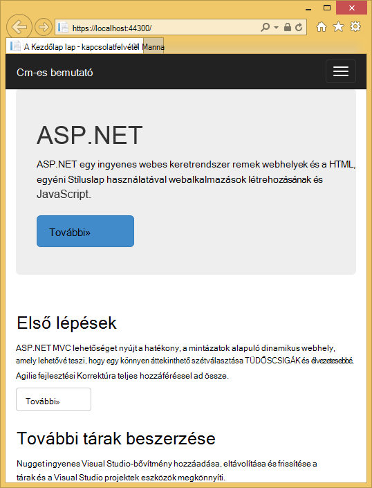
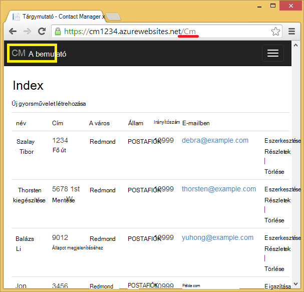
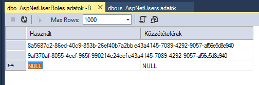

<properties 
    pageTitle="ASP.NET MVC alkalmazás auth és SQL-adatbázis létrehozása, és telepítse az Azure alkalmazás szolgáltatás" 
    description="Útmutató az SQL-adatbázis háttéradatbázis ASP.NET MVC 5 alkalmazás fejlesztése, hitelesítési és engedélyezési hozzáadása és Azure beállítaná őket." 
    services="app-service\web" 
    documentationCenter=".net" 
    authors="Rick-Anderson" 
    writer="Rick-Anderson" 
    manager="wpickett" 
    editor=""/>

<tags 
    ms.service="app-service-web" 
    ms.workload="web" 
    ms.tgt_pltfrm="na" 
    ms.devlang="dotnet" 
    ms.topic="article" 
    ms.date="03/21/2016" 
    ms.author="riande"/> 

# ASP.NET MVC alkalmazás auth és SQL-adatbázis létrehozása, és telepítse az Azure alkalmazás szolgáltatás

Ebből az oktatóanyagból megtudhatja, hogy miként biztonságos ASP.NET MVC 5-webalkalmazást, amely lehetővé teszi, hogy a felhasználók log be hitelesítő adatait a Facebookon vagy a Google összeállítása. Az alkalmazás által ADO.NET entitás keretében az adatbázis elérése egyszerű névjegylista. Az alkalmazás [Azure alkalmazás](http://go.microsoft.com/fwlink/?LinkId=529714)szolgáltatásba fog rendszerbe. 

Az oktatóprogram befejezése, a biztonságos adatalapú webalkalmazás felfelé, és a felhőben fut, és használja a felhőben adatbázis lesz. Az alábbi ábrán a kész alkalmazást bejelentkezési lapját.

![bejelentkezési lapja][rxb]

Dióhéjban:

* Hogyan lehet a Visual Studióban biztonságos ASP.NET MVC 5 webes projekt létrehozása.
* Hogyan lehet hitelesítheti és engedélyezheti a felhasználók, akik a Google- vagy Facebook-fiókját (közösségi szolgáltató hitelesítéssel [OAuth 2.0-s](http://oauth.net/2 "http://oauth.net/2")) a hitelesítő adataival jelentkezzen be.
* Hogyan lehet hitelesítheti és engedélyezheti a felhasználók, akik egy adatbázisban, az alkalmazás (helyi hitelesítéssel [ASP.NET-azonosító](http://asp.net/identity/)) által felügyelt regisztrálni.
* Hogyan használható a ADO.NET entitás keretrendszer 6 kód első adatainak olvasása és írása SQL-adatbázisban.
* Hogyan lehet adatbázis entitás keretrendszer kód első áttelepítések használatával.
* Hogyan lehet a felhőben relációs adatok tárolására Azure SQL-adatbázis.
* Egy [webalkalmazás](http://go.microsoft.com/fwlink/?LinkId=529714) adatbázis Azure App szolgáltatásban használó webes projekt telepítéséről.

>[AZURE.NOTE] Ez a hosszú oktatóanyagot. Azure alkalmazás szolgáltatás és a Visual Studio webes projektek rövid útmutatást talál, című témakörben olvashat [létrehozása az Azure-App szolgáltatásban ASP.NET-webappokban](web-sites-dotnet-get-started.md). Hibaelhárítási információ, a [Hibaelhárítás](#troubleshooting) című részben talál.
>
>Vagy ha azt szeretné, mielőtt feliratkozna az Azure-fiók használatbavételéhez Azure alkalmazás szolgáltatás, [Próbálja meg alkalmazás szolgáltatás](http://go.microsoft.com/fwlink/?LinkId=523751), ahol azonnal létrehozhat egy rövid életű starter web app alkalmazás szolgáltatásban. Nem kötelező, hitelkártyák Nincs nyilatkozatát.

## Előfeltételek

Oktatóprogram elvégzéséhez a Microsoft Azure-fiókra van szüksége. Ha nem rendelkeznek fiókkal, akkor [aktiválása a Visual Studio előfizetői juttatások](/pricing/member-offers/msdn-benefits-details/?WT.mc_id=A261C142F) , vagy [regisztráció az ingyenes próbaverziót](/pricing/free-trial/?WT.mc_id=A261C142F).

A fejlesztői környezet beállításához telepíteni kell a [Visual Studio 2013 frissítés 5](http://go.microsoft.com/fwlink/?LinkId=390521) vagy újabb verziójával, és az [Azure SDK a .NET rendszerhez](http://go.microsoft.com/fwlink/?linkid=324322&clcid=0x409)legújabb verzióját. Ez a cikk a Visual Studio frissítés 4-es és SDK 2.8.1 készült. Ugyanezeket a lépéseket a legújabb [Azure SDK a .NET rendszerhez](http://go.microsoft.com/fwlink/?linkid=518003&clcid=0x409) telepítve van a Visual Studio 2015 működik, de néhány képernyő eltér az ábrák fog kinézni.

## ASP.NET MVC 5-alkalmazás létrehozása

### A projekt létrehozása

1. Kattintson a **fájl** menü **Új projektet**.

    

1. **Új projekt** párbeszédpanelen bontsa ki a **C#** és **webes** **Telepített sablonok**csoportban válassza ki, és válassza a **ASP.NET webalkalmazás**parancsra. Nevezze el az alkalmazás **ContactManager**, és kattintson **az OK**gombra.

    
 
    **Megjegyzés:** Győződjön meg arról, hogy a beírt "ContactManager". Kód megakadályozza, hogy meg kell másolni, később feltételezik, hogy a projekt neve ContactManager. 

1. **Új ASP.NET projekt** párbeszédpanelen válassza ki a **MVC** sablont. Ellenőrizze **hitelesítés** **Egyes felhasználói fiókok**beállítása, **a felhőben Host** be van jelölve, és az **Alkalmazás szolgáltatás** ki van jelölve.

    

1. Kattintson az **OK gombra**.

1. A **Microsoft Azure Web App beállítások megadása** párbeszédpanel jelenik meg. Előfordulhat, hogy jelentkezzen be, ha azt még nem tette, vagy írja be újra a hitelesítő adatait, ha a bejelentkezési lejárt.

1. Választható - megváltoztatása a **Web App nevét** az érték mezőbe (lásd az alábbi képen).

    A web app URL-címe lesz {nevű} .azurewebsites .net, így egyedinek kell lennie az azurewebsites.net tartomány nevét. A Fiókkonfiguráló varázslót úgy, hogy egy szám hozzáfűzése a projekt neve "ContactManager" javaslatokat tesz egy egyedi nevet, és, nem kell aggódnia az ebben az oktatóanyagban.

5. Az **erőforráscsoport** legördülő listában jelölje ki egy már meglévő vagy **Új csoport létrehozása a erőforrás**(lásd az alábbi képen). 

    Ha inkább, választhat egy, már erőforráscsoport. De ha hozzon létre egy új erőforráscsoport, és csak ebben az oktatóanyagban használhassa, egyszerűen hoz létre az oktatóprogram során a velük végzett összes Azure erőforrás törlése lesz. Az erőforrás csoportok információkért [Azure erőforrás-kezelő áttekintése](../azure-resource-manager/resource-group-overview.md)című témakörben találhat. 

5. Az **alkalmazás szolgáltatáscsomagja** legördülő listában válassza ki válasszon egy meglévő tervet vagy a **terv létrehozása új alkalmazás szolgáltatás**(lásd az alábbi képen).

    Ha inkább, választhat egy, már alkalmazás szolgáltatáscsomagja. App milyen szolgáltatáscsomagok információkért [Azure alkalmazás szolgáltatás csomagok meg szeretné vizsgálni áttekintése](../app-service/azure-web-sites-web-hosting-plans-in-depth-overview.md)című témakörben találhat. 

1. Koppintson a **Tallózás további Azure szolgáltatás** egy SQL-adatbázis hozzáadása gombra.

    

1. Koppintson a **+** SQL-adatbázis hozzáadása ikonra.

    

1. Koppintson az **Új** **SQL-adatbázis beállítása** párbeszédpanelen:

    

1. Adjon meg egy nevet a rendszergazda, és olyan erős jelszót.

    

    A kiszolgáló nevének egyedinek kell lennie. Kisbetűk betűket, számjeggyel és kötőjelet tartalmazhat. A példamunkafüzetben a követő kötőjelet nem tartalmazhat. A felhasználónév és jelszó olyan új hitelesítő adatokat, az új kiszolgáló készít. 

    Ha már van egy adatbázis-kiszolgálót, jelölje ki, hogy helyett egy. Adatbázis-kiszolgálók értékes erőforrás, és hozhat létre több adatbázis ugyanarra a kiszolgálóra, tesztelése és fejlesztési helyett az adatbázis-kiszolgálóval adatbázisonként létrehozása általában szeretne. Azonban az ebben az oktatóanyagban csak akkor van szüksége a kiszolgáló ideiglenesen, és a kiszolgáló erőforrás azonos csoportba a webhely létrehozásával, könnyítse törlése mindkét web app és az adatbázis erőforrások erőforráscsoport törlésével, ha már nincs szüksége az oktatóprogram. 

    Ha egy meglévő adatbázis-kiszolgáló beállítást választja, ellenőrizze, a web app és az adatbázis ugyanabban a régióban.

    

4. Koppintson a **létrehozása**gombra.

    Visual Studio a ContactManager webes projektet hoz létre, a erőforráscsoport és a megadott, alkalmazás szolgáltatáscsomagja hoz létre, és a megadott nevű Azure alkalmazás szolgáltatás webalkalmazást hoz létre.

### A lap élőfej és élőláb beállítása

1. **Megoldás Explorer** nyissa meg a *Layout.cshtml* fájlt a *Views\Shared* mappában.

    ![A megoldás Intézőben _Layout.cshtml][newapp004]

1. A *Layout.cshtml* fájlban a ActionLink cserélje le a következő kódot.

    @Html.ActionLink("CMA bemutató","Index","Névjegyek", új {terület =" "}, új { @class ="navigációs sávja – arculatának"})
                   

    Győződjön meg arról, hogy módosítja a harmadik paraméter "Otthonról" a "Névjegyek". A fenti korrektúrát minden oldalon, a névjegyek vezérlő a tárgymutató módszerrel hoz létre a "Névjegyek" hivatkozás. Az alkalmazás nevét, az élőfej és az élőláb ne "Saját ASP.NET-alkalmazások" és "Alkalmazás neve" módosítása "Contact Manager" és "Cm-es bemutató". 
 
### Az alkalmazás futtatásához helyi meghajtóra

1. Nyomja le a CTRL + F5 billentyűkombinációt, ha az alkalmazás futtatásához.

    Az alapértelmezett böngésző megjelenik az alkalmazás kezdőlap lapján.

    

Ez az összes kell tennie az alkalmazást, az Azure fogja rendszerbe létrehozása most. 

## Az Azure alkalmazás telepítése

1. A Visual Studióban kattintson a jobb gombbal a projekt a **Megoldást Intézőben** és a helyi menüből válassza a **Közzététel** .

    
    
    A **Webhely közzététele** varázsló elindul.

1. A **Webhely közzététele** párbeszédpanelen kattintson a **Közzététel**gombra.

    

    A létrehozott alkalmazás most már fut a felhőben. A következő alkalommal, amikor rendszerbe az alkalmazás csak a módosított (vagy új) fájlok kell telepítését.

    

## A projekt SSL engedélyezése ##

1. **Solution Explorer**kattintson a **ContactManager** projektre, majd kattintson az F4 billentyű lenyomásával nyissa meg a **Tulajdonságok** ablak.

3. Állítsa be **az SSL engedélyezve** **Igaz**. 

4. Az **SSL URL-cím**másolása

    Az SSL URL-címe lesz https://localhost:44300 / kivéve, ha a korábban létrehozott SSL-webalkalmazásokban.

    ![SSL engedélyezése][rxSSL]
 
1. A **Megoldás Explorer**kattintson a jobb gombbal a **Contact Manager** -projektet, és válassza a **Tulajdonságok parancsot**.

1. Kattintson a **webhely** fülre.

1. Módosítsa a **Projekt URL-címet** használja az **SSL URL-CÍMÉT** , és mentse a lapot (vezérlő vasárnap).

    
 
1. Ellenőrizze, hogy az Internet Explorer a böngészőben, amely elindítja a Visual Studióban, az alábbi képen látható módon:

    

    A böngésző sorkijelölőre a böngésző elindítja a Visual Studio megadását teszi lehetővé. Jelölje be a több böngészőben, és minden egyes böngészője frissítésére, amikor módosítja a Visual Studio van. További információ [A Visual Studio 2013 használata böngészőben hivatkozás](http://www.asp.net/visual-studio/overview/2013/using-browser-link).

    

1. Nyomja le a CTRL + F5 az alkalmazásnak a futtatására. Kattintson az **Igen** gombra a folyamat megkezdéséhez az önaláírt tanúsítványt által generált IIS Express-meghatalmazó.

     

1. Olvassa el a **Biztonsági figyelmeztetés** párbeszédpanel, és ezután kattintson az **Igen** gombra, ha a tanúsítvány, amely **localhost**telepíteni szeretné.

    

1. Internet Explorer megjeleníti a *Kezdőlap* lap, és nincsenek SSL figyelmeztetések.

     

     Az Internet Explorer akkor hasznos, amikor használni szeretné az SSL, mert fogadja el a tanúsítvány és a figyelmeztetés nélkül HTTPS tartalmát mutatja. Google Chrome és a Microsoft Edge is fogadja el a tanúsítványt. A Firefox saját tanúsítvány áruházból használ, így a figyelmeztető üzenetet jelenít meg.

     

## Az alkalmazás-adatbázis hozzáadása

Ezután frissítenie kell az alkalmazás hozzáadása az azt jelenti, hogy megjelenítése és módosítása a partnerek és tárolja az adatokat az adatbázisban. Az alkalmazás fogja használni a szervezet keretrendszer (EF) az adatbázis létrehozása és olvasása és az adatok frissítéséhez.

### A partnerek adatait modell osztályok hozzáadása

Kezdje el a kód egy egyszerű adatmodell létrehozásával.

1. A **Megoldás Explorer**kattintson a jobb gombbal a modellek mappát, kattintson a **Hozzáadás gombra**, majd az **osztály**.

    

2. **Új elem hozzáadása** párbeszédpanelen nevezze el az új osztályfájl *Contact.cs*, és kattintson a **Hozzáadás**gombra.

    ![Adja hozzá az új elem párbeszédpanel][adddb002]

3. Cserélje le a Contact.cs fájl tartalmát a következő kódot.

        using System.ComponentModel.DataAnnotations;
        using System.Globalization;
        namespace ContactManager.Models
        {
            public class Contact
            {
                public int ContactId { get; set; }
                public string Name { get; set; }
                public string Address { get; set; }
                public string City { get; set; }
                public string State { get; set; }
                public string Zip { get; set; }
                [DataType(DataType.EmailAddress)]
                public string Email { get; set; }
            }
        }
A **partner** osztály határozza meg az adatokat, amely az egyes partnerek, valamint az elsődleges kulcs *ContactID*, az adatbázis szükséges tárolni fogja.

### Lehetővé tevő alkalmazás a névjegyek használata a weblapok létrehozása

A ASP.NET MVC állványon funkció automatikusan létrehozhat kódot, amely hajt végre létrehozása, olvasása, frissítése és törlése (CRUD) műveletek. 

1. Építse fel a projektet **(Ctrl + Shift + B)**. (Kell létrehozni a project a állványon mechanizmusa használata előtt.)
 
1. A **Megoldás Explorer**kattintson a jobb gombbal a vezérlők mappát, és kattintson a **Hozzáadás**gombra, és válassza a **vezérlő**.

    ![Vezérlő hozzáadása a vezérlők mappa helyi menüje][addcode001]

5. **Scaffold hozzáadása** párbeszédpanelen jelölje ki a **MVC 5 vezérlő nézetekkel, EF használ** , és kattintson a **Hozzáadás**gombra.
    
    

1. A **modell osztályához** legördülő mezőben jelölje ki a **partnert (ContactManager.Models)**. (Lásd az alábbi képen.)

1. Jelölje ki az **adatokat helyi osztály** **ApplicationDbContext (ContactManager.Models)**. A **ApplicationDbContext** DB tagság és a partnerek adatait az is használható.

    

1. Kattintson a **hozzáadása**gombra.

   Visual Studio létrehoz egy vezérlő módszerek és nézetek CRUD adatbázis-műveletekhez **partner** objektumok.

## Áttelepítés engedélyezése, az adatbázis létrehozása, és adja meg a mintaadatokat, és egy adatok inicializálója ##

A [Kód első áttelepítések](http://msdn.microsoft.com/library/hh770484.aspx) szolgáltatás engedélyezéséhez az Ön által létrehozott adatmodell alapján adatbázistáblák létrehozásához, akkor a következő feladatot.

1. Az **eszközök** menü válassza a **NuGet csomag Manager** , majd a **Csomag kezelője konzol**.

    

2. A **Csomag kezelője konzol** ablakban adja meg a következő parancsot:

        enable-migrations

    Az **enable-áttelepítések** parancs létrehoz egy *áttelepítések* mappát, és helyezi el a mappába, módosíthatja az adatbázis rendezi, és állítsa be az áttelepítés *Configuration.cs* fájl. 

2. A **Csomag kezelője konzol** ablakban adja meg a következő parancsot:

        add-migration Initial

    A **kezdeti - áttelepítés** parancsot létrehoz egy nevű fájlt ** &lt;date_stamp&gt;kezdeti** az *áttelepítés* mappában. A fájlban a kódot a adatbázistáblák hoz létre. Az első paraméterként ( **kezdeti** ) használatos hozhat létre a fájl nevét. Megjelenik az új osztály fájlokat a **Megoldást Intézőben**.

    Az **első** osztályban a **felfelé** módszerrel hoz létre, a névjegyek táblázat, és a **le** módszerét (Ha meg szeretné térjen vissza az előző állapot) beilleszti azt.

3. Nyissa meg a *Migrations\Configuration.cs* fájlt. 

4. Adja hozzá a következő `using` utasítás. 

         using ContactManager.Models;

5. A *rendező* módszer cserélje ki a következő kódot:

        protected override void Seed(ContactManager.Models.ApplicationDbContext context)
        {
            context.Contacts.AddOrUpdate(p => p.Name,
               new Contact
               {
                   Name = "Debra Garcia",
                   Address = "1234 Main St",
                   City = "Redmond",
                   State = "WA",
                   Zip = "10999",
                   Email = "debra@example.com",
               },
                new Contact
                {
                    Name = "Thorsten Weinrich",
                    Address = "5678 1st Ave W",
                    City = "Redmond",
                    State = "WA",
                    Zip = "10999",
                    Email = "thorsten@example.com",
                },
                new Contact
                {
                    Name = "Yuhong Li",
                    Address = "9012 State st",
                    City = "Redmond",
                    State = "WA",
                    Zip = "10999",
                    Email = "yuhong@example.com",
                },
                new Contact
                {
                    Name = "Jon Orton",
                    Address = "3456 Maple St",
                    City = "Redmond",
                    State = "WA",
                    Zip = "10999",
                    Email = "jon@example.com",
                },
                new Contact
                {
                    Name = "Diliana Alexieva-Bosseva",
                    Address = "7890 2nd Ave E",
                    City = "Redmond",
                    State = "WA",
                    Zip = "10999",
                    Email = "diliana@example.com",
                }
                );
        }

    Kód (mag) előkészíti a kapcsolattartási adatok adatbázis. Az adatbázis rendezi kapcsolatos további tudnivalókért olvassa el a [Seeding és hibakeresés entitás keretrendszer (EF) adatbázisok](http://blogs.msdn.com/b/rickandy/archive/2013/02/12/seeding-and-debugging-entity-framework-ef-dbs.aspx)című témakört. Ellenőrizze, hogy nincsenek fordítási hibák a project összeállítása.

6. A **Csomag kezelője konzol** írja be a parancsot:

        update-database

    ![Csomag Manager konzol parancsai][addcode009]

    Az **adatbázis frissítése** fut, az első áttelepítés, amelyhez létrehozza az adatbázist. Alapértelmezés szerint az adatbázis SQL Server Express LocalDB adatbázis jön létre. 

7. Nyomja le a CTRL + F5 billentyűkombinációt, ha az alkalmazás futtatásához, és kattintson a **Cm -es bemutató** hivatkozásra; vagy nyissa meg azt a https://localhost:(port#)/Cm. 

    Az alkalmazás a rendező adatokat, illetve a szerkesztést, a részletek és a törlés hivatkozást tartalmaz. Létrehozása, szerkesztése, törlése és megtekintheti az adatokat.

    ![Az adatok MVC megtekintése][rx2]

## Az oauth2 hitelesítési mód szolgáltató felvétele

>[AZURE.NOTE] Részletes útmutatást a Google és a Facebook developer portal webhely, ez oktatóanyag mutató hivatkozásokat tartalmaz oktatóanyagok az ASP.NET-webhelyen. Azonban a Google és a Facebook módosítása webhelyükön gyakrabban, mint az adott oktatóanyagok frissülnek, és most már szorul. Ha problémát tapasztal, az útmutatást követve, olvassa el a kiemelt Disqus megjegyzést végén található ez az oktatóanyag, mi változott listáját. 

[OAuth] (http://oauth.net/ "http://OAuth.NET/") egy megnyitott protokoll, amely lehetővé teszi, hogy a biztonságos engedélyezési egy egyszerű és a normál módszerrel a webes, mobil, és az asztali alkalmazások. A ASP.NET MVC internet-sablont elérhetővé teheti hitelesítésszolgáltatók Facebook, a Twitteren, a Google és a Microsoft OAuth használja. Bár ez az oktatóanyag a hitelesítési szolgáltatóként csak a Google használ, a kód bármely, a fenti szolgáltatók használatára egyszerűen módosítható. A más szolgáltatásokban végrehajtásához szereplő lépések nagyon hasonlít a lépéseket, ebben az oktatóanyagban látható. Facebook-hitelesítés szolgáltatóként, olvassa el [MVC 5 alkalmazás Facebook, Twitteren, a LinkedIn és a Google oauth2 hitelesítési mód Sign-on ](http://www.asp.net/mvc/tutorials/mvc-5/create-an-aspnet-mvc-5-app-with-facebook-and-google-oauth2-and-openid-sign-on).

Nemcsak a hitelesítés ebben az oktatóanyagban engedélyezési végrehajtásához használja a szerepkörök. Csak a ezeket a felhasználókat a *canEdit* szerepkör hozzáadni kívánt adatok módosíthatnak (Ez azt jelenti, hogy létrehozása, szerkesztése és törlése névjegyek).

1. Kövesse a [Facebook, Twitteren, a LinkedIn és a Google oauth2 hitelesítési mód bejelentkezéses MVC 5-alkalmazás](http://www.asp.net/mvc/tutorials/mvc-5/create-an-aspnet-mvc-5-app-with-facebook-and-google-oauth2-and-openid-sign-on#goog) **létrehozása a Google-at OAuth 2 állíthatja be a Google-at oauth2 hitelesítési mód**területen.

3. Futtatni, és tesztelje az alkalmazást, ellenőrizze, hogy nem lehet bejelentkezni a Google-hitelesítés használatával.

2. Közösségi bejelentkezési gombok létrehozását szolgáltatófüggő ikonok, című témakörben olvashat [ASP.NET MVC 5 meglehetősen közösségi bejelentkezés gomb](http://www.jerriepelser.com/blog/pretty-social-login-buttons-for-asp-net-mvc-5)

## A tagság API segítségével

Ebben a részben szeretne hozzáadni egy helyi felhasználó és a *canEdit* szerepkör a tagság adatbázist. Csak a *canEdit* szerepkör a felhasználói adatok szerkeszthető lesz. A legjobb, ha neve szerepkörök szerint a műveleteket végezhet, ezért *canEdit* előnyben részesített nevű *rendszergazdai*szerepkör fölé. Amikor alakul ki az alkalmazást, például *canDeleteMembers* , hanem a kevésbé jól *superAdmin*új szerepkörök is hozzáadhat.

1. Nyissa meg a *migrations\configuration.cs* fájlt, és adja hozzá a következő `using` kimutatások:

        using Microsoft.AspNet.Identity;
        using Microsoft.AspNet.Identity.EntityFramework;

1. A következő **AddUserAndRole** módszer hozzáadása az osztály:

        bool AddUserAndRole(ContactManager.Models.ApplicationDbContext context)
        {
            IdentityResult ir;
            var rm = new RoleManager<IdentityRole>
                (new RoleStore<IdentityRole>(context));
            ir = rm.Create(new IdentityRole("canEdit"));
            var um = new UserManager<ApplicationUser>(
                new UserStore<ApplicationUser>(context));
            var user = new ApplicationUser()
            {
                UserName = "user1@contoso.com",
            };
            ir = um.Create(user, "P_assw0rd1");
            if (ir.Succeeded == false)
                return ir.Succeeded;
            ir = um.AddToRole(user.Id, "canEdit");
            return ir.Succeeded;
        }

1. Hívja fel az új módszer a **rendező** metódus:

        protected override void Seed(ContactManager.Models.ApplicationDbContext context)
        {
            AddUserAndRole(context);
            context.Contacts.AddOrUpdate(p => p.Name,
                // Code removed for brevity
        }

    Az alábbi képek *rendező* módszer a módosítások jeleníti meg:

    

    Ez a kód *canEdit*nevű új szerepkör hoz létre, új felhasználót hoz létre helyi *user1@contoso.com*, és hozzáadja *user1@contoso.com* a *canEdit* szerepkörhöz. További tudnivalókért lásd: az [ASP.NET identitás oktatóanyagok](http://www.asp.net/identity/overview/features-api) ASP.NET-webhelyen.

## Az új közösségi bejelentkezési felhasználó hozzáadása ideiglenes kód segítségével a canEdit szerepkör  ##

Ebben a részben ideiglenes módosítja a **ExternalLoginConfirmation** módszer a számla vezérlő regisztrálása a *canEdit* szerepkörhöz OAuth szolgáltatóhoz új felhasználó hozzáadása. Azt a projektet egy eszköz [WSAT](http://msdn.microsoft.com/library/ms228053.aspx) hasonlít a jövőben, amely lehetővé teszi, hogy létrehozása és szerkesztése a felhasználói fiókok és szerepkörök megadását. Egészen addig ideiglenes kód használatával elvégezhető ugyanazt a függvényt.

1. Nyissa meg a **Controllers\AccountController.cs** fájlt, és keresse meg a **ExternalLoginConfirmation** módszert.

1. Adja hozzá a következő hívást **AddToRoleAsync** közvetlenül a **SignInAsync** hívás előtt.

        await UserManager.AddToRoleAsync(user.Id, "canEdit");

   A fenti kód hozzáadása a "canEdit" szerepkört, ami a elérheti őket művelet módszereket (Szerkesztés) adatmódosítás az imént bejegyzett felhasználót. A következő kódtöredékének az új sor kód helyi jeleníti meg.

          // POST: /Account/ExternalLoginConfirmation
          [HttpPost]
          [AllowAnonymous]
          [ValidateAntiForgeryToken]
          public async Task ExternalLoginConfirmation(ExternalLoginConfirmationViewModel model, string returnUrl)
          {
             if (User.Identity.IsAuthenticated)
             {
                return RedirectToAction("Index", "Manage");
             }
             if (ModelState.IsValid)
             {
                // Get the information about the user from the external login provider
                var info = await AuthenticationManager.GetExternalLoginInfoAsync();
                if (info == null)
                {
                   return View("ExternalLoginFailure");
                }
                var user = new ApplicationUser { UserName = model.Email, Email = model.Email };
                var result = await UserManager.CreateAsync(user);
                if (result.Succeeded)
                {
                   result = await UserManager.AddLoginAsync(user.Id, info.Login);
                   if (result.Succeeded)
                   {
                      await UserManager.AddToRoleAsync(user.Id, "canEdit");
                      await SignInManager.SignInAsync(user, isPersistent: false, rememberBrowser: false);
                      return RedirectToLocal(returnUrl);
                   }
                }
                AddErrors(result);
             }
             ViewBag.ReturnUrl = returnUrl;
             return View(model);
          }

Az oktatóprogram a telepíti az Azure, ahol meg fog bejelentkezés Google vagy egy másik külső hitelesítésszolgáltató alkalmazást. Ez az imént bejegyzett fiók hozzáadása a *canEdit* szerepkört. Bárki, aki a web app URL-címet megtalálja a Google-azonosító regisztrálni, majd az adatbázis frissítése. Megakadályozhatja, hogy mások azt, amely, állítsa le a webhelyet. Is ellenőrizheti, hogy kik vesznek részt a *canEdit* szerepkör által vizsgálata az adatbázist.

A **Csomag kezelője konzol** találati a fel billentyűvel jelenítse meg a következő parancsot:

        Update-Database

Az **Adatbázis frissítése** parancs végrehajtása a **rendező** módszer, és a korábban hozzáadott **AddUserAndRole** módszer futó. A **AddUserAndRole** módszerrel hoz létre a felhasználó *user1@contoso.com* , és hogy felveszi a *canEdit* szerepkört.

## Az alkalmazás az SSL és az engedélyezés attribútum védelme ##

Ebben a szakaszban a [engedélyezése](http://msdn.microsoft.com/library/system.web.mvc.authorizeattribute.aspx) attribútum való hozzáférés korlátozása a művelet módszerek vonatkoznak. Névtelen felhasználók hozzáadhassák megtekintéséhez csak az otthoni vezérlő **indexben** művelet metódusát. Bejegyzett felhasználók hozzáadhassák kapcsolattartói adatok ( **Index** és a **Részletek** oldalak Cm-vezérlő), a névjegy lapot, és a Névjegy lap megjelenítéséhez. Csak azok a felhasználók *canEdit* szerepkör tudják adatmódosítás az access művelet módszereket.

1. Nyissa meg a *App_Start\FilterConfig.cs* fájlt, és cserélje le a *RegisterGlobalFilters* módszer a következő (amely a két szűrő):

        public static void RegisterGlobalFilters(GlobalFilterCollection filters)
        {
            filters.Add(new HandleErrorAttribute());
            filters.Add(new System.Web.Mvc.AuthorizeAttribute());
            filters.Add(new RequireHttpsAttribute());
        }
        
    Ez a kód a [engedélyezése](http://msdn.microsoft.com/library/system.web.mvc.authorizeattribute.aspx) és a [RequireHttps](http://msdn.microsoft.com/library/system.web.mvc.requirehttpsattribute.aspx) szűrőt ad az alkalmazást. Az [Engedélyezés](http://msdn.microsoft.com/library/system.web.mvc.authorizeattribute.aspx) szűrő megakadályozza, hogy névtelen felhasználók szeretne hozzáférni az alkalmazás bármely módszereket. Néhány módszerek engedélyezési kötelező, a névtelen felhasználók is jelentkezzen be, és megtekintheti a Kezdőlap lap lemondása a [AllowAnonymous](http://blogs.msdn.com/b/rickandy/archive/2012/03/23/securing-your-asp-net-mvc-4-app-and-the-new-allowanonymous-attribute.aspx) attribútum fogja használni. A [RequireHttps](http://msdn.microsoft.com/library/system.web.mvc.requirehttpsattribute.aspx) megköveteli, hogy minden hozzáférést a web app HTTPS keresztül.

    Alternatív megközelítés az [Engedélyezés](http://msdn.microsoft.com/library/system.web.mvc.authorizeattribute.aspx) attribútum és a a [RequireHttps](http://msdn.microsoft.com/library/system.web.mvc.requirehttpsattribute.aspx) attribútumot minden vezérlő vehet fel, de biztonsági okokból őket alkalmazhat a teljes alkalmazás vette. Fel azokat globálisan, minden felvett új vezérlő és a művelet módot automatikusan védett – nem kell tartania, hogy érvénybe lépjenek. További információt talál [az ASP.NET MVC alkalmazást és az új AllowAnonymous attribútum biztonságossá tétele](http://blogs.msdn.com/b/rickandy/archive/2012/03/23/securing-your-asp-net-mvc-4-app-and-the-new-allowanonymous-attribute.aspx) 

1. [AllowAnonymous](http://blogs.msdn.com/b/rickandy/archive/2012/03/23/securing-your-asp-net-mvc-4-app-and-the-new-allowanonymous-attribute.aspx) attribútum felvétele a kezdőlap vezérlő **Index** metódusát. A [AllowAnonymous](http://blogs.msdn.com/b/rickandy/archive/2012/03/23/securing-your-asp-net-mvc-4-app-and-the-new-allowanonymous-attribute.aspx) attribútum lehetővé teszi, fehér listájához a kívánt engedélyt lemondása módszereket. 

        public class HomeController : Controller
        {
          [AllowAnonymous]
          public ActionResult Index()
          {
             return View();
          }

    Ha nem tesz *AllowAnonymous*globális keres, látni fogja, hogy a bejelentkezési adatok és a regisztrációs módszerek a fiók vezérlő használja.

1. A *CmController.cs*, adjon hozzá `[Authorize(Roles = "canEdit")]` (létrehozása, szerkesztése, törlése, Index és a részletek kivételével az összes művelet módszer) a *Cm* -vezérlő lévő adatok módosítása HttpGet metódusát használják és HttpPost módszerek. A kész kód egy részét nézhet ki: 

        // GET: Cm/Create
        [Authorize(Roles = "canEdit")]
        public ActionResult Create()
        {
           return View(new Contact { Address = "123 N 456 W",
            City="Great Falls", Email = "ab@cd.com", Name="Joe Smith", State="MT",
           Zip = "59405"});
        }
        // POST: Cm/Create
        // To protect from overposting attacks, please enable the specific properties you want to bind to, for 
        // more details see http://go.microsoft.com/fwlink/?LinkId=317598.
        [HttpPost]
        [ValidateAntiForgeryToken]
         [Authorize(Roles = "canEdit")]
        public ActionResult Create([Bind(Include = "ContactId,Name,Address,City,State,Zip,Email")] Contact contact)
        {
            if (ModelState.IsValid)
            {
                db.Contacts.Add(contact);
                db.SaveChanges();
                return RedirectToAction("Index");
            }
            return View(contact);
        }
        // GET: Cm/Edit/5
        [Authorize(Roles = "canEdit")]
        public ActionResult Edit(int? id)
        {
            if (id == null)
            {
                return new HttpStatusCodeResult(HttpStatusCode.BadRequest);
            }
            Contact contact = db.Contacts.Find(id);
            if (contact == null)
            {
                return HttpNotFound();
            }
            return View(contact);
        }
        
1. Nyomja le a CTRL + F5 az alkalmazásnak a futtatására.

1. Ha továbbra is jelentkezik előző munkamenetből, találati a **Kijelentkezés** hivatkozásra.

1. Kattintson a **kapcsolatban** vagy **kapcsolattartó** hivatkozásokat. Megnyílik a a bejelentkezési lapja névtelen felhasználók nem tekinthetik meg a lapok mivel.

1. Kattintson az **új felhasználóként regisztrálni** hivatkozásra, és az e-mail egy helyi felhasználó hozzáadása *joe@contoso.com*. Győződjön meg arról, *Mintaügyvezető* körülbelül megtekintheti a Kezdőlap fülre, és lépjen kapcsolatba a lapok. 

    

1. Kattintson a *Cm -es bemutató* hivatkozásra, és ellenőrizze, hogy látható-e az adatokat.

1. Kattintson a Szerkesztés hivatkozásra a lapon, a rendszer átirányítja a bejelentkezési lapra (azért, mert az új helyi felhasználó nem adja hozzá a *canEdit* szerepkör).

1. Jelentkezzen be azzal *user1@contoso.com* jelszóval az "P_assw0rd1" (a "0" a "word" a nulla). Megnyílik a korábban kijelölt szerkesztése lapon. 
2. 

    Ha nem tud bejelentkezni be, hogy fiókja és a jelszavát, próbálja meg a forráskód származó a jelszavát másolással és beillesztéssel. Ha még nem jelentkezhet be, jelölje be a **AspNetUsers** táblázat ellenőrizze a **felhasználónév** oszlop *user1@contoso.com* hozzá lett adva. 

1. Ellenőrizze, hogy teszi az adatok módosítását.

## Azure az alkalmazás telepítése

1. A Visual Studióban kattintson a jobb gombbal a projekt a **Megoldást Intézőben** és a helyi menüből válassza a **Közzététel** .

    ![Közzététele a project helyi menüje][firsdeploy003]

    A **Webhely közzététele** varázsló elindul.

1. Kattintson a **Webhely közzététele** párbeszédpanel bal oldalán a **Beállítások** fülre. 

2. **ApplicationDbContext** csoportban jelölje ki a projekt létrehozása után létrehozott adatbázist.
   

1. A **ContactManagerContext**válassza a **Kód első áttelepítés végrehajtása**.

    

1. Kattintson a **Közzététel**gombra.

1. Jelentkezzen be azzal *user1@contoso.com* ("P_assw0rd1" jelszóval), és ellenőrizze az adatok módosítására.

1. Jelentkezzen.

1. Nyissa meg a [Google fejlesztők konzol](https://console.developers.google.com/) és a **hitelesítő adatait** lapon frissítés az átirányítás URL-címe és a JavaScript Orgins az Azure URL-címet.

1. Jelentkezzen be Google vagy a Facebook szolgáltatásból. A Google- vagy Facebook-fiókját, amely ad hozzá, a **canEdit** szerepkörhöz. Ha nem sikerül HTTP 400 az üzenettel *az átirányítás URI a kérelem: https://contactmanager {a version}.azurewebsites.net/signin-google nem felelt meg a bejegyzett átirányítást URI.*, be kell várnia, amíg az elvégzett módosításokat propagált vannak. Ha ez a hiba több, mint néhány perc múlva, ellenőrizze, hogy az URL-címe helyesek.

### A web app meg, hogy mások regisztrálása leállítása  

1. A **Kiszolgáló Intézőben**keresse meg **Azure > alkalmazás szolgáltatás > {az erőforráscsoport} > {a webalkalmazás}**.

4. Kattintson a jobb gombbal a web App alkalmazásban, és válassza a **Leállítás**. 

    Azt is megteheti az [Azure-portálon](https://portal.azure.com/)akkor is nyissa meg a web app lap, majd kattintson a **Leállítás** ikonra a lap tetején.

    

### Távolítsa el a AddToRoleAsync, tegye közzé, és tesztelése

1. Megjegyzést fűzni, vagy a következő kódot eltávolítása a **ExternalLoginConfirmation** módszer a számla vezérlő:

        await UserManager.AddToRoleAsync(user.Id, "canEdit");

1. Építse fel a projektet (amely menti a fájlt a módosításokat, és ellenőrzi a fordítási hibák nincs).

5. Kattintson a jobb gombbal a projekt a **Megoldást Intézőben** , és válassza a **Közzététel**.

       
    
4. Kattintson az **Előnézet indítása** gombra. Csak a frissítendő fájlokat van telepítve.

5. Indítsa el a web app, a Visual Studióban, vagy a portálon. **Nem tudja közzétenni a web app leállítása**.

    

5. Térjen vissza a Visual Studio, és kattintson a **Közzététel**gombra.

3. Az Azure-alkalmazás megnyitja a alapértelmezett böngészőben. Ha be van jelentkezve, kijelentkezni megjeleníthet a Kezdőlap lap felhasználók név nélkül.  

4. Kattintson **a hivatkozásra** . A napló lapon átirányítjuk.

5. Kattintson a lapon a napló **regisztrálását** hivatkozásra, és hozzon létre helyi fiókot. Ehhez a fiókhoz helyi csak lapok olvasási érheti el, de nem fér hozzá a változó adatok (ez-e védelemmel ellátva a *canEdit* szerepkör) lapok ellenőrzéséhez fogjuk használni. Az oktatóprogram későbbi helyi fiók hozzáférési eltávolítása lesz. 

    

1. Győződjön meg arról, hogy meg tudja nyitni a *kapcsolatos* és a *Névjegy* lapon.

    

1. A **Cm -es bemutató** hivatkozásra kattintva nyissa meg azt a **Cm** -vezérlő. Másik lehetőségként fűzze hozzá *Cm* az URL-címet. 

    
 
1. Kattintson a Szerkesztés hivatkozásra. 

    Megnyílik a bejelentkezési lapját. 

2. **Jelentkezzen be egy másik szolgáltatásának használatához**, kattintson a Google-Facebook és napló a korábban már regisztrált-fiókkal. (Ha gyorsan dolgozik, és a munkamenet cookie-k nem lejárt, akkor a rendszer automatikusan naplózza a Google- vagy Facebook-fiókkal, a korábban használt.)

2. Győződjön meg arról, hogy az adatokat, hogy a fiókba bejelentkezve szerkesztheti.

    **Megjegyzés:** Nem tud bejelentkezni a Google ki a alkalmazást, és jelentkezzen be az egy másik google-fiókba az ugyanabban a böngészőben. Ha egy másik böngészőt használ, akkor nyissa meg a Google-és kijelentkezés. Jelentkezhet be egy másik fiókkal, a egy harmadik fél hitelesítő (például a Google) a másik böngésző használatával.

    Ha nem adta meg az első és utolsó nevét a Google-fiók adatait, NullReferenceException bekövetkezik.

## Vizsgálja meg az SQL Azure-adatbázis ##

1. A **Kiszolgáló Intézőben**keresse meg **Azure > SQL-adatbázisait > {az adatbázis}**

2. Kattintson a jobb gombbal az adatbázist, és válassza a **nyitva az SQL Server-objektum Explorer**.
 
    
 
3. Ha még nem kapcsolódik az adatbázis korábban, akkor ahhoz, hogy az aktuális IP-címének a hozzáférést tűzfal szabály hozzáadásához kérheti. Az IP-cím előre kitöltött lesz. Egyszerűen kattintson a hozzáférés engedélyezése a **Tűzfal szabály hozzáadása** parancsra.

    

3. Jelentkezzen be a felhasználónevet és jelszót, amelyet az adatbázis-kiszolgáló létrehozásakor megadott az adatbázist. 
 
1. Kattintson a jobb gombbal a **AspNetUsers** táblázatot, és válassza az **Adatok megtekintése**.

    
 
1. Megjegyzés: az azonosító el szeretné helyezni a **canEdit** szerepkör regisztrált a Google-fiókból, illetve azonosítója *user1@contoso.com*. Ezek a felhasználók csak a **canEdit** szerepkör kell. (Fogja ellenőrizheti, hogy a következő lépés.)

    
 
2. Az **SQL Server-objektum Explorer** **AspNetUserRoles** a jobb gombbal, és jelölje be az **Adatok megtekintése**.

    
 
3. Bizonyosodjon meg arról, hogy a **felhasználóazonosító** a *user1@contoso.com* és a Google-fiók regisztrálása. 

## Hibaelhárítás

Ha problémákat tapasztal, az alábbiakban hasznos tanácsokat Mi a teendő.

* Hibák kiépítési SQL-adatbázis - győződjön meg arról, hogy az aktuális SDK telepítve. Mielőtt 2.8.1 verziónál egy hiba, bizonyos esetekben okozó hibák, amikor megpróbálja és az adatbázis-kiszolgáló és az adatbázis létrehozása.
* Hibaüzenet jelenik meg "művelet nem támogatott ajánlat előfizetésétől" Ha létrehozása az Azure erőforrások - ugyanaz, mint feljebb.
* Hibák telepítésekor - fontolja meg, az [egyszerű ASP.NET telepítési](web-sites-dotnet-get-started.md) cikk keresztül. Telepítési forgatókönyv egyszerűbb, és ha a probléma van, előfordulhat, hogy könnyebben azonosíthatja. Például néhány vállalati környezetben egy vállalati tűzfal megakadályozhatja webes üzembe kapcsolatok típusú végez Azure szükséges.
* Nincs lehetőség kijelölésére kapcsolati karakterláncot a Közzététel varázsló telepítésekor – Ha egy másik módszert használt létrehozása az Azure erőforrások (például webalkalmazást telepítéshez használni kívánt és SQL-adatbázis létrehozása a portálon), az SQL-adatbázis nem lehet a web app társítva. A legegyszerűbb megoldás, egy új web app és az adatbázis létrehozása az oktatóprogram látható módon VIEWBEN használatával. Nem kell az oktatóprogram elindítása keresztül – a Közzététel varázsló választhatja azt, hogy hozzon létre új webalkalmazást, és kap, amikor a projektet hoz létre azonos Azure erőforrás létrehozása párbeszédpanel.
* Google- vagy Facebook-developer Portal Útbaigazítás elavultak – lásd: a kiemelt Disqus Megjegyzés Ez az oktatóanyag végén.

## Következő lépések

Egy egyszerű ASP.NET MVC webalkalmazás felhasználói meghívottnak létrehozott. Alapműveletek hitelesítési és kényes adatok biztonsága további információt az alábbi oktatóanyagok témakörben talál.

- [Hozzon létre egy biztonságos ASP.NET MVC 5 webalkalmazás bejelentkezve e-mail megerősítés és a jelszó alaphelyzetbe állítása](http://www.asp.net/mvc/overview/getting-started/create-an-aspnet-mvc-5-web-app-with-email-confirmation-and-password-reset)
- [ASP.NET MVC 5 alkalmazás az SMS- és e-mailek Kétfaktoros hitelesítés](http://www.asp.net/mvc/overview/getting-started/aspnet-mvc-5-app-with-sms-and-email-two-factor-authentication)
- [Gyakorlati tanácsok a jelszavakat és más kényes adatok bevezetéshez ASP.NET és Azure](http://www.asp.net/identity/overview/features-api/best-practices-for-deploying-passwords-and-other-sensitive-data-to-aspnet-and-azure) 
- [A Google oauth2 hitelesítési mód és a Facebook-ASP.NET MVC 5-alkalmazás létrehozása](http://www.asp.net/mvc/tutorials/mvc-5/create-an-aspnet-mvc-5-app-with-facebook-and-google-oauth2-and-openid-sign-on ) Ide tartoznak a útmutatást profiladatok hozzáadása, a felhasználói regisztráció DB és használatáról a Facebook-hitelesítés szolgáltatóként létrehozásának lépéseit.
- [ASP.NET MVC 5 – első lépések](http://www.asp.net/mvc/tutorials/mvc-5/introduction/getting-started)

Speciális oktatóanyagot entitás keretében használatáról olvassa el a [EF és MVC első lépések](http://www.asp.net/mvc/tutorials/getting-started-with-ef-using-mvc/creating-an-entity-framework-data-model-for-an-asp-net-mvc-application)című témakört.

Ebben az oktatóanyagban készült [Rich Anderson](http://blogs.msdn.com/b/rickandy/) szerint (Twitter [@RickAndMSFT](https://twitter.com/RickAndMSFT)) Tom Budai és Barry Dorrans segítséget (Twitter [@blowdart](https://twitter.com/blowdart)). 

***Kérjük visszajelzés*** , amelyeket kedvelnek vagy mi szeretné látni, hogy a elérését, nemcsak az oktatóprogram magát kapcsolatban, hanem a termékekről, amely azt mutatja be. A visszajelzés fog segítse a szolgáltatás fontossági javítása. Is kérése és szavazni új témakörök a [Megjelenítése, hogyan a kódot](http://aspnet.uservoice.com/forums/228522-show-me-how-with-code).

## Mi változott

* Útmutató a módosítása a webhelyekre alkalmazás szolgáltatás című: [Azure alkalmazás szolgáltatás, és a hatás a meglévő Azure-szolgáltatások](http://go.microsoft.com/fwlink/?LinkId=529714)

<!-- bookmarks -->
[Add an OAuth Provider]: #addOauth
[Using the Membership API]:#mbrDB
[Create a Data Deployment Script]:#ppd
[Update the Membership Database]:#ppd2

[setupwindowsazureenv]: #bkmk_setupwindowsazure
[createapplication]: #bkmk_createmvc4app
[deployapp1]: #bkmk_deploytowindowsazure1
[deployapp11]: #bkmk_deploytowindowsazure11
[adddb]: #bkmk_addadatabase

<!-- images-->
[rx2]: ./media/web-sites-dotnet-deploy-aspnet-mvc-app-membership-oauth-sql-database/rx2.png

[rx5]: ./media/web-sites-dotnet-deploy-aspnet-mvc-app-membership-oauth-sql-database-vs2013/rx5.png
[rx6]: ./media/web-sites-dotnet-deploy-aspnet-mvc-app-membership-oauth-sql-database-vs2013/rx6.png
[rx7]: ./media/web-sites-dotnet-deploy-aspnet-mvc-app-membership-oauth-sql-database-vs2013/rx7.png
[rx8]: ./media/web-sites-dotnet-deploy-aspnet-mvc-app-membership-oauth-sql-database-vs2013/rx8.png
[rx9]: ./media/web-sites-dotnet-deploy-aspnet-mvc-app-membership-oauth-sql-database-vs2013/rx9.png

[rxb]: ./media/web-sites-dotnet-deploy-aspnet-mvc-app-membership-oauth-sql-database/rxb.png

[rxSSL]: ./media/web-sites-dotnet-deploy-aspnet-mvc-app-membership-oauth-sql-database/rxSSL.png

[rxNOT]: ./media/web-sites-dotnet-deploy-aspnet-mvc-app-membership-oauth-sql-database-vs2013/rxNOT.png
[rxNOT2]: ./media/web-sites-dotnet-deploy-aspnet-mvc-app-membership-oauth-sql-database-vs2013/rxNOT2.png

[rxNOT]: ./media/web-sites-dotnet-deploy-aspnet-mvc-app-membership-oauth-sql-database-vs2013/rxNOT.png
[rxNOT]: ./media/web-sites-dotnet-deploy-aspnet-mvc-app-membership-oauth-sql-database-vs2013/rxNOT.png
[rxNOT]: ./media/web-sites-dotnet-deploy-aspnet-mvc-app-membership-oauth-sql-database-vs2013/rxNOT.png
[rr1]: ./media/web-sites-dotnet-deploy-aspnet-mvc-app-membership-oauth-sql-database-vs2013/rr1.png

[rxPrevDB]: ./media/web-sites-dotnet-deploy-aspnet-mvc-app-membership-oauth-sql-database-vs2013/rxPrevDB.png

[rxWSnew]: ./media/web-sites-dotnet-deploy-aspnet-mvc-app-membership-oauth-sql-database-vs2013/rxWSnew2.png
[rxCreateWSwithDB]: ./media/web-sites-dotnet-deploy-aspnet-mvc-app-membership-oauth-sql-database-vs2013/rxCreateWSwithDB.png

[setup007]: ./media/web-sites-dotnet-deploy-aspnet-mvc-app-membership-oauth-sql-database-vs2013/dntutmobile-setup-azure-site-004.png

[newapp004]: ./media/web-sites-dotnet-deploy-aspnet-mvc-app-membership-oauth-sql-database/dntutmobile-createapp-004.png

[firsdeploy003]: ./media/web-sites-dotnet-deploy-aspnet-mvc-app-membership-oauth-sql-database/dntutmobile-deploy1-publish-001.png

[adddb002]: ./media/web-sites-dotnet-deploy-aspnet-mvc-app-membership-oauth-sql-database/dntutmobile-adddatabase-002.png
[addcode001]: ./media/web-sites-dotnet-deploy-aspnet-mvc-app-membership-oauth-sql-database/dntutmobile-controller-add-context-menu.png

[addcode008]: ./media/web-sites-dotnet-deploy-aspnet-mvc-app-membership-oauth-sql-database-vs2013/dntutmobile-migrations-package-manager-menu.png
[addcode009]: ./media/web-sites-dotnet-deploy-aspnet-mvc-app-membership-oauth-sql-database/dntutmobile-migrations-package-manager-console.png

[Important information about ASP.NET in Azure web apps]: #aspnetwindowsazureinfo
[Next steps]: #nextsteps

[ImportPublishSettings]: ./media/web-sites-dotnet-deploy-aspnet-mvc-app-membership-oauth-sql-database-vs2013/ImportPublishSettings.png
 
