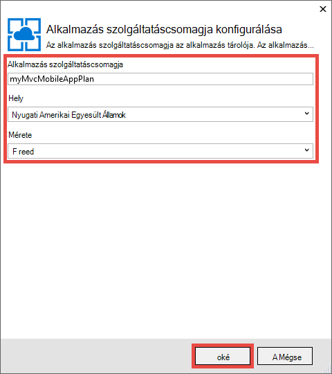
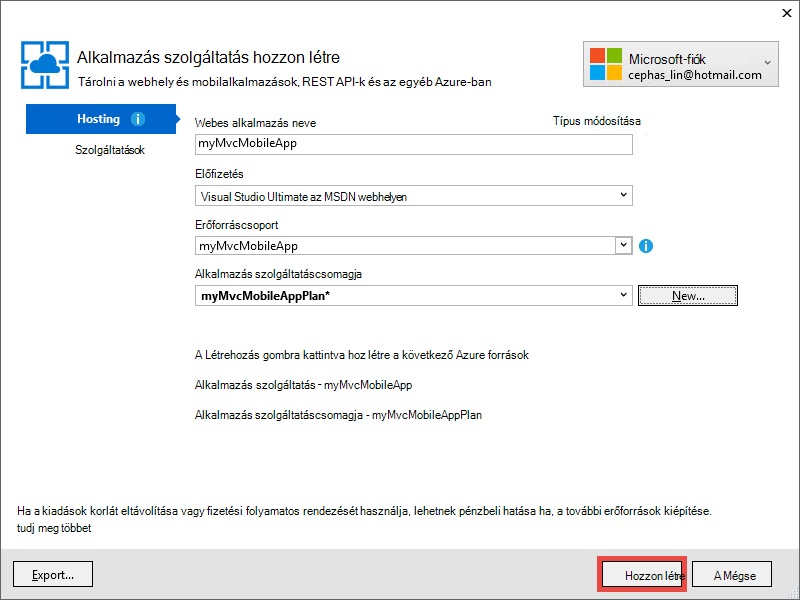

<properties 
    pageTitle="Azure App szolgáltatásban ASP.NET MVC 5 mobil webes alkalmazás telepítése" 
    description="Ez az oktatóanyagot útmutatást ad meg webalkalmazást telepítéséről Azure alkalmazás szolgáltatás ASP.NET MVC 5 webalkalmazás a mobil funkcióival." 
    services="app-service" 
    documentationCenter=".net" 
    authors="cephalin" 
    manager="wpickett" 
    editor="jimbe"/>

<tags 
    ms.service="app-service" 
    ms.workload="na" 
    ms.tgt_pltfrm="na" 
    ms.devlang="dotnet" 
    ms.topic="article" 
    ms.date="01/12/2016" 
    ms.author="cephalin;riande"/>

# Azure App szolgáltatásban ASP.NET MVC 5 mobil webes alkalmazás telepítése

Ebben az oktatóanyagban fog lapon, a alapjait, amely mobile – rövid ASP.NET MVC 5 webes alkalmazás összeállítása és Azure alkalmazás szolgáltatás üzembe. Az ebben az oktatóanyagban szükséges [webes Visual Studio Express 2013] [ Visual Studio Express 2013] vagy Visual Studio, ha már van, amely a profi kiadását. [Visual Studio 2015] is használhatja, de a képernyőképek különböző lesz, és a ASP.NET 4.x sablonokat kell használnia.

[AZURE.INCLUDE [create-account-and-websites-note](../../includes/create-account-and-websites-note.md)]

## Mit kell összeállítása

Az ebben az oktatóanyagban jegyezze fel mobile funkcióit az egyszerű konferencia-tőzsdei alkalmazás, a [starter project]biztosított[StarterProject]. Az alábbi képernyőképen a ASP.NET-munkamenetek a kész alkalmazást jeleníti meg a böngésző irányító az Internet Explorer 11-es F12 Fejlesztőeszközök a látható módon.

![][FixedSessionsByTag]

Az Internet Explorer 11-es F12 Fejlesztőeszközök és a [Fiddler eszköz] [ Fiddler] az alkalmazás hibakeresése érdekében. 

## Dióhéjban szakértelemmel

A következő tananyag Dióhéjban:

-   Hogyan Azure App szolgáltatásban tegye közzé a webalkalmazás közvetlenül a web App alkalmazásban a Visual Studio 2013 segítségével.
-   ASP.NET MVC 5 sablon használatával hogyan CSS betöltő keretében mobileszközökön megjelenítési javítása
-   Adott mobilböngészők, például a iPhone és Android célba mobilspecifikus nézetek létrehozása
-   Hogyan hozhat létre válaszol nézetek (nézetek, amely a különböző böngészők megválaszolása minden eszközön)

## A fejlesztői környezet beállítása

A fejlesztői környezet beállítása a .NET rendszerhez 2.5.1 az Azure SDK telepítésével vagy újabb verziójában. 

1. Az alábbi hivatkozásra kattintva telepítse az Azure SDK a .NET rendszerhez. Visual Studio 2013 telepítve van még nincs telepítve, ha a hivatkozás által települ. Ebben az oktatóanyagban Visual Studio 2013 használatához szükséges. [A Visual Studio 2013 Azure SDK][AzureSDKVs2013]
1. A webes Platform telepítő ablakában kattintson a **telepítés** gombra, és a telepítés folytatásához.

A mobil böngésző irányító is szüksége lesz. Működnek az alábbiak egyikét:

-   Az [Internet Explorer 11-es F12 Fejlesztőeszközök] böngésző irányító[ EmulatorIE11] (az összes a mobil böngésző képernyőképek használt). A Windows Phone 8, Windows Phone 7 és az Apple iPad felhasználói ügynökök karakterlánc készletek rendelkezik.
-   A [Google Chrome DevTools]böngésző irányító[EmulatorChrome]. Az Android-eszközön, valamint Apple iPhone, Apple iPad és Amazon Kindle Fire számos készletek tartalmaz. A amelynek azonos érintéses események is.
-   [Mobil irányító Opera][EmulatorOpera]

A C Visual Studio-projektek\# forráskódot szeretne fűzni, ez a témakör érhetők el:

-   [Alapszintű projekt letöltése][StarterProject]
-   [Befejezett projekt letöltése][CompletedProject]

##Telepítse az alapszintű-projektet az Azure web App alkalmazásban

1.  Töltse le a konferencia-tőzsdei alkalmazás [alapszintű project][StarterProject].

2.  A Windows Intézőben, majd kattintson a jobb gombbal a letöltött ZIP-fájl, és válassza a *Tulajdonságok parancsot*.

3.  A **Tulajdonságok** párbeszédpanelen válassza a **Tiltás feloldása** gombot. (Blokkolásának feloldása megakadályozza, hogy a biztonsági figyelmeztetés, amely fordul elő, ha próbálja használni a letöltötte az internetről származó fájl *.zip* .)

4.  Kattintson a jobb gombbal a ZIP-fájl, és válassza az **Összes kibontása** bontsa ki a fájlt. 

5.  A Visual Studióban nyissa meg a *C#\Mvc5Mobile.sln* fájlt.

6.  A megoldás Intézőben kattintson a jobb gombbal a projekt, és kattintson a **Közzététel**gombra.

    ![][DeployClickPublish]

7.  Közzététel a webhelyen kattintson **A Microsoft Azure alkalmazás szolgáltatás**.

    ![][DeployClickWebSites]

8.  Ha még nem már bejelentkezett az Azure, kattintson a **fiók hozzáadása**gombra.

    ![][DeploySignIn]

9.  Kövesse az útmutatást követve jelentkezzen be az Azure-fiókjába.

11. Az alkalmazás szolgáltatási párbeszédpanel most meg kell jelennie meg aláírt. Kattintson az **Új**gombra.

    ![][DeployNewWebsite]  

12. A **Webes alkalmazás neve** mezőben adja meg az app egyedi név előtaggal. Teljesen minősített web app neve, * &lt;előtag >*. azurewebsites.net. Is jelölje be, vagy adjon meg egy új erőforrásnevet csoport az **erőforráscsoport**. Kattintson az **Új** alkalmazás szolgáltatás új csomag létrehozása.

    ![][DeploySiteSettings]

13. Állítsa be az új alkalmazás szolgáltatás tervet, és kattintson az **OK gombra**. 

    

13. Vissza az alkalmazás szolgáltatás hozzon létre párbeszédpanelen kattintson a **Létrehozás**gombra.

     

13. Miután az Azure erőforrások jönnek létre, a webhely közzététele párbeszédpanel lesz töltve a beállításokat az új alkalmazás. Kattintson a **Közzététel**gombra.

    ![][DeployPublishSite]

    Visual Studio befejeződött, a starter projekt közzététele a Azure web app, miután az asztali böngésző megnyílik az élő webalkalmazás megjelenítéséhez.

14. Indítsa el a mobil böngésző irányító, másolja a vágólapra az URL-cím, a konferencia-alkalmazás (*<prefix>*. azurewebsites.net) be a irányító, majd kattintson a jobb felső gombra, és jelölje be a **címke szerinti Tallózás**. Ha az alapértelmezett böngésző használja az Internet Explorer 11-es, egyszerűen írja be a `F12`, majd `Ctrl+8`, majd módosítsa a böngésző profil **Windows Phone**. Az alábbi képen látható az a *AllTags* nézet álló módban (válasszanak **Keresse meg a címke szerint**).

    ![][AllTags]

>[AZURE.TIP] Visual Studio belül az MVC 5-alkalmazásokat is hibakeresési, amíg ismét a megerősítéséhez az élő webalkalmazás közvetlenül a mobil böngésző vagy a böngésző irányító Azure közzéteheti a web App alkalmazásban.

A megjelenítési mobileszközön nagyon olvasható. A betöltés CSS keretrendszer vizuális effektusokat részét már is láthatja.
**ASP.NET** hivatkozásra.

![][SessionsByTagASP.NET]

A ASP.NET címke nézetben, nagyítás szerelve betöltő automatikusan jelent meg, a képernyőhöz. Jó helyen jár hogy jobban megfeleljen a mobil böngésző nézet javíthatja. Ha például a **dátum** oszlopa is nehezen olvasható. Az oktatóprogram belül úgy kell megadnia a *AllTags* nézet egyszerűvé mobile – rövid.

##A CSS betöltő keretrendszer

Új MVC 5-ös sablon rendszer beépített betöltő támogatja. Most már fordul elő hogyan azonnal javítja a alkalmazás levő különböző nézetek eléréséhez. Például a felső navigációs sávon esetén automatikusan összecsukható böngésző szélességének kisebb. Az asztali böngésző próbálkozzon a a böngészőablak átméretezése, és ellenőrizze, hogy a Megjelenés és működés változás hatása a navigációs sávon. Ez a lyncbe betöltő válaszol Webhelytervezés.

Hogyan nézne ki a Web app nélkül betöltő megtekintéséhez nyissa meg a *alkalmazás\_indítása\\BundleConfig.cs* és a Megjegyzés *bootstrap.js* és *bootstrap.css*tartalmazó sorok meg. A következő kódot az utolsó két kimutatásaiban jeleníti meg a `RegisterBundles` módszer a módosítás után:

     bundles.Add(new ScriptBundle("~/bundles/bootstrap").Include(
              //"~/Scripts/bootstrap.js",
              "~/Scripts/respond.js"));

    bundles.Add(new StyleBundle("~/Content/css").Include(
              //"~/Content/bootstrap.css",
              "~/Content/site.css"));

Nyomja le a `Ctrl+F5` az alkalmazásnak a futtatására.

Megfigyelheti, hogy a összecsukható navigációs sáv már csak hétköznapi rendezetlen lista. Kattintson a **Tallózás címke szerint** , majd kattintson a **ASP.NET**.
A mobil irányító nézetben látható, hogy most, hogy már nem nagyítás szerelve a képernyőre, és kell görget függőlegesre annak érdekében, hogy a táblázat jobb oldalán látható.

![][SessionsByTagASP.NETNoBootstrap]

A módosítások visszavonása, és frissítse a mobileszköz böngészőjében, ellenőrizze, hogy helyreállt-e a mobile – rövid megjelenítését.

Betöltő nem adott ASP.NET MVC 5-ig, és használatba veheti az ezek a funkciók bármely webalkalmazásban. De most épített az ASP.NET MVC 5 project-sablon, így a MVC 5 webalkalmazás kihasználhassa betöltő alapértelmezés szerint.

További információt a betöltés, nyissa meg a [Betöltés] [ BootstrapSite] webhelyet.

A következő szakaszban láthatja, hogyan mobile-tallózó adott nézeteit.

##A nézetek, az elrendezésekről és a részleges nézetek felülbírálása

A mobil böngésző általában egy adott a mobil böngésző, illetve bármilyen adott böngésző felülbírálhatja bármelyik nézetben (beleértve az elrendezést és a részleges nézetek). Ahhoz, hogy a mobilspecifikus nézet, nézet fájl másolása és a *hozzáadása. Mobil* meg a fájl nevét. Például *Index* mobil nézet létrehozása, másolhatja *nézetek\\otthoni\\Index.cshtml* való *nézetek\\otthoni\\Index.Mobile.cshtml*.

Ebben a részben kell létrehoznia a mobilspecifikus elrendezés fájl.

Szeretné kezdeni, másolja a vágólapra *nézetek\\megosztott\\\_Layout.cshtml* való *nézetek\\megosztott\\\_Layout.Mobile.cshtml*. Nyissa meg * \_Layout.Mobile.cshtml* , és módosítsa a cím **MVC5** alkalmazásból **MVC5 alkalmazás (mobil)**.

Az egyes `Html.ActionLink` hívja fel a navigációs sáv, távolítsa el a "Szerinti Tallózás" az egyes *ActionLink*hivatkozásra. A következő kód szemlélteti a kész `<ul class="nav navbar-nav">` címkét a mobileszközön érvényes elrendezést fájlt.

    <ul class="nav navbar-nav">
        <li>@Html.ActionLink("Home", "Index", "Home")</li>
        <li>@Html.ActionLink("Date", "AllDates", "Home")</li>
        <li>@Html.ActionLink("Speaker", "AllSpeakers", "Home")</li>
        <li>@Html.ActionLink("Tag", "AllTags", "Home")</li>
    </ul>

Másolás a *nézetek\\otthoni\\AllTags.cshtml* fájl *nézetek\\otthoni\\AllTags.Mobile.cshtml*. Nyissa meg az új fájlt, és módosítsa a `<h2>` eleme "Kódok" a "címkék (M)":

    <h2>Tags (M)</h2>

Tallózással keresse meg a címkék lapra asztali böngészőben és a mobil böngésző irányító használatával. A mobil böngésző irányító jeleníti meg a két végzett módosításokat (a cím és * \_Layout.Mobile.cshtml* és a cím és *AllTags.Mobile.cshtml*).

![][AllTagsMobile_LayoutMobile]

Viszont nem változott asztali megjelenített (a címekkel ellátott * \_Layout.cshtml* és *AllTags.cshtml*).

![][AllTagsMobile_LayoutMobileDesktop]

##Böngésző-specifikus nézetek létrehozása

Nemcsak a mobil- és az asztal-specifikus nézeteket az adott böngésző mappához használható nézetek hozhat létre. Ha például olyan, amelyek kifejezetten az iPhone- és az Android böngésző nézeteket hozhat létre. Ebben a részben kell létrehoznia az iPhone-alapú böngészőben és a *AllTags* nézet egy iPhone-alapú verzióját elrendezést.

Nyissa meg a *Global.asax* fájlt, és adja hozzá a következő kódot alján a `Application_Start` módot.

    DisplayModeProvider.Instance.Modes.Insert(0, new DefaultDisplayMode("iPhone")
    {
        ContextCondition = (context => context.GetOverriddenUserAgent().IndexOf
            ("iPhone", StringComparison.OrdinalIgnoreCase) >= 0)
    });

Ez a kód "iPhone", amely minden bejövő kérés ellen össze kell vetni nevű új megjelenítési mód határozza meg. Ha a bejövő kérelem a (Ha a felhasználói ügynököt tartalmazza a karakterlánc "iPhone") megadott feltételnek megfelelő, ASP.NET MVC nézetek, amelynek a nevét tartalmazza az "iPhone" utótag fog keresni.

>[AZURE.NOTE] Mobil böngésző-specifikus megjelenítési módok fel, mint például az iPhone-alapú és az Android, ügyeljen arra, kattintva állíthatja be az első argumentum `0` (szúrja be a lista tetején) kattintva győződjön meg arról, hogy a böngésző-specifikus mód az elsőbbrendű képest a mobil sablon (*. Mobile.cshtml). Ha a mobil sablon a lista tetején helyett, akkor lesz kijelölve fölé a kívánt megjelenítési mód (az első egyezés wins, és a mobil sablon illeszkedik összes mobilböngészők). 

A kódot, kattintson a jobb gombbal `DefaultDisplayMode`, válassza a **megoldani**, és válassza a `using System.Web.WebPages;`. Ez a lehetőség egy mutató hivatkozás a `System.Web.WebPages` névtér, amely a hol van a `DisplayModeProvider` és `DefaultDisplayMode` típusait.

![][ResolveDefaultDisplayMode]

Azt is megteheti, csak beviheti kézzel a következő sort a `using` szakaszában a fájlt.

    using System.Web.WebPages;

A módosítások mentéséhez. Másolás a *nézetek\\megosztott\\\_Layout.Mobile.cshtml* fájl *nézetek\\megosztott\\\_Layout.iPhone.cshtml*. Nyissa meg az új fájlt, és módosítsa úgy a cím és `MVC5 Application (Mobile)` való `MVC5 Application (iPhone)`.

Másolás a *nézetek\\otthoni\\AllTags.Mobile.cshtml* fájl *nézetek\\otthoni\\AllTags.iPhone.cshtml*. Az új fájl módosítsa a `<h2>` "Címkék (iPhone-on)" a "címkék (M)" elemet.

Futtassa az alkalmazást. Futtassa a mobil böngésző irányító, ellenőrizze, hogy a felhasználói ügynökök beállítása "iPhone", és tallózással keresse meg a *AllTags* nézetben. A irányító használatakor az Internet Explorer 11-es F12 Fejlesztőeszközök beállítása emulációs a következő:

-   Böngésző profil = a **Windows Phone**
-   Felhasználói ügynökök karakterlánc **egyéni** =
-   Egyéni karakterlánc **Apple-iPhone5C1/1001.525** =

Az alábbi képernyőképen (Ez az iPhone-alapú 5 C felhasználói ügynökök karakterláncra) jeleníti meg az Internet Explorer 11-es F12 Fejlesztőeszközök egy egyéni felhasználói ügynökök karakterlánccal a irányító *AllTags* nézetben jeleníti meg.

![][AllTagsIPhone_LayoutIPhone]

A mobileszköz böngészőjében **hangszórókat** hivatkozásra. Nem áll a mobil böngésző nézetet (*AllSpeakers.Mobile.cshtml*), mert az alapértelmezett hangszórók nézetet (*AllSpeakers.cshtml*) jelenik meg a mobil nézet használata (*\_Layout.Mobile.cshtml*). Amint alább látható, a cím **MVC5 alkalmazás (mobil)** könyvjelzőnév * \_Layout.Mobile.cshtml*.

![][AllSpeakers_LayoutMobile]

(Nem mobilaláírása) az alapértelmezett nézet megjelenítését a mobileszközön érvényes elrendezést belül megadásával globálisan letilthatja `RequireConsistentDisplayMode` való `true` a a *nézetek\\\_ViewStart.cshtml* jelennek meg a fájlt:

    @{
        Layout = "~/Views/Shared/_Layout.cshtml";
        DisplayModeProvider.Instance.RequireConsistentDisplayMode = true;
    }

Ha `RequireConsistentDisplayMode` értéke `true`, a mobileszközön érvényes elrendezést (*\_Layout.Mobile.cshtml*) böngészik csak a mobileszközökkel történő megtekintésre (azaz a fájl megtekintése a képernyő * **ViewName**. Mobile.cshtml*). Érdemes lehet beállítani `RequireConsistentDisplayMode` való `true` , ha a mobileszközön érvényes elrendezést és a nem mobilaláírása nézetek nem működik. Az alábbi képernyőképen a *hangszórók* lapon való megjelenítésének mikor `RequireConsistentDisplayMode` értéke `true` (nélkül a "(mobil)" a karakterlánc a felső navigációs sáv).

![][AllSpeakers_LayoutMobileOverridden]

Egy adott nézetben egységes megjelenítési mód beállításával letilthatja `RequireConsistentDisplayMode` való `false` a nézet fájlban. A következő jelölés használata a *nézetek\\otthoni\\AllSpeakers.cshtml* készletek fájl `RequireConsistentDisplayMode` való `false`:

    @model IEnumerable<string>

    @{
        ViewBag.Title = "All speakers";
        DisplayModeProvider.Instance.RequireConsistentDisplayMode = false;
    }

Ebben a részben mobil elrendezések és -nézetek létrehozása és hogyan hozhat létre, elrendezésekkel és -nézetek adott eszközök, például az iPhone láthatta azt.
Azonban a fő betöltő CSS-keretrendszer előnye a válaszol elrendezést, ami azt jelenti, hogy egyetlen stíluslap egyaránt alkalmazhatók asztali, telefonon és táblagépen böngészők hozhat létre egy egységes megjelenés és működés. A következő szakaszban láthatja, hogyan hozhat létre nézeteket mobile – rövid betöltő kihasználhatja.

##A hangszóró lista javítása

Ekkor közvetlenül a böngészőben, a *hangszóró* nézet olvasható, de a hivatkozások kicsik, és koppintson a mobileszköz nehezen. Ebben a részben fogja gondoskodnia a *AllSpeakers* nézetben mobile – rövid, amely nagy, egyszerűen koppintson a hivatkozásokat, és egy keresőmezőt, ha meg szeretné találni a hangszórók tartalmaz.

A [csatolt lista csoport][] betöltő frizurakészítő használatával javíthatja a *hangszórók* nézetben. A *nézetek\\otthoni\\AllSpeakers.cshtml*, a Razor-fájl tartalmának cserélje ki az alábbi kódot.

     @model IEnumerable<string>

    @{
        ViewBag.Title = "All Speakers";
    }

    <h2>Speakers</h2>

    

        @foreach (var speaker in Model)
        {
            @Html.ActionLink(speaker, "SessionsBySpeaker", new { speaker }, new { @class = "list-group-item" })
        }
    

A `class="list-group"` attribútum a `
` címke alkalmazza a betöltő lista stíluselemeket és a `class="input-group-item"` attribútumot minden hivatkozás betöltő lista elem stíluselemeket vonatkozik.

A mobil böngésző frissítéséhez. A frissített nézet néz ki:

![][AllSpeakersFixed]

A [csatolt lista csoport][] betöltő stíluselemeket lehetővé teszi, hogy minden kattintható, hivatkozás esetében a teljes csoportban, amely egy sokkal jobban felhasználói felület. Váltson át az asztal nézetbe, és tekintse meg az egységes megjelenés és működés.

![][AllSpeakersFixedDesktop]

Bár a mobil böngésző nézet megújult, is nehezen nyissa meg a hangszóró hosszú listában. Betöltő nem keresőmezőjének elérhetővé tétele szűrő funkciók ki-a-a-, de néhány kódsorokat az hozzáadhatja. Akkor fogja először a Keresés mezőbe a nézethez hozzáadni, majd kapcsolható össze a filter függvény JavaScript-kód. A *nézetek\\otthoni\\AllSpeakers.cshtml*, hozzáadása egy \<űrlap\> csak utána nyomon követése a \<h2\> címkézéséhez, az alább látható módon:

    @model IEnumerable<string>

    @{
        ViewBag.Title = "All Speakers";
    }

    <h2>Speakers</h2>

    <form class="input-group">
        
        <input type="text" class="form-control" placeholder="Search speaker">
    </form>
     
    

        @foreach (var speaker in Model)
        {
            @Html.ActionLink(speaker, 
                             "SessionsBySpeaker", 
                             new { speaker }, 
                             new { @class = "list-group-item" })
        }
    

Figyelje meg, hogy a `<form>` és `<input>` mindkét címkék van a hozzájuk rendelt betöltő stílusokat. A `` elem egy betöltő [glyphicon][] hozzáadja a keresőmezőbe.

A *parancsfájlok* mappa hozzáadása a *filter.js*nevű JavaScript-fájlt. Nyissa meg a fájlt, és a következő kódot beillesztése:

    $(function () {

        // reset the search form when the page loads
        $("form").each(function () {
            this.reset();
        });

        // wire up the events to the <input> element for search/filter
        $("input").bind("keyup change", function () {
            var searchtxt = this.value.toLowerCase();
            var items = $(".list-group-item");

            // show all speakers that begin with the typed text and hide others
            for (var i = 0; i < items.length; i++) {
                var val = items[i].text.toLowerCase();
                val = val.substring(0, searchtxt.length);
                if (val == searchtxt) {
                    $(items[i]).show();
                }
                else {
                    $(items[i]).hide();
                }
            }
        });
    });

Meg kell filter.js szerepeltetni a regisztrált kötegeket. Nyissa meg *alkalmazás\_indítása\\BundleConfig.cs* , és módosíthatja az első kötegeket. Az első módosítása `bundles.Add` utasítását (a **jquery** az első lépésekhez) felvenni *parancsfájlok\\filter.js*, az alábbiak szerint:

     bundles.Add(new ScriptBundle("~/bundles/jquery").Include(
                "~/Scripts/jquery-{version}.js",
                "~/Scripts/filter.js"));

A **jquery** az első lépésekhez már való megjelenítését a alapértelmezés szerint * \_elrendezés* megtekintése. Később használhatja ugyanazt a JavaScript-kód további listanézetek: a szűrő funkciókat alkalmazni.

Frissítse a mobileszköz böngészőjében, és nyissa meg a *AllSpeakers* nézetben. A Keresés mezőbe írja be a "sc". A hangszóró lista most szűri a keresési feltétele megfelelően.

![][AllSpeakersFixedSearchBySC]

##A címkelista javítása

A *hangszóró* nézetet, például a *címkék* megtekintése olvasható, de a hivatkozások kis- és nehezen koppintson a mobileszközön. Háríthatja a *címkék* megtekintése a *hangszórók* nézetben javítása, ha a korábban ismertetett kód módosításokat, de az alábbi ugyanúgy `Html.ActionLink` módszer szintaxisát *nézetek\\otthoni\\AllTags.cshtml*:

    @Html.ActionLink(tag, 
                     "SessionsByTag", 
                     new { tag }, 
                     new { @class = "list-group-item" })

A frissített asztali böngésző a következőképpen néz ki:

![][AllTagsFixedDesktop]

És a frissített mobileszköz böngészőjében a következőképpen néz ki: 

![][AllTagsFixed]

>[AZURE.NOTE] Ha azt észleli, hogy az eredeti listát formázás megvan a mobileszköz böngészőjében, és mi történt a szép betöltő stíluselemeket wonder, ez az a korábbi művelet mobil adott nézeteket hozhat létre egy eltérés. Most, hogy hozzon létre egy válaszol Webhelytervezés betöltő CSS keretében szolgáltatást használ, válassza a címsor, és távolítsa el a mobilspecifikus elrendezés és a mobilspecifikus nézeteket. Még meg, miután a frissített mobileszköz böngészőjében a betöltő stíluselemeket jelennek meg.

##A dátumok lista javítása

A *dátumok* nézet javíthatja, mint a *hangszórók* és a *címkék* nézetek továbbfejlesztett, ha a korábban ismertetett kód módosításokat, de az alábbi `Html.ActionLink` módszer szintaxisát *nézetek\\otthoni\\AllDates.cshtml*:

    @Html.ActionLink(date.ToString("ddd, MMM dd, h:mm tt"), 
                     "SessionsByDate", 
                     new { date }, 
                     new { @class = "list-group-item" })

Jelennek meg frissíteni a mobil böngésző nézet jelenik meg:

![][AllDatesFixed]

A *dátumok* nézet további javíthatja a dátum-idő érték dátum szerinti rendezésével. Ez a betöltő [panelek][] stíluselemeket végezhető. Cserélje le a tartalmát a *nézetek\\otthoni\\AllDates.cshtml* fájlt a következő kódot:

    @model IEnumerable<DateTime>

    @{
        ViewBag.Title = "All Dates";
    }

    <h2>Dates</h2>

    @foreach (var dategroup in Model.GroupBy(x=>x.Date))
    {
        

            

                @dategroup.Key.ToString("ddd, MMM dd")
            

            

                @foreach (var date in dategroup)
                {
                    @Html.ActionLink(date.ToString("h:mm tt"), 
                                     "SessionsByDate", 
                                     new { date }, 
                                     new { @class = "list-group-item" })
                }
            

        

    }

Ez a kód létrehoz egy külön `
` címke minden különböző dátumhoz a listában, és a [csatolt lista csoportban][] a megfelelő hivatkozások, mielőtt. Az alábbiakban a mobil böngésző néz ki mikor kód fut:

![][AllDatesFixed2]

Váltson az asztali böngésző. Ismét Megjegyzés: az egységes megjelenés.

![][AllDatesFixed2Desktop]

##Javíthatja a SessionsTable nézet

Ebben a részben, fogja, hogy a *SessionsTable* view további mobile – rövid. Ez a változás szélesebb körű, a korábbi módosítást.

A mobileszköz böngészőjében, koppintson a **címke** gombra, majd adja meg `asp` a Keresés mezőbe.

![][AllTagsFixedSearchByASP]

**ASP.NET** -hivatkozásra koppintva.

![][SessionsTableTagASP.NET]

Amint látható, a megjelenített táblázatként, amely jelenleg lett tervezve jeleníthetők meg az asztali böngésző van formázva. Célszerű azonban kicsit nehezen olvasható a mobil böngésző. Javítandó, nyissa meg a *nézetek\\otthoni\\SessionsTable.cshtml* , és kattintson a fájl tartalmát helyettesítése a következő kódot:

    @model IEnumerable<Mvc5Mobile.Models.Session>

    <h2>@ViewBag.Title</h2>

    

        

            @foreach (var session in Model)
            {
                

                    

                        @Html.ActionLink(session.Title, 
                                         "SessionByCode", 
                                         new { session.Code }, 
                                         new { @class="list-group-item active" })
                        

                            

                                @Html.Partial("_SpeakersLinks", session)
                            

                            

                                @session.DateText
                            

                            

                                @Html.Partial("_TagsLinks", session)
                            

                        

                    

                

            }
        

    

A kód 3 dolog, amit végzi el:

-   a betöltő [csatolt egyéni lista csoport][] formázásához használja a munkamenet-információk függőlegesen, hogy a ezt az információt a mobil böngésző (például lista csoport-elem – szöveges osztályok használatával) olvasható
-   a [Rács rendszer][] vonatkozik az elrendezést, hogy a munkamenet elemek vízszintesen flow asztali böngészőben és függőlegesen a mobileszköz böngészőjében (segítségével az oszlop-md-4-es osztály)
-   a [válaszol segédprogramok][] használja a munkamenet címkék (a rejtett xs osztály használ), a mobileszköz böngészőjében megtekintésekor elrejtése

Koppintással nyissa meg a megfelelő munkamenet címe csatolásának is. Az alábbi képen a kód módosításai tükrözi.

![][FixedSessionsByTag]

A rács betöltő rendszer, amely automatikusan alkalmazza a munkamenetek függőlegesen a mobileszköz böngészőjében elrendezése. Is láthatja, hogy a címkék nem jelennek meg. Váltson az asztali böngésző.

![][SessionsTableFixedTagASP.NETDesktop]

Az asztali böngésző figyelje meg, hogy a címkék jelennek meg. Is megtekintheti, hogy a rács betöltő rendszer beállította a két oszlopban szereplő munkamenet elemek rendezése a. Ha felnagyíthatja a képet a böngészőben, látni fogja, hogy a elrendezés módosításaira három oszlopot.

##Javíthatja a SessionByCode nézet

Végül akkor a *SessionByCode* nézet egyszerűvé mobile – rövid javítás.

A mobileszköz böngészőjében, koppintson a **címke** gombra, majd adja meg `asp` a Keresés mezőbe.

![][AllTagsFixedSearchByASP]

**ASP.NET** -hivatkozásra koppintva. ASP.NET címke munkamenetek jelennek meg.

![][FixedSessionsByTag]

Kattintson a **lap ASP.NET és AngularJS egyetlen alkalmazás felépíteni** hivatkozására.

![][SessionByCode3-644]

Az alapértelmezett asztali nézetet nem kell aggódnia, de javíthatja a Megjelenés egyszerűen néhány betöltő grafikus elemek felhasználásával.

Nyissa meg *nézetek\\otthoni\\SessionByCode.cshtml* és cserélje le a következő korrektúrát tartalma:

    @model Mvc5Mobile.Models.Session

    @{
        ViewBag.Title = "Session details";
    }
    <h3>@Model.Title (@Model.Code)</h3>
    

        <strong>@Model.DateText</strong> in <strong>@Model.Room</strong>
    

    

        

            Speakers
        

        @foreach (var speaker in Model.Speakers)
        {
            @Html.ActionLink(speaker, 
                             "SessionsBySpeaker", 
                             new { speaker }, 
                             new { @class="panel-body" })
        }
    

    
@Model.Abstract

    

        

            Tags
        

        @foreach (var tag in Model.Tags)
        {
            @Html.ActionLink(tag, 
                             "SessionsByTag", 
                             new { tag }, 
                             new { @class = "panel-body" })
        }
    

Az új Korrektúra javítható a Mobilnézet frizurakészítő betöltő panelek használja. 

A mobil böngésző frissítéséhez. Az alábbi képen a kód módosítások csak tükrözi:

![][SessionByCodeFixed3-644]

## Sortörés és áttekintése

Ebben az oktatóanyagban azt mutatja, hogy hogyan ASP.NET MVC 5 mobile – rövid webalkalmazásokat. Ezek a következők:

-   ASP.NET MVC 5-szolgáltatási alkalmazás web App alkalmazások telepítése
-   Használja a betöltő válaszol webes elrendezés a MVC 5-alkalmazás létrehozása
-   Globális és az egyéni nézet felülbírálása az elrendezés, a nézetek és a részleges nézeteket,
-   Vezérlőelem-elrendezés és a részleges felülbírálása kényszerítési használata a `RequireConsistentDisplayMode` tulajdonság
-   Bizonyos böngészőkben, például az iPhone-alapú böngésző városrész nézetek létrehozása
-   Betöltő stíluselemeket Razor kód alkalmazása

## Lásd még:

-   [válaszol Webhelytervezés 9 alapelvei](http://blog.froont.com/9-basic-principles-of-responsive-web-design/)
-   [Betöltő][BootstrapSite]
-   [Hivatalos betöltő Blog][]
-   [Twitter betöltő oktatóprogram oktatóprogram Köztársaság][]
-   [A betöltő játszótéri][]
-   [W3C ajánlási mobil webes alkalmazás ajánlott eljárások][]
-   [W3C jelölt ajánlási media lekérdezések][]

## Mi változott
* Módosítása egy segédvonalat a webhelyekre alkalmazás szolgáltatáshoz lásd: [Azure alkalmazás szolgáltatás, és a hatás a meglévő Azure-szolgáltatások](http://go.microsoft.com/fwlink/?LinkId=529714)

<!-- Internal Links -->
[Deploy the starter project to an Azure web app]: #bkmk_DeployStarterProject
[Bootstrap CSS Framework]: #bkmk_bootstrap
[Override the Views, Layouts, and Partial Views]: #bkmk_overrideviews
[Create Browser-Specific Views]:#bkmk_browserviews
[Improve the Speakers List]: #bkmk_Improvespeakerslist
[Improve the Tags List]: #bkmk_improvetags
[Improve the Dates List]: #bkmk_improvedates
[Improve the SessionsTable View]: #bkmk_improvesessionstable
[Improve the SessionByCode View]: #bkmk_improvesessionbycode

<!-- External Links -->
[Visual Studio Express 2013]: http://www.visualstudio.com/downloads/download-visual-studio-vs#d-express-web
[Visual Studio 2015]: https://www.visualstudio.com/downloads/download-visual-studio-vs
[AzureSDKVs2013]: http://go.microsoft.com/fwlink/p/?linkid=323510&clcid=0x409
[Fiddler]: http://www.fiddler2.com/fiddler2/
[EmulatorIE11]: http://msdn.microsoft.com/library/ie/dn255001.aspx
[EmulatorChrome]: https://developers.google.com/chrome-developer-tools/docs/mobile-emulation
[EmulatorOpera]: http://www.opera.com/developer/tools/mobile/
[StarterProject]: http://go.microsoft.com/fwlink/?LinkID=398780&clcid=0x409
[CompletedProject]: http://go.microsoft.com/fwlink/?LinkID=398781&clcid=0x409
[BootstrapSite]: http://getbootstrap.com/
[WebPIAzureSdk23NetVS13]: ./media/web-sites-dotnet-deploy-aspnet-mvc-mobile-app/WebPIAzureSdk23NetVS13.png
[csatolt lista csoportjában]: http://getbootstrap.com/components/#list-group-linked
[glyphicon]: http://getbootstrap.com/components/#glyphicons
[panelek]: http://getbootstrap.com/components/#panels
[egyéni csatolt lista csoportjában]: http://getbootstrap.com/components/#list-group-custom-content
[rács rendszer]: http://getbootstrap.com/css/#grid
[válaszol segédprogramok]: http://getbootstrap.com/css/#responsive-utilities
[Hivatalos betöltő Blog]: http://blog.getbootstrap.com/
[Twitter betöltő oktatóprogram oktatóprogram Köztársaság]: http://www.tutorialrepublic.com/twitter-bootstrap-tutorial/
[A betöltő játszótéri]: http://www.bootply.com/
[W3C ajánlási mobil webes alkalmazás ajánlott eljárások]: http://www.w3.org/TR/mwabp/
[W3C Candidate ajánlási media lekérdezések]: http://www.w3.org/TR/css3-mediaqueries/

<!-- Images -->
[DeployClickPublish]: ./media/web-sites-dotnet-deploy-aspnet-mvc-mobile-app/deploy-to-azure-website-1.png
[DeployClickWebSites]: ./media/web-sites-dotnet-deploy-aspnet-mvc-mobile-app/deploy-to-azure-website-2.png
[DeploySignIn]: ./media/web-sites-dotnet-deploy-aspnet-mvc-mobile-app/deploy-to-azure-website-3.png
[DeployUsername]: ./media/web-sites-dotnet-deploy-aspnet-mvc-mobile-app/deploy-to-azure-website-4.png
[DeployPassword]: ./media/web-sites-dotnet-deploy-aspnet-mvc-mobile-app/deploy-to-azure-website-5.png
[DeployNewWebsite]: ./media/web-sites-dotnet-deploy-aspnet-mvc-mobile-app/deploy-to-azure-website-6.png
[DeploySiteSettings]: ./media/web-sites-dotnet-deploy-aspnet-mvc-mobile-app/deploy-to-azure-website-7.png
[DeployPublishSite]: ./media/web-sites-dotnet-deploy-aspnet-mvc-mobile-app/deploy-to-azure-website-8.png
[MobileHomePage]: ./media/web-sites-dotnet-deploy-aspnet-mvc-mobile-app/mobile-home-page.png
[FixedSessionsByTag]: ./media/web-sites-dotnet-deploy-aspnet-mvc-mobile-app/SessionsByTag-ASP.NET-Fixed.png
[AllTags]: ./media/web-sites-dotnet-deploy-aspnet-mvc-mobile-app/AllTags.png
[SessionsByTagASP.NET]: ./media/web-sites-dotnet-deploy-aspnet-mvc-mobile-app/SessionsByTag-ASP.NET.png
[SessionsByTagASP.NETNoBootstrap]: ./media/web-sites-dotnet-deploy-aspnet-mvc-mobile-app/SessionsByTag-ASP.NET-NoBootstrap.png
[AllTagsMobile_LayoutMobile]: ./media/web-sites-dotnet-deploy-aspnet-mvc-mobile-app/AllTagsMobile-_LayoutMobile.png
[AllTagsMobile_LayoutMobileDesktop]: ./media/web-sites-dotnet-deploy-aspnet-mvc-mobile-app/AllTagsMobile-_LayoutMobile-Desktop.png
[ResolveDefaultDisplayMode]: ./media/web-sites-dotnet-deploy-aspnet-mvc-mobile-app/Resolve-DefaultDisplayMode.png
[AllTagsIPhone_LayoutIPhone]: ./media/web-sites-dotnet-deploy-aspnet-mvc-mobile-app/AllTagsIPhone-_LayoutIPhone.png
[AllSpeakers_LayoutMobile]: ./media/web-sites-dotnet-deploy-aspnet-mvc-mobile-app/AllSpeakers-_LayoutMobile.png
[AllSpeakers_LayoutMobileOverridden]: ./media/web-sites-dotnet-deploy-aspnet-mvc-mobile-app/AllSpeakers-_LayoutMobile-Overridden.png
[AllSpeakersFixed]: ./media/web-sites-dotnet-deploy-aspnet-mvc-mobile-app/AllSpeakers-Fixed.png
[AllSpeakersFixedDesktop]: ./media/web-sites-dotnet-deploy-aspnet-mvc-mobile-app/AllSpeakers-Fixed-Desktop.png
[AllSpeakersFixedSearchBySC]: ./media/web-sites-dotnet-deploy-aspnet-mvc-mobile-app/AllSpeakers-Fixed-SearchBySC.png
[AllTagsFixedDesktop]: ./media/web-sites-dotnet-deploy-aspnet-mvc-mobile-app/AllTags-Fixed-Desktop.png 
[AllTagsFixed]: ./media/web-sites-dotnet-deploy-aspnet-mvc-mobile-app/AllTags-Fixed.png
[AllDatesFixed]: ./media/web-sites-dotnet-deploy-aspnet-mvc-mobile-app/AllDates-Fixed.png
[AllDatesFixed2]: ./media/web-sites-dotnet-deploy-aspnet-mvc-mobile-app/AllDates-Fixed2.png
[AllDatesFixed2Desktop]: ./media/web-sites-dotnet-deploy-aspnet-mvc-mobile-app/AllDates-Fixed2-Desktop.png
[AllTagsFixedSearchByASP]: ./media/web-sites-dotnet-deploy-aspnet-mvc-mobile-app/AllTags-Fixed-SearchByASP.png
[SessionsTableTagASP.NET]: ./media/web-sites-dotnet-deploy-aspnet-mvc-mobile-app/SessionsTable-Tag-ASP.NET.png
[SessionsTableFixedTagASP.NETDesktop]: ./media/web-sites-dotnet-deploy-aspnet-mvc-mobile-app/SessionsTable-Fixed-Tag-ASP.NET-Desktop.png
[SessionByCode3-644]: ./media/web-sites-dotnet-deploy-aspnet-mvc-mobile-app/SessionByCode-3-644.png
[SessionByCodeFixed3-644]: ./media/web-sites-dotnet-deploy-aspnet-mvc-mobile-app/SessionByCode-Fixed-3-644.png
 
