<properties
    pageTitle="ASP.NET-alkalmazás terjesztése Azure alkalmazás szolgáltatás Visual Studio segítségével |} Microsoft Azure"
    description="Megtudhatja, hogy miként Azure App szolgáltatásban, a Visual Studio segítségével egy új webalkalmazás-ASP.NET webes projekt telepítése."
    services="app-service\web"
    documentationCenter=".net"
    authors="tdykstra"
    manager="wpickett"
    editor=""/>

<tags
    ms.service="app-service-web"
    ms.workload="web"
    ms.tgt_pltfrm="na"
    ms.devlang="dotnet"
    ms.topic="get-started-article"
    ms.date="07/22/2016"
    ms.author="rachelap"/>

# ASP.NET webes alkalmazás telepítése Azure alkalmazás szolgáltatás Visual Studio

[AZURE.INCLUDE [tabs](../../includes/app-service-web-get-started-nav-tabs.md)]

## – Áttekintés

Ebből az oktatóanyagból megtudhatja, hogy miként egy [webalkalmazás Azure App szolgáltatásban](app-service-web-overview.md) ASP.NET webes alkalmazások telepítése a Visual Studio 2015 használatával.

Az oktatóprogram feltételezi, hogy Ön egy ASP.NET Fejlesztőeszközök rendelkező nincs Azure használata az előző felületet. Ha végzett, is be egyszerű webalkalmazás és futtatása a felhőben.

Dióhéjban:

* Hogyan közben szeretne készíteni egy új alkalmazás szolgáltatás web App alkalmazásban a Visual Studióban webes új projektet hoz létre.
* Telepítéséről webes projekt-alkalmazás szolgáltatás web App alkalmazásban a Visual Studio segítségével.

Az ábra bemutatja, hogy az oktatóprogram mire.

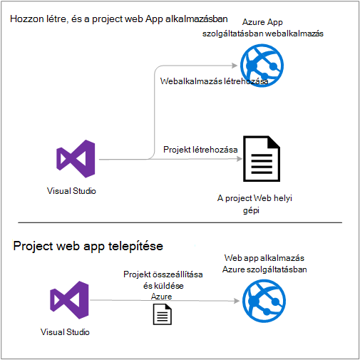

Az oktatóanyag végén [Hibaelhárítás](#troubleshooting) szakasz ötleteket a Mi a teendő, ha valamit, amit nem működik, és a [következő lépések](#next-steps) szakasz hivatkozásaira kattintva más oktatóanyagok, hogy az Azure alkalmazás szolgáltatás használatával kapcsolatos további mélység adja vissza.

Ez az első lépések oktatóanyagot, mint a webes projekt azt szemlélteti, hogyan lehet telepíteni egy egyszerű ilyen, amely nem használja egy adatbázist, és nem hitelesítés vagy engedélyezés. Speciális telepítési témakörökre mutató hivatkozások olvassa el a [telepítéséről az Azure web app](web-sites-deploy.md)című témakört.

Mellett .NET-az Azure SDK telepítéséhez szükséges időt ebben az oktatóanyagban lép, hogy körülbelül 10 – 15 percet befejezéséhez.

## Előfeltételek

* Az oktatóprogram tartalma feltételezi, hogy a ASP.NET MVC és a Visual Studio módosítottuk. Ha egy bevezető van szüksége, olvassa el a [ASP.NET MVC 5 – első lépések](http://www.asp.net/mvc/overview/getting-started/introduction/getting-started)című témakört.

* Azure-fiók szükséges. [Nyissa meg az ingyenes Azure-fiók](/pricing/free-trial/?WT.mc_id=A261C142F) vagy [Visual Studio aktiválása előfizetői előnyét](/pricing/member-offers/msdn-benefits-details/?WT.mc_id=A261C142F)is. 

    Ha szeretné az első lépések Azure alkalmazás szolgáltatás, mielőtt regisztrál az Azure-fiók, nyissa meg a [Alkalmazás szolgáltatás próbálja meg](http://go.microsoft.com/fwlink/?LinkId=523751). Nem hozhat létre egy rövid életű starter App szolgáltatásban – nem kötelező hitelkártya, és nincs nyilatkozatát.

## A fejlesztői környezet beállítása

Az oktatóprogram Visual Studio 2015 a 2.9 vagy újabb verzió az [Azure SDK a .NET rendszerhez](../dotnet-sdk.md) készült. 

* [Töltse le a legújabb Visual Studio 2015 Azure SDK](http://go.microsoft.com/fwlink/?linkid=518003). A SDK csomagjában talál a Visual Studio 2015 telepítést, ha még nincs.

    >[AZURE.NOTE] Attól függően, hogy hány SDK függőség már van a számítógépen a SDK telepítése eltarthat néhány percet fél órán vagy több hosszú ideig.

Ha a Visual Studio 2013 telepítve van, és szeretné használni, amely, [Töltse le a legújabb Visual Studio 2013 Azure SDK](http://go.microsoft.com/fwlink/?LinkID=324322)is. Néhány képernyő eltér az ábrák jelenhet meg.

## Új webes projekt konfigurálása

A következő lépésként webes projekt létrehozása a Visual Studio és Azure App szolgáltatásban webalkalmazást. Az ebben a szakaszban az oktatóprogram állítsa be az új webhely-projektet. 

1. Nyissa meg a Visual Studio 2015.

2. Kattintson a **Fájl > Új > a Project**.

3. Kattintson az **Új projekt** párbeszédpanel **Visual C# > webhely > ASP.NET webalkalmazás**.

3. Győződjön meg arról, hogy a célhely keretrendszer **.NET-keretrendszer 4.5.2** van kiválasztva.

4.  [Azure alkalmazás az összefüggéseket](../application-insights/app-insights-overview.md) a webalkalmazás az elérhetőség, teljesítményének és látogatottságának figyeli. Az **Alkalmazás háttérismeretek hozzáadása a Project** -jelölőnégyzet be van jelölve, által alapértelmezett az első alkalommal webes projektet hoz létre a Visual Studio telepítése után. Törölje a jelet a jelölőnégyzetből, ha ki van jelölve, de nem szeretné próbálja meg az alkalmazást az összefüggéseket.

4. Nevezze el az alkalmazás **MyExample**, és kattintson **az OK**gombra.

    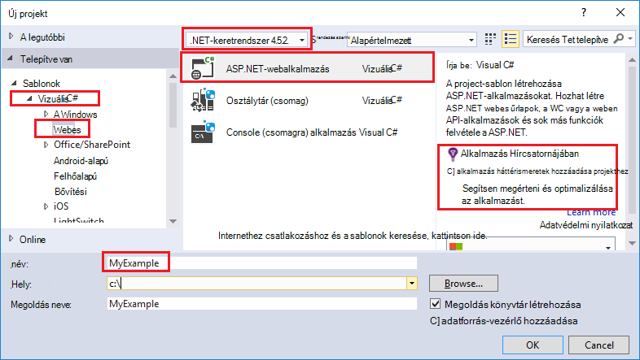

5. **Új ASP.NET projekt** párbeszédpanelen válassza ki a **MVC** sablont, és kattintson a **Módosítás hitelesítési**.

    Ebben az oktatóprogramban egy ASP.NET MVC webes projekt rendszerbe. Megtudhatja, hogy miként telepítse ASP.NET webes API-projektet szeretne, a [következő lépések](#next-steps) szakaszában olvashat. 

    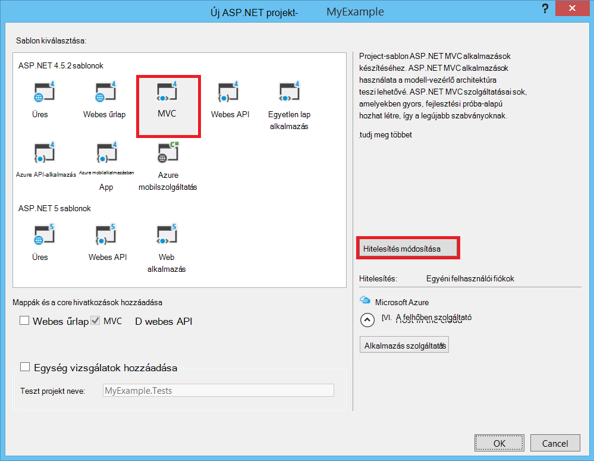

6. **Hitelesítés módosítása** párbeszédpanelen válassza a **Nincs hitelesítés**, és kattintson **az OK**gombra.

    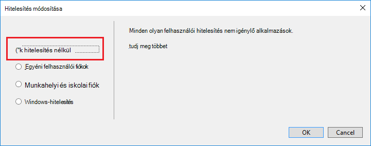

    Az első lépések oktatóanyagban egy egyszerű alkalmazás, amely nem felhasználók log az éppen üzembe helyezése.

5. Az **Új ASP.NET projekt** párbeszédpanel a **Microsoft Azure** csoportban győződjön meg arról, **a felhőben szolgáltató** ki, és hogy **Alkalmazás szolgáltatás** be van jelölve a legördülő listában.

    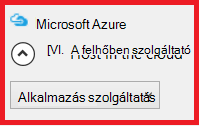

    Ezeket a beállításokat a Visual Studio létrehozása az Azure web app beállítása a webes projekthez közvetlen.

6. Kattintson az **OK gombra**

## Azure erőforrások egy új webalkalmazás konfigurálása

Most már a Visual Studio tájékoztatása az Azure erőforrások, amelyet akkor hozhat létre.

5. Az **Alkalmazás szolgáltatás hozzon létre** párbeszédpanelen kattintson a **fiók hozzáadása**gombra, és Azure az azonosító és az Azure előfizetés kezeléséhez használt fiók jelszavát, majd jelentkezzen be.

    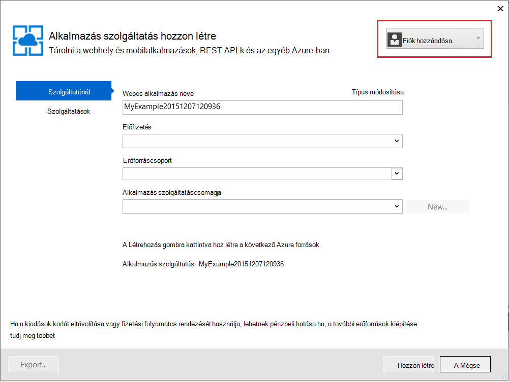

    Ha már bejelentkezett a korábbi ugyanazon a számítógépen, nem jelenhet meg a **fiók hozzáadása** gombra. Ebben az esetben kihagyhatja ezt a lépést, vagy szükség lehet újra a hitelesítő adatait.
 
3. Adjon egy egyedi *azurewebsites.net* tartományban van **Webes alkalmazás nevére** . Ha például tetszés szerinti nevet adhat, MyExample számokkal, hogy egyedi, például MyExample810 jobbra. Alapértelmezett webhelynév létrejön, ha egyedi legyen, és azt is használhatja.

    Ha valaki más már használatban van, írja be a nevet, jobbra egy zöld pipa helyett egy piros felkiáltójel látható, és meg kell adnia egy másik nevet.

    Az alkalmazás URL-je, ez a név és *. azurewebsites.net*. Ha például a név `MyExample810`, az URL-cím `myexample810.azurewebsites.net`.

    Egyéni tartomány az Azure webalkalmazást is használhatja. További tudnivalókért lásd: a [Configure Azure App szolgáltatásban egyéni tartománynevet](web-sites-custom-domain-name.md).

6. Az **Erőforráscsoport** mező melletti az **Új** gombra, és ha inkább írja be "MyExample" vagy egy másik nevet. 

    

    Erőforráscsoport Azure erőforrások, például a web Apps alkalmazások, adatbázisok és VMs gyűjteménye. Oktatóanyagot célszerű általában létrehozhat új erőforráscsoport, amely megkönnyíti az oktatóprogram létrehozott Azure erőforrások egy lépésben törlése. További információ az [erőforrás-kezelő Azure áttekintése](../azure-resource-manager/resource-group-overview.md)című témakörben találhat.

4. Az **Alkalmazás szolgáltatás megtervezése** legördülő lista mellett lévő **Új** gombra.

    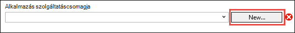

    Megjelenik a **Konfigurálása alkalmazás szolgáltatás megtervezése** párbeszédpanel.

    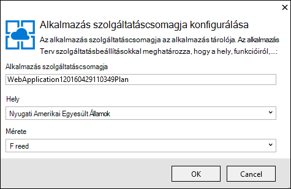

    Az az alábbi lépésekkel állítsa be az új erőforráscsoport-alkalmazás szolgáltatás megtervezése. Az alkalmazás szolgáltatáscsomagja, amelyet a webalkalmazás futtat, a számítási erőforrások meghatározása. Például ha úgy dönt, hogy a szabad réteg, az API-alkalmazás futtat a megosztott VMs futása az egyes fizetett rétegek a dedikált VMs. További információt az [alkalmazás szolgáltatás csomagok áttekintése](../app-service/azure-web-sites-web-hosting-plans-in-depth-overview.md)című témakörben találhat.

5. A **Konfigurálása alkalmazás szolgáltatás megtervezése** párbeszédpanelen adja meg egy másik nevet vagy a "MyExamplePlan" Ha inkább.

5. A **hely** legördülő listában válassza a helyre, ahol a legközelebb.

    Ezzel a beállítással megadhatja, melyik Azure adatközponthoz az alkalmazás fog futni. Ebben az oktatóanyagban bármely régió kijelölhet és nem létrehozni, akkor a észrevehető különbség. De egy gyártási alkalmazás a kiszolgáló kell a lehető legközelebb férnek hozzá, [a késleltetés](http://www.bing.com/search?q=web%20latency%20introduction&qs=n&form=QBRE&pq=web%20latency%20introduction&sc=1-24&sp=-1&sk=&cvid=eefff99dfc864d25a75a83740f1e0090)csökkentése érdekében, hogy az ügyfelek számára.

5. A **méret** legördülő listában kattintson a **Free**gombra.

    Az ebben az oktatóanyagban a szabad árak réteg nyújt jó elég teljesítményét.

6. **Konfigurálása alkalmazás szolgáltatás tervezése** párbeszédpanelen kattintson **az OK gombra**.

7. **Alkalmazás szolgáltatás hozzon létre** párbeszédpanelen kattintson a **Létrehozás**gombra.

## Visual Studio hoz létre a project és a web app

Rövid idő általában kisebb, mint egy perc Visual Studio hoz létre, a webhelyen a project és a web App alkalmazásban.  

**Megoldás Intéző** ablakának jeleníti meg az új projektet a fájlokat és mappákat.

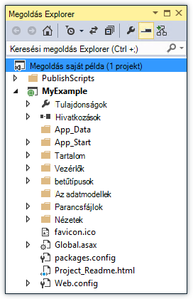

Az **Azure alkalmazás szolgáltatási tevékenység** ablakban látható, hogy a web app létrehoztak.

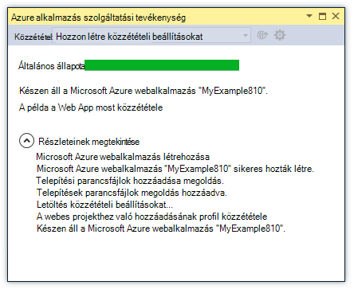

A **Felhő** Intézőt lehetővé teszi a megtekintése és kezelése az Azure erőforrások, köztük az imént létrehozott új webalkalmazást.

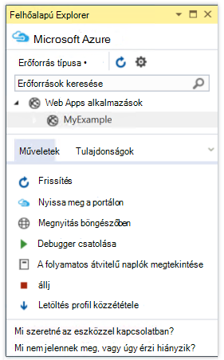
    
## A webes projekt telepítése az Azure web App alkalmazásban

Ebben a részben rendszerbe állítják a webhelyen a project a web App alkalmazásban.

1. A **Megoldás Explorer**kattintson a jobb gombbal a projektet, és válassza a **Közzététel**lehetőséget.

    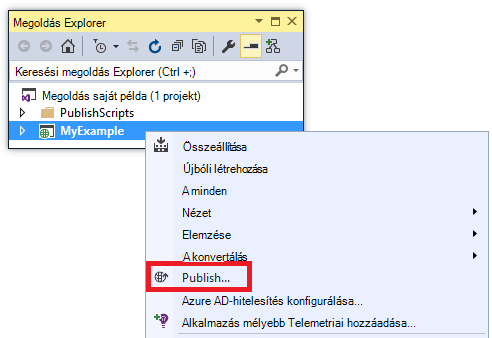

    Néhány másodpercig a **Webhely közzététele** varázsló jelenik meg. A varázsló a *Profil közzététele* , amelynek a beállításait az üzembe helyezése a webhelyen a project az új web App alkalmazásban nyílik meg.

    A közzététel profil tartalmaz felhasználónevet és jelszót telepítéshez.  Ezek a hitelesítő adatok meg lett létrehozva, és nem kell adja meg őket. A jelszó titkosítva rejtett felhasználói fájlban a `Properties\PublishProfiles` mappát.
 
8. A **Webhely közzététele** varázslót **kapcsolat** lapon kattintson a **Tovább**gombra.

    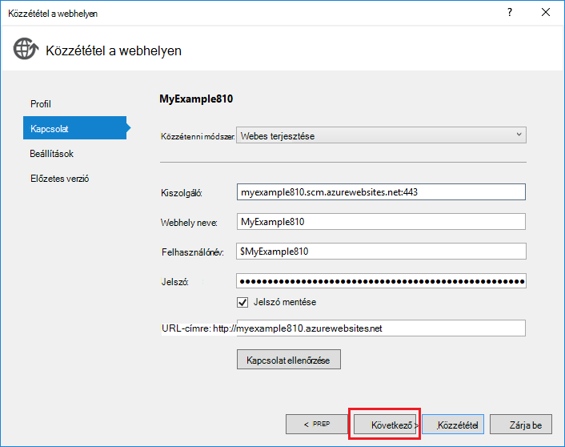

    Ezután van a **Beállítások** fülre. Itt módosíthatja az összeállítás konfiguráció [távoli](../app-service-web/web-sites-dotnet-troubleshoot-visual-studio.md#remotedebug)hibakereséshez hibakeresési építés telepítéséhez. A lap is kínál [Beállításokat közzététele](https://msdn.microsoft.com/library/dd465337.aspx#Anchor_2).

10. A **Beállítások** lapon kattintson a **Tovább**gombra.

    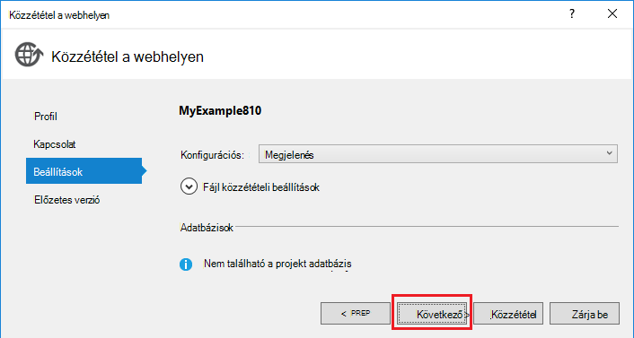

    A **kép** lap következő. Ide kattintva megtekintheti, hogy mi fájlok vannak egyszer a projekt másolja át az API-alkalmazás lehetőség van. Ha már telepítette a korábbi API alkalmazás projekt telepítését, csak a módosított fájlok kerülnek. Ha szeretne másolni mi listájának megtekintése, rákattintva az **Előnézet indítása** gombra.

11. A **kép** lapon kattintson a **Közzététel**gombra.

    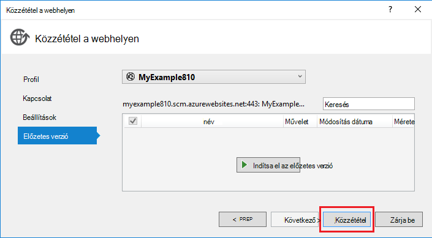

    Kattintson a **Közzététel**gombra, ha a Visual Studio kezdi el a fájlok másolása az Azure-kiszolgálóhoz. Ez is eltarthat néhány percig is.

    A **kibocsátás** és **Azure alkalmazás szolgáltatási tevékenység** windows telepítési műveletek készítésének megjelenítése, és a telepítés sikeres befejezésétől jelentést.

    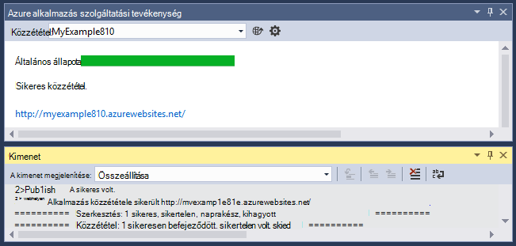

    Sikeres példányban, az alapértelmezett böngésző automatikusan nyílik meg a telepített web app URL-CÍMÉT, és az Ön által létrehozott alkalmazás most már fut a felhőben. Az URL-CÍMÉT a böngésző címsorában látható, hogy a web app betöltött az internetről.

    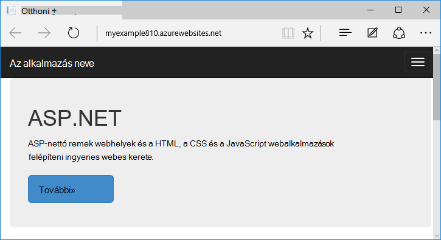

    > [AZURE.TIP]A **Webhely egyik kattintson a közzététel** eszköztár gyors telepítéshez engedélyezheti. Kattintson a **Nézet > Eszköztárak**, és válassza a **Webhely egyik kattintson a közzététel**. Jelöljön ki egy profilt, közzététele egy gombra, vagy egy gombra kattintva nyissa meg a **Webhely közzététele** varázsló az eszköztár segítségével.
    > 

## Hibaelhárítás

Ha probléma keresztül ebben az oktatóanyagban menet közben, győződjön meg arról, hogy a .NET rendszerhez az Azure SDK a legújabb verzióját használja. A megtennie legegyszerűbben [Az Azure SDK Visual Studio 2015](http://go.microsoft.com/fwlink/?linkid=518003)letölteni. Ha az aktuális verziója telepítve van, a webes Platform telepítő tájékoztatja arról, hogy nem volt telepítve van szükség.

Ha a vállalati hálózaton és Azure alkalmazás szolgáltatás tűzfalon keresztül telepíteni, ellenőrizze, hogy 8172 és a 443-as port nyitva webes telepítése. Ha azokat a portokat nem nyílik meg, a következő részben következő lépéseket az egyéb telepítési beállításokat.

Után az Azure alkalmazás szolgáltatást futtató ASP.NET-webalkalmazást, célszerű, ha többet szeretne tudni a Visual Studio funkciók, amelyek megkönnyítik a hibaelhárítás. Naplózás információt távoli hibakeresés és az egyéb, című [hibaelhárítási Azure webes a Visual Studióban](web-sites-dotnet-troubleshoot-visual-studio.md).

## Következő lépések

Ebben az oktatóanyagban láthatta, hozzon létre egy egyszerű webalkalmazást, és beállítaná őket az Azure-webappokban. Íme, néhány kapcsolódó témakörök és tanulási Azure alkalmazás szolgáltatással kapcsolatos további forrásokat:

* Figyelheti és kezelése a webalkalmazás az [Azure-portálon](https://portal.azure.com/). 

    További tudnivalókért lásd: [az Azure portál áttekintése](/services/management-portal/) és [Azure alkalmazás szolgáltatás konfigurálása web Apps alkalmazások](web-sites-configure.md).

* Egy meglévő webes projekt telepítése egy új web App alkalmazásban a Visual Studio segítségével

    Kattintson a jobb gombbal a projekt a **Megoldást Intézőben**, és kattintson a **Közzététel**gombra. Válassza **A Microsoft Azure alkalmazás szolgáltatás** és a közzététel cél, és kattintson az **Új**gombra. A párbeszédpanelek megegyeznek majd mi láthatta, ebben az oktatóanyagban.

* Adatforrás-vezérlő a project web terjesztése

    [Automatizálása telepítési](http://www.asp.net/aspnet/overview/developing-apps-with-windows-azure/building-real-world-cloud-apps-with-windows-azure/continuous-integration-and-continuous-delivery) [forrás vezérlő rendszer](http://www.asp.net/aspnet/overview/developing-apps-with-windows-azure/building-real-world-cloud-apps-with-windows-azure/source-control)tudni lásd: [Azure App szolgáltatásban web Apps alkalmazások – első lépések](app-service-web-get-started.md) és [az Azure web app telepítése](web-sites-deploy.md).

* ASP.NET webes API-Azure alkalmazás szolgáltatás API-alkalmazás telepítése

    Láthatta, hogy miként hozhat létre, amely elsősorban célja, hogy egy webhely üzemeltetése Azure alkalmazás szolgáltatás egy példánya. Alkalmazás szolgáltatás is kínál funkciókat, például CORS támogatja a webes API-khoz elhelyezésére és API-metaadatok támogatás ügyfél kód létrehozása céljából. Akkor API-funkciók használhatók a megfelelő web App alkalmazásban, de főként szeretné üzemeltetni az API-alkalmazás szolgáltatás egy példányát, **API-alkalmazás** akkor célszerűbb. További tudnivalókért lásd: [első lépések a API-alkalmazások és az Azure alkalmazás szolgáltatás ASP.NET](../app-service-api/app-service-api-dotnet-get-started.md). 

* Adjon meg egy egyéni tartománynevet, és a hitelesítésszolgáltató

    SSL- és a saját tartomány (például www.contoso.com contoso.azurewebsites.net helyett) használatával kapcsolatos további tudnivalókért lásd: az alábbi forrásokat:

    * [Azure alkalmazás szolgáltatás a saját tartománynév beállítása](web-sites-custom-domain-name.md)
    * [Engedélyezze a HTTPS-Azure webhely](web-sites-configure-ssl-certificate.md)

* Törölje az erőforrás-csoportot, amely tartalmazza a web app és a kapcsolódó Azure erőforrások, ha a velük végzett.

    Információ arról, hogy miként dolgozhat az Azure-portálon erőforrás csoportok témakörökben [Deploy az erőforrás-kezelő sablonok és Azure portálon](../resource-group-template-deploy-portal.md).   

*   További példák létrehozása az ASP.NET Web App alkalmazás szolgáltatásban című témakörben talál [létrehozása és az ASP.NET-webappokban Azure alkalmazás szolgáltatás üzembe](https://github.com/Microsoft/HealthClinic.biz/wiki/Create-and-deploy-an-ASP.NET-web-app-in-Azure-App-Service) és [létrehozása és helyezhetnek üzembe a mobilalkalmazásban Azure App szolgáltatásban](https://github.com/Microsoft/HealthClinic.biz/wiki/Create-and-deploy-a-mobile-app-in-Azure-App-Service) a [bemutató](https://blogs.msdn.microsoft.com/visualstudio/2015/12/08/connectdemos-2015-healthclinic-biz/) [HealthClinic.biz](https://github.com/Microsoft/HealthClinic.biz) 2015 csatlakozás. További QuickStarts HealthClinic.biz bemutatója a csomagban a [Azure fejlesztői eszközökkel QuickStarts csomagban](https://github.com/Microsoft/HealthClinic.biz/wiki/Azure-Developer-Tools-Quickstarts)című témakör tartalmaz.
