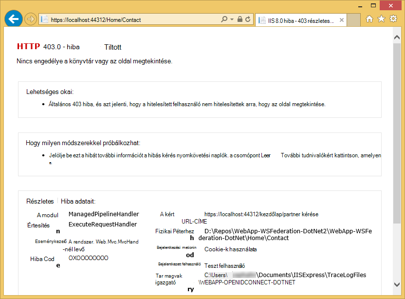

<properties 
    pageTitle="Azure a vállalati verzió alkalmazás létrehozása az Active Directory összevonási szolgáltatások hitelesítési |} Microsoft Azure" 
    description="Útmutató a vállalati verzió alkalmazás létrehozása az Azure alkalmazás szolgáltatás meghívottnak futó helyszíni STS. Ebben az oktatóanyagban célként Active Directory összevonási szolgáltatások, mint a futó helyszíni STS." 
    services="app-service\web" 
    documentationCenter=".net" 
    authors="cephalin" 
    manager="wpickett" 
    editor=""/>

<tags 
    ms.service="app-service-web" 
    ms.devlang="dotnet" 
    ms.topic="article" 
    ms.tgt_pltfrm="na" 
    ms.workload="web" 
    ms.date="08/31/2016" 
    ms.author="cephalin"/>

# Azure a vállalati verzió alkalmazás létrehozása az AD FS-hitelesítés

Ez a cikk bemutatja, hogyan az ASP.NET MVC a vállalati verziós alkalmazások létrehozása az [Azure alkalmazás szolgáltatás](../app-service/app-service-value-prop-what-is.md) egy helyszíni [Active Directory összevonási szolgáltatások](http://technet.microsoft.com/library/hh831502.aspx) használata a identitásszolgáltató. Ebben az esetben is dolgozhat, ha azt szeretné, hogy a vállalati verziós alkalmazások létrehozása az Azure alkalmazás szolgáltatás, de a szervezete megköveteli a címtár-adatok helyszíni tárolja.

>[AZURE.NOTE] Azure alkalmazás szolgáltatás különböző vállalati hitelesítési és engedélyezési lehetőségek áttekintést talál [a helyszíni Active Directoryval az Azure alkalmazásban való hitelesítés](web-sites-authentication-authorization.md).

## Mit fog összeállítása ##

Egy egyszerű ASP.NET-alkalmazás az Azure alkalmazás szolgáltatás Web Apps alkalmazásokban a következő szolgáltatásokkal gyűjt:

- Végzi a felhasználók hitelesítését Active Directory összevonási szolgáltatások
- Használja a `[Authorize]` engedélyezése a felhasználók számára a különböző műveletek
- Statikus konfiguráció hibakeresése során a Visual Studióban, mind az alkalmazás szolgáltatás Web Apps alkalmazások közzététele (egyszer beállítását, hibakeresési és bármikor közzététele)  

## Mire van szüksége ##

[AZURE.INCLUDE [free-trial-note](../../includes/free-trial-note.md)]

A következő módszerekkel fejezheti ebben az oktatóanyagban lesz szüksége:

- Egy helyszíni Active Directory összevonási szolgáltatások telepítési (ebben az oktatóanyagban használt vizsgálat laboratóriumi végpontok közötti forgatókönyvben című [tesztelése laboratóriumi: az AD FS az Azure virtuális (vizsgálathoz csak) önálló STS](https://blogs.msdn.microsoft.com/cephalin/2014/12/21/test-lab-standalone-sts-with-ad-fs-in-azure-vm-for-test-only/))
- Engedélyek használna létrehozása fél meghatalmazások Active Directory összevonási szolgáltatások kezelése
- Visual Studio 2013 frissítés 4-es vagy újabb verzió
- [Azure SDK 2.8.1](http://go.microsoft.com/fwlink/p/?linkid=323510&clcid=0x409) vagy újabb verzió

## A vállalati verzió sablon minta alkalmazással ##

A minta alkalmazás ebben az oktatóanyagban [Webappban-WSFederation-DotNet)](https://github.com/AzureADSamples/WebApp-WSFederation-DotNet), az Azure Active Directory-csoportwebhelyen hozza létre. Mivel az Active Directory összevonási szolgáltatások támogatja a Webszolgáltatás-Összevonás, vele sablonként könnyű a vállalati verziós alkalmazások létrehozását. Az alábbi szolgáltatások van:

- [Webszolgáltatás-összevonás](http://msdn.microsoft.com/library/bb498017.aspx) használja hitelesítést végezni a korábbi helyszíni Active Directory összevonási szolgáltatások telepítési
- Bejelentkezés és kijelentkezési funkciók
- Használja a [Microsoft.Owin](http://www.asp.net/aspnet/overview/owin-and-katana/an-overview-of-project-katana) (helyett Windows identitás Foundation), a jövőbeli ASP.NET-és sokkal egyszerűbb hitelesítési és engedélyezési mint WIF beállítása

## A minta alkalmazás beállítása ##

2.  Klónozhatja, vagy a minta megoldást a [Webalkalmazás-WSFederation-DotNet](https://github.com/AzureADSamples/WebApp-WSFederation-DotNet) töltse le a helyi könyvtár.

    > [AZURE.NOTE] A képernyőn megjelenő utasításokat a [README.md](https://github.com/AzureADSamples/WebApp-WSFederation-DotNet/blob/master/README.md) megtudhatja, hogy miként állíthatja be az alkalmazás az Azure Active Directory. De ebben az oktatóanyagban állítsa be az AD FS, így hajtsa végre az alábbi lépésekkel helyette.

3.  Nyissa meg azt a megoldást, és a **Megoldás Explorer**Controllers\AccountController.cs nyissa.

    Láthatja, hogy a kód egyszerűen problémák-hitelesítés beavatkozás igazolására szolgáló eljárás a felhasználó Webszolgáltatás-összevonás használatával hitelesítse magát. Az összes hitelesítési App_Start\Startup.Auth.cs van beállítva.

4.  Nyissa meg a App_Start\Startup.Auth.cs. Az a `ConfigureAuth` módszer, vegye figyelembe a sor:

        app.UseWsFederationAuthentication(
            new WsFederationAuthenticationOptions
            {
                Wtrealm = realm,
                MetadataAddress = metadata                                      
            });

    A OWIN világ a kódtöredék valójában Webszolgáltatás-összevonás hitelesítési konfigurálnia kell a bA minimális. Érdemes sokkal egyszerűbbé és további elegáns, mint WIF, ahol Web.config van beékelt XML bárhol arra a helyre. Mindössze szükséges adatait a megbízó fél (RP) azonosító és a metaadat-fájlt az AD FS-szolgáltatás URL-CÍMÉT. Lássunk egy példát:

    -   RP azonosító:`https://contoso.com/MyLOBApp`
    -   Metaadat-címe:`http://adfs.contoso.com/FederationMetadata/2007-06/FederationMetadata.xml`

5.  A App_Start\Startup.Auth.cs a következő statikus karakterlánc-definíciók módosítása:  
    <pre class="prettyprint">
    magánjellegű statikus karakterlánc tartomány = ConfigurationManager.AppSettings["ida:<mark>RPIdentifier</mark>"]; <mark><del>magánjellegű statikus karakterlánc aadInstance = ConfigurationManager.AppSettings["ida:AADInstance"];</del></mark> 
     <mark><del>magánjellegű statikus karakterlánc bérlői = ConfigurationManager.AppSettings["ida:Tenant"];</del></mark> 
     <mark><del>magánjellegű statikus karakterlánc metaadatok = karakterlánc. Formátum ("{0} / {1} /federationmetadata/2007-06/federationmetadata.xml", aadInstance, bérlői);</del></mark> 
     <mark>magánjellegű statikus karakterlánc metaadatok = karakterlánc. Formátum ("https://: {0} /federationmetadata/2007-06/federationmetadata.xml", ConfigurationManager.AppSettings["ida:ADFS"]);</mark>

    <mark><del>karakterlánc-szervezet = String.Format (CultureInfo.InvariantCulture, aadInstance, a bérlői);</del></mark>
    </pre>

6.  Most módosítsa a megfelelő Web.config. Nyissa meg a Web.config, és a következő alkalmazás beállításainak módosítása:  
    <pre class="prettyprint">
    &lt;appSettings&gt;
    &lt;add key="webpages:Version" value="3.0.0.0" /&gt;
    &lt;add key="webpages:Enabled" value="false" /&gt;
    &lt;add key="ClientValidationEnabled" value="true" /&gt;
    &lt;add key="UnobtrusiveJavaScriptEnabled" value="true" /&gt;
      <mark><del>&lt;add key="ida:Wtrealm" value="[Enter the App ID URI of WebApp-WSFederation-DotNet https://contoso.onmicrosoft.com/WebApp-WSFederation-DotNet]" /&gt;</del></mark>
      <mark><del>&lt;add key="ida:AADInstance" value="https://login.windows.net" /&gt;</del></mark>
      <mark><del>&lt;add key="ida:Tenant" value="[Enter tenant name, e.g. contoso.onmicrosoft.com]" /&gt;</del></mark>
      <mark>&lt;add key="ida:RPIdentifier" value="[Enter the relying party identifier az Active Directory összevonási szolgáltatások, például https://localhost:44320 konfigurált /] "/&gt;</mark>
      <mark>&lt;kulcs hozzáadása ="ida: ADFS"érték ="[Írja be a teljesen minősített tartománynév szerződése Active Directory összevonási szolgáltatások, például adfs.contoso.com]"/&gt; </mark>        

    &lt;/appSettings&gt;
    </pre>

    Töltse ki a megfelelő környezet alapján legfontosabb értékeit.

7.  Győződjön meg arról, hogy nincsenek hibák az alkalmazás összeállítása.

Ez azt. Most már a minta alkalmazás készen áll a Active Directory összevonási szolgáltatások használata. Van szüksége egy RP adatvédelmi állítható be az Ez az alkalmazás az AD FS később.

## A minta alkalmazás Azure alkalmazás szolgáltatás Web Apps alkalmazások terjesztése

Ebben az esetben teszi közzé a webalkalmazás az alkalmazást az alkalmazás szolgáltatás Web Apps alkalmazásokban a hibakeresési környezet megőrzése mellett. Látható, hogy van egy RP adatvédelmi az AD FS, így hitelesítési még mindig nem működik még az alkalmazás közzétételt szeretné. Jó helyen jár Ha így tesz, akkor most lehet a web app URL-címet, beállíthatja a RP adatvédelmi később is használhatja.

1. Kattintson a jobb gombbal a projekt, és válassza a **Közzététel**.

    

2. Jelölje ki a **Microsoft Azure alkalmazás szolgáltatást**.
3. Ha még nem jelentkezett be Azure, kattintson a **Bejelentkezés** gombra, és az Azure előfizetés a Microsoft-fiók használatával jelentkezzen be.
4. Miután bejelentkezett, kattintson az **Új** webhely-alkalmazás létrehozása céljából.
5. Töltse ki az összes szükséges mezőt. Csatlakozás helyszíni adatok később, így a web App-adatbázis létrehozása nem fogja.

    

6. Kattintson a **létrehozása**gombra. Amikor létrejött a web App alkalmazásban, a webhely közzététele párbeszédpanelt nyitja meg.
7. A **Célhely URL-CÍMÉT**, a **https** **http** értékre. A teljes URL-cím másolása későbbi felhasználás céljából szövegszerkesztőben. Ezután kattintson a **Közzététel**gombra.

    

11. A Visual Studióban nyissa meg a projekt **Web.Release.config** . Az alábbi XML-fájl beszúrása a `<configuration>` címkézése, és cserélje le a kulcs értékét a Közzététel web app URL-címe.  
    <pre class="prettyprint">
&lt;appSettings&gt;
   &lt;kulcs hozzáadása = "ida: RPIdentifier" érték = "<mark>[pl. https://mylobapp.azurewebsites.net/]</mark>" xdt:Transform "SetAttributes" xdt:Locator="Match(key) =" /&gt;
&lt;/appSettings&gt;</pre>

Amikor elkészült, ha a projekt, a Visual Studio hibakeresési környezetben, és egy a közzétett webalkalmazás Azure-ban beállított két RP azonosítóját. Az egyes a két környezetben az AD FS-RP adatvédelmi fog beállítása. Hibakeresés, során Web.config az alkalmazás beállításai szolgálnak az Active Directory összevonási szolgáltatások használata **hibakeresési** konfigurációt. Ha közzé (alapértelmezés szerint a **Megjelenés** konfiguráció közzététele) transzformált Web.config töltenek fel, ezzel a paranccsal beépíti Web.Release.config a módosított beállítások alkalmazást.

Ha szeretne csatolni a közzétett web app az Azure-ban a debugger (azaz akkor fel kell töltenie a közzétett web App alkalmazásban a kód hibakeresési szimbólumok), a hibakeresési konfiguráció Azure hibakereséshez, de saját egyéni Web.config átalakító (pl. Web.AzureDebug.config), hogy az alkalmazás beállításai Web.Release.config átirattal hozhat létre. Ez a statikus konfiguráció megőrzéséhez támogatása a különböző környezetekben teszi lehetővé.

## Active Directory összevonási szolgáltatások szolgáltatások megbízó fél megbízhatóságának konfigurálása ##

Most szeretne beállítani egy, az Active Directory összevonási szolgáltatások kezelése RP adatvédelmi, használja a minta alkalmazást, és az AD FS ténylegesen hitelesítő előtt. Meg kell két külön RP meghatalmazások, egy hibakeresési környezetben, és egy, a közzétett webalkalmazás beállítása.

> [AZURE.NOTE] Győződjön meg arról, hogy a környezetekben a egyaránt ismételje meg az alábbi lépéseket.

4.  Az ADFS-kiszolgálóra jelentkezzen be a hitelesítő adatokat, az Active Directory összevonási szolgáltatások kezelése jogosultságokkal rendelkező.
5.  Nyissa meg az Active Directory összevonási szolgáltatások kezelése. Kattintson a jobb gombbal az **Active Directory FS\Trusted Relationships\Relying fél megbízik** , és válassza a **Hozzáadása használna fél a megbízható gombra**.

    

5.  Az **Adatforrás kiválasztása** lapon válassza **a megbízó fél kapcsolatos adatok kézi bevitele**. 

    

6.  A **Megjelenítendő név megadása** lapon írjon be egy nevet az alkalmazáshoz, és kattintson a **Tovább**gombra.
7.  **Válassza a Protocol (protokoll)** lapon kattintson a **Tovább**gombra.
8.  A **Tanúsítvány konfigurálása** lapon kattintson a **Tovább**gombra.

    > [AZURE.NOTE] Célszerű használni HTTPS már, mivel a titkosított tokenek nem kötelező. Ha alaposabban szeretne titkosítása token származhat AD FS ezen a lapon, a kód is hozzá kell adni jogkivonat visszafejtése összefüggés. További tudnivalókért lásd: [OWIN Webszolgáltatás-összevonás köztes manuális beállítása és a titkosított tokenek elfogadása](http://chris.59north.com/post/2014/08/21/Manually-configuring-OWIN-WS-Federation-middleware-and-accepting-encrypted-tokens.aspx).
  
5.  Helyezze át a következő lépésben az alakzatot, mielőtt a Visual Studio projektből szükséges információ. A projekt tulajdonságait jegyezze fel az **SSL URL-CÍMÉT** az alkalmazás. 

    

6.  Vissza az AD FS-kezelés az **URL-címet konfigurálni** lap **Hozzáadása használna felek Adatvédelmi varázslót**jelölje ki **a Webszolgáltatás-összevonás passzív protokoll támogatásának engedélyezése** és a Visual Studio projekt az előző lépésben lejegyzett típusú az SSL URL-cím. Kattintson a **Tovább gombra**.

    

    > [AZURE.NOTE] URL-cím Megadja, hogy az ügyfél küldhet, miután létrejött a hitelesítési. A hibakeresési környezetben kell <code>https://localhost:&lt;port&gt;/</code>. A közzétett webes alkalmazáshoz kell a web app URL-címe.

7.  Az **Azonosítók beállítása** lapon ellenőrizze, hogy a projekt SSL URL-cím már szerepel, és kattintson a **Tovább**gombra. Kattintson a **következő** teljes mértékben gombra az alapértelmezett választása esetén varázsló végére.

    > [AZURE.NOTE] A Visual Studio projekt App_Start\Startup.Auth.cs, az Ez az azonosító értékének ellen megfeleltetett <code>WsFederationAuthenticationOptions.Wtrealm</code> szövetséges hitelesítés során. Alapértelmezés szerint az alkalmazás URL-CÍMÉT az előző lépésben összegként RP azonosítót.

8.  Most már végzett az RP alkalmazás, a projekt konfigurálása az Active Directory összevonási szolgáltatások. Ezután állítsa be az alkalmazás a szükség szerint az alkalmazás jogcímalapú küldése. A **Felelős szabályok szerkesztése** párbeszédpanel nyitja meg alapértelmezés szerint ki a varázsló végén így azonnal elkezdheti. Vegyük konfigurálása legalább az alábbi követelések (a zárójelben sémák):

    -   Név (http://schemas.xmlsoap.org/ws/2005/05/identity/claims/name) – segítségével ASP.NET hydrate `User.Identity.Name`.
    -   Egyszerű felhasználónév (http://schemas.xmlsoap.org/ws/2005/05/identity/claims/upn) – a szervezet felhasználói egyedileg azonosítja.
    -   Csoporttagság (http://schemas.microsoft.com/ws/2008/06/identity/claims/role) - szerepkörök szerint kínál `[Authorize(Roles="role1, role2,...")]` díszítése vezérlők/műveletek engedélyezésére. A valóságban ezt a megközelítést nem lehet a legtöbb performant szerepkör-hitelesítéshez. Ha az Active Directory-felhasználók százai közül a biztonsági csoportok tartozik, százai közül a SAML token szerepkör követelések válnak. Alternatív megközelítés feltételesen attól függően, hogy a felhasználó tagsági szerepkör egyetlen igényt elküldése a munkatársak adott csoportjához. Azonban azt fogja legyen egyszerű: az ebben az oktatóanyagban.
    -   Név, azonosító (http://schemas.xmlsoap.org/ws/2005/05/identity/claims/nameidentifier) – elleni adatérvényesítéshez is használható. További tájékoztatást a könnyebb elleni érvényességi használata című **szolgáltatások hozzáadása a vállalati verzió** [létrehozása egy sor üzleti Azure alkalmazás Azure Active Directory-hitelesítéssel](web-sites-dotnet-lob-application-azure-ad.md#bkmk_crud)az.

    > [AZURE.NOTE] A felelős típusú konfigurálnia kell az alkalmazás a alkalmazással kapcsolatos igények határozza meg. A listáját az Azure Active Directory-alkalmazások (azaz RP meghatalmazások) által támogatott követelések például című [jogkivonat támogatott és a felelős típusok](http://msdn.microsoft.com/library/azure/dn195587.aspx).

8.  Állítást szabályok szerkesztése párbeszédpanelen kattintson a **Szabály hozzáadása**elemre.
9.  Állítsa be a nevét, az UPN és a szerepkör követelések, a képernyőképen látható módon, és kattintson a **Befejezés gombra**.

    

    Ezután hozzon létre azonosító formál, hogy a [Név azonosítóját, a SAML Előfeltételek](http://blogs.msdn.com/b/card/archive/2010/02/17/name-identifiers-in-saml-assertions.aspx)igazolni lépésekkel ideiglenes (tranziens) nevet.

9.  Kattintson ismét a **Szabály hozzáadása** .
10. Jelölje ki, **küldje el az egyéni szabály alkalmazásával követelések** , és kattintson a **Tovább**gombra.
11. Illessze be a következő szabályt nyelv **Egyéni szabályt** , nevezze el a **Munkamenetet azonosító** szabály, és kattintson a **Befejezés gombra**.  
    <pre class="prettyprint">
    C1: [típus == "http://schemas.microsoft.com/ws/2008/06/identity/claims/windowsaccountname"] &amp; &amp; 
    c2: [típus == "http://schemas.microsoft.com/ws/2008/06/identity/claims/authenticationinstant"] = > hozzáadása (tárolása = "_OpaqueIdStore" típusú ("<mark>http://contoso.com/internal/sessionid</mark>") =, lekérdezés = "{0}; { 1}; {2}; {3}; 4} ", paraméter ="useEntropy"paraméter = c1. Érték, a paraméter = c1. OriginalIssuer, paraméter = "", paraméter = c2. Érték-);
    </pre>

    Az egyéni szabály hasonlóan ez a kép kell kinéznie:

    

9.  Kattintson ismét a **Szabály hozzáadása** .
10. Jelölje ki, **egy bejövő állítást átalakítás** , és kattintson a **Tovább**gombra.
11. Konfigurálja a szabályt, ahogy azt a képernyőképet (használatával hozta létre az egyéni szabály állítást típusa), és kattintson a **Befejezés gombra**.

    

    Az ideiglenes (tranziens) neve ID állítást lépései részletes információkat olvassa el a [Neve azonosítóját, a SAML Előfeltételek](http://blogs.msdn.com/b/card/archive/2010/02/17/name-identifiers-in-saml-assertions.aspx)című témakört.

12. A **Állítást szabályok szerkesztése** párbeszédpanelen kattintson az **Alkalmaz** gombra. Most már az alábbi képernyőképen hasonlóan kell kinéznie:

    

    > [AZURE.NOTE] Ismét győződjön meg arról, hogy végrehajtotta ezeket a lépéseket a hibakeresési környezet és a közzétett web App alkalmazásban.

## Az alkalmazás szövetséges hitelesítési tesztelése

Készen áll a tesztelje az alkalmazás hitelesítési logika AD FS szemben. Az Active Directory összevonási szolgáltatások tesztkörnyezetben, a próba-felhasználó, amelyek az Active Directory (AD) teszt csoporthoz tartozik van.

A hibakeresőben hitelesítési teszteléséhez kell tennie az összes ezt követően típus `F5`. Ha szeretne a közzétett webes alkalmazásban tesztelje a hitelesítés, nyissa meg az URL-címet.

Miután betölti a webalkalmazás, kattintson a **Bejelentkezés**gombra. Most egy bejelentkezési párbeszédpanel vagy az AD FS AD FS által választott hitelesítési módtól függően, melyet bejelentkezési lapja kapja. Az alábbiakban mi szerezhető be az Internet Explorer 11-es.

Miután, jelentkezzen be a felhasználó Active Directory összevonási szolgáltatások helyezési AD a tartományban, a kezdőlap ismét a ekkor jelennie **Helló, <User Name>!** a sarokban. Az alábbiakban lehet beszerezni.

Eddig sikeresen az alábbi módon:

- Az alkalmazás sikeresen elérte az Active Directory összevonási szolgáltatások, és az AD FS-adatbázisban található egy egyező RP azonosító
- Active Directory összevonási szolgáltatások sikeresen hitelesítette, az Active Directory felhasználót, és a biztonsági másolatot az alkalmazás kezdőlapra átirányítást
- Active Directory összevonási szolgáltatások, mint sikerült elküldeni az alkalmazás, a név állítás (http://schemas.xmlsoap.org/ws/2005/05/identity/claims/name), amint azt arra, hogy a felhasználó nevét a sarokban jelenik meg. 

A név állítást hiányzik, ha szeretné már átnézett **Helló,!**. Ha megnézi Views\Shared\_LoginPartial.cshtml, úgy találja, hogy használja `User.Identity.Name` megjelenítése a felhasználó nevét. Említett korábban, ha a hitelesített felhasználó neve állítást érhető el a SAML jogkivonat, a ASP.NET hydrates ezt a tulajdonságot vele. Az Active Directory összevonási szolgáltatások által küldött összes követelések megtekintéséhez elhelyezni töréspont Controllers\HomeController.cs, az Index művelet módszer. A felhasználó hitelesítése után vizsgálja meg a `System.Security.Claims.Current.Claims` webhelycsoport.

 

## Engedélyezheti a felhasználók adott vezérlők vagy műveletek

Mivel szerepel csoport tagsági szerepkör igények szerint a RP adatvédelmi konfigurációs, most már használhatja őket közvetlenül a a `[Authorize(Roles="...")]` díszítése vezérlők és a műveletek. A vállalati verzió alkalmazásban, a létrehozás-olvasható-frissítés – Delete (CRUD) mintázattal engedélyezheti a szerepköröket minden művelet eléréséhez. Most akkor csak megpróbálja ki ezt a szolgáltatást a meglévő kezdőlap vezérlő.

1. Nyissa meg a Controllers\HomeController.cs.
2. Díszítése a `About` és `Contact` művelet módszerek hasonlóan, mint az alábbi kódot, használja a biztonsági csoport tagsági, amely a hitelesített felhasználó rendelkezik.  
    <pre class="prettyprint">
    <mark>[Engedélyezése (szerepkörök = "Próba csoport")]</mark> 
    nyilvános ActionResult About() {ViewBag.Message = "Az alkalmazás leírás oldal.";

        return View();
    }

    <mark>[Engedélyezése (szerepkörök = "Domain Admins")]</mark> 
    nyilvános ActionResult Contact() {ViewBag.Message = "A névjegy lapot.";

        return View();
    }  </pre>

    E az Active Directory összevonási szolgáltatások tesztkörnyezetben csoportjához **Tesztelése** adott **Felhasználó tesztelése** , mivel lehet kell megadnia próba csoport engedélyezési tesztelje a `About`. A `Contact`, a **Domain Admins**, amelyekhez tartoznak nem **Tesztelése felhasználói** negatív írásmódját fogja tesztelhetem.

3. Indítsa el a hibakeresőt beírásával `F5` jelentkezzen be, majd kattintson a **Névjegy**gombra. Most kell látható a `~/About/Index` sikeresen, oldal, ha a hitelesített felhasználó számára engedélyezett művelet.
4. Kattintson a **partner**, amely abban az esetben nem kell **Teszt felhasználó** engedélyezi a művelet gombra. Azonban a böngészőben a rendszerünk átirányítja az AD FS, amely végül jeleníti meg ezt az üzenetet:

    

    Akkor ezt a hibát az Eseménynapló az AD FS-kiszolgálón vizsgálja meg, a kivétel üzenet jelenik meg:  
    <pre class="prettyprint">
   Microsoft.IdentityServer.Web.InvalidRequestException: MSIS7042: <mark>az azonos ügyfél böngészési munkamenet kérelmet terjesztett "6" az utolsó 11 másodpercben.</mark> Részletekért forduljon a rendszergazdához.
   a Microsoft.IdentityServer.Web.Protocols.PassiveProtocolHandler.UpdateLoopDetectionCookie (WrappedHttpListenerContext környezet) a Microsoft.IdentityServer.Web.Protocols.WSFederation.WSFederationProtocolHandler.SendSignInResponse (WSFederationContext környezetben, MSISSignInResponse válasz) a Microsoft.IdentityServer.Web.PassiveProtocolListener.ProcessProtocolRequest (ProtocolContext protocolContext, PassiveProtocolHandler protocolHandler) a Microsoft.IdentityServer.Web.PassiveProtocolListener.OnGetContext (WrappedHttpListenerContext környezetre) </pre>

    Ez a hiba oka, hogy alapértelmezés szerint MVC adja eredményül, egy 401 nem engedélyezett: Ha nem rendelkezik engedéllyel a felhasználói szerepkörök elemre. Ez elindítja a identitásszolgáltató (AD FS) újbóli kérést. A felhasználó már hitelesítése, mivel az AD FS visszatér az ugyanazon a lapon, amely megjelenít egy másik 401, átirányítás ciklust létrehozása. Felülírja az AuthorizeAttribute's `HandleUnauthorizedRequest` helyett folytatná átirányítás le értelme megjelenítése egy egyszerű logikai metódussal.

5. Fájl létrehozása a projekt AuthorizeAttribute.cs néven, és a következő kódot beilleszteni.

        using System;
        using System.Web.Mvc;
        using System.Web.Routing;
        
        namespace WebApp_WSFederation_DotNet
        {
            [AttributeUsage(AttributeTargets.Class | AttributeTargets.Method, Inherited = true, AllowMultiple = true)]
            public class AuthorizeAttribute : System.Web.Mvc.AuthorizeAttribute
            {
                protected override void HandleUnauthorizedRequest(AuthorizationContext filterContext)
                {
                    if (filterContext.HttpContext.Request.IsAuthenticated)
                    {
                        filterContext.Result = new System.Web.Mvc.HttpStatusCodeResult((int)System.Net.HttpStatusCode.Forbidden);
                    }
                    else
                    {
                        base.HandleUnauthorizedRequest(filterContext);
                    }
                }
            }
        }

    A felülírási kód hitelesített, de nem engedélyezett esetekben küld a HTTP 401 (nem engedélyezett) helyett egy HTTP 403 (tiltott).

6. Futtassa újra a debugger `F5`. Most kattintson a **partner** megjelenítése részletesebb (jóllehet unattractive) hiba üzenet:

    

7. Az alkalmazás ismételt Azure alkalmazás szolgáltatás Web Apps alkalmazások közzététele, és tesztelje az élő alkalmazás viselkedését.

## A helyszíni adatok csatlakoztatása

Egy, hogy szeretné szeretné végrehajtani a a vállalati verzió alkalmazás az AD FS helyett az Azure Active Directory oka megfelelőségi problémák azzal, ha a szervezet adatok van. Ez azt is jelenti, hogy az Azure-webalkalmazást kell adatbázisához helyszíni, mivel az [SQL-adatbázis](/services/sql-database/) tartományként a adatok réteg a web Apps alkalmazások nem engedélyezettek.

Azure alkalmazás Web Apps alkalmazások támogatja a két megközelítés helyszíni adatbázis elérése: [Hibrid kapcsolatok](../biztalk-services/integration-hybrid-connection-overview.md) és a [Virtuális hálózatok](web-sites-integrate-with-vnet.md). További információt a [használatával VNET integráció és a hibrid kapcsolatokat az Azure alkalmazás szolgáltatás Web Apps alkalmazások](https://azure.microsoft.com/blog/2014/10/30/using-vnet-or-hybrid-conn-with-websites/)témakörben talál.

## További források

- [Az alkalmazás az SSL és az engedélyezés attribútum védelme](web-sites-dotnet-deploy-aspnet-mvc-app-membership-oauth-sql-database.md#protect-the-application-with-ssl-and-the-authorize-attribute)
- [A helyszíni Active Directory az Azure alkalmazásában a hitelesítéshez](web-sites-authentication-authorization.md)
- [Azure a vállalati verzió alkalmazás létrehozása az Azure Active Directory-hitelesítés](web-sites-dotnet-lob-application-azure-ad.md)
- [A helyszíni szervezeti hitelesítést követeljen (ADFS) használata ASP.NET a Visual Studio 2013-ban](http://www.cloudidentity.com/blog/2014/02/12/use-the-on-premises-organizational-authentication-option-adfs-with-asp-net-in-visual-studio-2013/)
- [Webes VS2013 projekt áttelepítése WIF Katana](http://www.cloudidentity.com/blog/2014/09/15/MIGRATE-A-VS2013-WEB-PROJECT-FROM-WIF-TO-KATANA/)
- [Az Active Directory összevonási szolgáltatások – áttekintés](http://technet.microsoft.com/library/hh831502.aspx)
- [Webszolgáltatás-összevonás 1.1-es specifikációja](http://download.boulder.ibm.com/ibmdl/pub/software/dw/specs/ws-fed/WS-Federation-V1-1B.pdf?S_TACT=105AGX04&S_CMP=LP)

