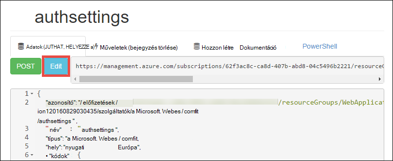

<properties 
    pageTitle="Azure a vállalati verzió alkalmazás létrehozása az Azure Active Directory authentication |} Microsoft Azure" 
    description="Megtudhatja, hogy miként hozhat létre ASP.NET MVC a vállalati verzió alkalmazást szolgáltatásban Azure alkalmazás meghívottnak az Azure Active Directory címtárral" 
    services="app-service\web, active-directory" 
    documentationCenter=".net" 
    authors="cephalin" 
    manager="wpickett" 
    editor=""/>

<tags 
    ms.service="app-service-web" 
    ms.devlang="dotnet" 
    ms.topic="article" 
    ms.tgt_pltfrm="na" 
    ms.workload="web" 
    ms.date="09/01/2016" 
    ms.author="cephalin"/>

# Azure a vállalati verzió alkalmazás létrehozása az Azure Active Directory-hitelesítés #

Ez a cikk bemutatja, hogyan .NET a vállalati verzió alkalmazás létrehozása az [Azure alkalmazás szolgáltatás Web Apps alkalmazások](http://go.microsoft.com/fwlink/?LinkId=529714) használata a [hitelesítési / engedélyezési](../app-service/app-service-authentication-overview.md) szolgáltatás. Azt is megtudhatja, hogy hogyan az [Azure Active Directory Graph API](https://msdn.microsoft.com/Library/Azure/Ad/Graph/api/api-catalog) lekérdezés címtár adatok alkalmazásban.

Az Azure Active Directory-bérlői használt lehet csak Azure címtárhoz. Másik lehetőségként hozhat létre olyan egyszeri bejelentkezéses megoldást, amelyek a helyszíni és távoli dolgozók számára [a helyszíni Active Directory címtárral szinkronizált](../active-directory/active-directory-aadconnect.md) lehet. Ez a cikk az Azure-fiók használja az alapértelmezett könyvtár.

## Mit fog összeállítása ##

Az alkalmazás szolgáltatás webalkalmazásokban egyszerű a vállalati verzió létrehozása-olvasható-frissítés – Delete (CRUD) alkalmazásnak, hogy nyomon követi a következő szolgáltatásokkal munkatételek gyűjt:

- Végzi a felhasználók hitelesítését Azure Active Directory
- Lekérdezi a címtár-felhasználók és csoportok [Azure Active Directory Graph API](http://msdn.microsoft.com/library/azure/hh974476.aspx) segítségével
- A ASP.NET MVC *Nincs hitelesítési* sablon használata

Ha a szerepköralapú hozzáférés-szerepalapú van szüksége az a vállalati verzió alkalmazás Azure-ban, olvassa el a [Következő lépéssel](#next).

## Mire van szüksége ##

[AZURE.INCLUDE [free-trial-note](../../includes/free-trial-note.md)]

A következő módszerekkel fejezheti ebben az oktatóanyagban lesz szüksége:

- Az Azure Active Directory-ös bérlői webhelye különböző csoportban lévő felhasználók
- Alkalmazások létrehozása az Azure Active Directory-bérlői engedélyek
- Visual Studio 2013 frissítés 4-es vagy újabb verzió
- [Azure SDK 2.8.1 vagy újabb verzió](https://azure.microsoft.com/downloads/)

## Létrehozása és Azure webalkalmazást telepítése ##

1. A Visual Studióban, kattintson a **fájl** > **Új** > **Projekt**.

2. Jelölje ki **Az ASP.NET webalkalmazást**, a projekt neve, és kattintson az **OK gombra**.

3. Jelölje ki a **MVC** sablont, majd módosítsa a hitelesítés **Nincs hitelesítési**. Győződjön meg arról, hogy be van jelölve **a felhőben Host** , és kattintson az **OK gombra**.

    

4. Kattintson a **Alkalmazás szolgáltatás hozzon létre** párbeszédpanelen a **fiók hozzáadása** (, majd a legördülő menü **fiók hozzáadása** ) való bejelentkezéshez az Azure-fiók.

5. Miután bejelentkezett a webalkalmazás konfigurálása Az **Új** megfelelő gombra kattintva hozhat létre a erőforráscsoport és az új alkalmazás szolgáltatás csomagot. Kattintson a **Tallózás további Azure szolgáltatások** továbbra is.

    

6. Kattintson a **szolgáltatások** lap **+** egy SQL-adatbázisban, az alkalmazás hozzáadása. 

    

7. **SQL-adatbázis konfigurálása**kattintson az **Új** SQL Server-példány létrehozása.

8. **Állítsa be az SQL Server**állítsa be az SQL Server-példányt. Kattintson **az OK gombra**, **az OK gombra**és **létrehozása** az alkalmazás létrehozása az Azure elindításához.

9. **Azure alkalmazás szolgáltatási tevékenységet**láthatja, amikor az alkalmazás létrehozása befejeződött. Kattintson a * *Közzététel &lt; *alkalmazásnév*> a Web App most**majd kattintson a **közzététel **. 

    Miután befejezte a Visual Studióban, a böngészőben megnyílik a közzététel alkalmazást. 

    

## Hitelesítés és directory access konfigurálása

1. Jelentkezzen be az [Azure-portálon](https://portal.azure.com).

2. A bal oldali menüben kattintson az **Alkalmazás szolgáltatások** > **&lt;*alkalmazásnév*>** > **hitelesítési / engedélyezési **.

    

3. **Kattintson**az Azure Active Directory authentication bekapcsolása > **Azure Active Directory** > **Express** > **az OK gombra**.

    

4. Kattintson a **Mentés** gombra a parancssávon.

    

    Után a hitelesítési beállítások mentése sikeresen megtörtént, próbálja meg a Navigálás az alkalmazásban ismét a böngészőben. Az alapértelmezett beállítások hivatkozási hitelesítés, a teljes alkalmazásba. Ha már bejelentkezett nem, megnyílik egy bejelentkezési képernyője a. Miután bejelentkezett, az alkalmazás HTTPS által biztosított látni. Következő lépésként meg kell címtár adatokhoz való hozzáférés engedélyezése. 

5. Nyissa meg a [Klasszikus portálon](https://manage.windowsazure.com).

6. A bal oldali menüben kattintson az **Active Directory** > **Alapértelmezett címtár** > **alkalmazások** > **&lt;*alkalmazásnév*> **.

    

    Az alkalmazás szolgáltatás-készült Azure Active Directory-alkalmazás: az ahhoz, hogy az engedélyezés / hitelesítési funkció.

7. Kattintson a **felhasználók** és **csoportok** győződjön meg arról, hogy bizonyos felhasználók és csoportok a címtárban. Ha nem, néhány tesztfelhasználó és csoportok létrehozása.

    

7. Kattintson a **konfigurálása** az alkalmazás beállítása gombra.

8. Görgessen le a **billentyűk** szakaszt, és vegyen fel egy kulcsot időtartamot kiválasztásával. Ezután kattintson a **Meghatalmazott engedélyeit** , és válassza ki a **címtár-adatok olvasása**. Kattintson a **Mentés**gombra.

    

8. A beállítások vannak mentve, görgessen vissza a **billentyűk** szakaszt, és a **Másolás** gombra kattintva másolja a vágólapra az ügyfél billentyűt. 

    

    >[AZURE.IMPORTANT] Most hagyni erre a lapra, ha Ön nem a ügyfél kulcs minden eddiginél ismételt eléréséhez.

9. Ezután kell a web app konfigurálása az e billentyűt. Jelentkezzen be az [Azure erőforrás Explorer](https://resources.azure.com) Azure fiókjával.

10. A lap tetején kattintson az **Olvasási/írási** módosíthatja az Azure erőforrás-kezelő ablakban.

    

11. Keresse meg az alkalmazást, az előfizetések található hitelesítési beállításai > * *&lt;*subscriptionname*>** > **resourceGroups** > **&lt;*resourcegroupname*>** > **szolgáltatók** > **Microsoft.Web** > **webhelyek** > **&lt;*Alkalmazásnév*>** > **config** > **authsettings **.

12. Kattintson a **Szerkesztés**gombra.

    

13. Állítsa be a szerkesztési ablakban a `clientSecret` és `additionalLoginParams` tulajdonságok az alábbiak szerint.

        ...
        "clientSecret": "<client key from the Azure Active Directory application>",
        ...
        "additionalLoginParams": ["response_type=code id_token", "resource=https://graph.windows.net"],
        ...

14. Kattintson az küldhetik a változások tetején **elhelyezni** .

    

14. Most, ha rendelkezik a jóváhagyási jogkivonat eléréséhez az Azure Active Directory Graph API teszteléséhez csak nyissa meg azt * *https://&lt;*alkalmazásnév*>.azurewebsites.net/.auth/me** a böngészőben. Ha úgy állította be minden helyesen, meg kell jelennie a `access_token` tulajdonság a JSON válaszban.

    A `~/.auth/me` alkalmazás szolgáltatás hitelesítési által kezelt Elérési utat és a hitelesített munkamenethez kapcsolódó engedélyezési minden információt nyújt. További tudnivalókért lásd: a [hitelesítési és Azure alkalmazás szolgáltatás engedélyezési](../app-service/app-service-authentication-overview.md).

    >[AZURE.NOTE] A `access_token` érvényességi időszakának rendelkezik. Azonban alkalmazás szolgáltatás hitelesítési / engedély biztosítja a token frissítési funkció `~/.auth/refresh`. Használatához a további tudnivalókért olvassa el a     [Szolgáltatás jogkivonat Alkalmazásáruház](https://cgillum.tech/2016/03/07/app-service-token-store/)című témakört.

Ezután, hajt végre valamit, amit hasznos címtár adatokkal.

## A vállalati verzió funkció az alkalmazás hozzáadása

Ezután hozzon létre egy egyszerű CRUD munka elemek nyilvántartása.  

5.  A ~\Models mappában WorkItem.cs nevű osztály-fájl létrehozása, és cserélje le `public class WorkItem {...}` kódot a következő:

        using System.ComponentModel.DataAnnotations;

        public class WorkItem
        {
            [Key]
            public int ItemID { get; set; }
            public string AssignedToID { get; set; }
            public string AssignedToName { get; set; }
            public string Description { get; set; }
            public WorkItemStatus Status { get; set; }
        }

        public enum WorkItemStatus
        {
            Open,
            Investigating,
            Resolved,
            Closed
        }

7.  A projekt elérhetővé az új modell a állványon logika a Visual Studio build.

8.  Új scaffolded elem hozzáadása `WorkItemsController` a ~\Controllers mappába (kattintson a jobb gombbal **vezérlők**, mutasson a **Hozzáadás gombra**, és válassza az **Új scaffolded elem**). 

9.  Jelölje ki a **MVC 5 vezérlőhöz személy keretrendszer használatával nézetekkel** , és kattintson a **Hozzáadás**gombra.

10. Jelölje ki a modellt, létrehozott, majd kattintson az **+** és majd **hozzáadása** a egy adatok veheti fel, és kattintson a **Hozzáadás**gombra.

    

14. A ~\Views\WorkItems\Create.cshtml (automatikusan scaffolded elem), keresse meg a `Html.BeginForm` segítő módszer hajtsa végre a következő kiemelt módosításokat:  
<pre class="prettyprint">
    @modelWebApplication1.Models.WorkItem

    @{ViewBag.Title = &quot;létrehozása&quot;; }

    &lt;H2&gt;létrehozása&lt;/h2&gt;

    @using(Html.BeginForm (<mark>&quot;létrehozása&quot;, &quot;WorkItems&quot;, FormMethod.Post, új {id = &quot;fő formátumú&quot; }</mark>)) {@Html.AntiForgeryToken()

        &lt;div class=&quot;form-horizontal&quot;&gt;
            &lt;h4&gt;WorkItem&lt;/h4&gt;
            &lt;hr /&gt;
            @Html.ValidationSummary(true, &quot;&quot;, new { @class = &quot;text-danger&quot; })
            &lt;div class=&quot;form-group&quot;&gt;
                @Html.LabelFor(model =&gt; model.AssignedToID, htmlAttributes: new { @class = &quot;control-label col-md-2&quot; })
                &lt;div class=&quot;col-md-10&quot;&gt;
                    @Html.EditorFor(model =&gt; model.AssignedToID, new { htmlAttributes = new { @class = &quot;form-control&quot;<mark>, @type = &quot;hidden&quot;</mark> } })
                    @Html.ValidationMessageFor(model =&gt; model.AssignedToID, &quot;&quot;, new { @class = &quot;text-danger&quot; })
                &lt;/div&gt;
            &lt;/div&gt;

            &lt;div class=&quot;form-group&quot;&gt;
                @Html.LabelFor(model =&gt; model.AssignedToName, htmlAttributes: new { @class = &quot;control-label col-md-2&quot; })
                &lt;div class=&quot;col-md-10&quot;&gt;
                    @Html.EditorFor(model =&gt; model.AssignedToName, new { htmlAttributes = new { @class = &quot;form-control&quot; } })
                    @Html.ValidationMessageFor(model =&gt; model.AssignedToName, &quot;&quot;, new { @class = &quot;text-danger&quot; })
                &lt;/div&gt;
            &lt;/div&gt;

            &lt;div class=&quot;form-group&quot;&gt;
                @Html.LabelFor(model =&gt; model.Description, htmlAttributes: new { @class = &quot;control-label col-md-2&quot; })
                &lt;div class=&quot;col-md-10&quot;&gt;
                    @Html.EditorFor(model =&gt; model.Description, new { htmlAttributes = new { @class = &quot;form-control&quot; } })
                    @Html.ValidationMessageFor(model =&gt; model.Description, &quot;&quot;, new { @class = &quot;text-danger&quot; })
                &lt;/div&gt;
            &lt;/div&gt;

            &lt;div class=&quot;form-group&quot;&gt;
                @Html.LabelFor(model =&gt; model.Status, htmlAttributes: new { @class = &quot;control-label col-md-2&quot; })
                &lt;div class=&quot;col-md-10&quot;&gt;
                    @Html.EnumDropDownListFor(model =&gt; model.Status, htmlAttributes: new { @class = &quot;form-control&quot; })
                    @Html.ValidationMessageFor(model =&gt; model.Status, &quot;&quot;, new { @class = &quot;text-danger&quot; })
                &lt;/div&gt;
            &lt;/div&gt;

            &lt;div class=&quot;form-group&quot;&gt;
                &lt;div class=&quot;col-md-offset-2 col-md-10&quot;&gt;
                    &lt;input type=&quot;submit&quot; value=&quot;Create&quot; class=&quot;btn btn-default&quot;<mark> id=&quot;submit-button&quot;</mark> /&gt;
                &lt;/div&gt;
            &lt;/div&gt;
        &lt;/div&gt;
    }

    &lt;DIV&gt;
    @Html.ActionLink(&quot;vissza a listához&quot;, &quot;Index&quot;) &lt;/div    &gt;

    @sectionParancsfájlok { @Scripts.Render( &quot;~/bundles/jqueryval&quot;)     <mark> &lt;parancsfájl&gt; 
     / / személyek/csoport Dátumválasztó kód var maxResultsPerPage = 14.         var beviteli = document.getElementById (&quot;AssignedToName&quot;);

            // Access token from request header, and tenantID from claims identity
            var token = &quot;@Request.Headers[&quot;X-MS-TOKEN-AAD-ACCESS-TOKEN&quot;]&quot;;
            var tenant =&quot;@(System.Security.Claims.ClaimsPrincipal.Current.Claims
                            .Where(c => c.Type == &quot;http://schemas.microsoft.com/identity/claims/tenantid&quot;)
                            .Select(c => c.Value).SingleOrDefault())&quot;;

            var picker = new AadPicker(maxResultsPerPage, input, token, tenant);

            // Submit the selected user/group to be asssigned.
            $(&quot;#submit-button&quot;).click({ picker: picker }, function () {
                if (!picker.Selected())
                    return;
                $(&quot;#main-form&quot;).get()[0].elements[&quot;AssignedToID&quot;].value = picker.Selected().objectId;
            });
        &lt;/script&gt;</mark>
    }
    </pre>
    
    Megjegyzendő, hogy `token` és `tenant` által használt a `AadPicker` objektum Azure Active Directory Graph API-hívásokhoz. Fel szeretné venni `AadPicker` később.   
    
    >[AZURE.NOTE] Csak, valamint elérheti `token` és `tenant` az ügyfél oldaláról `~/.auth/me`, de ez egy további kiszolgálótípusok hívás lenne. Példa:
    >  
    >     $.ajax({
    >         dataType: "json",
    >         url: "/.auth/me",
    >         success: function (data) {
    >             var token = data[0].access_token;
    >             var tenant = data[0].user_claims
    >                             .find(c => c.typ === 'http://schemas.microsoft.com/identity/claims/tenantid')
    >                             .val;
    >         }
    >     });
    
15. Ugyanazokat a módosításokat a ~ \Views\WorkItems\Edit.cshtml.

15. A `AadPicker` objektum hozzáadása a projekthez kell parancsfájl van megadva. Kattintson a jobb gombbal a ~\Scripts mappát, mutasson a **Felvétel**, és kattintson a **JavaScript-fájlt**. Típus `AadPickerLibrary` fájlnév, és kattintson az **OK gombra**.

16. Másolja a tartalmat [Itt](https://raw.githubusercontent.com/cephalin/active-directory-dotnet-webapp-roleclaims/master/WebApp-RoleClaims-DotNet/Scripts/AadPickerLibrary.js) be ~ \Scripts\AadPickerLibrary.js.

    A parancsfájl a `AadPicker` objektum felhívja az [Azure Active Directory Graph API](https://msdn.microsoft.com/Library/Azure/Ad/Graph/api/api-catalog) szeretne keresni a felhasználók és csoportok, amelyek megegyeznek a bemeneti.  

17. ~\Scripts\AadPickerLibrary.js is használja a [jQuery felhasználói felület automatikus kiegészítés listáját megjelenítő vezérlővel](https://jqueryui.com/autocomplete/). Úgy kell jQuery felhasználói felület hozzáadása a projekthez. Kattintson a jobb gombbal a projektet, majd kattintson a **NuGet csomagok kezelése**.

18. A NuGet csomag felettes, kattintson a Tallózás gombra, írja be a Keresés sáv **jquery-felhasználói felület** és **jQuery.UI.Combined**gombra.

    

19. A jobb oldali ablaktáblán kattintson a **telepítés**gombra, majd **az OK** gombra.

19. Nyissa meg a ~\App_Start\BundleConfig.cs, és hajtsa végre a következő kiemelt módosításokat:  
    <pre class="prettyprint">
    nyilvános statikus érvénytelenítése RegisterBundles(BundleCollection bundles) {kötegeket. Hozzáadása (új ScriptBundle (&quot;~/bundles/jquery&quot;). Olyan ( &quot;~/Scripts/jquery-{version}.js&quot;<mark>, &quot;~/Scripts/jquery-ui-{version}.js&quot;, &quot;~/Scripts/AadPickerLibrary.js&quot;</mark>));

        bundles.Add(new ScriptBundle(&quot;~/bundles/jqueryval&quot;).Include(
                    &quot;~/Scripts/jquery.validate*&quot;));

        // Use the development version of Modernizr to develop with and learn from. Then, when you&#39;re
        // ready for production, use the build tool at http://modernizr.com to pick only the tests you need.
        bundles.Add(new ScriptBundle(&quot;~/bundles/modernizr&quot;).Include(
                    &quot;~/Scripts/modernizr-*&quot;));

        bundles.Add(new ScriptBundle(&quot;~/bundles/bootstrap&quot;).Include(
                    &quot;~/Scripts/bootstrap.js&quot;,
                    &quot;~/Scripts/respond.js&quot;));

        bundles.Add(new StyleBundle(&quot;~/Content/css&quot;).Include(
                    &quot;~/Content/bootstrap.css&quot;,
                    &quot;~/Content/site.css&quot;<mark>,
                    &quot;~/Content/themes/base/jquery-ui.css&quot;</mark>));
    }
    </pre>

    Nincsenek további performant módjai az alkalmazás JavaScript és a CSS-fájlok kezelése. Azonban az egyszerűség kedvéért csak fogjuk célszámítógépre kattintson a minden nézetben betöltött kötegeket.

12. Végül a ~ \Global.asax, a következő sort a kód hozzáadása a `Application_Start()` módot. `Ctrl`+`.`minden egyes elnevezési felbontás hiba megoldással.

        AntiForgeryConfig.UniqueClaimTypeIdentifier = ClaimTypes.NameIdentifier;
    
    > [AZURE.NOTE] Ebben a sorban a kód van szükség, mert az alapértelmezett MVC sablon <code>[ValidateAntiForgeryToken]</code> díszítése a műveletek közül. A vezérlő viselkedése [Brock Allen](https://twitter.com/BrockLAllen)     [MVC 4, AntiForgeryToken](http://brockallen.com/2012/07/08/mvc-4-antiforgerytoken-and-claims/) és követelések leírt miatt a HTTP-bejegyzés meghiúsulhat elleni jogkivonat érvényességi mivel:

    > - Azure Active Directory nem küldi el a http://schemas.microsoft.com/accesscontrolservice/2010/07/claims/identityprovider, amely alapértelmezés szerint a elleni jogkivonat által igényelt.
    > - Ha Azure Active Directory szinkronizálva az Active Directory összevonási szolgáltatások könyvtár, alapértelmezés szerint az Active Directory összevonási szolgáltatások adatvédelmi nem küldi el a http://schemas.microsoft.com/accesscontrolservice/2010/07/claims/identityprovider igénylése vagy, bár ezt a kérelmet küldhet az AD FS manuálisan beállíthatja.

    > `ClaimTypes.NameIdentifies`Adja meg a kérelmet `http://schemas.xmlsoap.org/ws/2005/05/identity/claims/nameidentifier`, amely az Azure Active Directory adja meg.  

20. Ezután tegye közzé a módosításokat. Kattintson a jobb gombbal a projekt, és kattintson a **Közzététel**gombra.

21. Kattintson a **Beállítások**gombra, és győződjön meg arról, hogy egy kapcsolati karakterláncot az SQL-adatbázishoz, jelölje be az **Adatbázis frissítése** a modell séma módosításokat, és kattintson a **Közzététel**gombra.

    

22. A böngészőben nyissa meg a https://&lt;*Alkalmazásnév*>.azurewebsites.net/workitems és **Új létrehozása**gombjára.

23. Kattintson a **AssignedToName** mezőbe. Most már látnia felhasználók és csoportok az az Azure Active Directory-bérlőből legördülő listában. Írja be a szűrő, vagy használhatja a `Up` vagy `Down` billentyűt, vagy jelölje ki a felhasználót vagy csoportot. 

    

24. Kattintson a **Létrehozás** gombra a módosítások mentéséhez. Kattintson a **Szerkesztés** ugyanazt a viselkedést megfigyelni létrehozott munka elemen.

Congrats most futtat egy a vállalati verzió alkalmazás Azure-ban címtár hozzáféréssel rendelkező! Nincs sokkal több végezheti el a diagram API-val. [Azure Active Directory Graph API – segédlet](https://msdn.microsoft.com/library/azure/ad/graph/api/api-catalog)című témakörben.

## Következő lépés

Ha szüksége szerepköralapú hozzáférés-szerepalapú az a vállalati verzió alkalmazás azure-ban, olvassa el a [Webalkalmazás-RoleClaims-DotNet](https://github.com/Azure-Samples/active-directory-dotnet-webapp-roleclaims) az Azure Active Directory csapattag minta. Azt mutatja be, és szerepkörök az Azure Active Directory-alkalmazás engedélyezése, majd engedélyezheti a felhasználók a `[Authorize]` díszítése.

Ha az a vállalati verzió alkalmazás helyszíni adatok hozzáférésre van szüksége, olvassa el a [hozzáférést a helyszíni hibrid kapcsolatok Azure alkalmazás szolgáltatás használata erőforrások](web-sites-hybrid-connection-get-started.md).

## További források

- [Hitelesítési és Azure alkalmazás szolgáltatás engedélyezési](../app-service/app-service-authentication-overview.md)
- [A helyszíni Active Directory az Azure alkalmazásában a hitelesítéshez](web-sites-authentication-authorization.md)
- [A vállalati verzió alkalmazás létrehozása az Azure Active Directory összevonási szolgáltatások hitelesítés](web-sites-dotnet-lob-application-adfs.md)
- [Alkalmazás szolgáltatás Auth és az Azure Active Directory-Graph API](https://cgillum.tech/2016/03/25/app-service-auth-aad-graph-api/)
- [Microsoft Azure Active Directory minták és dokumentáció](https://github.com/AzureADSamples)
- [Azure Active Directory támogatott jogkivonat, és a felelős típusai](http://msdn.microsoft.com/library/azure/dn195587.aspx)

[Protect the Application with SSL and the Authorize Attribute]: web-sites-dotnet-deploy-aspnet-mvc-app-membership-oauth-sql-database.md#protect-the-application-with-ssl-and-the-authorize-attribute
