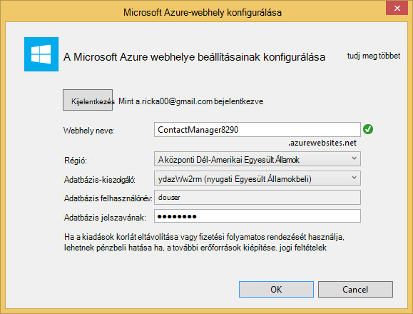
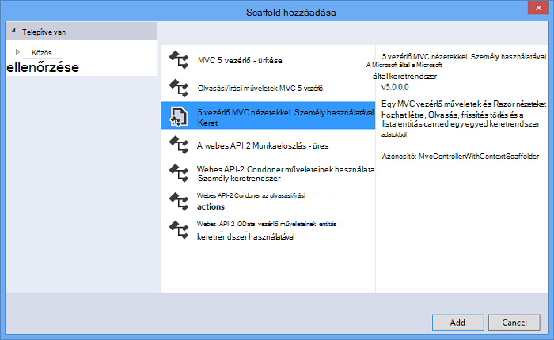

<properties 
    pageTitle="A többi szolgáltatás ASP.NET webes API-val és SQL-adatbázis használata Azure alkalmazás szolgáltatás hozzon létre" 
    description="Ez az oktatóanyagot útmutatást ad meg, amely a ASP.NET webes API-t használja az Azure web App alkalmazásban a Visual Studio segítségével alkalmazás telepítése." 
    services="app-service\web" 
    documentationCenter=".net" 
    authors="Rick-Anderson" 
    writer="Rick-Anderson" 
    manager="wpickett" 
    editor=""/>

<tags 
    ms.service="app-service-web" 
    ms.workload="web" 
    ms.tgt_pltfrm="na" 
    ms.devlang="dotnet" 
    ms.topic="article" 
    ms.date="02/29/2016" 
    ms.author="riande"/>

# A többi szolgáltatás ASP.NET webes API-val és SQL-adatbázis használata Azure alkalmazás szolgáltatás hozzon létre

Ebből az oktatóanyagból megtudhatja, hogy miként az [Azure alkalmazás szolgáltatás](http://go.microsoft.com/fwlink/?LinkId=529714) ASP.NET webes alkalmazás telepítése a varázslóval webhely közzététele a Visual Studio 2013 vagy a Visual Studio 2013 közösségi Edition. 

Azure-fiók ingyenesen nyit meg, és ha még nem rendelkezik a Visual Studio 2013, a SDK automatikusan telepíti a Visual Studio 2013 Web Express. Elindíthatja úgy teljesen Azure szabad fejlesztésének.

Ebben az oktatóanyagban feltételezi, hogy nincs semmilyen előzetes használatában Azure. Ebben az oktatóanyagban befejezése, a is be egyszerű webalkalmazást és futtatása a felhőben.
 
Dióhéjban:

* Hogyan engedélyezhető az Azure fejlesztési a gép az Azure SDK telepítésével.
* Hogyan lehet a Visual Studio ASP.NET MVC 5 projekt létrehozása és közzététele a az Azure-alkalmazásokban.
* Hogyan használhatók az ASP.NET webes API ahhoz, hogy Restful API-hívások.
* Hogyan lehet Azure-ban tárolja az adatokat egy SQL-adatbázis használatával.
* Azure frissítések, hogy miként teheti közzé alkalmazást.

ASP.NET MVC 5 épül, és használja az ADO.NET entitás keretrendszer adatbázis az access egyszerű névjegylista webalkalmazás fogja összeállítása. Az alábbi ábrán látható a teljes alkalmazást:

![Képernyőkép a webhelyen][intro001]

<!-- the next line produces the "Set up the development environment" section as see at http://azure.microsoft.com/documentation/articles/web-sites-dotnet-get-started/ -->
[AZURE.INCLUDE [create-account-and-websites-note](../../includes/create-account-and-websites-note.md)]

### A projekt létrehozása

1. Indítsa el a Visual Studio 2013.
1. Kattintson a **fájl** menü **Új projektet**.
3. **Új projekt** párbeszédpanelen bontsa ki a **képi C#** , és jelölje be a **webes** lehetőséget, és válassza a **ASP.NET webalkalmazást**. Nevezze el az alkalmazás **ContactManager** , és kattintson az **OK gombra**.

    

1. **Új ASP.NET projekt** párbeszédpanelen válassza ki a **MVC** sablont, jelölje be a **Webes API** lehetőséget, és válassza a **Módosítás hitelesítési**.

1. **Hitelesítés módosítása** párbeszédpanelen válassza a **Nincs hitelesítés**, és kattintson **az OK**gombra.

    

    A minta alkalmazás készít felhasználónak bejelentkezés funkciói nem lesz. Hitelesítési és engedélyezési lehetőségek megvalósításáról információt a [Következő lépések](#nextsteps) című Ez az oktatóanyag végén. 

1. **Új ASP.NET projekt** párbeszédpanelen ellenőrizze, hogy a **Host a felhőben** be van jelölve, és kattintson az **OK gombra**.

Ha van nem korábban bejelentkezve Azure, a rendszer kéri, jelentkezzen be a.

1. A Fiókkonfiguráló varázslót javasol egy egyedi nevet a *ContactManager* alapján (lásd az alábbi képen). Jelölje ki a régió közelében. Az időtartam legalacsonyabb adatközpont keresése [azurespeed.com](http://www.azurespeed.com/ "AzureSpeed.com") segítségével. 
2. Adatbázis-kiszolgálóval előtt eddig nem hozott létre, ha a jelölje ki az **Új kiszolgáló létrehozása**, adja meg az adatbázis felhasználónevet és jelszót.

    

Ha egy adatbázis-kiszolgálóval rendelkezik, használata, hozzon létre új adatbázist. Adatbázis-kiszolgálók értékes erőforrás, és hozhat létre több adatbázis ugyanarra a kiszolgálóra, tesztelése és fejlesztési helyett az adatbázis-kiszolgálóval adatbázisonként létrehozása általában szeretne. Győződjön meg arról a webhely és egy adatbázis ugyanabban a régióban.

### A lap élőfej és élőláb beállítása

1. A **Megoldás Explorer**bontsa ki a *Views\Shared* mappát, és nyissa meg a *_Layout.cshtml* fájlt.

    ![A megoldás Intézőben _Layout.cshtml][newapp004]

1. A *Views\Shared_Layout.cshtml* fájl tartalmának cserélje ki a következő kódot:

        <!DOCTYPE html>
        <html lang="en">
        <head>
            <meta charset="utf-8" />
            <title>@ViewBag.Title - Contact Manager</title>
            <link href="~/favicon.ico" rel="shortcut icon" type="image/x-icon" />
            <meta name="viewport" content="width=device-width" />
            @Styles.Render("~/Content/css")
            @Scripts.Render("~/bundles/modernizr")
        </head>
        <body>
            <header>
                

                    

                        
@Html.ActionLink("Contact Manager", "Index", "Home")

                    

                

            </header>
            

                @RenderSection("featured", required: false)
                <section class="content-wrapper main-content clear-fix">
                    @RenderBody()
                </section>
            

            <footer>
                

                    

                        
&copy; @DateTime.Now.Year - Contact Manager

                    

                

            </footer>
            @Scripts.Render("~/bundles/jquery")
            @RenderSection("scripts", required: false)
        </body>
        </html>
            
A fenti korrektúrát változik az alkalmazás nevét a "Contact Manager" a "Saját ASP.NET alkalmazás", és a **Kezdőlap fülre**, és mutató hivatkozásokat **kapcsolatos** **partner**eltávolítja.

### Az alkalmazás futtatásához helyi meghajtóra

1. Nyomja le a CTRL + F5 az alkalmazásnak a futtatására.
Az alapértelmezett böngésző megjelenik az alkalmazás kezdőlap lapján.
    

Ez az összes kell tennie az alkalmazást, telepítenie kell az Azure létrehozása most. Adatbázis-funkciókat később fogja ad.

## Az Azure alkalmazás telepítése

1. A Visual Studióban kattintson a jobb gombbal a projekt a **Megoldást Intézőben** és a helyi menüből válassza a **Közzététel** .

    ![Közzététele a project helyi menüje][PublishVSSolution]

    A **Webhely közzététele** varázsló elindul.

12. Kattintson a **Közzététel**gombra.

Visual Studio kezdi el a fájlok másolása az Azure-kiszolgálóhoz. A **kimeneti** ablakban telepítési műveletek készítésének látható, és a telepítés sikeres befejezésétől jelentések.

14. Az alapértelmezett böngésző automatikusan megnyitja a telepített webhelynek az URL-címet.

    A létrehozott alkalmazás most már fut a felhőben.
    
    ![Azure-ban futó teendőlista kezdőlapra][rxz2]

## Az alkalmazás-adatbázis hozzáadása

Ezután az MVC alkalmazás megjelenítése és módosítása a partnerek és tárolja az adatokat az adatbázisban a támogatni fogja frissítenie. Az alkalmazás fogja használni a entitás keretrendszer az adatbázis létrehozása és olvasása és frissítése az adatbázisban tárolt adatokat.

### A partnerek adatait modell osztályok hozzáadása

Kezdje el a kód egy egyszerű adatmodell létrehozásával.

1. A **Megoldás Explorer**kattintson a jobb gombbal a modellek mappát, kattintson a **Hozzáadás gombra**, majd az **osztály**.

    ![Class felvétele a modellek mappa helyi menüje][adddb001]

2. **Új elem hozzáadása** párbeszédpanelen nevezze el az új osztályfájl *Contact.cs*, és kattintson a **Hozzáadás**gombra.

    ![Adja hozzá az új elem párbeszédpanel][adddb002]

3. Cserélje le a Contacts.cs fájl tartalmát a következő kódot.

        using System.Globalization;
        namespace ContactManager.Models
        {
            public class Contact
            {
                public int ContactId { get; set; }
                public string Name { get; set; }
                public string Address { get; set; }
                public string City { get; set; }
                public string State { get; set; }
                public string Zip { get; set; }
                public string Email { get; set; }
                public string Twitter { get; set; }
                public string Self
                {
                    get { return string.Format(CultureInfo.CurrentCulture,
                         "api/contacts/{0}", this.ContactId); }
                    set { }
                }
            }
        }

A **partner** osztály határozza meg az adatokat, amely az egyes partnerek, valamint az elsődleges kulcs ContactID, az adatbázis szükséges tárolni fogja. Ez az oktatóanyag végén elérheti adatmodellek további információt a [Következő lépések](#nextsteps) szakaszában.

### Lehetővé tevő alkalmazás a névjegyek használata a weblapok létrehozása

A ASP.NET MVC a állványon funkció automatikusan létrehozhat kódot, amely hajt végre létrehozása, olvasása, frissítése és törlése (CRUD) műveletek.

## A vezérlő és az adatok a nézet hozzáadása

1. **Megoldás Explorer**bontsa ki a vezérlők mappát.

3. Építse fel a projektet **(Ctrl + Shift + B)**. (Kell létrehozni a project állványon mechanizmusa használata előtt.) 

4. Kattintson a jobb gombbal a vezérlők mappát, és kattintson a **Hozzáadás**gombra, és válassza a **vezérlő**.

    ![Vezérlő hozzáadása a vezérlők mappa helyi menüje][addcode001]

1. **Scaffold hozzáadása** párbeszédpanelen jelölje ki a **MVC vezérlő entitás keretrendszer használatával nézetekkel** , és kattintson a **Hozzáadás**gombra.

 

6. Állítsa a vezérlő neve **HomeController**. Jelölje ki a **partnert** , az modell osztályához. Kattintson az **Új adatkörnyezet** gombra, és fogadja el az alapértelmezett "ContactManager.Models.ContactManagerContext" az **Új adattípus környezetben**. Kattintson a **hozzáadása**gombra.

    Egy párbeszédpanel kérni fogja: "nevű fájl HomeController már létezik ilyen. Meg szeretné cserélni? ". Kattintson az **Igen**gombra. Azt is felülírása az otthoni vezérlő, amely az új projekt készült. A kapcsolatok listáját az új otthoni vezérlő fogjuk használni.

    Visual Studio a vezérlő módszerek és nézetek CRUD adatbázis-műveletekhez **partner** objektumok hoz létre.

## Áttelepítés engedélyezése, az adatbázis létrehozása, és adja meg a mintaadatokat, és egy adatok inicializálója ##

A [Kód első áttelepítések](http://curah.microsoft.com/55220) szolgáltatás engedélyezéséhez az adatbázis alapján létrehozott adatmodell létrehozásához, akkor a következő feladatot.

1. Az **eszközök** menü válassza a **Tár csomag Manager** , majd a **Csomag kezelője konzol**.

    ![Az Eszközök menü csomag Manager konzolon][addcode008]

2. A **Csomag kezelője konzol** ablakban adja meg a következő parancsot:

        enable-migrations 
  
    Az **enable-áttelepítések** parancs mappát hoz létre *áttelepítések* és helyezi el a mappába való áttelepítés konfigurálása szerkesztheti *Configuration.cs* fájl. 

2. A **Csomag kezelője konzol** ablakban adja meg a következő parancsot:

        add-migration Initial

    A **kezdeti - áttelepítés** parancs generál nevű osztály ** &lt;date_stamp&gt;kezdeti** , hogy létrehozza az adatbázist. Az első ( *kezdeti* ) paraméter tetszőleges és használt hozhat létre a fájl nevét. Megjelenik az új osztály fájlokat a **Megoldást Intézőben**.

    Az **első** osztályban a **felfelé** módszerrel hoz létre, a névjegyek táblázat, és a **le** módszerét (Ha meg szeretné térjen vissza az előző állapot) beilleszti azt.

3. Nyissa meg a *Migrations\Configuration.cs* fájlt. 

4. Adja hozzá a következő névtér. 

         using ContactManager.Models;

5. A *rendező* módszer cserélje ki a következő kódot:
        
        protected override void Seed(ContactManager.Models.ContactManagerContext context)
        {
            context.Contacts.AddOrUpdate(p => p.Name,
               new Contact
               {
                   Name = "Debra Garcia",
                   Address = "1234 Main St",
                   City = "Redmond",
                   State = "WA",
                   Zip = "10999",
                   Email = "debra@example.com",
                   Twitter = "debra_example"
               },
                new Contact
                {
                    Name = "Thorsten Weinrich",
                    Address = "5678 1st Ave W",
                    City = "Redmond",
                    State = "WA",
                    Zip = "10999",
                    Email = "thorsten@example.com",
                    Twitter = "thorsten_example"
                },
                new Contact
                {
                    Name = "Yuhong Li",
                    Address = "9012 State st",
                    City = "Redmond",
                    State = "WA",
                    Zip = "10999",
                    Email = "yuhong@example.com",
                    Twitter = "yuhong_example"
                },
                new Contact
                {
                    Name = "Jon Orton",
                    Address = "3456 Maple St",
                    City = "Redmond",
                    State = "WA",
                    Zip = "10999",
                    Email = "jon@example.com",
                    Twitter = "jon_example"
                },
                new Contact
                {
                    Name = "Diliana Alexieva-Bosseva",
                    Address = "7890 2nd Ave E",
                    City = "Redmond",
                    State = "WA",
                    Zip = "10999",
                    Email = "diliana@example.com",
                    Twitter = "diliana_example"
                }
                );
        }

    A fenti kód elindítja a partnerek adatait az adatbázist. Az adatbázis rendezi kapcsolatos további tudnivalókért olvassa el a [hibakeresési entitás keretrendszer (EF) adatbázisok](http://blogs.msdn.com/b/rickandy/archive/2013/02/12/seeding-and-debugging-entity-framework-ef-dbs.aspx)című témakört.

1. A **Csomag kezelője konzol** írja be a parancsot:

        update-database

    ![Csomag Manager konzol parancsai][addcode009]

    Az **adatbázis frissítése** fut, az első áttelepítés, amelyhez létrehozza az adatbázist. Alapértelmezés szerint az adatbázis SQL Server Express LocalDB adatbázis jön létre.

1. Nyomja le a CTRL + F5 az alkalmazásnak a futtatására. 

Az alkalmazás a rendező adatokat, illetve a szerkesztést, a részletek és a törlés hivatkozást tartalmaz.

![Az adatok MVC megtekintése][rxz3]

## A nézet szerkesztése

1. Nyissa meg a *Views\Home\Index.cshtml* fájlt. A következő lépésben a létrehozott korrektúrát felülírja azt [jQuery](http://jquery.com/) és [Knockout.js](http://knockoutjs.com/)használó kódot. Az új kód a partnerlistában használata a webes API-val és a JSON és az majd köti a kapcsolattartási adatok a felhasználói felület knockout.js használatával. További információ a [Következő lépések](#nextsteps) című Ez az oktatóanyag végén. 

2. Cserélje ki a fájl tartalmát a következő kódot.

        @model IEnumerable<ContactManager.Models.Contact>
        @{
            ViewBag.Title = "Home";
        }
        @section Scripts {
            @Scripts.Render("~/bundles/knockout")
            
        }
        <ul id="contacts" data-bind="foreach: contacts">
            <li class="ui-widget-content ui-corner-all">
                <h1 data-bind="text: Name" class="ui-widget-header"></h1>
                

                

                    ,
                    
                    
                

                

                
Email?

                

                
Twitter?

                
<a data-bind="attr: { href: Self }, click: $root.removeContact" class="removeContact ui-state-default ui-corner-all">Remove</a>

            </li>
        </ul>
        <form id="addContact" data-bind="submit: addContact">
            <fieldset>
                <legend>Add New Contact</legend>
                <ol>
                    <li>
                        <label for="Name">Name</label>
                        <input type="text" name="Name" />
                    </li>
                    <li>
                        <label for="Address">Address</label>
                        <input type="text" name="Address" >
                    </li>
                    <li>
                        <label for="City">City</label>
                        <input type="text" name="City" />
                    </li>
                    <li>
                        <label for="State">State</label>
                        <input type="text" name="State" />
                    </li>
                    <li>
                        <label for="Zip">Zip</label>
                        <input type="text" name="Zip" />
                    </li>
                    <li>
                        <label for="Email">E-mail</label>
                        <input type="text" name="Email" />
                    </li>
                    <li>
                        <label for="Twitter">Twitter</label>
                        <input type="text" name="Twitter" />
                    </li>
                </ol>
                <input type="submit" value="Add" />
            </fieldset>
        </form>

3. Kattintson a jobb gombbal a tartalom mappát, és kattintson a **Hozzáadás**gombra, és kattintson az **Új elem...**.

    ![Stíluslap hozzáadása a tartalom mappa helyi menüje][addcode005]

4. **Új elem hozzáadása** párbeszédpanelen a felső jobb oldali Keresés mezőbe írja be a **stílust** , és válassza a **Stíluslap gombra**.
    ![Adja hozzá az új elem párbeszédpanel][rxStyle]

5. A fájl *Contacts.css* nevét, és kattintson a **Hozzáadás**gombra. Cserélje ki a fájl tartalmát a következő kódot.
    
        .column {
            float: left;
            width: 50%;
            padding: 0;
            margin: 5px 0;
        }
        form ol {
            list-style-type: none;
            padding: 0;
            margin: 0;
        }
        form li {
            padding: 1px;
            margin: 3px;
        }
        form input[type="text"] {
            width: 100%;
        }
        #addContact {
            width: 300px;
            float: left;
            width:30%;
        }
        #contacts {
            list-style-type: none;
            margin: 0;
            padding: 0;
            float:left;
            width: 70%;
        }
        #contacts li {
            margin: 3px 3px 3px 0;
            padding: 1px;
            float: left;
            width: 300px;
            text-align: center;
            background-image: none;
            background-color: #F5F5F5;
        }
        #contacts li h1
        {
            padding: 0;
            margin: 0;
            background-image: none;
            background-color: Orange;
            color: White;
            font-family: Trebuchet MS, Tahoma, Verdana, Arial, sans-serif;
        }
        .removeContact, .viewImage
        {
            padding: 3px;
            text-decoration: none;
        }

    A stíluslap elrendezés, színek és a Névjegykártya-kezelő alkalmazásban használt stílusok fogjuk használni.

6. Nyissa meg a *App_Start\BundleConfig.cs* fájlt.

7. Adja hozzá a következő kódot regisztrálhatja a [kiejtést](http://knockoutjs.com/index.html "KO") bővítményt.

        bundles.Add(new ScriptBundle("~/bundles/knockout").Include(
                    "~/Scripts/knockout-{version}.js"));
    Ez a példa kiejtést segítségével kezeli a képernyő-sablonok dinamikus JavaScript-kód egyszerűsítése érdekében.

8. A tartalom vagy css-bejegyzés regisztrálhatja a *contacts.css* stíluslap módosítása. Módosítsa a következő parancsot:

                 bundles.Add(new StyleBundle("~/Content/css").Include(
                   "~/Content/bootstrap.css",
                   "~/Content/site.css"));
A:

        bundles.Add(new StyleBundle("~/Content/css").Include(
                   "~/Content/bootstrap.css",
                   "~/Content/contacts.css",
                   "~/Content/site.css"));

1. A csomag Manager konzolban, futtassa a következő parancsot a kiejtést telepítéséhez.

        Install-Package knockoutjs

## A webes API Restful felületén a vezérlő hozzáadása

1. A **Megoldás Intéző**kattintson a jobb gombbal a vezérlők, és kattintson a **Hozzáadás gombra** , majd a **vezérlő...** 

1. **Scaffold hozzáadása** párbeszédpanelen írja be a **Webes API 2 vezérlő műveleteinek entitás keretrendszer használatával** , és kattintson a **Hozzáadás**gombra.

    

4. A **Vezérlő hozzáadása** párbeszédpanelen írja be a vezérlő neve "ContactsController". Jelölje ki a "Partnert (ContactManager.Models)" a **modell osztályához**.  Az alapértelmezett érték tartani az **adatokat helyi osztály**. 

6. Kattintson a **hozzáadása**gombra.

### Az alkalmazás futtatásához helyi meghajtóra

1. Nyomja le a CTRL + F5 az alkalmazásnak a futtatására.

    ![Index lap][intro001]

2. Írja be a partner, és kattintson a **Hozzáadás**gombra. Az alkalmazás a kezdőlapra pedig megjeleníti a partnert, a megadott.

    ![A teendősáv listaelemek index lap][addwebapi004]

3. Az URL-cím **/api/contacts** hozzáfűzése a böngészőben.

    Az eredményül kapott URL-cím http://localhost:1234/api/partnerek hasonló: A felvett RESTful webes API tárolt névjegyeket adja eredményül. A Firefox, Chrome és jelennek meg az adatokat XML formátumban.

    ![A teendősáv listaelemek index lap][rxFFchrome]
    

    IE megkérdezi, hogy megnyitni vagy menteni kívánja a névjegyeket.

    ![Webes API mentése párbeszédpanel][addwebapi006]
    
    
    A visszaadott névjegyek megnyithatja a Jegyzettömbben vagy a böngészőben.
    
    A kimenet egy másik alkalmazást, például a mobil weblap vagy alkalmazás által igénybe vehető.

    ![Webes API mentése párbeszédpanel][addwebapi007]

    **Biztonsági figyelmeztetés**: ezen a ponton, az alkalmazás pedig nem biztonságos CSRF homonimaszerű webcímmel érinti. Az oktatóprogram a rés törli azt. További információt talál [megakadályozása Webhelyközi kérése hamisítása (CSRF) támadásokat][prevent-csrf-attacks].
## XSRF védelme

A webhelyközi kérelem hamisítása (más néven XSRF vagy CSRF) támadások elleni webes által üzemeltetett alkalmazások, amellyel rosszindulatú webhely befolyásolhatja a ügyfél böngészőben és a webhely, hogy a böngésző megbízható közötti kölcsönhatás. Ezek a támadásokkal lehetséges történik, mert böngészők hitelesítési tokenek automatikusan az összes kérést küld egy webhely. A kanonikus példája egy hitelesítési cookie, például ASP. A nettó űrlapok hitelesítési jegy. Bármely állandó hitelesítési módszer (például a Windows-hitelesítés, Basic és így tovább) használó webhelyekre célzott is ezek támadások szerint.

Egy XSRF homonimaszerű webcímmel egy adathalászat homonimaszerű webcímmel különbözik. Adathalászati célú támadásokkal közreműködése az áldozat a. A adathalászat támadások rosszindulatú webhely fog imitálása a cél webhelyet, és az áldozat magát az becsapni azokat a bizalmas információkat biztosító az irányítást. Az egy XSRF támadások van gyakran beavatkozás nélküli az áldozat szükséges. A támadó inkább a böngészőben, automatikusan elküldeni a megfelelő cookie-k használata a célként megadott webhelyet használna.

További tudnivalókért lásd: a [Webes alkalmazás biztonsági megnyitott projekt](https://www.owasp.org/index.php/Main_Page) (OWASP) [XSRF](https://www.owasp.org/index.php/Cross-Site_Request_Forgery_(CSRF)).

1. **Megoldás Explorer** **ContactManager** project jobb és kattintson a **Hozzáadás** lehetőséget, és válassza a **osztály**.

2. A fájl *ValidateHttpAntiForgeryTokenAttribute.cs* nevét, és adja hozzá a következő kódot:

        using System;
        using System.Collections.Generic;
        using System.Linq;
        using System.Net;
        using System.Net.Http;
        using System.Web.Helpers;
        using System.Web.Http.Controllers;
        using System.Web.Http.Filters;
        using System.Web.Mvc;
        namespace ContactManager.Filters
        {
            public class ValidateHttpAntiForgeryTokenAttribute : AuthorizationFilterAttribute
            {
                public override void OnAuthorization(HttpActionContext actionContext)
                {
                    HttpRequestMessage request = actionContext.ControllerContext.Request;
                    try
                    {
                        if (IsAjaxRequest(request))
                        {
                            ValidateRequestHeader(request);
                        }
                        else
                        {
                            AntiForgery.Validate();
                        }
                    }
                    catch (HttpAntiForgeryException e)
                    {
                        actionContext.Response = request.CreateErrorResponse(HttpStatusCode.Forbidden, e);
                    }
                }
                private bool IsAjaxRequest(HttpRequestMessage request)
                {
                    IEnumerable<string> xRequestedWithHeaders;
                    if (request.Headers.TryGetValues("X-Requested-With", out xRequestedWithHeaders))
                    {
                        string headerValue = xRequestedWithHeaders.FirstOrDefault();
                        if (!String.IsNullOrEmpty(headerValue))
                        {
                            return String.Equals(headerValue, "XMLHttpRequest", StringComparison.OrdinalIgnoreCase);
                        }
                    }
                    return false;
                }
                private void ValidateRequestHeader(HttpRequestMessage request)
                {
                    string cookieToken = String.Empty;
                    string formToken = String.Empty;
                    IEnumerable<string> tokenHeaders;
                    if (request.Headers.TryGetValues("RequestVerificationToken", out tokenHeaders))
                    {
                        string tokenValue = tokenHeaders.FirstOrDefault();
                        if (!String.IsNullOrEmpty(tokenValue))
                        {
                            string[] tokens = tokenValue.Split(':');
                            if (tokens.Length == 2)
                            {
                                cookieToken = tokens[0].Trim();
                                formToken = tokens[1].Trim();
                            }
                        }
                    }
                    AntiForgery.Validate(cookieToken, formToken);
                }
            }
        }

1. Az alábbi *használatával* utasítás hozzáadása a szerződéseket vezérlő, hogy hozzáférhessen a **[ValidateHttpAntiForgeryToken]** attribútumhoz.

        using ContactManager.Filters;

1. A **[ValidateHttpAntiForgeryToken]** attribútum hozzáadása a **ContactsController** megvédését a XSRF veszélyek bejegyzés módszereket. A "PutContact", "PostContact" és **DeleteContact** művelet módszerekkel hozzáadja.

        [ValidateHttpAntiForgeryToken]
            public IHttpActionResult PutContact(int id, Contact contact)
            {

1. Frissítse a *Views\Home\Index.cshtml* fájl mentését a kód beolvasása a XSRF tokenek *parancsfájl* szakasza.

         @section Scripts {
            @Scripts.Render("~/bundles/knockout")
            
         }

## Azure és SQL-adatbázis közzététele az alkalmazás frissítése

Az alkalmazás közzétenni, ismételje meg az eljárást korábbi követte.

1. A **Megoldás Explorer**kattintson a jobb gombbal a projekt, és válassza a **Közzététel**.

    ![Közzététel][rxP]

5. Kattintson a **Beállítások** fülre.
    

1. A **ContactsManagerContext(ContactsManagerContext)**kattintson a *távoli kapcsolati karakterlánc* helyett a kapcsolati karakterláncot, a kapcsolattartó adatbázis **v** ikonra. Kattintson a **ContactDB**.

    

7. Jelölje be az **Végrehajtása kód első áttelepítések (alkalmazás indításkor fut)**.

1. Kattintson a **Tovább** gombra, és kattintson az **Előnézet**gombra. Visual Studio hozzáadása vagy frissítése megtörtént a fájlok listáját jeleníti meg.

8. Kattintson a **Közzététel**gombra.
A telepítés befejezése után a böngészőben megnyílik a kezdőlapra, az alkalmazás.

    ![Index lapot nem partnerrel][intro001]

    A Visual Studio közzétételi folyamat automatikusan beállítva a kapcsolati karakterlánc *a telepített fájlt, mutasson az SQL-adatbázishoz* . Azt is konfigurálni kód első áttelepítések automatikusan frissíteni az adatbázist a legújabb verzióra az első alkalommal az alkalmazást az adatbázis hozzáfér a telepítés után.

    Ebben a konfigurációban eredményeként kód első hozta létre az adatbázist a kódot, amely a korábban létrehozott **kezdeti** osztálynak futtatásával. Azt jelent ez az első alkalommal az alkalmazás próbálkozott a hozzáférést az adatbázishoz a telepítés után.

9. Partner adja meg, mint az alkalmazás helyi meghajtóra, ellenőrizze, hogy az adatbázis telepítési sikeres futtatásakor.

Ha jelenik meg, hogy a beírt elem menti, és megjelenik a Névjegykártya-kezelő lapon, az azt jelzi, hogy meg van már az adatbázisban tárolt.

![Index lapot a partnerekkel][addwebapi004]

Az alkalmazás letöltése fut a felhőben SQL-adatbázis használata tárolja az adatokat. Miután végzett az alkalmazás tesztelése Azure-ban, törölheti azt. Az alkalmazás nyilvános, és nem tartozik egy mechanizmusa korlátozhatja a hozzáférést.

>[AZURE.NOTE] Ha azt szeretné, mielőtt feliratkozna az Azure-fiók használatbavételéhez Azure alkalmazás szolgáltatás, [Próbálja meg alkalmazás szolgáltatás](http://go.microsoft.com/fwlink/?LinkId=523751), ahol azonnal létrehozhat egy rövid életű starter web app alkalmazás szolgáltatásban megnyitásához. Nem kötelező, hitelkártyák Nincs nyilatkozatát.

## Következő lépések

A valós alkalmazások szükséges hitelesítés és az engedélyezés, és használja a tagság adatbázist erre a célra. Az oktatóprogram [egy biztonságos ASP.NET MVC alkalmazás OAuth, a tagság és az SQL-adatbázis terjesztése](web-sites-dotnet-deploy-aspnet-mvc-app-membership-oauth-sql-database.md) ebben az oktatóanyagban alapul, és szemlélteti, hogyan lehet telepíteni a tagság adatbázissal webalkalmazás.

Úgy is, hogy tárolja az adatokat az Azure alkalmazásokban környezetbe Azure tárolására, nem relációs adatok tárolására BLOB és táblázatok formájában rendelkeznek. Az alábbi hivatkozások további információt a webes API, ASP.NET MVC és Azure ablakban adja meg.
 

* [Személy keretrendszer MVC használata – első lépések][EFCodeFirstMVCTutorial]
* [Bevezetés az ASP.NET MVC 5 használatába](http://www.asp.net/mvc/tutorials/mvc-5/introduction/getting-started)
* [Az első ASP.NET webes API](http://www.asp.net/web-api/overview/getting-started-with-aspnet-web-api/tutorial-your-first-web-api)
* [Hibakeresési WAWS](web-sites-dotnet-troubleshoot-visual-studio.md)

Ebben az oktatóanyagban és a minta alkalmazás által [Rich Anderson](http://blogs.msdn.com/b/rickandy/) készült (Twitter [@RickAndMSFT](https://twitter.com/RickAndMSFT)) Tom Budai és Barry Dorrans segítséget (Twitter [@blowdart](https://twitter.com/blowdart)). 

Kérjük, amelyeket kedvelnek vagy mi szeretné látni, hogy szabadságra visszajelzések elérését, nemcsak az oktatóprogram magát kapcsolatban, hanem a termékekről, amely azt mutatja be. A visszajelzés fog segítse a szolgáltatás fontossági javítása. Azt érdeklik különösen ki mennyi van, a tagság adatbázis telepítése és konfigurálása a folyamat további automatizálási kamat találja. 

## Mi változott
* Módosítása egy segédvonalat a webhelyekre alkalmazás szolgáltatáshoz lásd: [Azure alkalmazás szolgáltatás, és a hatás a meglévő Azure-szolgáltatások](http://go.microsoft.com/fwlink/?LinkId=529714)

<!-- bookmarks -->
[Add an OAuth Provider]: #addOauth
[Add Roles to the Membership Database]:#mbrDB
[Create a Data Deployment Script]:#ppd
[Update the Membership Database]:#ppd2
[setupdbenv]: #bkmk_setupdevenv
[setupwindowsazureenv]: #bkmk_setupwindowsazure
[createapplication]: #bkmk_createmvc4app
[deployapp1]: #bkmk_deploytowindowsazure1
[adddb]: #bkmk_addadatabase
[addcontroller]: #bkmk_addcontroller
[addwebapi]: #bkmk_addwebapi
[deploy2]: #bkmk_deploydatabaseupdate

<!-- links -->
[EFCodeFirstMVCTutorial]: http://www.asp.net/mvc/tutorials/getting-started-with-ef-using-mvc/creating-an-entity-framework-data-model-for-an-asp-net-mvc-application
[dbcontext-link]: http://msdn.microsoft.com/library/system.data.entity.dbcontext(v=VS.103).aspx

<!-- images-->
[rxE]: ./media/web-sites-dotnet-rest-service-aspnet-api-sql-database/rxE.png
[rxP]: ./media/web-sites-dotnet-rest-service-aspnet-api-sql-database/rxP.png
[rx22]: ./media/web-sites-dotnet-rest-service-aspnet-api-sql-database/
[rxb2]: ./media/web-sites-dotnet-rest-service-aspnet-api-sql-database/rxb2.png
[rxz]: ./media/web-sites-dotnet-rest-service-aspnet-api-sql-database/rxz.png
[rxzz]: ./media/web-sites-dotnet-rest-service-aspnet-api-sql-database/rxzz.png
[rxz2]: ./media/web-sites-dotnet-rest-service-aspnet-api-sql-database/rxz2.png
[rxz3]: ./media/web-sites-dotnet-rest-service-aspnet-api-sql-database/rxz3.png
[rxStyle]: ./media/web-sites-dotnet-rest-service-aspnet-api-sql-database/rxStyle.png
[rxz4]: ./media/web-sites-dotnet-rest-service-aspnet-api-sql-database/rxz4.png
[rxz44]: ./media/web-sites-dotnet-rest-service-aspnet-api-sql-database/rxz44.png
[rxNewCtx]: ./media/web-sites-dotnet-rest-service-aspnet-api-sql-database/rxNewCtx.png
[rxPrevDB]: ./media/web-sites-dotnet-rest-service-aspnet-api-sql-database/rxPrevDB.png
[rxOverwrite]: ./media/web-sites-dotnet-rest-service-aspnet-api-sql-database/rxOverwrite.png
[rxPWS]: ./media/web-sites-dotnet-rest-service-aspnet-api-sql-database/rxPWS.png
[rxNewCtx]: ./media/web-sites-dotnet-rest-service-aspnet-api-sql-database/rxNewCtx.png
[rxAddApiController]: ./media/web-sites-dotnet-rest-service-aspnet-api-sql-database/rxAddApiController.png
[rxFFchrome]: ./media/web-sites-dotnet-rest-service-aspnet-api-sql-database/rxFFchrome.png
[intro001]: ./media/web-sites-dotnet-rest-service-aspnet-api-sql-database/dntutmobil-intro-finished-web-app.png
[rxCreateWSwithDB]: ./media/web-sites-dotnet-rest-service-aspnet-api-sql-database/rxCreateWSwithDB.png
[setup007]: ./media/web-sites-dotnet-rest-service-aspnet-api-sql-database/dntutmobile-setup-azure-site-004.png
[setup009]: ../Media/dntutmobile-setup-azure-site-006.png
[newapp002]: ./media/web-sites-dotnet-rest-service-aspnet-api-sql-database/dntutmobile-createapp-002.png
[newapp004]: ./media/web-sites-dotnet-rest-service-aspnet-api-sql-database/dntutmobile-createapp-004.png
[firsdeploy007]: ./media/web-sites-dotnet-rest-service-aspnet-api-sql-database/dntutmobile-deploy1-publish-005.png
[firsdeploy009]: ./media/web-sites-dotnet-rest-service-aspnet-api-sql-database/dntutmobile-deploy1-publish-007.png
[adddb001]: ./media/web-sites-dotnet-rest-service-aspnet-api-sql-database/dntutmobile-adddatabase-001.png
[adddb002]: ./media/web-sites-dotnet-rest-service-aspnet-api-sql-database/dntutmobile-adddatabase-002.png
[addcode001]: ./media/web-sites-dotnet-rest-service-aspnet-api-sql-database/dntutmobile-controller-add-context-menu.png
[addcode002]: ./media/web-sites-dotnet-rest-service-aspnet-api-sql-database/dntutmobile-controller-add-controller-dialog.png
[addcode004]: ./media/web-sites-dotnet-rest-service-aspnet-api-sql-database/dntutmobile-controller-modify-index-context.png
[addcode005]: ./media/web-sites-dotnet-rest-service-aspnet-api-sql-database/dntutmobile-controller-add-contents-context-menu.png
[addcode007]: ./media/web-sites-dotnet-rest-service-aspnet-api-sql-database/dntutmobile-controller-modify-bundleconfig-context.png
[addcode008]: ./media/web-sites-dotnet-rest-service-aspnet-api-sql-database/dntutmobile-migrations-package-manager-menu.png
[addcode009]: ./media/web-sites-dotnet-rest-service-aspnet-api-sql-database/dntutmobile-migrations-package-manager-console.png
[addwebapi004]: ./media/web-sites-dotnet-rest-service-aspnet-api-sql-database/dntutmobile-webapi-added-contact.png
[addwebapi006]: ./media/web-sites-dotnet-rest-service-aspnet-api-sql-database/dntutmobile-webapi-save-returned-contacts.png
[addwebapi007]: ./media/web-sites-dotnet-rest-service-aspnet-api-sql-database/dntutmobile-webapi-contacts-in-notepad.png
[Add XSRF Protection]: #xsrf
[WebPIAzureSdk20NetVS12]: ./media/web-sites-dotnet-rest-service-aspnet-api-sql-database/WebPIAzureSdk20NetVS12.png
[Add XSRF Protection]: #xsrf
[ImportPublishSettings]: ./media/web-sites-dotnet-rest-service-aspnet-api-sql-database/ImportPublishSettings.png
[ImportPublishProfile]: ./media/web-sites-dotnet-rest-service-aspnet-api-sql-database/ImportPublishProfile.png
[PublishVSSolution]: ./media/web-sites-dotnet-rest-service-aspnet-api-sql-database/PublishVSSolution.png
[ValidateConnection]: ./media/web-sites-dotnet-rest-service-aspnet-api-sql-database/ValidateConnection.png
[WebPIAzureSdk20NetVS12]: ./media/web-sites-dotnet-rest-service-aspnet-api-sql-database/WebPIAzureSdk20NetVS12.png
[prevent-csrf-attacks]: http://www.asp.net/web-api/overview/security/preventing-cross-site-request-forgery-(csrf)-attacks
 
