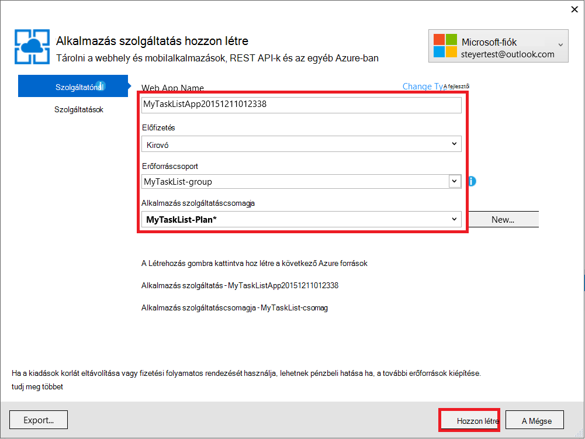
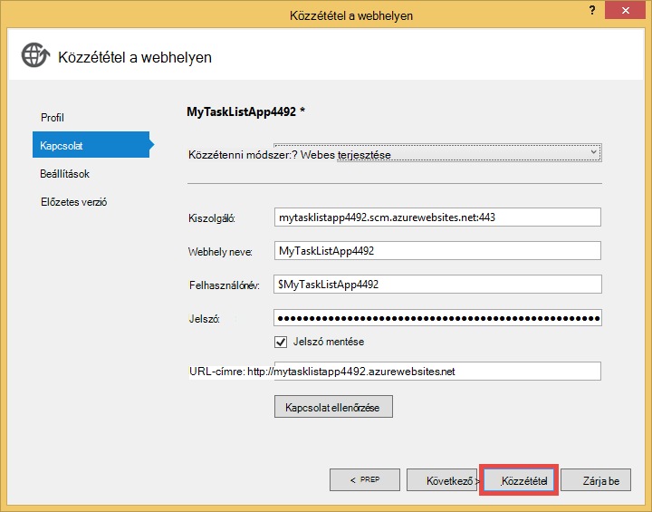

<properties 
    pageTitle="Egy webalkalmazás létrehozása az Azure virtuális gépen futó MongoDB kapcsolódó" 
    description="Egy oktatóprogram, hogy mely számjegy használata ASP.NET-alkalmazás terjesztése Azure alkalmazás szolgáltatás útmutatást ad meg az Azure virtuális gép MongoDB csatlakozik."
    tags="azure-portal" 
    services="app-service\web, virtual-machines" 
    documentationCenter=".net" 
    authors="cephalin" 
    manager="wpickett" 
    editor=""/>

<tags 
    ms.service="app-service-web" 
    ms.workload="web" 
    ms.tgt_pltfrm="na" 
    ms.devlang="dotnet" 
    ms.topic="article" 
    ms.date="02/29/2016" 
    ms.author="cephalin"/>

# Egy webalkalmazás létrehozása az Azure virtuális gépen futó MongoDB kapcsolódó

Mely számjegy használ, Azure alkalmazás szolgáltatás Web Apps alkalmazások ASP.NET alkalmazások telepítése. Ebben az oktatóprogramban egy egyszerű előtér ASP.NET MVC az Azure virtuális gépen futó MongoDB adatbázishoz kapcsolódó tevékenység lista alkalmazás fog összeállítása.  [MongoDB] [ MongoDB] a népszerű Megnyitás, a nagy teljesítményű NoSQL adatbázis van. Fut, és tesztelje a ASP.NET-alkalmazások fejlesztése a számítógépen, miután a az alkalmazás alkalmazás szolgáltatás Web Apps alkalmazások használata a mely számjegy töltse fel.

>[AZURE.NOTE] Ha azt szeretné, mielőtt feliratkozna az Azure-fiók használatbavételéhez Azure alkalmazás szolgáltatás, [Próbálja meg alkalmazás szolgáltatás](http://go.microsoft.com/fwlink/?LinkId=523751), ahol azonnal létrehozhat egy rövid életű starter web app alkalmazás szolgáltatásban megnyitásához. Nem kötelező, hitelkártyák Nincs nyilatkozatát.

## Háttér ismeretek ##

A következő Tudásbázis akkor hasznos, ebben az oktatóanyagban azonban nem kötelező:

* A C# MongoDB illesztőprogramját. Fejlesztett alkalmazások C# MongoDB szemben a további tudnivalókért lásd: a MongoDB [CSharp nyelvi központ][MongoC#LangCenter]. 
* ASP webes alkalmazás keretrendszer. Megismerheti az összes azt az [ASP.net webhely][ASP.NET].
* Az keretrendszer ASP .NET MVC webhelyen. Megismerheti az összes, a [webhely ASP.NET MVC][MVCWebSite].
* Azure. Olvasási [Azure]a kezdéshez[WindowsAzure].

## Előfeltételek ##

- [Visual Studio Express 2013 webes]  [ VSEWeb] vagy [Visual Studio 2013-ban] [VSUlt]
- [Azure SDK a .NET rendszerhez](http://go.microsoft.com/fwlink/p/?linkid=323510&clcid=0x409)
- Az aktív Microsoft Azure-előfizetéssel

[AZURE.INCLUDE [create-account-and-websites-note](../../includes/create-account-and-websites-note.md)]

 
## Hozzon létre egy virtuális gép és MongoDB telepítése ##

Ebben az oktatóanyagban feltételezi, hogy létrehozott Azure virtuális géphez. Miután létrehozta a virtuális gép telepítenie kell ezeket az MongoDB a virtuális gépen:

* Hozzon létre egy Windows virtuális számítógépre, és telepítse a MongoDB, lásd: [MongoDB telepítse az Azure-ban a Windows Server operációs rendszert futtató virtuális gépen][InstallMongoOnWindowsVM].

Miután létrehozta a virtuális gépet Azure-ban, és telepítve van a MongoDB, ne felejtse el a tartománynév a virtuális gép ("testlinuxvm.cloudapp.net", például) és a külső port az, hogy a végpont megadott MongoDB.  Ezt az információt az oktatóprogram később szüksége lesz.

## Az alkalmazás létrehozása ##

Ez a szakasz az úgynevezett "Saját feladatlista" Visual Studio segítségével ASP.NET-alkalmazás létrehozása, és végezze el az Azure alkalmazás szolgáltatás Web Apps alkalmazások kezdeti telepítés. Az alkalmazás helyileg fog futni, de az Azure virtuális számítógépre kapcsolódni, és ott használja az Ön által létrehozott MongoDB példány.

1. A Visual Studióban kattintson az **Új projekt**.

    ![Lap új projekt indítása][StartPageNewProject]

1. Az **Új projekt** ablakában a bal oldali ablaktáblában válassza a **Visual C#**, és válassza a **webhely**. A középső ablaktáblában jelölje ki a **ASP.NET webalkalmazást**. A képernyő alján a projekt "MyTaskListApp" nevet, és kattintson **az OK**gombra.

    ![Az új projekt párbeszédpanel][NewProjectMyTaskListApp]

1. **Új ASP.NET projekt** párbeszédpanelen jelölje be a **MVC**, és kattintson **az OK**gombra.

    ![MVC sablon kiválasztása][VS2013SelectMVCTemplate]

1. Ha még nem jelentkezett be a Microsoft Azure, a rendszer kéri, jelentkezzen be a. Kövesse az útmutatást követve jelentkezzen be az Azure.
2. Ha be van jelentkezve a, indítsa el az alkalmazás szolgáltatás webalkalmazás konfigurálása. Adja meg a **Web App nevét**, az **alkalmazás szolgáltatáscsomagja**, a **erőforráscsoport**és a **régió**, majd kattintson a **Létrehozás**gombra.

    

1. Létrehozás befejezése után a projekt, megvárja, amíg a web app, létre kell hozni Azure alkalmazás szolgáltatás az **Azure alkalmazás szolgáltatási tevékenység** ablakban jelzett. Kattintson a **Közzététel MyTaskListApp most a Web App alkalmazásban**.

1. Kattintson a **Közzététel**gombra.

    

    Az alapértelmezett ASP.NET alkalmazás Azure alkalmazás szolgáltatás Web Apps alkalmazások van közzétéve, miután elindult a böngésző történik.

## A MongoDB C# illesztőprogram telepítése

MongoDB C# alkalmazások keresztül a helyi fejlesztési számítógépen telepíteni kell illesztőprogram ügyféloldali támogatása kínál. A C# illesztőprogram NuGet keresztül érhető el.

MongoDB C# illesztőprogram telepítése:

1. A **Megoldás Explorer**kattintson a jobb gombbal a **MyTaskListApp** projekt, és válassza a **NuGetPackages kezelése**.

    ![NuGet csomagok kezelése][VS2013ManageNuGetPackages]

2. A **NuGet csomagok kezelése** ablakban, a bal oldali ablaktáblában kattintson az **Online**elemre. A jobb oldalon lévő **Online keresés** mezőbe írja be a "mongodb.driver".  Kattintson a **telepítse** a illesztőprogram telepítése elemre.

    ![Keresés MongoDB C# illesztőprogram][SearchforMongoDBCSharpDriver]

3. Kattintson az **Elfogadás lehet** a 10gen, Inc. licencfeltételek elfogadása.

4. Miután telepített a vezető, kattintson a **Bezárás** gombra.
    ![MongoDB C# illesztőprogram][MongoDBCsharpDriverInstalled]

A MongoDB C# illesztőprogram már telepítve van.  Hivatkozások a **MongoDB.Bson** **MongoDB.Driver**és **MongoDB.Driver.Core** dokumentumtárak van hozzáadva a projekthez.

![Hivatkozások MongoDB C# illesztőprogram][MongoDBCSharpDriverReferences]

## A modell hozzáadása ##
A **Megoldás Explorer**kattintson a jobb gombbal a *modellek* mappát, és a **Hozzáadás** új **osztály** , és *TaskModel.cs*nevet.  Cserélje ki a meglévő kódot *TaskModel.cs*, a következő kódot:

    using System;
    using System.Collections.Generic;
    using System.Linq;
    using System.Web;
    using MongoDB.Bson.Serialization.Attributes;
    using MongoDB.Bson.Serialization.IdGenerators;
    using MongoDB.Bson;
    
    namespace MyTaskListApp.Models
    {
        public class MyTask
        {
            [BsonId(IdGenerator = typeof(CombGuidGenerator))]
            public Guid Id { get; set; }
    
            [BsonElement("Name")]
            public string Name { get; set; }
    
            [BsonElement("Category")]
            public string Category { get; set; }
    
            [BsonElement("Date")]
            public DateTime Date { get; set; }
    
            [BsonElement("CreatedDate")]
            public DateTime CreatedDate { get; set; }
    
        }
    }

## Az adat-hozzáférési réteg hozzáadása ##
A **Megoldás Explorer**kattintson jobb gombbal a *MyTaskListApp* project és a **Hozzáadás** **Új mappa** *DAL*.  Kattintson a jobb gombbal a *DAL* mappát, és a **Hozzáadás** új **osztály**. Az osztály fájl *Dal.cs*nevét.  Cserélje ki a meglévő kódot *Dal.cs*, a következő kódot:

    using System;
    using System.Collections.Generic;
    using System.Linq;
    using System.Web;
    using MyTaskListApp.Models;
    using MongoDB.Driver;
    using MongoDB.Bson;
    using System.Configuration;
    
    
    namespace MyTaskListApp
    {
        public class Dal : IDisposable
        {
            private MongoServer mongoServer = null;
            private bool disposed = false;
    
            // To do: update the connection string with the DNS name
            // or IP address of your server. 
            //For example, "mongodb://testlinux.cloudapp.net"
            private string connectionString = "mongodb://mongodbsrv20151211.cloudapp.net";
    
            // This sample uses a database named "Tasks" and a 
            //collection named "TasksList".  The database and collection 
            //will be automatically created if they don't already exist.
            private string dbName = "Tasks";
            private string collectionName = "TasksList";
    
            // Default constructor.        
            public Dal()
            {
            }
    
            // Gets all Task items from the MongoDB server.        
            public List<MyTask> GetAllTasks()
            {
                try
                {
                    var collection = GetTasksCollection();
                    return collection.Find(new BsonDocument()).ToList();
                }
                catch (MongoConnectionException)
                {
                    return new List<MyTask>();
                }
            }
    
            // Creates a Task and inserts it into the collection in MongoDB.
            public void CreateTask(MyTask task)
            {
                var collection = GetTasksCollectionForEdit();
                try
                {
                    collection.InsertOne(task);
                }
                catch (MongoCommandException ex)
                {
                    string msg = ex.Message;
                }
            }
    
            private IMongoCollection<MyTask> GetTasksCollection()
            {
                MongoClient client = new MongoClient(connectionString);
                var database = client.GetDatabase(dbName);
                var todoTaskCollection = database.GetCollection<MyTask>(collectionName);
                return todoTaskCollection;
            }
    
            private IMongoCollection<MyTask> GetTasksCollectionForEdit()
            {
                MongoClient client = new MongoClient(connectionString);
                var database = client.GetDatabase(dbName);
                var todoTaskCollection = database.GetCollection<MyTask>(collectionName);
                return todoTaskCollection;
            }
    
            # region IDisposable
    
            public void Dispose()
            {
                this.Dispose(true);
                GC.SuppressFinalize(this);
            }
    
            protected virtual void Dispose(bool disposing)
            {
                if (!this.disposed)
                {
                    if (disposing)
                    {
                        if (mongoServer != null)
                        {
                            this.mongoServer.Disconnect();
                        }
                    }
                }
    
                this.disposed = true;
            }
    
            # endregion
        }
    }

## Egy vezérlő hozzáadása ##
Nyissa meg a *Controllers\HomeController.cs* fájlt **Solution Explorer** és a meglévő kódot lecserélése a következőre:

    using System;
    using System.Collections.Generic;
    using System.Linq;
    using System.Web;
    using System.Web.Mvc;
    using MyTaskListApp.Models;
    using System.Configuration;
    
    namespace MyTaskListApp.Controllers
    {
        public class HomeController : Controller, IDisposable
        {
            private Dal dal = new Dal();
            private bool disposed = false;
            //
            // GET: /MyTask/
    
            public ActionResult Index()
            {
                return View(dal.GetAllTasks());
            }
    
            //
            // GET: /MyTask/Create
    
            public ActionResult Create()
            {
                return View();
            }
    
            //
            // POST: /MyTask/Create
    
            [HttpPost]
            public ActionResult Create(MyTask task)
            {
                try
                {
                    dal.CreateTask(task);
                    return RedirectToAction("Index");
                }
                catch
                {
                    return View();
                }
            }
    
            public ActionResult About()
            {
                return View();
            }
    
            # region IDisposable
    
            new protected void Dispose()
            {
                this.Dispose(true);
                GC.SuppressFinalize(this);
            }
    
            new protected virtual void Dispose(bool disposing)
            {
                if (!this.disposed)
                {
                    if (disposing)
                    {
                        this.dal.Dispose();
                    }
                }
    
                this.disposed = true;
            }
    
            # endregion
    
        }
    }

## A stílusok beállítása ##
A lap tetején a cím módosításához nyissa meg a *Views\Shared\\_Layout.cshtml* **Megoldás** Explorer fájl és cserélhet "Alkalmazás neve" a navigációs sávja fejlécében "Saját feladatok listát alkalmazás" így fog kinézni:

    @Html.ActionLink("My Task List Application", "Index", "Home", null, new { @class = "navbar-brand" })

A feladatlista menü beállítása, nyissa meg a *\Views\Home\Index.cshtml* fájlt, és a meglévő kódot cserélje ki a következő kódot:
    
    @model IEnumerable<MyTaskListApp.Models.MyTask>
    
    @{
        ViewBag.Title = "My Task List";
    }
    
    <h2>My Task List</h2>
    
    <table border="1">
        <tr>
            <th>Task</th>
            <th>Category</th>
            <th>Date</th>
            
        </tr>
    
    @foreach (var item in Model) {
        <tr>
            <td>
                @Html.DisplayFor(modelItem => item.Name)
            </td>
            <td>
                @Html.DisplayFor(modelItem => item.Category)
            </td>
            <td>
                @Html.DisplayFor(modelItem => item.Date)
            </td>
            
        </tr>
    }
    
    </table>
    
  @Html.Partial("Create", new MyTaskListApp.Models.MyTask())

Az azt jelenti, hogy az új feladat létrehozása hozzáadásához kattintson a jobb gombbal a *Views\Home\\ * mappát, és a **Nézet** **hozzáadása** .  Adjon nevet a nézet *létrehozása*. Cserélje ki a kódot a következőket:

    @model MyTaskListApp.Models.MyTask
    
    
    
    
    
    @using (Html.BeginForm("Create", "Home")) {
        @Html.ValidationSummary(true)
        <fieldset>
            <legend>New Task</legend>
    
            

                @Html.LabelFor(model => model.Name)
            

            

                @Html.EditorFor(model => model.Name)
                @Html.ValidationMessageFor(model => model.Name)
            

    
            

                @Html.LabelFor(model => model.Category)
            

            

                @Html.EditorFor(model => model.Category)
                @Html.ValidationMessageFor(model => model.Category)
            

    
            

                @Html.LabelFor(model => model.Date)
            

            

                @Html.EditorFor(model => model.Date)
                @Html.ValidationMessageFor(model => model.Date)
            

    
            

                <input type="submit" value="Create" />
            

        </fieldset>
    }

**Megoldás Explorer** így néz ki:

![Megoldás Explorer][SolutionExplorerMyTaskListApp]

## A MongoDB kapcsolati karakterlánc beállítása ##
**Megoldás Explorer**nyissa meg a *DAL/Dal.cs* fájlt. Keresse meg a következő sort a kódot:

    private string connectionString = "mongodb://<vm-dns-name>";

Csere `<vm-dns-name>` ebben az oktatóanyagban [virtuális gép létrehozása, és telepítse a MongoDB][] lépésben létrehozott a virtuális gépen futó MongoDB a DNS nevet.  Keresse meg a DNS a virtuális gép, az Azure-portált, jelölje ki a **virtuális gépeken futó**, és keresse meg a **DNS-nevét**.

Ha a virtuális gép DNS-neve "testlinuxvm.cloudapp.net", és figyeli MongoDB 27017 alapértelmezett portja a, a kapcsolati karakterlánc sort néz:

    private string connectionString = "mongodb://testlinuxvm.cloudapp.net";

Ha a virtuális gép végpont megadása MongoDB egy másik külső port, adjon meg a kapcsolati karakterláncban port végezheti el:

    private string connectionString = "mongodb://testlinuxvm.cloudapp.net:12345";

MongoDB kapcsolati karakterláncot a további tudnivalókért lásd: a [kapcsolatok][MongoConnectionStrings].

## A helyi példányban tesztelése ##

Az alkalmazás futtatásához fejlesztési a számítógépen, a **hibakeresési** menüből válassza a **Start hibakeresési** , vagy találati az **F5 billentyűt**. IIS Express indul el, és a böngészőben megnyílik, és elindítja az alkalmazás kezdőlap lapján.  Az új feladat, amely hozzáadódik az Azure-ban a virtuális gépen futó MongoDB adatbázis is hozzáadhat.

![A tevékenység listában alkalmazás][TaskListAppBlank]

## Azure alkalmazás szolgáltatás Web Apps alkalmazások közzététele

Ebben a részben Azure alkalmazás szolgáltatás Web Apps alkalmazások teszi közzé a módosításokat.

1. A megoldás Intézőben kattintson ismét a jobb gombbal **MyTaskListApp** , és kattintson a **Közzététel**gombra.
2. Kattintson a **Közzététel**gombra.

    Ekkor megjelennek a webalkalmazás az Azure alkalmazás szolgáltatás fut, és a MongoDB az Azure virtuális gépeken futó adatbázis elérése.

## Összefoglalás ##

A ASP.NET-Azure alkalmazás szolgáltatás Web Apps alkalmazások sikeresen most telepítését. A web app megtekintése:

1. Jelentkezzen be az Azure-portálra.
2. Kattintson a **Web Apps alkalmazások**. 
3. Jelölje ki a web App alkalmazásban a **Web Apps alkalmazások** listájában.

Fejlesztett alkalmazások C# MongoDB szemben a további tudnivalókért lásd: [CSharp nyelvi központ][MongoC#LangCenter]. 

[AZURE.INCLUDE [app-service-web-whats-changed](../../includes/app-service-web-whats-changed.md)]
 

<!-- HYPERLINKS -->

[AzurePortal]: http://manage.windowsazure.com
[WindowsAzure]: http://www.windowsazure.com
[MongoC#LangCenter]: http://docs.mongodb.org/ecosystem/drivers/csharp/
[MVCWebSite]: http://www.asp.net/mvc
[ASP.NET]: http://www.asp.net/
[MongoConnectionStrings]: http://www.mongodb.org/display/DOCS/Connections
[MongoDB]: http://www.mongodb.org
[InstallMongoOnWindowsVM]: ../virtual-machines/virtual-machines-windows-classic-install-mongodb.md
[VSEWeb]: http://www.microsoft.com/visualstudio/eng/2013-downloads#d-2013-express
[VSUlt]: http://www.microsoft.com/visualstudio/eng/2013-downloads

<!-- IMAGES -->

[StartPageNewProject]: ./media/web-sites-dotnet-store-data-mongodb-vm/NewProject.png
[NewProjectMyTaskListApp]: ./media/web-sites-dotnet-store-data-mongodb-vm/NewProjectMyTaskListApp.png
[VS2013SelectMVCTemplate]: ./media/web-sites-dotnet-store-data-mongodb-vm/VS2013SelectMVCTemplate.png
[VS2013DefaultMVCApplication]: ./media/web-sites-dotnet-store-data-mongodb-vm/VS2013DefaultMVCApplication.png
[VS2013ManageNuGetPackages]: ./media/web-sites-dotnet-store-data-mongodb-vm/VS2013ManageNuGetPackages.png
[SearchforMongoDBCSharpDriver]: ./media/web-sites-dotnet-store-data-mongodb-vm/SearchforMongoDBCSharpDriver.png
[MongoDBCsharpDriverInstalled]: ./media/web-sites-dotnet-store-data-mongodb-vm/MongoDBCsharpDriverInstalled.png
[MongoDBCSharpDriverReferences]: ./media/web-sites-dotnet-store-data-mongodb-vm/MongoDBCSharpDriverReferences.png
[SolutionExplorerMyTaskListApp]: ./media/web-sites-dotnet-store-data-mongodb-vm/SolutionExplorerMyTaskListApp.png
[TaskListAppBlank]: ./media/web-sites-dotnet-store-data-mongodb-vm/TaskListAppBlank.png
[WAWSCreateWebSite]: ./media/web-sites-dotnet-store-data-mongodb-vm/WAWSCreateWebSite.png
[WAWSDashboardMyTaskListApp]: ./media/web-sites-dotnet-store-data-mongodb-vm/WAWSDashboardMyTaskListApp.png
[Image9]: ./media/web-sites-dotnet-store-data-mongodb-vm/RepoReady.png
[Image10]: ./media/web-sites-dotnet-store-data-mongodb-vm/GitInstructions.png
[Image11]: ./media/web-sites-dotnet-store-data-mongodb-vm/GitDeploymentComplete.png

<!-- TOC BOOKMARKS -->
[Hozzon létre egy virtuális gép és MongoDB telepítése]: #virtualmachine
[Create and run the My Task List ASP.NET application on your development computer]: #createapp
[Create an Azure web site]: #createwebsite
[Deploy the ASP.NET application to the web site using Git]: #deployapp
 