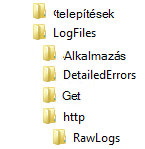
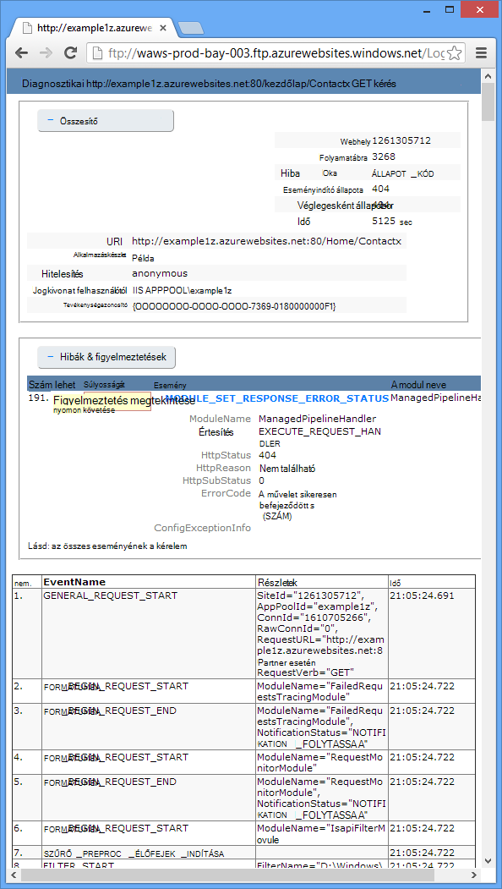

<properties 
    pageTitle="A web App alkalmazásban a Visual Studio segítségével Azure App szolgáltatásban – problémamegoldás" 
    description="Megtudhatja, hogy miként távoli hibakeresés nyomkövetési és 2013-as verziójára Visual Studio beépített naplózási eszközök használatával kapcsolatos hibák elhárítása az Azure-webappokban." 
    services="app-service" 
    documentationCenter=".net" 
    authors="tdykstra" 
    manager="wpickett" 
    editor=""/>

<tags 
    ms.service="app-service" 
    ms.workload="na" 
    ms.tgt_pltfrm="na" 
    ms.devlang="dotnet" 
    ms.topic="article" 
    ms.date="08/29/2016" 
    ms.author="rachelap"/>

# A web App alkalmazásban a Visual Studio segítségével Azure App szolgáltatásban – problémamegoldás

## – Áttekintés

Ebből az oktatóanyagból megtudhatja, hogy hogyan Visual Studio eszközök, amelyek segítségével az [Alkalmazás szolgáltatás](http://go.microsoft.com/fwlink/?LinkId=529714)webalkalmazást hibakeresési, futtatásával [hibakeresési mód](http://www.visualstudio.com/get-started/debug-your-app-vs.aspx) távolról vagy alkalmazás naplókról és a webhely kiszolgálói naplók megtekintése.

[AZURE.INCLUDE [app-service-web-to-api-and-mobile](../../includes/app-service-web-to-api-and-mobile.md)]

Dióhéjban:

* A Visual Studióban mely Azure web app-kezelési funkciók érhetők el.
* Hogyan használható a Visual Studio távoli nézetben gyorsan módosíthatja a egy távoli web App alkalmazásban.
* Hogyan tehető függővé távolról a projekt során hibakeresési módban fut Azure-webalkalmazást és egy WebJob.
* Alkalmazás a nyomkövetési naplók létrehozása, és megtekintheti azokat az alkalmazás közben létrehozása őket.
* Hogy miként tekintheti meg webes kiszolgáló naplók, beleértve a részletes hibaüzenetek jelennek meg, és nem sikerült a kérelem nyomkövetési.
* Hogyan lehet küldje el a diagnosztikai naplók Azure-tárolóhoz fiók, és megtekintheti, azokat.

Ha a Visual Studio Ultimate, akkor is használhatja [IntelliTrace](http://msdn.microsoft.com/library/vstudio/dd264915.aspx) hibakereséshez. Ebben az oktatóanyagban IntelliTrace nem vonatkoznak.

## Előfeltételek

Ebben az oktatóanyagban működik-e a fejlesztői környezet, a project web és Azure-webalkalmazásból, amelyeket az [első lépések a Azure és ASP.NET]beállítása[GetStarted]. Az kapcsolatos WebJobs, szüksége van az alkalmazás az [Első lépések az Azure WebJobs SDK]létrehozott[GetStartedWJ].

A mintakódok, ebben az oktatóanyagban látható C# MVC webes alkalmazáshoz, de a hibaelhárítási eljárások megegyeznek a Visual Basic és webes űrlapok alkalmazások.

Az oktatóprogram tartalma feltételezi, hogy a Visual Studio 2015 vagy 2013 használata esetén. Ha a Visual Studio 2013 használata esetén az WebJobs szolgáltatásokhoz [frissítés 4-es](http://go.microsoft.com/fwlink/?LinkID=510314) vagy újabb verziójában. 

A továbbított naplók Ez a funkció csak az alkalmazások, amelyek a .NET-keretrendszer 4 vagy annál újabb működik.

## Web app konfigurálása és kezelése

Visual Studio egy részét a web app-kezelési funkciók és beállítások az [Azure portál](http://go.microsoft.com/fwlink/?LinkId=529715)elérhető hozzáférést biztosít. Ebben a részben látni fogja, mi érhető el **Kiszolgáló**Intézővel. Ha látni szeretné a legújabb Azure integrációs szolgáltatások, próbálja ki az **Felhő Explorer** is. A **Nézet** menü mindkét windows megnyithatja. 

1. Ha még nem jelentkezett be az Azure a Visual Studióban, a **Csatlakozás az Azure** gombra a **Kiszolgáló Intézőben**.

    Alternatív, amely lehetővé teszi a hozzáférést a fiók kezelése tanúsítvány telepítése. Ha úgy dönt, hogy telepíteni egy tanúsítványt, kattintson a jobb gombbal a **Kiszolgáló Explorer** **Azure** csomópontra, és kattintson **kezelése és szűrő előfizetések** a helyi menüben. **Azure előfizetések kezelése** párbeszédpanelen kattintson a **tanúsítványok** fülre, és kattintson az **Import**gombra. Kövesse töltheti le, és kattintson a (más néven *.publishsettings* fájl) előfizetés-fájl importálása az Azure-fiók.

    > [AZURE.NOTE]
    > Ha az előfizetés fájl letöltéséhez mentse egy mappába a forrás kód könyvtárak (például a letöltések mappában) kívül esik, és törölje az importálás befejeződése után. Egy rosszindulatú felhasználó, aki hozzáfér az előfizetés fájl szerkesztése, létrehozása és törlése a Azure szolgáltatások.

    Azure erőforrások Visual Studio alkalmazásból való csatlakozással kapcsolatban további tudnivalókért lásd: [a fiókok kezelése, az előfizetések elemre, és a rendszergazdai szerepkörök](http://go.microsoft.com/fwlink/?LinkId=324796#BKMK_AccountVCert).

2. A **Kiszolgáló Explorer**bontsa ki az **Azure** , és bontsa ki az **Alkalmazás szolgáltatás**.

3. Bontsa ki az erőforráscsoport, amely tartalmazza a web App alkalmazásban [– első lépések Azure és ASP.NET]létrehozott[GetStarted], majd kattintson a jobb gombbal a web app csomópontot, és kattintson a **Nézet beállításai**gombra.

    

    Az **Azure Web App** lap jelenik meg, és ott web app kezelési és konfigurációs feladatokat érhetők el a Visual Studio láthatja.

    

    Ebben az oktatóanyagban lesz használatban a naplózás és a nyomkövetés legördülő menük. Távoli hibakeresés is használni, de egy másik módszert kapcsolhatja be kell használni.
   
    Az alkalmazás beállításainak és a kapcsolati karakterlánc mezőben, az ablak kapcsolatos további tudnivalókért lásd [Azure Web Apps alkalmazások: hogyan alkalmazás karakterláncok és a kapcsolati karakterláncot munka](http://blogs.msdn.com/b/windowsazure/archive/2013/07/17/windows-azure-web-sites-how-application-strings-and-connection-strings-work.aspx).

    Ha szeretne végrehajtani a web app felügyeleti feladatot nem hajtható végre, ebben az ablakban, kattintson a **Nyissa meg az adatkezelési portál** nyisson meg egy böngészőablakot, az Azure-portálra.

## Kiszolgáló Explorer Access web app-fájlokkal

Webes projekt általában rendszerbe a `customErrors` a fájlt, állítsa a ablakban a jelölő `On` vagy `RemoteOnly`, ami azt jelenti, nem hibaüzenet egy hasznos, ha valami mentésük. Sok hibáinak összes kap egy olyan lap, például a következő lehetőségekből közül.

**A "/" alkalmazás kiszolgáló hiba:**

**Hiba lépett fel:**

**A webhely nem tudja megjeleníteni a lapon**

A gyakran a találja a hiba oka legegyszerűbben ahhoz, hogy részletes hibaüzenetek jelennek meg, amely az első az előző képernyőképek megtudhatja, hogyan végezze el. A telepített fájlt megváltozása igénylő. Akkor is szerkesztheti *a fájlt a projekt* és telepítsen újra a projekt vagy [Web.config átalakítása](http://www.asp.net/mvc/tutorials/deployment/visual-studio-web-deployment/web-config-transformations) létrehozása és hibakeresési építés üzembe, de van egy gyorsabb módszer: a **Megoldás Intézőben** közvetlenül megtekintheti és szerkesztheti a távoli web app-fájlokat a *távoli megtekintése* funkció használatával.

1. A **Kiszolgáló Explorer**bontsa ki az **Azure**, bontsa ki az **Alkalmazás szolgáltatás**, bontsa ki az erőforráscsoport, amely a web App alkalmazásban található, és majd bontsa ki a webalkalmazás csomópontot.

    Csomópontot, amely hozzáférést biztosít a web app tartalom fájlokat és a naplófájlok megtekintése

2. Bontsa ki a **fájlok** csomópontot, és kattintson duplán *a fájlt* .

    

    Visual Studio a távoli web App alkalmazásban nyitja meg a fájlt, és megjeleníti a [távoli] a címsorban a fájlnév mellett.

3. Az alábbi sor hozzáadása a `system.web` elem:

    `<customErrors mode="Off"></customErrors>`

    

4. Frissítse a böngészőt, amely nem hasznosként hibaüzenet látható, és most hibaüzenet akkor egy részletes, például az alábbi példában:

    

    (A hiba látható hozta kiegészítését a piros *Views\Home\Index.cshtml*mutatott.)

Fájl szerkesztése látható csak egy alkalmazási helyzetek, amelyben az azt jelenti, hogy olvasásához és szerkesztéséhez a fájlokat az Azure-webalkalmazást a könnyebb legyen a hibaelhárítás.

## Távoli hibakeresési web Apps alkalmazások

Ha a részletes hibaüzenet nem nyújt elegendő információt, és meg nem hozza létre újból a hiba helyi meghajtóra, a kapcsolatos hibák elhárítása úgy, ha hibakeresési módra távolról. Töréspontok beállítása, közvetlenül a memória módosítására, végezze el a kódot és színüket is beállíthatja a kód elérési útját. 

Távoli hibakeresés Visual Studio Express kiadásában nem működik.

Ebből a szakaszból megtudhatja, hogyan szeretné hibakeresése hoz létre [az Azure és ASP.NET az első lépések]a project segítségével távolról[GetStarted].

1. Nyissa meg a webes projektet, amely az [első lépések Azure és ASP.NET]létrehozott[GetStarted].

1. Nyissa meg a *Controllers\HomeController.cs*.

2. Törölje a `About()` módot és beszúrása a következő kód elfoglalt helyét.

        public ActionResult About()
        {
            string currentTime = DateTime.Now.ToLongTimeString();
            ViewBag.Message = "The current time is " + currentTime;
            return View();
        }

2. A [Töréspont beállítása](http://www.visualstudio.com/get-started/debug-your-app-vs.aspx) a `ViewBag.Message` sor.

1. A **Megoldás Explorer**kattintson a jobb gombbal a projektet, és kattintson a **Közzététel**gombra.

2. A **profil** legördülő listában jelölje ki a profillal, akkor az [első lépések Azure és ASP.NET]használt[GetStarted].

3. Kattintson a **Beállítások** fülre, és **konfigurációs** módosítani szeretné **hibakeresése**, és ezután kattintson a **Közzététel**gombra.

    

4. Telepítés után befejeződik, és a böngészőben megnyílik a webalkalmazás az Azure URL-címre, zárja be a böngészőt.

5. **Server Explorer**kattintson a jobb gombbal a web App alkalmazásban, és válassza a **Debugger csatolni**. 

    

    A Kezdőlap lapon Azure-ban futó automatikusan megnyitja a böngészőben. Előfordulhat, hogy kell 20 másodpercre, illetve így türelmet Azure állítja be a kiszolgáló hibakeresés céljából. A késleltetés csak akkor fordul elő, az első futtatásakor hibakeresési módban a webalkalmazást. A következő 48 órában indításakor nincs újra hibakeresési későbbi időpontok nem késleltetést.

    **Megjegyzés:** Ha bármely problémái vannak a debugger kezdve, próbálja meg adunk Explorerrel **Felhő** **Server Explorer**helyett.

6. A menüben kattintson a **információk** .

    A töréspont leállítja a Visual Studio, és a kód nem a helyi számítógépen fut Azure.

7. Mutasson a `currentTime` változó idő érték.

    

    Az idő, megjelenik az előfordulhat, hogy a helyi számítógépre különböző időzónájának Azure server időt.

8. Adjon meg egy új értéket a `currentTime` változó, például a "Most már az Azure-ban futó".

5. Nyomja le az F5 billentyű lenyomásával futását.

    A névjegy lapot Azure-ban futó megadott currentTime változó be új értéket jeleníti meg.

    

## Távoli hibakeresési WebJobs

Ez a szakasz megtudhatja, hogy miként hibakeresési távolról a hoz létre [Az Azure WebJobs SDK – első lépések](websites-dotnet-webjobs-sdk.md)a project és a webes alkalmazás használatával. 

Az ebben a szakaszban látható funkciók csak a Visual Studio 2013 frissítés 4-es vagy újabb rendszerű érhetők el. 

Távoli hibakeresés csak akkor működik, a folyamatos WebJobs. Ütemezett és igény szerinti WebJobs nem támogatja a hibakeresése során.

1. Nyissa meg a webes projektet, amely az [Első lépések az Azure WebJobs SDK]létrehozott[GetStartedWJ].

1. Nyissa meg a ContosoAdsWebJob projekt *Functions.cs*.

2. Az első utasítás [Töréspont beállítása](http://www.visualstudio.com/get-started/debug-your-app-vs.aspx) a `GnerateThumbnail` módot.

    

1. A **Megoldás Explorer**kattintson a jobb gombbal a webes projektet (nem a WebJob projekt), és kattintson a **Közzététel**gombra.

2. A **profil** legördülő listában jelölje ki az [Első lépések az Azure WebJobs SDK](websites-dotnet-webjobs-sdk.md)használt profillal.

3. Kattintson a **Beállítások** fülre, és **konfigurációs** módosítani szeretné **hibakeresése**, és ezután kattintson a **Közzététel**gombra.

    Visual Studio üzembe helyezése a webes és WebJob projektek, és a böngészőben megnyílik a webalkalmazás az Azure URL-címet.

5. **Server Explorer** bontsa ki **Azure > alkalmazás szolgáltatás > az erőforráscsoport > a web app > WebJobs > folyamatos**, majd kattintson a jobb gombbal a **ContosoAdsWebJob**.

7. Kattintson a **Debugger csatolása**gombra. 

    

    A Kezdőlap lapon Azure-ban futó automatikusan megnyitja a böngészőben. Előfordulhat, hogy kell 20 másodpercre, illetve így türelmet Azure állítja be a kiszolgáló hibakeresés céljából. A késleltetés csak akkor fordul elő, az első futtatásakor hibakeresési módban a webalkalmazást. A következő alkalommal, amikor nincs a debugger csatol késleltetést, nem, ha 48 órában elvégezni.

6. A Contoso hirdetések kezdőlapjára nyitja meg a webböngészőben hozzon létre egy új ad. 

    Az Active Directory létrehozása hatására várólista üzenetet hozható létre, amely szerint a WebJob felvételre, és feldolgozása. Ha a WebJobs SDK felhívja a függvény a várólista üzenet feldolgozása, a kódot a töréspont fog találati.

7. A debugger a Töréspont a töréspontok, ha megvizsgálja, és módosíthatja a változók értékein, a program a felhőben futása közben. Az alábbi ábrán a debugger az blobInfo objektumra, amely a GenerateThumbnail módszerrel átadott tartalmát jeleníti meg.

    
 
5. Nyomja le az F5 billentyű lenyomásával futását.

    A GenerateThumbnail módszer elkészítette a miniatűrjére.

6. A böngészőben frissítse az Index lapot, és megjelenik a miniatűr.

6. A Visual Studióban nyomja le a SHIFT + F5 szeretné hibakeresése állítani.

7. A **Kiszolgáló Explorer**kattintson a jobb gombbal a ContosoAdsWebJob csomópontot, és kattintson az **Irányítópult megtekintése**.

8. Az Azure hitelesítő adataival jelentkezzen be, és kattintson a kívánt WebJob nevére kattintva nyissa meg a WebJob a lapját. 

    

    Az irányítópult azt mutatja, hogy az utoljára végrehajtott GenerateThumbnail függvény.

    (A következő alkalommal, amikor kattintson a **Nézet irányítópult**, jelentkezzen be a nincs és a böngésző közvetlenül a lapra ugrik a WebJob számára.)

9. Kattintson a függvénynevet függvény végrehajtása részleteit.

    

Ha a függvény a [Naplók írt](websites-dotnet-webjobs-sdk-storage-queues-how-to.md#logs), sikerült kattint **ToggleOutput** megtekintheti őket.

## Távoli hibakeresés kapcsolatos megjegyzések

* A gyártási hibakeresési üzemmódban nem ajánlott. A gyártási web App alkalmazásban nem arányosan ki több kiszolgálói példány, ha hibakeresési megakadályozza, hogy az érintett webkiszolgálóra más kérelmekre válaszolni. Ha több web server-példány, ha csatolja a debugger kapja meg egy-példány véletlenszerű, és nincs mód annak érdekében, hogy a későbbi böngésző kérések példányhoz ugrik. Is általában nem rendszerbe hibakeresési építés gyártási és megjelenés buildjeiben a fordító optimalizálásokat előfordulhat, hogy lehetetlenné kattintva jelenítse meg a forráskód saját soronként. A gyártási hibáinak elhárítása, a legjobb erőforrások az alkalmazás nyomkövetési és a webhely kiszolgálói naplók.

* Hosszú leáll, amikor a távoli töréspontok elkerülése hibakeresése során. Azure kezeli egy folyamat, amely egy nem reagál folyamat szerint néhány percnél hosszabb leáll, és leállítja azt.

* Hibakeresése, közben a kiszolgáló küld adatokat a Visual Studióban, befolyásolhatja a sávszélesség díjak. Sávszélesség díjak tudni olvassa el a [Azure árak](/pricing/calculator/)című témakört.

* Győződjön meg arról, hogy a `debug` attribútuma a `compilation` *a fájlt* az elem értéke igaz. Értéke igaz, a hibakeresési build konfiguráció közzétételekor alapértelmezés szerint.

        <system.web>
          <compilation debug="true" targetFramework="4.5" />
          <httpRuntime targetFramework="4.5" />
        </system.web>

* Ha úgy találja, hogy a a hibakereső nem lép a kódot, amely szeretné hibakeresése, lehet, ha a csak a saját kód beállítást.  További tudnivalókért lásd: [csak a saját kód verziószámú korlátozása](http://msdn.microsoft.com/library/vstudio/y740d9d3.aspx#BKMK_Restrict_stepping_to_Just_My_Code).

* A kiszolgálón időzítő elindul, ha engedélyezi a távoli hibakeresési szolgáltatást, és 48 óra elteltével a szolgáltatás automatikusan ki van kapcsolva. Ezt a korlátot 48 óra biztonság és a teljesítmény okokból kell elvégezni. Egyszerűen bekapcsolása a szolgáltatás vissza tetszőleges számú alkalommal. Azt javasoljuk, hogy kikapcsolja, ha Ön nem aktívan hibakeresési hagyja.

* A debugger manuális folyamatának, nem csak a web app folyamat (w3wp.exe) csatolhat. A Visual Studio hibakeresési mód használatáról további információt [a Visual Studióban hibakeresés](http://msdn.microsoft.com/library/vstudio/sc65sadd.aspx)látható.

## A diagnosztikai naplók áttekintése

Az Azure-webappokban futó ASP.NET-alkalmazás a következő típusú naplók hozhat létre:

* **Alkalmazás nyomkövetési naplók** 
  Az alkalmazás ezeket a naplókat hívja fel a [System.Diagnostics.Trace](http://msdn.microsoft.com/library/system.diagnostics.trace.aspx) osztály módszerek hoz létre.
* **Webhely kiszolgálói naplók** 
  Az érintett webkiszolgálóra hoz létre a web app minden HTTP kérés naplóbejegyzést.
* **Részletes hibanaplók üzenet** 
  Az érintett webkiszolgálóra egy HTML lapot hoz (amelyek, amelyeknél a állapotkódja 400-s vagy újabb) sikertelen a HTTP-kérelmek néhány további információkat. 
* **Nem sikerült a kérelem nyomkövetési naplók** 
  Az érintett webkiszolgálóra sikertelen a HTTP-kérelmek nyomkövetési részletes információkat hoz létre egy XML-fájlt. Az érintett webkiszolgálóra is tartalmaz az XSL-fájl formázásához az XML-tartalom a böngészőben.
  
Naplózás hatása a web app teljesítményét, így Azure lehetőséget nyújt a engedélyezése vagy letiltása a napló különböző típusú, szükség szerint. Az alkalmazás naplók megadhatja, hogy csak egy bizonyos súlyosságát szint fölé naplók kell írni. Amikor hoz létre egy új webalkalmazás alapértelmezés szerint minden naplózás le van tiltva.

Naplók a fájlrendszerben a web App *naplófájlok* mappában található fájlok kerülnek, és elérhető FTP-n keresztül. Webhely kiszolgálói naplókról és a alkalmazás naplók is írhatók Azure tárterület-fiókjába. Továbbra is a nagyobb, mint a fájlrendszerben lehetséges tárolási számlán naplók mennyiségig. Ön egy legfeljebb 100 megabájt naplók a fájlrendszer használatakor. (Csak a rövid érvényességi idejű adatmegőrzési fájl rendszer naplók is. Azure törli a régi naplófájlok számára helyet szeretne csinálni újakat után a letelik.)  

## Létrehozása és alkalmazása a nyomkövetési naplók megtekintése

Ez a szakasz fogja végezze el az alábbi műveleteket:

* Nyomkövetés kimutatások hozzáadása a webes projektet, amely az [első lépések a Azure és ASP.NET]létrehozott[GetStarted].
* A projekt helyileg futtatásakor a naplók megtekintése
* A naplók megjelenítése az Azure-ban futó alkalmazás által generált őket. 

Az alkalmazás létrehozásával kapcsolatos adatokat naplózza WebJobs, lásd: [miként dolgozhat az Azure várólista-tároló a WebJobs SDK – használatával a hatékony Szövegalkotás naplók](websites-dotnet-webjobs-sdk-storage-queues-how-to.md#logs). Az alábbi utasításokat naplók megtekintése, és hogyan, hogy külön letöltené Azure szabályozása WebJobs által létrehozott alkalmazás naplók is alkalmazhat. 

### Nyomkövetés kimutatások az alkalmazás hozzáadása

1. Nyissa meg a *Controllers\HomeController.cs*, és cserélje le a `Index`, `About`, és `Contact` kódot annak érdekében, hogy adja hozzá a következő módszerek `Trace` kimutatások és a `using` nyilatkozata `System.Diagnostics`:

        public ActionResult Index()
        {
            Trace.WriteLine("Entering Index method");
            ViewBag.Message = "Modify this template to jump-start your ASP.NET MVC application.";
            Trace.TraceInformation("Displaying the Index page at " + DateTime.Now.ToLongTimeString());
            Trace.WriteLine("Leaving Index method");
            return View();
        }
        
        public ActionResult About()
        {
            Trace.WriteLine("Entering About method");
            ViewBag.Message = "Your app description page.";
            Trace.TraceWarning("Transient error on the About page at " + DateTime.Now.ToShortTimeString());
            Trace.WriteLine("Leaving About method");
            return View();
        }
        
        public ActionResult Contact()
        {
            Trace.WriteLine("Entering Contact method");
            ViewBag.Message = "Your contact page.";
            Trace.TraceError("Fatal error on the Contact page at " + DateTime.Now.ToLongTimeString());
            Trace.WriteLine("Leaving Contact method");
            return View();
        }       

2. Adja hozzá a `using System.Diagnostics;` utasítás a fájl tetején.
                
### A nyomkövetés kimeneti helyileg megtekintése

3. Nyomja le az F5 billentyűparancs hatására az alkalmazás futtatásához hibakeresési módban.

    Az alapértelmezett nyomkövetési figyelő összes nyomkövetés eredménye a, a **kimeneti** ablakban, és más hibakeresési kimeneti ír. Az alábbi ábrán látható a nyomkövetési kimutatások felvett kimenetét a `Index` módot.

    

    A következő lépések bemutatják, hogyan tekinthető Kimenet nyomon követése az weblapon, hibakeresési módban lefordítása nélkül.

2. Nyissa meg a alkalmazás fájlt (a project mappában található azzal), és adja hozzá a `<system.diagnostics>` végén található a fájlt, közvetlenül a záró előtt elem `</configuration>` elem:

        <system.diagnostics>
            <trace>
              <listeners>
                <add name="WebPageTraceListener"
                    type="System.Web.WebPageTraceListener, 
                    System.Web, 
                    Version=4.0.0.0, 
                    Culture=neutral,
                    PublicKeyToken=b03f5f7f11d50a3a" />
              </listeners>
            </trace>
          </system.diagnostics>

    A `WebPageTraceListener` lehetővé teszi, hogy megtekinti Kimenet nyomon követése tallózással `/trace.axd`.

3. Adjon hozzá egy <a href="http://msdn.microsoft.com/library/vstudio/6915t83k(v=vs.100).aspx">nyomkövetési elem</a> alatt `<system.web>` a fájlt, például az alábbi példa a:

        <trace enabled="true" writeToDiagnosticsTrace="true" mostRecent="true" pageOutput="false" />

3. Nyomja le a CTRL + F5 az alkalmazásnak a futtatására.

4. A böngésző ablakának címsorában *trace.axd* hozzáadása az URL-címet, és nyomja le az ENTER billentyűt (URL-címe lesz hasonló http://localhost:53370/trace.axd).

5. Az **Alkalmazás nyomkövetési** lapon kattintson a **Részletek** az első sorban (nem a BrowserLink).

    

    A **Igénylése Details** lap jelenik meg, és a **Nyomkövetési adatok** csoportban a nyomkövetési kimutatások felvett kimenetét megjelenik a `Index` módot.

    

    Alapértelmezés szerint `trace.axd` csak akkor áll rendelkezésre helyi meghajtóra. Ha megy végbe egy távoli web app alkalmazásból elérhetővé szeretné tenni, hozzáadhat `localOnly="false"` szeretne a `trace` elemet *a fájlt, az alábbi példában látható módon* :

        <trace enabled="true" writeToDiagnosticsTrace="true" localOnly="false" mostRecent="true" pageOutput="false" />

    Azonban engedélyezése `trace.axd` éles webalkalmazás általában nem ajánlott biztonsági okokból, és az alábbi szakaszok egyszerűbb az Azure web app a nyomkövetési naplók olvasása megjelenik.

### A nyomkövetés kimeneti megtekintése az Azure-ban

1. A **Megoldás Intézőben**kattintson a jobb gombbal a webes projektet, és kattintson a **Közzététel**gombra.

2. A **Webhely közzététele** párbeszédpanelen kattintson a **Közzététel**gombra.

    Visual Studio közzététele a frissítés, miután a Kezdőlap lapon (feltételezve, hogy a **kapcsolat** lapon nem törli a **Célhely URL-CÍMÉT** ) böngészőablakban nyílik meg.

3. A **Kiszolgáló Explorer**kattintson a jobb gombbal a web App alkalmazásban, és válassza **a folyamatos átvitelű naplók megtekintése**. 

    

    A **kimeneti** ablakban látható, a napló streaming szolgáltatás kapcsolódik, és elhelyezi a értesítés vonalat minden perce nélkül szeretné megjeleníteni a naplózási előbb.

    

4. A böngésző ablakában, amely mutatja az alkalmazás kezdőlap lapján a **Névjegy**gombra.

    Néhány másodpercet belül a kimenet a hiba szintű nyomon követheti, hozzáadódik az `Contact` módszer a **kimeneti** ablakban jelenik meg.

    

    Visual Studio, a hiba szintű nyomkövetések csak jelenik meg, mert ez az alapértelmezett beállítás a szolgáltatás felügyelete a napló engedélyezheti. Amikor létrehoz egy új Azure web App alkalmazásban, az összes naplózás alapértelmezés szerint nincs engedélyezve, ekkor a böngészőben a beállítások lap korábban megnyitott:

    

    Azonban **a folyamatos átvitelű naplók megtekintése**kijelölésekor a Visual Studio automatikusan másik **Alkalmazás Logging(File System)** **hiba**, ami azt jelenti, hogy hiba szintű naplók kapjanak. Az összes a nyomkövetési naplók megjelenítéséhez **részletes**módosíthatja ezt a beállítást. Amikor kijelöl egy kisebb, mint a hiba súlyosságát szint, az összes naplók magasabb fontossági szintek is jelentik. Így részletes lehetőséget választja, is jelenik információkat, figyelmeztetés és hibanaplókat.  

4. A **Kiszolgáló Explorer**kattintson a jobb gombbal a web app, és kattintson a **Nézet beállítások** ahogy korábbi.

5. **Alkalmazás naplózás (File System)** módosítása **részletes**, és kattintson a **Mentés**gombra.
 
    

6. Most látható a **Névjegy** lapon a böngészőablakban kattintson a **Kezdőlap fülre**, majd kattintson a **Névjegy**gombra, és válassza a **partner**.

    Néhány másodpercek a **kimeneti** ablakban látható az összes a nyomkövetés kimeneti.

    

    Ez a szakasz engedélyezve van, és tiltható le a naplózás Azure web app beállításainak használatával. Is engedélyezése és letiltása a nyomkövetési hallgatók módosítása a fájlt. Azonban módosítása a fájlt hatására az alkalmazás a tartomány Lomtár, miközben segítségével, így a web app konfiguráció keresztül naplózás nem végez, amely. Ha a probléma reprodukálása, túl hosszú ideig tart vagy szakaszos, az alkalmazás tartomány újrafelhasználás előfordulhat, hogy "fix" it és kényszeríti arra, hogy várnia, amíg ez történik, újra. Azure-ban diagnosztika segítségével, így nem hajthatja végre, máris azonnal rögzítése a hiba adatait.

### Kimeneti ablakban funkciók

Az **Azure naplók** lapján a **kimeneti** ablakban több gomb és a szövegdoboz foglalja magában:

Ezek a végezze el az alábbi műveleteket:

* Törölje a jelet a **kimeneti** ablakban.
* Engedélyezheti vagy letilthatja a sortörés.
* Elindíthatja és leállíthatja a naplók figyelése.
* Adja meg, amelyek naplózza a Lync.
* Töltse le a naplók.
* Naplók a keresőkifejezést, vagy a reguláris kifejezések alapján szűrni.
* Zárja be a **kimeneti** ablakban.

Ha beír egy keresőkifejezést vagy a reguláris kifejezésekkel, a Visual Studio szűrők az ügyfél naplózási adatait. Ez azt jelenti, hogy a feltétel adhatja meg, miután a naplókat megjelennek a **kimeneti** ablakban, és módosíthatja a szűrési feltételek anélkül, hogy a naplókat újragenerálása.

## Webhely kiszolgálói naplók megtekintése

Webhely kiszolgálói naplók rögzítheti az összes HTTP tevékenységet a webalkalmazásban. A **kimeneti** ablakban megjelenítéséhez meg kell engedélyezi őket a webes alkalmazáshoz, és közölje őket figyelni kívánt Visual Studio. 

1. A **Kiszolgáló**Intézőből megnyitott **Azure Web App konfigurálása** lapon módosítása a webes kiszolgáló naplózás **be**, és kattintson a **Mentés**.

    

2. A **kimeneti** ablakban **Adja meg, mely Azure naplózza a Lync-** gombra.
    
    

3. **Azure naplózási beállítások** párbeszédpanelen válassza a **webhely kiszolgálói naplók**, és kattintson **az OK**gombra.

    

4. A web app jeleníti meg a böngészőablakban kattintson a **Kezdőlap fülre**, majd kattintson a **Névjegy**gombra, és válassza a **partner**.

    Az alkalmazás naplók általában az első, a webhely kiszolgálói naplókat követ. Előfordulhat, hogy kell Várjon egy kicsit a naplók jelenik meg. 

    

Alapértelmezés szerint webhely kiszolgálói naplók engedélyezheti a Visual Studióban, Azure ír a naplókat a fájlrendszerben. Alternatívájaként az Azure portal segítségével adja meg az adott webkiszolgáló naplók blob-tárolóhoz tárterület-fiókjában kell írni.

Ha webkiszolgálón Azure tárterület-fiókhoz naplózás engedélyezése a portálon használja, és tiltsa le naplózás a Visual Studióban, újra engedélyezheti a Visual Studio naplózás a tárterület-fiók beállításainak visszaállítása 

## Üzenet részletes hibanaplóinak megtekintése

Részletes hibanaplók adja meg, hogy néhány további információ a HTTP-kérelmeket, amelyeknél a válasz hibakódok (400 vagy újabb). Annak érdekében, hogy a **kimeneti** ablakban látható őket, hogy engedélyezi őket a webes alkalmazáshoz, és közölje őket figyelni kívánt Visual Studio.

1. A **Kiszolgáló**Intézőből megnyitott **Azure Web App konfigurálása** lapon **Részletes hibaüzenetek** módosítása **a**, és kattintson a **Mentés**gombra.

    

2. A **kimeneti** ablakban **Adja meg, mely Azure naplózza a Lync-** gombra.

3. **Azure naplózási beállítások** párbeszédpanelen válassza **az összes naplók**, és kattintson **az OK**gombra.

    

4. Be a címsorba a böngészőablak hozzáadása egy további karakter egy 404-es hibát okoz a URL-címét (például `http://localhost:53370/Home/Contactx`), és nyomja le az ENTER billentyűt.

    A részletes hibanaplójának néhány másodperc után jelenik meg, a Visual Studio **kimeneti** ablakban.

    

    CTRL + a hivatkozásra kattintva megtekintheti a kimenet a böngészőben, formázása:

    

## Töltse le a fájlt rendszer naplók

Bármely, a **kimeneti** ablakban figyelheti naplók *.zip* fájlként is lehet letölteni. 

1. Kattintson a **kimeneti** ablakban, **Töltse le a folyamatos átvitelű naplók**.

    

    A letöltött fájl kijelölve a Fájlkezelőben nyílik meg a *Letöltések* mappában.

    

2. Bontsa ki a *.zip* fájlt, és megjelenik a következő mappaszerkezet:

    

    * Alkalmazás nyomkövetési naplók *.txt* fájlok *LogFiles\Application* mappában találhatók.
    * Webhely kiszolgálói naplók *.log* fájlok *LogFiles\http\RawLogs* mappában találhatók. [Log elemző](http://www.microsoft.com/download/details.aspx?displaylang=en&id=24659) például eszköz segítségével megtekintheti és kezelheti ezeket a fájlokat.
    * Üzenet részletes hibanaplók *.html* fájlok *LogFiles\DetailedErrors* mappában találhatók.

    (A *telepítések* mappa van a közzététel, adatforrás-vezérlő által létrehozott fájlok bármi Visual Studio közzétételi kapcsolódó nincsenek. A *mely számjegy* mappa az adatforrás-vezérlő kapcsolódó nyomkövetések van közzététel és a napló fájl adatfolyam service.)  

## Tárterület naplók megtekintése

Alkalmazás nyomkövetési naplók is elküldésének Azure tárterület-fiókjába, és megtekintheti azokat a Visual Studióban. Ehhez az kell létrehoznia a tárterület-fiókot, a klasszikus portálon tároló naplók engedélyezése, és megtekintheti azokat a **Naplók** lapján az **Azure Web App** ablak.

Naplók küldése három célok közül választhat:

* A fájlrendszer.
* Tárterület fiók táblákat.
* Tárterület-fiók BLOB.

Minden cél különböző szinttel is megadhat. 

Táblázatok megkönnyítik a naplók online részletes adatainak megjelenítéséhez, és támogatják a folyamatos átvitelű; táblák naplók lekérdezése és a létrehozásukkor készül, lásd: új naplók. BLOB megkönnyítik a részletek a fájlok letöltése és elemzéséhez őket HDInsight, használata, mert HDInsight tudja, hogy miként dolgozhat az blob-tárolóhoz. További tudnivalókért olvassa el a **Hadoop és MapReduce** [Adattárolási beállításainak (épület valós Életből felhő alkalmazások az Azure)](http://www.asp.net/aspnet/overview/developing-apps-with-windows-azure/building-real-world-cloud-apps-with-windows-azure/data-storage-options)című témakört.

Telepített fájl rendszer naplók részletes szintű; az alábbi lépésekkel végigvezetjük információk szintű naplók beállítása a tárhely fiók táblák megnyitásához. Információs szint azt jelenti, hogy a hívott által létrehozott összes naplók `Trace.TraceInformation`, `Trace.TraceWarning`, és `Trace.TraceError` jelenik meg, de nem hívásához által létrehozott naplók `Trace.WriteLine`.

Tárterület-fiókok további tárterület és a fájlrendszer és összehasonlítása naplók hosszabb tartós adatmegőrzési kínálnak. Egy másik alkalmazás nyomkövetési naplók elküldésének tárolóhoz előnye, hogy néhány további információt az egyes naplók, amely fájl rendszer naplók el nem kap.

5. Kattintson a jobb gombbal **tárolás** területen az Azure csomópontot, és kattintson a **Tárterület-fiók létrehozása**gombra.

3. **Tárterület-fiók létrehozása** párbeszédpanelen adja meg a tárterület-fiókja nevét. 

    A kell lennie egyedinek kell lennie a (nincs más Azure tároló fiók is lehet ugyanaz a neve). Ha a megadott már használatban van, megváltoztathatja azt kipróbálhat.

    A tárhely fiók eléréséhez az URL-cím lesz *{nevű}*. core.windows.net. 

5. Állítsa a **régió vagy affinitás csoport** legördülő listában a régió legközelebb.

    Ezzel a beállítással megadhatja, hogy melyik Azure adatközponthoz fog tárolni a tárterület-fiókját. Ebben az oktatóanyagban választási észrevehető különbség nem gondoskodjon, de egy gyártási webalkalmazás szeretné webkiszolgálón és el szeretné helyezni az ugyanabban a késés és az adatok kilépési díjak minimalizálásához régióban tároló fiókját. A web app (amely létre fogja hozni később) területen a böngészők a web app elérése Késleltetés minimalizálása érdekében a lehető legközelebb fusson.

6. Állítsa a **replikáció** legördülő lista **helyileg felesleges**. 

    Ha geo replikációs engedélyezve van a tárterület-fiókot, a tárolt tartalom engedélyezése erre a helyre abban az esetben, ha az elsődleges helye a fő katasztrófa áttérni egy másodlagos adatközponthoz van replikált. A replikáció GEO többletköltségek is járnak. Teszt és fejlesztési fiókok általában nem szeretne fizetni geo-replikáció. További tudnivalókért lásd: [jelentések létrehozása, kezelése, és a tárhely fiók törlése](../storage-create-storage-account/#replication-options).

5. Kattintson a **létrehozása**gombra. 

      

1. A Visual Studio **Azure Web App** ablakában kattintson a **Naplók** fülre, és válassza a **Konfigurálása naplózás az adatkezelési portálon**.

    <!-- todo:screenshot of new portal if the VS page link goes to new portal -->
    

    Ekkor megnyílik a **beállítás** lapon a klasszikus portálon, a webalkalmazásban.

2. A klasszikus portál **beállítása** lapon görgessen le az alkalmazás diagnosztika szakaszában, és módosítsa **Alkalmazás naplózás (Táblatároló)** **on**.

3. Módosítsa a **naplózási szint** **információkat**.

4. Kattintson a **táblázat tárhely kezelése**gombra.

    

    A **táblázat tárhely kezelése az alkalmazás diagnosztika** párbeszédpanelen megadhatja a tárterület-fiók, ha egynél több van. Hozzon létre egy új táblát, vagy egy meglévőt használ.

    

6. A **táblázat tárhely kezelése az alkalmazás diagnosztika** mezőben kattintson a jelölőnégyzet be van jelölve a párbeszédpanel bezárásához.

6. A klasszikus portál **beállítása** lapon kattintson a **Mentés**gombra.

7. Az alkalmazás web App alkalmazásban megjeleníti a böngészőablakban kattintson a **Kezdőlap fülre**, majd kattintson a **Névjegy**gombra, és válassza a **partner**.

    A naplóadatokat a weblapok böngészési készített készül a tárterület-fiókjába.

8. A **Naplók** lapon az **Azure Web App** ablakának a Visual Studióban kattintson a **Diagnosztikai összegzése**a **frissítés** parancsra.

    

    A **Diagnosztikai összefoglalás** szakasz az utolsó 15 percet naplók alapértelmezés szerint látható. Módosíthatja az időszak további naplók megtekintéséhez. 

    (Ha a "táblázat nem található" hibaüzenet jelenik meg, ellenőrizze a lapokat, miután engedélyezte a **Alkalmazás naplózás (tároló)** és **mentése**lehetőséget választotta, végezze el a nyomkövetés böngészési.)

    

    Figyelje meg, hogy ebben a nézetben látható **Folyamatot** és **Hozzászóláslánc azonosító** az egyes naplót, amely a meg nem jelenik meg a fájl rendszer naplókban. További mezők közvetlenül az Azure tároló tábla hatására megjelenik.

8. Kattintson **az összes alkalmazás naplók megtekintése**gombra.

    A nyomkövetési napló tábla jelenik meg az Azure tároló tábla megjelenítő.
   
    (Ha a "sorrend tartalmaz nincsenek elemei" hibaüzenet jelenik meg, nyissa meg a **Kiszolgáló Intézőt**, bontsa ki a csomópontot a tárterület-fiók csoportban az **Azure** csomópontra, majd kattintson a jobb gombbal a **táblázatok** és kattintson a **frissítés**gombra.)

    

    Ebben a nézetben látható a további mezők többi nézetben nem látható. Ebben a nézetben is lehetővé teszi a naplók szűrése lekérdezés megépítése speciális lekérdezés használatával létrehozott felhasználói felület használatával. További tudnivalókért olvassa el a táblázat erőforrások - [Kiszolgáló Intézővel böngészési tárolási erőforrásokat](http://msdn.microsoft.com/library/ff683677.aspx)vállalkozások szűrés használata című témakört.

7. Tekintse meg a megfelelő adatokat egyetlen sor, kattintson duplán az egyik sora.

    

## Hibás kérés nyomkövetési naplók megtekintése

Hibás kérés nyomkövetési naplók hasznosak, ha a hogyan kezeli az IIS a HTTP-kérelem, például az URL-cím címek átírása vagy hitelesítési problémák helyzetekben részleteit megértéséhez szükséges. 

Azure web Apps alkalmazások használata a hibás kérés nyomkövetési funkcióit, amely találhatók meg az IIS 7.0-s vagy újabb verzió. Nem van hozzáférése az IIS-beállítások konfigurálható milyen hibákat első volt bejelentkezve, akkor jó helyen jár. Hibás kérés nyomkövetési engedélyezésekor a rendszer rögzít az összes hibát. 

Visual Studio használatával is engedélyezheti a hibás kérés nyomon követését, de nem tud megtekinteni őket a Visual Studio. Ezek a naplók XML-fájlok. A továbbított naplózási szolgáltatás csak figyeli minősülnek olvasható módban egyszerű szöveg-fájlokká: *.txt*, *.html*és *.log* fájlokat.

Hibás kérés nyomkövetési naplók megtekintése a böngészőben, közvetlenül az FTP-n keresztül vagy helyben után egy FTP-eszköz segítségével töltse le a helyi számítógépre. Ebben a részben fogja meg őket a böngészőben közvetlenül.

1. A **konfiguráció** lapon az **Azure Web App** ablakának megnyitott **Kiszolgáló**Intézőből módosítása **Sikertelen kérése nyomkövetés** **a**, és kattintson a **Mentés**.

    

4. A böngésző ablakában, amely a web app jeleníti meg a címsorban egy további karaktert adja az URL-címre, és kattintson a az Enter billentyűt a 404-es hibát okozó.

    Ennek hatására a hibás kérés nyomkövetési naplót létrehozni, és a következő lépések bemutatják, hogyan lehet megtekinteni vagy töltse le a napló.

2. A Visual Studióban az **Azure Web App** ablakának **beállítás** lapon kattintson **az adatkezelési portálon nyissa meg**.

3. Az [Azure portál](https://portal.azure.com) **beállításai** lap a webalkalmazásban kattintson a **telepítés hitelesítő adatok**, és írja be egy új felhasználónevet és jelszót.

    

    ** Bejelentkezéskor, akkor a teljes felhasználónevet használata a webes alkalmazás neve előtaggal rá. Ha például "myid" felhasználónévként írja be, és a webhely "myexample", ha bejelentkezés mint "myexample\myid".

5. Egy új böngészőablakban nyissa meg az URL-címet a **Web App** lap, a webalkalmazásban **FTP-állomásnév** vagy **FTPS hostname (állomásnév)** csoportban látható. 

6. Jelentkezzen be az Ön által létrehozott korábbi (beleértve az alkalmazás a felhasználó nevét a név webes előtag) FTP hitelesítő adataival.

    A böngészőben jeleníti meg a web app a legfelső szintű mappájára.

6. Nyissa meg a *naplófájlok* mappát.

    

7. Nyissa meg azt a mappát, amely nevű W3SVC plusz egy numerikus érték.

    

    A mappa a hibák, miután engedélyezte a hibás kérés nyomkövetési naplózott XML-fájlok és a böngésző használatával formázza az XML-XSL fájlt tartalmazza.

    

8. Kattintson az XML-fájlt szeretne látni a nyomkövetési adatok sikertelen kérelme.

    Az alábbi ábrán a nyomkövetési adatok minta hibák részét.

    

## Következő lépések

Láthatta, hogy Visual Studio megkönnyíti az Azure web app által létrehozott naplók megtekintéséhez. A következő szakaszokban további forrásokra mutató hivatkozásokat találhat a kapcsolódó témakörök:

* Azure web app – hibaelhárítás
* A Visual Studióban hibakeresése 
* Távoli hibakeresési Azure-ban
* ASP.NET-alkalmazásokban nyomon követése
* Átláthatóbbá webhely kiszolgálói naplók
* Kérés nyomkövetési naplók elemzése sikertelen.
* Hibakeresési Cloud Services

### Azure web app – hibaelhárítás

További információt a hibaelhárítás web Apps alkalmazások Azure App szolgáltatásban az alábbi forrásokban talál:

* [Web Apps alkalmazások figyelése](/manage/services/web-sites/how-to-monitor-websites/)
* [Vizsgálat alatt az Azure-webalkalmazásokban Visual Studio 2013 memóriavesztések](http://blogs.msdn.com/b/visualstudioalm/archive/2013/12/20/investigating-memory-leaks-in-azure-web-sites-with-visual-studio-2013.aspx). A Microsoft ALM blogbejegyzés Visual Studio szolgáltatásairól felügyelt memória problémák elemzéséhez használható.
* [Azure web Apps alkalmazások online eszközök kapcsolatos tudnivalók](/blog/2014/03/28/windows-azure-websites-online-tools-you-should-know-about-2/). Amit Apple blogbejegyzés.

Konkrét hibaelhárítási kérdés segítséget indítsa el a szál között a következő fórumok az:

* [Az Azure-fórum az ASP.NET-webhelyen](http://forums.asp.net/1247.aspx/1?Azure+and+ASP+NET).
* [Az Azure-fórum az MSDN webhelyen](http://social.msdn.microsoft.com/Forums/windowsazure/).
* [StackOverflow.com](http://www.stackoverflow.com).

### A Visual Studióban hibakeresése 

A Visual Studio hibakeresési mód használatáról további információt című [Hibakeresés a Visual Studióban](http://msdn.microsoft.com/library/vstudio/sc65sadd.aspx) MSDN témakör [Hibakeresési tippek a Visual Studio 2010](http://weblogs.asp.net/scottgu/archive/2010/08/18/debugging-tips-with-visual-studio-2010.aspx).

### Távoli hibakeresési Azure-ban

Azure web Apps alkalmazások és WebJobs távoli hibakeresése során további információt az alábbi forrásokban talál:

* [Távoli hibakeresési Azure alkalmazás szolgáltatás Web Apps alkalmazások – bevezetés](/blog/2014/05/06/introduction-to-remote-debugging-on-azure-web-sites/).
* [Távoli hibakeresési Azure alkalmazás szolgáltatás Web Apps alkalmazások rész 2 - távoli hibakeresés belül – bevezetés](/blog/2014/05/07/introduction-to-remote-debugging-azure-web-sites-part-2-inside-remote-debugging/)
* [A 3 - több példány környezet és a mely Számjegy Azure alkalmazás szolgáltatás Web Apps alkalmazások részét szeretné hibakeresése távoli – bevezetés](/blog/2014/05/08/introduction-to-remote-debugging-on-azure-web-sites-part-3-multi-instance-environment-and-git/)
* [WebJobs hibakeresési (videó)](https://www.youtube.com/watch?v=ncQm9q5ZFZs&list=UU_SjTh-ZltPmTYzAybypB-g&index=1)

Ha a web app-Azure webes API-val és a Mobile szolgáltatások háttéradatbázist használja, és szeretné hibakeresése, amely van szüksége, olvassa el a [Visual Studio .NET Kódmentes hibakeresése során](http://blogs.msdn.com/b/azuremobile/archive/2014/03/14/debugging-net-backend-in-visual-studio.aspx).

### ASP.NET-alkalmazásokban nyomon követése

Nincsenek nincs alapos és naprakész bemutatkozást ASP.NET-nyomkövetés az elérhető az interneten. A legjobb végezheti el az első lépések régi bevezető anyagok írt webes űrlapok mert MVC nem még létezik, és kiegészítheti, amely az újabb blog bejegyzések, amelyek adott kérdésekben. Jó helyek segítenek az indítsa el az alábbi forrásokban:

* A [Figyelés és Telemetriai (felhőben való életben alkalmazások épület az Azure)](http://www.asp.net/aspnet/overview/developing-apps-with-windows-azure/building-real-world-cloud-apps-with-windows-azure/monitoring-and-telemetry).  Az E-címjegyzék fejezet az Azure felhő alkalmazásokban nyomkövetési javaslatok.
* [ASP.NET-nyomkövetés](http://msdn.microsoft.com/library/ms972204.aspx) 
  Régi, de továbbra is helyes forrásul szolgálhat a tárgy egy egyszerű bemutatása.
* [Hallgatók nyomon követése](http://msdn.microsoft.com/library/4y5y10s7.aspx) 
  Információ a nyomkövetési hallgatók, de nem említeni a [WebPageTraceListener](http://msdn.microsoft.com/library/system.web.webpagetracelistener.aspx).
* [Útmutató: Az ASP.NET-nyomkövetés integrálása System.Diagnostics nyomkövetés](http://msdn.microsoft.com/library/b0ectfxd.aspx) 
  A túl régi, de néhány további információt a bevezető cikk nem tárgyalja tartalmazza.
* [Nyomkövetés ASP.NET MVC Razor nézetben](http://blogs.msdn.com/b/webdev/archive/2013/07/16/tracing-in-asp-net-mvc-razor-views.aspx) 
  Amellett nyomkövetési Razor nézetben, a bejegyzés is bemutatja, hogyan hozhat létre egy hiba szűrő annak érdekében, hogy az összes esetén nem kezelt kivétel jelentkezzen be egy MVC alkalmazást. Az összes esetén nem kezelt kivétel jelentkezzen be a webes űrlapok alkalmazás, akkor olvassa el a Global.asax példa [Hiba kezelők kész példa](http://msdn.microsoft.com/library/bb397417.aspx) az MSDN olvashat. MVC vagy a webes képernyőt Ha bizonyos kivételeket bejelentkezni, de az alapértelmezett keretrendszer érvénybe kezelésének őket, hogy lehet elfog és újrakiváltható kivétel, az alábbi példának megfelelően:

        try
        {
           // Your code that might cause an exception to be thrown.
        }
        catch (Exception ex)
        {
            Trace.TraceError("Exception: " + ex.ToString());
            throw;
        } 

* [Adatfolyam diagnosztika nyomkövetési naplózás az Azure parancssori (plusz futó!)](http://www.hanselman.com/blog/StreamingDiagnosticsTraceLoggingFromTheAzureCommandLinePlusGlimpse.aspx) 
  A parancssor használata milyen oktatóprogram elvégzéséhez a Visual Studio mutatja. [Futó](http://www.hanselman.com/blog/IfYoureNotUsingGlimpseWithASPNETForDebuggingAndProfilingYoureMissingOut.aspx) egy olyan eszköz, a hibakereséshez ASP.NET-alkalmazásokat. 
* [A naplózás Web Apps és diagnosztika - David Ebbo a](/documentation/videos/azure-web-site-logging-and-diagnostics/) és [a Web Apps alkalmazások – a David Ebbo adatfolyam naplók](/documentation/videos/log-streaming-with-azure-web-sites/) 
  Videók Scott Hanselman és David Ebbo.

A hibák naplózása, ahelyett, hogy a saját nyomkövetési kódírás környezetbe [ELMAH](http://nuget.org/packages/elmah/)például egy megnyitott-forrás naplózás keretrendszer. További tudnivalókért olvassa el a [Scott Hanselman kapcsolatos blogbejegyzéseket ELMAH](http://www.hanselman.com/blog/NuGetPackageOfTheWeek7ELMAHErrorLoggingModulesAndHandlersWithSQLServerCompact.aspx)című témakört.

Figyeljen arra, hogy nem kell ASP.NET vagy System.Diagnostics nyomon követése, ha beszerzése a folyamatos átvitelű az Azure naplók szeretne használni. Az Azure web app adatfolyam naplózási szolgáltatás fog adatfolyamként szerepel a *naplófájlok* mappa *.txt*, *.html*vagy *.log* fájlt. Ezért létrehozhat saját naplózás rendszert, amely a fájlrendszerben a web App ír, és a fájlt a rendszer automatikusan folyamatosan lejátszott és letöltött. A teendő, ha mindössze írási alkalmazás kódot, amely a *d:\home\logfiles* mappában fájlokat hoz létre. 

### Átláthatóbbá webhely kiszolgálói naplók

További információt a webhely kiszolgálói naplók elemzése az alábbi forrásokban talál:

* [Naplóelemzővel](http://www.microsoft.com/download/details.aspx?id=24659) 
  Eszköz adatainak megtekintése a webhely kiszolgálói naplókban (*.log* fájlok).
* [IIS teljesítménnyel kapcsolatos problémák vagy naplóelemzővel alkalmazás hibák elhárítása](http://www.iis.net/learn/troubleshoot/performance-issues/troubleshooting-iis-performance-issues-or-application-errors-using-logparser) 
  Bevezetés a napló elemző eszköz webhely kiszolgálói naplók elemzéséhez használható.
* [Blogbejegyzéseket Robert McMurray által naplóelemzővel használatáról](http://blogs.msdn.com/b/robert_mcmurray/archive/tags/logparser/) 
* [A HTTP-állapotkód az IIS 7.0-s, az IIS 7.5 és IIS 8.0-ban](http://support.microsoft.com/kb/943891)

### Kérés nyomkövetési naplók elemzése sikertelen.

A Microsoft TechNet webhely [Használatával sikertelen kérése nyomkövetési](http://www.iis.net/learn/troubleshoot/using-failed-request-tracing) szakaszt, amely használatáról a következő naplók megértéséhez hasznos lehet tartalmazza. Jó helyen jár ez a dokumentáció koncentrál főként konfigurálása sikertelen kérelmek nyomkövetési az el nem végezhető Azure Web Apps alkalmazások IIS-ben.

[GetStarted]: web-sites-dotnet-get-started.md
[GetStartedWJ]: websites-dotnet-webjobs-sdk.md
 
