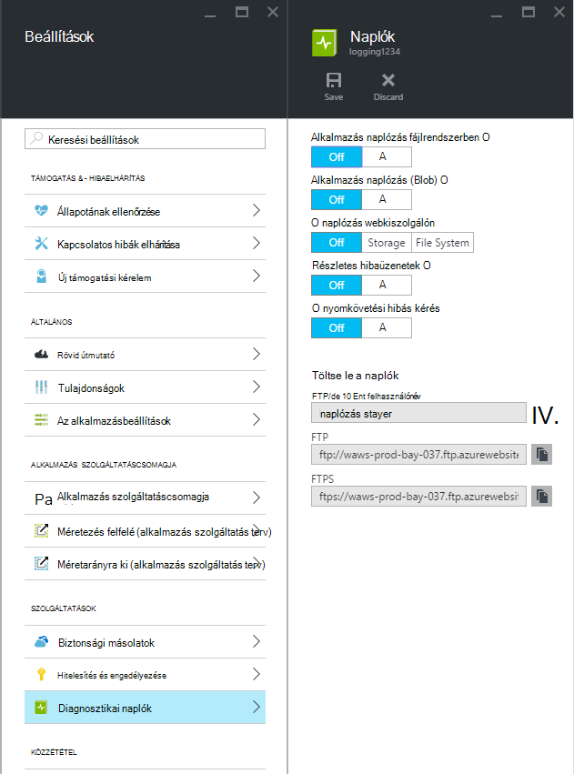
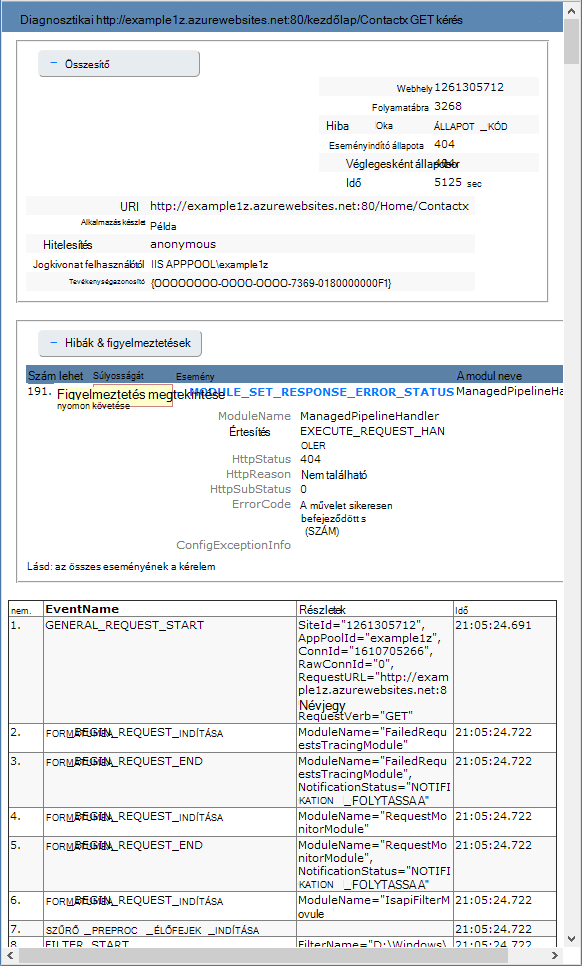

<properties
    pageTitle="Web Apps alkalmazások Azure App szolgáltatásban a diagnosztikai naplózás engedélyezése"
    description="További tudnivalók a diagnosztikai naplózás engedélyezéséhez, és műszerezettségi felvétele az alkalmazás, valamint hogyan érhető el az Azure során információkat."
    services="app-service"
    documentationCenter=".net"
    authors="cephalin"
    manager="wpickett"
    editor="jimbe"/>

<tags
    ms.service="app-service"
    ms.workload="na"
    ms.tgt_pltfrm="na"
    ms.devlang="na"
    ms.topic="article"
    ms.date="06/06/2016"
    ms.author="cephalin"/>

# Web Apps alkalmazások Azure App szolgáltatásban a diagnosztikai naplózás engedélyezése

## – Áttekintés

Azure [alkalmazás szolgáltatás webalkalmazás](http://go.microsoft.com/fwlink/?LinkId=529714)hibakeresési megkönnyítése beépített diagnosztika biztosít. Ebben a cikkben megismerheti, hogy a diagnosztikai naplózás engedélyezéséhez, és műszerezettségi felvétele az alkalmazás, valamint hogyan érhető el az Azure során információkat.

Ez a cikk az [Azure-portálra](https://portal.azure.com), Azure PowerShell és az Azure parancssori kezelőfelületről Azure használja a diagnosztikai naplók használata. Visual Studio segítségével a diagnosztikai naplók használata a további tudnivalókért lásd [A Visual Studióban hibaelhárítási Azure](web-sites-dotnet-troubleshoot-visual-studio.md).

[AZURE.INCLUDE [app-service-web-to-api-and-mobile](../../includes/app-service-web-to-api-and-mobile.md)]

## Webhely kiszolgálói diagnosztika és diagnosztika alkalmazás

Alkalmazás szolgáltatás web Apps alkalmazások naplózási adatait az érintett webkiszolgálóra, mind a webalkalmazás az diagnosztikai funkciókat nyújtson. Ezek logikailag oszthatók **webhely kiszolgálói diagnosztika** és az **alkalmazás diagnosztika**.

### Webhely kiszolgálói diagnosztika

Is engedélyezése vagy letiltása a következő típusú naplók:

- A **Hiba részletes naplózás** - HTTP állapot kódok (állapotkód 400-s vagy újabb) hibát jelző hiba részletes adatait. Határozza meg, miért a kiszolgáló hibakódot a segítő információk állhat.
- **Kérés nyomkövetési sikertelen volt** - sikertelen kérelmek, beleértve a nyomkövetési segítségével dolgozza fel a kérést, és az egyes összetevőknek eltelt idő az IIS összetevő részletes tájékoztatást. Ez akkor lehet hasznos, ha a webhely teljesítményének növeléséhez vagy mi okozza meghatározott HTTP hibák vissza kell elkülöníteni próbál.
- **Webhely kiszolgálói naplózás** - [W3C bővített naplófájl-formátum](http://msdn.microsoft.com/library/windows/desktop/aa814385.aspx)HTTP tranzakciók információt. Ez akkor hasznos, például a kezelt kérések vagy hány kérések az egy adott IP-címet a teljes webhely mértékek meghatározásakor.

### Alkalmazás diagnosztika

Alkalmazás diagnosztika webalkalmazás készített információk rögzítése teszi lehetővé. ASP.NET-alkalmazásokat a [System.Diagnostics.Trace](http://msdn.microsoft.com/library/36hhw2t6.aspx) osztály segítségével információk naplózása a alkalmazás diagnosztika naplóban. Példa:

    System.Diagnostics.Trace.TraceError("If you're seeing this, something bad happened");

Futásidőben meghallgathatja ezeket a naplókat hibaelhárítási segítséget. További információ című [hibaelhárítási Azure webes a Visual Studióban](web-sites-dotnet-troubleshoot-visual-studio.md).

Alkalmazás szolgáltatás web Apps alkalmazások is telepítési információk naplózása, amikor tartalom közzététele webalkalmazást. Ez történik automatikusan, és nincsenek telepítési naplózáshoz konfigurációs beállítások. Telepítési naplózás lehetővé teszi annak megállapítását a miért nem sikerült egy telepítése. Olyan egyéni telepítési parancsfájlt használja, előfordulhat, hogy határozza meg, miért hibás a parancsfájl például használata telepítési naplózás.

## Diagnosztikai engedélyezése

Ahhoz, hogy az [Azure-portálon](https://portal.azure.com)diagnosztika, nyissa meg a lap, a webalkalmazásban, és kattintson a **beállításai > diagnosztikai naplók**.

<!-- todo:cleanup dogfood addresses in screenshot -->

Ha engedélyezi az **alkalmazás diagnosztika** választhat is a **szint**. Ezzel a beállítással a rögzített **tájékoztató**, **Figyelmeztetés** vagy a **hiba** információkra mutató információk szűréséhez. Beállítást a **részletes** kilépteti az alkalmazás által létrehozott összes adatot.

> [AZURE.NOTE] Módosítani szeretné a fájlt, eltérően alkalmazás diagnosztika engedélyezése, és a diagnosztikai naplókban szintek módosítása nem Lomtár alkalmazás tartományt, az alkalmazás fut belül.

[Klasszikus portál](https://manage.windowsazure.com) Web app **beállítása** lapon választhatja **tároló** vagy a **fájlrendszerben** **webkiszolgáló naplózás**. **Tárterület** kijelölésével jelöljön ki egy tárterület-fiókot, majd a blob-tároló, amely a naplókat írt. A **webhely diagnosztika** más naplók csak a fájlrendszerben kerülnek.

A [Klasszikus portál](https://manage.windowsazure.com) Web app **beállítása** lapon van alkalmazás diagnosztika további beállításokat is:

* **Fájlrendszer** – az alkalmazás diagnosztika adatai a web app fájlrendszerben tárolja. Ezek a fájlok FTP elérhető, vagy az Azure PowerShell és Azure parancssori kezelőfelületről Azure segítségével Zip archívumként letöltött.
* **Táblatároló** – az alkalmazás diagnosztika adatai a megadott Azure tárterület-fiókjába, és a tábla nevét tárolja.
* **Blob-tárolóhoz** – az alkalmazás diagnosztika adatai a megadott Azure tárterület-fiókjába, és blob-tárolóban tárol.
* **Az adatmegőrzési időszak** - alapértelmezés szerint naplók nem automatikusan törlődnek **blob-tárolóhoz**. Válassza a **adatmegőrzési beállítása** , és adja meg a megtartandó naplók, ha automatikusan törli a naplók napok számát.

>[AZURE.NOTE] Ha a [tárhely fiókja hívóbetűk újragenerálása](storage-create-storage-account.md#view-copy-and-regenerate-storage-access-keys), kell állítania a megfelelő naplózás konfiguráció frissített billentyűkkel. Ennek módja:
>
> 1. A **beállítás** lapon állítsa be a megfelelő naplózási szolgáltatás **kikapcsolásához**. A beállítás mentéséhez.
> 2. Ismét a tárhely blob-fiók vagy a táblázat naplózás engedélyezése. A beállítás mentéséhez.

Tetszőleges kombinációjával a fájlrendszerben, táblatároló vagy blob-tárolóhoz egyszerre engedélyezhető, és egyedi naplófájl szintű konfigurációk van. Például érdemes útmutatója blob-tároló hosszú távú naplózás megoldásként közben, amely lehetővé teszi a fájl rendszer naplózási szintet a részletes való bejelentkezéshez.

Amíg az összes három tárolási helye a szükséges eseményeket egyszerű ugyanazokat az információkat, **táblatároló** és **blobtárolóhoz** további információk naplózása például példány Azonosítóját, azonosítója szál és naplózás-nél (osztásjelek format) finomabb időbélyeg **fájlrendszerben**.

> [AZURE.NOTE] **Táblatároló** vagy **blob-tárolóhoz** tárolt információk csak azok webböngészőn egy tároló ügyfél vagy egy olyan alkalmazás, amely a következő tároló rendszerek közvetlenül dolgozhat. Visual Studio 2013 tartalmaz egy tároló Explorer feltárása a táblázat vagy blob-tároló használható, és a HDInsight blob-tárolóban lévő adatok eléréséhez. Az alkalmazások az [Azure SDK](/downloads/#)valamelyikével Azure tároló hozzáférő is írhat.

> [AZURE.NOTE] Diagnosztikai is engedélyezhető az Azure PowerShell parancsmaggal a **Set-AzureWebsite** . Ha nem telepítette az Azure PowerShell, vagy nem konfigurálta az Azure-előfizetés használatát, megtudhatja, [hogy miként Azure PowerShell használata](/develop/nodejs/how-to-guides/powershell-cmdlets/).

##Útmutató: naplók letöltése

Diagnosztikai adatok a web app fájlrendszerben tárolt közvetlenül az FTP használatával is elérhető. Is letölthető Azure PowerShell alrendszerrel vagy Azure parancssort Zip archívumként.

A címtár-struktúra a naplókat a tárolt van az alábbi képlettel történik:

* **Alkalmazás naplók** - /LogFiles/alkalmazás /. Ez a mappa alkalmazás naplózás által létrehozott adatokat tartalmazó egy vagy több szöveges fájlt tartalmazza.

* **Nem sikerült a kérelem halad** - / naplófájlok/W3SVC ### /. Ez a mappa tartalmaz egy XSL-fájl, és egy vagy több XML-fájlok. Győződjön meg róla, letöltése az XSL-fájl ugyanabban a könyvtárban be, az XML fájl, mert az XSL-fájl biztosít a formázást, és az XML-fájlokat, ha jelenít meg az Internet Explorer tartalmának szűrési funkciók.

* A **részletes hibanaplók** - /LogFiles/DetailedErrors /. Ez a mappa teljes körű adatokat a HTTP-hibákat, hogy van-e egy vagy több .htm fájlokat tartalmazza.

* A **webhely kiszolgálói naplók** - /LogFiles/http/RawLogs. Ez a mappa egy vagy több [W3C bővített naplófájl-formátum](http://msdn.microsoft.com/library/windows/desktop/aa814385.aspx)formázott szöveg fájlt tartalmazza.

* A **telepítési naplók** - / naplófájlok/mely számjegy. Ez a mappa tartalmazza az Azure webappok által használt belső telepítési folyamatok által létrehozott naplók, valamint mely számjegy telepítésekhez jelentkezik.

### FTP

FTP használatával diagnosztikai adatok eléréséhez keresse fel az **Irányítópult** a web App a [Klasszikus portálon](https://manage.windowsazure.com). **Fontos** területen válasszon a **Diagnosztikai naplók FTP** -hivatkozás a naplófájlok FTP használatával eléréséhez. A **Telepítő vagy FTP-felhasználó** bejegyzés listázza a egy felhasználónevet, amellyel elérhető az FTP-helyre.

> [AZURE.NOTE] Ha a **Telepítő vagy FTP-felhasználó** tétel értéke nem, vagy az elfelejtette a jelszavát, a felhasználó számára, hivatkozásával **telepítési hitelesítő adatok alaphelyzetbe állítása** az **Irányítópult** **fontos** részében létrehozhat egy új felhasználó és a jelszavát.

### Azure PowerShell letöltése

A naplófájlok letöltéséhez indítsa el az Azure PowerShell új példányát, és használja az alábbi parancsot:

    Save-AzureWebSiteLog -Name webappname

Ez a program menti a naplókat, a web App által megadott a **-neve** fájlba paraméter nevű **logs.zip** az aktuális mappában.

> [AZURE.NOTE] Ha nem telepítette az Azure PowerShell, vagy nem konfigurálta az Azure-előfizetés használatát, megtudhatja, [hogy miként Azure PowerShell használata](/develop/nodejs/how-to-guides/powershell-cmdlets/).

### Azure parancssori felülettel letöltése

A naplófájlok parancssori Azure felület használatával letöltéséhez nyissa meg a egy új parancssor, PowerShell, Bash vagy munkamenet, és írja be a következő parancsot:

    azure site log download webappname

Ez a naplókat, a webalkalmazásban nevű "webappname" nevű **diagnostics.zip** az aktuális mappában fájlba menti.

> [AZURE.NOTE] Ha nem telepítette az Azure parancssori kezelőfelületről Azure, vagy nem konfigurálta az Azure-előfizetés használatát, megtudhatja, [hogy miként Azure CLI használja](../xplat-cli-install.md).

## Útmutató: az alkalmazás az összefüggéseket naplók megtekintése

Visual Studio alkalmazás Hírcsatornájában nyújt eszközöket, szűrés és a keresés naplók, valamint használatával történik a naplókat kérések és más eseményeket.

1. Az alkalmazás mélyebb SDK hozzáadása a projekthez, a Visual Studióban.
 * A megoldás Intézőben kattintson a jobb gombbal a projekt, és válassza az alkalmazás az összefüggéseket hozzáadása. Lépések, amelyek tartalmaznak, az alkalmazás az összefüggéseket erőforrás létrehozása a rendszer végigvezeti. [tudj meg többet](../application-insights/app-insights-asp-net.md)
2. A nyomkövetés-figyelő csomag hozzáadása a projekthez.
 * Kattintson a jobb gombbal a projekt, és válassza a NuGet csomagok kezelése. Válassza a `Microsoft.ApplicationInsights.TraceListener` [tudjon meg többet](../application-insights/app-insights-asp-net-trace-logs.md)
3. Töltse fel a projekt, és indítsa el a naplóadatokat létrehozásához.
4. Az [Azure-portálon](https://portal.azure.com/)tallózással keresse meg az új alkalmazás Hírcsatornájában erőforrás, és nyissa meg a **Keresés**gombra. Megjelenik a naplóadatokat a kérést, a használati és a más telemetriai együtt. Néhány telemetriai eltarthat néhány percig, mire eljut az üzenetem a: kattintson a frissítés gombra. [tudj meg többet](../application-insights/app-insights-diagnostic-search.md)

[Többet szeretne tudni az alkalmazás az összefüggéseket a követés teljesítményét](../application-insights/app-insights-azure-web-apps.md)

##Útmutató: adatfolyam naplók

Az alkalmazások fejlesztése, célszerű gyakran közelében valós idejű adatok naplózása megjelenítéséhez. Ez lehet megvalósítani a folyamatos átvitelű a fejlesztői környezet Azure PowerShell vagy a Azure parancssort adatairól.

> [AZURE.NOTE] Az adatfolyamban sorrendje események eredményezhet naplófájl puffer naplózása bizonyos típusú írni. Például az alkalmazás naplóbejegyzés, amely fordul elő, ha a felhasználóról, oldal jelennek meg az adatfolyamban a HTTP megfelelő naplóbejegyzés, oldal kérelem előtt.

> [AZURE.NOTE] A folyamatos átvitelű napló is adatfolyam írt bármely olyan szövegfájl tárolt adatok a **D:\\otthoni\\naplófájlok\\ ** mappát.

### A folyamatos átvitelű Azure PowerShell

Adatfolyam-naplóadatokat, indítsa el az Azure PowerShell új példányának, és használja az alábbi parancsot:

    Get-AzureWebSiteLog -Name webappname -Tail

Ez a web app által megadott fog csatlakozni az **-neve** paraméter és a folyamatos átvitelű információkat a PowerShell ablak naplóbeli események a web App bekövetkezésekor megkezdi. Bármely .txt, .log vagy .htm végződésű a /LogFiles címtárban (d:/Kezdőlap/naplófájlok) tárolt fájlok írt adatok a program a helyi konzolhoz folyamatosan lejátszott.

Bizonyos eseményekhez, például a hibák, szűréséhez használni a **-üzenet** paraméter. Példa:

    Get-AzureWebSiteLog -Name webappname -Tail -Message Error

Egyedi naplófájl típusa HTTP, például szűréséhez használni a **-elérési út** paraméter. Példa:

    Get-AzureWebSiteLog -Name webappname -Tail -Path http

Rendelkezésre álló elérési utak listájának megtekintéséhez - ListPath paraméter használatával.

> [AZURE.NOTE] Ha nem telepítette az Azure PowerShell, vagy nem konfigurálta az Azure-előfizetés használatát, megtudhatja, [hogy miként Azure PowerShell használata](/develop/nodejs/how-to-guides/powershell-cmdlets/).

### A folyamatos átvitelű az Azure parancssor

Adatfolyam-naplóadatokat nyissa meg egy új parancssor, PowerShell, Bash vagy munkamenet, és írja be a következő parancsot:

    azure site log tail webappname

Ez a web app, "webappname" nevű kapcsolódni, és kezdje el a folyamatos átvitelű információk az ablak, mint naplóbeli események fordulhat elő, a web App. Bármely .txt, .log vagy .htm végződésű a /LogFiles címtárban (d:/Kezdőlap/naplófájlok) tárolt fájlok írt adatok a program a helyi konzolhoz folyamatosan lejátszott.

Bizonyos eseményekhez, például a hibák, szűréséhez használni a **– szűrő** paraméter. Példa:

    azure site log tail webappname --filter Error

Egyedi naplófájl típusa HTTP, például szűréséhez használni a **– elérési út** paraméter. Példa:

    azure site log tail webappname --path http

> [AZURE.NOTE] Ha nem telepítette az Azure parancssori felület, vagy nem konfigurálta az Azure-előfizetés használatát, megtudhatja, [hogyan szeretné használni Azure parancssor](../xplat-cli-install.md).

##Útmutató: megérteni a diagnosztikai naplók

### Alkalmazás diagnosztikai naplók

Diagnosztika alkalmazás adatait tárolja a .NET-alkalmazásokat, attól függően, hogy tárolhat naplók a fájlrendszerben, táblatároló vagy blobtárolóhoz egy bizonyos formátumban. Az alapszinten tárolt adatok megegyezik a három tároló diagramtípusokat – a dátum és idő az esemény bekövetkezett, a folyamat Azonosítót, amely az eseményt, az esemény típusa (információk, figyelmeztetés, hiba) és az esemény üzenet előállított keresztül.

__Fájlrendszerben__

Minden sor naplózza a fájlrendszerben vagy a folyamatos átvitelű használatával kapott lesz a következő formátumban:

    {Date}  PID[{process id}] {event type/level} {message}

Ha például hibaként tűnik, az alábbihoz hasonló:

    2014-01-30T16:36:59  PID[3096] Error       Fatal error on the page!

A naplózás a fájlrendszerben a rendelkezésre álló háromféleképpen, csak az idő, a folyamat azonosítója, a esemény szint és a üzenet nyújtó legalapvetőbb adatokat tartalmazza.

__Táblatároló__

Táblatárolóhoz bejelentkezéskor további tulajdonságokat megkönnyítése keresése az a tábla, valamint a részletesebb információkat az esemény tárolt adatok használhatók. A következő tulajdonságokat (oszlopokat) tárolt a táblázat minden egyes entitás (sor) segítségével.

Tulajdonság neve|Érték/formázása
---|---
PartitionKey|Dátum/idő az esemény yyyyMMddHH formátumban
RowKey|Globálisan egyedi azonosítója érték, amely a szervezet egyedi módon azonosító
Időbélyeg|A dátum- és az esemény bekövetkezett.
EventTickCount|A dátum és időpont, amikor az esemény történt osztásjelek formátumban (nagyobb pontosság)
ApplicationName|A webes alkalmazás neve
Szint|Esemény szint (például hiba, figyelmeztetés, információ)
EventId|Ez az esemény esemény azonosítója

0, ha nincs megadva, az alapértelmezett érték
InstanceId|A web App alkalmazásban, hogy a páros-e a példányának
Termékazonosító|Folyamat azonosítója
TID|Az esemény előállított szál azonosítója szál
Üzenet|Esemény részletei üzenet

__BLOB-tárolóhoz__

Amikor bejelentkezik blob-tároló, az adatok vesszővel elválasztott értékek (CSV) formátumban vannak tárolva. Hasonló táblatárolóhoz, további mezők be van jelentkezve az esemény további részletes adatokat. A következő tulajdonságokat a CSV-fájlok minden egyes sorához használatosak:

Tulajdonság neve|Érték/formázása
---|---
Dátum|A dátum- és az esemény bekövetkezett.
Szint|Esemény szint (például hiba, figyelmeztetés, információ)
ApplicationName|A webes alkalmazás neve
InstanceId|A web App alkalmazásban, amely az esemény példányának
EventTickCount|A dátum és időpont, amikor az esemény történt osztásjelek formátumban (nagyobb pontosság)
EventId|Ez az esemény esemény azonosítója

0, ha nincs megadva, az alapértelmezett érték
Termékazonosító|Folyamat azonosítója
TID|A szál előállított az esemény azonosítója szál
Üzenet|Esemény részletei üzenet

Az blob tárolt adatok jelenne meg az alábbihoz hasonló:

    date,level,applicationName,instanceId,eventTickCount,eventId,pid,tid,message
    2014-01-30T16:36:52,Error,mywebapp,6ee38a,635266966128818593,0,3096,9,An error occurred

> [AZURE.NOTE] Az első sor a napló is tartalmaz az oszlopfejléceket, mint ebben a példában jelöli.

### Nem sikerült a kérelem nyomkövetések.

Nem sikerült kérelem nyomkövetések __fr ### .xml__nevű XML-fájlok tárolja. A naplózott adatok könnyebb __freb.xsl__ nevű XSL-stíluslap megadva az XML-fájlok ugyanabban a mappában. Nyissa meg az XML-fájlok közül az Internet Explorer a kell használni az XSL-stíluslap segítségével a nyomkövetési információk formázott megjeleníthetők. Ezzel jelenik meg az alábbihoz hasonló:

### Részletes hibanaplók

Részletes hibanaplókat további információt adja meg, hogy van-e a HTTP-hibák HTML-dokumentumokból. Mivel egyszerűen a HTML-dokumentumokból, azokat megtekintheti webböngészőn keresztül.

### Webhely kiszolgálói naplók

A webhely kiszolgálói naplókat vannak formázva, a [W3C bővített naplófájl-formátum](http://msdn.microsoft.com/library/windows/desktop/aa814385.aspx). Ez az információ szövegszerkesztővel vagy elemzett, például a [Napló elemző](http://go.microsoft.com/fwlink/?LinkId=246619)segédprogramok is olvashatók.

> [AZURE.NOTE] A naplók Azure webappok által gyártott az __s-számítógépnév__, __s-ip__vagy __cs verziójú__ mező használatát támogatja.

##Következő lépések

- [Web Apps alkalmazások figyelése](/manage/services/web-sites/how-to-monitor-websites/)
- [A Visual Studióban a Azure web Apps alkalmazások – hibaelhárítás](web-sites-dotnet-troubleshoot-visual-studio.md)
- [Elemzése HDInsight naplózza web App alkalmazásban](http://gallery.technet.microsoft.com/scriptcenter/Analyses-Windows-Azure-web-0b27d413)

> [AZURE.NOTE] Ha azt szeretné, mielőtt feliratkozna az Azure-fiók használatbavételéhez Azure alkalmazás szolgáltatás, [Próbálja meg alkalmazás szolgáltatás](http://go.microsoft.com/fwlink/?LinkId=523751), ahol azonnal létrehozhat egy rövid életű starter web app alkalmazás szolgáltatásban megnyitásához. Nem kötelező, hitelkártyák Nincs nyilatkozatát.

## Mi változott
* Módosítása egy segédvonalat a webhelyekre alkalmazás szolgáltatáshoz lásd: [Azure alkalmazás szolgáltatás, és a hatás a meglévő Azure-szolgáltatások](http://go.microsoft.com/fwlink/?LinkId=529714)
* Egy segédvonalat a változás az új portálra a régi portál lásd: [Összefoglalás: a Navigálás az Azure-portálra](http://go.microsoft.com/fwlink/?LinkId=529715)
 
