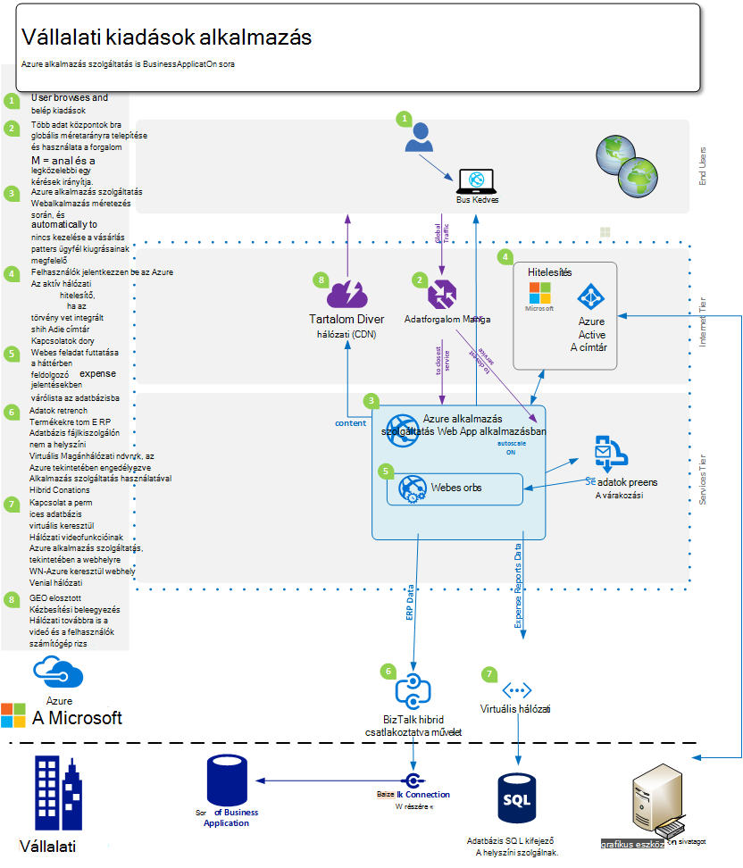
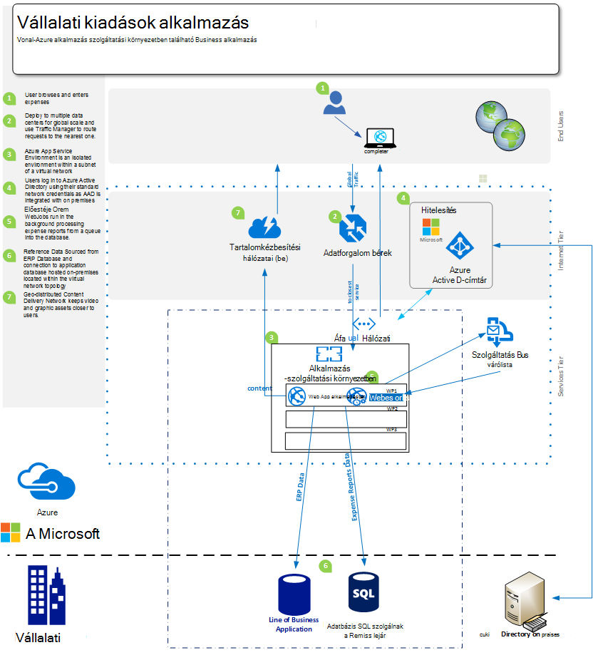
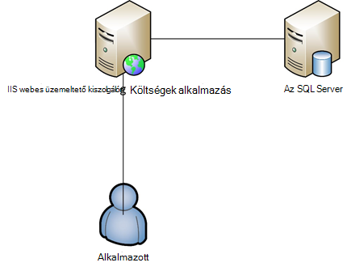

<properties 
    pageTitle="Azure alkalmazás Web Apps alkalmazások Szolgáltatásajánlatok nagyvállalati" 
    description="Bemutatja, hogyan Azure alkalmazás szolgáltatás Web Apps alkalmazások használata a vállalati webhely megoldások vállalati létrehozásához." 
    services="app-service\web" 
    documentationCenter="" 
    authors="apwestgarth" 
    manager="wpickett" 
    editor=""/>

<tags 
    ms.service="app-service-web" 
    ms.workload="web" 
    ms.tgt_pltfrm="na" 
    ms.devlang="na" 
    ms.topic="article" 
    ms.date="07/29/2016" 
    ms.author="anwestg"/>

# Azure alkalmazás Web Apps Szolgáltatásajánlatok a vállalati szeretne #

Költségek csökkentése és az IT-megoldásokat gyorsabb előadása a gyorsan változó környezetben szükséges a fejlesztők, az informatikai szakemberek és a menedzserek hoz létre új kihívásokkal kapcsolatban. Felhasználók egyre keres a vállalati vonal (üzleti) webalkalmazásokban gyors, válaszol és érhető el, bármilyen eszközről. Egy időben vállalkozások próbálja a hatékonyság növelése és integráció a felhőben, és a mobil szolgáltatások érkező hatékonyság ez, előfordulhat, hogy valami egyszerűen, az egyszeri bejelentkezés minden eszközön, az Active Directory használatával szeretne együttműködésre az Office 365-ben egy belső üzleti alkalmazás, amely viszont gyűjti össze a Salesforce vállalat végrehajtásának származó adatokat a lekért adatok felhasználásával. [Azure alkalmazás szolgáltatás Web Apps alkalmazások](http://go.microsoft.com/fwlink/?LinkId=529714) egy vállalati szintű felhőalapú szolgáltatás fejlesztése, tesztelése és webes és a mobilalkalmazások, a webes API-hoz és a általános webhelyek működő. Vállalati webhelyek, a intranet webhelyek, a vállalati alkalmazások és a digitális marketingkampányok futtatásához a globális hálózaton a méretezés és elérhetőség együtt folyamatos integrációs támogatása optimalizálva adatközpontokkal használható, és modern DevOps eljárásokat.  

A szeretne kiemeli a [Web Apps alkalmazások](/services/app-service/web/) szolgáltatás kifejezetten csak a LOB webalkalmazások áttelepítési meglévő webalkalmazások és üzembe új üzleti webalkalmazások platformon futó képességeit. 

## A célközönség ##

Informatikai szakemberek számára, építészek és menedzserek, akik áttelepítése a helyszíni az éppen futó felhőalapú webes feladatok keresi. Webes munkaterhelésekből is kiterjedhet, üzleti alkalmazotthoz vagy vállalati webalkalmazás partnerek számára.

## – Bevezetés ##

Alkalmazás szolgáltatás Web Apps alkalmazások egy ideális platform, amelyen tárolni a belső és külső webalkalmazások és a szolgáltatások, így idő jelentős mennyiségű kiadások helyett a felhasználók üzleti eredmény előadásához koncentráljon költséghatékony, nagyon méretezhető, felügyelt megoldást biztosít, és pénzt fenntartása és támogató külön környezetben. Web Apps alkalmazások kínál egy rugalmas platform, amelyen telepíteni a vállalati webalkalmazások, az azt jelenti, hogy a helyszíni Active Directory-keresztül integráció a Microsoft Azure Active Directory hitelesítő továbbra is kínál, így könnyen és gyorsan telepítések támogatja a belső folyamatos integráció és üzembe eljárások, miközben automatikus méretezés az üzleti igények - összes platformon felügyelt, amely lehetővé teszi, hogy az alkalmazás és a nem a infrastruktúra a fókusz a projektvezetői felhasználása. 

## Probléma meghatározása ##

Az informatikai fekvő gyorsan változik, akkor a hagyományos kiszolgálókon szolgáltatója a magas tőke költségeket az igény szerinti használó egy hosszú átfutási idejét távolabb áthelyezése használja, hogy miként kezelje a betöltés automatikusan átméretezheti a szolgáltatások. Informatikai részlegeknek sor alatt kerül, csökkentheti a költség és infrastruktúra és karbantartásokat helyigénye töltött CAPEX csökkentése közben is a agility növelése egy kiemelve. Régebbi infrastruktúra platformok, például a Windows Server 2003, élettartama végén van vezető informatikai részlegeknek, tekintse át a felhőalapú áttelepítési új hosszú távú tőke költségek elkerülésére lehetséges módja. Az elmúlt CIOs volna döntések vásárlási más részlegekhez; azonban egyre CMOs és a más üzleti egység előzetes telik hogyan azok a költségvetés mekkora tölti, és mi az a befektetés megtérülése több aktív szerepet. Vállalkozások egyre, távolról dolgozik, több időt kiadások rendszerek teljesen ingyenes hozzáférést igénylő vevőkkel alkalmazottakkal sokkal mobil, mint eddiginél kell a munkaerő van szükség.

Üzleti igények havi, heti, napi. Vállalkozások azonnali globális méretezés, a rendszeres frissített teljes új funkciók belső vagy harmadik fél által biztosított szolgáltatások keres.  Bizonyos esetekben vállalkozások is keres az alkalmazásaikat azonosíthatók, és erőforrások elérését, miközben is kezdeményezhet funkciók használata nyilvános felhő létesítményekhez. Felhasználója újabb várakozásoknak, a szolgáltatások, például az Office 365-ben a saját személyes nyújt a sok felhasználásával. A saját munka életben hasonló, naprakész, szolgáltatás gazdag szolgáltatáshoz hozzáférjen elvárt. Ezt igény szerint kezelésében informatikai kell ahhoz, hogy a kijelölés és integráció a harmadik féltől származó keresztül a vállalkozás érdekében megjelenés szolgáltatások, ügyeljen kijelölésének platformokon, amely is alkalmassá teheti az üzleti igények, miközben még tulajdonjogot csökkentett teljes költségét a megbízható.

A fejlesztői csoport azonnali üzleti kedvezménye, új funkciók előadásához rendszeres időközönként előadásához keresi. Tényleges költség, a megbízható platform, amely integrálódik a meglévő eszközök és eljárások – fejlesztése, próba keresnek, engedje fel; és informatikai részlegeknek együtt munka automatizálja a telepítés, kezelése és riasztási, az összes nulla legrövidebb leállás céljával.

<a href="highlevel" />
## Magas szintű megoldás ##

Webes platformokon és keretek egyre használják fejlesztése, tesztelése és üzleti üzemeltetni.  Az üzleti alkalmazások, például egy belső alkalmazott kiadások rendszer tipikus vonallal gyakran álló kizárólag a web app biztonsági mentése az adatbázis tárolja az adatokat, az alkalmazás kapcsolódik.

Alkalmazás szolgáltatás Web Apps így egy jó ilyen kérelmek szolgáltatója kínáló méretezhető és megbízható infrastruktúra, amely felügyelt és a nulla beavatkozás és legrövidebb leállás közelében javítással. A Microsoft Azure platform számos a Web Apps alkalmazások Microsoft Azure SQL-adatbázissal, felügyelt méretezhető relációs adatbázis-mint-a-szolgáltatás, a népszerű szolgáltatások, például ClearDB MySQL-adatbázishoz, és MongoDB a partnertől is webalkalmazások támogatási adattárolási beállításainak ismertetése

Alternatív módszer, hogy a helyszíni meglévő befektetés használja. A példa az esetben egy alkalmazott kiadások rendszer, előfordulhat, hogy kívánt karbantartása: az adatok áruház saját belső infrastruktúrát belül. A belső rendszerekkel (jelentéskészítési bérszámfejtő, számlázás stb.), vagy az informatikai irányítási követelmény integrációs lehet.  Web Apps alkalmazások többféle módszer, hogy csatlakozzon a a helyszíni környezetbe infrastruktúra engedélyezésekor:

- [Alkalmazás-szolgáltatási környezetben](app-service-app-service-environment-intro.md) - alkalmazás szolgáltatási környezetben (SKB) új prémium verzió szolgáltatása, amely utoljára lett hozzáadása a Microsoft Azure alkalmazás szolgáltatás egyesíti.  A szükséges ASEs egy teljesen elszigetelt és dedikált környezet biztonságosan futtatásáról Azure alkalmazás szolgáltatás alkalmazások magas skála közben is kínáló elkülönítési és biztonságos hálózati hozzáférés   
- [Hibrid kapcsolatok](../biztalk-services/integration-hybrid-connection-overview.md) – hibrid kapcsolatokat egy olyan Microsoft Azure BizTalk Services szolgáltatás, és Web Apps alkalmazások való csatlakozáshoz helyszíni erőforrások biztonságosan, így például SQL Server, MySQL, webes API-k és egyéni webszolgáltatásokhoz engedélyezése. 
- [Virtuális hálózati integrációval](https://azure.microsoft.com/blog/2014/09/15/azure-websites-virtual-network-integration/) – Web Apps alkalmazások funkciók integrálása az Azure virtuális hálózati lehetővé teszi a webalkalmazás csatlakoztatása egy Azure virtuális hálózat, amely viszont kapcsolhat össze a a helyi infrastruktúra-webhely virtuális Magánhálózaton keresztül. 

A következő diagramok jelzik egy példa magas szintű megoldás helyiségek, erőforrások szolgáló csatlakozási beállításokat.  Az első példa bemutatja, hogyan Ez lehet elérni Azure alkalmazás szolgáltatás a szokásos funkcióival, és a második jeleníti meg, hogy miként lehet elérni a prémium kínáló, az alkalmazás-szolgáltatási környezetben használja.

Szabványos alkalmazás szolgáltatás funkción keresztül:

Az alkalmazás-szolgáltatási környezetben használja:

## Vállalati verzió előnyeit. ##

Alkalmazás szolgáltatás Web Apps tartalmaz az üzleti előnyeit, amely lehetővé teszi a függvény sokkal több költséghatékony és az üzleti igények előadásához az Agilis rengeteg. 

### PaaS modell ###

Alkalmazás szolgáltatás Web Apps szolgáltatás modellben, amely költség és hatékonyság megtakarítási számos beépített platformon.  Már nem szükséges töltött órák VMs kezelése, operációs rendszerek és keretek javítása. Web Apps alkalmazások automatikusan javítással környezetben, amely lehetővé teszi a webalkalmazások és nem VMs, adjon meg további üzleti értéket szabadon csapatok elhagyása kiemelése.

A Web Apps alkalmazások alátámasztása PaaS modell lehetővé teszi, hogy a kitűzött célok teljesítéséhez DevOps módszereket orvosok. Egy üzleti Ez azt jelenti, teljes kezelési és az alkalmazás teljes életciklusának, beleértve a fejlesztési, tesztelés, megjelenés, figyelése és felügyeleti és támogatási egész integráció. 

A fejlesztői csoport folytonos integráció és üzembe munkafolyamatok Visual Studio Team Services, GitHub, TeamCity, Hudson vagy BitBucket, automatikus fejlesztése, tesztelése és segítségével, így gyorsabban megjelenés ciklus, míg a súrlódás csökkentése részt a meglévő infrastruktúra felengedése telepítési engedélyezése beállíthatók. Web Apps is támogat több tesztelése és előkészítése a Megjelenés munkafolyamat-verziót tartalmazó környezetek létrehozását, már nem kell foglalni vagy hardver kiosztani a következő célokra, annyi környezetekben szeretne, és meg saját munkafolyamat engedje fel az előléptetés hozhat létre. Úgy dönt, sikerült az adatforrás-vezérlő egy próba tárolóhely kiadás, végezze el a tesztet és sikeres befejezését követően sorozat üzleti egy stage tárolóhely előléptetés, és végül a nincs leállás további előnye, hogy a Web Apps alkalmazásokban is webalkalmazások előzetesen betöltött és melegvíz ahhoz, hogy a legjobb lehetőség felhasználói élmény a termelési felcserélése.  Ezenkívül vállalkozások fel, hogy irányítsa át egy másik tárolóhely forgalmat egy része, a módosításokat, az érvényesítés előtt minden forgalom átirányítása az új telepítési és visszatérés az előző példányhoz minden forgalom az alkalmazás szolgáltatás Web Apps alkalmazások gyártás lehetőségeit a tesztelés használata. 

Műveletek csapatok benne, hogy azok a legjobb lehetőség pozícióban bármelyik a Web Apps alkalmazásokban is a beépített webalkalmazásokban reagálni kapcsolatos problémák megoldásához úgy érzi is a figyelés és értesítések funkciók. Érdemes műveletek csapatok van már fekteti analitikai és a Microsoft Visual Studio alkalmazás hírcsatornájában, új Relic és AppDynamics ilyen felügyeleti megoldások. A Web Apps alkalmazások folytonosságot és egy már jól ismert környezetekben, amelyből figyelheti a webalkalmazások engedélyezése ezek is teljesen támogatottak.

Végül a Web Apps alkalmazások automatikusan készítsen biztonsági másolatot a app(s) szolgáltatásokat biztosít, és a szolgáltatott adatbázis(ok) közvetlenül az Azure Blob-tárolóhoz tároló. Egyszerű módon, és a nagyon költség hatékony módszert, amellyel katasztrófa, a helyiségek hardver- és a komplex szükségességének csökkentése helyreállítása, amelyekből.

### Áttelepítési Kezeléstechnikai ###

Hardver karbantartás és elforgatása megegyezik egy főbb probléma a nagyvállalatok számára a hardver és operációs rendszerek megjelenés ciklus gyorsítása. Esetleg is van a Windows Server 2003 R2 kiszolgálók, amelyek a Skype 2015 vállalati támogatási végére származnak, de továbbra is üzemeltet, azok a vállalati kulcs webalkalmazások? Alkalmazás szolgáltatás Web Apps egy nagy jelölt ki a webes alkalmazásokat, és az, hogy az üzleti hardver birtok ésszerűsítése. Web Apps alkalmazások férhet hozzá egy cellatartomány hardver előírások, amelyek felügyelt és karbantartani a szolgáltatást, így nem kell a infrastruktúra költségvetés részeként a csere és felügyeletéhez kapcsolódó költségek tényező részeként.  Áttelepítési is mindössze egy másolatot, és illessze be művelet a meglévő üzembe a Web Apps alkalmazások vagy összetettebb áttelepítést, ahol a Web Apps áttelepítés Segéd használata hozzáadja értéket. A webalkalmazások áttelepített Azure szolgáltatásokkal, a webalkalmazások további szolgáltatások integrálása a teljes dokumentumhasználat örömének érdekében. Például akkor is érdemes Azure Active Directory számára a felhasználói szövetség biztonsági csoportoknak alapján alkalmazás való hozzáférés szabályozása. Egy másik példa a teljesítmény javítása és csökkentése a késés, nyújtó gyorsítótár-szolgáltatások teljes felhasználói felület még jobb kell hozzáadása. 

### Vállalati osztály szolgáltatónál ###

Alkalmazás szolgáltatás Web Apps egy stabil, megbízható platform, amelyek már engedélyezni szeretné kezelni az üzleti számos különböző kell az kis belső fejlesztés és a próba-munkaterhelésekből, méretezett nagyon magas forgalom webhelyeket biztosít. Web Apps alkalmazások használatával készít felhasználhatja a vállalati azonos osztály üzemeltetési platform Microsoft vállalata használja a magas érték webes munkaterhelésekből. Web Apps alkalmazások együtt az Azure platform, a szolgáltatások biztonsági és szabályozói követelmények, például az ISO (ISO/IEC 27001:2005); kialakításának SOC1 és SOC2 SSAE 16/ISAE 3402 tanúsítványok, HIPAA BAA, PCI és Fedramp minden elemet, valamint a szolgáltatásról további információt a központi című [http://aka.ms/azurecompliance](/support/trust-center/compliance/). 

Microsoft Azure platform lehetővé teszi, hogy a szerepkör alapján engedélyezési vezérlők segítségével, így a Web Apps alkalmazások erőforrásainak vezérlő vállalati szintű. RBAC kínálja környezetbe a végrehajtásához saját access adatkezelési házirendek az összes eszközeinek Azure környezetben, felhasználók hozzárendelése a csoportok, és a szükséges engedélyekkel ezekhez a csoportokhoz szemben az eszközre, például a megfelelő web App alkalmazásban. Azure-ban RBAC kapcsolatos további tudnivalókért olvassa el a [http://aka.ms/azurerbac](../active-directory/role-based-access-control-configure.md)című témakört. Web Apps alkalmazások használatával biztos lehet a webalkalmazások biztonságos környezetben van telepítve, és a teljes hozzáférés mely területére eszközeit van telepítve van. 

Azure alkalmazás környezetek [http://aka.ms/aseintro](http://aka.ms/aseintro) egy új támogatási szolgáltatás terv beállítás a kívánó használja az Azure alkalmazás szolgáltatás előfizetőinek, és ezek adják meg egy teljesen elszigetelt és saját környezetben.  A szolgáltatás lehetővé teszi, hogy kihasználhassa nagyon magas skála miközben is a bejövő és kimenő hálózati forgalmának engedélyezésére teljes hozzáféréssel rendelkező alkalmazások telepítéséhez vállalati felhasználóknak, és ASEs tudják az alkalmazások nagy sebességű biztonságos kapcsolatokkal rendelkezik a helyszíni forrá virtuális hálózatokon.

Alkalmazás szolgáltatás Web Apps alkalmazásokban is kell használniuk teljes a helyszíni környezetbe a befektetés a kapcsolódási lehetőség a belső erőforrások, például a adatraktár vagy a SharePoint online-környezetben való biztosításával. [Magas szintű megoldás](#highlevel) ismertetett módon teheti a helyszíni környezetbe infrastruktúra és szolgáltatások kapcsolatot létesít hibrid kapcsolatok és a virtuális a hálózati kapcsolat használatával.

### Globális skála ###

Alkalmazás szolgáltatás Web Apps a globális és méretezhető platform engedélyezése a webalkalmazások, a nagyobb, és az egyéni igényeknek növekvő üzleti gyorsan és a minimális hosszú távú tervezés és a költség alkalmazkodik. Tipikus, a helyiségek infrastruktúra alkalmazási eseteit, kiterjesztett és igény szerinti növekedése egyaránt helyileg és földrajzilag volna kezelése, a tervezési és a kiadásokat kiépítése nagy mennyiségű megkövetelése és kezelheti infrastruktúrájának bővítéseit. Web Apps lehetővé teszi a webalkalmazások ebb és mozgása az igényeknek megfelelően alakíthatja a méretezés. Például használatával a költségek alkalmazás szerepel példaként, a hónap, a legtöbb a felhasználók egyszerűsített felhasználók az alkalmazás, hanem a határidő havonta kell megadni a költség beküldött elemek processzorhasználata az alkalmazást, Web Apps alkalmazások képes további infrastruktúra az alkalmazás automatikusan kiépítése és majd után a használatát subsided van újra azt is méretezhető vissza az eredeti infrastruktúra definiálása.

Web Apps alkalmazások globálisan világszerte és növekvő 24 adatközpont esetén érhető el. A legfrissebb listáját, a régiók és helyét olvassa el a [http://aka.ms/azlocations](http://aka.ms/azlocations)című témakört. Web Apps, az üzleti egyszerűen érhet el globális vannak és méretezése. Növekedésével a vállalat új részre, a jelentéskészítési használt alkalmazás irányítópultok és Web Apps alkalmazások állomáson egyszerűen elvégezhető további adatközpontokkal be, és sokkal gyorsan a Web Apps, ha minden további előnye a méretezhető infrastruktúra való szerződést, és bontsa ki a regionális irodák módosítása az egyéni igényeknek, alatt, az Azure forgalom Manager keresztül a helyi felhasználók szolgálnak.
 
## Megoldás részletei ##

Példa egy áttelepítési alkalmazás forgatókönyv nézzük meg. Ez azt ismerteti, hogy hogyan alkalmazás szolgáltatás Web Apps alkalmazások szolgáltatások jár közös kiváló megoldás és üzleti eredmény megadására részleteit.
 
Ebben a példában egész üzleti alkalmazás meg azt a sor az alkalmazás, amely lehetővé teszi az alkalmazottaknak, hogy a költségek visszatérítési elküldése a jelentéskészítés kiadások. Az alkalmazás Windows Server 2003 R2 rendszerben futó IIS6 üzemelteti, és az adatbázis SQL Server 2005 adatbázis. Az OK azt válassza a régebbi kiszolgáló húzódik az elkövetkező vége a szolgáltatást a Windows Server 2003 R2 és SQL Server 2005, és a [eszközök](http://aka.ms/websitesmigration) és [útmutatást](http://aka.ms/websitesmigrationresources) az Azure munkaterhelésekből automatikusan áttelepítendő. Annak szem előtt a mintázat ebben a példában egy áttelepítési forgatókönyvek széles verity vonatkoznak. 

### Meglévő alkalmazás áttelepítése ###

Az általános megoldás egy a vállalati verzió alkalmazás Web Apps alkalmazások áthelyezése egyik lépésként meglévő alkalmazás eszközök és architektúra. Ez a papír példája egy ASP.NET webalkalmazás is egyetlen IIS-kiszolgáló adatbázis-kezelő külön SQL-kiszolgálón található az alábbi ábrán látható módon. Alkalmazottak jelentkezzen be a rendszer felhasználónév és jelszó együttes használatával, adja meg adatait a költségek és recepteket, beolvasott példányainak feltölteni az adatbázist, mindegyik elemhez költség. 
 

#### Elemek szempontok ####

Ha helyszíni környezetben áttelepítési alkalmazás, célszerű szem előtt kell tartania, néhány Web Apps alkalmazásokat kényszerek. Íme néhány lényeges Web Apps alkalmazások ([http://aka.ms/websitesmigrationresources](http://aka.ms/websitesmigrationresources)) webalkalmazások áttelepítéséhez fő témakörök:

-   Port kötések – Web Apps alkalmazások csak támogatja a 80-as port HTTP- és HTTPS-forgalom 443-as port. Ha az alkalmazás bármely más olyan portot használja, akkor egyszer áttelepítése az alkalmazás tesz a 80-as port felhasználása HTTP- és HTTPS-forgalom 443-as port. Ez a jelenség gyakran egy érintetlen, mert a közös, hogy a helyszíni telepítések fejlesztés és próba környezetben különösen a tartománynevek használata megoldása érdekében különböző portok használata
-   Hitelesítés – Web Apps alkalmazások támogatja a névtelen hitelesítés alapértelmezés szerint és űrlapok hitelesítési jelölt egy alkalmazást. Web Apps alkalmazások Windows-hitelesítés is kínálhatnak, amikor az alkalmazás integrálva van Azure Active Directory és ADFS csak. Egy funkció, amelyek részletesen tárgyalja: az [alábbi](http://aka.ms/azurebizapp) 
-   GAC alapú összeállítások – Web Apps alkalmazások nem teszi lehetővé az összeállítások a globális összeállítási gyorsítótár (GAC) történő telepítését. Ezért, ha az alkalmazás áttelepítendő él Ez a funkció a helyszíni, fontolja meg, a bin mappát az alkalmazás a szerelvények áthelyezése.
-   IIS5 Kompatibilis üzemmód – a Web Apps alkalmazások nem támogatják a IIS5 kompatibilis üzemmód, és ilyenként egyes Web Apps-példányok és a szülő Web Apps-példány a webalkalmazások futnak ugyanazt a munkafolyamat egy egyetlen alkalmazáskészlet belül.
-   A COM-tárak – Web Apps alkalmazások használatát nem teszi lehetővé a COM-összetevők regisztrálása az platformon. Ezért az alkalmazás lehetővé teszi a COM összetevők használata, ha ezek a felügyelt kódot kell írni kimutatásadatokat, és az alkalmazással rendszerbe.
-   ISAPI szűrők – ISAPI szűrők Web Apps alkalmazások nem használható. Ezeket az alkalmazás részét képező telepíteni kell, és a webalkalmazás fájlt regisztrált. További tudnivalókért olvassa el a [http://aka.ms/azurewebsitesxdt](web-sites-transform-extend.md)című témakört. 

Miután az alábbi témakörök minősülnek voltak, a webalkalmazás készen áll a felhőben kell lennie. Ne aggódjon, és ha súgótémakörökben teljesen nem teljesül, az áttelepítési eszköz való áttelepítés legjobb munkamennyiség képet ad. 

A következő az áttelepítési folyamatot szereplő lépések az alkalmazás szolgáltatás web app és Azure SQL-adatbázis létrehozása. Web Apps-példányok Processzormagok változó számú több méretét, és RAM összegeket érhető el, jelölje be a webes alkalmazások követelmény alapján. További információk és árak, lásd: [http://aka.ms/azurewebsitesskus](/pricing/details/websites/). Hasonlóképpen a Microsoft Azure SQL-adatbázissal az összes olyan az üzleti igények különböző szolgáltatási rétegek és teljesítményszint követelmények teljesítése caters. További információ a [http://aka.ms/azuresqldbskus](/pricing/details/sql-database/)találhatók. Létrehozása után az alkalmazás alkalmazás szolgáltatás Web Apps, vagy FTP- vagy WebDeploy keresztül feltöltött, és helyezze az adatbázis alakzatot.

Az áttelepítés a megoldást Azure SQL-adatbázissal, de nem támogatott Azure csak adatbázist, amely használja. Cégek is teheti a MySQL, MongoDB, Azure DocumentDB használatát és számos más bővítmények, amely az [Azure áruházban](/marketplace/partner-program/)megvásárolható keresztül. 

Azure SQL-adatbázis létrehozása egy meglévő adatbázis létrehozása egy meglévő adatbázis használata az [adatok szintű alkalmazás exportálása és importálása](http://aka.ms/dacpac)parancsfájl a helyszíni Server importálandó több lehetőség érhetők el. 

Költségek alkalmazás adatbázis készült: hozzon létre egy új Azure SQL-adatbázissal, SQL Server Management Studio használ, és egy parancsprogramot, majd futtassa a adatbázishoz való csatlakozáskor összeállítása az adatbázissémát, és töltse ki a helyszíni adatbázisból származó adatok.

Az első szakaszban az áttelepítési utolsó lépéseként szükséges, az alkalmazás az adatbázishoz a csatlakozási_karakterlánc frissítése. Ez az Azure portálon keresztül érhető el. Az egyes web app alkalmazás bizonyos beállítások, beleértve a minden kapcsolat karakterláncok bármely használatban adatbázishoz szeretne kapcsolódni az alkalmazás által használt módosíthatók.

### Azure SQL-adatbázis használata kiváltása ###

Az Azure platform számos Azure SQL-adatbázis használata alkalmazások elsődleges webhelyadatbázisokban kiváltása, azaz engedélyezése különböző munkaterhelésekből: az használja az NoSQL megoldás vagy ahhoz, hogy a platform, a vállalati verzió adatok igényeinek. Például egy üzleti adatok, amelyek nem kell tárolni, előfordulhat, hogy tartsa lenyomva a helyszínen, vagy egy nyilvános felhőalapú környezetben, és ezért jelenne meg szeretné őrizni a helyszíni adatbázis használata.

#### Kapcsolat a helyszíni környezetbe erőforrások ####
Alkalmazás szolgáltatás Web Apps az adatbázisok, például a helyi erőforrások csatlakozhat több lehetőséget kínál engedélyezése a meglévő magas érték infrastruktúra újrafelhasználása. A lehetőségek állnak az alábbiak:

- Alkalmazás környezetek elszigetelt és létrehozott egy virtuális hálózat alhálózat, ezért engedélyezése a környezet használatával kommunikál a virtuális hálózatához - [http://aka.ms/appserviceasenetworking](http://aka.ms/appserviceasenetworking) található személyes végpontok
- Web Apps alkalmazások virtuális hálózati integrációval Web Apps alkalmazások és -Azure virtuális hálózati hozzáférést virtuális hálózatához, amelynek, ha a webhely VPN, a helyi hálózaton kapcsolódik lehetővé teszi, hogy csatlakozási közvetlenül a helyszíni környezetbe rendszereken futó forrá integrációja támogatja.
- Hibrid kapcsolatok Azure BizTalk Services szolgáltatása, és adja meg az egyes csatlakoztatása ugyanígy a helyszíni erőforrások, például SQL Server, a MySQL, a HTTP webes API-hoz és a legtöbb egyéni Web Services.

#### Méretezés és Tűrőképessége ####

Növekedésével üzleti a munkaerő beszerzés, illetve természetes szerves növekedését, így túl kell webes alkalmazások skála ezek új igényeinek kielégítéséhez. Ma valóban közös egy közös található csoportoknak és a távoli alkalmazottak még nagyobb várható megjelenítéséhez, például a Mobil eladási az Amerikai Egyesült Államokban, Europe és Ázsia, irodák cégek hatályos számos további területén. Web Apps alkalmazások képes kezelni a skála rugalmas változásai kényelmesen és automatikusan.

Alkalmazás szolgáltatás Web Apps lehetővé teszi, hogy a webalkalmazások konfigurálni kell az Azure portálon, attól függően, hogy két módszereket – munkaidőt, illetve processzorhasználata ütemezett keresztül automatikusan átméretezheti. Web Apps alkalmazások automatikus méretezés biztosít a tényleges költség és rendkívül rugalmas gondoskodjon arról, hogy az összes üzleti alkalmazások, például a jelentési a rendszer a webhelyeket, melyik forgalom magas burst környezet egy rövid időtartam promóció marketing kiadások webes alkalmazásokból használatát nagyobb megváltozott lehetőséget. További információt és útmutatást a webalkalmazások Web Apps alkalmazások használata a méretezés tájékozódhat [skála webhelyekre](web-sites-scale.md).

Web Apps alkalmazások méretezési rugalmasság érdekében mellett a teljes platform lehetővé tevő üzemkészségének tűrőképessége át a lehetséges eloszlás webalkalmazások és azok eszközök több adatközpontokkal és földrajzi régióban keresztül.

## Összefoglalás ##
Alkalmazás szolgáltatás Web Apps felajánlja a gyorsan változó környezetben üzleti dinamikus igényeinek megfelelő rugalmas, a tényleges költség, válaszol megoldást. Web Apps segít vállalkozások növelése termelékenység és a hatékonyság tétele által egy felügyelt platform modern DevOps funkciók és kezelése, a csökkent kéz nyújtó vállalati funkciók az skála, a címtárfrissítések, a biztonság és a integrációja helyszíni eszközök használata.

## Művelet hívása ##
További információt az Azure alkalmazás szolgáltatás Web Apps alkalmazások szolgáltatás, a látogatás [http://aka.ms/enterprisewebsites](/services/websites/enterprise/) , ahol további információt is lehet kifejezéskészletébe és a bejelentkezési ma: [http://aka.ms/azuretrial](/pricing/free-trial/) értékelni a szolgáltatást, és előnyökkel jár a vállalati verzió felfedezése próbaverzióban tagjának.

[AZURE.INCLUDE [app-service-web-whats-changed](../../includes/app-service-web-whats-changed.md)]

[AZURE.INCLUDE [app-service-web-try-app-service](../../includes/app-service-web-try-app-service.md)]
 
 
