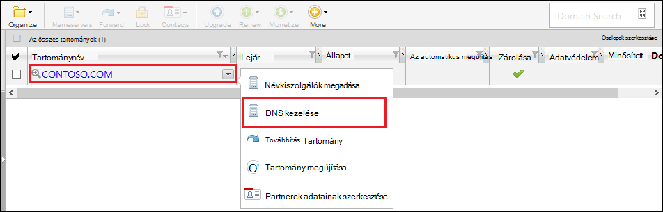
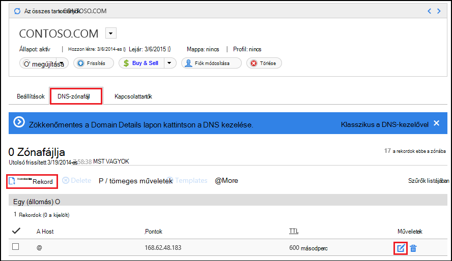
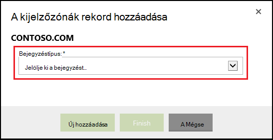
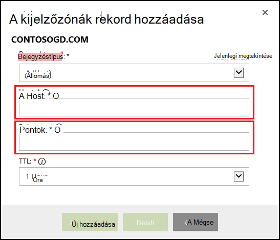

<properties
    pageTitle="A saját tartománynév beállítása az Azure alkalmazás szolgáltatás (GoDaddy)"
    description="Az Azure Web Apps alkalmazások használata a tartománynév a go Daddynél"
    services="app-service"
    documentationCenter=""
    authors="erikre"
    manager="wpickett"
    editor="jimbe"/>

<tags
    ms.service="app-service"
    ms.workload="na"
    ms.tgt_pltfrm="na"
    ms.devlang="na"
    ms.topic="article"
    ms.date="01/12/2016"
    ms.author="cephalin"/>

# A saját tartománynév beállítása az Azure alkalmazás szolgáltatás (közvetlenül a GoDaddy Beszerezve)

[AZURE.INCLUDE [web-selector](../../includes/websites-custom-domain-selector.md)]

[AZURE.INCLUDE [intro](../../includes/custom-dns-web-site-intro.md)]

Ha vásárolt tartomány Azure alkalmazás szolgáltatás Web Apps alkalmazások – majd olvassa el a [Tartomány vásárlása Web Apps alkalmazások](custom-dns-web-site-buydomains-web-app.md)utolsó lépésénél.

Ez a cikk nyújt útmutatást a saját tartománynév vásárolta, közvetlenül a [godaddy webhelyén](https://godaddy.com) , az [Alkalmazás szolgáltatás Web Apps alkalmazások](http://go.microsoft.com/fwlink/?LinkId=529714).

[AZURE.INCLUDE [introfooter](../../includes/custom-dns-web-site-intro-notes.md)]

##DNS-rekordok ismertetése

[AZURE.INCLUDE [understandingdns](../../includes/custom-dns-web-site-understanding-dns-raw.md)]

## Az egyéni tartományához tartozó DNS-rekord hozzáadása

Az egyéni tartomány társítása webalkalmazást alkalmazás szolgáltatásban, fel kell vennie egy új bejegyzést a DNS-táblázatban az egyéni tartományához tartozó GoDaddy által biztosított eszközök segítségével. Kövesse az alábbi lépéseket a megkereséséhez a DNS-eszközök a rendszerében

1. Jelentkezzen be a fiókjába a rendszerében, és válassza **a saját fiók** , majd **a tartományok kezelése elemre**. Végül jelölje be a legördülő menü az Azure web app alkalmazással használható, és válassza a **DNS kezelése**kívánt tartomány nevét.

    

2. A **Domain details** lapon görgessen le a **DNS Zone File** fülre. Ez a szakasz hozzáadása és módosítása a DNS-rekordjait a tartománynév használható.

    

    **Rekord hozzáadása** egy meglévő rekord kijelölése

    **Szerkesztés** egy meglévő rekord válassza a toll- és a papír ikonra a rekord melletti.

    > [AZURE.NOTE] Új rekord hozzáadása előtt figyelje meg, hogy a GoDaddy már létrehozott népszerű alszint tartományok ( **Host** nevű szerkesztőben) például **e-mailek**, **fájlok**, **levelezési**és más DNS-rekordjait. Ha létezik a már a használni kívánt nevet, módosítsa a meglévő rekordba helyett újat hozna létre.

4. Amikor felvesz egy bejegyzést, rekordtípus először választania kell.

    

    Következő lépésként meg kell adnia a **Host** (az egyéni tartomány vagy a alszint tartományt), és milyen informatikai **mutat**.

    

    * Amikor felvesz **egy (állomás) rekord** – be kell a **Host** mező vagy **@** (Ez a legfelső szintű tartománynevet (például **contoso.com**), jelöli) *(több alárendelt tartománylistájában megfelelő helyettesítő) vagy a használni kívánt alszint tartomány (például * *www**.) Önnek kell beállítania a * *pontok** mező az Azure webalkalmazást IP-címét.

    * Amikor felvesz egy **CNAME (alias) rekord** – be kell a **Host** mező a használni kívánt alszint tartományhoz. Ha például **www**. Be kell a **címzett pontok** mezőbe a **. azurewebsites.net** tartománynevét az Azure webalkalmazást. Ha például **contoso.azurewebsites.net**.

5. Kattintson **egy másik hozzáadása**gombra.
6. Válassza a **TXT** rekord típusát, majd adja meg a **Host** értéket **@** és a **címzett pontok** értékét ** &lt;yourwebappname&gt;. azurewebsites.net**.

    > [AZURE.NOTE] A TXT rekord segítségével Azure ellenőrzése, hogy Öné a tartomány írja le az A rekordot vagy a első TXT rekordot. Miután a tartományhoz a web app az Azure-portálon van rendelve, a TXT rekord bejegyzés lehet eltávolítani.

5. Ha kitöltötte, vagy módosítja a rekordokat, kattintson a **Befejezés gombra** a módosítások mentéséhez.

## A tartomány nevét a web App engedélyezése

[AZURE.INCLUDE [modes](../../includes/custom-dns-web-site-enable-on-web-site.md)]

>[AZURE.NOTE] Ha azt szeretné, mielőtt feliratkozna az Azure-fiók kezdéshez Azure alkalmazás szolgáltatással, nyissa meg a [Próbálja alkalmazás szolgáltatás](http://go.microsoft.com/fwlink/?LinkId=523751), ahol azonnal létrehozhat egy rövid életű starter web app alkalmazás szolgáltatásban. Nem kötelező, hitelkártyák Nincs nyilatkozatát.

## Mi változott
* Útmutató a módosítása a webhelyekre alkalmazás szolgáltatás című: [Azure alkalmazás szolgáltatás, és a hatás a meglévő Azure-szolgáltatások](http://go.microsoft.com/fwlink/?LinkId=529714)
