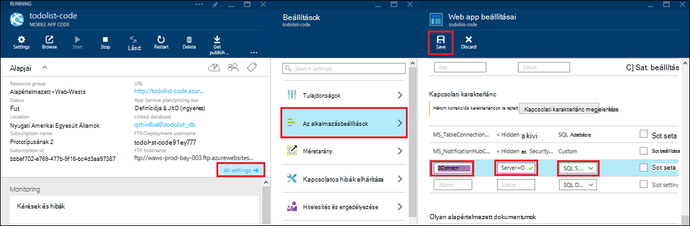

<properties 
    pageTitle="Az Access a helyszíni hibrid kapcsolattal Azure App szolgáltatásban erőforrások" 
    description="Kapcsolat létrehozása az Azure alkalmazás szolgáltatás webalkalmazást, és egy helyszíni erőforrás, amely egy statikus portot használja között" 
    services="app-service" 
    documentationCenter="" 
    authors="cephalin" 
    manager="wpickett" 
    editor="mollybos"/>

<tags 
    ms.service="app-service" 
    ms.workload="na" 
    ms.tgt_pltfrm="na" 
    ms.devlang="na" 
    ms.topic="article" 
    ms.date="02/03/2016" 
    ms.author="cephalin"/>

#Az Access a helyszíni hibrid kapcsolattal Azure App szolgáltatásban erőforrások

Azure alkalmazás szolgáltatás alkalmazás csatlakozhat bármelyik helyszíni erőforrást, amely egy statikus portot használja, például SQL Server, a MySQL, a HTTP webes API-hoz és a legtöbb egyéni webszolgáltatásokhoz. Ez a cikk bemutatja, hogyan hibrid kapcsolat közötti alkalmazás szolgáltatás, és egy helyszíni SQL Server-adatbázis létrehozása.

> [AZURE.NOTE] A Web Apps alkalmazások részét a hibrid kapcsolatok funkció csak az [Azure-portálon](https://portal.azure.com)érhető el. Kapcsolat létrehozása az BizTalk szolgáltatásokban, lásd: [Hibrid kapcsolatok](http://go.microsoft.com/fwlink/p/?LinkID=397274). 
> 
> A tartalom Azure App szolgáltatásban Mobile-alkalmazások is érinti. 

## Előfeltételek
- Egy Azure-előfizetést. Ingyenes előfizetésem [Azure próba-előfizetésre](https://azure.microsoft.com/pricing/free-trial/)című témakör tartalmaz. 
 
    Ha azt szeretné, mielőtt feliratkozna az Azure-fiók használatbavételéhez Azure alkalmazás szolgáltatás, [Próbálja meg alkalmazás szolgáltatás](http://go.microsoft.com/fwlink/?LinkId=523751), ahol azonnal létrehozhat egy rövid életű starter web app alkalmazás szolgáltatásban megnyitásához. Nem kötelező, hitelkártyák Nincs nyilatkozatát.

- Hibrid kapcsolatot egy helyszíni SQL Server- vagy SQL Server Express adatbázis használatához a TCP/IP statikus port engedélyezésük van szüksége. Az alapértelmezett példány használata SQL Server ajánlott, mert statikus port 1433 használ. Való telepítéséről és konfigurálásáról az SQL Server Express terméket hibrid kapcsolatok való használatra a további tudnivalókért lásd [egy helyszíni SQL Server Azure webhelyről csatlakozás hibrid kapcsolatok használatával](http://go.microsoft.com/fwlink/?LinkID=397979).

- A számítógépen, amelyen a jelen cikk telepíti a helyszíni hibrid kapcsolatkezelő agent leírt:

    - Csatlakozás Azure port 5671 keresztül kell
    - Elérhetik a *Hostname (állomásnév)*kell lennie:*port_száma* a helyszíni erőforrás. 

> [AZURE.NOTE] A jelen cikkben ismertetett lépések feltételezik, hogy használata a böngészőben, hogy a helyszíni hibrid kapcsolat agent fog tárolni a számítógépről.

## Egy webalkalmazás létrehozása az Azure-portálon ##

> [AZURE.NOTE] Ha már létrehozott egy webalkalmazást vagy mobilalkalmazás kódmentes az Azure-portálon ebben az oktatóanyagban használni kívánt, ugorjunk előre a [hibrid kapcsolat és BizTalk szolgáltatás hozzon létre](#CreateHC) , és indítsa el onnan.

1. Az [Azure portál](https://portal.azure.com)bal felső sarkában kattintson az **Új** > **webes + Mobile** > **Web App alkalmazásban**.
    
    ![Új web App alkalmazásban][NewWebsite]
    
2. A **Web App alkalmazásban** a lap adja meg az URL-címet, és kattintson a **Létrehozás**gombra. 
    
    ![Webhely neve][WebsiteCreationBlade]
    
3. Néhány percet, után a web app hoz létre, és a web app lap jelenik meg. A lap függőlegesen görgethető irányítópult, amelyen a webhely kezelője.
    
    ![Operációs rendszert futtató webhelyen][WebSiteRunningBlade]
    
4. Annak ellenőrzéséhez, hogy a webhely élő, kattinthat a **Tallózás** ikonra az alapértelmezett lap megjelenítéséhez.
    
    ![Kattintson a Tallózás gombra kattintva megtekintheti a web App alkalmazásban][Browse]
    
    ![Alapértelmezett alkalmazás weblap][DefaultWebSitePage]
    
Ezután a hibrid kapcsolat és a webalkalmazás BizTalk szolgáltatás hoz létre.

## Hozzon létre egy hibrid kapcsolat és BizTalk szolgáltatás ##

1. Kattintson a web app lap **minden elérhető beállítás** > **hálózati** > **konfigurálása a hibrid kapcsolat végpontok**.
    
    ![Hibrid kapcsolatok][CreateHCHCIcon]
    
2. A hibrid a kapcsolatok lap kattintson a **Hozzáadás**gombra.
    
    <!-- ![Add a hybrid connnection][CreateHCAddHC]
-->
    
3. A **hibrid kapcsolat hozzáadása** lap megnyitása  Ez az első hibrid internetkapcsolata, mivel az **új hibrid kapcsolat** lehetőség van megadva, és meg megnyílik a **hibrid-kapcsolat létrehozása** lap.
    
    ![Hibrid kapcsolat létrehozása][TwinCreateHCBlades]
    
    Kattintson a **Create a hibrid kapcsolat lap**:
    - **Név**nevezze el a kapcsolatot.
    - A **Hostname (állomásnév)**adja meg a helyszíni számítógépen, amelyen az erőforrás nevét.
    - **Port**írja be a port száma, hogy a helyszíni erőforrás használ-e (az alapértelmezett példány használata SQL Server 1433).
    - Kattintson a **szakaszára beszélhet szolgáltatás**

4. Ekkor megnyílik a **BizTalk szolgáltatás hozzon létre** lap. Írjon be egy nevet a BizTalk szolgáltatás, és kattintson **az OK**gombra.
    
    ![BizTalk szolgáltatás hozzon létre][CreateHCCreateBTS]
    
    A **BizTalk szolgáltatás hozzon létre** lap bezárul, és a **Létrehozás hibrid kapcsolat** lap adja vissza.
    
5. A hibrid kapcsolat létrehozása lap kattintson az **OK gombra**. 
    
    ![Kattintson az OK gombra][CreateBTScomplete]
    
6. A folyamat befejeződik, az értesítési területen, a portálon tájékoztat arról, hogy a kapcsolat létrehozása sikeresen befejeződött.
    <!---teendők

    A szolgáltatás nem sikerül ezt a lépést. A dogfood portál BizTalk szolgáltatás nem létrehozása Váltás a klasszikus portálra (teljes portál) és a BizTalk szolgáltatás létrehozott lehet egy, de nem lehetővé teszi, hogy összekötése úgy tűnik őket – Ha végzett a létrehozás hibrid csatlakoztatva lépés, akkor a következő hibaüzenet RelecIoudHC hibrid kapcsolat létrehozása sikertelen. Az erőforrás típusa nem található a névtér "2014-06-01-verzió API Microsoft.BizTaIkServices".
    
    A hibaüzenet azt jelzi, hogy nem található a típus, ne a példányt.
    ![A siker értesítés][CreateHCSuccessNotification]
    -->
7. A web app lap, a a **hibrid kapcsolatok** ikon most jeleníti meg, hogy 1 hibrid kapcsolat létrehoztak.
    
    ![Egy hibrid kapcsolat létrehozása][CreateHCOneConnectionCreated]
    
Ezen a ponton befejezése a hibrid kapcsolat felhőalapú infrastruktúrájának fontos része. Ezután a helyszíni megfelelő valamilyen hoz létre.

## A kapcsolat a helyszíni hibrid kapcsolatkezelő telepítése ##

1. A web app lap, kattintson a **minden beállítások** > **hálózati** > **konfigurálása a hibrid kapcsolat végpontok**. 
    
    ![Hibrid kapcsolatok ikon][HCIcon]
    
2. A **hibrid kapcsolatok** lap **állapot** oszlopában található a nemrég hozzáadott végpont jeleníti meg, **nem csatlakozik**. Kattintson a kapcsolat konfigurálásához.
    
    ![Kapcsolat nélkül][NotConnected]
    
    A hibrid kapcsolat lap megnyitása
    
    ![NotConnectedBlade][NotConnectedBlade]
    
3. Kattintson a lap, **Figyelő beállítása**.
    
    ![Kattintson a figyelő beállítása][ClickListenerSetup]
    
4. A **hibrid kapcsolat tulajdonságai** lap megnyitása Válassza ki **a helyszíni hibrid kapcsolatkezelő** **telepítéséhez kattintson ide**.
    
    ![Ide kattintva telepítése][ClickToInstallHCM]
    
5. Az alkalmazás futtatásához biztonsági figyelmeztetés párbeszédpanel válassza a **Futtatás** továbbra is.
    
    ![Válassza a Futtatás parancsot, a folytatáshoz][ApplicationRunWarning]
    
6.  A **Felhasználói fiókok felügyelete** párbeszédpanel válassza az **Igen**lehetőséget.
    
    ![Kattintson az Igen][UAC]
    
7. A hibrid kapcsolatkezelő letöltése és telepítette a. 
    
    ![Telepítése][HCMInstalling]
    
8. A telepítés befejezése után kattintson a **Bezárás**gombra.
    
    ![Kattintson a Bezárás gombra][HCMInstallComplete]
    
    A **hibrid kapcsolatok** lap **állapot** oszlopában most jeleníti **csatlakoztatva**. 
    
    ![Csatlakoztatott állapota][HCStatusConnected]

Most, hogy a hibrid kapcsolat infrastruktúra befejeződött, létrehozhat egy hibrid alkalmazást használja azt. 

>[AZURE.NOTE]Az alábbi szakaszok hibrid kapcsolat használata Mobiltelefonról alkalmazások .NET kódmentes projekt megjelenítése.

## Állítsa be a mobil alkalmazás .NET kódmentes projekt az SQL Server-adatbázishoz való csatlakozáshoz

Alkalmazás szolgáltatásban Mobile alkalmazások .NET kódmentes projekt csak egy ASP.NET web app-további Mobile alkalmazások SDK telepítve és inicializált. A web App alkalmazásban a Mobile-alkalmazások kódmentes használni, [Töltse le és a Mobile alkalmazások .NET kódmentes SDK inicializálni](../app-service-mobile/app-service-mobile-dotnet-backend-how-to-use-server-sdk.md#install-sdk)kell.  

Mobile-appokról is szeretne a kapcsolati karakterlánc a helyszíni adatbázis megadása és módosítása a kódmentes használhatja a kapcsolatot. 

1. A megoldás Intézőben a Visual Studióban nyissa meg a fájlt, az a Mobile alkalmazást .NET kódmentes, keresse meg a **connectionStrings** szakaszt, vegyen fel egy új SqlClient, a helyszíni SQL Server-adatbázis mutat, amely az alábbiakhoz hasonlóan:

        <add name="OnPremisesDBConnection"
         connectionString="Data Source=OnPremisesServer,1433;
         Initial Catalog=OnPremisesDB;
         User ID=HybridConnectionLogin;
         Password=<**secure_password**>;
         MultipleActiveResultSets=True"
         providerName="System.Data.SqlClient" />

    Ne feledje, hogy le szeretné cserélni `<**secure_password**>` a karakterláncban *HybridConnectionLogin*hoz létre a jelszóval.

3. A Visual Studióban menteni a fájlt a **Mentés** gombra.

    > [AZURE.NOTE]A kapcsolat beállítás a helyi számítógépen futó használatos. Fut Azure-ban, akkor ez a beállítás akkor kapcsolat beállítása a portálon definiált felüldefiniálni.

4. Bontsa ki a **modellek** mappát, és nyissa meg a vágólapra a *Context.cs*adatok modellfájl.

6. Módosítsa az az érték átadni **DbContext** példánykonstruktor `OnPremisesDBConnection` az alap **DbContext** konstruktor, a következő kódtöredékének hasonló:

        public class hybridService1Context : DbContext
        {
            public hybridService1Context()
                : base("OnPremisesDBConnection")
            {
            }
        }

    A szolgáltatás most fogja használni az új kapcsolat az SQL Server-adatbázishoz.

## A helyszíni kapcsolati karakterlánc használni a mobilalkalmazás kódmentes frissítése

Ezután, hogy fel kell vennie a új kapcsolati karakterlánc-alkalmazás beállítása, hogy az Azure is használható.  

1. Kattintson az [Azure portált](https://portal.azure.com) a mobilalkalmazás web app kódmentes kódját, **az összes beállítások**, majd az **alkalmazás beállításait**.

3. A **Web app beállításai** lap a görgessen le a **kapcsolati karakterláncot** , és adja hozzá az új **SQL Server** kapcsolati karakterlánc nevű `OnPremisesDBConnection` például értéket tartalmazó `Server=OnPremisesServer,1433;Database=OnPremisesDB;User ID=HybridConnectionsLogin;Password=<**secure_password**>`.

    Csere `<**secure_password**>` a helyszíni adatbázis biztonságos jelszóval.

    

2. Nyomja le a **Mentés** a hibrid kapcsolat és az imént létrehozott csatlakozási karakterlánc mentése.

Ezen a ponton ismételt közzététele a kiszolgálón projekt és az új kapcsolat tesztelése a meglévő Mobile-alkalmazások ügyfelekkel. Az adatok olvassák és a hibrid-kapcsolat a helyszíni adatbázisba.

## Következő lépések ##

- Hibrid kapcsolatot használó ASP.NET webalkalmazást létrehozásával kapcsolatos további tudnivalókért olvassa el a [egy helyszíni SQL Server Azure webhelyről csatlakozás hibrid kapcsolatok használata](http://go.microsoft.com/fwlink/?LinkID=397979)című témakört. 

### További források

[Hibrid az adatkapcsolatok áttekintése](http://go.microsoft.com/fwlink/p/?LinkID=397274)

[Ambrus jelölés hibrid kapcsolatok (videó csatorna 9) vezet be.](http://channel9.msdn.com/Shows/Azure-Friday/Josh-Twist-introduces-hybrid-connections)

[Hibrid kapcsolatok webhelyén](https://azure.microsoft.com/services/biztalk-services/)

[BizTalk szolgáltatások: Irányítópult, a Monitor, a méretarány, a konfigurálása és a hibrid kapcsolat lapon](../biztalk-services/biztalk-dashboard-monitor-scale-tabs.md)

[Zökkenőmentes alkalmazás hordozhatóságát (videó csatorna 9) a való életben hibrid felhő felépíteni](http://channel9.msdn.com/events/TechEd/NorthAmerica/2014/DCIM-B323#fbid=)

[Kapcsolódás egy helyszíni SQL Server Azure Mobile Services hibrid kapcsolatok (videó csatorna 9) használata a](http://channel9.msdn.com/Series/Windows-Azure-Mobile-Services/Connect-to-an-on-premises-SQL-Server-from-Azure-Mobile-Services-using-Hybrid-Connections)

## Mi változott
* Módosítása egy segédvonalat a webhelyekre alkalmazás szolgáltatáshoz lásd: [Azure alkalmazás szolgáltatás, és a hatás a meglévő Azure-szolgáltatások](http://go.microsoft.com/fwlink/?LinkId=529714)

<!-- IMAGES -->
[New]:./media/web-sites-hybrid-connection-get-started/B01New.png
[NewWebsite]:./media/web-sites-hybrid-connection-get-started/B02NewWebsite.png
[WebsiteCreationBlade]:./media/web-sites-hybrid-connection-get-started/B03WebsiteCreationBlade.png
[WebSiteRunningBlade]:./media/web-sites-hybrid-connection-get-started/B04WebSiteRunningBlade.png
[Browse]:./media/web-sites-hybrid-connection-get-started/B05Browse.png
[DefaultWebSitePage]:./media/web-sites-hybrid-connection-get-started/B06DefaultWebSitePage.png
[CreateHCHCIcon]:./media/web-sites-hybrid-connection-get-started/C01CreateHCHCIcon.png
[CreateHCAddHC]:./media/web-sites-hybrid-connection-get-started/C02CreateHCAddHC.png
[TwinCreateHCBlades]:./media/web-sites-hybrid-connection-get-started/C03TwinCreateHCBlades.png
[CreateHCCreateBTS]:./media/web-sites-hybrid-connection-get-started/C04CreateHCCreateBTS.png
[CreateBTScomplete]:./media/web-sites-hybrid-connection-get-started/C05CreateBTScomplete.png
[CreateHCSuccessNotification]:./media/web-sites-hybrid-connection-get-started/C06CreateHCSuccessNotification.png
[CreateHCOneConnectionCreated]:./media/web-sites-hybrid-connection-get-started/C07CreateHCOneConnectionCreated.png
[HCIcon]:./media/web-sites-hybrid-connection-get-started/D01HCIcon.png
[NotConnected]:./media/web-sites-hybrid-connection-get-started/D02NotConnected.png
[NotConnectedBlade]:./media/web-sites-hybrid-connection-get-started/D03NotConnectedBlade.png
[ClickListenerSetup]:./media/web-sites-hybrid-connection-get-started/D04ClickListenerSetup.png
[ClickToInstallHCM]:./media/web-sites-hybrid-connection-get-started/D05ClickToInstallHCM.png
[ApplicationRunWarning]:./media/web-sites-hybrid-connection-get-started/D06ApplicationRunWarning.png
[UAC]:./media/web-sites-hybrid-connection-get-started/D07UAC.png
[HCMInstalling]:./media/web-sites-hybrid-connection-get-started/D08HCMInstalling.png
[HCMInstallComplete]:./media/web-sites-hybrid-connection-get-started/D09HCMInstallComplete.png
[HCStatusConnected]:./media/web-sites-hybrid-connection-get-started/D10HCStatusConnected.png
 