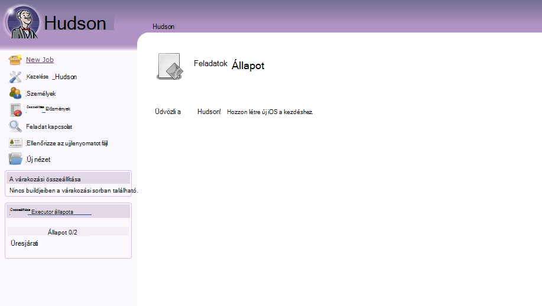
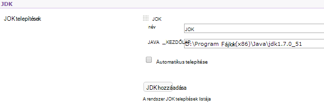
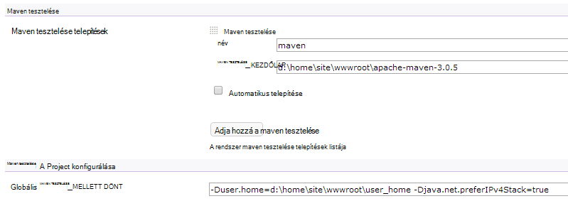

<properties 
    pageTitle="Töltse fel a Java egyéni webalkalmazás Azure" 
    description="Ebből az oktatóanyagból megtudhatja, hogy miként tölthet fel egy egyéni Java-webalkalmazást Azure alkalmazás szolgáltatás Web Apps alkalmazások." 
    services="app-service\web" 
    documentationCenter="java" 
    authors="rmcmurray" 
    manager="wpickett" 
    editor=""/>

<tags 
    ms.service="app-service-web" 
    ms.workload="web" 
    ms.tgt_pltfrm="na" 
    ms.devlang="Java" 
    ms.topic="article" 
    ms.date="08/11/2016" 
    ms.author="robmcm"/>

# Töltse fel a Java egyéni webalkalmazás Azure

Ebből a témakörből megtudhatja, hogy miként tölthet fel egy egyéni Java-webalkalmazást [Azure alkalmazás Service] Web Apps alkalmazások. Beépített van, amely bármely Java webhelyén vagy a web app és az egyes alkalmazások példák is vonatkozik.

Figyelje meg, hogy Azure eszköze létrehozásához biztosít Java web Apps alkalmazások használata az Azure-portálon konfigurációs Kezelőfelület és az Azure piactérről a [Java webalkalmazást Azure alkalmazás szolgáltatás hozzon létre](web-sites-java-get-started.md)leírtak szerint. Ebben az oktatóanyagban, amelyben nem szeretné használni az Azure Portal konfigurálása felhasználási területei felhasználói felület vagy a Microsoft Azure piactéren.  

## Konfigurálási útmutatója

Az alábbi egyéni Java web Apps alkalmazások Azure a várt beállításokat ismerteti.

- A Java folyamat által használt HTTP port dinamikusan van-e hozzárendelve.  A folyamat kell használnia a port eltávolítja a környezeti változó `HTTP_PLATFORM_PORT`.
- A HTTP-egyetlen figyelő kívül az összes meghallgatását portokat kell tiltható le.  Az Tomcat, amely tartalmazza a Leállítás, a HTTPS és AJP portokat.
- A tároló kell beállítania, csak IPv4-adatforgalom.
- Az **indítási** parancs az alkalmazáshoz szükséges a konfigurációban kell állítani.
- A könyvtárak igénylő alkalmazások könyvtárban az Azure web app tartalom, amely **D:\home**engedéllyel kell írni.  A környezeti változó `HOME` D:\home hivatkozik.  

Beállíthatja, hogy a környezeti változók szükség szerint a a fájlt.

## Web.config httpPlatform konfigurálása

A következő információkat a **httpPlatform** formátum belül web.config ismerteti.
                                 
**argumentumok** (Alapértelmezett = ""). Végrehajtható fájl vagy parancsfájl **processPath** beállításában megadott argumentumokat.

Példa (a beépített **processPath** ):

    processPath="%HOME%\site\wwwroot\bin\tomcat\bin\catalina.bat"
    arguments="start"
    
    processPath="%JAVA_HOME\bin\java.exe"
    arguments="-Djava.net.preferIPv4Stack=true -Djetty.port=%HTTP\_PLATFORM\_PORT% -Djetty.base=&quot;%HOME%\site\wwwroot\bin\jetty-distribution-9.1.0.v20131115&quot; -jar &quot;%HOME%\site\wwwroot\bin\jetty-distribution-9.1.0.v20131115\start.jar&quot;"

**processPath** – a végrehajtható vagy parancsfájlt, amely elindítja a HTTP-kérések figyeli folyamat elérési útját.

Példa:

    processPath="%JAVA_HOME%\bin\java.exe"

    processPath="%HOME%\site\wwwroot\bin\tomcat\bin\startup.bat"

    processPath="%HOME%\site\wwwroot\bin\tomcat\bin\catalina.bat"
                                                                                       
**rapidFailsPerMinute** (Alapértelmezett = 10.) A megadott **processPath** folyamat összeomolhat percenkénti engedélyezett ismétlődésének száma. A korlát túllépésekor **HttpPlatformHandler** leállítja a percet hátralévő folyamat indítása.
                                    
**requestTimeout** (Alapértelmezett = "00: 02:00".) Az időtartam, amelynek **HttpPlatformHandler** a folyamat figyel választ vár `%HTTP_PLATFORM_PORT%`.

**startupRetryCount** (Alapértelmezett = 10.) **HttpPlatformHandler** megpróbálja elindítani a folyamat **processPath**megadott ismétlődésének száma. Lásd: **startupTimeLimit** további információt.

**startupTimeLimit** (Alapértelmezett = 10 másodperc.) Az időtartam, amelynek a **HttpPlatformHandler** a végrehajtható fájl/parancsfájl a port figyelését megkezdéséhez várakozik.  A határidő túllépésekor **HttpPlatformHandler** a folyamat leállítása, és próbálja meg ismét **startupRetryCount** időpontok elindítására.
                                                                                      
**stdoutLogEnabled** (Alapértelmezett = "igaz".) Ha igaz, **stdout** és **stderr** a folyamat **processPath** beállításában megadott irányítja át a fájlt a megadott **stdoutLogFile** (lásd **stdoutLogFile** ).
                                    
**stdoutLogFile** (Default="d:\home\LogFiles\httpPlatformStdout.log".) Abszolút elérési út, amelynek **stdout** és **stderr** a megadott **processPath** folyamat készül.
                                    
> [AZURE.NOTE] `%HTTP_PLATFORM_PORT%`speciális helyőrző, amelyek a megadott **argumentumokat** részeként vagy a **httpPlatform** **environmentVariables** lista részeként kell van. Ez váltja fel egy belső létrehozott port **HttpPlatformHandler** úgy, hogy a folyamat **processPath** által megadott figyelheti a porthoz.

## Telepítési

Java-alapú web Apps alkalmazások egyszerűen az azonos azt jelenti, hogy az Internet Information Services (IIS) használják a legtöbb keresztül telepíthető webalkalmazások alapján.  FTP, mely számjegy és Kudu összes támogatottak telepítési mechanizmusok, mert a web Apps alkalmazások integrált SCM videofunkcióinak. WebDeploy works protokollt, azonban Java nem kidolgozott a Visual Studióban, WebDeploy nem fér esetekkel Java web app telepítési használatát.

## Alkalmazás-konfiguráció példák

A következő alkalmazásokat, a fájlt, és az alkalmazás konfigurációs példák bemutatják, hogyan ahhoz, hogy az alkalmazás szolgáltatás Web Apps alkalmazások Java alkalmazást, megadva.

### Tomcat
Vannak, amelyeket az alkalmazás szolgáltatás Web Apps alkalmazások Tomcat a két változatok, miközben továbbra is igazán lehetőség ügyfélnek adott példányok feltöltése. Az alábbi képen egy példa egy másik Java virtuális gép (JVM) a Tomcat telepítését.

    <?xml version="1.0" encoding="UTF-8"?>
    <configuration>
      <system.webServer>
        <handlers>
          <add name="httpPlatformHandler" path="*" verb="*" modules="httpPlatformHandler" resourceType="Unspecified" />
        </handlers>
        <httpPlatform processPath="%HOME%\site\wwwroot\bin\tomcat\bin\startup.bat" 
            arguments="">
          <environmentVariables>
            <environmentVariable name="CATALINA_OPTS" value="-Dport.http=%HTTP_PLATFORM_PORT%" />
            <environmentVariable name="CATALINA_HOME" value="%HOME%\site\wwwroot\bin\tomcat" />
            <environmentVariable name="JRE_HOME" value="%HOME%\site\wwwroot\bin\java" /> <!-- optional, if not specified, this will default to %programfiles%\Java -->
            <environmentVariable name="JAVA_OPTS" value="-Djava.net.preferIPv4Stack=true" />
          </environmentVariables>
        </httpPlatform>
      </system.webServer>
    </configuration>

A Tomcat oldalon létezik néhány konfigurációs módosítást kell tenni. A server.xml kell szerkeszthetők beállítása:

-   Leállítás port = -1
-   HTTP-összekötő port = ${port.http}
-   HTTP-összekötő címe = "127.0.0.1"
-   Megjegyzések hozzáfűzése HTTPS és AJP összekötők meg
-   A IPv4-beállítás is beállítható, hogy a hozzá catalina.properties fájlban`java.net.preferIPv4Stack=true`
    
Direct3d hívások alkalmazás szolgáltatás Web Apps alkalmazások nem támogatottak. Tiltsa le azokat, vegye fel a következő Java lehetőséget kell az alkalmazás hívásokat ilyen:`-Dsun.java2d.d3d=false`

### Rakodóhely

Akárcsak a Tomcat, ügyfelek is feltölthet a saját példányok rakodóhely számára. A teljes telepítése rakodóhely fut, amíg a konfigurációs így néz ki:

    <?xml version="1.0" encoding="UTF-8"?>
    <configuration>
      <system.webServer>
        <handlers>
          <add name="httppPlatformHandler" path="*" verb="*" modules="httpPlatformHandler" resourceType="Unspecified" />
        </handlers>
        <httpPlatform processPath="%JAVA_HOME%\bin\java.exe" 
             arguments="-Djava.net.preferIPv4Stack=true -Djetty.port=%HTTP_PLATFORM_PORT% -Djetty.base=&quot;%HOME%\site\wwwroot\bin\jetty-distribution-9.1.0.v20131115&quot; -jar &quot;%HOME%\site\wwwroot\bin\jetty-distribution-9.1.0.v20131115\start.jar&quot;"
            startupTimeLimit="20"
          startupRetryCount="10"
          stdoutLogEnabled="true">
        </httpPlatform>
      </system.webServer>
    </configuration>

A rakodóhely konfiguráció szükséges lehet módosítani a start.ini beállítása `java.net.preferIPv4Stack=true`.

### Springboot
Egy Springboot annak érdekében, hogy Ön futó alkalmazás kell töltse fel a üveg vagy HÁBORÚK fájlt, és adja hozzá a következő fájlt. A fájlt a wwwroot mappába kerül. A web.config állítsa át az argumentumokat, mutasson a üveg fájlhoz, a következő példában a wwwroot mappájában, valamint a üveg fájl található.  

    <?xml version="1.0" encoding="UTF-8"?>
    <configuration>
      <system.webServer>
        <handlers>
          <add name="httpPlatformHandler" path="*" verb="*" modules="httpPlatformHandler" resourceType="Unspecified" />
        </handlers>
        <httpPlatform processPath="%JAVA_HOME%\bin\java.exe"
            arguments="-Djava.net.preferIPv4Stack=true -Dserver.port=%HTTP_PLATFORM_PORT% -jar &quot;%HOME%\site\wwwroot\my-web-project.jar&quot;">
        </httpPlatform>
      </system.webServer>
    </configuration>

### Hudson

A próba használt Hudson 3.1.2 háború és az alapértelmezett Tomcat 7.0.50 példányt, de a felhasználói felületen beállítási nélkül.  Mivel a Hudson a szoftver összeállítása eszköz, tanácsos telepítse dedikált példányok, ahol a **AlwaysOn** jelző állíthatja be a web app.

1. A web app legfelső szintű címtárban, azaz **d:\home\site\wwwroot**, hozzon létre egy **webalkalmazás** könyvtárat (Ha nincs már van), és **d:\home\site\wwwroot\webapps**Hudson.war helyezze.
2. Töltse le a apache maven tesztelése 3.0.5 (kompatibilis Hudson), és helyezze azt **d:\home\site\wwwroot**.
3. Hozzon létre web.config **d:\home\site\wwwroot** , és illessze be a tartalom:
    
        <?xml version="1.0" encoding="UTF-8"?>
        <configuration>
          <system.webServer>
            <handlers>
              <add name="httppPlatformHandler" path="*" verb="*" 
        modules="httpPlatformHandler" resourceType="Unspecified" />
            </handlers>
            <httpPlatform processPath="%AZURE_TOMCAT7_HOME%\bin\startup.bat"
        startupTimeLimit="20"
        startupRetryCount="10">
        <environmentVariables>
          <environmentVariable name="HUDSON_HOME" 
        value="%HOME%\site\wwwroot\hudson_home" />
          <environmentVariable name="JAVA_OPTS" 
        value="-Djava.net.preferIPv4Stack=true -Duser.home=%HOME%/site/wwwroot/user_home -Dhudson.DNSMultiCast.disabled=true" />
        </environmentVariables>            
            </httpPlatform>
          </system.webServer>
        </configuration>

    Ezen a ponton a web App alkalmazásban a módosítások érvénybe átnevezheti.  Csatlakozás http://yourwebapp/hudson Hudson indításához.

4. Miután Hudson állítja be magát, meg kell jelennie a következő képernyőn:

    
    
5. Hozzáférés az Hudson beállítása lapon: **Hudson kezelése**gombra, és kattintson a **Rendszer beállítása**gombra.
6. Állítsa be a JDK, alább látható módon:

    

7. Állítsa be a maven tesztelése alább látható módon:

    

8. A beállítások mentéséhez. Hudson most már konfigurálva vannak és használatra kész.

További információt a Hudson olvassa el a [http://hudson-ci.org](http://hudson-ci.org)című témakört.

### Liferay

Alkalmazás szolgáltatás Web Apps alkalmazások Liferay támogatott. Liferay jelentős memóriát igényelnek, lehet, mert a web app a közepes vagy nagy dedikált dolgozó, ami lehetővé teszi a elegendő memória futtatásához szükséges. Liferay is a indul el néhány percig tart. Éppen ezért ajánlott beállítani a web app **Mindig a**.  

Közösségi Edition GA3 kapcsolt 6.1.2 Liferay Tomcat használ, a következő fájlok módosította Liferay letöltése után:

**Server.XML**

- Módosítsa a Leállítás port -1.
- Összekötő HTTP módosítása      `<Connector port="${port.http}" protocol="HTTP/1.1" connectionTimeout="600000" address="127.0.0.1" URIEncoding="UTF-8" />`
- Megjegyzések hozzáfűzése a AJP összekötő.

Hozzon létre egy **portál-ext.properties**nevű fájlt a **liferay\tomcat-7.0.40\webapps\ROOT\WEB-INF\classes** mappában. Ez a fájl tartalmaznia kell egy sorban, mint az itt látható:

    liferay.home=%HOME%/site/wwwroot/liferay

A tagolási szintre címtár az tomcat-7.0.40 mappával, **web.config** a következő tartalommal nevű fájl létrehozása:

    <?xml version="1.0" encoding="UTF-8"?>
    <configuration>
      <system.webServer>
        <handlers>
    <add name="httpPlatformHandler" path="*" verb="*"
         modules="httpPlatformHandler" resourceType="Unspecified" />
        </handlers>
        <httpPlatform processPath="%HOME%\site\wwwroot\tomcat-7.0.40\bin\catalina.bat" 
                      arguments="run" 
                      startupTimeLimit="10" 
                      requestTimeout="00:10:00" 
                      stdoutLogEnabled="true">
          <environmentVariables>
      <environmentVariable name="CATALINA_OPTS" value="-Dport.http=%HTTP_PLATFORM_PORT%" />
      <environmentVariable name="CATALINA_HOME" value="%HOME%\site\wwwroot\tomcat-7.0.40" />
            <environmentVariable name="JRE_HOME" value="D:\Program Files\Java\jdk1.7.0_51" /> 
            <environmentVariable name="JAVA_OPTS" value="-Djava.net.preferIPv4Stack=true" />
          </environmentVariables>
        </httpPlatform>
      </system.webServer>
    </configuration>

A **httpPlatform** Tiltás a **requestTimeout** értéke "00: 10:00".  Csökkenthető lesz, de, akkor valószínű, hogy bizonyos időtúllépést, miközben Liferay rendszerindításáért van.  Ha ez az érték módosul, majd a **connectionTimeout** a tomcat server.xml a is módosítani kell.  

Érdemes megjegyezni, hogy a fenti web.config, mutasson a 64 bites JDK meg van adva a a JRE_HOME environnment varariable. Az alapértelmezett 32 bites, de Liferay megkövetelheti memória magas szintű, mivel a 64 bites JDK használata ajánlott.

Miután a módosítások, indítsa újra a rendszert futtató Liferay webalkalmazás, ezután nyissa meg a http://yourwebapp. A Liferay portál web app legfelső szintjén érhető el. 

## Következő lépések

Liferay kapcsolatos további tudnivalókért olvassa el a [http://www.liferay.com](http://www.liferay.com)című témakört.

Java kapcsolatos további tudnivalókért lásd: a [Java Developer Center](/develop/java/).

[AZURE.INCLUDE [app-service-web-whats-changed](../../includes/app-service-web-whats-changed.md)]

[AZURE.INCLUDE [app-service-web-try-app-service](../../includes/app-service-web-try-app-service.md)]
 
 
<!-- External Links -->
[Azure alkalmazás szolgáltatás]: http://go.microsoft.com/fwlink/?LinkId=529714
