<properties 
    pageTitle="Egy vállalati webalkalmazás áttelepítése az Azure alkalmazás szolgáltatás" 
    description="IIS-webhelyek gyors áttelepítése Azure alkalmazás szolgáltatás Web Apps alkalmazások használatát Web Apps alkalmazások áttelepítési Segéd mutatja" 
    services="app-service" 
    documentationCenter="" 
    authors="cephalin" 
    writer="cephalin" 
    manager="wpickett" 
    editor=""/>

<tags 
    ms.service="app-service" 
    ms.workload="na" 
    ms.tgt_pltfrm="na" 
    ms.devlang="na" 
    ms.topic="article" 
    ms.date="07/01/2016" 
    ms.author="cephalin"/>

# Egy vállalati webalkalmazás áttelepítése az Azure alkalmazás szolgáltatás

Egyszerűen áttelepítheti a meglévő webhely, amely a Internet Information Service (IIS) 6 vagy újabb verziójú [Alkalmazás szolgáltatás Web Apps alkalmazások](http://go.microsoft.com/fwlink/?LinkId=529714)futtatásához. 

>[AZURE.IMPORTANT] A Windows Server 2003-támogatás az július 14 2015 végére ért. Ha jelenleg üzemeltet-kiszolgálókon üzemelő IIS-webhelyek, hogy ez a Windows Server 2003, Web Apps alkalmazások egy kis kockázattal, Min költség és kis módja a webhely online állapotba és Web Apps alkalmazások áttelepítési Segéd segítségével automatizálhatja az áttelepítési folyamatot meg. 

[Web Apps alkalmazások áttelepítési Segéd](https://www.movemetothecloud.net/) is elemezheti az IIS server telepítése, mely oldalakat telepíthető át az alkalmazás szolgáltatás, jelölje ki a minden elemet, amely nem telepíthetők át vagy által nem támogatott a platformon, majd kattintson a webhelyek és a társított adatbázisok áttelepítése Azure azonosítása.

[AZURE.INCLUDE [app-service-web-to-api-and-mobile](../../includes/app-service-web-to-api-and-mobile.md)]

## Kompatibilitás-elemzés során ellenőrzött elemek ##
Az áttelepítési Segéd jelentést hoz létre készenléti minden lehetséges okai figyelmet vagy blokkoló problémák, amelyek megakadályozhatják a sikeres áttelepítése a helyszíni IIS Azure alkalmazás szolgáltatás Web Apps alkalmazások azonosítása. Néhány lényeges kulcs elem van:

-   Port kötések – Web Apps alkalmazások csak támogatja a 80-as Port HTTP és Port 443-as HTTPS-forgalom. Különböző portbeállításokat figyelmen kívül hagyja, és a forgalom továbbítja a 80 és 443-as. 
-   Hitelesítés – Web Apps alkalmazások támogatja a névtelen hitelesítés alapértelmezés szerint és űrlapok hitelesítés, ha egy alkalmazás által megadott. Windows-hitelesítés integrálása az Azure Active Directory és ADFS is használhatják. Minden más – például alapszintű hitelesítés - hitelesítés formája jelenleg nem támogatott. 
-   Globális összeállítási gyorsítótár (GAC) – a GAC Web Apps alkalmazások nem támogatott. Ha az alkalmazás szerelvények, amely általában a globális összeállítási gyorsítótárból üzembe hivatkozik, szüksége lesz az alkalmazások tároló mappa a Web Apps alkalmazások telepítéséhez. 
-   IIS5 Kompatibilis üzemmód – Ez a Web Apps alkalmazások nem támogatott. 
-   Webalkalmazás-készletek – a Web Apps, mindkét webhelyen és annak alárendelt alkalmazásokat az azonos alkalmazáskészlet futnak. Ha a webhely több webalkalmazás-készletek felhasználásával több alárendelt alkalmazást, összesítése őket egy közös beállításokkal egyetlen alkalmazáskészlet vagy be minden egy külön web App alkalmazást.
-   COM-összetevők – Web Apps alkalmazások nem engedélyezi a COM-összetevők platformon bejegyzését. A webhelyek vagy alkalmazások előhívható bármely COM-összetevőket, ha kell, átírásának őket a felügyelt kódot, és üzembe helyezése a webhely vagy alkalmazással.
-   Web Apps alkalmazások ISAPI szűrők – támogatniuk ISAPI szűrők. Meg kell, tegye a következőket:
    -   a DLL-ek a web app alkalmazással terjesztése 
    -   a DLL-ek [Web.config](http://www.iis.net/configreference/system.webserver/isapifilters) segítségével regisztrálhatja
    -   Helyezze az applicationHost.xdt fájlt az alábbi tartalom a legfelső szintű webhelyen:

            <?xml version="1.0"?>
            <configuration xmlns:xdt="http://schemas.microsoft.com/XML-Document-Transform">
            <configSections>
                <sectionGroup name="system.webServer">
                  <section name="isapiFilters" xdt:Transform="SetAttributes(overrideModeDefault)" overrideModeDefault="Allow" />
                </sectionGroup>
              </configSections>
            </configuration>

        További példákat, hogyan használhatja az XML-dokumentum átalakítások a webhelyhez olvassa el a [a Microsoft Azure webhely átalakítása](http://blogs.msdn.com/b/waws/archive/2014/06/17/transform-your-microsoft-azure-web-site.aspx)című témakört.

-   Más összetevő például SharePoint, oldal első kiszolgálói bővítmények (FPSE), FTP, az SSL-tanúsítványok nem kerül át.

## A Web Apps alkalmazások áttelepítési Segéddel hogyan ##
A szakasz lépéseit az áttelepítendő néhány webhelyek által használt SQL Server-adatbázishoz, és egy helyszíni a Windows Server 2003 R2 (IIS 6.0) gépen futó példát:

1.  Az IIS-kiszolgálóra vagy az ügyfélgép nyissa meg azt a [https://www.movemetothecloud.net/](https://www.movemetothecloud.net/) 

    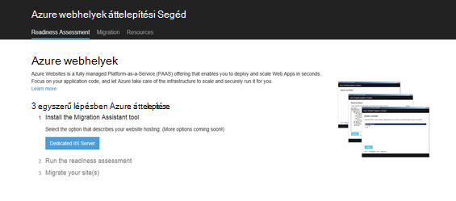

2.  A **Kitűzött célja IIS-kiszolgáló** gombra kattintva telepítse a Web Apps alkalmazások áttelepítési Segéd. További lehetőségek a közeljövőben beállítások lesz. 
4.  Kattintson a Web Apps alkalmazások áttelepítési segéd telepítése a számítógépen **Eszköz telepítése** gombra.

    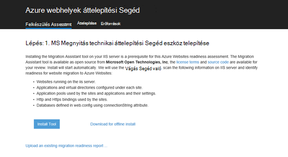

    >[AZURE.NOTE] **Letöltése a kapcsolat nélküli telepítés** nem kapcsolódik az internethez kiszolgálókon telepítésével kapcsolatos egy ZIP-fájl letöltése is kattinthat. Másik lehetőségként kattinthat **áttelepítési készenléti tartalmazó meglévő jelentés feltöltése**, vagyis egy meglévő áttelepítési készenléti jelentés, amely a korábban létrehozott (lentebbi) készült speciális lehetőséget.

5.  Az **Alkalmazás telepítése** képernyőjén kattintson a **telepítse** a számítógépen telepíteni. Megfelelő függőségek, például a webes üzembe, DacFX és IIS, azt is telepíti, ha szükséges. 

    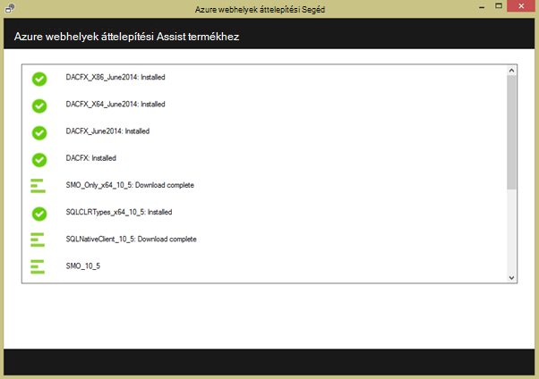

    Miután telepítette, Web Apps alkalmazások áttelepítési segéd automatikusan elindul.
  
6.  Válassza ki **a helyek áttérési és a távoli kiszolgáló Azure létrehozott adatbázisok**. Adja meg a távoli kiszolgáló a rendszergazdai hitelesítő adatokat, és kattintson a **Tovább**gombra. 

    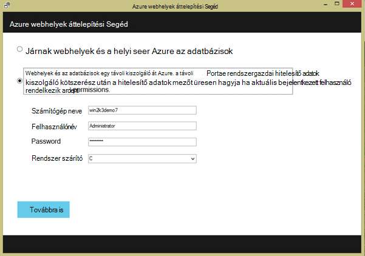

    Megadhatja a helyi kiszolgáló áttelepítése természetesen. A távoli lehetőség akkor hasznos, ha a webhelyek áttelepítendő egy gyártási IIS-kiszolgálóról.
 
    Ezen a ponton a az áttelepítési eszköz fogja találni a az IIS-kiszolgáló konfigurációja, például webhelyek, alkalmazások, webalkalmazás-készletek és függőségek áttelepítési jelölt webhelyek azonosítása. 

8.  Az alábbi képernyőképen három webhelyek – **alapértelmezett webhely** **TimeTracker**és **CommerceNet4**. Mindegyikük van egy társított adatbázis, amely azt át szeretné telepíteni. Jelölje ki az összes a webhelyek szeretné értékelni, és kattintson a **Tovább gombra**.

    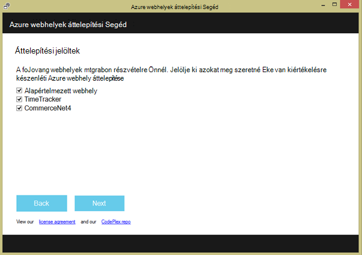
 
9.  Kattintson a **Feltöltés** töltse fel a Felkészülés a jelentés elemre. Gombra kattint, **Mentse a fájlt helyi meghajtóra**, ha később az áttelepítési eszköz futtatni, és töltse fel a mentett készenléti jelentés, amint korábbi.

    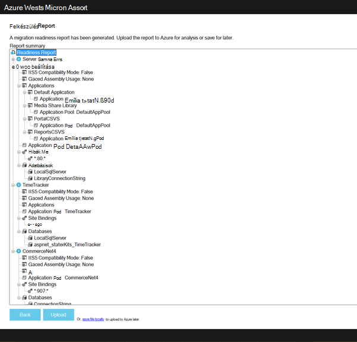
 
    A felkészülés jelentés tölt fel, Azure készenléti analysis hajt végre, és megjeleníti az eredményt. Olvassa el az egyes webhelyhez a felmérés adatait, és győződjön meg arról, hogy megértéséhez, vagy van címzett összes problémáról, akkor a folytatás előtt. 
 
    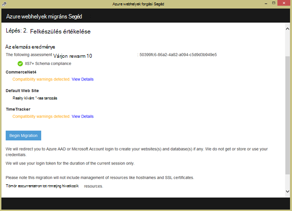

12. **Az áttelepítés megkezdéséhez** az áttelepítés indítása gombra. Most már az Azure bejelentkezni a fiókjába irányítja. Fontos, hogy jelentkezzen be az Azure active előfizetéssel rendelkező fiókkal. Ha nem rendelkezik az Azure-fiók majd is regisztrál az egy ingyenes próbaverzió [Itt](https://azure.microsoft.com/pricing/free-trial/?WT.srch=1&WT.mc_ID=SEM_). 

13. Jelölje ki a bérlői fiók, Azure előfizetés és kezelje az áttelepített Azure web Apps alkalmazások és az adatbázisok terület, és válassza az **Áttelepítés indítása gombot**. A webhelyek áttelepítése később is választhat.

    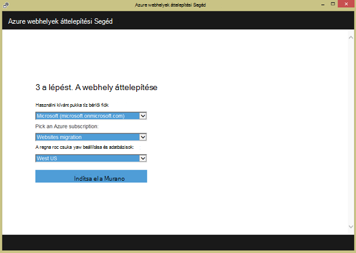

14. A következő képernyőn módosíthatja az alapértelmezett áttelepítési beállításokat, például:

    - meglévő Azure SQL-adatbázis használata új Azure SQL-adatbázis létrehozása és konfigurálása a hitelesítő adatok
    - Jelölje be a webhelyek áttelepítése
    - az Azure web Apps alkalmazások és a csatolt SQL-adatbázisait nevének megadása
    - a globális beállításainak és a webhely szintű beállításainak testreszabása

    Az alábbi képernyőképen minden olyan webhely, az alapértelmezett beállítások az áttelepítési-e jelölve.

    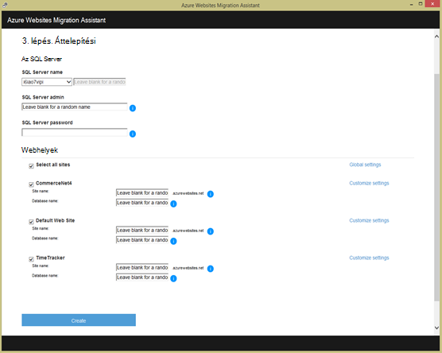

    >[AZURE.NOTE] az egyéni beállításokat az **Azure Active Directory engedélyezése** jelölőnégyzetet a Azure web app egyesíti a az [Azure Active Directory](active-directory-whatis.md) (az **Alapértelmezett címtár**). További információt a szinkronizálási Azure Active Directory a helyszíni Active Directoryval olvassa el a [címtár-integrációs](http://msdn.microsoft.com/library/jj573653)című témakört.

16.  A kívánt módosítások elvégzése után kattintson a **Létrehozás** megkezdheti az áttelepítési folyamatot. Az áttelepítési eszköz létrehozása az Azure SQL-adatbázis és Azure web App alkalmazásban, és tegye közzé a webhely tartalmát és az adatbázisokat. Az áttelepítési folyamat az áttelepítési eszköz jól látható, és a végén, mely adatait a webhelyek áttelepítése, hogy sikeres, mintha az újonnan létrehozott Azure web Apps alkalmazások csatol egy összefoglaló képernyő jelenik meg. 

    Bármilyen hiba esetén áttelepítés során, az áttelepítési eszköz világosan jelzi a hiba és visszaállítás a módosításokat. Is fogja tudni szeretne küldeni a hibákról szóló jelentéseket közvetlenül a mérnöki csapatának **Hibajelentés küldése** gombra, és a rögzített hiba hívás Papírhalom kattintva, és hozza létre az üzenet törzsébe. 

    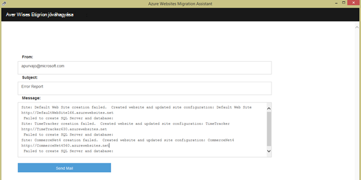

    Ha áttelepítése sikeres hibátlan, választhatja a **Visszajelzés** gombra közvetlenül bármely visszajelzést. 
 
20. A hivatkozásokra kattintva az Azure web Apps alkalmazások, és ellenőrizze, hogy az áttelepítés sikerült.

21. Kezelheti az áttelepített webalkalmazások Azure App szolgáltatásban. Ehhez jelentkezzen be az [Azure-portálon](https://portal.azure.com).

22. Az Azure-portálon nyissa meg a Web Apps alkalmazások lap tekintheti meg az áttelepített webhelyeket (lásd a web Apps), majd kattintson valamelyik őket, hogy elkezdheti kezelni a web app, például biztonsági másolatok, autoscaling, és nyomon használatát vagy a teljesítmény létrehozása a folyamatos közzététel konfigurálása.

    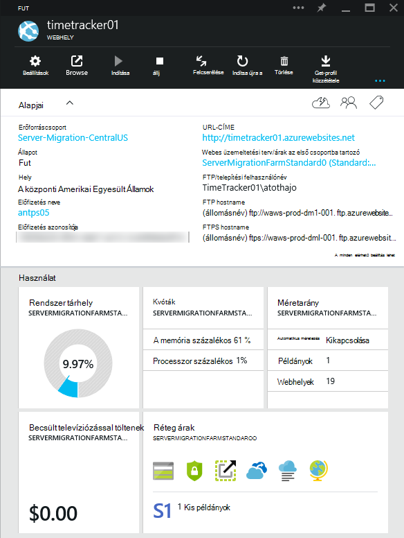

>[AZURE.NOTE] Ha azt szeretné, mielőtt feliratkozna az Azure-fiók kezdéshez Azure alkalmazás szolgáltatással, nyissa meg a [Próbálja alkalmazás szolgáltatás](http://go.microsoft.com/fwlink/?LinkId=523751), ahol azonnal létrehozhat egy rövid életű starter web app alkalmazás szolgáltatásban. Nem kötelező, hitelkártyák Nincs nyilatkozatát.

## Mi változott
* Módosítása egy segédvonalat a webhelyekre alkalmazás szolgáltatáshoz lásd: [Azure alkalmazás szolgáltatás, és a hatás a meglévő Azure-szolgáltatások](http://go.microsoft.com/fwlink/?LinkId=529714)
 
