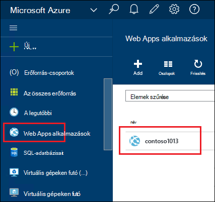
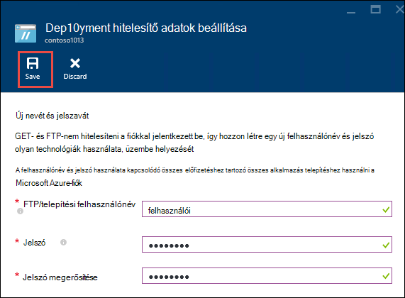
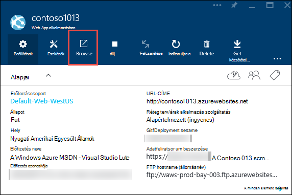
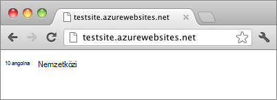

<properties
    pageTitle="Azure alkalmazás szolgáltatás hozzon létre Node.js webalkalmazást |} Microsoft Azure"
    description="Tudnivalók a web App alkalmazás Azure szolgáltatásban egy Node.js alkalmazás telepítéséhez."
    services="app-service\web"
    documentationCenter="nodejs"
    authors="rmcmurray"
    manager="wpickett"
    editor=""/>

<tags
    ms.service="app-service-web"
    ms.workload="web"
    ms.tgt_pltfrm="na"
    ms.devlang="nodejs"
    ms.topic="hero-article"
    ms.date="08/11/2016"
    ms.author="robmcm"/>

# Node.js webalkalmazást létrehozása az Azure alkalmazás szolgáltatás

> [AZURE.SELECTOR]
- [.NET](web-sites-dotnet-get-started.md)
- [NODE.js](web-sites-nodejs-develop-deploy-mac.md)
- [Java](web-sites-java-get-started.md)
- [PHP - mely számjegy](web-sites-php-mysql-deploy-use-git.md)
- [PHP - FTP](web-sites-php-mysql-deploy-use-ftp.md)
- [Python](web-sites-python-ptvs-django-mysql.md)

Ebből az oktatóanyagból megtudhatja, hogy miként hozzon létre egy egyszerű [Node.js](http://nodejs.org) alkalmazást, és üzembe [Azure alkalmazás szolgáltatás](../app-service/app-service-value-prop-what-is.md) [web app](app-service-web-overview.md) [mely számjegy](http://git-scm.com)használatával. Ebben az oktatóprogramban az utasításokat bármely operációs rendszeren futó Node.js képes követheti.

Dióhéjban:

* Hogyan lehet Azure alkalmazás szolgáltatás webalkalmazást létrehozása az Azure portál használatával.
* Hogyan lehet egy Node.js a web app alkalmazás telepítése a web app mely számjegy tárházba közvetítheti.

A kész alkalmazást egy rövid "Helló, világ" karakterlánc ír a böngészőben.

![A böngészőben, a "Helló, világ" üzenetben.][helloworld-completed]

Oktatóanyagok és további, összetettebb Node.js alkalmazásokkal példakódot, vagy egyéb témaköröket Node.js használatáról az Azure-ban olvassa el a [Node.js Developer Center](/develop/nodejs/)című témakört.

> [AZURE.NOTE]
> Oktatóprogram elvégzéséhez a Microsoft Azure-fiókra van szüksége. Ha nem rendelkeznek fiókkal, akkor [aktiválása a Visual Studio előfizetői juttatások](/en-us/pricing/member-offers/msdn-benefits-details/?WT.mc_id=A261C142F) , és [Regisztráljon az ingyenes próbaverzióra](/en-us/pricing/free-trial/?WT.mc_id=A261C142F).
>
> Ha szeretné az első lépések Azure alkalmazás szolgáltatás, mielőtt regisztrál az Azure-fiók, nyissa meg a [Alkalmazás szolgáltatás próbálja meg](http://go.microsoft.com/fwlink/?LinkId=523751). Azonnal létrehozhat egy rövid életű starter web app alkalmazás szolgáltatásban – nem kötelező hitelkártya, és nincs nyilatkozatát.

## Hozzon létre webalkalmazást, és mely számjegy közzétételi engedélyezése

Kövesse ezeket a lépéseket követve hozzon létre webalkalmazást Azure App szolgáltatásban, és mely számjegy közzétételi engedélyezése. 

[Mely számjegy](http://git-scm.com/) rendszer elosztott verzió vezérlő, amely a Azure-webhely üzembe is használhatja. A kódot a webalkalmazás egy helyi mely számjegy tárban tárolnak írhat fog tárolni, és fogja beállítaná a kód Azure egy távoli tárházba közvetítheti. Ez a módszer a központi telepítés jellemzi a alkalmazás szolgáltatás web Apps alkalmazások.  

1. Jelentkezzen be az [Azure-portálon](https://portal.azure.com).

2. Kattintson arra a Azure portál bal a **+ Új** ikonra a képernyő tetején.

3. **Webes + Mobile**gombra, és kattintson a **Web App alkalmazásban**.

    ![][portal-quick-create]

4. Írja be egy nevet a web app a **Web app** mezőbe.

    Ezt a nevet a azurewebsites.net tartományban egyedinek kell lennie, mert a web app URL-címe lesz {nevű}. azurewebsites.net. Ha a név nem egyedi, piros felkiáltójel jelenik meg, a szövegmezőbe.

5. Jelölje ki egy **előfizetést**.

6. Jelöljön ki egy **Erőforráscsoport** , vagy hozzon létre egy újat.

    Többet szeretne tudni az erőforrás csoportok az [erőforrás-kezelő Azure áttekintése](../azure-resource-manager/resource-group-overview.md)című témakörben találhat.

7. Jelölje be az **Alkalmazás szolgáltatás terv/helyét** , vagy hozzon létre egy újat.

    Többet szeretne tudni az App milyen szolgáltatáscsomagok a [Azure alkalmazás szolgáltatás csomagok áttekintése](../azure-web-sites-web-hosting-plans-in-depth-overview.md) című témakörben találhat.

8. Kattintson a **létrehozása**gombra.
   
    ![][portal-quick-create2]

    Rövid idő általában kisebb, mint egy perc Azure fejeződik be az új webalkalmazás létrehozása.

9. Kattintson a **Web Apps alkalmazások > {az új webalkalmazást}**.

    

10. Kattintson a **Web app** lap **telepítési** kijelzőt.

    ![][deployment-part]

11. A **Folyamatos telepítés** lap kattintson **Az adatforrás kiválasztása**

12. Kattintson a **Helyi mely számjegy tárházba**, és kattintson **az OK**gombra.

    ![][setup-git-publishing]

13. Ha még nem tette beállítása telepítési hitelesítő adatait.

    egy. Kattintson a Web app lap **beállításai > telepítési hitelesítő adatok**.

    ![][deployment-credentials]
 
    b. Hozzon létre egy felhasználónevet és jelszót. 
    
    

14. A Web app lap kattintson a **Beállítások**gombra, és válassza a **Tulajdonságok parancsot**.
 
    Szeretné közzétenni, egy távoli mely számjegy tárházba fogja leküldéses. A tár URL-CÍMÉT a **Mely Számjegy URL-címe**szerepel. Ez az URL az oktatóprogram belül kell megadnia.

    ![][git-url]

## Továbbépítése és az alkalmazás helyileg tesztelése

Ebben a részben kell létrehoznia, amely tartalmazza a "Helló, világ" példa a [nodejs.org] is módosultak kissé verziójának **server.js** fájl. A kód process.env.PORT felveszi a port hallgathatja meg az Azure-webappokban futtatásakor.

1. Hozzon létre egy *helloworld*nevű könyvtárában.

2. Egy egyszerű szövegszerkesztő programban segítségével **server.js** a *helloworld* címtárban nevű új fájl létrehozása.

2. A következő kódot másolja a **server.js** fájlt, és mentse a fájlt:

        var http = require('http')
        var port = process.env.PORT || 1337;
        http.createServer(function(req, res) {
          res.writeHead(200, { 'Content-Type': 'text/plain' });
          res.end('Hello World\n');
        }).listen(port);

3. Nyissa meg a parancssort, és használja a következő parancsot a helyi meghajtóra az webes alkalmazás indításához.

        node server.js

4. Nyissa meg a böngészőt, és kattintson a http://localhost:1337. 

    Egy weblap, amely megjeleníti a "Helló, világ" jelenik meg, az alábbi képernyőképen látható módon.

    ![A böngészőben, a "Helló, világ" üzenetben.][helloworld-localhost]

## Az alkalmazás közzététele

1. Ha még nem tette, telepítse a mely számjegy.

    A platform telepítési című témakör nyújt tájékoztatást a [mely számjegy, töltse le a lapot](http://git-scm.com/download).

1. A parancssorból könyvtárak **helloworld** váltson, és írja be a következő parancsot a helyi mely számjegy tárházba inicializálni.

        git init

2. Az alábbi parancsokkal fájlok hozzáadása a tár:

        git add .
        git commit -m "initial commit"

3. Adja meg a távoli-frissítések terjesztése az előzőekben létrehozott, a következő parancs használatával web App mely számjegy:

        git remote add azure [URL for remote repository]

4. A módosítások leküldéses az Azure a következő parancs használatával:

        git push azure master

    Kéri a jelszót, hogy korábban létrehozott. A kimenet hasonlít az alábbi példa.

        Counting objects: 3, done.
        Delta compression using up to 8 threads.
        Compressing objects: 100% (2/2), done.
        Writing objects: 100% (3/3), 374 bytes, done.
        Total 3 (delta 0), reused 0 (delta 0)
        remote: New deployment received.
        remote: Updating branch 'master'.
        remote: Preparing deployment for commit id '5ebbe250c9'.
        remote: Preparing files for deployment.
        remote: Deploying Web.config to enable Node.js activation.
        remote: Deployment successful.
        To https://user@testsite.scm.azurewebsites.net/testsite.git
         * [new branch]      master -> master

5. Az alkalmazás megtekintéséhez a **Tallózás** gombra a **Web App** részen az Azure-portálon.

    

    

## Az alkalmazás módosításainak közzététele

1. Nyissa meg a **server.js** fájlt egy szövegszerkesztőben, és módosítsa a "Hello World\n" a "Hello Azure\n". 

2. Mentse a fájlt.

2. A parancssorból könyvtárak **helloworld** váltson, és futtassa az alábbi parancsokat:

        git add .
        git commit -m "changing to hello azure"
        git push azure master

    Kéri a jelszót újra.

3. Frissítse a böngészőablakot, amely akkor átláthassák a web app URL-címre.

    !["Hello Azure" megjelenítő weblap][helloworld-completed]

## A telepítés visszaállítása

A **Web app** lap a kattinthat **beállításai > folyamatos telepítési** megtekintéséhez kattintson a **telepítés** lap telepítési előzményeinek. Visszaállíthatja egy korábbi telepítési van szüksége, ha jelölje ki azt, és kattintson a **telepítsen újra** a **Telepítési részletek** lap.

## Következő lépések

Azure App szolgáltatásban webalkalmazást egy Node.js alkalmazás van telepítve. Többet szeretne tudni az alkalmazás-szolgáltatás web Apps alkalmazások futásának Node.js alkalmazások, lásd: [Azure alkalmazás Service Web Apps alkalmazások: Node.js](http://blogs.msdn.com/b/silverlining/archive/2012/06/14/windows-azure-websites-node-js.aspx) , és [Adja meg az Azure alkalmazásokban Node.js verziót](../nodejs-specify-node-version-azure-apps.md).

NODE.js biztosít a multimédiás ökológiai modulokat az alkalmazások által használt. Web Apps alkalmazások működése modulok című témakörben [használatával Node.js modulok Azure-alkalmazásokkal](../nodejs-use-node-modules-azure-apps.md).

Ha után az Azure lett telepítve az alkalmazással problémákat tapasztal, itt tájékozódhat [szeretné hibakeresése egy Node.js alkalmazás Azure App szolgáltatásban](web-sites-nodejs-debug.md) információt a probléma azonosításában.

Ez a cikk az Azure-portálon használja a webes alkalmazás létrehozása céljából. Az azonos műveletek elvégzését az [Azure parancssor](../xplat-cli-install.md) vagy [Azure PowerShell](../powershell-install-configure.md) is használhatja.

Azure Node.js-alkalmazásokkal kapcsolatos további tudnivalókért lásd: a [Node.js Developer Center](/develop/nodejs/).

[helloworld-completed]: ./media/web-sites-nodejs-develop-deploy-mac/helloazure.png
[helloworld-localhost]: ./media/web-sites-nodejs-develop-deploy-mac/helloworldlocal.png
[portal-quick-create]: ./media/web-sites-nodejs-develop-deploy-mac/create-quick-website.png
[portal-quick-create2]: ./media/web-sites-nodejs-develop-deploy-mac/create-quick-website2.png
[setup-git-publishing]: ./media/web-sites-nodejs-develop-deploy-mac/setup_git_publishing.png
[go-to-dashboard]: ./media/web-sites-nodejs-develop-deploy-mac/go_to_dashboard.png
[deployment-part]: ./media/web-sites-nodejs-develop-deploy-mac/deployment-part.png
[deployment-credentials]: ./media/web-sites-nodejs-develop-deploy-mac/deployment-credentials.png
[git-url]: ./media/web-sites-nodejs-develop-deploy-mac/git-url.png
