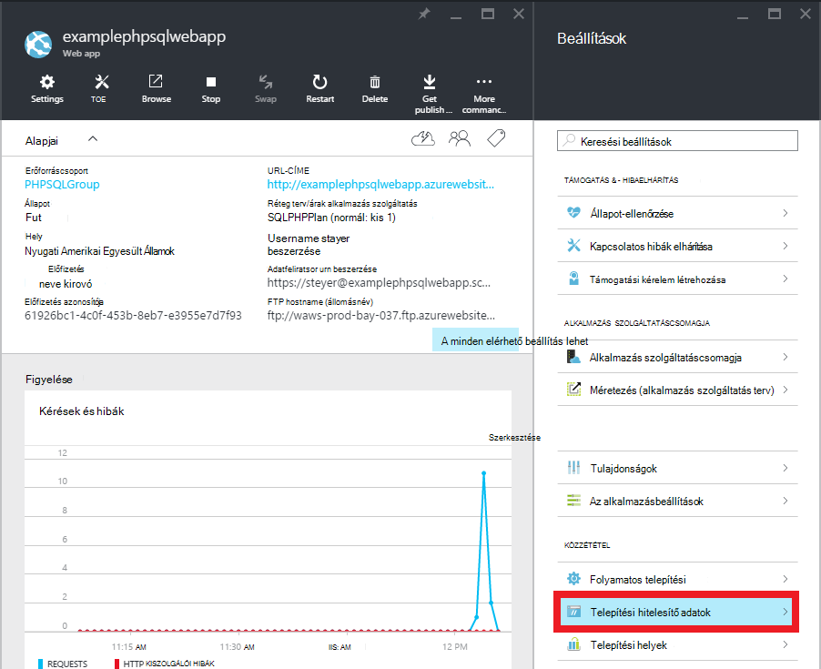

<properties 
    pageTitle="Hozzon létre PHP-SQL nyelvben webalkalmazást, és telepítse az Azure alkalmazás szolgáltatás mely számjegy" 
    description="Egy oktatóprogram, mely szemlélteti, hogyan hozhat létre Azure SQL-adatbázis adatokat tároló PHP webalkalmazást, és mely számjegy telepítési Azure alkalmazás szolgáltatás használata." 
    services="app-service\web, sql-database" 
    documentationCenter="php" 
    authors="rmcmurray" 
    manager="wpickett" 
    editor=""/>

<tags 
    ms.service="app-service-web" 
    ms.workload="web" 
    ms.tgt_pltfrm="na" 
    ms.devlang="PHP" 
    ms.topic="article" 
    ms.date="08/11/2016" 
    ms.author="robmcm"/>

# Hozzon létre PHP-SQL nyelvben webalkalmazást, és telepítse az Azure alkalmazás szolgáltatás mely számjegy

Ebből az oktatóanyagból megtudhatja, PHP webalkalmazást létrehozása az [Azure alkalmazás szolgáltatás](http://go.microsoft.com/fwlink/?LinkId=529714) Azure SQL-adatbázishoz kapcsolódó és telepítéséről, mely számjegy használatával. Ebben az oktatóanyagban feltételezi, hogy van-e [PHP][install-php], [SQL Server Express][install-SQLExpress], a [Microsoft SQL Server-PHP-illesztőprogramok](http://www.microsoft.com/download/en/details.aspx?id=20098), és [mely számjegy] [ install-git] telepítve van a számítógépén. Ez az útmutató befejeztével Azure-ban futó PHP-SQL nyelvben webalkalmazást lesz.

> [AZURE.NOTE]
> Telepítse, és PHP, SQL Server Express és a Microsoft Drivers konfigurálása a [Microsoft webes Platform telepítő](http://www.microsoft.com/web/downloads/platform.aspx)használatával PHP az SQL Server.

Ismerkedhet meg:

* Hogyan lehet az Azure web app és az [Azure-portálon](http://go.microsoft.com/fwlink/?LinkId=529715)SQL-adatbázis létrehozása. Mivel PHP alapértelmezés szerint engedélyezve van az alkalmazás szolgáltatás webalkalmazásokban, semmi speciális a PHP-kód futtatásához szükséges.
* Hogyan lehet közzé, és tegye közzé újra az alkalmazást használja, mely számjegy Azure.
 
Ebben az oktatóanyagban követve PHP az egyszerű regisztrációs webalkalmazás fog generál. Az alkalmazás fog tárolni az Azure-webhelyet. Képernyőkép a kész alkalmazást nem éri el:

[AZURE.INCLUDE [create-account-and-websites-note](../../includes/create-account-and-websites-note.md)]

>[AZURE.NOTE] Ha azt szeretné, mielőtt feliratkozna az Azure-fiók használatbavételéhez Azure alkalmazás szolgáltatás, [Próbálja meg alkalmazás szolgáltatás](http://go.microsoft.com/fwlink/?LinkId=523751), ahol azonnal létrehozhat egy rövid életű starter web app alkalmazás szolgáltatásban megnyitásához. Nem kötelező, hitelkártyák Nincs nyilatkozatát.

##Az Azure web app létrehozása, és mely számjegy történő közzététel beállítása

Kövesse ezeket a lépéseket követve az Azure web app és az SQL-adatbázis létrehozása:

1. Jelentkezzen be az [Azure-portálon](https://portal.azure.com/).

2. Nyissa meg az **Új** ikonra a képernyő tetején kattintson a Microsoft Azure piactéren balra az irányítópult, kattintson **Az összes kijelölése** piactér, és válassza az **webes + Mobile**mellett.
    
3. Jelölje ki a piactér, **webes + Mobile**.

4. Kattintson a **Web app + SQL** ikonra.

5. Válassza a Web app + SQL-alkalmazás leírása elolvasása, után **létrehozása**lehetőséget.

6. Mindegyik (**Erőforráscsoport**, **Webalkalmazás**, **adatbázis**és **előfizetés**) részen kattintson, és adja meg, vagy válassza ki a szükséges mezők értékeit:
    
    - Írja be az URL-név lehetőség   
    - Adatbázis-kiszolgáló hitelesítő adatok beállítása
    - Jelölje ki a legközelebb régió

    

7. Amikor befejezte a web app definiálásával, kattintson a **Létrehozás**gombra.

    A web app létrehozásakor az **értesítések** gombra a **sikeres** zöld pedig az erőforrás csoportot a lap megnyitása a web app és az SQL-adatbázis megjelenítése a csoport fog flash.

4. Kattintson a web app ikonra kattintva nyissa meg a web app lap az erőforrás csoport lap.

    

5. A **Beállítások** kattintson a **folyamatos telepítési** > **konfigurálása szükséges beállításai**. Jelölje ki a **Helyi mely számjegy tárházba** , és kattintson az **OK gombra**.

    

    Ha nincs beállítva a mely számjegy tárházba előtt, meg kell adnia egy felhasználónevet és jelszót. Ehhez kattintson a **Beállítások** > **telepítési hitelesítő adatok** az a web app lap.

    

6. A **Beállítások** kattintson a **Tulajdonságok** megjelenítéséhez, mely számjegy távoli URL-CÍMÉT az PHP alkalmazást később telepítése szükséges.

##SQL-adatbázis-kapcsolat beállításai

Az SQL-adatbázis példányához, amely a web App alkalmazásban, a fog van csatolva van szüksége a kapcsolat adatait, amelyek a megadott az adatbázis létrehozásakor. Ha a kapcsolat SQL-adatbázis információkra, kövesse az alábbi lépéseket:

1. Vissza a lap az erőforráscsoport, kattintson az SQL-adatbázis ikonra.

2. Az SQL-adatbázis lap, kattintson a **Beállítások** > **tulajdonságait**, kattintson a **Megjelenítés adatbázis kapcsolati karakterláncot**. 

    
    
3. Az eredményül kapott párbeszédpanel **PHP** szakaszában, jegyezze fel a értékeit `Server`, `SQL Database`, és `User Name`. Ezeket az értékeket fogja használni későbbi, az PHP webalkalmazást Azure alkalmazás szolgáltatás közzétételekor.

##Továbbépítése és az alkalmazás helyileg tesztelése

A regisztráció alkalmazása egy egyszerű PHP-alkalmazás, amely lehetővé teszi, hogy regisztráljon az esemény, mert a nevét és e-mail címét. Előző igénylők információt egy táblázatban jelennek meg. Regisztrációs adatokat egy SQL-adatbázis-példány vannak tárolva. Az alkalmazás két fájlok (alatti érhető el a másolás és beillesztés kód) áll:

* **index.php**: regisztráció és a bejegyzés információkat tartalmazó táblában űrlapot jeleníti meg.
* **createtable.php**: az alkalmazás az SQL-adatbázis táblázatot hoz létre. Ez a fájl csak egyszer lesz.

Az alkalmazás futtatásához a helyi meghajtóra, kövesse az alábbi lépéseket. Figyelje meg, hogy ezek a lépések feltételezik PHP és az SQL Server Express állítsa be a helyi számítógépen van, és az [SQL Server OEM bővítményének]engedélyezte[pdo-sqlsrv].

1. Hozzon létre egy SQL Server-adatbázis neve `registration`. Az ezt megteheti a `sqlcmd` ezeket a parancsokat a parancssor parancsot:

        >sqlcmd -S localhost\sqlexpress -U <local user name> -P <local password>
        1> create database registration
        2> GO   

2. Az alkalmazás legfelső szintű könyvtárában hozzon létre két fájlokat – egy úgynevezett `createtable.php` és egy úgynevezett `index.php`.

3. Nyissa meg a `createtable.php` fájlt egy szövegszerkesztőben vagy IDE, és adja hozzá a következő kódot. Ez a kód használandó létrehozása a `registration_tbl` tábla a `registration` adatbázis.

        <?php
        // DB connection info
        $host = "localhost\sqlexpress";
        $user = "user name";
        $pwd = "password";
        $db = "registration";
        try{
            $conn = new PDO( "sqlsrv:Server= $host ; Database = $db ", $user, $pwd);
            $conn->setAttribute( PDO::ATTR_ERRMODE, PDO::ERRMODE_EXCEPTION );
            $sql = "CREATE TABLE registration_tbl(
            id INT NOT NULL IDENTITY(1,1) 
            PRIMARY KEY(id),
            name VARCHAR(30),
            email VARCHAR(30),
            date DATE)";
            $conn->query($sql);
        }
        catch(Exception $e){
            die(print_r($e));
        }
        echo "<h3>Table created.</h3>";
        ?>

    Figyelje meg, hogy meg kell frissíteni az értékeket az <code>$user</code> és <code>$pwd</code> helyi SQL Server-felhasználónevet és jelszót.

4. Írja be a terminálablakba a legfelső szintű könyvtárban az alkalmazás a következő parancsot:

        php -S localhost:8000

4. Nyisson meg egy webböngészőt, és keresse meg **http://localhost:8000/createtable.php**. Ez a művelet létrehoz a `registration_tbl` az adatbázis.

5. Nyissa meg a **index.php** fájlt egy szövegszerkesztőben vagy IDE, és a hozzá az egyszerű HTML- és CSS kódot (a PHP kód megjelenik az újabb lépések) lap.

        <html>
        <head>
        <Title>Registration Form</Title>
        
        </head>
        <body>
        <h1>Register here!</h1>
        
Fill in your name and email address, then click <strong>Submit</strong> to register.

        <form method="post" action="index.php" enctype="multipart/form-data" >
              Name  <input type="text" name="name" id="name"/> 
              Email <input type="text" name="email" id="email"/> 
              <input type="submit" name="submit" value="Submit" />
        </form>
        <?php

        ?>
        </body>
        </html>

6. Belül a PHP címkék hozzáadása az adatbázishoz való csatlakozáshoz PHP-kódot.

        // DB connection info
        $host = "localhost\sqlexpress";
        $user = "user name";
        $pwd = "password";
        $db = "registration";
        // Connect to database.
        try {
            $conn = new PDO( "sqlsrv:Server= $host ; Database = $db ", $user, $pwd);
            $conn->setAttribute( PDO::ATTR_ERRMODE, PDO::ERRMODE_EXCEPTION );
        }
        catch(Exception $e){
            die(var_dump($e));
        }

    Ismét meg kell frissíteni az értékeket az <code>$user</code> és <code>$pwd</code> helyi MySQL-felhasználónevet és jelszót.

7. Követni a adatbázis-kapcsolatot kódot vegye fel a regisztrációs adatok beszúrása az adatbázisba kódját.

        if(!empty($_POST)) {
        try {
            $name = $_POST['name'];
            $email = $_POST['email'];
            $date = date("Y-m-d");
            // Insert data
            $sql_insert = "INSERT INTO registration_tbl (name, email, date) 
                           VALUES (?,?,?)";
            $stmt = $conn->prepare($sql_insert);
            $stmt->bindValue(1, $name);
            $stmt->bindValue(2, $email);
            $stmt->bindValue(3, $date);
            $stmt->execute();
        }
        catch(Exception $e) {
            die(var_dump($e));
        }
        echo "<h3>Your're registered!</h3>";
        }

8. Végezetül követően a fenti kódot, adja hozzá az adatbázisból származó adatok visszakeresése kódját.

        $sql_select = "SELECT * FROM registration_tbl";
        $stmt = $conn->query($sql_select);
        $registrants = $stmt->fetchAll(); 
        if(count($registrants) > 0) {
            echo "<h2>People who are registered:</h2>";
            echo "<table>";
            echo "<tr><th>Name</th>";
            echo "<th>Email</th>";
            echo "<th>Date</th></tr>";
            foreach($registrants as $registrant) {
                echo "<tr><td>".$registrant['name']."</td>";
                echo "<td>".$registrant['email']."</td>";
                echo "<td>".$registrant['date']."</td></tr>";
            }
            echo "</table>";
        } else {
            echo "<h3>No one is currently registered.</h3>";
        }

**Http://localhost:8000/index.php** tesztelje az alkalmazás letöltése tallózással.

##Az alkalmazás közzététele

Az alkalmazás helyileg tesztelése, után közzéteheti alkalmazás szolgáltatás Web Apps alkalmazások használata a mely számjegy. Jó helyen jár először kell frissíteni az alkalmazást az adatbázis-kapcsolat beállításai. A következő információkat **is** az adatbázis-kapcsolati adatait, szerezte be korábbi (használata **az SQL-adatbázis kérjen csatlakozási adatok** csoportban) frissítheti a `createdatabase.php` és `index.php` a megfelelő értékeket tartalmazó fájlok:

    // DB connection info
    $host = "tcp:<value of Server>";
    $user = "<value of User Name>";
    $pwd = "<your password>";
    $db = "<value of SQL Database>";

> [AZURE.NOTE]
> Az a <code>$host</code>, a kiszolgáló értéket kell $a, a <code>tcp:</code>.

Ettől kezdve készen áll az alkalmazás közzététele és mely számjegy közzétételi beállítása.

> [AZURE.NOTE]
> Ezek a fenti **létrehozása az Azure web app, és mely számjegy történő közzététel beállítása** szakasz végén jegyezni ezeket a lépéseket.

1. Nyissa meg a GitBash (vagy a terminált, mely számjegy esetén a `PATH`), váltson a legfelső szintű könyvtárak az alkalmazás (a **regisztrációs** directory), és futtassa az alábbi parancsokat:

        git init
        git add .
        git commit -m "initial commit"
        git remote add azure [URL for remote repository]
        git push azure master

    Kéri a korábban létrehozott jelszót.

2. Keresse meg azt a **http://[web alkalmazás name].azurewebsites.net/createtable.php** alkalmazásához SQL-adatbázis tábla létrehozása.
3. Tallózással keresse meg a **http://[web alkalmazás name].azurewebsites.net/index.php** az alkalmazás használatának megkezdéséhez.

Az alkalmazás közzétételét követően kezdődik a változtatásokat, és mely számjegy használható közzéteheti őket. 

##Az alkalmazás módosításainak közzététele

Az alkalmazás módosításainak közzététele, kövesse az alábbi lépéseket:

1. Az alkalmazás helyileg végezze el a módosításokat.
2. Nyissa meg a GitBash (vagy a terminált, mely számjegy értéke az informatikai a `PATH`), váltson a legfelső szintű könyvtárak az alkalmazást, és futtassa az alábbi parancsokat:

        git add .
        git commit -m "comment describing changes"
        git push azure master

    Kéri a korábban létrehozott jelszót.

3. Tallózással keresse meg a **http://[web alkalmazás name].azurewebsites.net/index.php** a módosítások megtekintéséhez.

## Mi változott
* Módosítása egy segédvonalat a webhelyekre alkalmazás szolgáltatáshoz lásd: [Azure alkalmazás szolgáltatás, és a hatás a meglévő Azure-szolgáltatások](http://go.microsoft.com/fwlink/?LinkId=529714)

[install-php]: http://www.php.net/manual/en/install.php
[install-SQLExpress]: http://www.microsoft.com/download/details.aspx?id=29062
[install-Drivers]: http://www.microsoft.com/download/details.aspx?id=20098
[install-git]: http://git-scm.com/
[pdo-sqlsrv]: http://php.net/pdo_sqlsrv
 
