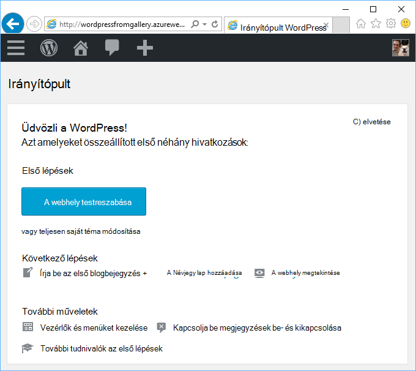
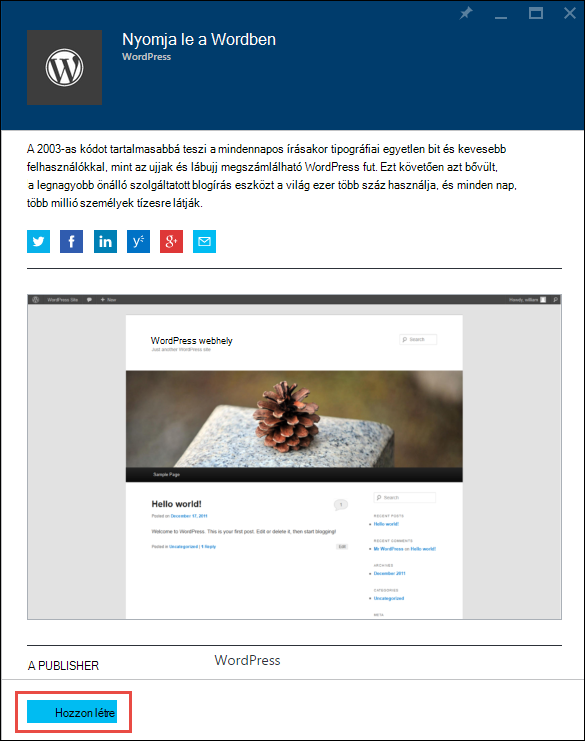
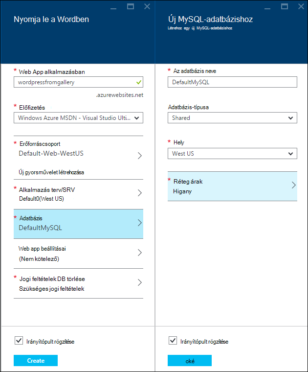
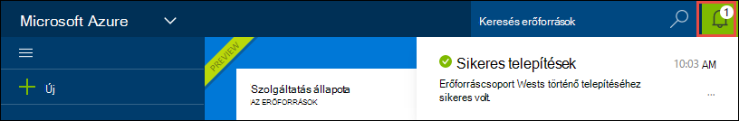
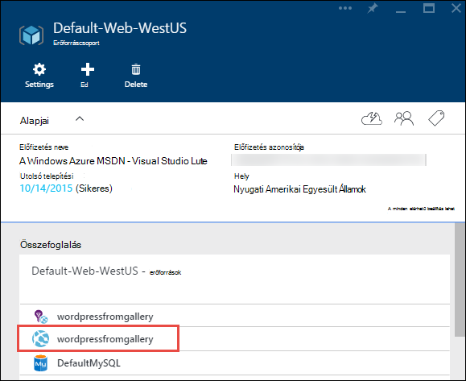
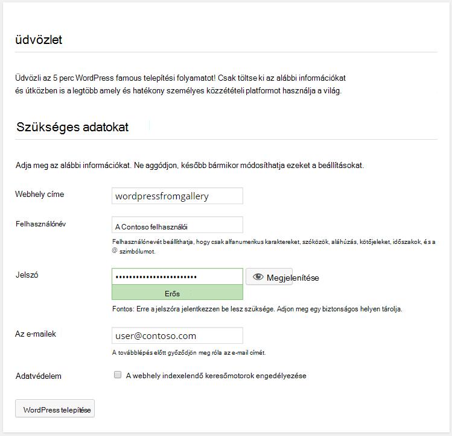

<properties
    pageTitle="Azure alkalmazás szolgáltatás hozzon létre WordPress webalkalmazást |} Microsoft Azure"
    description="Megtudhatja, hogyan hozhat létre egy új Azure webalkalmazást WordPress blog az Azure-portálon."
    services="app-service\web"
    documentationCenter="php"
    authors="rmcmurray"
    manager="wpickett"
    editor=""/>

<tags
    ms.service="app-service-web"
    ms.workload="na"
    ms.tgt_pltfrm="na"
    ms.devlang="PHP"
    ms.topic="hero-article"
    ms.date="08/11/2016"
    ms.author="robmcm"/>

# WordPress webalkalmazást létrehozása az Azure alkalmazás szolgáltatás

[AZURE.INCLUDE [tabs](../../includes/app-service-web-get-started-nav-tabs.md)]

Ebből az oktatóanyagból megtudhatja, hogy miként telepíteni a Microsoft Azure piactéren lévő WordPress webnaplót tartalmazó webhelyen.

Amikor elkészült az oktatóprogram is be a saját WordPress webnaplót tartalmazó webhelyen és futtatása a felhőben.

Dióhéjban:

* Hogyan lehet egy alkalmazás sablon keresése a Microsoft Azure piactéren.
* Hogyan lehet egy webalkalmazás létrehozása az Azure alkalmazás szolgáltatás, amely a sablonon alapuló.
* Hogyan lehet az új web app és az adatbázis Azure alkalmazás szolgáltatás beállításainak konfigurálása.

A Microsoft Azure piactéren elérhetővé teszi a népszerű web Apps alkalmazások Microsoft, külső cégek és Megnyitás szoftver kezdeményezéseket által fejlesztett széles köre. A web Apps alkalmazások kialakításának meg számos népszerű keretek, például [PHP](/develop/nodejs/) e WordPress példa, a [.NET](/develop/net/), [Node.js](/develop/nodejs/), [Java](/develop/java/)és [Python](/develop/python/)néhány nevet. Egy webalkalmazás létrehozása a Microsoft Azure piactéren lévő csak szoftver van szüksége van, amely az [Azure-portálon](https://portal.azure.com/)használja a böngészőben. 

Ebben az oktatóanyagban rendszerbe WordPress webhely MySQL használja az adatbázist. Ha szeretné helyette az adatbázis használata SQL-adatbázis, olvassa el a [Project Nami](http://projectnami.org/). **Projekt Nami** a piactér keresztül is érhető el.

> [AZURE.NOTE]
> Oktatóprogram elvégzéséhez a Microsoft Azure-fiókra van szüksége. Ha nem rendelkeznek fiókkal, akkor [aktiválása a Visual Studio előfizetői juttatások](/pricing/member-offers/msdn-benefits-details/?WT.mc_id=A261C142F) , és [Regisztráljon az ingyenes próbaverzióra](/en-us/pricing/free-trial/?WT.mc_id=A261C142F).
>
> Ha szeretné az első lépések Azure alkalmazás szolgáltatás, mielőtt regisztrál az Azure-fiók, nyissa meg a [Alkalmazás szolgáltatás próbálja meg](http://go.microsoft.com/fwlink/?LinkId=523751). Azonnal létrehozhat egy rövid életű starter web app alkalmazás szolgáltatásban – nem kötelező hitelkártya, és nincs nyilatkozatát.

## Jelölje ki a WordPress és Azure alkalmazás szolgáltatás konfigurálása

1. Jelentkezzen be az [Azure-portálon](https://portal.azure.com/).

2. Kattintson az **Új**gombra.
    
    ![Új gyorsművelet létrehozása][5]
    
3. **WordPress**keresni, és kattintson a **WordPress**. Ha szeretne SQL-adatbázis használata helyett MySQL, keresse meg a **Projekt Nami**.

    ![WordPress listából][7]
    
5. A leírás WordPress alkalmazás elolvasása, után kattintson a **Létrehozás**gombra.

    

4. Írja be egy nevet a web app a **Web app** mezőbe.

    Ezt a nevet a azurewebsites.net tartományban egyedinek kell lennie, mert a web app URL-címe lesz {nevű}. azurewebsites.net. Ha a név nem egyedi, piros felkiáltójel jelenik meg, a szövegmezőbe.

8. Ha egynél több előfizetése van, válassza a használni kívántat. 

5. Jelöljön ki egy **Erőforráscsoport** , vagy hozzon létre egy újat.

    Többet szeretne tudni az erőforrás csoportok az [erőforrás-kezelő Azure áttekintése](../azure-resource-manager/resource-group-overview.md)című témakörben találhat.

5. Jelölje be az **Alkalmazás szolgáltatás terv/helyét** , vagy hozzon létre egy újat.

    Többet szeretne tudni az App milyen szolgáltatáscsomagok a [Azure alkalmazás szolgáltatás csomagok áttekintése](../azure-web-sites-web-hosting-plans-in-depth-overview.md) című témakörben találhat. 

7. Kattintson az **adatbázist**, és kattintson az **Új MySQL-adatbázis** lap az adja meg a szükséges értékeket a MySQL-adatbázis konfigurációs.

    egy. Írjon be egy új nevet, vagy hagyja az alapértelmezett nevet.

    b. Hagyja meg a **megosztott** **Adatbázis típusát** .

    c billentyűkombinációt. Válassza az ezen a helyen, mint amit a webalkalmazásban.

    d. Válasszon egy árak réteg. Higany (ingyenes minimális engedélyezett kapcsolatok és a szabad lemezterület) nem kell aggódnia az ebben az oktatóanyagban.

8. A lap az **Új MySQL-adatbázishoz** kattintson **az OK gombra**. 

8. A **WordPress** lap fogadja el a jogi szerződést, és kattintson a **Létrehozás**gombra. 

    

    Azure alkalmazás Service hoz létre a web app általában egy perc alatt. A portáloldalon tetején harang ikonra kattintva megtekinthet végrehajtását.

    

## Indítsa el, és kezelheti a WordPress web App alkalmazásban
    
7. A webhely-alkalmazás létrehozása befejeződése után nyissa meg az erőforrás-csoportba, amelyben az alkalmazás létrehozása az Azure-portálon, és megjelenik a web app és az adatbázis.

    A további erőforrások az lámpa ikon [Alkalmazás Hírcsatornájában](/services/application-insights/), amely a webalkalmazás felügyeleti szolgáltatásokat nyújt.

1. Az **erőforráscsoport** lap kattintson a web app sor.

    

2. A Web app lap, a **Tallózás**gombra.

    ![webhely URL-címe][browse]

3. WordPress **Üdvözöljük** lapon adja meg a konfiguráció szükséges WordPress, és válassza a **Telepítés WordPress**.

    

4. Jelentkezzen be a hitelesítő adatok hozta létre az **Üdvözöljük** lapon.  

5. A webhely az irányítópult lapon nyílik meg.    

    

## Következő lépések

Láthatta, hogyan hozhat létre, és a gyűjteményből PHP webes alkalmazások terjesztése. Azure PHP használatával kapcsolatos további tudnivalókért lásd: a [PHP Developer Center](/develop/php/).

Alkalmazás Service Web Apps alkalmazások használata a további tudnivalókért lásd: a hivatkozások (széles böngészőablakot) lap bal oldalán vagy (keskeny böngészőablakot) lap tetején. 

## Mi változott
* Útmutató a módosítása a webhelyekre alkalmazás szolgáltatás a [Azure alkalmazás szolgáltatás és a hatása a meglévő Azure-szolgáltatások](http://go.microsoft.com/fwlink/?LinkId=529714)témakörben talál.

[5]: ./media/web-sites-php-web-site-gallery/startmarketplace.png
[7]: ./media/web-sites-php-web-site-gallery/search-web-app.png
[browse]: ./media/web-sites-php-web-site-gallery/browse-web.png
