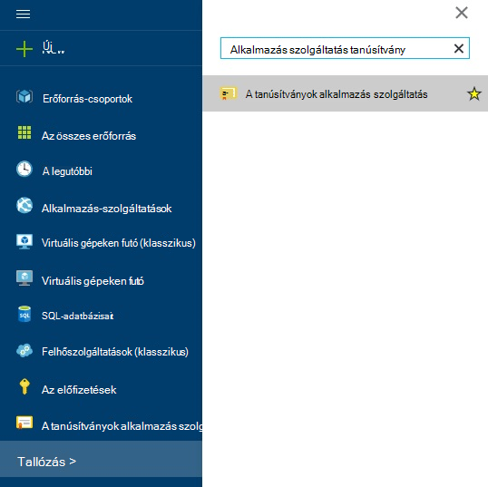
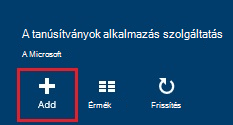
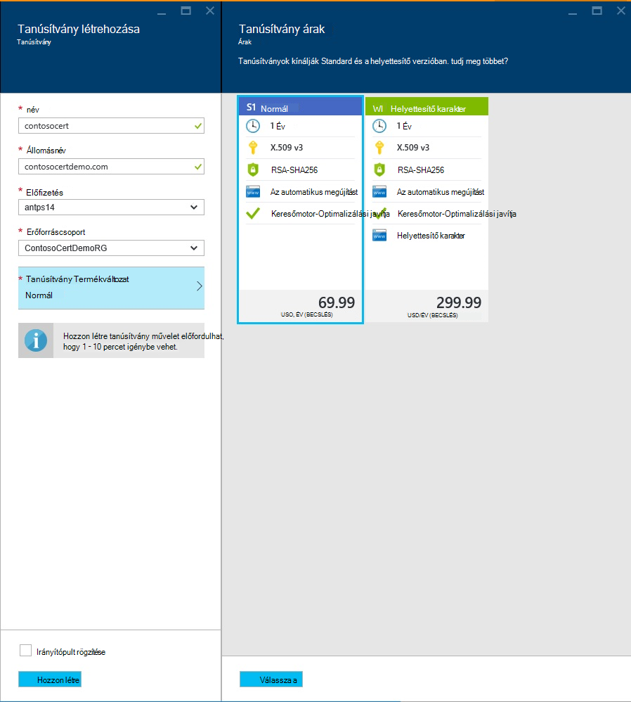
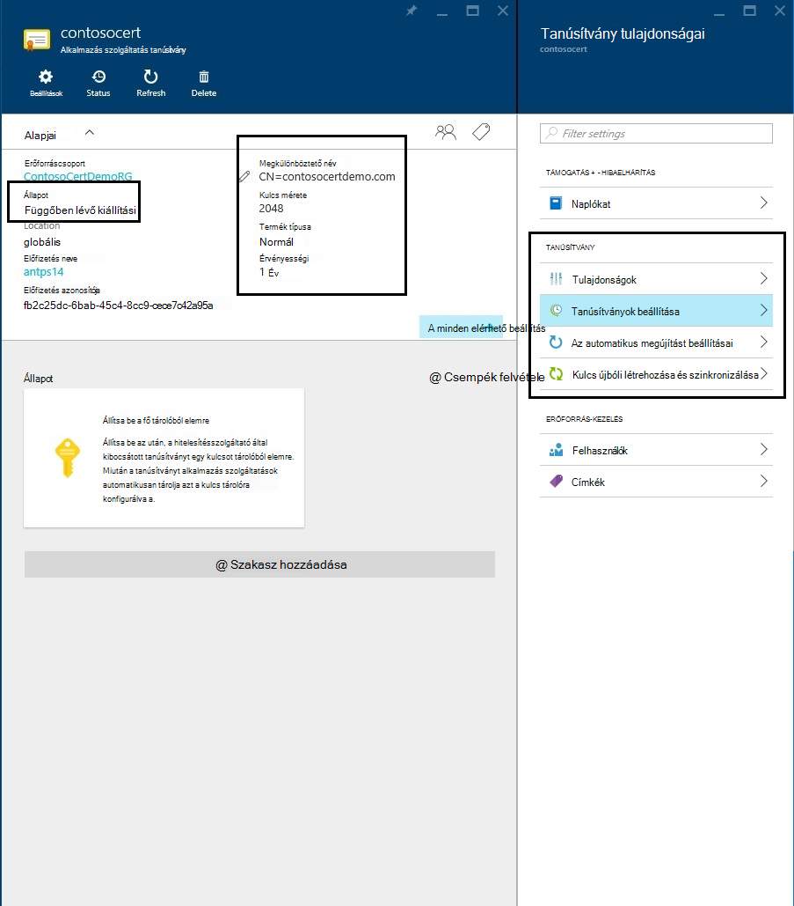
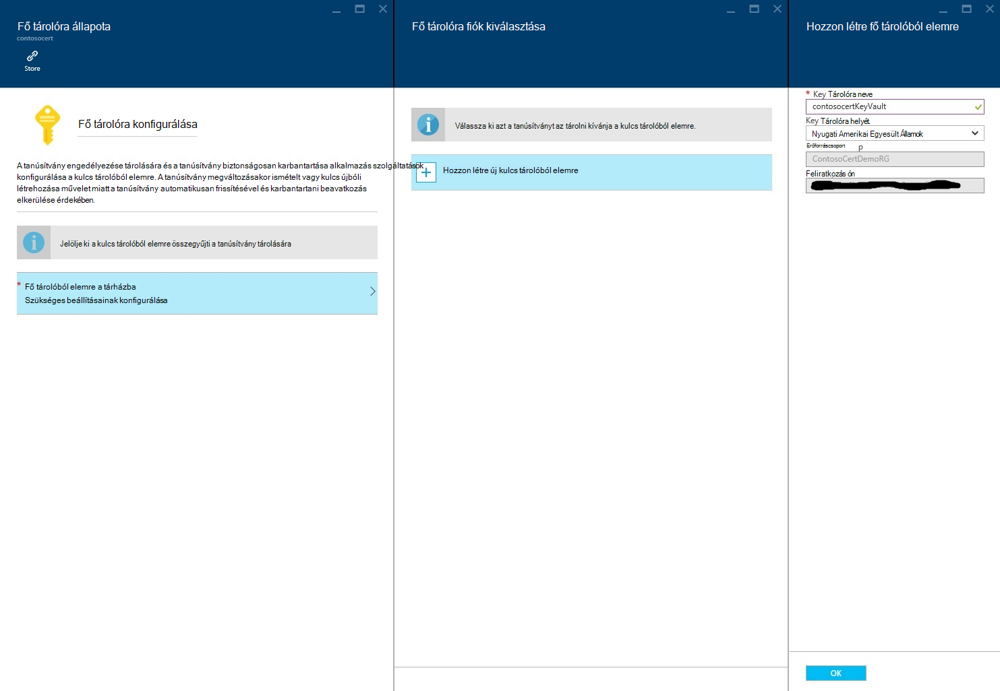
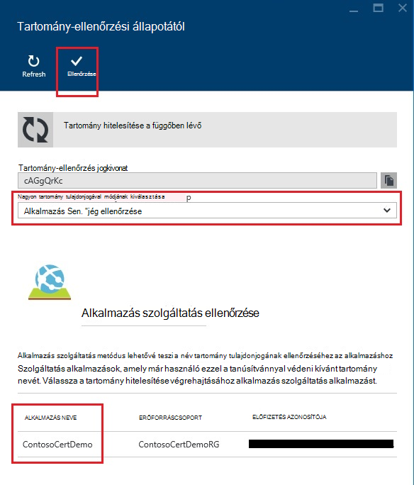
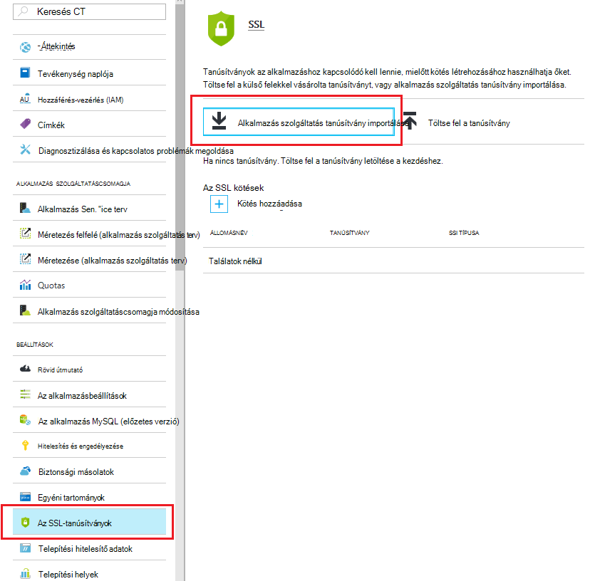
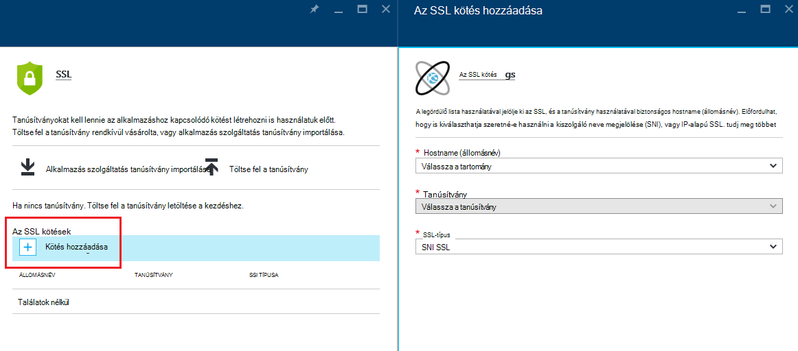
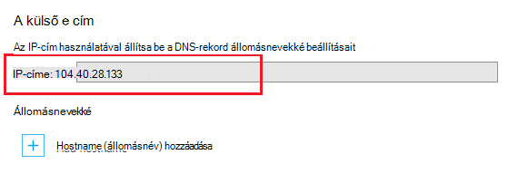
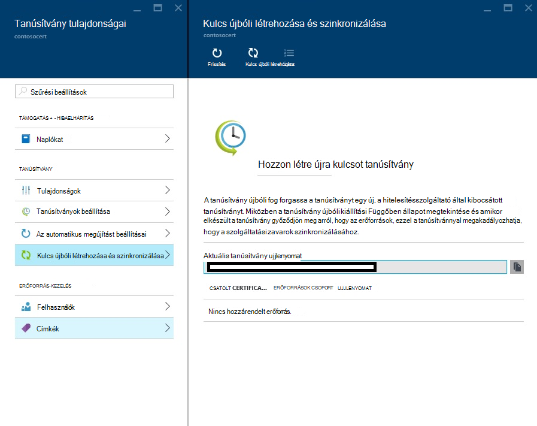

<properties
    pageTitle="Vásárol, és az alkalmazás Azure szolgáltatás SSL-tanúsítvány beállítása"
    description="Megtudhatja, hogy miként vásárol, és az alkalmazás Azure szolgáltatás SSL-tanúsítvány beállítása."
    services="app-service"
    documentationCenter=".net"
    authors="apurvajo"
    manager="stefsch"
    editor="cephalin"
    tags="buy-ssl-certificates"/>

<tags
    ms.service="app-service"
    ms.workload="na"
    ms.tgt_pltfrm="na"
    ms.devlang="na"
    ms.topic="article"
    ms.date="09/19/2016"
    ms.author="apurvajo"/>

#Vásárol, és az alkalmazás Azure szolgáltatás SSL-tanúsítvány beállítása

> [AZURE.SELECTOR]
- [SSL-tanúsítvány Azure-ban megvásárlása](web-sites-purchase-ssl-web-site.md)
- [Máshol használja az SSL-tanúsítvány](web-sites-configure-ssl-certificate.md)

Alapértelmezés szerint **[Azure alkalmazás szolgáltatás](http://go.microsoft.com/fwlink/?LinkId=529714)** már lehetővé teszi, hogy HTTPS a webalkalmazás az a *helyettesítő tanúsítvánnyal. azurewebsites.net tartományt. Ha nem tervezi saját tartomány beállítása, majd előnyeivel az alapértelmezett HTTPS-tanúsítványt. Jó helyen jár, például az összes * [helyettesítő tartományok](https://casecurity.org/2014/02/26/pros-and-cons-of-single-domain-multi-domain-and-wildcard-certificates), még nem olyan biztonságos, mint az egyéni tartomány használata a saját tanúsítvány. Azure alkalmazás szolgáltatás most biztosít a vásárolhat, és kezelése az SSL-tanúsítvány közvetlenül az Azure-portálon a portálon alkalmazáson valójában egyszerűsített lehetőséget.  
Ez a cikk ismerteti, hogyan vásárol, és az SSL-tanúsítvány beállítása a **[Azure alkalmazás szolgáltatás](http://go.microsoft.com/fwlink/?LinkId=529714)** 3 lépést kell elvégeznie. 

> [AZURE.NOTE]
> Egyéni tartománynevet SSL-tanúsítványok ingyenes, megosztott web app alkalmazással nem használható. Meg kell adnia a webalkalmazás Basic, a normál vagy a prémium módban, ami előfordulhat, hogy mennyi számlázható, az előfizetéséhez. **[Web Apps árak részleteket](https://azure.microsoft.com/pricing/details/web-sites/)** találhat további információt.

##– Áttekintés
> [AZURE.NOTE]
> Kérjük, ne kísérelje meg kell vásárolnia az SSL-tanúsítvány, amely nem tartalmaz egy társítva, aktív hitelkártya-előfizetést használ. Ez a eredményezhet az előfizetés le van tiltva. 

##<a>Vásárolhat, tárolása és hozzárendelése az egyéni tartomány az SSL-tanúsítvány</a>
Ha HTTPS engedélyezése egy egyéni tartományt (például contoso.com), előbb ** [Azure alkalmazás szolgáltatás a saját tartománynév beállítása.](web-sites-custom-domain-name.md)**

Kérő SSL-tanúsítvány, előtt meg kell állapítani mely tartománynevek a tanúsítvánnyal fog vonatkozni. Ez határozza meg, hogy milyen típusú oklevelet be kell szereznie. Ha csak egyetlen tartománynevet, például: contoso.com vagy www.contoso.com (egyszerű) szabvány biztonságos tanúsítvány szüksége elegendő. Ha több tartománynevet, például: contoso.com, www.contoso.com és mail.contoso.com, biztonságos kell majd elérheti ** [helyettesítő tanúsítvány](http://en.wikipedia.org/wiki/Wildcard_certificate)**

##0 lépés: SSL-tanúsítvány megrendelés helye

Ebben a lépésben megtanulhatja, hogyan megrendelése egy tetszés szerinti SSL-tanúsítvány.

1.  Az **[Azure-portálon](https://portal.azure.com/)**kattintson Tallózás, és "Alkalmazás szolgáltatás tanúsítványok" írja be a Keresés sáv, és jelölje ki "Alkalmazás szolgáltatás tanúsítványok" az eredmény és a Hozzáadás gombra. 

    

    

2.  Írja be az SSL-tanúsítvány **rövid nevét** .

3.  Írja be az **állomásnév**
> [AZURE.NOTE]
    Ez az egyik legfontosabb részeit a vásárlás folyamat. Győződjön meg róla, hogy helyes-e a host name (az egyéni tartomány), ezzel a tanúsítvánnyal védelemmel ellátni kívánt adja meg. **Ne** hozzáfűzi a www Előtagot tartalmazó állomásnév. Ha az egyéni tartománynevet www.contoso.com, akkor csak a Host Name mezőbe írja be a contoso.com, például a szóban forgó tanúsítvány védelme fog www és a legfelső szintű tartományok. 
    
4.  Jelölje ki azt az **előfizetést**. 

    Ha több előfizetéssel rendelkezik, majd ellenőrizze SSL-tanúsítvány létrehozása az egyéni tartomány vagy webalkalmazás használt azonos előfizetés szóban forgó.
       
5.  Jelölje be, vagy hozzon létre egy **erőforráscsoport**.

    Erőforrás csoportokkal kezelheti a kapcsolódó Azure erőforrások egy egységként és hasznosak, ha szerepalapú szabályok szerepköralapú hozzáférés-alkalmazások létrehozásáról. További információ az Azure erőforrások kezelése című részben talál.
     
6.  Jelölje ki a **tanúsítvány Termékváltozat** 

    Végül jelölje be a tanúsítvány Termékváltozat, amely megfelel a segítségre van szüksége, és kattintson a Létrehozás gombra. Ma Azure alkalmazás szolgáltatás lehetővé teszi, hogy két különböző termékváltozatok • S1 – 1 éves érvényességi és az automatikus megújítás szabványos tanúsítvány megvásárolni  
           • F1 – 1 éves érvényességére és az automatikus megújítás helyettesítő tanúsítvány      
    **[Web Apps árak részleteket](https://azure.microsoft.com/pricing/details/web-sites/)** találhat további információt.

> [AZURE.NOTE]
> 1 – 10 perc tetszőleges megnyílik az SSL-tanúsítvány létrehozása. Ez a folyamat több lépések, amelyek egyéb esetben manuálisan végrehajtásához nagyon lehető háttérben hajt végre.  

##Lépés: 1: A tanúsítványt az Azure kulcs tárolóból elemre

Ebben a lépésben megtanulhatja, hogy miként szeretné elhelyezni egy áruházból SSL-tanúsítvány Azure kulcs tárolóra lehetőség megvásárolt termékkulcsot.

1.  Az SSL-tanúsítvány vásárlás befejeződése után meg kell manuálisan nyissa meg az **App szolgáltatás tanúsítványok** az erőforrás lap rá újra (lásd: a lépést a fenti 1) között   

    

    Megfigyelheti, hogy, hogy tanúsítvány állapota **"függőben kiadási"** , néhány további lépést kell elvégeznie, mielőtt a tanúsítványok használatbavétele.
 
2. Kattintson a **"tanúsítványok beállítása"** tanúsítvány tulajdonságai lap, és kattintson a **"lépés 1: tárolása"** a tanúsítvány tárolását Azure kulcs tárolóból elemre.

3.  A **"kulcs tárolóra tárházba"** választhat egy meglévő kulcs tárolóból elemre a tanúsítványt **vagy a "hozzon létre új kulcs tárolóból elemre"** hozhat létre új kulcs tárolóból elemre, és előfizetési resource csoporton belül kattintson **"kulcs tárolóra állapot"** lap.
 
    
 
    > [AZURE.NOTE]
    Azure kulcs tárolóból elemre a tanúsítvány tárolására szolgáló nagyon minimális díjak vannak. Részletek **[Azure kulcs tárolóra árak](https://azure.microsoft.com/pricing/details/key-vault/)** további információt.

4. Miután kiválasztotta a kulcs tárolóból elemre tárat a tanúsítvány tárolására, lépjen tovább, és tárolja azt a **"kulcs tárolóra állapot"** a lap tetején **"Tárolása"** gombjára kattintva.  

    Ez be kell fejeződnie tárolja a tanúsítványt vásárolta az Azure kulcs tárolóra lehetőség a lépést. Után a lap frissítése, meg kell jelennie zöld jelölje be a megjelölés ezt a lépést szemben.
    
##Lépés: 2: A tartomány tulajdonjogának igazolása

Ebben a lépésben megtanulhatja, hogyan végezhetők el a tartomány tulajdonjogának ellenőrzése az SSL-tanúsítvány, amely csak helyét a megfelelő sorrendben. 

1.  Kattintson a **"lépés: 2: Ellenőrizze"** lépés a a **"Tanúsítványok beállítása"** lap. Nincsenek 4 típusa a tartományban a hitelesítési szolgáltatás a tanúsítványok alkalmazás által támogatott.

    * **Alkalmazás szolgáltatás ellenőrzése** 
    
        * Ha már van: a legmegfelelőbb folyamat az **az egyéni tartomány az Alkalmazásindítónalkalmazások szolgáltatás rendelt.** Ez a módszer felsorolásban, az összes alkalmazás szolgáltatás alkalmazások, amelyek megfelelnek a megadott feltételnek. 
           Például ebben az esetben **contosocertdemo.com** alkalmazás szolgáltatás alkalmazás **"ContosoCertDemo"** nevű rendelt egyéni tartomány pedig így, hogy az itt felsorolt csak alkalmazás szolgáltatás alkalmazás. Ha több területre telepítési hiba történt, majd azt volna listában őket az összes azon részeire lépkedhet végig.
        
           Az ellenőrzési módszer csak akkor érhető el a szabványos (egyszerű) tanúsítvány vásárlások. Helyettesítő karaktert tanúsítványok kérjük, ugorja át, és helyezze a B, C vagy az alábbi D lehetőséget.
        * Kattintson a **"Ellenőrzés"** gombra kattintva ezt a lépést.
        * Kattintson a **"Frissítés"** frissíti a tanúsítvány állapotát, ellenőrzési befejeződése után. A tartomány ellenőrzéséhez befejezéséhez néhány percet is igénybe.
        
             

    * **Tartomány hitelesítése** 

        * **Csak akkor, ha** van legkényelmesebb folyamat **[az egyéni tartomány vásárolt Azure alkalmazás szolgáltatásból.](custom-dns-web-site-buydomains-web-app.md)**
        
        * Kattintson a **"Ellenőrzés"** gombra kattintva ezt a lépést.
        
        * Kattintson a **"Frissítés"** frissíti a tanúsítvány állapotát, ellenőrzési befejeződése után. A tartomány ellenőrzéséhez befejezéséhez néhány percet is igénybe.

    * **Levelek ellenőrzése**
        
        * Megerősítő e-mailt már el lett küldve a e egyéni tartománnyal társított E-mail címe.
         
        * Nyissa meg az e-mailt, majd kattintson a megerősítési hivatkozásra az E-mail Megerősítés lépésre. 
        
        * Ha módosítani szeretné a megerősítő e-mailt küldeni, kattintson a **"ismételt elküldése e-mailek"** gombra.
         
    * **Manuális ellenőrzése**    
                 
        1. **HTML-weblap ellenőrzése**
        
            * **{Tartomány ellenőrzése jogkivonat}**.html (átmásolhatja a token őt a tartomány ellenőrzése állapot lap) nevű HTML-fájl létrehozása
            
            * Tartalom fájl kell a **Tartomány ellenőrzése jogkivonat**pontos azonos nevű.
            
            * Töltse fel a fájlt a legfelső szintű az érintett webkiszolgálóra, a tartomány szolgáltatójánál.
            
            * Kattintson a **"Frissítés"** frissíti a tanúsítvány állapotát, ellenőrzési befejeződése után. A tartomány ellenőrzéséhez befejezéséhez néhány percet is igénybe.
            
            Például ha a tartomány ellenőrzése jogkivonat **"cAGgQrKc"** contosocertdemo.com tartozó normál tanúsítvány vásárol, majd egy webes kérését **"http://contosocertdemo.com/cAGgQrKc.html"** térjen vissza **cAGgQrKc.**
        2. **DNS TXT Record ellenőrzése**

            * A DNS-kezelőben hoz létre egy TXT rekordot a az érték az **"DZC"** altartomány egyenlő a **tartomány-ellenőrzés jogkivonat.**
            
            * Kattintson a **"Frissítés"** frissíti a tanúsítvány állapotát, ellenőrzési befejeződése után. A tartomány ellenőrzéséhez befejezéséhez néhány percet is igénybe.
                              
            Annak érdekében, hogy a hostname (állomásnév) helyettesítő tanúsítvány érvényességi elvégezheti például ** \*. contosocertdemo.com** vagy ** \*. subdomain.contosocertdemo.com** és a tartomány-ellenőrzés jogkivonat **cAGgQrKc**, létre kell hoznia egy TXT rekord dzc.contosocertdemo.com értékkel a **cAGgQrKc.**     

##Lépés 3: Tanúsítvány hozzárendelése alkalmazás szolgáltatás alkalmazásba

Ebben a lépésben megtanulhatja, ez az alkalmazás szolgáltatás alkalmazásait tanúsítvány újonnan vásárolt hozzárendelése. 

> [AZURE.NOTE]
> Ebben a szakaszban a lépés elvégzése előtt kell társított egyéni tartománynevet az alkalmazást. További tudnivalókért olvassa el a ** [egy egyéni tartománynevet a web App beállítása](web-sites-custom-domain-name.md) című témakört.**

1.  A böngészőben nyissa meg a ** [Azure-portálon.](https://portal.azure.com/)**
2.  Kattintson a lap bal szélén a **Alkalmazás szolgáltatás** lehetőségre.
3.  Kattintson a alkalmazást, amelyhez hozzá szeretné rendelni a tanúsítvány nevét. 
4.  A **Beállítások**területen kattintson **az SSL-tanúsítványok**
5.  Kattintson az **Alkalmazás szolgáltatás tanúsítvány importálása** , és válassza ki a tanúsítványt, csak vásárolt

    

6. Az **ssl kötések** szakaszban kattintson a **kötések hozzáadása**
7. Az **SSL kötelező hozzáadása** lap a legördülő lista használatával válassza ki az SSL, és a tanúsítvány használatával, biztonságos. Előfordulhat, hogy is kiválaszthatja szeretné-e használni a **[Kiszolgáló neve megjelölése (SNI)](http://en.wikipedia.org/wiki/Server_Name_Indication)** , vagy IP-alapú SSL.

    

       •    IP based SSL associates a certificate with a domain name by mapping the dedicated public IP address of the server to the domain name. This requires each domain name (contoso.com, fabricam.com, etc.) associated with your service to have a dedicated IP address. This is the traditional          method of associating SSL certificates with a web server.
       •    SNI based SSL is an extension to SSL and **[Transport Layer Security](http://en.wikipedia.org/wiki/Transport_Layer_Security)** (TLS) that allows multiple domains to share the same IP address, with separate security certificates for each domain. Most modern browsers (including Internet Explorer, Chrome, Firefox and Opera) support SNI, however older browsers may not support SNI. For more information on SNI, see the **[Server Name Indication](http://en.wikipedia.org/wiki/Server_Name_Indication)** article on Wikipedia.
       
7. Kattintson a **Kötelező hozzáadása** a módosítások mentéséhez és az SSL protokoll engedélyezése gombra.

Ha **IP-alapú SSL** jelölt ki, és az egyéni tartomány használata az A rekord van beállítva, akkor az alábbi lépéseket kell elvégeznie:

* Konfigurálása után egy IP-alapú SSL kötés, és az alkalmazás hozzá van rendelve egy dedikált IP-címet. Az IP-cím az alkalmazást, jobbra fent a **állomásnevekké** szakasz a beállítások csoportban az **Egyéni tartomány** lapon talál. Megjelenik **a külső IP-** cím
    
    

    Figyelje meg, hogy az IP-cím ugyanaz, mint a virtuális IP-cím, az A rekordot a tartomány konfigurálása korábban használt lesz. Ha használatára van beállítva SNI SSL alapján, vagy nincs beállítva az SSL protokoll használatára, a cím nem látható a elemhez.
    
2. A tartománynév-regisztráló által biztosított eszközökkel módosíthatja az A rekordot, mutasson az előző lépésben az IP-cím egyéni tartománynevét az.
Ezen a ponton tudja arra, hogy keresse fel az alkalmazást, ellenőrizze, hogy a tanúsítvány megfelelően konfigurálva használata helyett HTTP:// HTTPS://.

##Hozzon létre újra kulcsot, és a tanúsítvány szinkronizálása

1. Biztonsági okokból Ha bármikor módosítani szeretné, hogy hozzon létre újra kulcsot a tanúsítvány majd egyszerűen beállítással **"hozzon létre újra kulcsot és szink."** a **"tanúsítvány tulajdonságai"** lap. 

2. Kattintson a **"Kulcsismétlési"** gombra a folyamat elindítására. Ez az eljárás is 1 – 10 percet igénybe vehet. 

    

3. A tanúsítvány újbóli fog forgassa a tanúsítványt egy új, a hitelesítésszolgáltató által kibocsátott tanúsítványt.
4. Ön nem ráterheljük a Rekeying a tanúsítvány élettartamot. 
5. A tanúsítvány újbóli a program elküldi kiállítási Függőben állapot keresztül. 
6. Amikor elkészült a tanúsítvány győződjön meg arról, hogy szinkronizálja az erőforrások, ezzel a tanúsítvánnyal megakadályozhatja, hogy a szolgáltatás zavarok.
7. Szinkronizálási lehetőségek a tanúsítványok, amelyek még nem rendelt a Web App alkalmazásban nem érhető el. 

## További források ##
- [HTTPS-alkalmazás Azure alkalmazás szolgáltatás engedélyezése](web-sites-configure-ssl-certificate.md)
- [Vásárol, és a saját tartománynév beállítása az Azure alkalmazás szolgáltatás](custom-dns-web-site-buydomains-web-app.md)
- [Microsoft Azure az Adatvédelmi központ](/support/trust-center/security/)
- [Nem zárolt Azure webhelyek konfigurációs beállításai](http://azure.microsoft.com/blog/2014/01/28/more-to-explore-configuration-options-unlocked-in-windows-azure-web-sites/)
- [Azure Kezelőportálja segítségével](https://manage.windowsazure.com)

>[AZURE.NOTE] Ha azt szeretné, mielőtt feliratkozna az Azure-fiók használatbavételéhez Azure alkalmazás szolgáltatás, [Próbálja meg alkalmazás szolgáltatás](http://go.microsoft.com/fwlink/?LinkId=523751), ahol azonnal létrehozhat egy rövid életű starter web app alkalmazás szolgáltatásban megnyitásához. Nem kötelező, hitelkártyák Nincs nyilatkozatát.

