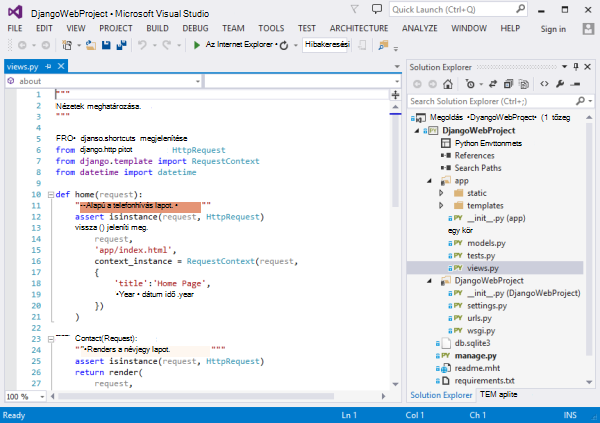
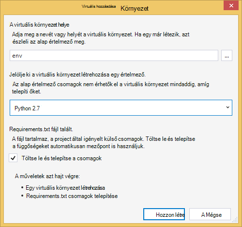
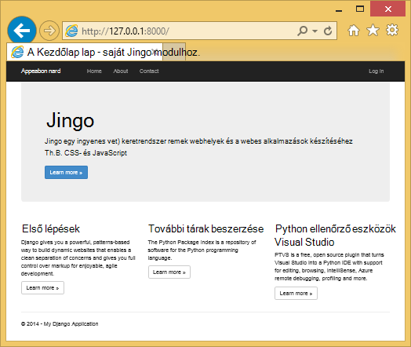
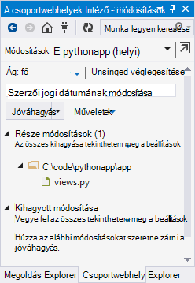
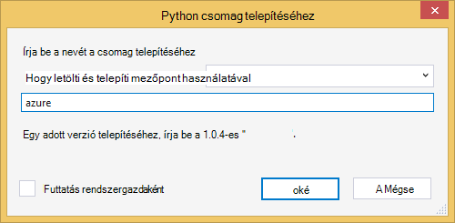
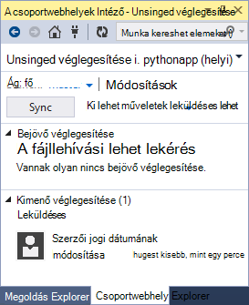
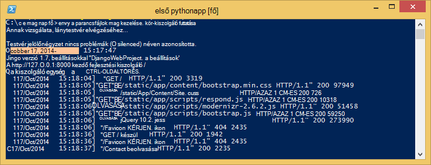
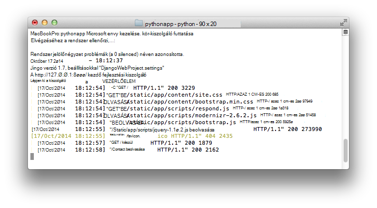
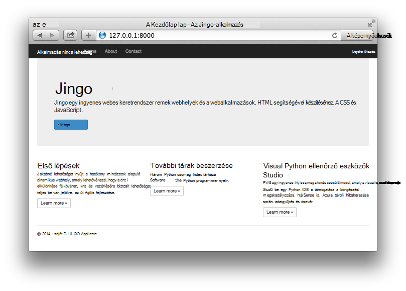

<properties
    pageTitle="Web Apps alkalmazások létrehozása az Azure-ban Django"
    description="Egy oktatóprogram, amely bemutatja a Python webalkalmazást fut az Azure-alkalmazás szolgáltatás webalkalmazásokban."
    services="app-service\web"
    documentationCenter="python"
    tags="python"
    authors="huguesv" 
    manager="wpickett" 
    editor=""/>

<tags
    ms.service="app-service-web"
    ms.workload="web"
    ms.tgt_pltfrm="na"
    ms.devlang="python"
    ms.topic="hero-article" 
    ms.date="02/19/2016"
    ms.author="huvalo"/>

# Web Apps alkalmazások létrehozása az Azure-ban Django

Ebben az oktatóanyagban kezdőlépéseket kell megtennie Python futó [Azure alkalmazás szolgáltatás Web Apps alkalmazások](http://go.microsoft.com/fwlink/?LinkId=529714)ismerteti. Web Apps alkalmazások korlátozott ingyenes szolgáltatója és a gyors telepítési biztosít, és használhatja a Python! Az alkalmazás növekedésével fizetett szolgáltatója válthat, és az összes többi Azure szolgáltatást is integrálhatja.

Az alkalmazás Django webes keretében hoz létre (lásd: Ebben az oktatóanyagban változatainak [lombikot](web-sites-python-create-deploy-flask-app.md) és [palack](web-sites-python-create-deploy-bottle-app.md)). Lesz a web app létrehozása a Microsoft Azure piactéren lévő, mely számjegy telepítési beállítása és a tárházba helyileg klónozhatja. Ezután fog helyileg futtassa az alkalmazást, módosítása, véglegesítése és a leküldéses őket az Azure. Az oktatóprogram megtudhatja, hogy miként ehhez az Windows vagy Mac vagy Linux rendszerhez.

[AZURE.INCLUDE [create-account-and-websites-note](../../includes/create-account-and-websites-note.md)]

>[AZURE.NOTE] Ha azt szeretné, mielőtt feliratkozna az Azure-fiók használatbavételéhez Azure alkalmazás szolgáltatás, [Próbálja meg alkalmazás szolgáltatás](http://go.microsoft.com/fwlink/?LinkId=523751), ahol azonnal létrehozhat egy rövid életű starter web app alkalmazás szolgáltatásban megnyitásához. Nem kötelező, hitelkártyák Nincs nyilatkozatát.

## Előfeltételek

- A Windows, Mac vagy Linux rendszerhez
- Python 2.7 vagy 3.4.
- setuptools, mezőpont, virtualenv (csak Python 2.7.)
- Mely számjegy
- [Python Tools for Visual Studio][] (PTVS) - Megjegyzés: Ez a lépés nem kötelező

**Megjegyzés**: TFS közzététel jelenleg nem támogatja a Python projektek.

### A Windows

Ha még nincs Python 2.7 vagy 3.4 telepített (32 bites), azt javasoljuk, [Python 2.7 Azure SDK] vagy használata a webes Platform telepítő [Azure SDK Python 3.4] telepítése. Ez az Python, setuptools, mezőpont, virtualenv stb (32 bites Python az Azure host számítógépén telepítve van) 32 bites verzióját telepíti. Másik lehetőségként, amely letölthető Python [python.org].

Mely számjegy javasoljuk, [Mely számjegy for Windows] vagy a [GitHub Windows]. Visual Studio használata esetén a beépített mely számjegy-támogatás is használhatja.

Ajánlott is [Python eszközök 2.2 for Visual Studio]telepítése. Ez a lépés nem kötelező, de a [Visual Studióban], beleértve a Visual Studio közösségi ingyenes 2013 vagy a webhelyen, a Visual Studio Express 2013 esetén kattintson a képet ad egy nagy Python IDE.

### A Mac vagy Linux rendszerhez

Érdemes a Python és mely számjegy már telepítve van, de győződjön meg arról, hogy Python 2.7 vagy a 3.4.

## Webhely-alkalmazás létrehozása a portálon

Az első lépés az alkalmazás létrehozása, ha a web app az [Azure-portálon](https://portal.azure.com)keresztül.

1. Jelentkezzen be az Azure-portálra, és kattintson az **Új** gombra, a bal alsó sarokban.
3. A Keresés mezőbe írja be a "python".
4. A keresési eredmények közt jelölje ki a **Django** (PTVS által közzétett), majd kattintson a **Létrehozás**gombra.
5. Állítsa be az új Django alkalmazást, például egy új alkalmazás szolgáltatás tervet, és új erőforráscsoport létrehozása. Kattintson a **Létrehozás**parancsra.
6. [Helyi mely számjegy telepítési Azure alkalmazás szolgáltatás](app-service-deploy-local-git.md)a megjelenő utasításokat követve állítsa be a mely számjegy közzétételi az újonnan létrehozott webhely számára.

## Alkalmazás – áttekintés

### Mely számjegy tárházba tartalma

Az alábbiakban megtalálja azt a következő szakaszban fogja klónozhatja kezdeti mely számjegy adattárban fájlok áttekintése.

    \app\__init__.py
    \app\forms.py
    \app\models.py
    \app\tests.py
    \app\views.py
    \app\static\content\
    \app\static\fonts\
    \app\static\scripts\
    \app\templates\about.html
    \app\templates\contact.html
    \app\templates\index.html
    \app\templates\layout.html
    \app\templates\login.html
    \app\templates\loginpartial.html
    \DjangoWebProject\__init__.py
    \DjangoWebProject\settings.py
    \DjangoWebProject\urls.py
    \DjangoWebProject\wsgi.py

Az alkalmazás fő forrásainak. Diaminta-elrendezés-3 lap (index, a kapcsolattartó) áll. Statikus tartalommá és a parancsfájlok tartalmaz a betöltés, jquery, modernizr és válasz.

    \manage.py

Helyi kezelése és a fejlesztés kiszolgáló támogatása. Ezzel az alkalmazás futtatásához helyi meghajtóra, szinkronizálni az adatbázist, stb.

    \db.sqlite3

Alapértelmezett adatbázis. Az alkalmazás futtatásához szükséges tábláit is tartalmaz, de nem tartalmaz az összes felhasználó (szinkronizálni az adatbázist, hogy a felhasználó létrehozása).

    \DjangoWebProject.pyproj
    \DjangoWebProject.sln

Projektfájlok [Python Tools for Visual Studio]való használatra.

    \ptvs_virtualenv_proxy.py

IIS proxy virtuális környezetek és távoli támogatási hibakereséshez PTVS.

    \requirements.txt

Külső csomagok szükség szerint az alkalmazás. A telepítési parancsfájlt pip lesz a fájlban felsorolt csomagok telepítése.

    \web.2.7.config
    \web.3.4.config

IIS konfigurációs fájljait. A telepítési parancsfájlt a megfelelő web.x.y.config használja, és másolja a vágólapra, web.config.

### Nem kötelező fájlok - telepítési testreszabása

[AZURE.INCLUDE [web-sites-python-django-customizing-deployment](../../includes/web-sites-python-django-customizing-deployment.md)]

### Nem kötelező fájlok - Python futtatókörnyezet

[AZURE.INCLUDE [web-sites-python-customizing-runtime](../../includes/web-sites-python-customizing-runtime.md)]

### További fájlokat a kiszolgálón

Egyes fájlokat a kiszolgálón található, de nem kerülnek a mely számjegy tárházba. Ezek a telepítési parancsfájlt hozza létre.

    \web.config

IIS konfigurációs fájl. Minden példányban web.x.y.config készült.

    \env\

Python virtuális környezetben. A telepítés során létre Ha kompatibilis virtuális környezetet nem létezik a web App. Requirements.txt szereplő csomagok telepítve mezőpont, de mezőpont kihagyja a telepítést, ha már telepítve van a csomagok.

A következő 3 szakaszok leírják, hogyan folytatja a web app fejlesztésének 3 különböző környezetekben csoportban:

- A Windows, és Python Tools for Visual Studio
- A Windows, és a parancssor
- A Mac vagy Linux, a parancssorból

## Web app fejlesztési – Windows - Python Tools for Visual Studio

### A tár másolása

Első lépésként klónozhatja a tárat a megadott az Azure portál URL-cím használatával. További tudnivalókért lásd: [Helyi mely számjegy telepítési Azure alkalmazás szolgáltatásba](app-service-deploy-local-git.md).

Nyissa meg a legfelső szintű a tár található megoldásfájlt (.sln).

### Virtuális környezet létrehozása

Most egy virtuális helyi fejlesztői környezet létrehoznia azt. Kattintson a jobb gombbal **Python környezetekben** választó **Hozzáadása virtuális környezet...**.

- Ellenőrizze, hogy a név, a környezet `env`.

- Jelölje ki az alap értelmező. Ellenőrizze, hogy verzióját szeretné használni az azonos Python, hogy be van jelölve a web App (a runtime.txt vagy az **Alkalmazás beállításai** lap a webalkalmazás az Azure-portálon).

- Ellenőrizze, hogy töltse le és telepítse a csomagok a beállítás be van jelölve.

Kattintson a **létrehozása**gombra. Ezzel a virtuális környezet létrehozása, és requirements.txt felsorolt függőségek telepítése.

### Hozzon létre egy rendszeradminisztrátort

Az adatbázisban, az alkalmazás részét képező nincsenek olyan definiált rendszeradminisztrátori. A bejelentkezési funkció az alkalmazást, vagy a Django felügyeleti felületén (Ha úgy dönt, hogy engedélyezze azt) a használatához, kell rendszeradminisztrátori létrehozása.

Futtassa a a parancssorból a projekt mappából:

    env\scripts\python manage.py createsuperuser

Kövesse a megjelenő utasításokat követve állítsa a felhasználó nevét, a jelszót, a stb.

### Futtassa a fejlesztés kiszolgáló használata esetén

Nyomja meg az F5 hibakeresés, és a webböngészőben automatikusan megnyíljon a helyben fut lapra.

Beállíthatja, hogy töréspontok a forrásokban, használja a Megtekintés windows stb. Nézze meg az egyes szolgáltatások további információt a [Python Tools for Visual Studio dokumentációt] .

### Módosítása

Most már kísérletezhet, az alkalmazás források vagy a sablonok módosításával.

Után a változtatások tesztelt véglegesítse a mely számjegy tárházba őket:

### További csomagok telepítése

Előfordulhat, hogy az alkalmazás függőségek Python és Django túl.

További csomagokat mezőpont használatával is telepítheti. Egy csomag telepítéséhez kattintson a jobb gombbal a virtuális környezet, és jelölje ki a **Python csomag telepítéséhez**.

Telepítse az Azure SDK Python, amely férhet hozzá Azure tárhely, a szolgáltatás bus és az egyéb Azure szolgáltatások, például adja meg a `azure`:

Kattintson a jobb gombbal a virtuális környezet, és válassza a **Létrehozás requirements.txt** requirements.txt frissítéséhez.

Ezután hajtsa végre a módosításokat a mely számjegy tárházba requirements.txt.

### Azure telepítése

Indíthatja el a telepítést, kattintson a **szinkronizálás** vagy **leküldéses**. Szinkronizálási leküldéses és egy ki is tartalmaz.

Az első telepítési időt vesz igénybe, mint hoz létre egy virtuális környezetben, telepítés csomagok stb.

Visual Studio nem jelenik meg a telepítési elért haladás. Ha azt szeretné, tekintse át az eredményt, akkor olvassa el a szakaszban a [Hibaelhárítás – telepítés](#troubleshooting-deployment).

Nyissa meg az Azure URL-címre kattintva megtekintheti a változtatásokat.

## Web app – Windows - fejlesztési parancssori

### A tár másolása

Első lépésként az URL-cím az Azure-portálon használja a tárházba klónozhatja, és adja hozzá az Azure tárházba távoli. További tudnivalókért lásd: [Helyi mely számjegy telepítési Azure alkalmazás szolgáltatásba](app-service-deploy-local-git.md).

    git clone <repo-url>
    cd <repo-folder>
    git remote add azure <repo-url>

### Virtuális környezet létrehozása

Azt létre fogja hozni egy új virtuális környezet fejlesztési célokra (nem adja hozzá azt a tárat). A Python virtuális környezetek sem áthelyezhető, így minden dolgoznak az alkalmazás fejlesztője hoz létre saját helyi meghajtóra.

Ellenőrizze, hogy verzióját szeretné használni az azonos Python, hogy be van jelölve a web App (a runtime.txt vagy az alkalmazás beállításai lap a webalkalmazás az Azure-portálon).

A Python 2.7:

    c:\python27\python.exe -m virtualenv env

A Python 3.4:

    c:\python34\python.exe -m venv env

Minden külső csomagok követel meg az alkalmazás telepítése. A legfelső szintű a tárat a requirements.txt fájl segítségével a csomagok telepítése a virtuális környezetben:

    env\scripts\pip install -r requirements.txt

### Hozzon létre egy rendszeradminisztrátort

Az adatbázisban, az alkalmazás részét képező nincsenek olyan definiált rendszeradminisztrátori. A bejelentkezési funkció az alkalmazást, vagy a Django felügyeleti felületén (Ha úgy dönt, hogy engedélyezze azt) a használatához, kell rendszeradminisztrátori létrehozása.

Futtassa a a parancssorból a projekt mappából:

    env\scripts\python manage.py createsuperuser

Kövesse a megjelenő utasításokat követve állítsa a felhasználó nevét, a jelszót, a stb.

### Futtassa a fejlesztés kiszolgáló használata esetén

Az alkalmazás csoportban az alábbi paranccsal fejlesztési kiszolgáló indíthatja el:

    env\scripts\python manage.py runserver

A konzol jelennek meg az URL-címet, és figyeli a kiszolgáló port:

Ezután nyissa meg a webböngészőben, hogy az URL-címre.

### Módosítása

Most már kísérletezhet, az alkalmazás források vagy a sablonok módosításával.

Után a változtatások tesztelt véglegesítse a mely számjegy tárházba őket:

    git add <modified-file>
    git commit -m "<commit-comment>"

### További csomagok telepítése

Előfordulhat, hogy az alkalmazás függőségek Python és Django túl.

További csomagokat mezőpont használatával is telepítheti. Ha például telepítse az Azure SDK Python, amely férhet hozzá Azure tárolására, a szolgáltatás bus és az egyéb Azure szolgáltatás, írja be:

    env\scripts\pip install azure

Győződjön meg arról, requirements.txt frissítése:

    env\scripts\pip freeze > requirements.txt

A módosítások véglegesítése:

    git add requirements.txt
    git commit -m "Added azure package"

### Azure telepítése

Indíthatja el a telepítést, a változtatások leküldéses az Azure:

    git push azure master

Ekkor megjelenik a telepítési parancsfájlt, beleértve a virtuális környezet létrehozása, web.config kibocsátása csomagok telepítése kimenetét.

Nyissa meg az Azure URL-címre kattintva megtekintheti a változtatásokat.

## Web app - Mac vagy Linux - fejlesztési parancssori

### A tár másolása

Első lépésként az URL-cím az Azure-portálon használja a tárházba klónozhatja, és adja hozzá az Azure tárházba távoli. További tudnivalókért lásd: [Helyi mely számjegy telepítési Azure alkalmazás szolgáltatásba](app-service-deploy-local-git.md).

    git clone <repo-url>
    cd <repo-folder>
    git remote add azure <repo-url>

### Virtuális környezet létrehozása

Azt létre fogja hozni egy új virtuális környezet fejlesztési célokra (nem adja hozzá azt a tárat). A Python virtuális környezetek sem áthelyezhető, így minden dolgoznak az alkalmazás fejlesztője hoz létre saját helyi meghajtóra.

Ellenőrizze, hogy verzióját szeretné használni az azonos Python, hogy be van jelölve a web App (a runtime.txt vagy az alkalmazás beállításai lap a webalkalmazás az Azure-portálon).

A Python 2.7:

    python -m virtualenv env

A Python 3.4:

    python -m venv env

vagy

    pyvenv env

Minden külső csomagok követel meg az alkalmazás telepítése. A legfelső szintű a tárat a requirements.txt fájl segítségével a csomagok telepítése a virtuális környezetben:

    env/bin/pip install -r requirements.txt

### Hozzon létre egy rendszeradminisztrátort

Az adatbázisban, az alkalmazás részét képező nincsenek olyan definiált rendszeradminisztrátori. A bejelentkezési funkció az alkalmazást, vagy a Django felügyeleti felületén (Ha úgy dönt, hogy engedélyezze azt) a használatához, kell rendszeradminisztrátori létrehozása.

Futtassa a a parancssorból a projekt mappából:

    env/bin/python manage.py createsuperuser

Kövesse a megjelenő utasításokat követve állítsa a felhasználó nevét, a jelszót, a stb.

### Futtassa a fejlesztés kiszolgáló használata esetén

Az alkalmazás csoportban az alábbi paranccsal fejlesztési kiszolgáló indíthatja el:

    env/bin/python manage.py runserver

A konzol jelennek meg az URL-címet, és figyeli a kiszolgáló port:

Ezután nyissa meg a webböngészőben, hogy az URL-címre.

### Módosítása

Most már kísérletezhet, az alkalmazás források vagy a sablonok módosításával.

Után a változtatások tesztelt véglegesítse a mely számjegy tárházba őket:

    git add <modified-file>
    git commit -m "<commit-comment>"

### További csomagok telepítése

Előfordulhat, hogy az alkalmazás függőségek Python és Django túl.

További csomagokat mezőpont használatával is telepítheti. Ha például telepítse az Azure SDK Python, amely férhet hozzá Azure tárolására, a szolgáltatás bus és az egyéb Azure szolgáltatás, írja be:

    env/bin/pip install azure

Győződjön meg arról, requirements.txt frissítése:

    env/bin/pip freeze > requirements.txt

A módosítások véglegesítése:

    git add requirements.txt
    git commit -m "Added azure package"

### Azure telepítése

Indíthatja el a telepítést, a változtatások leküldéses az Azure:

    git push azure master

Ekkor megjelenik a telepítési parancsfájlt, beleértve a virtuális környezet létrehozása, web.config kibocsátása csomagok telepítése kimenetét.

Nyissa meg az Azure URL-címre kattintva megtekintheti a változtatásokat.

## Telepítési hibáinak elhárítása - csomag

[AZURE.INCLUDE [web-sites-python-troubleshooting-package-installation](../../includes/web-sites-python-troubleshooting-package-installation.md)]

## Hibaelhárítás – ezek olyan virtuális környezet

[AZURE.INCLUDE [web-sites-python-troubleshooting-virtual-environment](../../includes/web-sites-python-troubleshooting-virtual-environment.md)]

## Hibaelhárítás – statikus fájlok

Django statikus fájlok összegyűjtése fogalmának tartalmaz. Ekkor a mind a statikus fájlok az eredeti helyükre, és másolja őket egy mappát. Ehhez az alkalmazáshoz másolja őket `/static`.

Ez történik, mivel statikus fájlokat különböző Django "alkalmazások" származhat. Például a Django felügyeleti felületek statikus fájljait a virtuális környezetben tár Django almappába találhatók. Ez az alkalmazás által meghatározott statikus fájlok találhatók `/app/static`. További Django "alkalmazások" használata során, több helyen található statikus fájlok fognak rendelkezésére állni.

Ha az alkalmazás hibakeresési módban fut, az alkalmazás szolgál, a statikus fájlokat az eredeti helyükre.

Ha az alkalmazás megjelenés módban fut, az alkalmazás jelent **nem** szolgál a statikus fájlokat. A feladata a fájlok kiszolgálására, a webkiszolgáló. Ehhez az alkalmazáshoz IIS szolgálja statikus fájljait `/static`.

Statikus fájlok gyűjteménye része a telepítési parancsfájlt, törölje a jelet a korábban gyűjtött fájlként automatikusan történik. Ez azt jelenti, hogy a webhelycsoport minden példányban lassíthatják a telepítési egy kicsit fordul elő, de biztosítja, hogy elavult fájlok nem lesz elérhető, egy potenciális biztonsági problémát elkerülése.

Ha szeretne Django alkalmazás statikus fájlokat a webhelycsoport hagyhat ki:

    \.skipDjango

Ezután kell végezze el a webhelycsoport manuálisan a helyi számítógépen:

    env\scripts\python manage.py collectstatic

Távolítsa el a `\static` mappából `.gitignore` , és adja hozzá a mely számjegy tárat.

## Hibaelhárítási - beállítások

Az alkalmazás különböző beállítások segítségével módosíthatók a `DjangoWebProject/settings.py`.

Fejlesztőeszközök kényelmesebbé hibakeresési mód engedélyezve van. Arra, hogy az egyik szép egymás hatása is látja, képek és egyéb statikus tartalommá futtatásakor helyi meghajtóra, anélkül, hogy statikus fájlok összegyűjtése.

Hibakeresési mód letiltása:

    DEBUG = False

Ha hibakeresési le van tiltva, az érték `ALLOWED_HOSTS` frissíteni kell, amelyet fel szeretne venni az Azure állomásnév. Példa:

    ALLOWED_HOSTS = (
        'pythonapp.azurewebsites.net',
    )

vagy bármely engedélyezése:

    ALLOWED_HOSTS = (
        '*',
    )

A gyakorlatban érdemes kezelni az hibakeresési közötti váltáshoz, és engedje fel, és az állomásnév első összetettebb elvégeznie.

Beállíthatja, hogy a környezeti változók keresztül az Azure portál **beállítás** lapján, az **alkalmazás beállításai** csoportban.  Ez lehet hasznos, ha a kívánt előfordulhat, hogy nem jelennek meg a források (kapcsolati karakterláncot, a jelszavak stb.), vagy közötti Azure és a helyi számítógép zónában máshogyan kell beállítani kívánt értékek beállítást. A `settings.py`, lekérdezheti a környezeti változók használata `os.getenv`.

## Egy adatbázis használata

Az adatbázist, amely szerepel az alkalmazást az adatbázis sqlite. Ez a használandó fejlesztése, kényelmes és hasznos alapértelmezett adatbázis, telepítés szinte nem szükséges. A projekt mappában lévő db.sqlite3 fájl az adatbázisban vannak tárolva.

Azure adatbázis szolgáltatásokat, amelyek könnyen használható Django alkalmazásból nyújt. Oktatóanyagok az [SQL-adatbázis] és a [MySQL] -alkalmazásból Django megjelenítése a lépéseket az adatbázis-szolgáltatás hozzon létre, az adatbázis beállításainak megváltoztatása a szükséges `DjangoWebProject/settings.py`, és a tárak telepítéséhez szükséges.

Természetesen Ha inkább saját adatbázis-kiszolgálók kezelése, műveleteket hajthat végre, használja a Windows vagy Linux rendszerhez futó Azure virtuális gépek.

## Django felületen

Után megkezdheti a modellek összeállítását, bizonyára tudni szeretné feltölteni az adatokat az adatbázist. Ugyanígy hozzáadása és interaktív módon szerkesztheti a tartalmat a Django felügyeleti felületén.

A felügyeleti felületén a kód van megjegyzéseket fűzhet a alkalmazás forrásokban, de jól láthatóan, így egyszerűen engedélyezheti újra (Keresés a "felügyeleti").

Miután engedélyezve van, szinkronizálni az adatbázist, futtassa az alkalmazást, és kattintson az `/admin`.

## Következő lépések

Kövesse ezeket a hivatkozásokat, ha többet szeretne tudni a Django és Python Tools for Visual Studio:

- [Django dokumentáció]
- [Python Tools for Visual Studio dokumentáció]

SQL-adatbázis és MySQL használatáról bővebben:

- [Django és Azure Python Tools for Visual Studio és a MySQL]
- [Django és a Python Tools for Visual Studio az Azure SQL-adatbázis]

További tudnivalókért lásd: a [Python Developer Center](/develop/python/).

## Mi változott
* Módosítása egy segédvonalat a webhelyekre alkalmazás szolgáltatáshoz lásd: [Azure alkalmazás szolgáltatás, és a hatás a meglévő Azure-szolgáltatások](http://go.microsoft.com/fwlink/?LinkId=529714)

<!--Link references-->
[Django és Azure Python Tools for Visual Studio és a MySQL]: web-sites-python-ptvs-django-mysql.md
[Django és a Python Tools for Visual Studio az Azure SQL-adatbázis]: web-sites-python-ptvs-django-sql.md
[SQL-adatbázis]: web-sites-python-ptvs-django-sql.md
[MySQL]: web-sites-python-ptvs-django-mysql.md

<!--External Link references-->
[Azure SDK Python 2.7.]: http://go.microsoft.com/fwlink/?linkid=254281
[Azure SDK Python 3.4.]: http://go.microsoft.com/fwlink/?linkid=516990
[Python.org]: http://www.python.org/
[A Windows mely számjegy]: http://msysgit.github.io/
[A Windows GitHub]: https://windows.github.com/
[Python Tools for Visual Studio]: http://aka.ms/ptvs
[Python 2.2 Tools for Visual Studio]: http://go.microsoft.com/fwlink/?LinkID=624025
[Visual Studio]: http://www.visualstudio.com/
[Python Tools for Visual Studio dokumentáció]: http://aka.ms/ptvsdocs
[Django dokumentáció]: https://www.djangoproject.com/
