<properties 
    pageTitle="Palack és a 2.2 Python Tools for Visual Studio az Azure Azure Táblatárolóhoz" 
    description="Megtudhatja, hogyan lehet a Python Tools for Visual Studio segítségével Azure Táblatárolóhoz adatokat tároló palack-alkalmazás létrehozása, és az Azure alkalmazás szolgáltatás Web Apps alkalmazások telepítése a web App alkalmazásban." 
    services="app-service\web" 
    documentationCenter="python" 
    authors="huguesv" 
    manager="wpickett" 
    editor=""/>

<tags 
    ms.service="app-service-web" 
    ms.workload="web" 
    ms.tgt_pltfrm="na" 
    ms.devlang="python" 
    ms.topic="article" 
    ms.date="07/07/2016"
    ms.author="huvalo"/>

# Palack és a 2.2 Python Tools for Visual Studio az Azure Azure Táblatárolóhoz 

Ebben az oktatóanyagban használjuk [Python Tools for Visual Studio] közül a PTVS mintasablonok az egyszerű szavazásokra webes alkalmazás létrehozása céljából. Ebben az oktatóanyagban érhető el, a [Videó](https://www.youtube.com/watch?v=GJXDGaEPy94).

A lekérdezések web app a tárhoz, absztrakciója határozza meg, így könnyebben válthat a különböző típusú tárházakban (a memóriában, Azure Táblatárolóhoz, MongoDB).

Azt Dióhéjban Azure tároló fiók létrehozása, a web app használata Azure Táblatárolóhoz konfigurálása és hogy miként teheti közzé a web app [Azure alkalmazás szolgáltatás Web](http://go.microsoft.com/fwlink/?LinkId=529714)Apps alkalmazások.

A [Python Developer Center] Azure alkalmazás szolgáltatás Web Apps palack, lombikot és Django webes keretek használata MongoDB, Azure Táblatárolóhoz, MySQL és SQL-adatbázis szolgáltatások PTVS fejlesztésének terjed ki további projektvezetési cikkeket talál. Ez a cikk összpontosít szolgáltatási alkalmazást, amíg a lépések hasonlóak [Azure Cloud Services]fejlesztésekor.

## Előfeltételek

 - Visual Studio 2015
 - [Python 2.2 Tools for Visual Studio]
 - [Python 2.2 Tools for Visual Studio példák VSIX]
 - [Azure SDK eszközök VIEWBEN 2015]
 - [Python 2.7 32 bites] vagy [Python 3.4 32 bites]

[AZURE.INCLUDE [create-account-and-websites-note](../../includes/create-account-and-websites-note.md)]

>[AZURE.NOTE] Ha azt szeretné, mielőtt feliratkozna az Azure-fiók kezdéshez Azure alkalmazás szolgáltatással, nyissa meg a [Próbálja alkalmazás szolgáltatás](http://go.microsoft.com/fwlink/?LinkId=523751), ahol azonnal létrehozhat egy rövid életű starter web app alkalmazás szolgáltatásban. Nem kötelező, hitelkártyák Nincs nyilatkozatát.

## A projekt létrehozása

Ebben a részben minta sablon használatával Visual Studio projekt létrehoznia azt. Hogy miként hozzon létre egy virtuális környezet és telepítéséhez szükséges csomagokat. Azt fogja futtassa az alkalmazást, az alapértelmezett a memóriában tárházba helyileg használatával.

1.  A Visual Studióban jelölje ki a **fájlt**, **Új projektet**.

1.  Az [Eszközök 2.2 Python for Visual Studio minták VSIX] a project-sablonok **Python**, **minták**csoportban érhetők el. Jelölje ki a **Szavazásokra palack webes projektet** , és kattintson az OK gombra a projekt létrehozásához.

    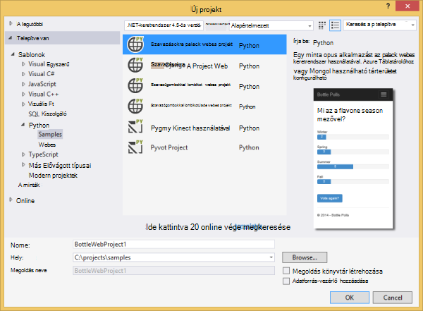

1.  A rendszer kéri a külső csomagok telepítése. Jelölje ki **a virtuális környezetbe telepítése**.

    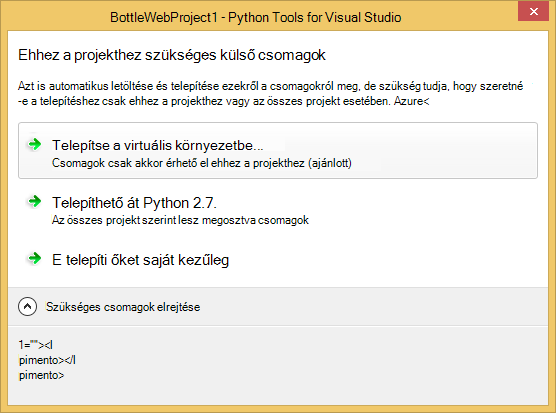

1.  Jelölje be az alap értelmező **Python 2.7** vagy **Python 3.4** .

    

1.  Ellenőrizze, hogy az alkalmazás csak a billentyűkombináció lenyomásával `F5`. Alapértelmezés szerint az alkalmazás-beállításokat nem igénylő a memóriában tárházba használja. Az összes adat nem vesznek el, ha az érintett webkiszolgálóra leáll.

1.  Kattintson a **Minta szavazásokra létrehozása**, majd a szavazás és a szavazás gombra.

    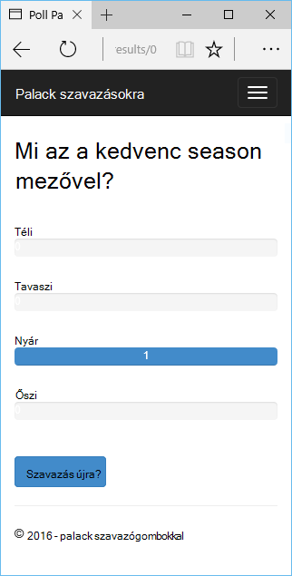

## Azure tároló fiók létrehozása

Tárolási műveletek használatához az Azure tárterület-fiókra van szüksége. Létrehozhat egy tárterület-fiókkal, ezeket a lépéseket követve.

1.  Jelentkezzen be az [Azure-portálon](https://portal.azure.com/).

1. Kattintson az **Új** ikonra a képernyő tetején balra a portál, kattintson a **adatok + tárhely** > **Tárterület-fiókot**.  Kattintson a **Létrehozás** gombra, adjon meg egy egyedi nevet a tárterület-fiók, és hozzon létre egy új [erőforráscsoport](../azure-resource-manager/resource-group-overview.md) azt.

    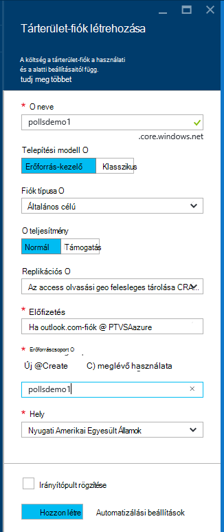

    A tároló fiók létrehozásakor a **értesítések** gomb zöld **sikeres** lesz flash, és a tárterület-fiókot a lap megnyitva, kattintva jelenítse meg, hogy az Ön által létrehozott új erőforráscsoport tartozik.

1. Kattintson a tárolás fiók lap a **hívóbetűk** részére. A fiók nevét és azonosító1 vegye figyelembe.

    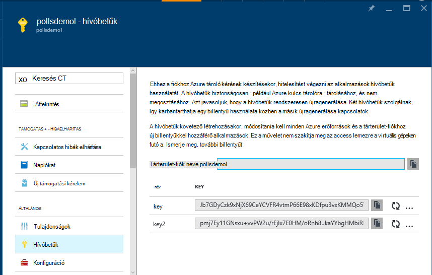

    Ezt az információt a következő szakaszban állítsa be a projekt rendszer szükséges.

## A projekt beállítása

Ebben a részben azt fogja konfigurálása, az imént létrehozott tárterület-fiók. Majd a helyi meghajtóra szolgáltatásban futtassa az alkalmazást.

1.  A Visual Studióban kattintson a jobb gombbal a megoldást Intézőben a projekt csomópontját, és válassza a **Tulajdonságok parancsot**. Kattintson a **hibakeresési** lapon.

    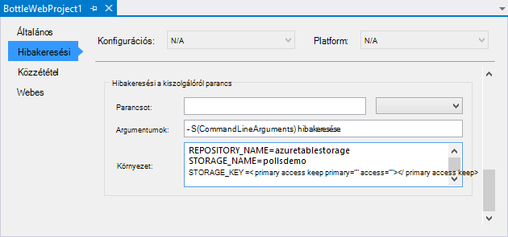

1.  Állítsa be a környezetet változót követel meg az alkalmazás a **Kiszolgálóról parancs hibakeresési** **környezet**értékeket.

        REPOSITORY_NAME=azuretablestorage
        STORAGE_NAME=<storage account name>
        STORAGE_KEY=<primary access key>

    A környezet változók állítja amikor, a **Hibakereséshez indítása**. Ha azt szeretné, hogy be kell állítani **Elindítása nélkül hibakeresése során**, akkor az értékeket a **Kiszolgálóról parancs futtatása** , valamint a változók.

    Másik lehetőségként határozhatja meg a Windows Vezérlőpulton környezeti változók. Ha el szeretné kerülni a hitelesítő adatok forráskód / projekt fájl az jobb választás. Figyelje meg, hogy meg kell indítani a Visual Studio környezetben új értékek, az alkalmazás elérhetővé szeretné tenni.

1.  A kód, amely az Azure Táblatárolóhoz tárházba **models/azuretablestorage.py**szerepel. Lásd: további információt a [dokumentáció] Python táblázat szolgáltatás használatát.

1.  Futtassa az alkalmazást a `F5`. A **Minta lekérdezések létrehozása** és a szavazás által küldött adatok létrehozott szavazásokra fog használhatók, amelyekről az Azure Táblatárolóhoz.

    > [AZURE.NOTE] A Python 2.7 virtuális környezet a Visual Studio-kivétel oldaltörés jelenhet meg.  Nyomja le a `F5` webes projekt betöltése a folytatáshoz. 

1.  Nyissa meg a **kapcsolatos** lapot, ellenőrizze, hogy az alkalmazás az **Azure Táblatárolóhoz** tárházba használ-e.

    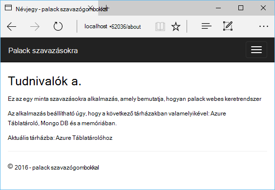

## Ismerkedés az Azure Táblatárolóhoz

Akkor is megtekintheti és szerkesztheti a felhőalapú Intézővel a Visual Studióban tároló táblák könnyen. Ebben a szakaszban a szavazásokra alkalmazás táblázatok tartalmának megtekintéséhez Server Explorer használjuk.

> [AZURE.NOTE] Microsoft Azure eszközök telepítve kell lennie, amely érhető el ehhez az [Azure SDK a .NET rendszerhez]részeként.

1.  Nyissa meg a **felhőben Intézőt**. Bontsa ki a **Tárterület-fiókok**, tároló fiókját, majd a **táblák**.

    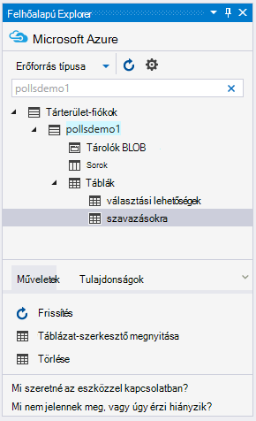

1.  Kattintson duplán a **szavazásokra** vagy **elem is kijelölhető** táblázat a táblázatok tartalmának megtekintéséhez a dokumentumablak, valamint a személyek hozzáadása/eltávolítása vagy módosítása.

    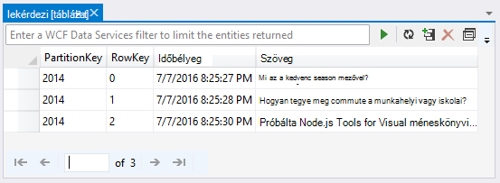

## A web app Azure alkalmazás szolgáltatás közzététele

Az Azure .NET SDK egyszerűvé Azure alkalmazás szolgáltatás szeretne telepíteni, a web App alkalmazásban.

1.  A **Megoldás Explorer**kattintson a jobb gombbal a projekt csomópontra, és válassza a **Közzététel**.

    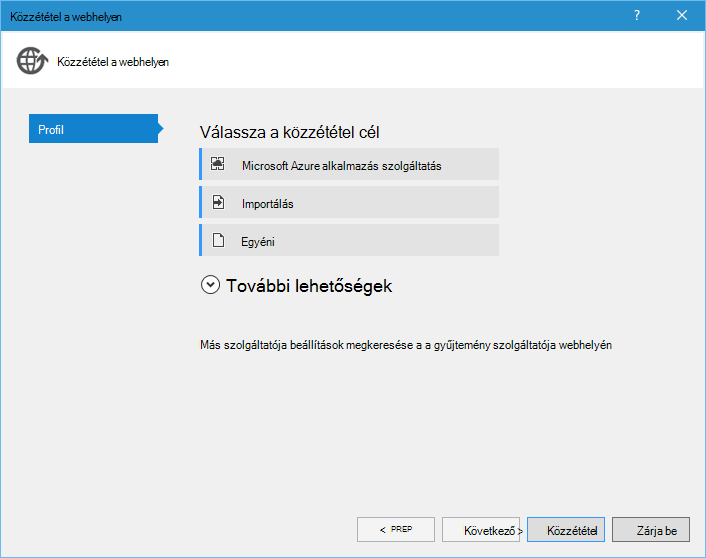

1.  Kattintson a **Microsoft Azure-webalkalmazásokban**.

1.  Kattintson az **Új** webhely új alkalmazás létrehozása céljából.

1.  Töltse ki a következő mezőket, és kattintson a **Létrehozás**gombra.
    -   **Webes alkalmazás neve**
    -   **Alkalmazás szolgáltatáscsomagja**
    -   **Erőforráscsoport**
    -   **Régió**
    -   Hagyja az **adatbázis-kiszolgáló** **nincs adatbázis** beállítása

1.  Fogadja el a többi alapértelmezett, és kattintson a **Közzététel**gombra.

1.  A webböngésző nyílnak meg automatikusan a közzétett webes alkalmazásba. Ha a Tallózás a névjegy lapot, látni fogja, hogy használja-e a **Memóriában** tárházba, nem a **Azure Táblatárolóhoz** tárat.

    Ennek oka az, a környezeti változók nincsenek beállítva az Azure App szolgáltatásban Web Apps-példányt, akkor használja az alapértelmezett értékeket **settings.py**megadott.

## A Web Apps-példány konfigurálása

Ebben a részben azt fogja konfigurálása a Web Apps-példány környezet változói.

1.  Az [Azure-portálon]nyissa meg a web app lap **Tallózás**gombra kattintva > **Alkalmazás szolgáltatások** > a web app nevét.

1.  A web App alkalmazásban a lap **Összes beállítások**gombra, majd kattintson a **Beállítások alkalmazást**.

1.  Görgessen le az **alkalmazás beállításai** csoportban, és a értékének beállítása **TÁRHÁZBA\_neve**, **tároló\_neve** és **tároló\_kulcs** fenti **beállítása a projekthez** szakaszban leírt módon.

    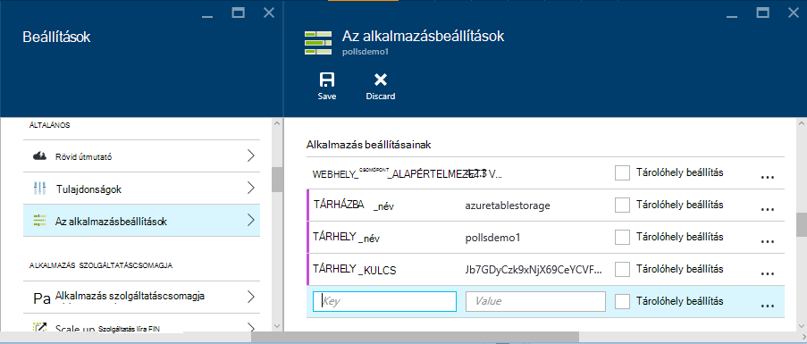

1.  Kattintson a **Mentés**. Után az, hogy a módosítások alkalmazott értesítést arról, kattintson a **Tallózás gombra** a a Web app fő lap.

1.  Meg kell jelennie a web app használata az **Azure Táblatárolóhoz** folyamattárházzal várt módon működnek.

    Gratulálok!

    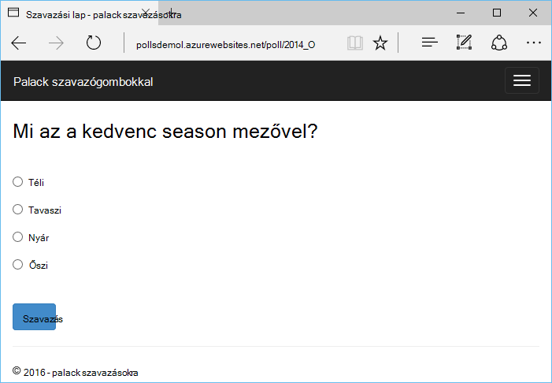

## Következő lépések

Kövesse ezeket a hivatkozásokat, ha többet szeretne tudni a Python eszközök Visual Studio, üveg és Azure Táblatárolóhoz.

- [Python Tools for Visual Studio dokumentáció]
  - [Webes projektek]
  - [Felhőalapú szolgáltatás projektek]
  - [A Microsoft Azure távoli hibakeresés]
- [Palack dokumentáció]
- [Azure tárhely]
- [Azure SDK Python]
- [A táblázat Tárhelyszolgáltatása Python használata]

## Mi változott
* Útmutató a módosítása a webhelyekre alkalmazás szolgáltatás című: [Azure alkalmazás szolgáltatás, és a hatás a meglévő Azure-szolgáltatások](http://go.microsoft.com/fwlink/?LinkId=529714)

<!--Link references-->
[Python Developer Center]: /develop/python/
[Azure Cloud Services]: ../cloud-services-python-ptvs.md
[dokumentáció]: ../storage-python-how-to-use-table-storage.md
[A táblázat Tárhelyszolgáltatása Python használata]: ../storage-python-how-to-use-table-storage.md

<!--External Link references-->
[Azure portál]: https://portal.azure.com
[Azure SDK a .NET rendszerhez]: http://azure.microsoft.com/downloads/
[Python Tools for Visual Studio]: http://aka.ms/ptvs
[Python 2.2 Tools for Visual Studio]: http://go.microsoft.com/fwlink/?LinkId=624025
[Python 2.2 Tools for Visual Studio példák VSIX]: http://go.microsoft.com/fwlink/?LinkId=624025
[Azure SDK eszközök VIEWBEN 2015]: http://go.microsoft.com/fwlink/?LinkId=518003
[A 32 bites 2.7 Python]: http://go.microsoft.com/fwlink/?LinkId=517190 
[A 32 bites 3.4 Python]: http://go.microsoft.com/fwlink/?LinkId=517191
[Python Tools for Visual Studio dokumentáció]: http://aka.ms/ptvsdocs
[Palack dokumentáció]: http://bottlepy.org/docs/dev/index.html
[A Microsoft Azure távoli hibakeresés]: http://go.microsoft.com/fwlink/?LinkId=624026
[Webes projektek]: http://go.microsoft.com/fwlink/?LinkId=624027
[Felhőalapú szolgáltatás projektek]: http://go.microsoft.com/fwlink/?LinkId=624028
[Azure tárhely]: http://azure.microsoft.com/documentation/services/storage/
[Azure SDK Python]: https://github.com/Azure/azure-sdk-for-python
 
