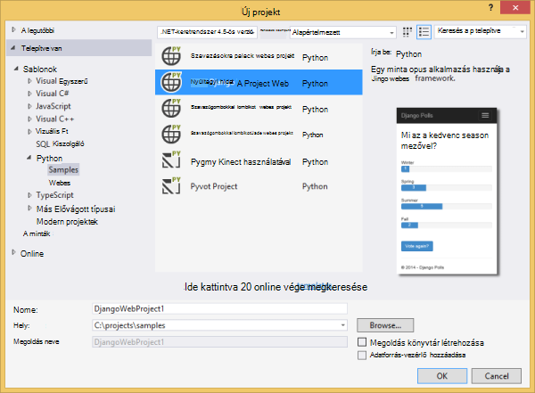
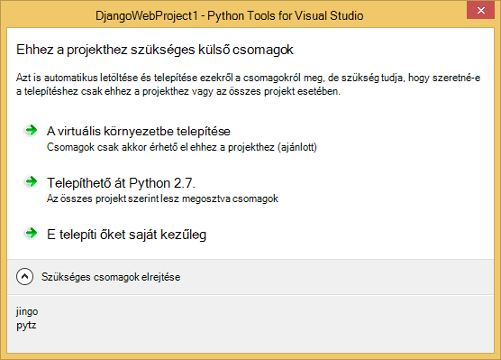
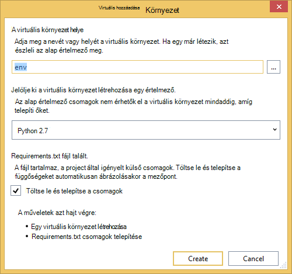
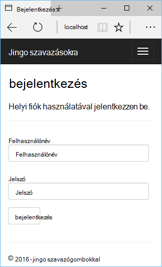
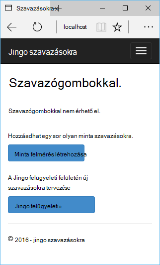
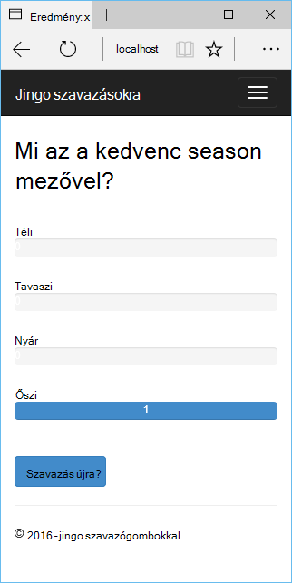
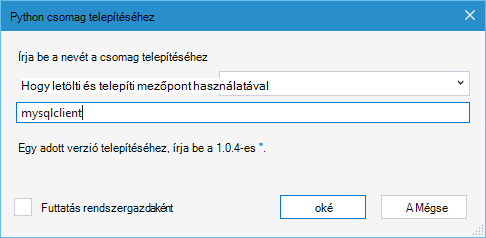
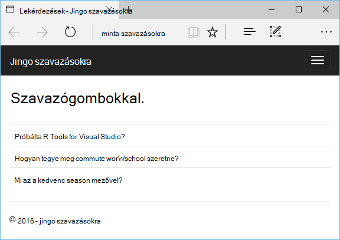

<properties 
    pageTitle="Django és Azure 2.2 Python Tools for Visual Studio és a MySQL" 
    description="Megtudhatja, hogy miként Django webalkalmazást tárolja az adatokat a MySQL-adatbázis példány létrehozása az Python Tools for Visual Studio segítségével, és Azure alkalmazás szolgáltatás Web Apps alkalmazások telepítheti." 
    services="app-service\web" 
    documentationCenter="python" 
    authors="huguesv" 
    manager="wpickett" 
    editor=""/>

<tags 
    ms.service="app-service-web" 
    ms.workload="web" 
    ms.tgt_pltfrm="na" 
    ms.devlang="python"
    ms.topic="get-started-article" 
    ms.date="07/07/2016"
    ms.author="huvalo"/>

# Django és Azure 2.2 Python Tools for Visual Studio és a MySQL 

[AZURE.INCLUDE [tabs](../../includes/app-service-web-get-started-nav-tabs.md)]

Ebben az oktatóanyagban kell megadnia [Python Tools for Visual Studio] (PTVS) közül a PTVS mintasablonok az egyszerű szavazásokra webes alkalmazás létrehozása céljából. Megismerheti az Azure is MySQL szolgáltatás használata, a web app használata MySQL konfigurálása és hogy miként teheti közzé a web app [Azure alkalmazás szolgáltatás Web](http://go.microsoft.com/fwlink/?LinkId=529714)Apps alkalmazások.

> [AZURE.NOTE] Ebben az oktatóanyagban tárolt adatok számára érhető el az alábbi videóban:
> 
> [PTVS 2.1: MySQL Django alkalmazás][video]

A [Python Developer Center] Azure alkalmazás szolgáltatás Web Apps PTVS palack, lombikot és Django webes keretek használata Azure Táblatárolóhoz, MySQL és SQL-adatbázis szolgáltatás fejlesztése terjed ki további projektvezetési cikkeket talál. Ez a cikk az alkalmazás szolgáltatás koncentrál, miközben a lépések hasonlóak [Azure Cloud Services]fejlesztésekor.

## Előfeltételek

 - Visual Studio 2015
 - [Python 2.7 32 bites] vagy [Python 3.4 32 bites]
 - [Python 2.2 Tools for Visual Studio]
 - [Python 2.2 Tools for Visual Studio példák VSIX]
 - [Azure SDK eszközök VIEWBEN 2015]
 - Django 1.9 vagy újabb verzió

[AZURE.INCLUDE [create-account-and-websites-note](../../includes/create-account-and-websites-note.md)]

<!-- This note should not render as part of the the previous include. -->

> [AZURE.NOTE] Ha azt szeretné, mielőtt feliratkozna az Azure-fiók használatbavételéhez Azure alkalmazás szolgáltatás, [Próbálja meg alkalmazás szolgáltatás](http://go.microsoft.com/fwlink/?LinkId=523751), ahol azonnal létrehozhat egy rövid életű starter web app alkalmazás szolgáltatásban megnyitásához. Nincs hitelkártya szükség, és nincs kötelezettségek szükség.

## A projekt létrehozása

Ebben a részben kell létrehoznia a Visual Studio projekt minta sablon használatával. Hozzon létre egy virtuális környezet lesz, és szükséges csomagok telepítése. Kell létrehoznia sqlite egy helyi adatbázist. Kattintson az alkalmazás helyben kell futtatni.

1. A Visual Studióban jelölje ki a **fájlt**, **Új projektet**.

1. Az [Eszközök 2.2 Python for Visual Studio minták VSIX] a project-sablonok **Python**, **minták**csoportban érhetők el. Jelölje ki a **Szavazásokra Django webes projektet** , és kattintson az OK gombra a projekt létrehozásához.

    

1. A rendszer kéri a külső csomagok telepítése. Jelölje ki **a virtuális környezetbe telepítése**.

    

1. Jelölje be az alap értelmező **Python 2.7** vagy **Python 3.4** .

    

1. A **Megoldás Explorer**kattintson a jobb gombbal a projekt csomópontját, és jelölje ki a **Python**, és válassza a **Django áttelepítése**parancsra.  Válassza a **Django létrehozása rendszeradminisztrátori**.

1. Ezzel nyissa meg a Django Management Console és sqlite adatbázis létrehozása a projekt mappában. Kövesse az útmutatást követve hozzon létre egy felhasználót.

1. Ellenőrizze, hogy az alkalmazás csak a billentyűkombináció lenyomásával `F5`.

1. A felső navigációs sávján kattintson a **Bejelentkezés** gombra.

    

1. Írja be a felhasználó, akkor jön létre, ha az adatbázis szinkronizált a hitelesítő adatokat.

    

1. Kattintson a **minta felmérés létrehozása**gombra.

    

1. Kattintson a szavazás, és a szavazáshoz.

    

## MySQL-adatbázis létrehozása

Az adatbázis kell létrehoznia szolgáltatott ClearDB MySQL-adatbázishoz a Azure.

Alternatívájaként létrehozhat saját virtuális gép Azure, futó, majd telepítése és felügyelete MySQL saját magának.

Adatbázis egy ingyenes csomaggal hozhat létre a következő lépésekkel.

1. Jelentkezzen be az [Azure-portálon].

1. A navigációs ablak tetején kattintson az **Új**, majd kattintson az **adatok + tárhely**, és válassza a **MySQL-adatbázishoz**. 

1. Állítsa be az új MySQL-adatbázishoz: hozzon létre egy új erőforráscsoport, és válassza ki a megfelelő helyét.

1. Amikor a MySQL-adatbázis létrejött, az adatbázis lap kattintson a **Tulajdonságok** gombra.

1. A Másolás gomb segítségével helyezze a **KAPCSOLATI karakterlánc** értékét a vágólapra.

## A projekt beállítása

Ebben a részben konfigurálnia kell a webalkalmazás az imént létrehozott MySQL-adatbázis használata. Is telepíteni kell a Django MySQL-adatbázis eléréséhez szükséges további Python csomagokat. Ezután futtatják a web app helyi meghajtóra.

1. A Visual Studióban nyissa meg a **settings.py**, a *projektnév* mappából. A kapcsolati karakterlánc ideiglenes illessze be a szerkesztő. A kapcsolati karakterlánc ebben a formátumban van:

        Database=<NAME>;Data Source=<HOST>;User Id=<USER>;Password=<PASSWORD>

    Az alapértelmezés szerinti adatbázis **motor** MySQL használni, és az értékeket a **név**, a **felhasználó**, a **jelszó** és a **HOST** a **CONNECTIONSTRING**a.

        DATABASES = {
            'default': {
                'ENGINE': 'django.db.backends.mysql',
                'NAME': '<Database>',
                'USER': '<User Id>',
                'PASSWORD': '<Password>',
                'HOST': '<Data Source>',
                'PORT': '',
            }
        }

1. Megoldás Explorer **Python környezetekben**csoportban kattintson a jobb gombbal a virtuális környezet, és válassza a **Python csomag telepítéséhez**.

1. A csomag telepítéséhez `mysqlclient` **mezőpont**használatával.

    

1. A **Megoldás Explorer**kattintson a jobb gombbal a projekt csomópontját, és jelölje ki a **Python**, és válassza a **Django áttelepítése**parancsra.  Válassza a **Django létrehozása rendszeradminisztrátori**.

    Ez a hoz létre az előző részben létrehozott MySQL-adatbázis tábláit. Kövesse az útmutatást követve hozzon létre egy felhasználó nem rendelkezik a megfelelő a felhasználó a jelen cikk az első szakaszban létrehozott sqlite-adatbázisban.

1. Futtassa az alkalmazást a `F5`. A **Minta lekérdezések létrehozása** és a szavazás által küldött adatok létrehozott szavazásokra fog használhatók, amelyekről a MySQL-adatbázishoz.

## A web app Azure alkalmazás szolgáltatás közzététele

Az Azure .NET SDK egyszerűvé Azure alkalmazás szolgáltatás szeretne telepíteni, a web App alkalmazásban.

1. A **Megoldás Explorer**kattintson a jobb gombbal a projekt csomópontra, és válassza a **Közzététel**.

    

1. Kattintson a **Microsoft Azure alkalmazás szolgáltatás**.

1. Kattintson az **Új** webhely új alkalmazás létrehozása céljából.

1. Töltse ki a következő mezőket, és kattintson a **Létrehozás**gombra:
    - **Webes alkalmazás neve**
    - **Alkalmazás szolgáltatáscsomagja**
    - **Erőforráscsoport**
    - **Régió**
    - Hagyja az **adatbázis-kiszolgáló** **nincs adatbázis** beállítása

1. Fogadja el a többi alapértelmezett, és kattintson a **Közzététel**gombra.

1. A webböngésző nyílnak meg automatikusan a közzétett webes alkalmazásba. Meg kell jelennie a web app használatával a **MySQL** -adatbázishoz is Azure várt módon működnek.

    

    Gratulálok! Sikeresen közzétett a MySQL-alapú webalkalmazás Azure.

## Következő lépések

Kövesse ezeket a hivatkozásokat, ha többet szeretne tudni a Python eszközök a Visual Studióban, Django és MySQL.

- [Python Tools for Visual Studio dokumentáció]
  - [Webes projektek]
  - [Felhőalapú szolgáltatás projektek]
  - [A Microsoft Azure távoli hibakeresés]
- [Django dokumentáció]
- [MySQL]

További tudnivalókért lásd: a [Python Developer Center](/develop/python/).

<!--Link references-->

[Python Developer Center]: /develop/python/
[Azure Cloud Services]: ../cloud-services-python-ptvs.md

<!--External Link references-->

[Azure portál]: https://portal.azure.com
[Python Tools for Visual Studio]: http://aka.ms/ptvs
[Python 2.2 Tools for Visual Studio]: http://go.microsoft.com/fwlink/?LinkID=624025
[Python 2.2 Tools for Visual Studio példák VSIX]: http://go.microsoft.com/fwlink/?LinkID=624025
[Azure SDK eszközök VIEWBEN 2015]: http://go.microsoft.com/fwlink/?LinkId=518003
[A 32 bites 2.7 Python]: http://go.microsoft.com/fwlink/?LinkId=517190 
[A 32 bites 3.4 Python]: http://go.microsoft.com/fwlink/?LinkId=517191
[Python Tools for Visual Studio dokumentáció]: http://aka.ms/ptvsdocs
[A Microsoft Azure távoli hibakeresés]: http://go.microsoft.com/fwlink/?LinkId=624026
[Webes projektek]: http://go.microsoft.com/fwlink/?LinkId=624027
[Felhőalapú szolgáltatás projektek]: http://go.microsoft.com/fwlink/?LinkId=624028
[Django dokumentáció]: https://www.djangoproject.com/
[MySQL]: http://www.mysql.com/
[video]: http://youtu.be/oKCApIrS0Lo
