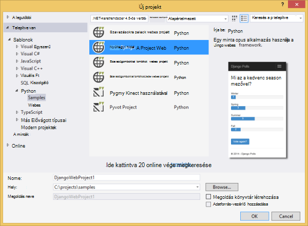
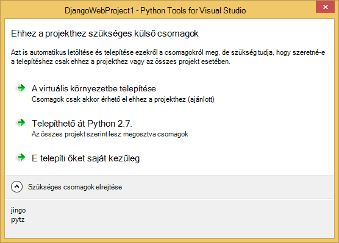
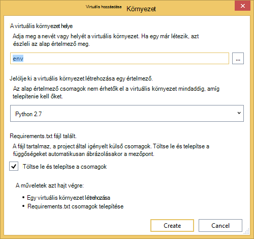
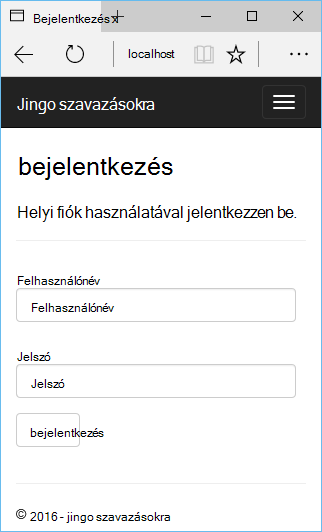
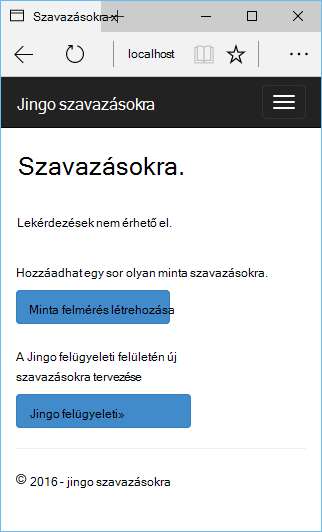
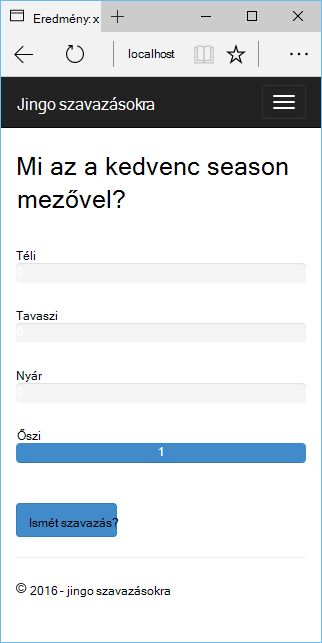
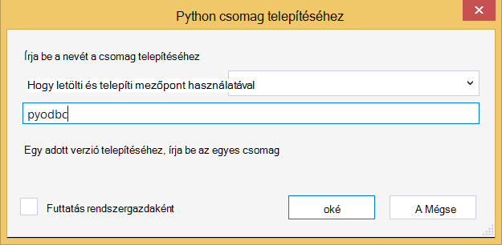
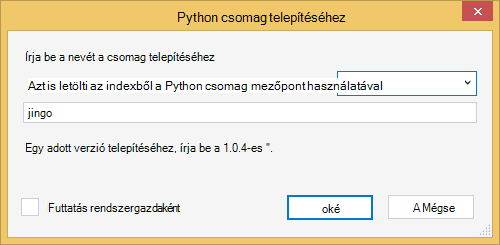
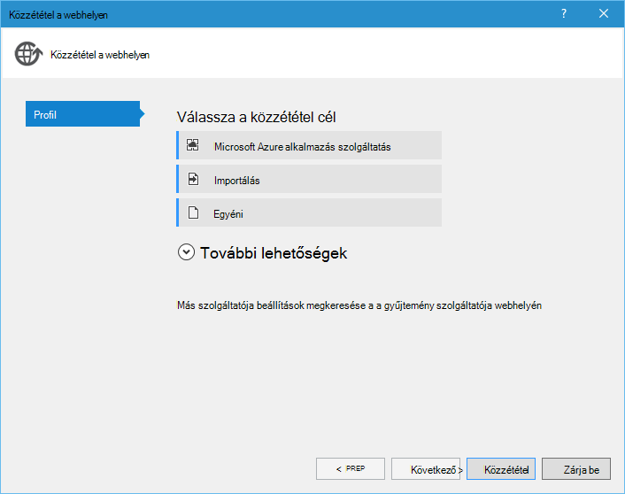
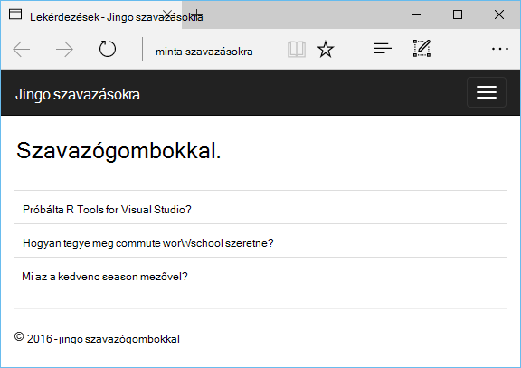

<properties 
    pageTitle="Django és a 2.2 Python Tools for Visual Studio az Azure SQL-adatbázis" 
    description="Megtudhatja, hogy miként Django webalkalmazást tárolja az adatokat egy SQL-adatbázis példány létrehozása az Python Tools for Visual Studio segítségével, és Azure alkalmazás szolgáltatás Web Apps alkalmazások telepítheti." 
    services="app-service\web" 
    tags="python"
    documentationCenter="python" 
    authors="huguesv" 
    manager="wpickett" 
    editor=""/>

<tags 
    ms.service="app-service-web" 
    ms.workload="web" 
    ms.tgt_pltfrm="na" 
    ms.devlang="python" 
    ms.topic="article" 
    ms.date="07/07/2016"
    ms.author="huguesv"/>

# Django és a 2.2 Python Tools for Visual Studio az Azure SQL-adatbázis 

Ebben az oktatóanyagban használjuk [Python Tools for Visual Studio] közül a PTVS mintasablonok az egyszerű szavazásokra webes alkalmazás létrehozása céljából. Ebben az oktatóanyagban érhető el, a [Videó](https://www.youtube.com/watch?v=ZwcoGcIeHF4).

Azt Dióhéjban is Azure SQL-adatbázis használata, a web app használata SQL-adatbázishoz való beállításáról és hogy miként teheti közzé a web app [Azure alkalmazás Service Web](http://go.microsoft.com/fwlink/?LinkId=529714)Apps alkalmazások.

A [Python Developer Center] Azure alkalmazás szolgáltatás Web Apps palack, lombikot és Django webes keretek használata Azure Táblatárolóhoz, MySQL és SQL-adatbázis szolgáltatások PTVS fejlesztésének terjed ki további projektvezetési cikkeket talál. Ez a cikk összpontosít szolgáltatási alkalmazást, amíg a lépések hasonlóak [Azure Cloud Services]fejlesztésekor.

## Előfeltételek

 - Visual Studio 2015
 - [A 32 bites 2.7 Python]
 - [Python 2.2 Tools for Visual Studio]
 - [Python 2.2 Tools for Visual Studio példák VSIX]
 - [Azure SDK eszközök VIEWBEN 2015]
 - Django 1.9 vagy újabb verzió

[AZURE.INCLUDE [create-account-and-websites-note](../../includes/create-account-and-websites-note.md)]

>[AZURE.NOTE] Ha azt szeretné, mielőtt feliratkozna az Azure-fiók kezdéshez Azure alkalmazás szolgáltatással, nyissa meg a [Próbálja alkalmazás szolgáltatás](http://go.microsoft.com/fwlink/?LinkId=523751), ahol azonnal létrehozhat egy rövid életű starter web app alkalmazás szolgáltatásban. Nem kötelező, hitelkártyák Nincs nyilatkozatát.

## A projekt létrehozása

Ebben a részben minta sablon használatával Visual Studio projekt létrehoznia azt. Hogy miként hozzon létre egy virtuális környezet és telepítéséhez szükséges csomagokat. Azt létrehoznia sqlite egy helyi adatbázist. Majd a helyi meghajtóra szolgáltatásban futtassa a web App alkalmazásban.

1.  A Visual Studióban jelölje ki a **fájlt**, **Új projektet**.

1.  Az [Eszközök 2.2 Python for Visual Studio minták VSIX] a project-sablonok **Python**, **minták**csoportban érhetők el. Jelölje ki a **Szavazásokra Django webes projektet** , és kattintson az OK gombra a projekt létrehozásához.

    

1.  A rendszer kéri a külső csomagok telepítése. Jelölje ki **a virtuális környezetbe telepítése**.

    

1.  Jelölje be az alap értelmező **Python 2.7** .

    

1.  A **Megoldás Explorer**kattintson a jobb gombbal a projekt csomópontját, és jelölje ki a **Python**, és válassza a **Django áttelepítése**parancsra.  Válassza a **Django létrehozása rendszeradminisztrátori**.

1.  Ezzel nyissa meg a Django Management Console és sqlite adatbázis létrehozása a projekt mappában. Kövesse az útmutatást követve hozzon létre egy felhasználót.

1.  Győződjön meg arról, hogy az alkalmazás csak a <kbd>F5</kbd>billentyű lenyomásával.

1.  A felső navigációs sávján kattintson a **Bejelentkezés** gombra.

    

1.  Írja be a felhasználó, akkor jön létre, ha az adatbázis szinkronizált a hitelesítő adatokat.

    

1.  Kattintson a **minta felmérés létrehozása**gombra.

    

1.  Kattintson a szavazás, és a szavazáshoz.

    

## SQL-adatbázis létrehozása

Az adatbázishoz hogy létre fogja hozni Azure SQL-adatbázishoz.

Létrehozhat egy adatbázist, ezeket a lépéseket követve.

1.  Jelentkezzen be az [Azure-portálon].

1.  A navigációs ablak alján kattintson az **Új**gombra. , kattintson az **adatok + tárhely** > **SQL-adatbázishoz**.

1.  Az új SQL-adatbázis konfigurálása: hozzon létre egy új erőforráscsoport, és válassza ki a megfelelő helyét.

1.  Az SQL-adatbázis létrehozása után kattintson **a Visual Studio alkalmazásban nyissa meg** az adatbázis lap.
2.  Kattintson a **beállítás a tűzfalon keresztül**.
3.  A **Tűzfal beállításai** lap az adja meg a **KEZDŐ IP-** és a **Záró IP-** tűzfal szabály beállítása a fejlesztés számítógép a nyilvános IP-címére. Kattintson a **Mentés**gombra.

    Kapcsolatok a fejlesztés számítógépről ezáltal az adatbázis-kiszolgálóval.

4.  Vissza az adatbázist a lap, kattintson a **Tulajdonságok**parancsra, majd kattintson az **adatbázis-kapcsolatot karakterláncok megjelenítése**. 

2.  A Másolás gomb segítségével **ADO.NET** értékét a vágólapra helyezése.

## A projekt beállítása

Ebben a részben azt fogja állítsa be az imént létrehozott SQL-adatbázis használata a web App alkalmazásban. Azt fogja is telepíthetik az SQL-adatbázisait Django használatához szükséges további Python csomagokat. Majd a helyi meghajtóra szolgáltatásban futtassa a web App alkalmazásban.

1.  A Visual Studióban nyissa meg a **settings.py**, a *projektnév* mappából. A kapcsolati karakterlánc ideiglenes illessze be a szerkesztő. A kapcsolati karakterlánc ebben a formátumban van:

        Server=<ServerName>,<ServerPort>;Database=<DatabaseName>;User ID=<UserName>;Password={your_password_here};Encrypt=True;TrustServerCertificate=False;Connection Timeout=30;

Definíciójának szerkesztése `DATABASES` a fenti értékeket szeretné használni.

        DATABASES = {
            'default': {
                'ENGINE': 'sql_server.pyodbc',
                'NAME': '<DatabaseName>',
                'USER': '<UserName>',
                'PASSWORD': '{your_password_here}',
                'HOST': '<ServerName>',
                'PORT': '<ServerPort>',
                'OPTIONS': {
                    'driver': 'SQL Server Native Client 11.0',
                    'MARS_Connection': 'True',
                }
            }
        }

1.  Megoldás Explorer **Python környezetekben**csoportban kattintson a jobb gombbal a virtuális környezet, és válassza a **Python csomag telepítéséhez**.

1.  A csomag telepítéséhez `pyodbc` **mezőpont**használatával.

    

1.  A csomag telepítéséhez `django-pyodbc-azure` **mezőpont**használatával.

    

1.  A **Megoldás Explorer**kattintson a jobb gombbal a projekt csomópontját, és jelölje ki a **Python**, és válassza a **Django áttelepítése**parancsra.  Válassza a **Django létrehozása rendszeradminisztrátori**.

    Ez a hoz létre az előző részben létrehozott az SQL-adatbázis tábláit. Kövesse az útmutatást követve hozzon létre egy felhasználót, amelyeket nem felel meg a felhasználót a sqlite adatbázisban, az első szakaszban létrehozott.

1.  Futtassa az alkalmazást a `F5`. A **Minta szavazógombokkal létrehozása** és a szavazás által küldött adatok létrehozott szavazógombokkal fog használhatók, amelyekről az SQL-adatbázisban.

## A web app Azure alkalmazás szolgáltatás közzététele

Az Azure .NET SDK egyszerűvé telepítéshez használni a webes webalkalmazás Azure alkalmazás Service Web Apps alkalmazások.

1.  A **Megoldás Explorer**kattintson a jobb gombbal a projekt csomópontra, és válassza a **Közzététel**.

    

1.  Kattintson a **Microsoft Azure-webalkalmazásokban**.

1.  Kattintson az **Új** webhely új alkalmazás létrehozása céljából.

1.  Töltse ki a következő mezőket, és kattintson a **Létrehozás**gombra.
    -   **Webes alkalmazás neve**
    -   **Alkalmazás szolgáltatáscsomagja**
    -   **Erőforráscsoport**
    -   **Régió**
    -   Hagyja az **adatbázis-kiszolgáló** **nincs adatbázis** beállítása

1.  Fogadja el a többi alapértelmezett, és kattintson a **Közzététel**gombra.

1.  A webböngésző nyílnak meg automatikusan a közzétett webes alkalmazásba. Meg kell jelennie a várakozásoknak, dolgozik web app használatával is Azure **SQL** -adatbázishoz.

    Gratulálok!

    

## Következő lépések

Kövesse ezeket a hivatkozásokat, ha többet szeretne tudni a Python eszközök a Visual Studióban, Django és SQL-adatbázishoz.

- [Python Tools for Visual Studio dokumentáció]
  - [Webes projektek]
  - [Felhőalapú szolgáltatás projektek]
  - [A Microsoft Azure távoli hibakeresés]
- [Django dokumentáció]
- [SQL-adatbázis]

## Mi változott
* Útmutató a módosítása a webhelyekre alkalmazás szolgáltatás című: [Azure alkalmazás szolgáltatás, és a hatás a meglévő Azure-szolgáltatások](http://go.microsoft.com/fwlink/?LinkId=529714)

<!--Link references-->
[Python Developer Center]: /develop/python/
[Azure Cloud Services]: ../cloud-services-python-ptvs.md

<!--External Link references-->
[Azure portál]: https://portal.azure.com
[Python Tools for Visual Studio]: http://aka.ms/ptvs
[Python 2.2 Tools for Visual Studio]: http://go.microsoft.com/fwlink/?LinkID=624025
[Python 2.2 Tools for Visual Studio példák VSIX]: http://go.microsoft.com/fwlink/?LinkID=624025
[Azure SDK eszközök VIEWBEN 2015]: http://go.microsoft.com/fwlink/?LinkId=518003
[A 32 bites 2.7 Python]: http://go.microsoft.com/fwlink/?LinkId=517190 
[Python Tools for Visual Studio dokumentáció]: http://aka.ms/ptvsdocs
[A Microsoft Azure távoli hibakeresés]: http://go.microsoft.com/fwlink/?LinkId=624026
[Webes projektek]: http://go.microsoft.com/fwlink/?LinkId=624027
[Felhőalapú szolgáltatás projektek]: http://go.microsoft.com/fwlink/?LinkId=624028
[Django dokumentáció]: https://www.djangoproject.com/
[SQL-adatbázis]: /documentation/services/sql-database/
