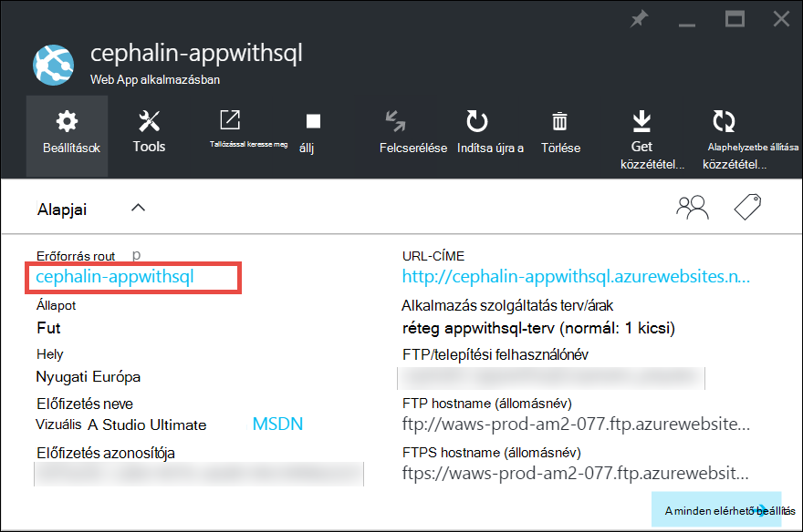
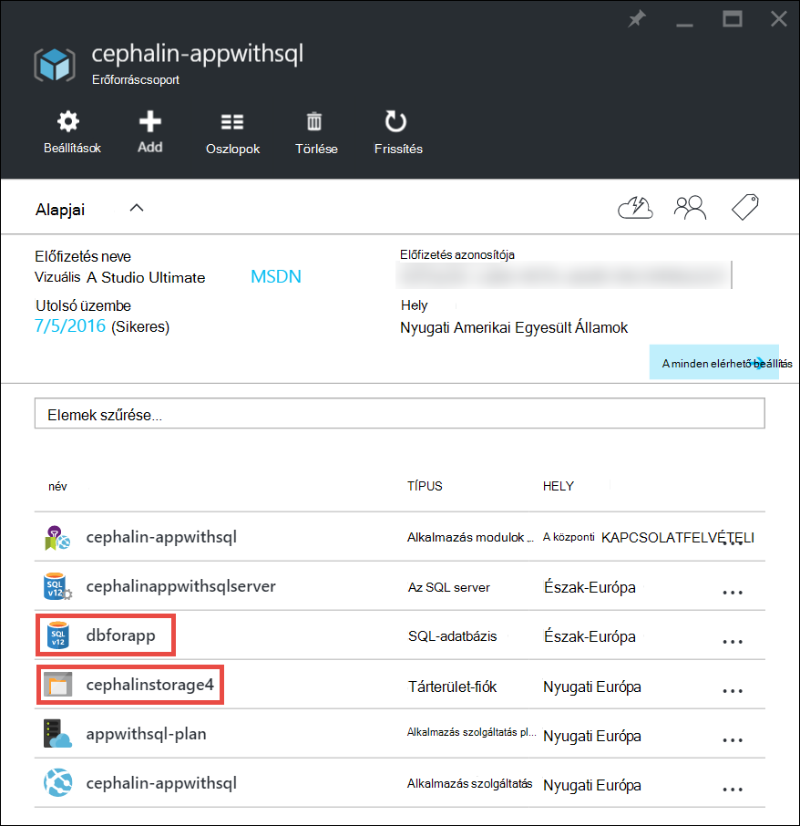
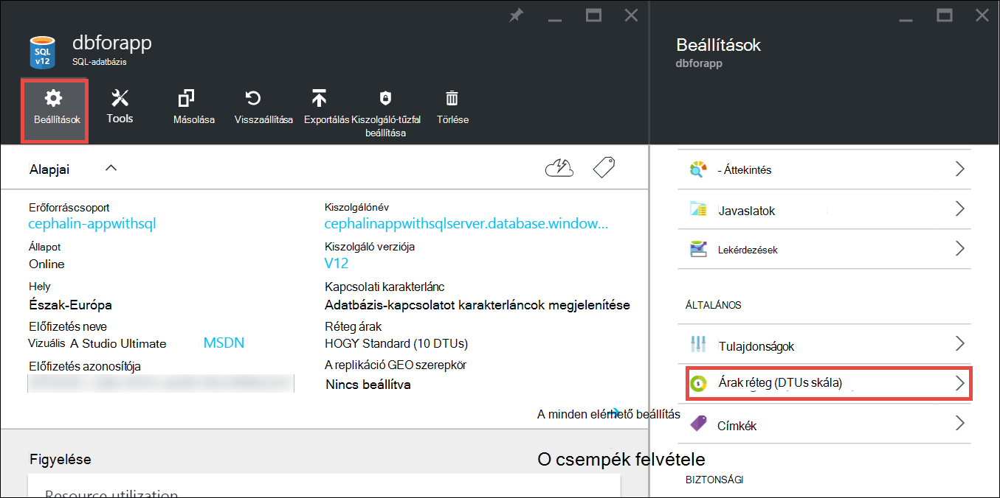
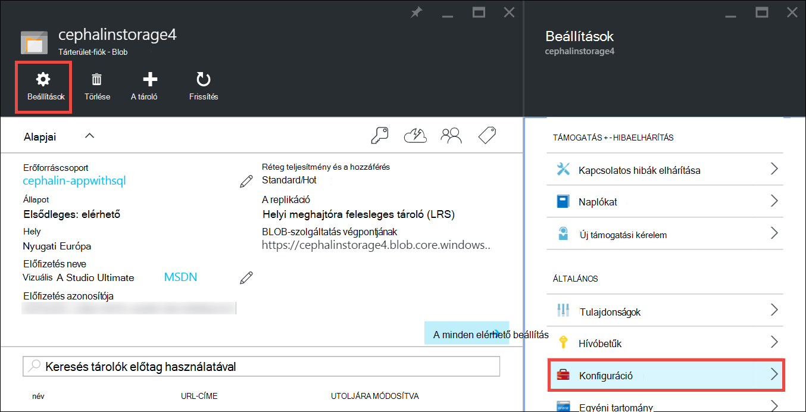

<properties
    pageTitle="Azure-alkalmazás mentése méretezni |} Microsoft Azure"
    description="Megtudhatja, hogy miként méretezheti be az alkalmazás hozzáadása a beosztását, és a szolgáltatások Azure App szolgáltatásban."
    services="app-service"
    documentationCenter=""
    authors="cephalin"
    manager="wpickett"
    editor="mollybos"/>

<tags
    ms.service="app-service"
    ms.workload="na"
    ms.tgt_pltfrm="na"
    ms.devlang="na"
    ms.topic="article"
    ms.date="07/05/2016"
    ms.author="cephalin"/>

# Azure-alkalmazás mentése méretezése #

Ez a cikk bemutatja, hogyan, ha az alkalmazás Azure App szolgáltatásban. Két munkafolyamatainak méretezésű, skála be és skála ki, és ez a cikk ismerteti, a skála munkafolyamat be.

- [Méretezni](https://en.wikipedia.org/wiki/Scalability#Horizontal_and_vertical_scaling): további Processzor, memóriahasználat, lemezterületet és további szolgáltatásokat, például a dedikált virtuális gépeken futó (VMs), az egyéni tartományok és a tanúsítványok, a helyek, autoscaling és az egyéb átmeneti tárolására. Az alkalmazás szolgáltatás terv, amelyhez tartozik az alkalmazás a árak réteg módosításával méretezni.
- [Ki méretarány](https://en.wikipedia.org/wiki/Scalability#Horizontal_and_vertical_scaling): az alkalmazás futó példányok virtuális számának növelése.
Méretezheti akár 20 példányaiban, attól függően, hogy a árak réteg. [Alkalmazás-szolgáltatási környezetben](../app-service/app-service-app-service-environments-readme.md) **prémium** réteg további növelik a méretezési darab 50 példányaiban. Méretezés kifelé kapcsolatos további tudnivalókért olvassa el a [kézzel és automatikusan átméretezheti a példányok száma](../monitoring-and-diagnostics/insights-how-to-scale.md)című témakört. Nem találja való használatának autoscaling, amely olyan, ha át kívánja méretezni példányok száma alapján automatikusan előre definiált szabályok és az ütemtervekről.

A méretarány-beállításai csak alkalmazni, és hogyan befolyásolják a [szolgáltatáscsomagja alkalmazás](../app-service/azure-web-sites-web-hosting-plans-in-depth-overview.md)az összes alkalmazás másodpercig eltarthat.
Ezek nem szükséges, telepítsen újra az alkalmazást, és módosítsa a kódot.

A árak és az egyes App milyen szolgáltatáscsomagok szolgáltatásaival kapcsolatos tudnivalókért lásd: [Alkalmazás szolgáltatás árak adatai](/pricing/details/web-sites/).  

> [AZURE.NOTE] Mielőtt átállítja a **szabad** réteg alkalmazás szolgáltatás csomagjával, el kell távolítani a [korlátok kiadások](/pricing/spending-limits/) helyen Azure előfizetéshez tartozó. Beállításainak megtekintése vagy módosítása a Microsoft Azure alkalmazás szolgáltatás előfizetéséhez, lásd: [Microsoft Azure előfizetések][azuresubscriptions].

## Átméretezheti a árak réteg felfelé

1. A böngészőben nyissa meg az [Azure portál][portal].

2. Az alkalmazás a lap, az **összes beállítások**gombra, és válassza a **Méret parancsot**.

    ![Nyissa meg az Azure-alkalmazás mentése méretezni.][ChooseWHP]

4. Válassza a réteg, és kattintson a **Jelölje ki**.

    Az **értesítések** fülre fog flash zöld **sikeres** , a művelet befejezése után.

## Kapcsolódó források méretezése
Ha más szolgáltatásaival, például SQL Azure-adatbázis vagy az Azure tárolására, függ, hogy az alkalmazás is méretezheti e szükségletek erőforrásokat. Ezek az erőforrások az alkalmazás szolgáltatáscsomagja nem méretezése és külön-külön kell méretezett.

1. **Essentials**kattintson az **erőforráscsoport** hivatkozásra.

    

2. Az **erőforráscsoport** lap **összefoglaló** részét kattintson egy erőforrás, amelyet szeretne méretezni. Az alábbi képernyőképen látható egy SQL-adatbázis és az Azure tároló típusú erőforrást.

    

3. SQL-adatbázis erőforrás megadásához kattintson a **Beállítások** > **árak réteg** , ha át kívánja méretezni, az ár az első csoportba tartozó.

    

    Is bekapcsolhatja [a replikáció geo](../sql-database/sql-database-geo-replication-overview.md) az SQL-adatbázis előfordulásra vonatkozóan.

    Azure tároló erőforrás, kattintson a **Beállítások** > **konfigurációs** , ha át kívánja méretezni a tárhely megadása.

    

## Tudnivalók a fejlesztői szolgáltatások
Attól függően, hogy a árak réteg az alábbi Fejlesztőeszközök készült funkciók állnak rendelkezésre:

### Bitszámának ###

- Az **egyszerű**, **normál**és **Premium** rétegek 64 bites és a 32 bites alkalmazásokat támogatja.
- Az **ingyenes** , a **megosztott** terv rétegek támogatja a csak a 32 bites alkalmazásokat.

### Támogatás hibakeresési ###

- Egy kapcsolatot egy alkalmazás szolgáltatáscsomagja a **szabad**, a **megosztott**és a **egyszerű** módok Debugger támogatás érhető el.
- A **normál** és **prémium** módok öt egyidejű kapcsolatok alkalmazás szolgáltatáscsomagja per a Debugger támogatás érhető el.

## Egyéb funkciók ismertetése

- Minden hátralévő szereplő alkalmazás szolgáltatás, beleértve a árak funkciók és szolgáltatások (beleértve a fejlesztők) minden felhasználó számára érdekes kapcsolatos részletes tudnivalókért lásd: [Alkalmazás szolgáltatás árak adatai](/pricing/details/web-sites/).

>[AZURE.NOTE] Ha szeretné az első lépések Azure alkalmazás szolgáltatás, mielőtt regisztrál az Azure-fiók, olvassa el a [Alkalmazás szolgáltatás próbálja meg](http://go.microsoft.com/fwlink/?LinkId=523751) , hol azonnal létrehozhat egy rövid életű starter web app alkalmazás szolgáltatásban. Nincs hitelkártyát szükség, és nincsenek nincs nyilatkozatát.

## Következő lépések

- Első lépések az Azure, olvassa el [A Microsoft Azure ingyenes próbaverziót](/pricing/free-trial/).
- Árak, támogatási és SLA tudni keresse fel az alábbi hivatkozásokat.

    [Adatok átvitele árakról](/pricing/details/data-transfers/)

    [Microsoft Azure támogatási csomagok](/support/plans/)

    [Szolgáltatás szintű rendelkezést](/support/legal/sla/)

    [SQL-adatbázis árak részletei](/pricing/details/sql-database/)

    [Virtuális gép, mind a Microsoft Azure felhőalapú szolgáltatás méret][vmsizes]

    [Alkalmazás szolgáltatás árak adatai](/pricing/details/app-service/)

    [Alkalmazás szolgáltatás árak részletei - SSL-kapcsolatot](/pricing/details/web-sites/#ssl-connections)

- Ajánlott eljárások épület méretezhető és rugalmassá architektúra, beleértve témakörben talál információt az Azure alkalmazás szolgáltatás [ajánlott eljárások: Azure alkalmazás szolgáltatás Web Apps alkalmazások](http://blogs.msdn.com/b/windowsazure/archive/2014/02/10/best-practices-windows-azure-websites-waws.aspx).

- Videoklipek méretezése alkalmazás szolgáltatás alkalmazások a következő forrásokban talál:

    - [Mikor érdemes Azure webhelyek – a Lengyel Schackow méretezése](/documentation/videos/azure-web-sites-free-vs-standard-scaling/)
    - [Automatikus méretezés Azure webhelyek, a Processzor vagy ütemezett – a Lengyel Schackow](/documentation/videos/auto-scaling-azure-web-sites/)
    - [Hogyan Azure webhelyek áttetszőséggel - lengyel Schackow](/documentation/videos/how-azure-web-sites-scale/)

<!-- LINKS -->
[vmsizes]:/pricing/details/app-service/
[SQLaccountsbilling]:http://go.microsoft.com/fwlink/?LinkId=234930
[azuresubscriptions]:http://go.microsoft.com/fwlink/?LinkID=235288
[portal]: https://portal.azure.com/

<!-- IMAGES -->
[ChooseWHP]: ./media/web-sites-scale/scale1ChooseWHP.png
[ChooseBasicInstances]: ./media/web-sites-scale/scale2InstancesBasic.png
[SaveButton]: ./media/web-sites-scale/05SaveButton.png
[BasicComplete]: ./media/web-sites-scale/06BasicComplete.png
[ScaleStandard]: ./media/web-sites-scale/scale3InstancesStandard.png
[Autoscale]: ./media/web-sites-scale/scale4AutoScale.png
[SetTargetMetrics]: ./media/web-sites-scale/scale5AutoScaleTargetMetrics.png
[SetFirstRule]: ./media/web-sites-scale/scale6AutoScaleFirstRule.png
[SetSecondRule]: ./media/web-sites-scale/scale7AutoScaleSecondRule.png
[SetThirdRule]: ./media/web-sites-scale/scale8AutoScaleThirdRule.png
[SetRulesFinal]: ./media/web-sites-scale/scale9AutoScaleFinal.png
[ResourceGroup]: ./media/web-sites-scale/scale10ResourceGroup.png
[ScaleDatabase]: ./media/web-sites-scale/scale11SQLScale.png
[GeoReplication]: ./media/web-sites-scale/scale12SQLGeoReplication.png
