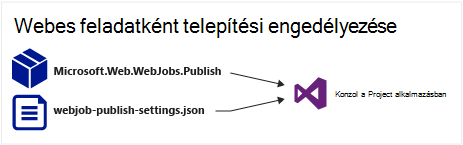
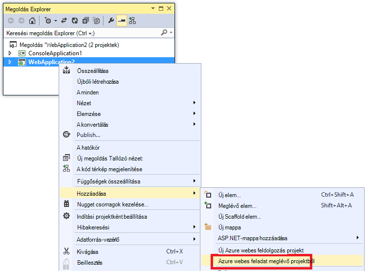
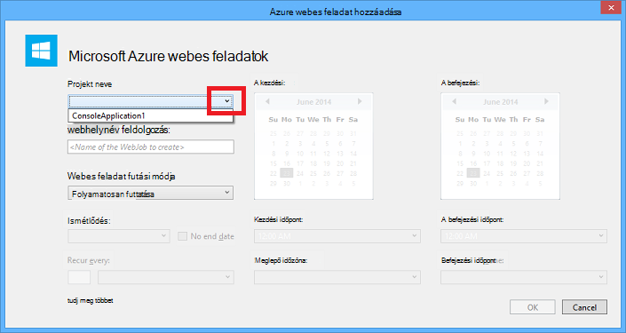
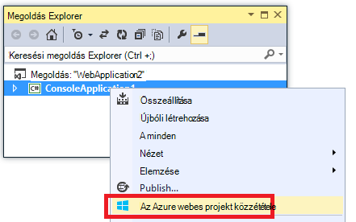
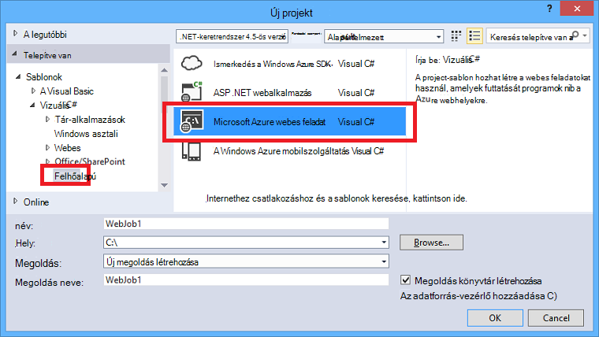
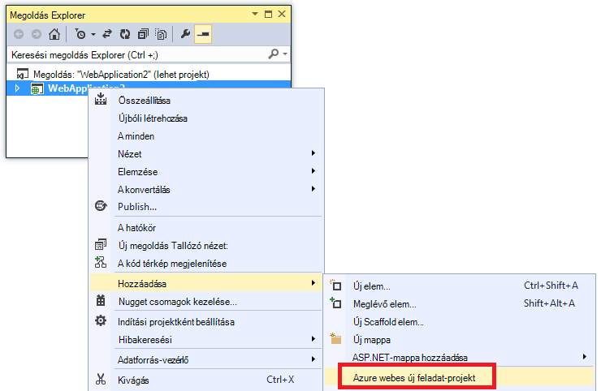
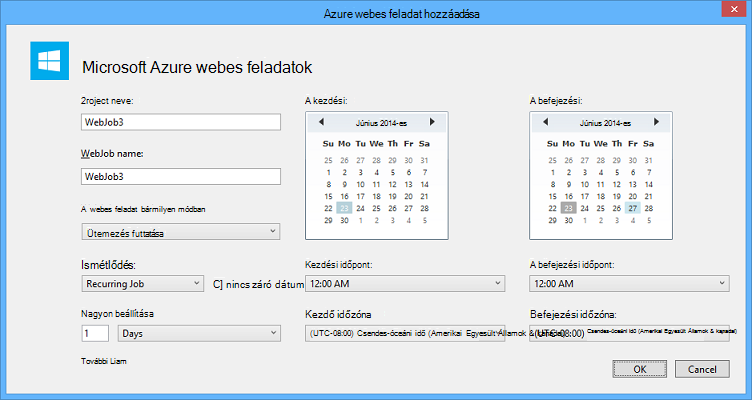

<properties 
    pageTitle="Visual Studio segítségével WebJobs terjesztése" 
    description="Megtudhatja, hogy miként Azure WebJobs üzembe Azure alkalmazás szolgáltatás Web Apps alkalmazások használata a Visual Studio." 
    services="app-service" 
    documentationCenter="" 
    authors="tdykstra" 
    manager="wpickett" 
    editor="jimbe"/>

<tags 
    ms.service="app-service" 
    ms.devlang="dotnet" 
    ms.topic="article" 
    ms.tgt_pltfrm="na" 
    ms.workload="na" 
    ms.date="04/27/2016" 
    ms.author="tdykstra"/>

# Visual Studio segítségével WebJobs terjesztése

## – Áttekintés

Ez a témakör ismerteti a telepítéshez használni a New project [Alkalmazás szolgáltatás](http://go.microsoft.com/fwlink/?LinkId=529714) , az [Azure WebJob](http://go.microsoft.com/fwlink/?LinkId=390226)webalkalmazást használja a Visual Studio. Információt arról, hogy miként WebJobs telepítse az [Azure Portal](https://portal.azure.com)segítségével című témakörben talál [WebJobs futtatása a háttérben feladatot](web-sites-create-web-jobs.md).

Amikor a Visual Studio WebJobs engedélyező New projekt üzembe helyezése, két feladatot hajt végre:

* Futási idejű fájlokat másol a megfelelő mappát a web App alkalmazásban (*App_Data/feladatok/folyamatos* a folyamatos WebJobs, *feladatok, App_Data/indított* az ütemezett és igény szerinti WebJobs).
* [Azure ütemező feladatok](#scheduler) beállítja az, hogy mikorra van ütemezve adott időpontban WebJobs. (Ez nem szükséges folyamatos WebJobs.)

Az alábbi elemek hozzáadott WebJobs engedélyező projekt foglalja magában:

* A [Microsoft.Web.WebJobs.Publish](http://www.nuget.org/packages/Microsoft.Web.WebJobs.Publish/) NuGet csomagot.
* Telepítési és az ütemezési beállítások tartalmazó [webjob közzététele settings.json](#publishsettings) fájlt. 

Ezek az elemek hozzáadása konzol alkalmazás meglévő projektből, vagy WebJobs engedélyező konzol alkalmazás új projekt létrehozása sablon segítségével. 

Projekt üzembe egy WebJob, saját maga által, vagy hivatkozás egy webes projekt, hogy automatikusan azt üzembe helyezése, amikor a webes projekt rendszerbe. Projektek csatolásához Visual Studio webes projekt [webjobs-list.json](#webjobslist) fájlban a WebJobs engedélyező projekt nevét tartalmazza.

## Előfeltételek

WebJobs telepítési funkciók érhetők el a Visual Studio 2015 az Azure SDK telepítésekor a .NET rendszerhez:

* [Azure SDK a .NET rendszerhez (Visual Studio 2015)](http://go.microsoft.com/fwlink/?linkid=518003).

## New projekt WebJobs telepítésének engedélyezése

Két lehetőség közül választhat:

* [Az automatikus környezet, amelyben egy webes projekt engedélyezése](#convertlink).

    Állítsa be a New projekt, hogy azt automatikusan üzembe helyezése a WebJob, amikor rendszerbe állítják webes projektet. Ezt a beállítást használja, ha azt szeretné, hogy a azonos web App alkalmazásban, a kapcsolódó webalkalmazás futtassa a WebJob futtatásához.

* A [projekteket nem tartalmazó web telepítésének engedélyezése](#convertnolink).

    Állítsa be a New meglévő projektből, mint egy WebJob üzembe önmagában, nem webes projektté a hivatkozást. Ezt a beállítást használja, amikor futtatni szeretné egy WebJob a webalkalmazást önmagában, nem webes fut a web app alkalmazással. Érdemes lehet ehhez annak érdekében, hogy az WebJob erőforrások, függetlenül a webalkalmazás-erőforrások méretezni.

### Az automatikus WebJobs környezet, amelyben egy webes projekt engedélyezése
  
1. Kattintson a jobb gombbal a web **Solution Explorer**projekt, és kattintson a **Hozzáadás** > **Azure WebJob meglévő projekthez**.

    
    
    Az [Azure WebJob hozzáadása](#configure) párbeszédpanel jelenik meg.

1. A **Projekt neve** legördülő listában jelölje ki a New project, amelyet egy WebJob kíván hozzáadni.

    

2. Töltse ki az [Azure WebJob hozzáadása](#configure) párbeszédpanelen, és kattintson **az OK**gombra. 

### Web-projekteket nem tartalmazó WebJobs telepítési engedélyezése
  
1. Kattintson a jobb gombbal a New project **Megoldás**Intézőben, és kattintson a **Közzététel Azure WebJob**. 

    
    
    Az [Azure WebJob hozzáadása](#configure) párbeszédpanel jelenik meg, a Project a **Projekt neve** mezőben kijelölt.

2.  Az [Azure WebJob hozzáadása](#configure) párbeszédpanelen végezze el, és kattintson **az OK**gombra.

    Megjelenik a **Webhely közzététele** varázsló.  Ha nem szeretne közzétenni közvetlenül, zárja be a varázslót. A beállításokat, hogy beírta a menti, ha meg szeretné, hogy [a projekt telepítése](#deploy).

## WebJobs engedélyező új projekt létrehozása

WebJobs engedélyező új projekt létrehozása, használja a New project-sablon, és WebJobs telepítésének engedélyezése a [az előző szakaszban](#convert)leírtak szerint. Alternatív megoldásként a WebJobs új project-sablon használható:

* [Egy független WebJob a WebJobs új project-sablon használata](#createnolink)

    Projekt létrehozása, és konfigurálja úgy, hogy egy WebJob nem webes projektté a hivatkozást, saját maga által telepítése. Ezt a beállítást használja, amikor futtatni szeretné egy WebJob a webalkalmazást önmagában, nem webes fut a web app alkalmazással. Érdemes lehet ehhez annak érdekében, hogy az WebJob erőforrások, függetlenül a webalkalmazás-erőforrások méretezni.

* [A webes projekthez kapcsolódó WebJob a WebJobs új project-sablon használata](#createlink)

    Hozzon létre egy projekt van konfigurálva, hogy automatikusan egy WebJob üzembe, ha telepítve van a webes projekt ugyanabban a megoldásban. Ezt a beállítást használja, ha azt szeretné, hogy a azonos web App alkalmazásban, a kapcsolódó webalkalmazás futtassa a WebJob futtatásához.

> [AZURE.NOTE] A WebJobs új project-sablon automatikusan telepíti NuGet csomagok és *Program.cs* a [WebJobs SDK](http://www.asp.net/aspnet/overview/developing-apps-with-windows-azure/getting-started-with-windows-azure-webjobs)-kód szerepel. Ha nem szeretné használni a WebJobs SDK csomagjában talál, vagy nem szeretné használni egy ütemezett, hanem folyamatos WebJob, távolítsa el vagy módosítsa a `host.RunAndBlock` utasítást a *Program.cs*.

### Egy független WebJob a WebJobs új project-sablon használata
  
1. Kattintson a **fájl** > **Új projektet**, és az **Új projekt** párbeszédpanelen kattintson a **felhőben** > **Microsoft Azure WebJob**.

    
    
2. Kövesse, [hogy a New-független WebJobs projektet a project](#convertnolink)korábbi látható.

### A webes projekthez kapcsolódó WebJob a WebJobs új project-sablon használata

1. Kattintson a jobb gombbal a web **Solution Explorer**projekt, és kattintson a **Hozzáadás** > **Új Azure WebJob projekt**.

    

    Az [Azure WebJob hozzáadása](#configure) párbeszédpanel jelenik meg.

2. Az [Azure WebJob hozzáadása](#configure) párbeszédpanelen végezze el, és kattintson **az OK**gombra.

## Az Azure WebJob hozzáadása párbeszédpanel

Az **Azure WebJob hozzáadása** párbeszédpanel lehetővé teszi, hogy meg kell adnia a WebJob nevét és az ütemezés a WebJob beállításait. 

Ez a párbeszédpanel a mezőket az Azure Portal párbeszédpanele **Új feladat** mezői felelnek meg. További tudnivalókért lásd: [WebJobs futtatása a háttérben feladatot](web-sites-create-web-jobs.md).

Egy ütemezett WebJob (nem a folyamatos WebJobs) a Visual Studio hoz létre az [Azure ütemező](/services/scheduler/) feladat gyűjteményt Ha egy még nem létezik, és létrehoz egy feladatot a gyűjteményben:

* Az ütemező feladat webhelycsoport neve *WebJobs-{regionname}* hol *{regionname}* utal, amelyet a régió a webes alkalmazás a üzemelteti. Példa: WebJobs-WestUS.
* Az ütemezési feladat nevű *{webappname}-{webjobname}*. Példa: SajátWebalk-MyWebJob. 
 
>[AZURE.NOTE]
> 
>* Parancssori telepítési információkért [parancssori engedélyezése és a folyamatos kézbesítési az Azure WebJobs](/blog/2014/08/18/enabling-command-line-or-continuous-delivery-of-azure-webjobs/)című cikkben talál.
>* Ha egy **Ismétlődő feladatot** konfigurálása és ismétlődési gyakoriságát meg néhány perccel, Azure ütemező nem lesz szabad. Szabadon más gyakoriságok (óra, nap, és így tovább).
>* Ha egy WebJob telepítése, és ezután dönt, hogy milyen WebJob és újratelepítés módosítása, kell webjobs közzététele settings.json törölni. Visual Studio jelenjen meg a közzétételi beállításokat, így, hogy módosíthassa WebJob típusú lesz.
>* Ha egy WebJob telepítése, és később átállítása a futási módja folyamatos nem folytonos vagy fordítva, Visual Studio létrehoz egy új WebJob Azure meg újratelepítése esetén. Ha egyéb ütemezési beállításainak módosítása, de ugyanúgy futási módja vagy, illetve váltás ütemezett és igény szerinti, a Visual Studio frissíti a már meglévő feladatot, hanem hozzon létre egy újat.

## webjob közzététele settings.json

A New WebJobs telepítéshez konfigurálásakor Visual Studio telepíti a [Microsoft.Web.WebJobs.Publish](http://www.nuget.org/packages/Microsoft.Web.WebJobs.Publish/) NuGet csomagot, és a projekt *tulajdonságainak* mappa a WebJobs projekt *webjob közzététele settings.json* fájlban ütemezési információk tárolja. Íme egy példa, hogy a fájl:

        {
          "$schema": "http://schemastore.org/schemas/json/webjob-publish-settings.json",
          "webJobName": "WebJob1",
          "startTime": "2014-06-23T00:00:00-08:00",
          "endTime": "2014-06-27T00:00:00-08:00",
          "jobRecurrenceFrequency": "Minute",
          "interval": 5,
          "runMode": "Scheduled"
        }

Közvetlenül szerkesztheti a fájlt, és a Visual Studio biztosít az IntelliSense. A fájl séma [http://schemastore.org](http://schemastore.org/schemas/json/webjob-publish-settings.json) van tárolva, és ott megtekintheti.  

>[AZURE.NOTE]
>
>* Ha egy **Ismétlődő feladatot** konfigurálása és ismétlődési gyakoriságát meg néhány perccel, Azure ütemező nem lesz szabad. Szabadon más gyakoriságok (óra, nap, és így tovább).

## webjobs-list.json

WebJobs engedélyező projekt csatolása egy webes projekt, a Visual Studio a project web *Tulajdonságok* mappában lévő *webjobs-list.json* fájl a WebJobs projektjére tárol. A lista több WebJobs projekteket is tartalmazhat, az alábbi példában látható módon:

        {
          "$schema": "http://schemastore.org/schemas/json/webjobs-list.json",
          "WebJobs": [
            {
              "filePath": "../ConsoleApplication1/ConsoleApplication1.csproj"
            },
            {
              "filePath": "../WebJob1/WebJob1.csproj"
            }
          ]
        }

Közvetlenül szerkesztheti a fájlt, és a Visual Studio biztosít az IntelliSense. A fájl séma [http://schemastore.org](http://schemastore.org/schemas/json/webjobs-list.json) van tárolva, és ott megtekintheti.
  
## Projekt WebJobs terjesztése

Webes projekt kapcsolt WebJobs projekt automatikusan üzembe helyezése a webes projekthez. Információ a project web telepítésről megtudhatja, [hogy miként Web Apps alkalmazások terjesztése](web-sites-deploy.md).

Saját maga által WebJobs projekt telepítéséhez kattintson a jobb gombbal a projekt a **Megoldást Intézőben**, majd kattintson a **Közzététel Azure WebJob**. 

    
Az egy független WebJob a azonos **Közzététele** varázsló, amellyel webes projektek jelenik meg, de kevesebb beállítások érhetők el, ha módosítani szeretné.

## Következő lépések

Ez a cikk a Visual Studio segítségével WebJobs telepítéséről van magyarázata. Azure WebJobs telepítéséről további tudnivalókért lásd: [Azure WebJobs - erőforrások ajánlott - telepítés](http://www.asp.net/aspnet/overview/developing-apps-with-windows-azure/azure-webjobs-recommended-resources#deploying).
