<properties
    pageTitle="Azure alkalmazás szolgáltatás hozzon létre egy .NET WebJob |} Microsoft Azure"
    description="ASP.NET MVC és Azure használatával több szálon alkalmazás létrehozása. Az első befejezési futnak Azure App szolgáltatásban webalkalmazást, és a kódmentes fut a WebJob. Az alkalmazás entitás keretrendszer, SQL-adatbázishoz, és Azure tároló sorban várakozó és BLOB használja."
    services="app-service"
    documentationCenter=".net"
    authors="tdykstra"
    manager="wpickett"
    editor="mollybos"/>

<tags
    ms.service="app-service"
    ms.workload="na"
    ms.tgt_pltfrm="na"
    ms.devlang="na"
    ms.topic="article"
    ms.date="10/28/2016"
    ms.author="tdykstra"/>

# Azure alkalmazás szolgáltatás hozzon létre egy .NET WebJob

Ebből az oktatóanyagból megtudhatja, hogy miként kódírás a [WebJobs SDK](websites-dotnet-webjobs-sdk.md)használó egyszerű több szálon ASP.NET MVC 5 alkalmazáshoz.

A [WebJobs SDK](websites-webjobs-resources.md) célja, a kód írhat a gyakori feladatok, hogy egy WebJob is végezhet, például kép feldolgozás, várólista feldolgozása, RSS összesítési, fájl karbantartási és e-mailek küldése egyszerűsítése érdekében. A WebJobs SDK csomagjában talál Azure-tárhely és a szolgáltatás Bus kezelése, a feladatok ütemezése és kezelése a hibák és sok más tipikus esetei beépített funkciókat tartalmaz. Ezeken kívül kell bővíthető célja, és egy [Nyissa meg a bővítmények forrás tárháza](https://github.com/Azure/azure-webjobs-sdk-extensions/wiki/Binding-Extensions-Overview).

A minta alkalmazása egy reklámot fórum. Felhasználók is feltölthet a hirdetések képeket, és egy kódmentes folyamat konvertálja a képeket a miniatűrök. Az Active Directory lista lapon látható a miniatűrök, és az Active Directory részletei lapon látható a teljes méret képet. Képernyőkép a következő:

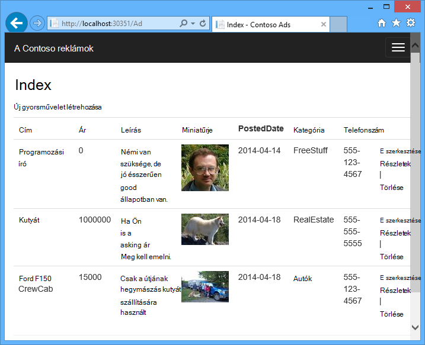

Minta alkalmazás működik-e a [Azure sorban várakozó](http://www.asp.net/aspnet/overview/developing-apps-with-windows-azure/building-real-world-cloud-apps-with-windows-azure/queue-centric-work-pattern) és [Azure BLOB](http://www.asp.net/aspnet/overview/developing-apps-with-windows-azure/building-real-world-cloud-apps-with-windows-azure/unstructured-blob-storage). Az oktatóprogram megtudhatja, hogy miként [Azure alkalmazás szolgáltatás](http://go.microsoft.com/fwlink/?LinkId=529714) és [Azure SQL-adatbázissal](http://msdn.microsoft.com/library/azure/ee336279)az alkalmazás telepítéséhez.

## Előfeltételek

Az oktatóprogram tartalma feltételezi, hogy miként dolgozhat az [ASP.NET MVC 5](http://www.asp.net/mvc/tutorials/mvc-5/introduction/getting-started) projektek Visual Studio.

Az oktatóprogram a Visual Studio 2013-hoz készült. Ha még nincs Visual Studio, azt meg automatikusan települ a .NET rendszerhez az Azure SDK telepítésekor.

Az oktatóprogram kínál a Visual Studio 2015, de az alkalmazás futtatása előtt helyileg módosítania kell a `Data Source` az SQL Server LocalDB kapcsolati karakterláncot az Web.config és App.config fájlokat a része `Data Source=(localdb)\v11.0` való `Data Source=(LocalDb)\MSSQLLocalDB`. 

> [AZURE.NOTE] Az oktatóprogram elvégzéséhez Azure-fiók van szüksége:
  >
  > + [Nyissa meg az ingyenes Azure-fiók](https://azure.microsoft.com/pricing/free-trial/?WT.mc_id=A261C142F)van lehetősége: jóváírások kap próbálja ki az fizetett Azure szolgáltatások is használhatja, és a megszokott ezek után akár tarthatja a fiók, és használata ingyenes Azure szolgáltatások, például webhelyek. A hitelkártya soha nem megterheljük, kivéve, ha kifejezetten az beállítások módosítása és kérdezzen rá kell fizetnie.
  >
  > + [MSDN előfizetői előnyeinek aktiválása](https://azure.microsoft.com/pricing/member-offers/msdn-benefits-details/?WT.mc_id=A261C142F)közül választhat: az MSDN-előfizetés lépve jóváírások havonta fizetett Azure szolgáltatások használható.
  >
  >Ha azt szeretné, mielőtt feliratkozna az Azure-fiók kezdéshez Azure alkalmazás szolgáltatással, nyissa meg a [Próbálja alkalmazás szolgáltatás](http://go.microsoft.com/fwlink/?LinkId=523751), ahol azonnal létrehozhat egy rövid életű starter web app alkalmazás szolgáltatásban. Nem kötelező, hitelkártyák Nincs nyilatkozatát.

## A tananyag Dióhéjban

Az oktatóprogram szemlélteti, hogyan lehet hajtsa végre az alábbi műveleteket:

* A gép Azure fejlesztési engedélyezése az Azure SDK telepítésével.
* Konzol alkalmazás, amely automatikusan üzembe helyezése az Azure WebJob, amikor rendszerbe állítják a társított webes projektet projektet létrehozni.
* Tesztelje a WebJobs SDK kódmentes fejlesztési számítógépen helyben.
* Az alkalmazások WebJobs-fájlok közzététele egy web app alkalmazás szolgáltatásban.
* Fájlok feltöltése és az Azure Blob-szolgáltatás tárolja őket.
* Használata az Azure WebJobs SDK Azure tároló sorban várakozó és BLOB.

## Alkalmazás-architektúra

A minta alkalmazás használja a [várólista kötődnek munka mintát](http://www.asp.net/aspnet/overview/developing-apps-with-windows-azure/building-real-world-cloud-apps-with-windows-azure/queue-centric-work-pattern) arra a miniatűrök kódmentes folyamat létrehozása Processzor-igényes munkájának célra.

Az alkalmazás hirdetések tárolja az SQL-adatbázisban, a táblázatok létrehozása, és az adatok eléréséhez entitás keretrendszer kód első használatával. Minden egyes ad, az adatbázis tárol két URL-címek: egy, a teljes méretű kép és a miniatűrjére.

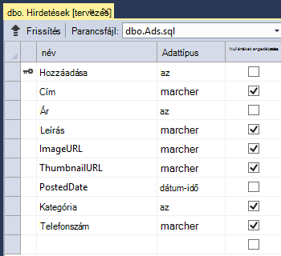

Ha a felhasználó feltölt egy képet, a web app képeket tárolja az [Azure blob](http://www.asp.net/aspnet/overview/developing-apps-with-windows-azure/building-real-world-cloud-apps-with-windows-azure/unstructured-blob-storage)-, és az Active Directory-adatokat tárol az adatbázis egy URL-címet, amely a blob mutat. Egy időben egy üzenet az Azure sorba ír. Az Azure WebJob futtatott kódmentes folyamatban a WebJobs SDK lekérdezi a várakozási sorban található az új üzenetek. Egy új üzenet jelenik meg, amikor a WebJob létrehoz egy miniatűrre az adott képhez, és frissíti a Miniatűr URL-cím database mező az adott ad. Az alábbiakban a diagram, amely bemutatja, hogyan kezeljék a az alkalmazás részei:

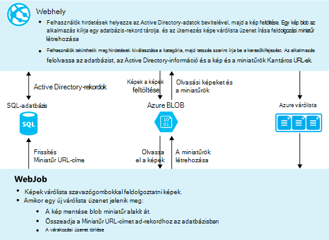

[AZURE.INCLUDE [install-sdk](../../includes/install-sdk-2015-2013.md)]

Az oktatóprogram útmutatást a .NET rendszerhez 2.7.1 alkalmazása Azure SDK vagy újabb verziójában.

## Azure tároló fiók létrehozása

Azure tároló fiók erőforrások biztosít várólista és blob-adatokat tároljon a felhőben. Azt is használják a WebJobs SDK csomagjában talál az irányítópult naplózási adatait tárolja.

A valós életből alkalmazásban a szokásos fiókokat hoz létre külön alkalmazás adatok és a naplózás adatokat, és külön tesztadatokat gyártás adatok és a partnerek. Ebben az oktatóprogramban az egyetlen fiókkal kell használni.

1. Nyissa meg a **Kiszolgáló** Intézőt Visual Studio.

2. Kattintson a jobb gombbal az **Azure** csomópontot, és kattintson a **Csatlakozás Microsoft Azure**.
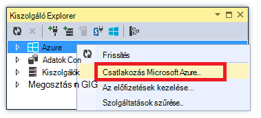

3. Jelentkezzen be a Azure hitelesítő adataival.

5. Kattintson a jobb gombbal **tárolás** területen az Azure csomópontot, és kattintson a **Tárterület-fiók létrehozása**gombra.
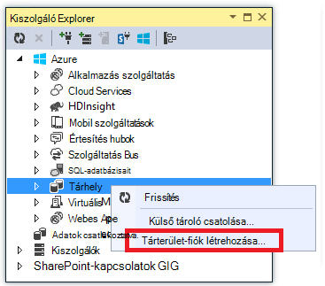

3. **Tárterület-fiók létrehozása** párbeszédpanelen adja meg a tárterület-fiókja nevét.

    A kell lennie egyedinek kell lennie a (nincs más Azure tároló fiók is lehet ugyanaz a neve). Ha a megadott már használatban van, megváltoztathatja azt kipróbálhat.

    A tárhely fiók eléréséhez az URL-cím lesz *{nevű}*. core.windows.net.

5. Állítsa a **régió vagy affinitás csoport** legördülő listában a régió legközelebb.

    Ezzel a beállítással megadhatja, hogy melyik Azure adatközponthoz fog tárolni a tárterület-fiókját. A választási lehetőségek ebben az oktatóanyagban észrevehető különbség nem érdekében. Azonban egy gyártási webalkalmazás szeretné webkiszolgálón és el szeretné helyezni az ugyanabban a késés és az adatok kilépési díjak minimalizálásához régióban tároló fiókját. A web app (amely létre fogja hozni később) adatközponthoz kell lennie a lehető legközelebb a böngészők a web app elérése Késleltetés minimalizálása érdekében.

6. Állítsa a **replikáció** legördülő lista **helyileg felesleges**.

    Ha geo replikációs engedélyezve van a tárterület-fiókot, a tárolt tartalom engedélyezése erre a helyre abban az esetben, ha az elsődleges helye a fő katasztrófa áttérni egy másodlagos adatközponthoz van replikált. A replikáció GEO többletköltségek is járnak. Teszt és fejlesztési számlákhoz általában nem szeretne fizetni geo-replikáció. További tudnivalókért lásd: [jelentések létrehozása, kezelése, és a tárhely fiók törlése](../storage-create-storage-account/#replication-options).

5. Kattintson a **létrehozása**gombra.

    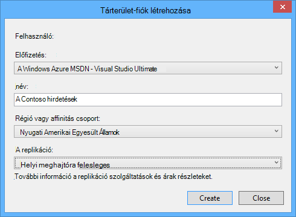

## Az alkalmazás letöltése

1. Töltse le és csomagolja ki a [megoldást befejeződött](http://code.msdn.microsoft.com/Simple-Azure-Website-with-b4391eeb).

2. Indítsa el a Visual Studio.

3. A **fájl** menüben válassza a **Nyissa meg a > Projekt/megoldás**, nyissa meg azt a megoldást letöltött tartalmazó, és nyissa meg a fájlt.

4. Nyomja le a CTRL + SHIFT + B össze a megoldást.

    Alapértelmezés szerint a Visual Studio automatikusan nem szerepel a *.zip* fájlban NuGet csomag tartalom visszaállítása. Ha a csomagok nem sikerül visszaállítani, telepítse őket kézzel **NuGet csomagok kezelése a megoldás** gombra, és kattintson a jobb felső sarokban **visszaállítása** gombra.

5. **Megoldás Explorer**győződjön meg arról, hogy **ContosoAdsWeb** van-e jelölve az indítási projekt.

## Az alkalmazás tárterület-fiók beállítása

1. Nyissa meg *a alkalmazás fájlt* a ContosoAdsWeb projekt.

    A fájl tartalmaz egy SQL-kapcsolati karakterláncot, és az Azure tároló kapcsolati karakterlánc BLOB és sorok kezelése.

    Az SQL-kapcsolati karakterláncot [Az SQL Server Express LocalDB](http://msdn.microsoft.com/library/hh510202.aspx) adatbázis mutat.

    A tároló kapcsolati karakterlánc képen, amelynek a tárhely nevét és az access fiókkulcs helyőrzőit. Ez a kapcsolati karakterlánc, amely tartalmazza a nevet és a kulcsot a tárterület-fiók fogja helyére.  

    <pre class="prettyprint">&lt;connectionStrings&gt;
   &lt;adja meg nevét = "ContosoAdsContext" connectionString = "adatforrás = (localdb) \v11.0; Kezdeti katalógus = ContosoAds; Biztonsági integrált = igaz; MultipleActiveResultSets eredménykészleteket = igaz; "providerName="System.Data.SqlClient "/&gt;
   &lt;adja meg nevét ="AzureWebJobsStorage"connectionString =" DefaultEndpointsProtocol = https; Fióknév =<mark>[fióknév]</mark>; AccountKey<mark>[accesskey]</mark>= "/&gt; 
    &lt;/connectionStrings      &gt;</pre>

    A tároló kapcsolati karakterlánc neve AzureWebJobsStorage mivel a név, a WebJobs SDK használja, amely alapértelmezés szerint. Ugyanaz a neve itt használatos, így csak egy kapcsolati karakterlánc érték megadása a Azure környezetben kell.

2. A **Kiszolgáló Intéző**kattintson a jobb gombbal a **tárhely** csomópontot a tárhely fiókját, és válassza a **Tulajdonságok parancsot**.

    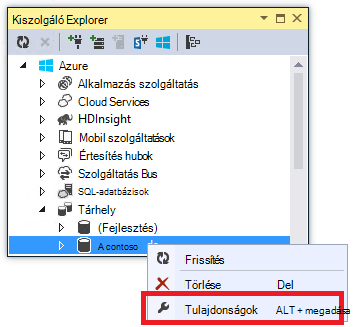

3. A **Tulajdonságok** párbeszédpanelen kattintson a **Tárolás fiók kulcsok**, és kattintson a három pontra.

    

4. Másolja a vágólapra a **kapcsolati karakterlánc**.

    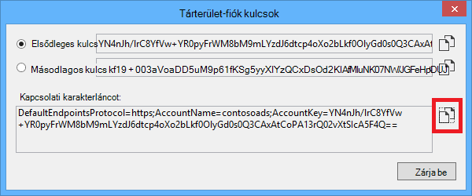

5. A tároló kapcsolati karakterláncot, *a fájlt* a cserélje le a kapcsolati karakterlánc-ből másolt ki. Győződjön meg arról, válassza a minden az idézőjelek között lévő a határokat nem beleértve előtt beillesztése az idézőjelek között.

6. Nyissa meg a *App.config* fájlt a ContosoAdsWebJob projekt.

    Ez a fájl két tároló kapcsolati karakterláncot, az alkalmazás adatok és naplózás az tartalmaz. Alkalmazás adatok és a naplózás külön tároló fiókokat is használhatja, és használhatja [az adatokat több tárterületet fiók](https://github.com/Azure/azure-webjobs-sdk/blob/master/test/Microsoft.Azure.WebJobs.Host.EndToEndTests/MultipleStorageAccountsEndToEndTests.cs). Az ebben az oktatóprogramban egy egyetlen tárolási fiók használni. A kapcsolati karakterláncot a tárterület-fiók kulcsok helyőrzők van. 
    <pre class="prettyprint">&lt;konfigurációs&gt; 
    &lt;connectionStrings&gt;
   &lt;adja meg nevét = "AzureWebJobsDashboard" connectionString = "DefaultEndpointsProtocol = https; Fióknév =<mark>[fióknév]</mark>; AccountKey<mark>[accesskey]</mark>= "/&gt;
   &lt;adja meg nevét ="AzureWebJobsStorage"connectionString =" DefaultEndpointsProtocol = https; Fióknév =<mark>[fióknév]</mark>; AccountKey<mark>[accesskey]</mark>= "/&gt;
   &lt;adja meg nevét ="ContosoAdsContext"connectionString =" adatforrás = (localdb) \v11.0; Kezdeti katalógus = ContosoAds; Biztonsági integrált = igaz; MultipleActiveResultSets eredménykészleteket = igaz; " /&gt; 
    &lt;/connectionStrings&gt;
   &lt;indítási&gt;
   &lt;supportedRuntime verzió = "4.0" termékváltozat = ". NETFramework, verzió = v4.5 "/&gt; 
    &lt;/startup&gt;
&lt;/Configuration                             &gt;</pre>

    Alapértelmezés szerint a WebJobs SDK AzureWebJobsStorage és AzureWebJobsDashboard nevű kapcsolati karakterláncot keres. Alternatív megoldásként is [áruházból a kapcsolati karakterlánc azonban szeretné, és adja át a explicit módon, hogy a `JobHost` objektum](websites-dotnet-webjobs-sdk-storage-queues-how-to.md#config).

7. Mindkét tároló kapcsolati karakterláncot cserélje le a kapcsolati karakterláncot az előbb másolt.

8. A módosítások mentéséhez.

## Az alkalmazás futtatásához helyi meghajtóra

1. Indítsa el a webes frontend az alkalmazás, nyomja le a CTRL + F5.

    Az alapértelmezett böngésző kezdőlapjára nyílik meg. (Webes projekt fut, mert az indítási project által elvégzett.)

    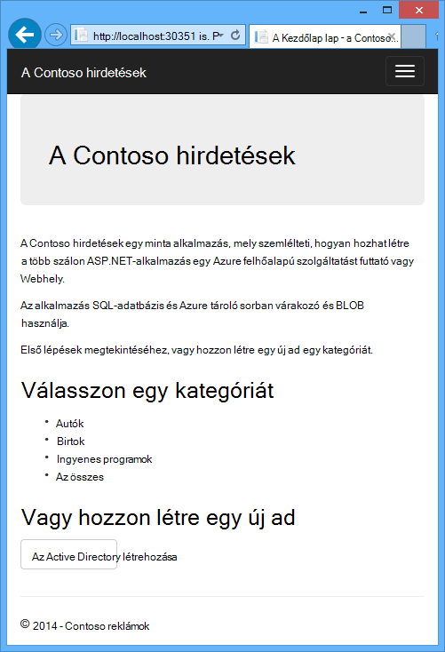

2. Az alkalmazás a WebJob kódmentes indításához kattintson a jobb gombbal a **Megoldást Explorer**ContosoAdsWebJob projekt, és kattintson a **hibakeresési** > **indítása új példányát**.

    Konzol alkalmazás ablak megnyílik, és a WebJobs SDK JobHost objektum futtatásához indítása jelző naplózás üzeneteket jeleníti meg.

    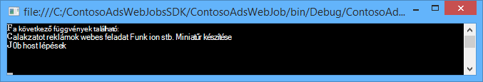

3. A böngészőben kattintson a **Létrehozás az Ad**.

4. Írja be a vizsgált adatokat, és jelöljön ki egy képet feltölteni, kattintson a **Létrehozás**gombra.

    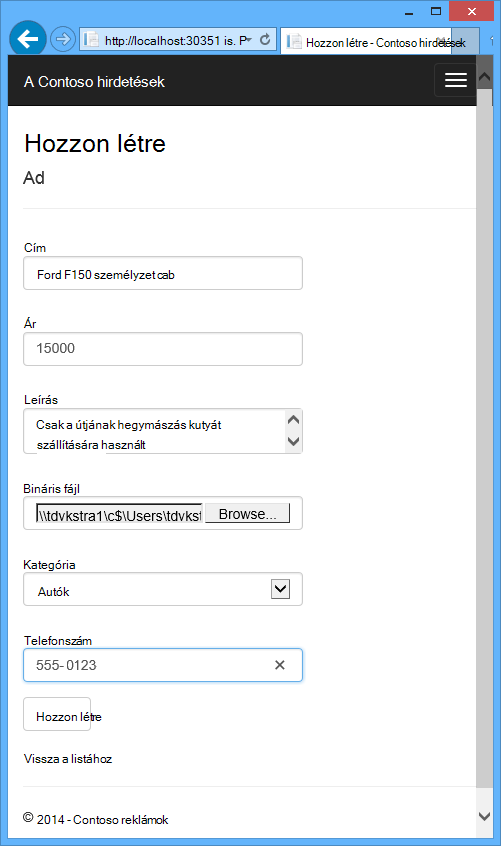

    Az alkalmazás a Tárgymutató lapra ugrik, de mert adott feldolgozás még nem történt meg nem jelenik egy miniatűrre az új ad a.

    Eközben a rövid várakozás után naplózás megjelenik egy üzenet az konzol alkalmazásablak, hogy várólista üzenet megérkezett, és feldolgozása megtörtént.

    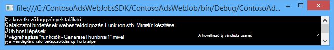

5. Ha megjelent a konzol alkalmazásablak naplózás üzenetét, frissítése az Index oldalra a miniatűr megtekintéséhez.

    

6. Kattintson a **Részletek** az Active Directory számára a teljes méretű kép megtekintéséhez.

    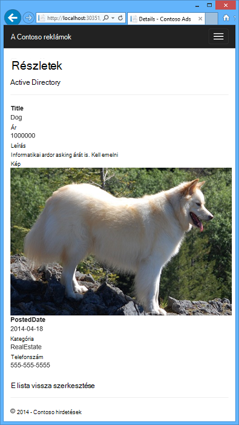

Korábban már futtatja az alkalmazás a helyi számítógépen, és a számítógépen, de a található adatbázis működik együtt sorban várakozó és BLOB az SQL Server használja a felhőben. A következő szakaszban futtatásával az alkalmazás a felhőben, felhőalapú adatbázis, valamint a felhőben BLOB és a sorok.  

## Futtassa az alkalmazást a felhőben

Fogja el az alkalmazás futtatásához a felhőben, az alábbi lépéseket:

* Web Apps alkalmazások terjesztése. Visual Studio automatikusan létrehoz egy új web app alkalmazás szolgáltatás, és egy SQL-adatbázis-példányt.
* A web app Azure SQL-adatbázis- és fiók konfigurálása.

Miután létrehozta a néhány hirdetések a felhőben futtatása közben, meg kell az WebJobs SDK irányítópult tekintheti meg nyújtotta előnyöket szolgáltatások figyelése a rich.

### Web Apps alkalmazások terjesztése

1. Zárja be a böngésző és az konzol alkalmazásablak.

2. A **Megoldás Explorer**kattintson a jobb gombbal a ContosoAdsWeb projekt, és ezután kattintson a **Közzététel**gombra.

3. Kattintson a **Közzététel** varázsló **profil** lépésében a **Microsoft Azure web Apps alkalmazások**.

    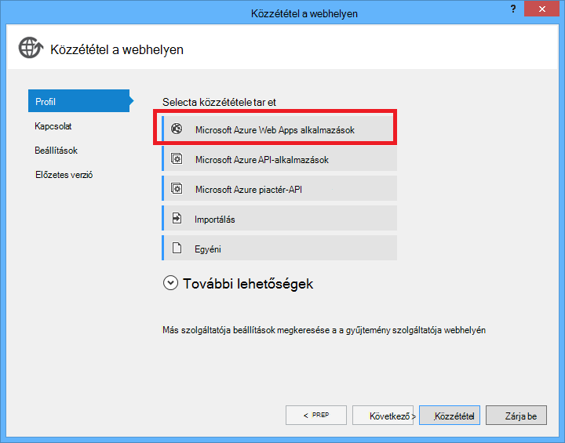

4. Jelentkezzen be az Azure Ha még nem jelentkezett be.

5. Kattintson az **Új**gombra.

    A párbeszédpanel megjelenése némileg eltérő attól függően, hogy az Azure SDK a .NET rendszerhez melyik verziója van telepítve lehet.

    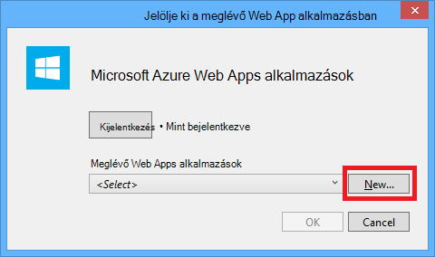

6. A **Létrehozás web App alkalmazásban, a Microsoft Azure** párbeszédpanelen írja be egy egyedi nevet a **webes alkalmazás neve** mezőben.

    A teljes URL-CÍMÉT a Mi az itt megadott állnak, valamint. azurewebsites.net (mint a **webes alkalmazás neve** szövegmező mellett látható). Például a webes alkalmazás neve ContosoAds, az URL-cím ContosoAds.azurewebsites.net lesz.

7. Az [alkalmazás szolgáltatáscsomagja](../app-service/azure-web-sites-web-hosting-plans-in-depth-overview.md) legördülő listában válassza az **Új alkalmazás szolgáltatás terv létrehozása**. Adja meg az App szolgáltatáscsomagja, például ContosoAdsPlan nevét.

8. Az [erőforráscsoport](../azure-resource-manager/resource-group-overview.md) legördülő listában válassza az **Új csoport létrehozása a erőforrás**.

9. Írja be az erőforráscsoport, például ContosoAdsGroup nevét.

10. A **régió** legördülő listában válassza az ugyanabban a tárterület-fiókjának választotta régióban.

    Ezzel a beállítással megadhatja, melyik Azure adatközponthoz a web app fog futni. A web app és a tárhely fiók megőrzési az azonos adatközponthoz kis méretűre állítása késés és az adatok kilépési díjak.

11. Az **adatbázis-kiszolgáló** legördülő listában válassza az **Új kiszolgáló létrehozása**.

12. Adja meg az adatbázis-kiszolgáló, például contosoadsserver + egy számot vagy a neve, hogy a kiszolgálónév egyedi nevét. 

    A kiszolgáló nevének egyedinek kell lennie. Kisbetűk betűket, számjeggyel és kötőjelet tartalmazhat. A példamunkafüzetben a követő kötőjelet nem tartalmazhat. 

    Azt is megteheti Ha az előfizetés már van egy kiszolgálón, kijelölhet kiszolgálót használó a legördülő listából.

12. Írja be egy rendszergazdai **adatbázis felhasználónév** és a **adatbázis jelszavát**.

    Ha **Új SQL-adatbázis azon kiszolgálóját** , nem ír be egy meglévő nevét és jelszavát az alábbi lehetőséget választotta, beviszi egy új nevet és az adatbázis megnyitásakor későbbi felhasználás céljából most szövegdobozokhoz jelszót. Ha egy kiszolgáló, amely a korábban létrehozott lehetőséget választotta, kérni fogja a már létrehozott rendszergazdai fiók jelszava.

13. Kattintson a **létrehozása**gombra.

    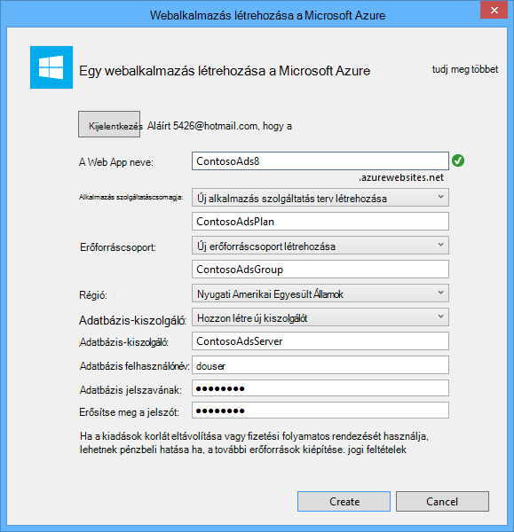

    Visual Studio hoz létre, a megoldást, a webes projektet, a web app Azure-ban és az Azure SQL-adatbázis-példányt.

14. A **Webhely közzététele** varázslót **kapcsolat** lépésében kattintson a **Tovább**gombra.

    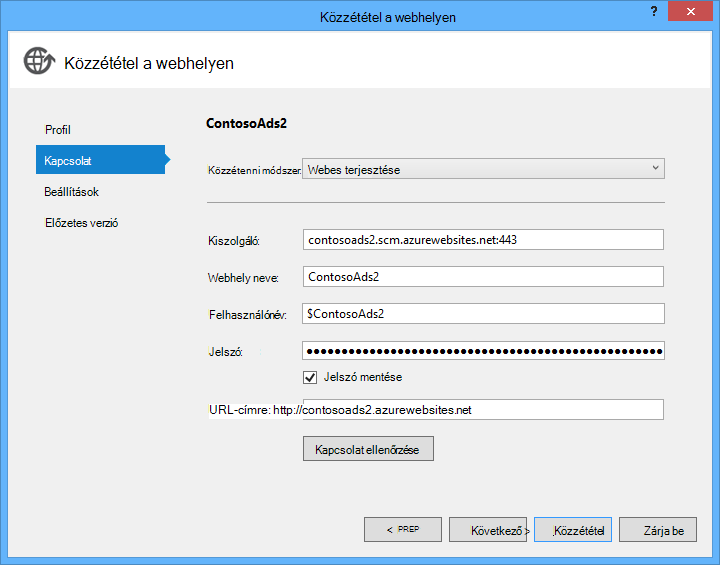

15. A **Beállítások** lépésben törölje a jelet **a kapcsolati karakterlánc futásidőben használata** jelölőnégyzetből, és kattintson a **Tovább gombra**.

    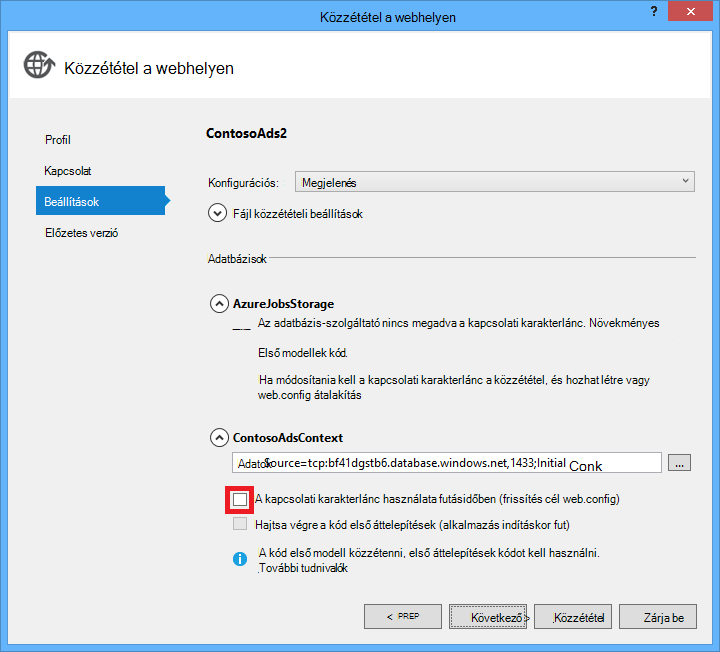

    Nem kell beállítani az SQL-kapcsolati karakterláncot, mert a fogja beállíthatja, hogy az érték az Azure környezetben később a közzététel párbeszédpanel használatával.

    Ezen a lapon a figyelmeztetés figyelmen kívül hagyható.

    * A szokásos módon a tárterület-fiók használhatja, ha eltér használhatja, ha helyileg futó operációs rendszert futtató Azure-ban lenne, de ebben az oktatóanyagban az ugyanazon a egy, a két környezetben használ. A AzureWebJobsStorage kapcsolati karakterlánc így nem kell átalakítandó. Akkor is, ha a művelet szeretne a felhőben különböző tárterület-fiókot használ, akkor nem kell a kapcsolati karakterlánc átalakítása, mert az alkalmazást az Azure környezetben beállítást használja, az Azure végrehajtásakor. Az oktatóprogram belül megjelenik.

    * Ebben az oktatóanyagban, nem kell a változtatásokat az adatmodellbe, a ContosoAdsContext adatbázis használható lesz a ezért nincs szükség entitás keretrendszer kód első áttelepítések telepítéshez használni szeretne. Kód először automatikusan létrehoz egy új adatbázist az első idő SQL-adatok eléréséhez próbálja meg az alkalmazást.

    Az ebben az oktatóanyagban rendben a beállításokat a **Közzététel beállítások** alapértelmezett értékeit.

16. Az **Előnézet** lépésben kattintson az **Előnézet indítása**gombra.

    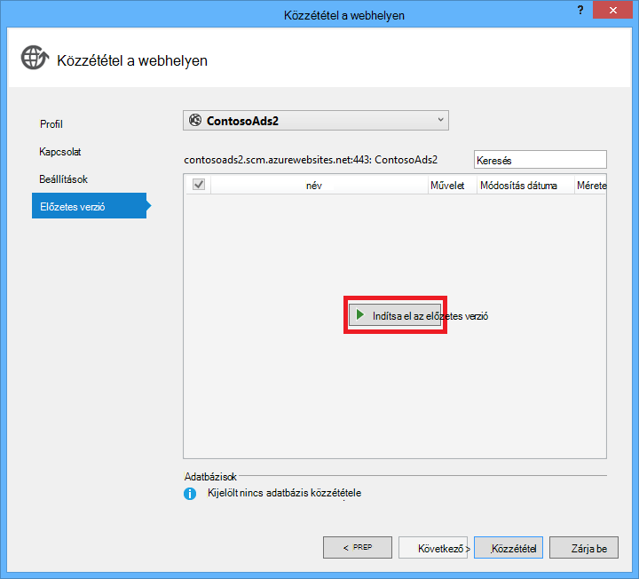

    A nincs közzétéve adatbázisokkal kapcsolatos figyelmeztetés figyelmen kívül hagyható. Személy keretrendszer kód első hoz létre az adatbázisban. nem, nem kell közzétenni.

    Az előnézeti ablakban látható, hogy bináris és konfigurációs fájlok WebJob projektből fog átmásolni a web app *app_data\jobs\continuous* mappájába.

    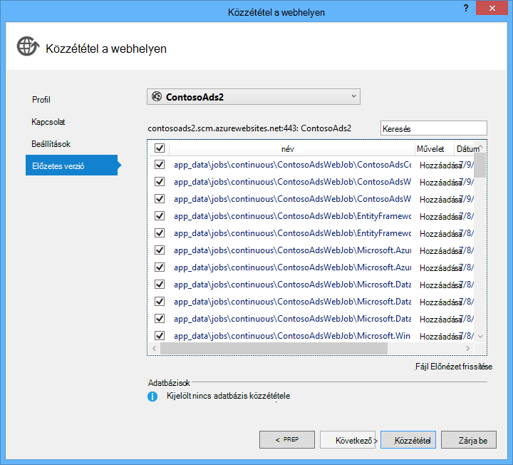

17. Kattintson a **Közzététel**gombra.

    Visual Studio üzembe helyezése a az alkalmazást, és a Kezdőlap lap URL-cím megnyílik a böngészőben.

    Nem használhatja a web App alkalmazásban, amíg nem állít be a csatlakozási_karakterlánc a következő szakaszban az Azure környezetben. Hibalap vagy a kezdőlapra, attól függően, hogy a web app és az adatbázis létrehozása beállítások korábbi kiválasztott megjelenik.

### A web app Azure SQL-adatbázis- és fiók konfigurálása.

Biztonsági okokból [bizalmas információkat, például a forrás kód tárházakban található tárolt fájlok kapcsolat karakterláncok elhelyez elkerülése](http://www.asp.net/aspnet/overview/developing-apps-with-windows-azure/building-real-world-cloud-apps-with-windows-azure/source-control#secrets)érdekében célszerű. Azure megoldást megtennie: beállíthatja, hogy csatlakozási karakterlánc és egyéb beállítást az Azure környezetben, és ASP.NET konfigurációs API-khoz automatikusan felveszi ezeket az értékeket az alkalmazás futtatásakor Azure-ban. Beállíthatja, hogy ezeket az értékeket az Azure **Server Explorer**, az Azure-portálra, a Windows PowerShell vagy platformok parancssort használatával. További tudnivalókért lásd: [hogyan alkalmazás karakterláncok és a kapcsolati karakterláncot munka](/blog/2013/07/17/windows-azure-web-sites-how-application-strings-and-connection-strings-work/).

Ebben a részben, Intézővel **Server** Azure-ban karakterláncértéket kapcsolat beállítása.

7. A **Kiszolgáló Explorer**, kattintson a jobb gombbal a web App alkalmazásban a **Azure > alkalmazás szolgáltatás > {az erőforráscsoport}**, és kattintson a **Nézet beállításai**.

    Az **Azure Web App** ablak megnyílik a **beállítás** lapon.

9. Módosítsa a DefaultConnection csatlakozási karakterlánc nevét ContosoAdsContext.

    Azure, automatikusan megjelenik a kapcsolati karakterlánc a web app-társított adatbázis-kezelő létrehozott, így a már rendelkezik a megfelelő kapcsolati karakterláncot. A kód megjeleníti a módosítani kívánt csak a nevét.

9. Vegye fel két új kapcsolat-karakterlánc található, AzureWebJobsStorage és AzureWebJobsDashboard nevű. Egyéni típusának beállítása, és állítsa a kapcsolat karakterláncérték ugyanazt az értéket, amelyet korábban használt a *Web.config* és *App.config* fájlokat. (Győződjön meg arról, hogy a teljes kapcsolati karakterláncot, nem csak a hívóbetű tartalmazza, és nem az idézőjelekkel együtt.)

    Ezek a csatlakozási_karakterlánc használják a WebJobs SDK egy alkalmazás adatok és naplózás. Korábbi látta, mint az adott alkalmazás adatokhoz is használják a webes előtér-kódot.

9. Kattintson a **Mentés**gombra.

    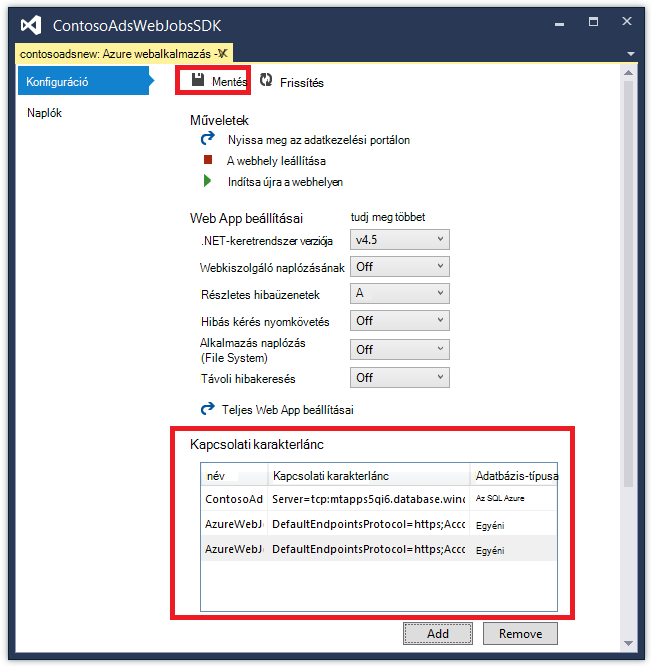

10. A **Kiszolgáló Explorer**kattintson a jobb gombbal a web app, és kattintson a **Leállítás**gombra.

12. Leáll a web App alkalmazásban, kattintson ismét a jobb gombbal a web app, és kattintson a **Start**gombra.

    A WebJob automatikusan elindul, amikor teszi közzé, de az megáll, hogy a beállítások megváltoztatását. Indítsa újra a indítsa újra a web app, vagy indítsa újra a WebJob az [Azure-portálon](http://go.microsoft.com/fwlink/?LinkId=529715). A konfiguráció módosítása után indítsa újra a a web app általában ajánlott.

9. Frissítse a böngészőablakot, amelynek a web app URL-CÍMÉT a címsorba.

    A Kezdőlap lap jelenik meg.

10. Hozzon létre az Active Directory, mint az alkalmazás helyileg futtatásakor.

    A Tárgymutató lapon látható a anélkül, hogy először egy miniatűrre.

11. Frissítse a lapot, néhány másodperc után, és megjelenik a miniatűr.

    Ha a miniatűr nem jelenik meg, előfordulhat, várjon egy perc vagy ezt a WebJob újraindítani a. Ha után egy ideig a még nem látható a miniatűrjére, amikor frissíti a lapot, előfordulhat, hogy a WebJob nem automatikusan elindítani. Ebben az esetben lépjen a webalkalmazás [Klasszikus portal](https://manage.windowsazure.com) lapon a WebJobs lapra, és kattintson a **Start**gombra.

### A WebJobs SDK irányítópult megtekintése

1. A [Klasszikus portálon](https://manage.windowsazure.com)válassza a web App alkalmazásban.

2. Kattintson a **WebJobs** fülre.

3. Az URL-címet a naplók oszlopban kattintson a WebJob.

    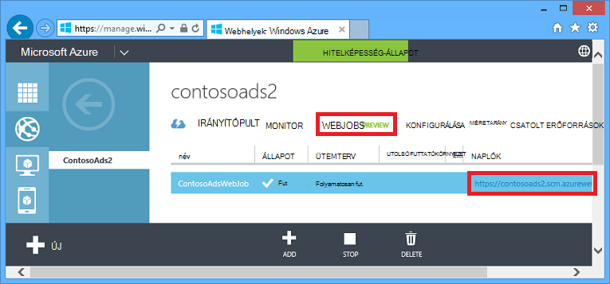

    Egy új böngészőlapon a WebJobs SDK irányítópult nyílik meg. Az irányítópult jeleníti meg, hogy a WebJob működik, és a függvények listáját jeleníti meg, amelyen a WebJobs SDK csomagjában talál a kódot.

4. Kattintson a Funkciók végrehajtása során részleteit.

    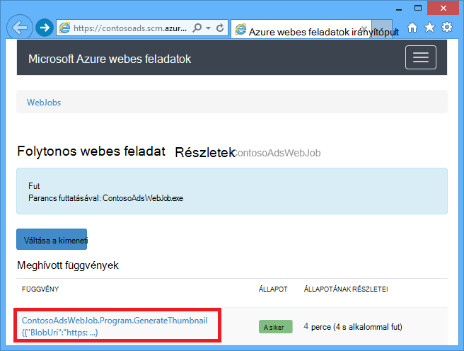

    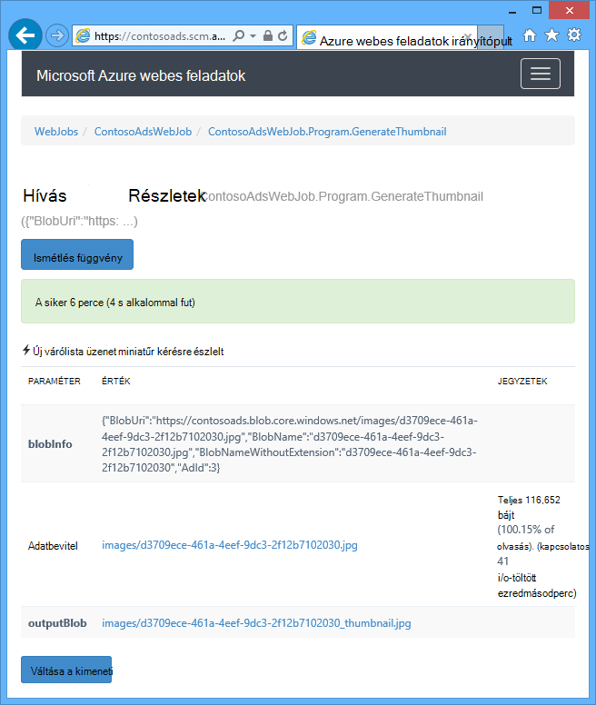

    Ezen a lapon az **Ismétlés függvény** gomb hatására a WebJobs SDK keretrendszer hívja meg újra a függvényt, és módosíthatja az adatokat, először a függvénynek átadott lehetőséget kínál fel.

>[AZURE.NOTE] Ha befejezte a web app és az SQL-adatbázis példány tesztelése esetén törlése. A web app ingyenes, de az SQL-adatbázis-példány és a tárterület-fiók felmerülés díjak (minimális kis méret miatt). Is ha a web app operációs rendszert futtató hagyja, bárki, aki az URL-címet megtalálja létrehozhat és hirdetések megtekintése. A klasszikus portálon nyissa meg az **Irányítópult** lapon, a webalkalmazásban, és kattintson a lap alján a **Törlés** gombra. Válassza az SQL-adatbázis példány törlése egy időben jelölőnégyzetet. Ha csak ideiglenesen megakadályozhatja, hogy mások hozzáférjenek a web App alkalmazásban, kattintson a **Leállítás** helyette. Ebben az esetben díjak folytatja az SQL-adatbázissal, tárterület fiók felmerülés. Kövesse az SQL-adatbázis- és fiók törlése, ha nincs szüksége egy hasonló eljárást.

## Az alkalmazás létrehozása üres lapból

Ez a szakasz fogja végezze el az alábbi műveleteket:

* Hozzon létre egy webes projekt Visual Studio megoldást.
* Adja hozzá az előtér és kódmentes közötti megosztott adat-hozzáférési réteg tár osztály projektté.
* Adja hozzá a kódmentes, New projektté WebJobs telepítési engedélyezve van.
* Adja hozzá a NuGet csomagok.
* Beállítása a project hivatkozásokat.
* Az oktatóprogram korábbi részében időadatok használata letöltött alkalmazásból alkalmazás kód és a konfigurációs fájl másolása
* Tekintse át a kódot Azure BLOB és a sorok és a WebJobs SDK részei.

### A Visual Studio megoldás létrehozása a project web és osztály tár projekt

1. A Visual Studióban, válassza az **Új** > **Project** a **fájl** menüből.

2. Az **Új projekt** párbeszédpanelen válassza a **Visual C#** > **webes** > **ASP.NET webalkalmazást**.

3. Nevezze el a projekt ContosoAdsWeb, a megoldást ContosoAdsWebJobsSDK (módosítása a megoldás nevét, ha a letöltött megoldást ugyanabban a mappában van helyezve) nevet, és kattintson **az OK**gombra.

    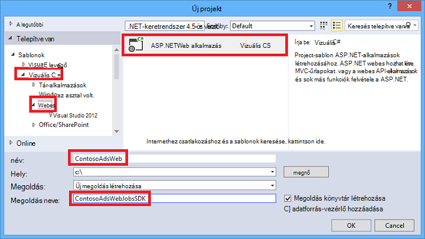

5. Az **Új ASP.NET projekt** párbeszédpanelen válassza ki a MVC sablont, és törölje a jelet **a felhőben Host** jelölőnégyzetből a **Microsoft Azure**.

    Jelölje ki **a felhőben Host** lehetővé teszi, hogy automatikusan létrehozása az Azure webalkalmazás Visual Studio és SQL-adatbázis. Mivel már ezek korábban létrehozott, nem kell ezzel során a projekt létrehozása. Ha azt szeretné, hogy hozzon létre egy újat, jelölje be a jelölőnégyzetet. Ezután beállíthatja az új web app és az SQL-adatbázis a megszokott módon korábbi Ha telepítette az alkalmazást.

5. **Hitelesítés módosítása**gombra.

    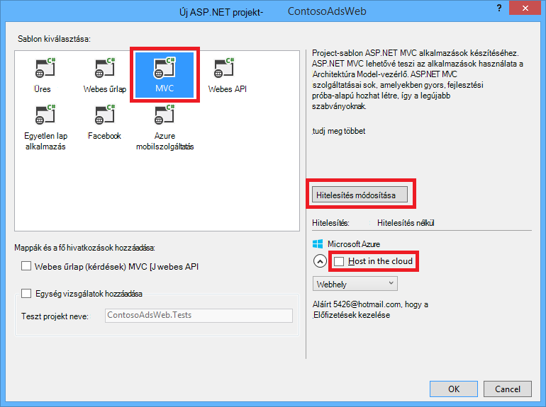

7. **Hitelesítés módosítása** párbeszédpanelen válassza a **Nincs hitelesítés**, és kattintson **az OK**gombra.

    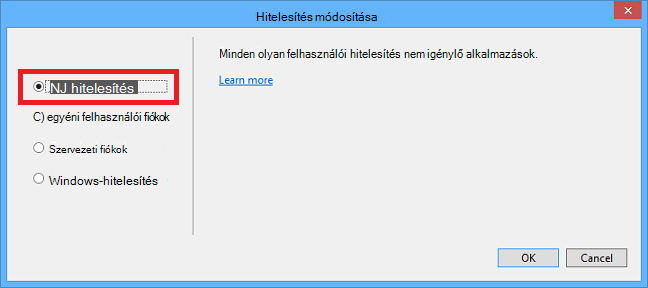

8. Az **Új ASP.NET projekt** párbeszédpanelen kattintson az **OK gombra**.

    Visual Studio hoz létre, a megoldást, és a webes projektet.

9. A **Megoldás Explorer**, kattintson a jobb gombbal a megoldást (nem a projekt), és válassza a **Hozzáadás** > **Új projektet**.

11. Az **Új projekt hozzáadása** párbeszédpanelen válassza a **Visual C#** > **Windows asztali** > **Osztálytár** sablont.  

10. A projekt *ContosoAdsCommon*nevet, és kattintson **az OK**gombra.

    Ehhez a projekthez is tartalmaz, a szervezet keretrendszer környezet, és az adatmodellbe, amely az előtér és a hátsó vége fogja használni. Helyett esetleg EF kapcsolódó osztályok meghatározása a webes projektet, és hivatkozás a projekt WebJob projektből. De majd a WebJob projekt szeretné, hogy webes szerelvények, amelyek nem szükséges hivatkozást.

### A New projekt, amelyen engedélyezett WebJobs telepítési hozzáadása

1. Kattintson a jobb gombbal a webes projektet (nem a megoldást vagy a osztály tár projekt), és kattintson a **Hozzáadás** > **Új Azure WebJob projekt**.

    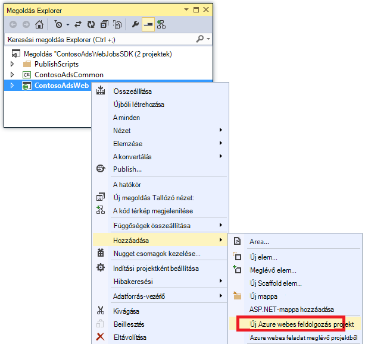

2. **Azure WebJob hozzáadása** párbeszédpanelen írjon be ContosoAdsWebJob a **projektnév** és a **WebJob nevét**. Hagyja, **WebJob futási módja** **Futtatása folyamatosan**meg.

3.  Kattintson az **OK gombra**.

    Visual Studio létrehoz egy konzol üzembe egy WebJob, amikor a webes projekt rendszerbe beállított alkalmazás. Ehhez az alábbi műveleteket a projekt létrehozása után futtatott:

    * A hozzáadott *webjob közzététele settings.json* fájl WebJob projekt tulajdonságainak mappában.
    * A projekt tulajdonságainak webmappa *webjobs-list.json* fájl adott hozzá.
    * Telepítve van a Microsoft.Web.WebJobs.Publish NuGet csomag a WebJob projekt.

    További információt a módosítások megtudhatja, [hogy miként üzembe WebJobs Visual Studio segítségével](websites-dotnet-deploy-webjobs.md).

### NuGet csomagok hozzáadása

Az új projekt sablon WebJob projekt automatikusan telepíti a WebJobs SDK NuGet csomag [Microsoft.Azure.WebJobs](http://www.nuget.org/packages/Microsoft.Azure.WebJobs) és függőségét.

A WebJob projektben automatikusan települ WebJobs SDK függőségek egyik Azure tároló ügyfél Library (SCL). Azonban szüksége fel szeretne venni a webes projektet BLOB és a sorok.

1. Nyissa meg a **NuGet csomagok kezelése** párbeszédpanel a megoldáshoz.

2. A bal oldali ablaktáblában válassza a **telepített csomagok**.

3. Keresse meg az *Azure tároló* csomag, és kattintson a **kezelés**gombra.

4. A **Projekt kijelölése** párbeszédpanelen jelölje be a **ContosoAdsWeb** jelölőnégyzetet, és kattintson **az OK**gombra.

    Az összes három projektet használata a szervezet keretrendszer adatokkal az SQL-adatbázis.

5. A bal oldali ablaktáblában válassza az **Online**.

6. Keresse meg a *EntityFramework* NuGet csomagot, és telepítse az összes három projektet.

### A project-hivatkozások beállítása

Web- és WebJob projektek használata SQL-adatbázissal, így mindkét kell egy hivatkozást a ContosoAdsCommon projekthez.

1. Állítsa be a ContosoAdsWeb projekt egy hivatkozást a ContosoAdsCommon projekthez. (Kattintson a jobb gombbal a ContosoAdsWeb projekt, és kattintson a **Hozzáadás** > **hivatkozást**. A **Hivatkozás-kezelő** párbeszédpanelen jelölje ki a **megoldást** > **projektek** > **ContosoAdsCommon**, és kattintson **az OK**gombra.)

1. Állítsa be a ContosoAdsWebJob projektet egy hivatkozást a ContosAdsCommon projekthez.

    A WebJob projekt hivatkozások van szüksége, a képek és elérni a csatlakozási_karakterlánc.

3. A ContosoAdsWebJob projekt állítsa be a hivatkozás `System.Drawing` és `System.Configuration`.

### Kód és a konfigurációs fájl hozzáadása

Nem jelenik meg ez az oktatóanyag [MVC vezérlők és állványon nézeteket hozhat létre](http://www.asp.net/mvc/tutorials/mvc-5/introduction/getting-started), hogyan lehet [, hogy működik-e az SQL Server-adatbázisok entitás keretrendszer kódírás](http://www.asp.net/mvc/tutorials/getting-started-with-ef-using-mvc)vagy [ASP.NET 4.5 programozási aszinkron alapjait](http://www.asp.net/aspnet/overview/developing-apps-with-windows-azure/building-real-world-cloud-apps-with-windows-azure/web-development-best-practices#async). Így marad a teendő másolás kódot és konfigurációs fájlokat, az új megoldás a letöltött megoldás. Után az ehhez szükséges lépéseket, az alábbi szakaszok megjelenítése, és ismertetik a főbb elemeinek a kódot.

Fájlok hozzáadása a projekt vagy egy olyan mappájába, kattintson a jobb gombbal a projekt vagy mappára, és kattintson a **Hozzáadás** > **Meglévő elemet**. Jelölje ki a kívánt fájlokat, és kattintson a **Hozzáadás**gombra. Ha a program megkérdezi, hogy le szeretné cserélni, meglévő fájlokat, kattintson az **Igen**gombra.

1. A ContosoAdsCommon projekt törölje a *Class1.cs* fájlt, és felvétele a elfoglalt helyét a következő fájlokat a letöltött projektből.

    - *Ad.cs*
    - *ContosoAdscontext.cs*
    - *BlobInformation.cs*  

2. A ContosoAdsWeb projektben adja hozzá a következő fájlokat a letöltött projektből.

    - *Web.config*
    - *Global.asax.cs*  
    - A *vezérlők* mappában: *AdController.cs*
    - A *Views\Shared* mappában: *_Layout.cshtml* fájl
    - A *Views\Home* mappában: *Index.cshtml*
    - A *Views\Ad* mappában (létrehozása a mappa első): öt *.cshtml* fájlok  

3. A ContosoAdsWebJob projekt adja hozzá a következő fájlokat a letöltött projektből.

    - *App.config* (módosítása a fájl típusa szűrő az **Összes fájl**)
    - *Program.cs*
    - *Functions.cs*

Most már összeállítása, futtatása és az alkalmazás telepítéséhez utasításai az oktatóprogram során. Az ehhez szükséges lépéseket, mielőtt azonban állítsa le a WebJob, amely még mindig fut a első web App alkalmazásban, hogy telepítette. Egyéb esetben a WebJob dolgozza fel helyileg vagy a futtatása a új web App alkalmazásban, mivel az azonos tárterület-fiókot használ az összes által létrehozott üzenetek.

## Tekintse át az alkalmazás kódja

Az alábbi szakaszok ismertetik a kapcsolódó WebJobs SDK és a tárhely Azure BLOB és a sorok kódot.

> [AZURE.NOTE] A kód, a WebJobs SDK adott lépjen a [Program.cs és Functions.cs](#programcs) szakaszokat.

### ContosoAdsCommon - Ad.cs

A Ad.cs fájl határozza meg, az Active Directory kategóriák egy felsorolás és POCO entitás osztály ad információt.

        public enum Category
        {
            Cars,
            [Display(Name="Real Estate")]
            RealEstate,
            [Display(Name = "Free Stuff")]
            FreeStuff
        }

        public class Ad
        {
            public int AdId { get; set; }

            [StringLength(100)]
            public string Title { get; set; }

            public int Price { get; set; }

            [StringLength(1000)]
            [DataType(DataType.MultilineText)]
            public string Description { get; set; }

            [StringLength(1000)]
            [DisplayName("Full-size Image")]
            public string ImageURL { get; set; }

            [StringLength(1000)]
            [DisplayName("Thumbnail")]
            public string ThumbnailURL { get; set; }

            [DataType(DataType.Date)]
            [DisplayFormat(DataFormatString = "{0:yyyy-MM-dd}", ApplyFormatInEditMode = true)]
            public DateTime PostedDate { get; set; }

            public Category? Category { get; set; }
            [StringLength(12)]
            public string Phone { get; set; }
        }

### ContosoAdsCommon - ContosoAdsContext.cs

A ContosoAdsContext osztály adja meg, hogy az Active Directory osztály DbSet gyűjteménye, amely entitás keretrendszer tárolja az SQL-adatbázisban használják.

        public class ContosoAdsContext : DbContext
        {
            public ContosoAdsContext() : base("name=ContosoAdsContext")
            {
            }
            public ContosoAdsContext(string connString)
                : base(connString)
            {
            }
            public System.Data.Entity.DbSet<Ad> Ads { get; set; }
        }

Az osztály két konstruktorok tartalmaz. Az első a webhelyen a project által használt, és a kapcsolati karakterlánc, amely a fájlt vagy az Azure futtatókörnyezet található nevét adja meg. A második konstruktor lehetővé teszi, hogy a tényleges kapcsolati karakterláncban adják át. Mivel nincsenek olyan fájlt, amely van szükség a WebJob Project. A korábban ahol a kapcsolati karakterlánc van tárolva, és láthatja, hogy hogyan később a kód keresi a kapcsolati karakterláncot, elindítja az DbContext osztály.

### ContosoAdsCommon - BlobInformation.cs

A `BlobInformation` osztály-kép blob adatainak tárolása várólista üzenetben használható.

        public class BlobInformation
        {
            public Uri BlobUri { get; set; }

            public string BlobName
            {
                get
                {
                    return BlobUri.Segments[BlobUri.Segments.Length - 1];
                }
            }
            public string BlobNameWithoutExtension
            {
                get
                {
                    return Path.GetFileNameWithoutExtension(BlobName);
                }
            }
            public int AdId { get; set; }
        }

### ContosoAdsWeb - Global.asax.cs

A meghívott kódot a `Application_Start` módszer létrehoz egy *képek* blob-tárolóhoz és egy *képek* várólista Ha még nem léteznek. Ezzel biztosíthatja, hogy minden indításakor új tárterület-fiókja, a szükséges blob-tárolóhoz és várólista automatikusan jönnek létre.

A kódot a tárterület-fiók elérésének kap a tárhely kapcsolati karakterláncot, a *fájlt* , illetve az Azure futtatókörnyezet használatával.

        var storageAccount = CloudStorageAccount.Parse
            (ConfigurationManager.ConnectionStrings["AzureWebJobsStorage"].ToString());

Majd azt a *képek* blob-tárolóhoz hivatkozás kap, a tároló hoz létre, ha még nem létezik, és a hozzáférési engedélyek állít be az új tároló. Alapértelmezés szerint új tárolók lehetővé csak ügyfelei számára tároló fiók hitelesítő adataival BLOB eléréséhez. A web app van szüksége a BLOB nyilvános kell, hogy a képek használatáról a kép BLOB mutató URL-is megmutathat.

        var blobClient = storageAccount.CreateCloudBlobClient();
        var imagesBlobContainer = blobClient.GetContainerReference("images");
        if (imagesBlobContainer.CreateIfNotExists())
        {
            imagesBlobContainer.SetPermissions(
                new BlobContainerPermissions
                {
                    PublicAccess = BlobContainerPublicAccessType.Blob
                });
        }

Hasonló kódot a *thumbnailrequest* várólista hivatkozás kap, és létrehoz egy új sor. Ebben az esetben nem engedélyek módosítása van szükség. 

        CloudQueueClient queueClient = storageAccount.CreateCloudQueueClient();
        var imagesQueue = queueClient.GetQueueReference("thumbnailrequest");
        imagesQueue.CreateIfNotExists();

### ContosoAdsWeb - _Layout.cshtml

A *_Layout.cshtml* fájl állítja be az alkalmazás nevét az élőfej és élőláb, és létrehoz egy "Hirdetések" menü tételt.

### ContosoAdsWeb - Views\Home\Index.cshtml

A *Views\Home\Index.cshtml* fájl kategória hivatkozások a kezdőlapon jeleníti meg. A hivatkozások adják át az egész értéket a `Category` felsorolás lekérdezési karakterlánc típusú változóban a hirdetések Index lapot.

        <li>@Html.ActionLink("Cars", "Index", "Ad", new { category = (int)Category.Cars }, null)</li>
        <li>@Html.ActionLink("Real estate", "Index", "Ad", new { category = (int)Category.RealEstate }, null)</li>
        <li>@Html.ActionLink("Free stuff", "Index", "Ad", new { category = (int)Category.FreeStuff }, null)</li>
        <li>@Html.ActionLink("All", "Index", "Ad", null, null)</li>

### ContosoAdsWeb - AdController.cs

A *AdController.cs* a fájlt a konstruktor hívások a `InitializeStorage` módszert, amelyekkel az API BLOB és sorok kezelése Azure tároló ügyfél tár objektumok létrehozásához.

A kód majd megkapja a *képek* blob-tárolóhoz mutató hivatkozás, ahogyan *Global.asax.cs*azt bemutattuk. Azt, amely, miközben állítja a alapértelmezett [házirend újra](http://www.asp.net/aspnet/overview/developing-apps-with-windows-azure/building-real-world-cloud-apps-with-windows-azure/transient-fault-handling) megfelelő webalkalmazást. Az alapértelmezett exponenciális visszalépési újrapróbálkozási házirend sikerült lefagy a web app percnél tovább egy ismétlődő visszatérések a egy ideiglenes (tranziens) hiba. Az itt megadott újrapróbálkozási házirend vár, minden egyes próbáljon meg legfeljebb 3 próbálkozás után 3 másodperces.

        var blobClient = storageAccount.CreateCloudBlobClient();
        blobClient.DefaultRequestOptions.RetryPolicy = new LinearRetry(TimeSpan.FromSeconds(3), 3);
        imagesBlobContainer = blobClient.GetContainerReference("images");

Hasonló kódot megkapja a *képek* várakozási sora hivatkozik.

        CloudQueueClient queueClient = storageAccount.CreateCloudQueueClient();
        queueClient.DefaultRequestOptions.RetryPolicy = new LinearRetry(TimeSpan.FromSeconds(3), 3);
        imagesQueue = queueClient.GetQueueReference("blobnamerequest");

A vezérlő kódot többsége jellemző egy egyed keretrendszer adatmodellt DbContext osztály használatával. A kivétel ez alól a HttpPost `Create` módszer, amely feltölt egy fájlt, és menti a blob-tárolóban lévő. A modell Iratgyűjtő biztosít a módszerrel [HttpPostedFileBase](http://msdn.microsoft.com/library/system.web.httppostedfilebase.aspx) objektum.

        [HttpPost]
        [ValidateAntiForgeryToken]
        public async Task<ActionResult> Create(
            [Bind(Include = "Title,Price,Description,Category,Phone")] Ad ad,
            HttpPostedFileBase imageFile)

Ha a felhasználó választotta a feltölteni kívánt fájlt, a kód feltölti a fájlt menti azt blob és frissítése az Active Directory adatbázis-rekord, amely a blob mutat URL.

        if (imageFile != null && imageFile.ContentLength != 0)
        {
            blob = await UploadAndSaveBlobAsync(imageFile);
            ad.ImageURL = blob.Uri.ToString();
        }

A kód, amely a feltöltés megtalálható a `UploadAndSaveBlobAsync` módot. Azt hoz létre a blob globálisan egyedi azonosítója nevét, feltölti és menti a fájlt, és a mentett blob hivatkozását adja eredményül.

        private async Task<CloudBlockBlob> UploadAndSaveBlobAsync(HttpPostedFileBase imageFile)
        {
            string blobName = Guid.NewGuid().ToString() + Path.GetExtension(imageFile.FileName);
            CloudBlockBlob imageBlob = imagesBlobContainer.GetBlockBlobReference(blobName);
            using (var fileStream = imageFile.InputStream)
            {
                await imageBlob.UploadFromStreamAsync(fileStream);
            }
            return imageBlob;
        }

Miután a HttpPost `Create` módszer blob feltölti, és az adatbázis frissítése, a létrehozott várólista üzenetben tájékoztatja a a háttéradatbázist folyamat, hogy készen áll a miniatűr átalakítása-e egy képet.

        BlobInformation blobInfo = new BlobInformation() { AdId = ad.AdId, BlobUri = new Uri(ad.ImageURL) };
        var queueMessage = new CloudQueueMessage(JsonConvert.SerializeObject(blobInfo));
        await thumbnailRequestQueue.AddMessageAsync(queueMessage);

A HttpPost kódját `Edit` módszer hasonlít, kivéve, ha egy felhasználó kijelöli az új kép fájl bármely BLOB-e az Active Directory már kell törölni.

        if (imageFile != null && imageFile.ContentLength != 0)
        {
            await DeleteAdBlobsAsync(ad);
            imageBlob = await UploadAndSaveBlobAsync(imageFile);
            ad.ImageURL = imageBlob.Uri.ToString();
        }

A kód, amely BLOB törli, az Active Directory törlésekor a következő:

        private async Task DeleteAdBlobsAsync(Ad ad)
        {
            if (!string.IsNullOrWhiteSpace(ad.ImageURL))
            {
                Uri blobUri = new Uri(ad.ImageURL);
                await DeleteAdBlobAsync(blobUri);
            }
            if (!string.IsNullOrWhiteSpace(ad.ThumbnailURL))
            {
                Uri blobUri = new Uri(ad.ThumbnailURL);
                await DeleteAdBlobAsync(blobUri);
            }
        }
        private static async Task DeleteAdBlobAsync(Uri blobUri)
        {
            string blobName = blobUri.Segments[blobUri.Segments.Length - 1];
            CloudBlockBlob blobToDelete = imagesBlobContainer.GetBlockBlobReference(blobName);
            await blobToDelete.DeleteAsync();
        }

### ContosoAdsWeb - Views\Ad\Index.cshtml és Details.cshtml

A *Index.cshtml* fájl miniatűrök az Active Directory adatokat jeleníti meg:

        

A *Details.cshtml* fájlt a teljes méretű kép jeleníti meg:

        

### ContosoAdsWeb - Views\Ad\Create.cshtml és Edit.cshtml

A *Create.cshtml* és *Edit.cshtml* fájlok adja meg, űrlap, amely lehetővé teszi a vezérlő megszerezni kódolása a `HttpPostedFileBase` objektumot.

        @using (Html.BeginForm("Create", "Ad", FormMethod.Post, new { enctype = "multipart/form-data" }))

Egy `<input>` elem közli a böngészőben adja meg a fájl kiválasztása párbeszédpanel.

        <input type="file" name="imageFile" accept="image/*" class="form-control fileupload" />

### ContosoAdsWebJob - Program.cs

A WebJob indításakor, a `Main` módszer felhívja a WebJobs SDK `JobHost.RunAndBlock` végrehajtását megkezdéséhez módszer a jelenlegi szálon függvények indított.

        static void Main(string[] args)
        {
            JobHost host = new JobHost();
            host.RunAndBlock();
        }

### ContosoAdsWebJob - Functions.cs - GenerateThumbnail módszer

A WebJobs SDK felhívja ezt a módszert, várólista üzenet érkezésekor. A módszerrel hoz létre egy miniatűrre, és a miniatűr helyezi az adatbázis URL-CÍMÉT.

        public static void GenerateThumbnail(
        [QueueTrigger("thumbnailrequest")] BlobInformation blobInfo,
        [Blob("images/{BlobName}", FileAccess.Read)] Stream input,
        [Blob("images/{BlobNameWithoutExtension}_thumbnail.jpg")] CloudBlockBlob outputBlob)
        {
            using (Stream output = outputBlob.OpenWrite())
            {
                ConvertImageToThumbnailJPG(input, output);
                outputBlob.Properties.ContentType = "image/jpeg";
            }

            // Entity Framework context class is not thread-safe, so it must
            // be instantiated and disposed within the function.
            using (ContosoAdsContext db = new ContosoAdsContext())
            {
                var id = blobInfo.AdId;
                Ad ad = db.Ads.Find(id);
                if (ad == null)
                {
                    throw new Exception(String.Format("AdId {0} not found, can't create thumbnail", id.ToString()));
                }
                ad.ThumbnailURL = outputBlob.Uri.ToString();
                db.SaveChanges();
            }
        }

* A `QueueTrigger` attribútum arra utasítja az WebJobs SDK hívja fel ezt a módszert, amikor egy új üzenet érkezik, a thumbnailrequest várólista a.

        [QueueTrigger("thumbnailrequest")] BlobInformation blobInfo,

    A `BlobInformation` várólista üzenet célja automatikusan deszerializált be a `blobInfo` paraméter. Ha befejezte a módszerrel, a várólista üzenet törlődik. A módszer nem sikerül befejezése előtt, ha a program nem törli az várólista üzenet; a 10 perc bérleti lejárta után az üzenet újra felvételre való megjelenésével és feldolgozása. A folyamat nem meg kell ismételni határozatlan ideig, ha egy üzenet, mindig a kivételt okoz. Után sikertelen 5 feldolgozása egy üzenetet, az üzenetet áthelyezi egy sorba nevű {Várólistanév}-poison. A maximális érték állítható be.

* A két `Blob` attribútumok adja meg a kötött BLOB-objektumok: a meglévő képet blob-és egy-egy új miniatűr blob, amely a módszerrel hoz létre egyet.

        [Blob("images/{BlobName}", FileAccess.Read)] Stream input,
        [Blob("images/{BlobNameWithoutExtension}_thumbnail.jpg")] CloudBlockBlob outputBlob)

    BLOB nevek származnia tulajdonságait a `BlobInformation` az várólista üzenetben érkezett objektum (`BlobName` és `BlobNameWithoutExtension`). A tároló ügyfél tár használható minden funkcióját megszerezni a `CloudBlockBlob` okkal használata osztály. Ha végezhető írt kód felhasználni kívánt `Stream` objektumokhoz, használhatja a `Stream` osztály.

További információt a hatékony szövegalkotás WebJobs SDK attribútumok függvényeket az alábbi forrásokban talál:

* [A WebJobs SDK Azure várólista-tároló használata](websites-dotnet-webjobs-sdk-storage-queues-how-to.md)
* [A WebJobs SDK Azure blob-tárolóhoz használata](websites-dotnet-webjobs-sdk-storage-blobs-how-to.md)
* [Azure táblatárolója használata a WebJobs SDK](websites-dotnet-webjobs-sdk-storage-tables-how-to.md)
* [A WebJobs SDK Azure Service Bus használata](websites-dotnet-webjobs-sdk-service-bus.md)

> [AZURE.NOTE]
>
> * Több VMs fut a web App alkalmazásban, ha egyszerre több WebJobs fog futni és bizonyos esetekben ez eredményezhet első feldolgozott többször ugyanazokat az adatokat. Ez nem probléma a beépített várólista blob és szolgáltatás Bus indítók használatakor. A SDK biztosítja, hogy a függvények kell dolgozza csak egyszer az egyes üzenetek vagy blob.
>
> * Biztonságos leállítás megvalósításáról tudni olvassa el a [Sikeres-e leállás](websites-dotnet-webjobs-sdk-storage-queues-how-to.md#graceful)című témakört.
>
> * A kódot a `ConvertImageToThumbnailJPG` módszer (nem jelenik meg) használ az osztályok a `System.Drawing` névtér az egyszerűség. A névtér az osztályok azonban Windows-űrlapokon használható készültek. Ezek nem támogatottak a Windows vagy az ASP.NET szolgáltatás való használatra. Feldolgozás beállításai kép kapcsolatos további tudnivalókért lásd: a [Dinamikus kép generációs](http://www.hanselman.com/blog/BackToBasicsDynamicImageGenerationASPNETControllersRoutingIHttpHandlersAndRunAllManagedModulesForAllRequests.aspx) és [Mély belül kép átméretezése](http://www.hanselminutes.com/313/deep-inside-image-resizing-and-scaling-with-aspnet-and-iis-with-imageresizingnet-author-na).

## Következő lépések

Ebben az oktatóanyagban láthatta, kódmentes feldolgozásra a WebJobs SDK használó egyszerű több szálon alkalmazása. Ebben a részben néhány további tudnivalók a több szálon ASP.NET-alkalmazások és WebJobs tanulási javaslatok kínál.

### Hiányzó funkciók

Az alkalmazás rendelkezik egyszerűek – bevezetés oktatóanyagot. A való életben alkalmazásban szeretné [függőség utasítások beszúrását](http://www.asp.net/mvc/tutorials/hands-on-labs/aspnet-mvc-4-dependency-injection) , és a [tárházba és a mértékegység használata mintázatok](http://www.asp.net/mvc/tutorials/getting-started-with-ef-using-mvc/advanced-entity-framework-scenarios-for-an-mvc-web-application#repo)végrehajtása, használja [a naplózáshoz felületet](http://www.asp.net/aspnet/overview/developing-apps-with-windows-azure/building-real-world-cloud-apps-with-windows-azure/monitoring-and-telemetry#log), [EF kód első áttelepítések](http://www.asp.net/mvc/tutorials/getting-started-with-ef-using-mvc/migrations-and-deployment-with-the-entity-framework-in-an-asp-net-mvc-application) használatával kezelheti a modellt adatmódosítás, és [EF kapcsolat Tűrőképessége](http://www.asp.net/mvc/tutorials/getting-started-with-ef-using-mvc/connection-resiliency-and-command-interception-with-the-entity-framework-in-an-asp-net-mvc-application) -lel való kezelése tranziens hálózati hibák.

### Méretezési WebJobs

WebJobs webalkalmazást környezetében futtatása és nem méretezhető külön-külön. Például ha egy szabványos web app-példány, a háttérben futó folyamat csak egy példánya van, és azt használja a kiszolgáló forrásokhoz (Processzor, memória stb.), amely szerepel más módon érhető el a webes tartalmak szolgáló.

Ha forgalom időben hét napja függően változik, és kódmentes feldolgozása, is várnia kell, akkor sikerült ütemezni, a kis forgalom időpontok közötti WebJobs. Ha a betöltés még mindig túl nagy ahhoz, hogy a megoldás, futtathatja a kódmentes egy dedikált külön webalkalmazásban WebJob erre a célra. Ezután méretezheti a kódmentes webalkalmazás egymástól függetlenül az frontend webalkalmazásból.

További tudnivalókért olvassa el a [Méretezés WebJobs](websites-webjobs-resources.md#scale)című témakört.

### Web app időtúllépés leállítás menük elkerülése

Győződjön meg arról, hogy a WebJobs mindig fut, és a webalkalmazás az összes előfordulását forgalmi, engedélyeznie kell a [AlwaysOn](http://weblogs.asp.net/scottgu/archive/2014/01/16/windows-azure-staging-publishing-support-for-web-sites-monitoring-improvements-hyper-v-recovery-manager-ga-and-pci-compliance.aspx) funkciót.

### A WebJobs SDK kívüli WebJobs használatával

A WebJobs SDK használó programok nem kell futtatni egy WebJob az Azure-ban. Helyi meghajtóra futtatható, és más környezetben, például egy felhőalapú szolgáltatásba dolgozó szerepkör vagy Windows-szolgáltatás is futtathatja. Jó helyen jár csak érheti el a WebJobs SDK irányítópult az Azure-webappokban. Az irányítópult használatára van fiókhoz való csatlakozáshoz a web app a tárterületet használ a klasszikus portál **beállítása** lapon az AzureWebJobsDashboard kapcsolati karakterlánc megadásával. Ezután érheti el az irányítópulton a következő URL-cím használatával:

https://{webappname}.SCM.azurewebsites.NET/azurejobs/#/Functions

További tudnivalókért lásd: az [első helyi fejlesztési a WebJobs SDK csomagjában talál az irányítópult](http://blogs.msdn.com/b/jmstall/archive/2014/01/27/getting-a-dashboard-for-local-development-with-the-webjobs-sdk.aspx), de ne feledje, hogy látható-e egy régi csatlakozási karakterlánc nevét.

### További WebJobs dokumentáció

További információ az [Azure WebJobs dokumentáció forrásokban](http://go.microsoft.com/fwlink/?LinkId=390226)talál.
