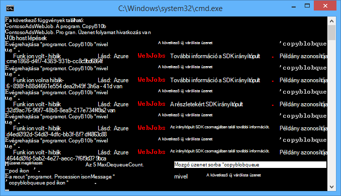
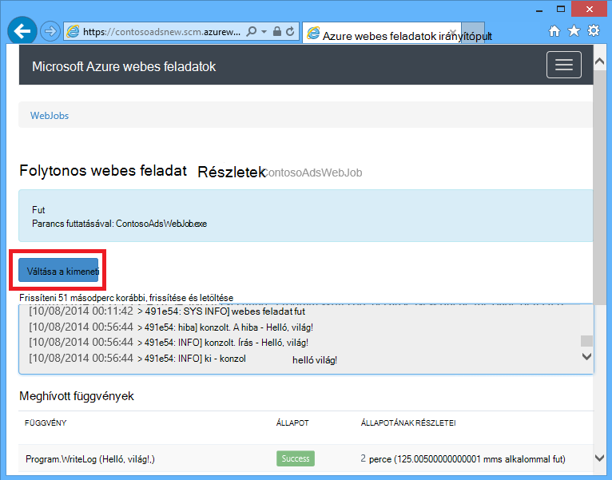
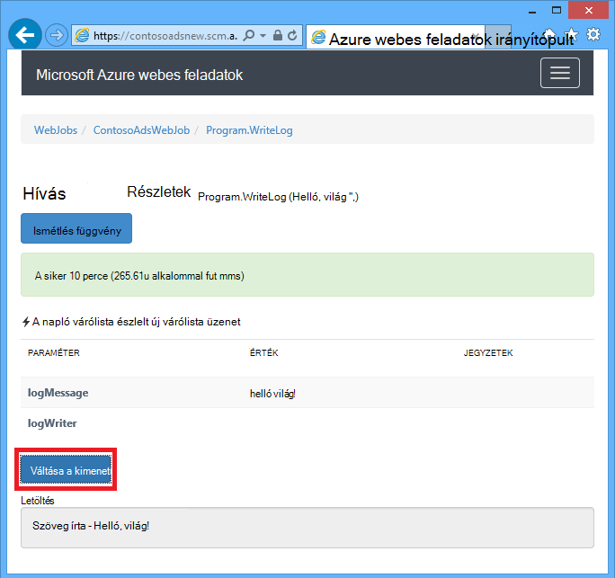
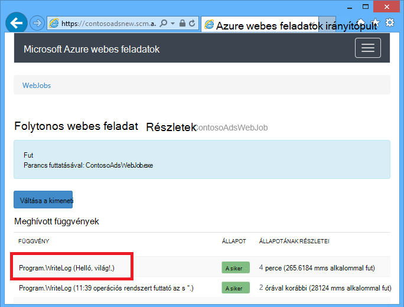
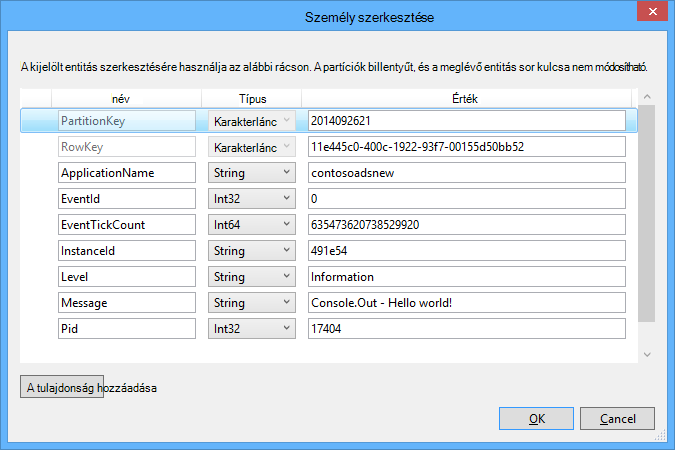
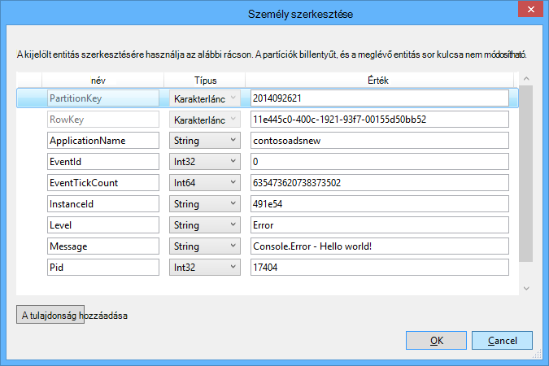

<properties 
    pageTitle="A WebJobs SDK Azure várólista-tároló használata" 
    description="Megtudhatja, hogy miként Azure várólista-tároló használatára a WebJobs SDK csomagjában talál. Létrehozása és törlése a sorok; Beszúrás, behúzás, beszerzése és törlése az üzenetek és az egyéb." 
    services="app-service\web, storage" 
    documentationCenter=".net" 
    authors="tdykstra" 
    manager="wpickett" 
    editor="jimbe"/>

<tags 
    ms.service="app-service-web" 
    ms.workload="web" 
    ms.tgt_pltfrm="na" 
    ms.devlang="dotnet" 
    ms.topic="article" 
    ms.date="06/01/2016" 
    ms.author="tdykstra"/>

# <a name="how-to-use-azure-queue-storage-with-the-webjobs-sdk"></a>A WebJobs SDK Azure várólista-tároló használata

## <a name="overview"></a>– Áttekintés

Ez az útmutató C# kód példák bemutatják, hogyan Azure WebJobs SDK verzióját használja, az Azure várólista tároló szolgáltatással 1.x.

Az útmutató feltételezi, hogy tudja, [hogyan kell a kapcsolati karakterláncot, mutasson a tárterület-fiók a Visual Studióban WebJob projekt létrehozása](websites-dotnet-webjobs-sdk-get-started.md#configure-storage) vagy [több tárterületet](https://github.com/Azure/azure-webjobs-sdk/blob/master/test/Microsoft.Azure.WebJobs.Host.EndToEndTests/MultipleStorageAccountsEndToEndTests.cs)fiókhoz.

A kódtöredék többsége csak a funkciók nem hoz létre, a kód megjelenítése a `JobHost` objektum következő példának megfelelően:

        static void Main(string[] args)
        {
            JobHost host = new JobHost();
            host.RunAndBlock();
        }
        
Az útmutató tartalmazza a következő témaköröket:

-   [Hogyan indíthatja el a függvény a várakozási üzenet érkezésekor](#trigger)
    - Karakterlánc üzenetek
    - POCO üzenetek
    - Aszinkron függvények
    - A QueueTrigger attribútum működik-e a típusai
    - Lekérdezési algoritmus
    - Több példányban
    - A párhuzamos végrehajtása
    - A várakozási vagy várólista üzenet metaadatok
    - Biztonságos leállítása
-   [Hogyan hozhat létre várólista üzenet várólista üzenet feldolgozása közben](#createqueue)
    - Karakterlánc üzenetek
    - POCO üzenetek
    - Hozzon létre több üzenetet vagy az aszinkron függvények
    - A várakozási attribútum működik-e a típusai
    - WebJobs SDK attribútumok törzsében, a függvény használata
-   [Hogyan olvasása és írása BLOB várólista üzenet feldolgozása közben](#blobs)
    - Karakterlánc üzenetek
    - POCO üzenetek
    - A Blob-attribútum működik-e a típusai
-   [Elhalt üzenetek kezelése](#poison)
    - Az üzenetek automatikus poison kezelése
    - Kézi elhalt üzenetek kezelése
-   [Hogyan kell beállítani a beállítási lehetőségek](#config)
    - A csatlakozási_karakterlánc SDK beállítása a kódot.
    - QueueTrigger beállításainak konfigurálása
    - Értékek az WebJobs SDK konstruktor paramétereket állíthat a kódot.
-   [Hogy miként indíthatja el kézzel függvény](#manual)
-   [Hogyan kell írni a naplók](#logs) 
-   [Hibák kezelésére és időtúllépései konfigurálása](#errors)
-   [Következő lépések](#nextsteps)

## <a id="trigger"></a>Hogyan indíthatja el a függvény a várakozási üzenet érkezésekor

Ha válaszolni szeretne egy függvényt, amely a WebJobs SDK meghívja várólista üzenet érkezésekor, használja a `QueueTrigger` attribútum. Az attribútum konstruktora karakterlánc paramétert a várólista lekérdezik nevét adja meg. Is [meg dinamikusan várólista nevét](#config).

### <a name="string-queue-messages"></a>Karakterlánc üzenetek

A következő példában a várólista tartalmazza a karakterlánc-üzenet, így `QueueTrigger` nevű karakterlánc paraméter alkalmazott `logMessage` amelynek tartalma megegyezik az várólista üzenetet. A függvény [az irányítópult napló üzenet írása](#logs).
 

        public static void ProcessQueueMessage([QueueTrigger("logqueue")] string logMessage, TextWriter logger)
        {
            logger.WriteLine(logMessage);
        }

Emellett `string`, lehet, hogy a paraméter egy bájt tömböt egy `CloudQueueMessage` objektum vagy egy POCO, amely csak.

### <a name="poco-plain-old-clr-objecthttpenwikipediaorgwikiplainoldclrobject-queue-messages"></a>POCO [(egyszerű régi CLR objektum](http://en.wikipedia.org/wiki/Plain_Old_CLR_Object)) sorba, üzenetek

A következő példában az várólista üzenetben a JSON egy `BlobInformation` objektumra, amely magában foglalja a `BlobName` tulajdonság. A SDK automatikusan deserializes az objektumot.

        public static void WriteLogPOCO([QueueTrigger("logqueue")] BlobInformation blobInfo, TextWriter logger)
        {
            logger.WriteLine("Queue message refers to blob: " + blobInfo.BlobName);
        }

A SDK csomagjában talál a [Newtonsoft.Json NuGet csomag](http://www.nuget.org/packages/Newtonsoft.Json) szerializálni és üzenetek deszerializálni használja. A program a WebJobs SDK nem használó üzenetek hoz létre, ha például az alábbi példa létrehoz egy POCO várólista üzenetet, amely a SDK is elemezni kód is írhat. 

        BlobInformation blobInfo = new BlobInformation() { BlobName = "log.txt" };
        var queueMessage = new CloudQueueMessage(JsonConvert.SerializeObject(blobInfo));
        logQueue.AddMessage(queueMessage);

### <a name="async-functions"></a>Aszinkron függvények

A következő aszinkron függvény [az irányítópult naplózási ír](#logs).

        public async static Task ProcessQueueMessageAsync([QueueTrigger("logqueue")] string logMessage, TextWriter logger)
        {
            await logger.WriteLineAsync(logMessage);
        }

Aszinkron függvények is igénybe vehet a [Lemondás jogkivonat](http://www.asp.net/mvc/overview/performance/using-asynchronous-methods-in-aspnet-mvc-4#CancelToken), amely blob másolja a következő példában látható módon. (Amely magyarázatot ad a `queueTrigger` helyőrző [BLOB](#blobs) című lapon.)

        public async static Task ProcessQueueMessageAsyncCancellationToken(
            [QueueTrigger("blobcopyqueue")] string blobName, 
            [Blob("textblobs/{queueTrigger}",FileAccess.Read)] Stream blobInput,
            [Blob("textblobs/{queueTrigger}-new",FileAccess.Write)] Stream blobOutput,
            CancellationToken token)
        {
            await blobInput.CopyToAsync(blobOutput, 4096, token);
        }

### <a id="qtattributetypes"></a>A QueueTrigger attribútum működik-e a típusai

Használható `QueueTrigger` , az alábbiak:

* `string`
* A JSON mint szerializálásának POCO típusú
* `byte[]`
* `CloudQueueMessage`

### <a id="polling"></a>Lekérdezési algoritmus

A SDK alkalmazza a véletlen exponenciális vissza kikapcsolása algoritmus üresjárati várólista tároló tranzakció költségekről lekérdezési hatása csökkentése érdekében.  Üzenet érkezése esetén, a SDK két másodpercet vár, és majd keressen egy másik üzenetet; Ha nincs üzenet megtalálható azt vár, körülbelül négy másodperc előtt próbálkozzon újra. Későbbi sikertelen kísérletek várólista üzenet jelenik meg, miután a várakozási idő továbbra is a maximális várakozási idő, amely alapértelmezés szerint egy perc eléréséig nő. [A maximális várakozási idő az állítható be](#config).

### <a id="instances"></a>Több példányban

A web app több példánya fut, ha minden gépen fut a folyamatos WebJob és az egyes fog megvárja, amíg eseményindítók és megkísérli futtatni a függvények. A WebJobs SDK várólista eseményindító automatikusan megakadályozza, hogy a függvény várólista üzenet többször; feldolgozása funkciók nem rendelkezik ahhoz, hogy idempotent lesz. Jó helyen jár, ha biztos szeretne lenni, hogy csak egy példánya függvény akkor is, ha a host web app több példánya fut, akkor a `Singleton` attribútum. 

### <a id="parallel"></a>A párhuzamos végrehajtása

Ha másik sorban várakozó figyel több függvényt, a SDK visszahívja őket párhuzamosan üzenetek egyidejű érkezésekor. 

Ugyanez igaz több üzenetet egyetlen várólista érkezésekor. Alapértelmezés szerint a SDK nagyobb számú 16 üzenetek kap egy időben, és végrehajtja a függvénynek megfelelően párhuzamosan dolgozza fel. [A Köteg mérete nem állítható be](#config). Ha a szám feldolgozása a tétel méretét a fele esetekben, a a SDK csomagjában talál kap egy másik köteget, és elindítja a feldolgozása azokat az üzeneteket. Egy függvény feldolgozása egyidejű üzenetek maximális száma ezért egy és a felét időpontokat a tétel méretét. Ezt a korlátot külön-külön vonatkozik, amelynek egyes függvény egy `QueueTrigger` attribútum. 

Ha nem szeretné, hogy az egyik várakozási a Beérkezett üzenetek párhuzamos végrehajtás, beállíthatja, hogy a köteg méret 1. Lásd még: [Azure WebJobs SDK 1.1.0 RTM](/blog/azure-webjobs-sdk-1-1-0-rtm/) **további beállítási lehetőségekre várólista feldolgozása** .

### <a id="queuemetadata"></a>A várakozási vagy várólista üzenet metaadatai

A következő üzenet tulajdonságok úgy is megnyithatja, hogy paramétereket ad az módszer aláírás:

* `DateTimeOffset`expirationTime
* `DateTimeOffset`insertionTime
* `DateTimeOffset`nextVisibleTime
* `string`queueTrigger (üzenet szöveget tartalmaz)
* `string`azonosító
* `string`popReceipt
* `int`dequeueCount

Ha közvetlenül dolgozhat az Azure tároló API szeretne, akkor is hozzáadhat egy `CloudStorageAccount` paraméter.

Az alábbi példa ír összes a metaadat-információ alkalmazás naplót. A példában szereplő logMessage és a queueTrigger tartalmazzák a várólista üzenet tartalmát.

        public static void WriteLog([QueueTrigger("logqueue")] string logMessage,
            DateTimeOffset expirationTime,
            DateTimeOffset insertionTime,
            DateTimeOffset nextVisibleTime,
            string id,
            string popReceipt,
            int dequeueCount,
            string queueTrigger,
            CloudStorageAccount cloudStorageAccount,
            TextWriter logger)
        {
            logger.WriteLine(
                "logMessage={0}\n" +
            "expirationTime={1}\ninsertionTime={2}\n" +
                "nextVisibleTime={3}\n" +
                "id={4}\npopReceipt={5}\ndequeueCount={6}\n" +
                "queue endpoint={7} queueTrigger={8}",
                logMessage, expirationTime,
                insertionTime,
                nextVisibleTime, id,
                popReceipt, dequeueCount,
                cloudStorageAccount.QueueEndpoint,
                queueTrigger);
        }

Az alábbiakban a példakódot által írt minta naplózási:

        logMessage=Hello world!
        expirationTime=10/14/2014 10:31:04 PM +00:00
        insertionTime=10/7/2014 10:31:04 PM +00:00
        nextVisibleTime=10/7/2014 10:41:23 PM +00:00
        id=262e49cd-26d3-4303-ae88-33baf8796d91
        popReceipt=AgAAAAMAAAAAAAAAfc9H0n/izwE=
        dequeueCount=1
        queue endpoint=https://contosoads.queue.core.windows.net/
        queueTrigger=Hello world!

### <a id="graceful"></a>Biztonságos leállítása

A folyamatos WebJob futtató függvény elfogadhatja a `CancellationToken` paraméter, amely lehetővé teszi az operációs rendszer értesíti a függvény, amikor a WebJob meg kell szüntetni. Ez az értesítés, hogy a függvény nem leállítás váratlanul oly módon, hogy az adatokat hagyja a várttól eltérően működik állapotú is használhatja.

A következő példa bemutatja az függvény a közelgő WebJob lemondási ellenőrzése.

    public static void GracefulShutdownDemo(
                [QueueTrigger("inputqueue")] string inputText,
                TextWriter logger,
                CancellationToken token)
    {
        for (int i = 0; i < 100; i++)
        {
            if (token.IsCancellationRequested)
            {
                logger.WriteLine("Function was cancelled at iteration {0}", i);
                break;
            }
            Thread.Sleep(1000);
            logger.WriteLine("Normal processing for queue message={0}", inputText);
        }
    }

**Megjegyzés:** Az irányítópult nem lehet, hogy helyesen megjelenítése, az állapot és a kimeneti azokat a funkciókat, amelyek le lett állítva.
 
További tudnivalókért olvassa el a [WebJobs sikeres-e leállás](http://blog.amitapple.com/post/2014/05/webjobs-graceful-shutdown/#.VCt1GXl0wpR)című témakört.   

## <a id="createqueue"></a>Hogyan hozhat létre várólista üzenet várólista üzenet feldolgozása közben

Ha válaszolni szeretne egy funkció, amely létrehoz egy új várólista üzenetet, használja a `Queue` attribútum. Például `QueueTrigger`, adja meg a karakterláncként várólista neve vagy állíthat be [a várólista neve dinamikusan](#config).

### <a name="string-queue-messages"></a>Karakterlánc üzenetek

A következő nem aszinkron kód minta üzenetet hoz létre új várólista a ugyanazt a tartalmat, a "inputqueue" nevű várakozási sorban található kapott várólista-üzenet a "outputqueue" nevű várakozási sorban található. (Aszinkron függvények használata `IAsyncCollector<T>` később ebben a szakaszban látható módon.)


        public static void CreateQueueMessage(
            [QueueTrigger("inputqueue")] string queueMessage,
            [Queue("outputqueue")] out string outputQueueMessage )
        {
            outputQueueMessage = queueMessage;
        }
  
### <a name="poco-plain-old-clr-objecthttpenwikipediaorgwikiplainoldclrobject-queue-messages"></a>POCO [(egyszerű régi CLR objektum](http://en.wikipedia.org/wiki/Plain_Old_CLR_Object)) sorba, üzenetek

Tartalmazó karakterlánc, hanem egy POCO várólista üzenet létrehozása, adják át a POCO típusát a kimeneti paraméterként a `Queue` attribútum konstruktora.
 
        public static void CreateQueueMessage(
            [QueueTrigger("inputqueue")] BlobInformation blobInfoInput,
            [Queue("outputqueue")] out BlobInformation blobInfoOutput )
        {
            blobInfoOutput = blobInfoInput;
        }

A SDK automatikusan serializes JSON az objektumot. A várakozási üzenet mindig létrehozni, akkor is, ha az objektum értéke null.

### <a name="create-multiple-messages-or-in-async-functions"></a>Hozzon létre több üzenetet vagy az aszinkron függvények

Több üzenetet létrehozni, azt szeretné, hogy a paraméter típusa, a kimeneti várólista `ICollector<T>` vagy `IAsyncCollector<T>`, az alábbi példában látható módon.

        public static void CreateQueueMessages(
            [QueueTrigger("inputqueue")] string queueMessage,
            [Queue("outputqueue")] ICollector<string> outputQueueMessage,
            TextWriter logger)
        {
            logger.WriteLine("Creating 2 messages in outputqueue");
            outputQueueMessage.Add(queueMessage + "1");
            outputQueueMessage.Add(queueMessage + "2");
        }

Azonnal létrejön az egyes várólista üzenet esetén a `Add` módszer neve.

### <a name="types-that-the-queue-attribute-works-with"></a>A várakozási attribútum működik-e a adattípusa

Használhatja a `Queue` attribútum paraméter az alábbiak:

* `out string`(létrehoz várólista üzenetet, ha a paraméter értéke nem null a függvény befejeződésekor)
* `out byte[]`(működés `string`) 
* `out CloudQueueMessage`(működés `string`) 
* `out POCO`(a szerializálható típusú létrehoz egy üzenetet az null objektumot, ha a paraméter értéke null, a függvény befejeződésekor)
* `ICollector`
* `IAsyncCollector`
* `CloudQueue`(az üzenetek manuálisan az Azure tároló API-val közvetlenül készítéséhez)

### <a id="ibinder"></a>WebJobs SDK attribútumok törzsében, a függvény használata

Ha módosítani szeretné, hogy bizonyos munkát, a függvény egy WebJobs SDK attribútum használhassa `Queue`, `Blob`, vagy `Table`, használhatja a `IBinder` felület.

A következő példa megnyitja a bemeneti várakozási üzenetben, és létrehoz egy új üzenetet egy kimenet várólista ugyanazt a tartalmat. A kimenet várólista neve a függvénnyel törzsét kód állítja be.

        public static void CreateQueueMessage(
            [QueueTrigger("inputqueue")] string queueMessage,
            IBinder binder)
        {
            string outputQueueName = "outputqueue" + DateTime.Now.Month.ToString();
            QueueAttribute queueAttribute = new QueueAttribute(outputQueueName);
            CloudQueue outputQueue = binder.Bind<CloudQueue>(queueAttribute);
            outputQueue.AddMessage(new CloudQueueMessage(queueMessage));
        }

A `IBinder` felület is kínál a `Table` és `Blob` attribútumok.

## <a id="blobs"></a>Hogyan olvasása és írása BLOB és táblázatok várólista üzenet feldolgozása közben

A `Blob` és `Table` attribútumok lehetővé teszi azok olvasása és írása BLOB és a táblázatokat. Ebben a szakaszban a minták BLOB vonatkoznak. Megtudhatja, [hogy miként használhatja a WebJobs SDK csomagjában talál az Azure blob-tárolóhoz](websites-dotnet-webjobs-sdk-storage-blobs-how-to.md)mintakódok, amelyek bemutatják, hogyan indíthatja el a folyamatok BLOB vannak létrehozásakor vagy frissítésekor, és mintáknál kódot, amely olvasása és írása táblákat, megtudhatja, [hogy miként használhatja a WebJobs SDK csomagjában talál az Azure táblatárolóhoz](websites-dotnet-webjobs-sdk-storage-tables-how-to.md).

### <a name="string-queue-messages-triggering-blob-operations"></a>Karakterlánc üzenetek kiváltó blob-műveletek

Olyan várólista üzenet, amely tartalmazza a karakterlánc `queueTrigger` egy helyőrző a is használhatja a `Blob` attribútum `blobPath` paraméter, amely tartalmazza az üzenet tartalmát. 

Az alábbi példában `Stream` olvasása és írása BLOB-objektumok. A várakozási üzenetet pedig a textblobs tárolóban található blob neve. Egy példányát a blob az "– új" fűzött neve ugyanabban a tárolóban jön létre. 

        public static void ProcessQueueMessage(
            [QueueTrigger("blobcopyqueue")] string blobName, 
            [Blob("textblobs/{queueTrigger}",FileAccess.Read)] Stream blobInput,
            [Blob("textblobs/{queueTrigger}-new",FileAccess.Write)] Stream blobOutput)
        {
            blobInput.CopyTo(blobOutput, 4096);
        }

A `Blob` attribútum konstruktor veszi fel egy `blobPath` paraméter, amely a tároló és blob nevét. A helyőrző további információkért lásd: [használatáról a WebJobs SDK csomagjában talál az Azure blob-tárolóhoz](websites-dotnet-webjobs-sdk-storage-blobs-how-to.md), 

Ha az attribútum decorates egy `Stream` objektum egy másik konstruktor a paraméter mutatja a `FileAccess` olvasható, írási és olvasási/írási mód. 

Az alábbi példában egy `CloudBlockBlob` blob törlendő objektum. A várakozási üzenetet pedig a blob neve.

        public static void DeleteBlob(
            [QueueTrigger("deleteblobqueue")] string blobName,
            [Blob("textblobs/{queueTrigger}")] CloudBlockBlob blobToDelete)
        {
            blobToDelete.Delete();
        }

### <a id="pocoblobs"></a>POCO [(egyszerű régi CLR objektum](http://en.wikipedia.org/wiki/Plain_Old_CLR_Object)) sorba, üzenetek

A JSON tárolja a várólista üzenetben POCO, nevezze el az objektum tulajdonságai, helyőrzők használhatja a `Queue` attribútum `blobPath` paraméter. [Várólista metaadat-tulajdonságok neve](#queuemetadata) helyőrzőként is használhatja. 

A következő példa egy másik kiterjesztésű új blob blob másolja. A várakozási üzenet egy `BlobInformation` objektumra, amely tartalmazza a `BlobName` és `BlobNameWithoutExtension` tulajdonságait. A tulajdonságok neve blob elérési útját a helyőrzőiként használja a `Blob` attribútumok. 
 
        public static void CopyBlobPOCO(
            [QueueTrigger("copyblobqueue")] BlobInformation blobInfo,
            [Blob("textblobs/{BlobName}", FileAccess.Read)] Stream blobInput,
            [Blob("textblobs/{BlobNameWithoutExtension}.txt", FileAccess.Write)] Stream blobOutput)
        {
            blobInput.CopyTo(blobOutput, 4096);
        }

A SDK csomagjában talál a [Newtonsoft.Json NuGet csomag](http://www.nuget.org/packages/Newtonsoft.Json) szerializálni és üzenetek deszerializálni használja. A program a WebJobs SDK nem használó üzenetek hoz létre, ha például az alábbi példa létrehoz egy POCO várólista üzenetet, amely a SDK is elemezni kód is írhat.

        BlobInformation blobInfo = new BlobInformation() { BlobName = "boot.log", BlobNameWithoutExtension = "boot" };
        var queueMessage = new CloudQueueMessage(JsonConvert.SerializeObject(blobInfo));
        logQueue.AddMessage(queueMessage);

Kell néhány munkavégzés a függvényben kötése blob-objektum előtt, ha az attribútum függvény, [ahogy azt az várólista attribútum korábbi](#ibinder)törzsében is használhatja.

### <a id="blobattributetypes"></a>Használhatja a Blob attribútumot típusai
 
A `Blob` attribútum kínál az alábbiak:

* `Stream`(olvasása és írása, a FileAccess konstruktor paraméterrel megadott)
* `TextReader`
* `TextWriter`
* `string`(olvasás)
* `out string`(írjon; blob hoz létre, csak akkor, ha a karakterlánc paraméter esetén nem null függvény)
* POCO (olvasás)
* ki POCO (írás; mindig blob hoz létre, ha POCO paraméter értéke null, ha a függvény értéke null objektumként hoz létre)
* `CloudBlobStream`(írjon)
* `ICloudBlob`(olvasási és írási)
* `CloudBlockBlob`(olvasási és írási) 
* `CloudPageBlob`(olvasási és írási) 

## <a id="poison"></a>Elhalt üzenetek kezelése

Üzenetek, amelynek a tartalmát okoz meghiúsító függvény neve *poison üzeneteket*. Ha a függvény nem sikerül, várólista üzenet a program nem törli, és végül van felvett ismét meg kell ismételni a ciklus okoz. A SDK automatikusan megszakíthatja a ciklus iterációk száma korlátozott számú után, illetve végezheti el azt manuálisan.

### <a name="automatic-poison-message-handling"></a>Az üzenetek automatikus poison kezelése

A SDK visszahívja függvény legfeljebb 5 megszorzása várólista üzenet feldolgozása. Ha nem sikerül az ötödik próbálja meg, az üzenet poison várólista kerül. [Újrapróbálkozások maximális száma konfigurálható](#config). 

A poison várólista nevű *{originalqueuename}*-poison. Írhat naplózás őket, vagy elküldheti a értesítést, hogy kézi figyelmet poison sorból folyamat során függvény van szükség. 

A következő példában a `CopyBlob` függvény sikertelen lesz, ha a várólista üzenet egy nem létező blob nevét tartalmazza. Ebben az esetben, amikor az üzenet kerül a copyblobqueue sorból a copyblobqueue-mérgezett sorba. A `ProcessPoisonMessage` majd naplózza a poison üzenetet.

        public static void CopyBlob(
            [QueueTrigger("copyblobqueue")] string blobName,
            [Blob("textblobs/{queueTrigger}", FileAccess.Read)] Stream blobInput,
            [Blob("textblobs/{queueTrigger}-new", FileAccess.Write)] Stream blobOutput)
        {
            blobInput.CopyTo(blobOutput, 4096);
        }
        
        public static void ProcessPoisonMessage(
            [QueueTrigger("copyblobqueue-poison")] string blobName, TextWriter logger)
        {
            logger.WriteLine("Failed to copy blob, name=" + blobName);
        }

Az alábbi ábrán ezeket a funkciókat konzol kimenetét poison üzenetet feldolgozása.



### <a name="manual-poison-message-handling"></a>Kézi elhalt üzenetek kezelése

Feldolgozási üzenet felvett hányszor elérheti hozzáadásával egy `int` nevű paraméter `dequeueCount` a függvény. Kód függvény dequeue megszámlálása, majd végezze el a saját poison üzenetkezelés ezernél több küszöbértéket, amikor a következő példában látható módon.

        public static void CopyBlob(
            [QueueTrigger("copyblobqueue")] string blobName, int dequeueCount,
            [Blob("textblobs/{queueTrigger}", FileAccess.Read)] Stream blobInput,
            [Blob("textblobs/{queueTrigger}-new", FileAccess.Write)] Stream blobOutput,
            TextWriter logger)
        {
            if (dequeueCount > 3)
            {
                logger.WriteLine("Failed to copy blob, name=" + blobName);
            }
            else
            {
            blobInput.CopyTo(blobOutput, 4096);
            }
        }

## <a id="config"></a>Hogyan kell beállítani a beállítási lehetőségek

Használhatja a `JobHostConfiguration` típusának beállítása az alábbi beállítások közül:

* Beállíthatja a SDK a csatlakozási_karakterlánc kódot.
* Állítsa be `QueueTrigger` beállítások, mint például a maximális száma feldolgozásához.
* Konfigurációs megnyithatja várakozási sorban található neveket.

### <a id="setconnstr"></a>A csatlakozási_karakterlánc SDK beállítása a kódot.

A SDK a csatlakozási_karakterlánc beállítása a kód lehetővé teszi, hogy a saját csatlakozási karakterlánc név konfigurációs fájl vagy környezeti változók, az alábbi példában látható módon.

        static void Main(string[] args)
        {
            var _storageConn = ConfigurationManager
                .ConnectionStrings["MyStorageConnection"].ConnectionString;
        
            var _dashboardConn = ConfigurationManager
                .ConnectionStrings["MyDashboardConnection"].ConnectionString;
        
            var _serviceBusConn = ConfigurationManager
                .ConnectionStrings["MyServiceBusConnection"].ConnectionString;
        
            JobHostConfiguration config = new JobHostConfiguration();
            config.StorageConnectionString = _storageConn;
            config.DashboardConnectionString = _dashboardConn;
            config.ServiceBusConnectionString = _serviceBusConn;
            JobHost host = new JobHost(config);
            host.RunAndBlock();
        }

### <a id="configqueue"></a>QueueTrigger beállításainak konfigurálása

Az alábbi beállításokat, a várólista üzenet feldolgozási vonatkozó adhatja meg:

- Az, hogy a program felvett egyidejű párhuzamosan végrehajtandó üzenetek maximális száma (az alapértelmezett érték 16).
- Újrapróbálkozások egy poison sorba várólista üzenet elküldése előtt maximális száma (az alapértelmezett érték 5).
- A maximális várakozási időt, mielőtt lekérdezési ismét üres várólista esetén (az alapértelmezett érték 1 perc).

A következő példa bemutatja, hogyan ezeket a beállításokat:

        static void Main(string[] args)
        {
            JobHostConfiguration config = new JobHostConfiguration();
            config.Queues.BatchSize = 8;
            config.Queues.MaxDequeueCount = 4;
            config.Queues.MaxPollingInterval = TimeSpan.FromSeconds(15);
            JobHost host = new JobHost(config);
            host.RunAndBlock();
        }

### <a id="setnamesincode"></a>Értékek az WebJobs SDK konstruktor paramétereket állíthat a kódot.

Előfordul, hogy szeretne-e megadni, egy várólista egy blob vagy neve vagy tároló, illetve táblázat nevet a merevlemez-kód helyett a kódot. Például érdemes lehet adja meg a várólista nevét `QueueTrigger` a konfigurációs fájl vagy környezet változóban. 

Akkor is megteheti, hogy a átadása egy `NameResolver` az objektum a `JobHostConfiguration` típusát. Készültségi szint (%) jelek WebJobs SDK attribútum konstruktor paraméterek körülvett speciális helyőrzők felvehet, és a `NameResolver` kód határozza meg, a tényleges értékek helyett ezeket a helyőrzők használandó.

Tegyük fel, hogy a tesztkörnyezetben logqueuetest és a gyártási egy névvel ellátott logqueueprod nevű várólista használni kívánt. Helyett csomagolásukkor várólista nevét, adja meg a nevét, a bejegyzés szeretne a `appSettings` gyűjteményre szeretné, hogy a tényleges várólista neve. Ha a `appSettings` kulcs logqueue, a függvény a következő példa nézhet.

        public static void WriteLog([QueueTrigger("%logqueue%")] string logMessage)
        {
            Console.WriteLine(logMessage);
        }

A `NameResolver` osztály majd olvasható a várólista nevet `appSettings` az alábbi példában látható módon:

        public class QueueNameResolver : INameResolver
        {
            public string Resolve(string name)
            {
                return ConfigurationManager.AppSettings[name].ToString();
            }
        }

Adja meg a `NameResolver` az a osztály a `JobHost` objektum, az alábbi példában látható módon.

        static void Main(string[] args)
        {
            JobHostConfiguration config = new JobHostConfiguration();
            config.NameResolver = new QueueNameResolver();
            JobHost host = new JobHost(config);
            host.RunAndBlock();
        }
 
**Megjegyzés:** A várakozási, táblázat vagy blob név megoldódott, minden alkalommal, amikor egy függvény neve, de csak akkor, amikor az alkalmazás elindul blob-tárolóhoz nevek szünteti meg. A feladat futtatása közben blob-tárolóhoz név nem módosítható. 

## <a id="manual"></a>Hogy miként indíthatja el kézzel függvény

Indíthatja el manuálisan a függvény, használja a `Call` vagy `CallAsync` módszer a `JobHost` objektum és a `NoAutomaticTrigger` attribútum a függvényről, az alábbi példában látható módon. 

        public class Program
        {
            static void Main(string[] args)
            {
                JobHost host = new JobHost();
                host.Call(typeof(Program).GetMethod("CreateQueueMessage"), new { value = "Hello world!" });
            }
        
            [NoAutomaticTrigger]
            public static void CreateQueueMessage(
                TextWriter logger, 
                string value, 
                [Queue("outputqueue")] out string message)
            {
                message = value;
                logger.WriteLine("Creating queue message: ", message);
            }
        }

## <a id="logs"></a>Hogyan kell írni a naplók

Az irányítópult naplók látható két helyen: a WebJob a lapot, és az oldal egy adott WebJob meghíváshoz. 





Konzol módszerek, hívja a függvény, vagy a kimenetét a `Main()` módszer megjelenik a WebJob az irányítópult lapon, és nem a az oldal egy adott módszer meghíváshoz. Az irányítópult oldalát, egy módszer meghíváshoz kimeneti módszer aláírásként paraméter beolvasása TextWriter objektumból jelenik meg.

Konzol kimeneti nem lehet csatolni egy adott módszer meghíváshoz, mivel a konzol egyetlen összefűzött, miközben számos feladat függvény lehet, hogy egy időben futnak. Ezért a SDK minden függvény hívás a saját egyedi naplófájl író objektummal biztosít.

[Alkalmazás nyomkövetési naplók](web-sites-dotnet-troubleshoot-visual-studio.md#logsoverview)elkészítéséhez használható `Console.Out` (hoz létre naplókat információ jelöléssel), és `Console.Error` (hoz létre naplókat hiba jelöléssel). Alternatív környezetbe [nyomkövetési vagy TraceSource](http://blogs.msdn.com/b/mcsuksoldev/archive/2014/09/04/adding-trace-to-azure-web-sites-and-web-jobs.aspx), nemcsak a adatai, majd a hiba részletes, figyelmeztető és kritikus szintek nyújt. Alkalmazás nyomkövetési naplók jelennek meg a web app naplófájlokat Azure táblázatok, vagy Azure BLOB-az Azure webalkalmazást beállításaitól függően. Eredménye IGAZ, az összes konzol kimeneti, mint a legutóbbi 100 alkalmazás naplók is megjelennek az irányítópult lapon WebJob, nem az oldal egy függvény meghíváshoz. 

Konzol kimeneti jelenik meg, az irányítópult csak akkor, ha a program fut az Azure WebJob nem, ha a program helyben fut, vagy más környezetben.

Tiltsa le a magas átviteli felhasználási területei dashboard a naplózás. Alapértelmezés szerint a SDK tároló naplók ír, és a tevékenység sikerült csökkentheti a teljesítményt, ha sok üzenetet feldolgozása esetén. Naplózás letiltásához állítsa be az irányítópult kapcsolati karakterláncot null értékű, a következő példában látható módon.

        JobHostConfiguration config = new JobHostConfiguration();       
        config.DashboardConnectionString = "";        
        JobHost host = new JobHost(config);
        host.RunAndBlock();

A következő példa bemutatja a naplók írni többféle módon:

        public static void WriteLog(
            [QueueTrigger("logqueue")] string logMessage,
            TextWriter logger)
        {
            Console.WriteLine("Console.Write - " + logMessage);
            Console.Out.WriteLine("Console.Out - " + logMessage);
            Console.Error.WriteLine("Console.Error - " + logMessage);
            logger.WriteLine("TextWriter - " + logMessage);
        }

A WebJobs SDK irányítópulton kimenetét a `TextWriter` objektum azt mutatja be, amikor megnyitja a lapot egy adott meghívási működik, és kattintson a **Váltása a kimeneti**:




A WebJobs SDK irányítópulton a legutóbbi 100 sor konzol-kimeneti megjelenítése felfelé esetén nyissa meg a WebJob (nem a függvény a meghívási) a lapját, és kattintson a **Váltása a kimeneti**.
 


Folytonos WebJob, az alkalmazás naplók jelennek/adatok/feladatok/folyamatos /*{webjobname}*/job_log.txt a web app fájlrendszerben.

        [09/26/2014 21:01:13 > 491e54: INFO] Console.Write - Hello world!
        [09/26/2014 21:01:13 > 491e54: ERR ] Console.Error - Hello world!
        [09/26/2014 21:01:13 > 491e54: INFO] Console.Out - Hello world!

Az egy Azure blob-az alkalmazás naplók így néznek ki: 2014-09-26T21:01:13,Information,contosoadsnew,491e54,635473620738373502,0,17404,17,Console.Write - Helló, világ!, 2014-09-26T21:01:13,Error,contosoadsnew,491e54,635473620738373502,0,17404,19,Console.Error - Helló, világ!, 2014-09-26T21:01:13,Information,contosoadsnew,491e54,635473620738529920,0,17404,17,Console.Out - Helló, világ!,

És az Azure-táblázat az `Console.Out` és `Console.Error` naplók néz ki:





Ha a dugja be a saját naplózó szeretne, olvassa el az [Ebben a példában](http://github.com/Azure/azure-webjobs-sdk-samples/blob/master/BasicSamples/MiscOperations/Program.cs).

## <a id="errors"></a>Hibák kezelésére és időtúllépései konfigurálása

A WebJobs SDK is [időtúllépése](http://github.com/Azure/azure-webjobs-sdk-samples/blob/master/BasicSamples/MiscOperations/Functions.cs) okozó megszakad a Ha függvényt használó attribútum nem egy megadott idő mennyiségét belül egészíti ki. És ha tipp az értesítés, ha túl sok hibák fordulhat elő, a megadott időszakban, használja a `ErrorTrigger` attribútum. Íme egy [Példa ErrorTrigger](https://github.com/Azure/azure-webjobs-sdk-extensions/wiki/Error-Monitoring).

```
public static void ErrorMonitor(
[ErrorTrigger("00:01:00", 1)] TraceFilter filter, TextWriter log,
[SendGrid(
    To = "admin@emailaddress.com",
    Subject = "Error!")]
 SendGridMessage message)
{
    // log last 5 detailed errors to the Dashboard
   log.WriteLine(filter.GetDetailedMessage(5));
   message.Text = filter.GetDetailedMessage(1);
}
```

Dinamikusan is letilthatja, és ellenőrző függvények engedélyezése, hogy azok bekövetkezésekor hajthatja végre, amely hasznos lehet egy app beállítása vagy változóinak nevéből környezet konfigurációja kapcsoló használatával. Példakódot, lásd a `Disable` attribútum [a WebJobs SDK minták](https://github.com/Azure/azure-webjobs-sdk-samples/blob/master/BasicSamples/MiscOperations/Functions.cs)tárban tárolnak.

## <a id="nextsteps"></a>Következő lépések

Ez az útmutató nyújtott mintakódok, amelyek bemutatják, hogyan kezelje a esetei Azure sorban várakozó használata. Azure WebJobs és a WebJobs SDK használatával kapcsolatos további tudnivalókért lásd: [Azure WebJobs ajánlott erőforrásokat](http://go.microsoft.com/fwlink/?linkid=390226).
 
