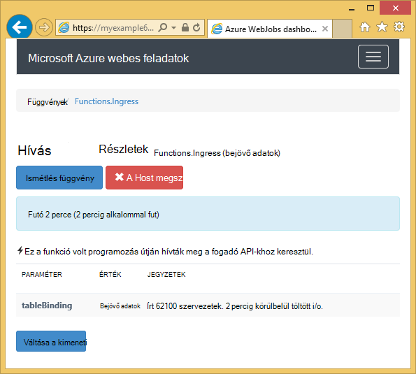
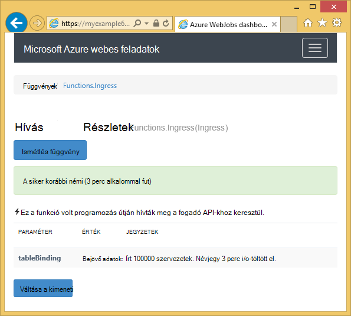

<properties 
    pageTitle="Azure táblatárolója használata a WebJobs SDK" 
    description="Megtudhatja, hogy miként Azure táblatárolóhoz használata a WebJobs SDK csomagjában talál. Táblázatok létrehozása, személyek hozzáadása a táblázatokhoz, és olvassa el a meglévő táblákhoz." 
    services="app-service\web, storage" 
    documentationCenter=".net" 
    authors="tdykstra" 
    manager="wpickett" 
    editor="jimbe"/>

<tags 
    ms.service="app-service-web" 
    ms.workload="web" 
    ms.tgt_pltfrm="na" 
    ms.devlang="dotnet" 
    ms.topic="article" 
    ms.date="06/01/2016" 
    ms.author="tdykstra"/>

# Azure táblatárolója használata a WebJobs SDK

## – Áttekintés

Ez az útmutató C# kód példák, amelyek bemutatják, hogyan olvasása és írása Azure tároló tábla [WebJobs SDK](websites-dotnet-webjobs-sdk.md) verziójával 1.x.

Az útmutató feltételezi, hogy tudja, [hogyan kell a kapcsolati karakterláncot, mutasson a tárterület-fiók a Visual Studióban WebJob projekt létrehozása](websites-dotnet-webjobs-sdk-get-started.md) vagy [több tárterületet](https://github.com/Azure/azure-webjobs-sdk/blob/master/test/Microsoft.Azure.WebJobs.Host.EndToEndTests/MultipleStorageAccountsEndToEndTests.cs)fiókhoz.
        
A kód kódrészletek megjelenítése egy része a `Table` attribútum használt funkciók, amelyek [nevű manuálisan](websites-dotnet-webjobs-sdk-storage-queues-how-to.md#manual), ez azt jelenti, hogy nem az eseményindító attribútumok használatával. 

## Személyek hozzáadása táblához

Személyek hozzáadása egy táblához, használja a `Table` az attribútum egy `ICollector<T>` vagy `IAsyncCollector<T>` paraméter hol `T` adja meg a szervezetek fel szeretné venni a sémában. Az attribútum konstruktora paramétert egy karakterlánc, amely megadja annak a táblának a nevére. 

A következő kódot minta hozzáadása `Person` szervezetek *bejövő adatok*nevű táblába.

        [NoAutomaticTrigger]
        public static void IngressDemo(
            [Table("Ingress")] ICollector<Person> tableBinding)
        {
            for (int i = 0; i < 100000; i++)
            {
                tableBinding.Add(
                    new Person() { 
                        PartitionKey = "Test", 
                        RowKey = i.ToString(), 
                        Name = "Name" }
                    );
            }
        }

Általában milyen használt `ICollector` származik `TableEntity` vagy hajt végre `ITableEntity`, azonban nem kell. Az alábbi eljárások egyikével `Person` osztályok munka és az előző kód `Ingress` módot.

        public class Person : TableEntity
        {
            public string Name { get; set; }
        }

        public class Person
        {
            public string PartitionKey { get; set; }
            public string RowKey { get; set; }
            public string Name { get; set; }
        }

Ha közvetlenül dolgozhat az Azure tárolás API szeretne, hozzáadhat egy `CloudStorageAccount` a módszer aláírás paramétert.

## Valós idejű ellenőrzése

Bejövő adatok adatfüggvényei gyakran nagy mennyiségű adattal dolgozza fel, mert a WebJobs SDK irányítópult biztosít a valós idejű adatok: nyomon. A **Bejelentkezés meghívási** szakasz közli, hogy ha továbbra is működik, és a függvény.

A **Meghívási részletek** lap jelentések (írt egységek számát) a függvény előrehaladását, amíg fut, és azt megszakítani lehetőséget biztosít. 

Amikor befejezte a függvényt, a a **Meghívási részletek** lap jelentések írt sorok számát.

## Több entitás olvasása törlése egy táblázatról

Olvassa el a táblázat, használja a `Table` az attribútum egy `IQueryable<T>` paraméter hol írja be a `T` származik `TableEntity` vagy hajt végre `ITableEntity`.

A következő kódot példa beolvassa, és minden sorának naplózza a `Ingress` tábla:
 
        public static void ReadTable(
            [Table("Ingress")] IQueryable<Person> tableBinding,
            TextWriter logger)
        {
            var query = from p in tableBinding select p;
            foreach (Person person in query)
            {
                logger.WriteLine("PK:{0}, RK:{1}, Name:{2}", 
                    person.PartitionKey, person.RowKey, person.Name);
            }
        }

### Egyetlen egységet olvasása törlése egy táblázatról

Van egy `Table` attribútum konstruktora két további paraméterekkel, amelyekkel adja meg a partíciót billentyű és a sor kulcs, ha egy egyszerű táblázatos személyhez kötni szeretné.

A következő kódot minta beolvassa a táblázatsor egy `Person` entitás partíciót billentyűt, és a sor kulcs értékek alapján várólista üzenetben érkezett:  

        public static void ReadTableEntity(
            [QueueTrigger("inputqueue")] Person personInQueue,
            [Table("persontable","{PartitionKey}", "{RowKey}")] Person personInTable,
            TextWriter logger)
        {
            if (personInTable == null)
            {
                logger.WriteLine("Person not found: PK:{0}, RK:{1}",
                        personInQueue.PartitionKey, personInQueue.RowKey);
            }
            else
            {
                logger.WriteLine("Person found: PK:{0}, RK:{1}, Name:{2}",
                        personInTable.PartitionKey, personInTable.RowKey, personInTable.Name);
            }
        }

A `Person` osztályához, ebben a példában nincs végrehajtásához `ITableEntity`.

## Hogyan használata a .NET-tároló API-val közvetlenül egy tábla

Is használhatja a `Table` az attribútum egy `CloudTable` nagyobb rugalmasság a táblázat használata az objektumot.

A következő kód minta használ egy `CloudTable` objektum egy entitás hozzáadása a *bejövő adatok* táblázatba. 
 
        public static void UseStorageAPI(
            [Table("Ingress")] CloudTable tableBinding,
            TextWriter logger)
        {
            var person = new Person()
                {
                    PartitionKey = "Test",
                    RowKey = "100",
                    Name = "Name"
                };
            TableOperation insertOperation = TableOperation.Insert(person);
            tableBinding.Execute(insertOperation);
        }

Használatáról további információt a `CloudTable` objektum, megtudhatja, [hogy miként használhatja a .NET Táblatároló](../storage/storage-dotnet-how-to-use-tables.md). 

## A sorok ennek a cikkben említett kapcsolódó témakörök

Információ arról, hogy miként kezelje a táblázat feldolgozás indított várólista üzenet, illetve WebJobs SDK felhasználási területei nem adott feldolgozás táblázat, akkor olvassa el [a WebJobs SDK csomagjában talál az Azure várólista tároló használatáról](websites-dotnet-webjobs-sdk-storage-queues-how-to.md). 

Ebben a cikkben szereplő témakörök a következők:

* Aszinkron függvények
* Több példányban
* Biztonságos leállítása
* WebJobs SDK attribútumok törzsében, a függvény használata
* A SDK a csatlakozási_karakterlánc beállítása a kódot.
* Értékek az WebJobs SDK konstruktor paramétereket állíthat a kódot.
* Kézzel indítja el függvény
* Naplók írása

## Következő lépések

Ez az útmutató nyújtott mintakódok, amelyek bemutatják, hogyan kezelheti a esetei Azure táblázatok használata. Azure WebJobs és a WebJobs SDK használatával kapcsolatos további tudnivalókért lásd: [Azure WebJobs ajánlott erőforrásokat](http://go.microsoft.com/fwlink/?linkid=390226).
 
