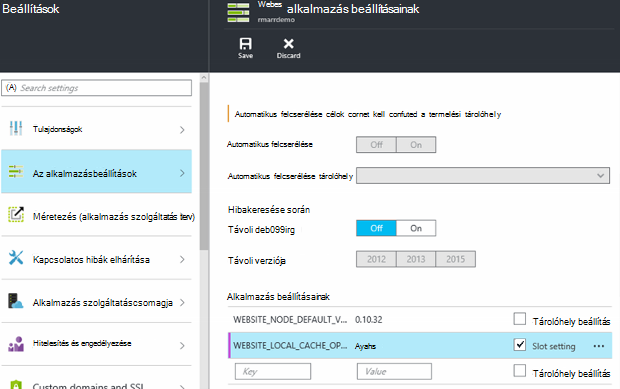

<properties
   pageTitle="Azure alkalmazás szolgáltatás helyi gyorsítótár áttekintése |} Microsoft Azure"
   description="Ez a cikk ismerteti, hogy miként engedélyezheti, átméretezése és az Azure alkalmazás szolgáltatás helyi gyorsítótár-szolgáltatás állapotát a lekérdezés"
   services="app-service"
   documentationCenter="app-service"
   authors="SyntaxC4"
   manager="yochayk"
   editor=""
   tags="optional"
   keywords=""/>

<tags
   ms.service="app-service"
   ms.devlang="multiple"
   ms.topic="article"
   ms.tgt_pltfrm="na"
   ms.workload="na"
   ms.date="03/04/2016"
   ms.author="cfowler"/>

# <a name="azure-app-service-local-cache-overview"></a>Azure alkalmazás szolgáltatás helyi gyorsítótár – áttekintés

Azure web app tartalom Azure tároló tárolja, és fel van jelenik meg, a tartalom megosztása tartósan. A tervezés célja, hogy az alkalmazások számos dolgozni, és rendelkezik az alábbi attribútumokkal:  

* A webalkalmazás virtuális gép (virtuális) példányai megoszthatja a tartalmat.
* A tartalom és web Apps alkalmazások futtatásával módosítható.
* Naplófájlok és a diagnosztikai adatfájlok érhetők el a megosztott tartalom mappába.
* Közzététel közvetlenül az új tartalom frissíti a tartalom mappát. Azonnal megtekintheti ugyanazt a tartalmat a SCM webhely és a futó web app (általában néhány technológiák, például ASP.NET kezdeti fázisa web app újra kell indítani a módosításokat, megkapja a legfrissebb tartalmat fájl).

Sok web Apps alkalmazások használata a egyikét vagy mindegyikét ezeket a funkciókat, miközben néhány web Apps alkalmazások csak meg kell egy nagy teljesítményű, csak olvasható tartalom áruházba, azok futtathatja a magas rendelkezésre. Az alkalmazások egy adott helyi gyorsítótár virtuális példánya előnyeivel.

Az Azure alkalmazás szolgáltatás helyi gyorsítótár-szolgáltatás a tartalom webes szerepkör nézet nyújt. A tartalom írási – de-elvetése gyorsítótárat a webhely indításkor aszinkron létrehozott tárterület-tartalom. Amikor készen áll a gyorsítótár, a webhely lettek a gyorsítótárban tárolt tartalmán futtathatja. Helyi gyorsítótár futó Web Apps alkalmazások van, a következő előnyökkel jár:

* Azok a tartalom Azure tárolón elérésekor kérni előforduló késések hagyja.
* Azok a tervezett frissítéseket vagy tervezett szerint és bármely más megszakadása Azure adathordozós, amelyek a tartalom megosztást szolgálják kiszolgálókon előforduló hagyja.
* Kevesebb alkalmazás újraindítása tároló megosztás módosításainak köszönhetően rendelkeznek.

## <a name="how-local-cache-changes-the-behavior-of-app-service"></a>Helyi gyorsítótár változás hatása az alkalmazás szolgáltatás működését

* Helyi gyorsítótár egy példányát a web app mappái /site és /siteextensions. A web app indításkor virtuális helyi példány létrehozása. Egy webalkalmazás helyi gyorsítótár mérete legfeljebb 300 MB alapértelmezés szerint, de legfeljebb 1 GB is növelése.
* Helyi gyorsítótár írási és olvasási. Minden változtatást azonban elvesznek a web app virtuális gépeken futó helyezi át vagy újraindítása kap. Helyi gyorsítótár alkalmazások, a tartalom tárolása kulcsfontosságú adatok tárolására szolgáló nem kell használni.
* Web Apps alkalmazások naplófájlok és a diagnosztikai adatok írni, mint jelenleg is. Naplófájlok és az adatok, azonban is tárol a virtuális. Ezután másolja őket fölé rendszeres a megosztott tartalom áruházból. A megosztott tartalom áruház példány a legjobb munkamennyiség – írási biztonsági készít elveszhetnek határidő egy virtuális példány hirtelen összeomlik.
* Az adatok és a naplófájlok mappák helyi gyorsítótár használó web Apps alkalmazások mappa szerkezetében változás esetén. Hajtsa végre az "egyedi azonosító" + időbélyeg elnevezési minta tároló naplófájlok és az adatok mappákban most már vannak almappák. Minden egyes a almappák megfelel egy virtuális-példányt, amelyen a web app fut, vagy futtatását.  
* A web app – közzétételi mechanizmusok közzétételi módosítások a megosztott tartalom áruház teszi közzé. Ez a működés, mert azt szeretné, hogy a közzétett tartalom tartós lesz. Frissítheti a web App helyi gyorsítótár, hogy újra kell indítani. Ezzel tűnhet nem például egy fölösleges lépés? Ahhoz, hogy a életciklusáról gördülékeny, információ, a jelen cikk.
* Helyi gyorsítótár D:\Home fog mutatni. Mutasson az ideiglenes virtuális adott tárolási D:\Local továbbra is.
* Az alapértelmezett tartalom nézet a SCM webhely továbbra is, hogy a megosztott tartalom áruház.

## <a name="enable-local-cache-in-app-service"></a>Helyi gyorsítótár-szolgáltatás alkalmazás engedélyezése

Helyi gyorsítótár fenntartott alkalmazás beállításainak kombinációi használatával állítja be. Ezek a beállítások alkalmazást beállíthatja az alábbi módszerekkel:

* [Azure portál](#Configure-Local-Cache-Portal)
* [Azure erőforrás-kezelő](#Configure-Local-Cache-ARM)

### <a name="configure-local-cache-by-using-the-azure-portal"></a>Helyi gyorsítótár beállítása a Azure portál használatával
<a name="Configure-Local-Cache-Portal"></a>

Ez a beállítás alkalmazás használatával per-– webalkalmazás alapon engedélyezése helyi gyorsítótár:`WEBSITE_LOCAL_CACHE_OPTION` = `Always`  



### <a name="configure-local-cache-by-using-azure-resource-manager"></a>Helyi gyorsítótár beállítása erőforrás-kezelő Azure használatával
<a name="Configure-Local-Cache-ARM"></a>

```
...

{
    "apiVersion": "2015-08-01",
    "type": "config",
    "name": "appsettings",
    "dependsOn": [
        "[resourceId('Microsoft.Web/sites/', variables('siteName'))]"
    ],
    "properties": {
        "WEBSITE_LOCAL_CACHE_OPTION": "Always",
        "WEBSITE_LOCAL_CACHE_SIZEINMB": "300"
    }
}

...
```

## <a name="change-the-size-setting-in-local-cache"></a>Helyi gyorsítótár méretét beállításainak módosítása

Alapértelmezés szerint a helyi gyorsítótár mérete **300 MB**. Ide tartoznak a /site és a tartalom áruházból kimásolt /siteextensions mappák, valamint a helyi meghajtóra létrehozott naplók és az adatok mappák. Ha növelni szeretné ezt a korlátot, használja az alkalmazás beállítása `WEBSITE_LOCAL_CACHE_SIZEINMB`. Egy webalkalmazás legfeljebb **1 GB** (1 000 MB) méretének növelése

## <a name="best-practices-for-using-app-service-local-cache"></a>Ajánlott eljárások az alkalmazás szolgáltatás helyi gyorsítótár használatához

Azt javasoljuk, hogy helyi gyorsítótár alkalmazásban használható együtt a [Fejlesztői környezet](../app-service-web/web-sites-staged-publishing.md) funkciót.

* Adja hozzá a _Beragadó_ alkalmazás beállítást `WEBSITE_LOCAL_CACHE_OPTION` értékkel `Always` a **termelési** tárolóhely szeretne. Ha használni szeretné `WEBSITE_LOCAL_CACHE_SIZEINMB`, hozzáadhat egy öntapadós a termelési tárolóhely beállítást.
* Hozzon létre egy **átmeneti** tárolóhely, és tegye közzé a fejlesztői tárolóhely. Az átmeneti tárolásra szolgáló tárolóhely használata a helyi gyorsítótár ahhoz, hogy ha a helyi gyorsítótár előnyei a termelési tárolóhely átmeneti tárolására szolgáló zökkenőmentes Szerkesztés üzembe vizsgálat életciklusát ismertető általában nem beállítva.
*   Tesztelje a webhelyen a fejlesztői tárolóhely szemben.  
*   Ha készen áll, hiba az [felcserélése művelet](../app-service-web/web-sites-staged-publishing.md#to-swap-deployment-slots) a fejlesztői és munkakörnyezeti helyek között.  
*   Öntapadós beállítások közé tartoznak a nevét, és szeretne egy tárolóhely öntapadós. Úgy a fejlesztői tárolóhely éles kap cserélni, amikor azt öröklik a helyi gyorsítótár app beállításait. Az újonnan felcserélt gyártási tárolóhely néhány perc múlva szemben a helyi gyorsítótár fog futni és fog kell bemelegíteni tárolóhely warmup részeként felcserélése után. Ezért a tárolóhely felcserélése befejeződése után a termelési tárolóhely fog futni szemben a helyi gyorsítótár.

## <a name="frequently-asked-questions-faq"></a>Gyakori kérdések

### <a name="how-can-i-tell-if-local-cache-applies-to-my-web-app"></a>Hogyan állapítható meg, ha a helyi gyorsítótár vonatkozik-e a web App alkalmazásban?

Ha a web app van szüksége a nagy teljesítményű, a megbízható tartalom áruházból, nem használja a tartalom tároló futásidőben kritikus adatok írásához és 1 GB-nál kisebb teljes méretű, akkor a választ kérdésére, "Igen"! Ha a /site és /siteextensions mappák összesített méretét, a webhely bővítmény "Azure Web Apps alkalmazások lemezen használatát" is használhatja.  

### <a name="how-can-i-tell-if-my-site-has-switched-to-using-local-cache"></a>Hogyan állapítható meg, ha a saját hely a helyi gyorsítótár használatával váltott?

Ha használni szeretné a helyi gyorsítótár-szolgáltatás fejlesztői környezet, a csere működését nem teljes mindaddig, amíg a helyi gyorsítótár bemelegíteni van. Annak ellenőrzéséhez, hogy a webhely szemben a helyi gyorsítótár fut-e, jelölje be a dolgozó folyamat környezeti változó `WEBSITE_LOCALCACHE_READY`. Járjon [dolgozó folyamat környezeti változó](https://github.com/projectkudu/kudu/wiki/Process-Threads-list-and-minidump-gcdump-diagsession#process-environment-variable) lapon a dolgozó folyamat környezeti változó több példányon eléréséhez.  

### <a name="i-just-published-new-changes-but-my-web-app-does-not-seem-to-have-them-why"></a>Csak közzétett egyesíthető változtatás, de nem úgy tűnik, hogy a saját webalkalmazás. miért?

Ha a web app helyi gyorsítótár használ, majd meg kell indítani a webhelyen a legutóbbi változások beolvasása. Nem szeretné módosításainak közzététele egy gyártási webhelyen? Az előző felsorolt ajánlott eljárások a tárolóhely beállítás látható.

### <a name="where-are-my-logs"></a>Hol találhatók a naplókat?

A helyi gyorsítótárból a naplók és az adatok mappák eltér kissé. Azonban az almappák felépítésének változatlan marad, azzal a különbséggel, hogy az almappákat is nestled azt az almappát, a formátum "egyedi virtuális azonosító" + időbélyeg csoportjában.

### <a name="i-have-local-cache-enabled-but-my-web-app-still-gets-restarted-why-is-that-i-thought-local-cache-helped-with-frequent-app-restarts"></a>Helyi gyorsítótár engedélyezve van, de a webalkalmazásban is kap újraindítása. Miért történik ez? E gondolatot helyi gyorsítótár segíteni a gyakori alkalmazás újraindítása.

Helyi gyorsítótár megelőzése érdekében a tárhely kapcsolatos web app újraindítása. Azonban a web app sikerült továbbra is alá újraindul a virtuális a tervezett infrastruktúra frissítéskor. A teljes alkalmazás újraindítása helyi gyorsítótár engedélyezve fellépő kevesebb kell lennie.
