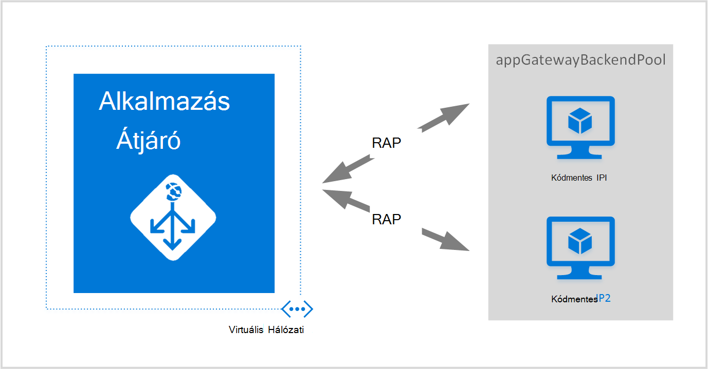
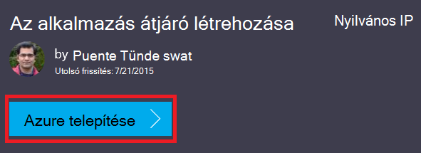
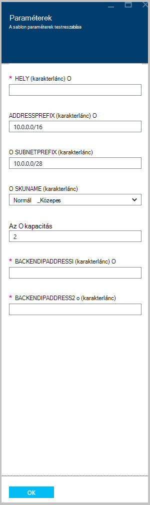

<properties
   pageTitle="Az alkalmazás átjáró létrehozása az Azure erőforrás-kezelő használatával történő |} Microsoft Azure"
   description="Ezen az oldalon útmutatás az Azure alkalmazás átjáró létrehozása az Azure erőforrás-kezelő sablon használatával"
   documentationCenter="na"
   services="application-gateway"
   authors="georgewallace"
   manager="carmonm"
   editor="tysonn"/>
<tags
   ms.service="application-gateway"
   ms.devlang="na"
   ms.topic="article"
   ms.tgt_pltfrm="na"
   ms.workload="infrastructure-services"
   ms.date="10/25/2016"
   ms.author="gwallace"/>

# Az alkalmazás átjáró létrehozása az Azure erőforrás-kezelő sablon használatával

> [AZURE.SELECTOR]
- [Azure portál](application-gateway-create-gateway-portal.md)
- [Azure erőforrás-kezelő PowerShell](application-gateway-create-gateway-arm.md)
- [Azure klasszikus PowerShell](application-gateway-create-gateway.md)
- [Erőforrás-kezelő Azure-sablon](application-gateway-create-gateway-arm-template.md)
- [Azure CLI](application-gateway-create-gateway-cli.md)

Azure alkalmazás az átjáró az egy réteg-7 terheléselosztó. A feladatátvétel HTTP-kérések teljesítmény továbbítása különböző kiszolgálók között, akár a helyszíni vagy felhőalapú biztosít. Alkalmazás átjáró sok teszi alkalmazás kézbesítési vezérlő LÉPETT funkciói, köztük a HTTP terheléselosztás cookie-alapú munkamenet affinitás, Secure Sockets Layer (SSL) kiürítése, egyéni állapot szondákat, több webhelyen támogatása és számos más. Ha a támogatott szolgáltatások listáját, látogasson el az [Alkalmazás átjáró – áttekintés](application-gateway-introduction.md)

Megismerheti, hogy hogyan töltse le és GitHub a meglévő erőforrás-kezelő Azure sablon módosítása és üzembe GitHub, a PowerShell és az Azure CLI a sablont.

Ha egyszerűen telepít, az erőforrás-kezelő Azure sablon közvetlenül a módosítások nélkül GitHub, ugorjon a üzembe GitHub található sablonból.

## Eset

Ebben az esetben fognak:

- Hozzon létre egy alkalmazás átjáró két példánya.
- Hozzon létre egy virtuális hálózati nevű VirtualNetwork1 10.0.0.0/16 fenntartott CIDR blokkja a.
- A CIDR sávként 10.0.0.0/28 használó Appgatewaysubnet nevű alhálózat létrehozása.
- Két beállítása korábban beállított háttéradatbázist IP-címei a webes kiszolgálók terhelését szeretné a forgalmat. Sablon ebben a példában a háttéradatbázist IP-címei pedig 10.0.1.10 10.0.1.11.

>[AZURE.NOTE] Ezeket a beállításokat a paraméterek sablon. Ha testre szeretné szabni a sablon, módosíthatja a szabályokat, a figyelő és az SSL, amely megnyitja az azuredeploy.json.

## Töltse le, és megértette az erőforrás-kezelő Azure-sablon

A meglévő erőforrás-kezelő Azure sablon létrehozása egy virtuális hálózati és két alhálózat GitHub, végezze el a módosításokat, előfordulhat, hogy szeretné használni, és felhasználhatja töltheti le. Ha igen, kövesse az alábbi lépéseket:

1. Nyissa meg az [alkalmazás átjáró létrehozása](https://github.com/Azure/azure-quickstart-templates/tree/master/101-application-gateway-create).
2. Kattintson a **azuredeploy.json**, és kattintson a **nyers**.
3. Mentse a fájlt a számítógépen egy helyi mappába.
4. Ha ismeri a Azure erőforrás-kezelő sablonokat, ugorjon a 7.
5. Nyissa meg a mentett fájlt, és tekintse meg a **Paraméterek** sorban 5 tartalmát. Azure erőforrás-kezelő sablon paramétereivel helyőrző értékeket, a telepítés során kitölthető.

  	| Paraméter | Leírás |
  	|---|---|
  	| **hely** | Ha az alkalmazás átjáró létrejön Azure terület |
  	| **VirtualNetwork1** | Az új virtuális hálózat nevét |
  	| **addressPrefix** | A virtuális hálózat CIDR formátumban címterület használatára |
  	| **ApplicationGatewaysubnet** | Az alkalmazás átjáró alhálózat neve |
  	| **subnetPrefix** | Az alkalmazás átjáró alhálózat CIDR tiltása |
  	| **skuname** | Termékváltozat példány mérete |
  	| **kapacitás** | Példányainak száma |
  	| **backendaddress1** | Az első webkiszolgáló IP-címe |
  	| **backendaddress2** | A második webkiszolgáló IP-címe |

    >[AZURE.IMPORTANT] Azure erőforrás-kezelő sablonok karbantartása GitHub az adott idő alatt módosíthatja. Győződjön meg arról, hogy használat előtt jelölje be a sablont.

6. Jelölje be a tartalom **erőforrások** csoportban, és figyelje meg a következőket:

    - **Írja be**. A sablon által létrehozott erőforrás típusú. Ebben az esetben a típus is **Microsoft.Network/applicationGateways**, amely egy alkalmazás átjáró képviseli.
    - **nevét**. Az erőforrás neve. Figyelje meg a **[parameters('applicationGatewayName')]**, ami azt jelenti, hogy, hogy a név van megadva, bemeneteként, illetve paraméter fájl a telepítés során használatát.
    - **Tulajdonságok**. Az erőforrás tulajdonságok listája. Ezzel a sablonnal alkalmazás átjáró létrehozása során a virtuális hálózati és nyilvános IP-címet használja.

7. Lépjen vissza [https://github.com/Azure/azure-quickstart-templates/blob/master/101-application-gateway-create/](https://github.com/Azure/azure-quickstart-templates/blob/master/101-application-gateway-create).
8. Kattintson a **azuredeploy-paremeters.json**, és kattintson a **nyers**.
9. Mentse a fájlt a számítógépen egy helyi mappába.
10. Nyissa meg a mentett fájlt, és a paraméterek értékeinek szerkesztése. A következő értékeket használja az alkalmazás átjáró a forgatókönyv ismertetett telepítéséhez.

        {
        "$schema": "http://schema.management.azure.com/schemas/2015-01-01/deploymentParameters.json#",
        {
        "location" : {
        "value" : "West US"
        },
        "addressPrefix": {
        "value": "10.0.0.0/16"
        },
        "subnetPrefix": {
        "value": "10.0.0.0/24"
        },
        "skuName": {
        "value": "Standard_Small"
        },
        "capacity": {
        "value": 2
        },
        "backendIpAddress1": {
        "value": "10.0.1.10"
        },
        "backendIpAddress2": {
        "value": "10.0.1.11"
        }
        }

11. Mentse a fájlt. A JSON-sablon és a paraméter sablon JSON érvényességi online eszközök, például [JSlint.com](http://www.jslint.com/)használatával tesztelheti.

## Az erőforrás-kezelő Azure-sablon üzembe PowerShell használatával

Ha még sosem használt Azure PowerShell, megtudhatja, [hogy miként telepítheti, állíthatja Azure PowerShell](../powershell-install-configure.md) , és az utasításokat követve jelentkezzen be az Azure, és jelölje ki azt az előfizetést.

### Lépés: 1

    Login-AzureRmAccount

### Lépés: 2

Jelölje be az előfizetések a fiókhoz.

    Get-AzureRmSubscription

A hitelesítő adatokkal hitelesítést végezni kéri.

### 3 lépés

A használandó Azure előfizetések kiválasztása.

    Select-AzureRmSubscription -Subscriptionid "GUID of subscription"

### Lépés: 4

Ha szükséges, hozzon létre egy erőforrás csoportot a **New-AzureResourceGroup** parancsmag használatával. A következő példában a AppgatewayRG nevű kelet USA-beli hely erőforráscsoport létrehozása.

    New-AzureRmResourceGroup -Name AppgatewayRG -Location "East US"

Az új virtuális hálózati telepítse az előző sablon és a letöltött és módosított paraméter fájlok segítségével a **New-AzureRmResourceGroupDeployment** parancsmag futtatásával.

    New-AzureRmResourceGroupDeployment -Name TestAppgatewayDeployment -ResourceGroupName AppgatewayRG `
        -TemplateFile C:\ARM\azuredeploy.json -TemplateParameterFile C:\ARM\azuredeploy-parameters.json

## Az erőforrás-kezelő Azure-sablon telepítése az Azure CLI használatával

Erőforrás-kezelő Azure meg a letöltött sablont Azure CLI használatával telepítéséhez kövesse az alábbi lépéseket:

### Lépés: 1

Ha még sosem használt Azure CLI, olvassa el a [Telepítse és állítsa be az Azure CLI](../xplat-cli-install.md) , és kövesse a képernyőn megjelenő utasításokat a pont, ahol be az Azure-fiók és az előfizetés felfelé.

### Lépés: 2

Futtassa az erőforrás-kezelő mód, váltson a **azure konfiguráció mód** parancsot, alább látható módon.

    azure config mode arm

Az alábbiakban a várt eredménye a fenti parancs:

    info:   New mode is arm

### 3 lépés

Ha szükséges, futtassa a **azure csoport létrehozása** parancsot hozzon létre egy új erőforráscsoport alább látható módon. Figyelje meg a parancs. A kimenet után megjelenik a paramétereket ismerteti. Az erőforrás csoportok kapcsolatos további tudnivalókért látogassa meg [Azure erőforrás szolgáltatásának áttekintése](../azure-resource-manager/resource-group-overview.md).

    azure group create -n appgatewayRG -l eastus

**-n (vagy--neve)**. Az új erőforráscsoport nevét. A esetben célszerű *appgatewayRG*.

**-l (vagy--helyről)**. Azure terület, ahol az új erőforráscsoport jön létre. A esetben célszerű *eastus*.

### Lépés: 4

Futtassa **telepítési azure csoport létrehozása** az új virtuális hálózati telepítse a sablon és a paraméterek fájlokat töltötte le, és a fenti módosított segítségével. A kimenet után megjelenik a paramétereket ismerteti.

    azure group deployment create -g appgatewayRG -n TestAppgatewayDeployment -f C:\ARM\azuredeploy.json -e C:\ARM\azuredeploy-parameters.json

## Az erőforrás-kezelő Azure-sablon üzembe telepítéséhez kattintson használatával

Másik lehetőségként Azure erőforrás-kezelő sablonok telepítéséhez kattintson. Sablonok használata a Azure portál ugyanígy.

### Lépés: 1

Nyissa meg a [nyilvános IP-alkalmazás átjáró létrehozása](https://azure.microsoft.com/documentation/templates/101-application-gateway-public-ip/).

### Lépés: 2

Kattintson a **telepítse az Azure**.

### 3 lépés

Adja meg a paraméterek a telepítési sablon a portálon, és kattintson az **OK gombra**.

### Lépés: 4

Jelölje ki a **jogi feltételeket** , és kattintson a **vásárolni**.

### 5 lépésben

Az egyéni telepítés lap kattintson a **Létrehozás**gombra.

## Következő lépések

Ha szeretné az SSL kiürítése konfigurálása, [konfigurálása az SSL-alkalmazás átjáró, kiürítése](application-gateway-ssl.md)című témakört.

Az alkalmazás átjáró használata egy belső terheléselosztó beállítása, című témakörben olvashat [létrehozása egy alkalmazás átjárónak belső terheléselosztó (ILB)](application-gateway-ilb.md).

Ha azt szeretné, hogy további információt az általános betöltése terheléselosztó beállítások, látogasson el:

- [Azure terheléselosztó](https://azure.microsoft.com/documentation/services/load-balancer/)
- [Azure forgalom Manager](https://azure.microsoft.com/documentation/services/traffic-manager/)
