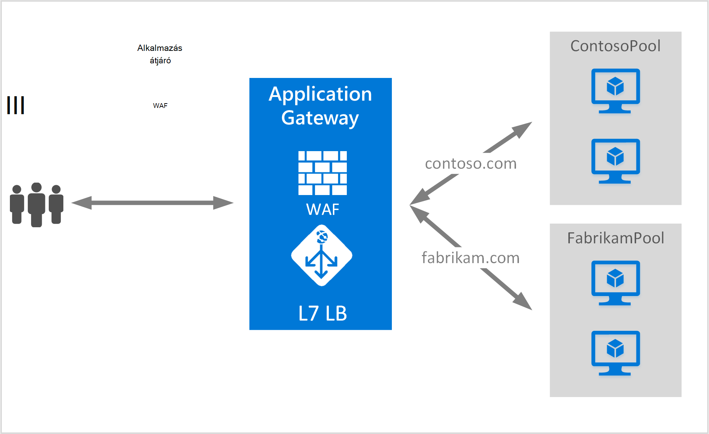

<properties
   pageTitle="A több webhelyeket tároló-alkalmazás átjáró létrehozása |} Microsoft Azure"
   description="Ezen az oldalon útmutatás hozhat létre, adjon meg egy Azure alkalmazás átjárót azonos átjáró több webalkalmazások elhelyezésére."
   documentationCenter="na"
   services="application-gateway"
   authors="amsriva"
   manager="rossort"
   editor="amsriva"/>
<tags
   ms.service="application-gateway"
   ms.devlang="na"
   ms.topic="article"
   ms.tgt_pltfrm="na"
   ms.workload="infrastructure-services"
   ms.date="10/25/2016"
   ms.author="amsriva"/>

# Több webalkalmazások elhelyezésére-alkalmazás átjáró létrehozása

> [AZURE.SELECTOR]
- [Azure portál](application-gateway-create-multisite-portal.md)
- [Azure erőforrás-kezelő PowerShell](application-gateway-create-multisite-azureresourcemanager-powershell.md)

Több webhely-üzemeltető lehetővé teszi a azonos alkalmazás átjáró egynél több webes alkalmazás telepítéséhez. Határozza meg, mely figyelő szeretné fogadni forgalmat a bejövő HTTP-kérés host fejlécének jelenlétét támaszkodik. A figyelő majd a szabályok definícióban az átjáró konfigurált arra utasítja megfelelő kódmentes alkalmazáskészlet-alapú forgalmat. Az SSL engedélyezve van a webalkalmazások alkalmazás átjáró választhatja ki a megfelelő figyelő a webes forgalmat a kiszolgáló neve megjelölése (SNI) bővítmény támaszkodik. A közös elhelyezésére több webhely használata másik háttéradatbázis kiszolgáló készletek különböző webes tartományok egyenleg kérelem betöltéséhez. Ugyanígy több altartományokat azonos legfelső szintű tartomány is szerepeltethetők az alkalmazás az átjárón.

## Eset

A következő példában alkalmazás átjáró van szolgáló contoso.com és fabrikam.com irányítja a két háttér-kiszolgálón készletek: contoso kiszolgáló készlet és fabrikam kiszolgáló készlet. Hasonló beállítási host altartományokat, mint app.contoso.com és blog.contoso.com használhatóak.

## Első lépések

1. A webes Platform telepítő használatával telepítse az Azure PowerShell-parancsmagok legújabb verzióját. Töltse le, és telepítse a legújabb verzióját a **Windows PowerShell** szakaszáról [letöltések oldalt](https://azure.microsoft.com/downloads/).
2. A kiszolgálókat, az alkalmazás átjáró használni a háttéradatbázist készletbe felvenni léteznie kell, vagy a végpontjaikat létrehozott vagy a virtuális hálózaton külön alhálózathoz vagy egy nyilvános IP/virtuális kiosztani.

## Követelmények

- **Háttéradatbázist kiszolgáló készlet:** A háttér-kiszolgálók IP-címek listája. Az IP-címek szerepel a listában vagy tartozzanak a virtuális alhálózathoz, vagy egy nyilvános IP virtuális kell lennie. Teljesen minősített tartománynév is használható.
- **Háttéradatbázist készlet kiszolgálóbeállítások:** Minden készlet beállításokat, például a port, protokoll és cookie-alapú affinitás tartalmaz. Ezeket a beállításokat is tartozik egy csoportba, és alkalmazott összes kiszolgálón a készlet belül.
- **Előtér-port:** Ez a portja a nyilvános olyan portot alkalmazás átjáró megnyitott. Forgalmat a port találatok, és kattintson az egyik a háttéradatbázist kiszolgálók átirányítását.
- **Figyelő:** A figyelő előtér-port, protokoll van (Http vagy Https, ezek az értékek-és nagybetűk), és a SSL-tanúsítvány nevét (ha kiürítése SSL beállítása). Az átjárók több webhelyen engedélyezett alkalmazás, a host name és SNI jelölők is kerülnek.
- **Szabály:** A szabály figyelő, a háttéradatbázist kiszolgáló készlet köti és határozza meg, mely a forgalmat szeretné irányítani, amikor találatok száma a egy adott figyelő háttéradatbázist kiszolgáló készlet.

## Az alkalmazás átjáró létrehozása

Az alábbiakban az alkalmazás átjáró létrehozásához szükséges lépéseket:

1. Erőforráscsoport létrehozása az erőforrás parancsra.
2. Hozzon létre egy virtuális hálózati alhálózat és az alkalmazás átjáró nyilvános IP.
3. Hozzon létre egy alkalmazás átjáró konfigurációs objektumot.
4. Hozzon létre egy alkalmazás átjáró erőforrás.

## Erőforráscsoport az erőforrás-kezelő létrehozása

Győződjön meg arról, hogy az Azure PowerShell legújabb verzióját használja. További információt [A Windows PowerShell használatá az erőforrás-kezelő](../powershell-azure-resource-manager.md)címen érhető el.

### Lépés: 1

Bejelentkezés az Azure

    Login-AzureRmAccount

A hitelesítő adatokkal hitelesítést végezni kéri.

### Lépés: 2

Jelölje be az előfizetések a fiókhoz.

    Get-AzureRmSubscription

### 3 lépés

A használandó Azure előfizetések kiválasztása.

    Select-AzureRmSubscription -SubscriptionName "Name of subscription"

### Lépés: 4

Erőforráscsoport (Ez a lépés erőforrás meglévő csoport használata kihagyja) létrehozása.

    New-AzureRmResourceGroup -Name appgw-RG -location "West US"

Azt is megteheti is készíthet címkéket alkalmazás átjáró erőforráscsoport:

    $resourceGroup = New-AzureRmResourceGroup -Name appgw-RG -Location "West US" -Tags @{Name = "testtag"; Value = "Application Gateway multiple site"}

Azure erőforrás-kezelő igényel, hogy az összes erőforráscsoport adjon meg egy helyet. Ezen a helyen az erőforrások erőforráscsoport az alapértelmezett hely szolgál. Győződjön meg arról, hogy minden parancs az alkalmazás átjáró létrehozása az azonos erőforráscsoport.

A fenti példában létrehozott egy úgynevezett "appgw-RG" a "US nyugati" helye erőforráscsoport.

>[AZURE.NOTE] Állítsa be az alkalmazás átjáró egy egyéni vizsgálati van szüksége, ha a [létrehozása egy PowerShell használatával egyéni szondákat alkalmazás átjárónak](application-gateway-create-probe-ps.md)témakörben találhat. Látogasson el az [egyéni szondákat és a rendszerállapot figyelése](application-gateway-probe-overview.md) további információt.

## Hozzon létre egy virtuális hálózati és alhálózat

A következő példa bemutatja, hogyan hozhat létre virtuális hálózat erőforrás-kezelő használatával. Két alhálózat ebben a lépésben jönnek létre. Az első alhálózat van az alkalmazás átjáró magát. Alkalmazás átjáró tartása a példányok saját alhálózat szükséges. Egyéb alkalmazások átjárókat csak az adott alhálózat elvégezhető. A második alhálózat az alkalmazáskiszolgálók kódmentes tárolására szolgál.

### Lépés: 1

A cím tartomány 10.0.0.0/24 rendelhet a alhálózat változó használható az alkalmazás átjáró tárolásához.

    $subnet = New-AzureRmVirtualNetworkSubnetConfig -Name appgatewaysubnet -AddressPrefix 10.0.0.0/24

### Lépés: 2

A cím tartomány 10.0.1.0/24 rendelhet a kódmentes készletek használandó Alhalozat_2 változó.

    $subnet2 = New-AzureRmVirtualNetworkSubnetConfig -Name backendsubnet -AddressPrefix 10.0.1.0/24

### 3 lépés

Hozzon létre egy virtuális hálózati csoport "appgw-rg erőforrás" a "appgwvnet" nevű a nyugati USA-beli területhez tartozik, az előtag 10.0.0.0/16 használata alhálózat 10.0.0.0/24, és 10.0.1.0/24.

    $vnet = New-AzureRmVirtualNetwork -Name appgwvnet -ResourceGroupName appgw-RG -Location "West US" -AddressPrefix 10.0.0.0/16 -Subnet $subnet,$subnet2

### Lépés: 4

Rendelje hozzá a következő lépésekkel egy alhálózat változó amely hoz létre egy alkalmazás átjáró.

    $appgatewaysubnet = Get-AzureRmVirtualNetworkSubnetConfig -Name appgatewaysubnet -VirtualNetwork $vnet
    $backendsubnet = Get-AzureRmVirtualNetworkSubnetConfig -Name backendsubnet -VirtualNetwork $vnet

## Hozzon létre egy nyilvános IP-címet az előtér-konfiguráció

Hozzon létre egy nyilvános IP-erőforrás erőforrás csoport "appgw-rg" USA-beli nyugati régió "publicIP01".

    $publicip = New-AzureRmPublicIpAddress -ResourceGroupName appgw-RG -name publicIP01 -location "West US" -AllocationMethod Dynamic

IP-címet az alkalmazás átjáró van hozzárendelve, a szolgáltatás indításakor.

## Alkalmazásbeállítások átjáró létrehozása

Az alkalmazás átjáró létrehozása előtt be kell állítania az összes konfigurációs elemek. Az alábbi lépésekkel létrehozása a konfigurációs elemek, amelyek egy alkalmazás átjáró erőforrás van szükség.

### Lépés: 1

Hozzon létre egy alkalmazás gateway IP-konfiguráció "gatewayIP01" nevű. Átjáró alkalmazás indításakor felveszi a alhálózat állítva az IP-címet, és az IP-címek a háttéradatbázist IP-készletre irányítja a hálózati forgalmának engedélyezésére. Ne feledje, hogy az egyes példányok vegye egy IP-címet.

    $gipconfig = New-AzureRmApplicationGatewayIPConfiguration -Name gatewayIP01 -Subnet $appgatewaysubnet

### Lépés: 2

Konfigurálni a háttéradatbázist IP cím készletet "pool01" és "pool2" IP-címek nevű "10.0.1.100, 10.0.1.101,10.0.1.102" "pool1" és "10.0.1.103 10.0.1.104, 10.0.1.105" a "pool2".

    $pool1 = New-AzureRmApplicationGatewayBackendAddressPool -Name pool01 -BackendIPAddresses 10.0.1.100, 10.0.1.101, 10.0.1.102
    $pool2 = New-AzureRmApplicationGatewayBackendAddressPool -Name pool02 -BackendIPAddresses 10.0.1.103, 10.0.1.104, 10.0.1.105

Ebben a példában a kért hely alapján hálózati forgalmat két háttéradatbázist készletek vannak. Egy készlet megkapja a forgalom "contoso.com" webhelyről, és más készlet kap forgalom "fabrikam.com" webhelyről. Ha le szeretné cserélni, az előző IP-címek hozzáadása a saját alkalmazás IP-cím végpontok. Belső IP-címek helyett is használhatja nyilvános IP-címek, FQDN vagy egy virtuális hálózati kódmentes előfordulását. Használata "-BackendFQDNs" paramétert a PowerShell használatá adja meg a teljes tartományneve, IP-címei helyett.

### 3 lépés

Alkalmazás átjáró beállítása "poolsetting01" és "poolsetting02" konfigurálása a terheléselosztás forgalmat a háttéradatbázist készletben. Ebben a példában a háttéradatbázist készletek másik háttéradatbázis készlet beállításainak konfigurálása. Minden egyes háttéradatbázist készlet beállíthatja, hogy a saját háttéradatbázist készlet beállítást.

    $poolSetting01 = New-AzureRmApplicationGatewayBackendHttpSettings -Name "besetting01" -Port 80 -Protocol Http -CookieBasedAffinity Disabled -RequestTimeout 120
    $poolSetting02 = New-AzureRmApplicationGatewayBackendHttpSettings -Name "besetting02" -Port 80 -Protocol Http -CookieBasedAffinity Enabled -RequestTimeout 240

### Lépés: 4

Állítsa be az előtér-IP nyilvános IP-végpontot.

    $fipconfig01 = New-AzureRmApplicationGatewayFrontendIPConfig -Name "frontend1" -PublicIPAddress $publicip

### 5 lépésben

Az előtér-alkalmazás átjáró port konfigurálása.

    $fp01 = New-AzureRmApplicationGatewayFrontendPort -Name "fep01" -Port 443

### 6 lépés

Állítsa be a két SSL-tanúsítványok a a két webhelyeket támogatja az ebben a példában fogjuk. Egy tanúsítványt contoso.com forgalmához, a másik pedig fabrikam.com forgalmat. Ezek a tanúsítványok egy hitelesítésszolgáltató, saját webhelyek tanúsítványokat kell lennie. Önaláírt tanúsítványok támogatottak, de nem ajánlott, gyártás-forgalmat.

    $cert01 = New-AzureRmApplicationGatewaySslCertificate -Name contosocert -CertificateFile <file path> -Password <password>
    $cert02 = New-AzureRmApplicationGatewaySslCertificate -Name fabrikamcert -CertificateFile <file path> -Password <password>

### Lépés 7

Ebben a példában a két webhelyek két hallgatók konfigurálása Ebben a lépésben a hallgatók nyilvános IP-címet, portokkal és bejövő forgalom fogadására használt host állítja be. Hostname (állomásnév) paraméter szükség a több webhely támogatása, és a megfelelő webhely esetében, amelyek a forgalom érkezik értékre kell állítani. RequireServerNameIndication paraméter értékre kell állítani a webhelyeket, amely a támogatási szükséges SSL több host használatával igaz. Ha az SSL használatához szükséges, is kell az SSL-tanúsítvány, amellyel a forgalmat a webalkalmazás biztonságos adja meg. FrontendIPConfiguration FrontendPort és hostname (állomásnév) kombinációi figyelő egyedinek kell lennie. Minden egyes figyelő támogatniuk kell egy tanúsítványt.

    $listener01 = New-AzureRmApplicationGatewayHttpListener -Name "listener01" -Protocol Https -FrontendIPConfiguration $fipconfig01 -FrontendPort $fp01 -HostName "contoso11.com" -RequireServerNameIndication true  -SslCertificate $cert01
    $listener02 = New-AzureRmApplicationGatewayHttpListener -Name "listener02" -Protocol Https -FrontendIPConfiguration $fipconfig01 -FrontendPort $fp01 -HostName "fabrikam11.com" -RequireServerNameIndication true -SslCertificate $cert02

### Lépés 8

Ebben a példában hozott létre a két webalkalmazások két szabály beállítást. A szabályok kötelékek közös hallgatók, kódmentes készletek és a HTTP-beállításait. Ebben a lépésben konfigurálja az alkalmazás átjáró minden webhely egy egyszerű szabály használni. Minden webhely-alapú forgalmat a beállított figyelő érkezik, és van majd készletre irányítja át a beállított kódmentes, a megadott a BackendHttpSettings tulajdonságai alapján.

    $rule01 = New-AzureRmApplicationGatewayRequestRoutingRule -Name "rule01" -RuleType Basic -HttpListener $listener01 -BackendHttpSettings $poolSetting01 -BackendAddressPool $pool1
    $rule02 = New-AzureRmApplicationGatewayRequestRoutingRule -Name "rule02" -RuleType Basic -HttpListener $listener02 -BackendHttpSettings $poolSetting02 -BackendAddressPool $pool2

### Lépés 9

Állítsa be példányok és az alkalmazás átjáró méret számát.

    $sku = New-AzureRmApplicationGatewaySku -Name "Standard_Medium" -Tier Standard -Capacity 2

## Alkalmazás átjáró létrehozása

Hozzon létre egy alkalmazás átjáró az előző lépéseket minden konfigurációs objektumok.

    $appgw = New-AzureRmApplicationGateway -Name appgwtest -ResourceGroupName appgw-RG -Location "West US" -BackendAddressPools $pool1,$pool2 -BackendHttpSettingsCollection $poolSetting01, $poolSetting02 -FrontendIpConfigurations $fipconfig01 -GatewayIpConfigurations $gipconfig -FrontendPorts $fp01 -HttpListeners $listener01, $listener02 -RequestRoutingRules $rule01, $rule02 -Sku $sku -SslCertificates $cert01, $cert02

>[AZURE.IMPORTANT] Alkalmazás átjáró kiépítési időigényes művelet, és néhány időt vesz igénybe vehet.

## Átjáró DNS alkalmazásnév beszerzése

Az átjáró létrehozása után a következő lépésként az előtér-kapcsolati konfigurálása. Egy nyilvános IP használata esetén az alkalmazás átjáró dinamikusan hozzárendelt DNS nevét, amely nem rövid van szükség. Annak biztosítása érdekében a felhasználóknak az alkalmazás átjáró egy CNAME rekordot is találati használható az alkalmazás átjáró a nyilvános végpont mutasson. Az [egyéni tartománynevet az Azure-ban konfigurálása](../cloud-services/cloud-services-custom-domain-name-portal.md). Ehhez beolvashatja részleteit, az alkalmazás átjáró, valamint a társított IP/DNS nevét a PublicIPAddress elem az alkalmazás átjáró csatolt használatával. Az alkalmazás átjáró tartománynév használandó hozhat létre egy CNAME rekordot, amely a két webalkalmazások a DNS-névhez mutat. A rekordok felhasználása nem javasolt, mert a alkalmazás átjáró újra kell indítani a virtuális is megváltoztatható.
    
    Get-AzureRmPublicIpAddress -ResourceGroupName appgw-RG -Name publicIP01
        
    Name                     : publicIP01
    ResourceGroupName        : appgw-RG
    Location                 : westus
    Id                       : /subscriptions/<subscription_id>/resourceGroups/appgw-RG/providers/Microsoft.Network/publicIPAddresses/publicIP01
    Etag                     : W/"00000d5b-54ed-4907-bae8-99bd5766d0e5"
    ResourceGuid             : 00000000-0000-0000-0000-000000000000
    ProvisioningState        : Succeeded
    Tags                     : 
    PublicIpAllocationMethod : Dynamic
    IpAddress                : xx.xx.xxx.xx
    PublicIpAddressVersion   : IPv4
    IdleTimeoutInMinutes     : 4
    IpConfiguration          : {
                                 "Id": "/subscriptions/<subscription_id>/resourceGroups/appgw-RG/providers/Microsoft.Network/applicationGateways/appgwtest/frontendIP
                               Configurations/frontend1"
                               }
    DnsSettings              : {
                                 "Fqdn": "00000000-0000-xxxx-xxxx-xxxxxxxxxxxx.cloudapp.net"
                               }

## Következő lépések

Megtudhatja, hogy miként-webhelyek [alkalmazás](application-gateway-webapplicationfirewall-overview.md) átjáró – webes alkalmazás tűzfal védelme