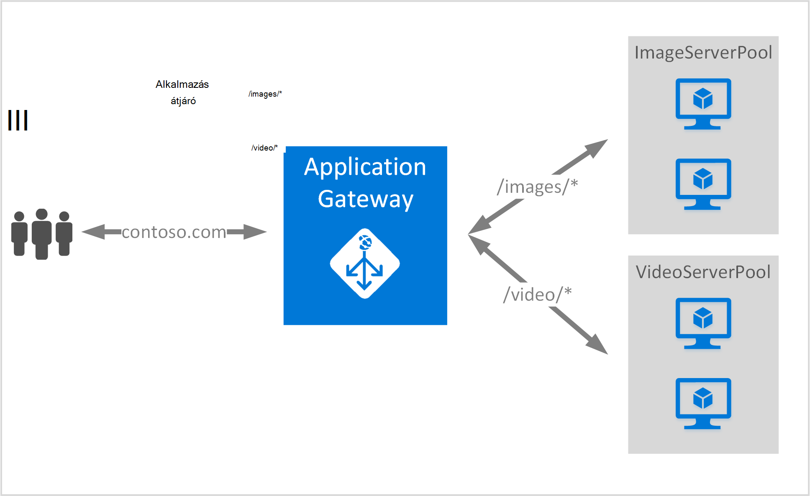

<properties
   pageTitle="Hozzon létre egy alkalmazás átjáró útválasztási szabályok URL-cím használata |} Microsoft Azure"
   description="Ezen az oldalon útmutatás hozhat létre, adjon meg egy Azure alkalmazás átjárót URL-cím útválasztási szabályok használatával"
   documentationCenter="na"
   services="application-gateway"
   authors="georgewallace"
   manager="jdial"
   editor="tysonn"/>
<tags
   ms.service="application-gateway"
   ms.devlang="na"
   ms.topic="article"
   ms.tgt_pltfrm="na"
   ms.workload="infrastructure-services"
   ms.date="10/25/2016"
   ms.author="gwallace"/>

# Az út-alapú útválasztás használatával alkalmazás átjáró létrehozása 

> [AZURE.SELECTOR]
- [Azure portál](application-gateway-create-url-route-portal.md)
- [Azure erőforrás-kezelő PowerShell](application-gateway-create-url-route-arm-ps.md)

URL-CÍMÉT az elérési út-alapú útválasztás lehetővé teszi, hogy a HTTP-kérelem URL-címe alapján útvonalak társítani. Azt ellenőrzi, hogy be van állítva az URL-cím listák az alkalmazás átjáró háttéradatbázist erőforráskészlethez tartozik út, és küldje el a hálózati forgalmat a definiált háttéradatbázist kvótáját. A közös URL-alapú útválasztás használata másik háttéradatbázis kiszolgáló készletek a különböző tartalomtípusok egyenleg kérelem betöltéséhez.

Az alkalmazás átjáró útválasztás URL-alapú vezet be egy új szabálytípust. Alkalmazás átjáró rendelkezik kétféle szabályt: egyszerű és PathBasedRouting. Egyszerű szabálytípus kívül ciklikus terjesztési PathBasedRouting közben a háttéradatbázist készletek ciklikus szolgáltatást, akkor is a kérelem URL-címének elérési_út minta figyelembe veszi a kódmentes készlet kiválasztásakor.

>[AZURE.IMPORTANT] PathPattern: A megfelelő elérési utat mintázatok listája. Minden egyes kell kezdődnie / és a csak egy "\*" engedélyezett végén. Példák /xyz, /xyz* vagy /xyz/*érvényes. A karakterlánc, hogy az elérési út matcher géppel az első után nem tartalmazhat szöveget "?" vagy "#", és azok a karakterek nem használhatók. 

## Eset
A következő példában alkalmazás átjáró van szolgáló contoso.com irányítja a két háttér-kiszolgálón készletek: videó kiszolgáló készlet és a kép kiszolgáló készlet.

Kérelem http://contoso.com/image* kép kiszolgáló készlet (pool1), és http://contoso.com/video résztvevőkhöz* résztvevőkhöz videó kiszolgáló kvótáját (pool2). Alapértelmezett kiszolgáló erőforráskészlethez tartozik (pool1) van kijelölve, ha az elérési út mintázatok egyike sem felel meg.

## Első lépések

1. A webes Platform telepítő használatával telepítse az Azure PowerShell-parancsmagok legújabb verzióját. Töltse le, és telepítse a legújabb verzióját a **Windows PowerShell** szakaszáról [letöltések oldalt](https://azure.microsoft.com/downloads/).
2. Virtuális hálózati és alhálózat alkalmazás átjáró létrehozása. Ügyeljen arra, hogy ne virtuális gépeken futó vagy felhőalapú telepítések az alhálózathoz használja. Az alkalmazás átjáró virtuális hálózati alhálózat önmagában kell lennie.
3. A hozzáadott a háttéradatbázist kvótáját használni az alkalmazás átjáró kiszolgálók léteznie kell, vagy nem végpontjaikat hozott létre a virtuális hálózaton vagy egy nyilvános IP/virtuális rendelt.

## Mi az az alkalmazás átjáró létrehozásához szükséges?

- **Háttéradatbázist kiszolgáló készlet:** A háttér-kiszolgálók IP-címek listája. Az IP-címek szerepel a listában vagy tartozzanak a virtuális alhálózathoz, vagy egy nyilvános IP virtuális kell lennie.
- **Háttéradatbázist készlet kiszolgálóbeállítások:** Minden készlet beállításokat, például a port, protokoll és cookie-alapú affinitás tartalmaz. Ezek a beállítások készletbe is tartozik, és alkalmazott összes kiszolgálón a készlet belül.
- **Előtér-port:** Ez a portja a nyilvános olyan portot alkalmazás átjáró megnyitott. Forgalmat a port találatok, és kattintson az egyik a háttéradatbázist kiszolgálók átirányítását.
- **Figyelő:** A figyelő előtér-port, protokoll van (Http vagy Https, ezek nagy-és kisbetűket), és az SSL-tanúsítvány neve (ha az SSL beállítása kiürítése).
- **Szabály:** A szabály figyelő, a háttéradatbázist kiszolgáló készlet köti és határozza meg, mely a forgalmat szeretné irányítani, amikor találatok száma a egy adott figyelő háttéradatbázist kiszolgáló készlet.

## Az alkalmazás átjáró létrehozása

Az Azure klasszikus és Azure erőforrás-kezelő közötti különbség a sorrendben, amelyben az alkalmazás átjáró és az elemeket, amelyeket kell beállítania létrehozása.

Az erőforrás-kezelő-alkalmazás átjáró ellenőrizze az összes elem külön-külön beállítva, és, majd írja az alkalmazás átjáró erőforrás létrehozása.

Íme egy alkalmazás átjáró létrehozásához szükséges lépéseket:

1. Erőforráscsoport létrehozása az erőforrás parancsra.
2. Hozzon létre egy virtuális hálózati alhálózat és az alkalmazás átjáró nyilvános IP.
3. Hozzon létre egy alkalmazás átjáró konfigurációs objektumot.
4. Hozzon létre egy alkalmazás átjáró erőforrás.

## Erőforráscsoport az erőforrás-kezelő létrehozása

Győződjön meg arról, hogy az Azure PowerShell legújabb verzióját használja. További információ a [Windows PowerShell használatá az erőforrás-kezelő](../powershell-azure-resource-manager.md)címen érhető el.

### Lépés: 1

Bejelentkezés az Azure

    Login-AzureRmAccount

A hitelesítő adatokkal hitelesítést végezni kéri. 

### Lépés: 2

Jelölje be az előfizetések a fiókhoz.

    Get-AzureRmSubscription

### 3 lépés

A használandó Azure előfizetések kiválasztása.  

    Select-AzureRmSubscription -Subscriptionid "GUID of subscription"

### Lépés: 4

Erőforráscsoport (Ez a lépés erőforrás meglévő csoport használata kihagyja) létrehozása.

    New-AzureRmResourceGroup -Name appgw-RG -Location "West US"

Azt is megteheti is készíthet címkéket alkalmazás átjáró erőforráscsoport:
    
    $resourceGroup = New-AzureRmResourceGroup -Name appgw-RG -Location "West US" -Tags @{Name = "testtag"; Value = "Application Gateway URL routing"} 

Azure erőforrás-kezelő igényel, hogy az összes erőforráscsoport adjon meg egy helyet. Ez az erőforrások erőforráscsoport az alapértelmezett helye szolgál. Győződjön meg arról, hogy minden parancs az alkalmazás átjáró létrehozása az azonos erőforráscsoport.

A fenti példában létrehozott egy úgynevezett "appgw-RG" és "US nyugati" hely erőforráscsoport.

>[AZURE.NOTE] Állítsa be az alkalmazás átjáró egy egyéni vizsgálati van szüksége, ha a [létrehozása egy PowerShell használatával egyéni szondákat alkalmazás átjárónak](application-gateway-create-probe-ps.md)témakörben találhat. Nézze meg az [egyéni szondákat és a rendszerállapot figyelése](application-gateway-probe-overview.md) további információt.

## Hozzon létre egy virtuális hálózati és az alkalmazás átjáró alhálózat

A következő példa bemutatja, hogyan hozhat létre virtuális hálózat erőforrás-kezelő használatával.

### Lépés: 1

A cím tartomány 10.0.0.0/24 rendelhet a alhálózat változó virtuális hálózat létrehozására szolgál.

    $subnet = New-AzureRmVirtualNetworkSubnetConfig -Name subnet01 -AddressPrefix 10.0.0.0/24

### Lépés: 2

Hozzon létre egy virtuális hálózati csoport "appgw-rg erőforrás" a "appgwvnet" nevű alhálózat 10.0.0.0/24 az előtag 10.0.0.0/16 használ, a nyugati USA-beli területhez tartozik.

    $vnet = New-AzureRmVirtualNetwork -Name appgwvnet -ResourceGroupName appgw-RG -Location "West US" -AddressPrefix 10.0.0.0/16 -Subnet $subnet

### 3 lépés

Rendelje hozzá a következő lépésekkel egy alhálózat változó amely hoz létre egy alkalmazás átjáró.

    $subnet=$vnet.Subnets[0]

## Hozzon létre egy nyilvános IP-címet az előtér-konfiguráció

Hozzon létre egy nyilvános IP-erőforrás erőforrás csoport "appgw-rg" USA-beli nyugati régió "publicIP01".

    $publicip = New-AzureRmPublicIpAddress -ResourceGroupName appgw-RG -name publicIP01 -location "West US" -AllocationMethod Dynamic

IP-címet az alkalmazás átjáró van hozzárendelve, a szolgáltatás indításakor.

## Alkalmazásbeállítások átjáró létrehozása

Az alkalmazás átjáró létrehozása előtt összes konfigurációs elemek állítsa be. Az alábbi lépésekkel létrehozása a konfigurációs elemek, amelyek egy alkalmazás átjáró erőforrás van szükség.

### Lépés: 1

Hozzon létre egy alkalmazás gateway IP-konfiguráció "gatewayIP01" nevű. Átjáró alkalmazás indításakor felveszi a beállított alhálózat IP-címet, és az IP-címek a háttéradatbázist IP-készletre irányítja a hálózati forgalmának engedélyezésére. Ne feledje, hogy az egyes példányok vegye egy IP-címet.

    $gipconfig = New-AzureRmApplicationGatewayIPConfiguration -Name gatewayIP01 -Subnet $subnet

### Lépés: 2

A háttéradatbázist IP cím készletbe neve "pool01" és "pool2" IP-címek konfigurálása "134.170.185.46, 134.170.188.221,134.170.185.50" a "pool1" és "134.170.186.46, 134.170.189.221,134.170.186.50" a "pool2".

    $pool1 = New-AzureRmApplicationGatewayBackendAddressPool -Name pool01 -BackendIPAddresses 134.170.185.46, 134.170.188.221,134.170.185.50

    $pool2 = New-AzureRmApplicationGatewayBackendAddressPool -Name pool02 -BackendIPAddresses 134.170.186.46, 134.170.189.221,134.170.186.50

Ebben a példában az URL-címe alapján hálózati forgalmat két háttéradatbázis készletek vannak. Egy készlet Elérési utat forgalom fogad "/ video" és forgalom kapott elérési út "/ kép" egyéb készlet. Az előző IP-címek hozzáadása a saját alkalmazás IP-cím végpontok helyére. 

### 3 lépés

Alkalmazás átjáró beállítása "poolsetting01" és "poolsetting02" konfigurálása a terheléselosztás forgalmat a háttéradatbázist készletben. Ebben a példában a háttéradatbázist készletek másik háttéradatbázis készlet beállításainak konfigurálása. Minden egyes háttéradatbázist készlet beállíthatja, hogy a saját háttéradatbázist készlet beállítást.

    $poolSetting01 = New-AzureRmApplicationGatewayBackendHttpSettings -Name "besetting01" -Port 80 -Protocol Http -CookieBasedAffinity Disabled -RequestTimeout 120

    $poolSetting02 = New-AzureRmApplicationGatewayBackendHttpSettings -Name "besetting02" -Port 80 -Protocol Http -CookieBasedAffinity Enabled -RequestTimeout 240

### Lépés: 4

Állítsa be az előtér-IP nyilvános IP-végpontot.

    $fipconfig01 = New-AzureRmApplicationGatewayFrontendIPConfig -Name "frontend1" -PublicIPAddress $publicip

### 5 lépésben 

Az előtér-alkalmazás átjáró port konfigurálása.

    $fp01 = New-AzureRmApplicationGatewayFrontendPort -Name "fep01" -Port 80
### 6 lépés

Állítsa be a figyelő. Ebben a lépésben a figyelő a nyilvános IP-cím és a bejövő hálózati forgalmának engedélyezésére fogadására használt port állítja be. 
 
    $listener = New-AzureRmApplicationGatewayHttpListener -Name "listener01" -Protocol Http -FrontendIPConfiguration $fipconfig01 -FrontendPort $fp01

### Lépés 7 

Állítsa be a háttéradatbázist készletek URL-cím szabály elérési útját. Ebben a lépésben a relatív elérési út segítségével alkalmazás átjáró között Elérési utat és a mely háttéradatbázist készlet hozzá van rendelve, miként kezelje a bejövő forgalmat a leképezés meghatározása állítja be.

Az alábbi példában a két szabályokat hoz létre: egy "/ kép /" elérési út adatforgalom háttéradatbázist "pool1" és "/ videó /" elérési út útválasztási forgalom háttéradatbázist "pool2" egy másikkal.
    
    $imagePathRule = New-AzureRmApplicationGatewayPathRuleConfig -Name "pathrule1" -Paths "/image/*" -BackendAddressPool $pool1 -BackendHttpSettings $poolSetting01

    $videoPathRule = New-AzureRmApplicationGatewayPathRuleConfig -Name "pathrule2" -Paths "/video/*" -BackendAddressPool $pool2 -BackendHttpSettings $poolSetting02

A szabály elérési útja térkép konfiguráció is konfigurálja alapértelmezett háttéradatbázist cím erőforráskészlethez tartozik, ha az elérési út nem egyezik meg valamelyik előre definiált elérési útját. 

    $urlPathMap = New-AzureRmApplicationGatewayUrlPathMapConfig -Name "urlpathmap" -PathRules $videoPathRule, $imagePathRule -DefaultBackendAddressPool $pool1 -DefaultBackendHttpSettings $poolSetting02

### Lépés 8

Hozzon létre egy szabályt beállítást. Ezt a lépést az alkalmazás átjáró URL-cím elérési út-alapú átirányításra állítja be.

    $rule01 = New-AzureRmApplicationGatewayRequestRoutingRule -Name "rule1" -RuleType PathBasedRouting -HttpListener $listener -UrlPathMap $urlPathMap

### Lépés 9

Állítsa be példányok és az alkalmazás átjáró méret számát.

    $sku = New-AzureRmApplicationGatewaySku -Name "Standard_Small" -Tier Standard -Capacity 2

## Alkalmazás átjáró létrehozása

Hozzon létre egy alkalmazás átjáró az előző lépéseket minden konfigurációs objektumok.

    $appgw = New-AzureRmApplicationGateway -Name appgwtest -ResourceGroupName appgw-RG -Location "West US" -BackendAddressPools $pool1,$pool2 -BackendHttpSettingsCollection $poolSetting01, $poolSetting02 -FrontendIpConfigurations $fipconfig01 -GatewayIpConfigurations $gipconfig -FrontendPorts $fp01 -HttpListeners $listener -UrlPathMaps $urlPathMap -RequestRoutingRules $rule01 -Sku $sku

## Átjáró DNS alkalmazásnév beszerzése

Az átjáró létrehozása után a következő lépésként az előtér-kapcsolati konfigurálása. Egy nyilvános IP használata esetén az alkalmazás átjáró dinamikusan hozzárendelt DNS nevét, amely nem rövid van szükség. Annak biztosítása érdekében a felhasználóknak az alkalmazás átjáró egy CNAME rekordot is találati használható az alkalmazás átjáró a nyilvános végpont mutasson. Az [egyéni tartománynevet az Azure-ban konfigurálása](../cloud-services/cloud-services-custom-domain-name-portal.md). Ehhez beolvashatja részleteit, az alkalmazás átjáró, valamint a társított IP/DNS nevét a PublicIPAddress elem az alkalmazás átjáró csatolt használatával. Az alkalmazás átjáró tartománynév használandó hozhat létre egy CNAME rekordot, amely a két webalkalmazások a DNS-névhez mutat. A rekordok felhasználása nem javasolt, mert a alkalmazás átjáró újra kell indítani a virtuális is megváltoztatható.
    
    Get-AzureRmPublicIpAddress -ResourceGroupName appgw-RG -Name publicIP01
        
    Name                     : publicIP01
    ResourceGroupName        : appgw-RG
    Location                 : westus
    Id                       : /subscriptions/<subscription_id>/resourceGroups/appgw-RG/providers/Microsoft.Network/publicIPAddresses/publicIP01
    Etag                     : W/"00000d5b-54ed-4907-bae8-99bd5766d0e5"
    ResourceGuid             : 00000000-0000-0000-0000-000000000000
    ProvisioningState        : Succeeded
    Tags                     : 
    PublicIpAllocationMethod : Dynamic
    IpAddress                : xx.xx.xxx.xx
    PublicIpAddressVersion   : IPv4
    IdleTimeoutInMinutes     : 4
    IpConfiguration          : {
                                 "Id": "/subscriptions/<subscription_id>/resourceGroups/appgw-RG/providers/Microsoft.Network/applicationGateways/appgwtest/frontendIP
                               Configurations/frontend1"
                               }
    DnsSettings              : {
                                 "Fqdn": "00000000-0000-xxxx-xxxx-xxxxxxxxxxxx.cloudapp.net"
                               }

## Következő lépések

Ha szeretne többet Secure Sockets Layer (SSL) kiürítése, [konfigurálása az SSL-alkalmazás átjáró, kiürítése](application-gateway-ssl-arm.md)című témakört.