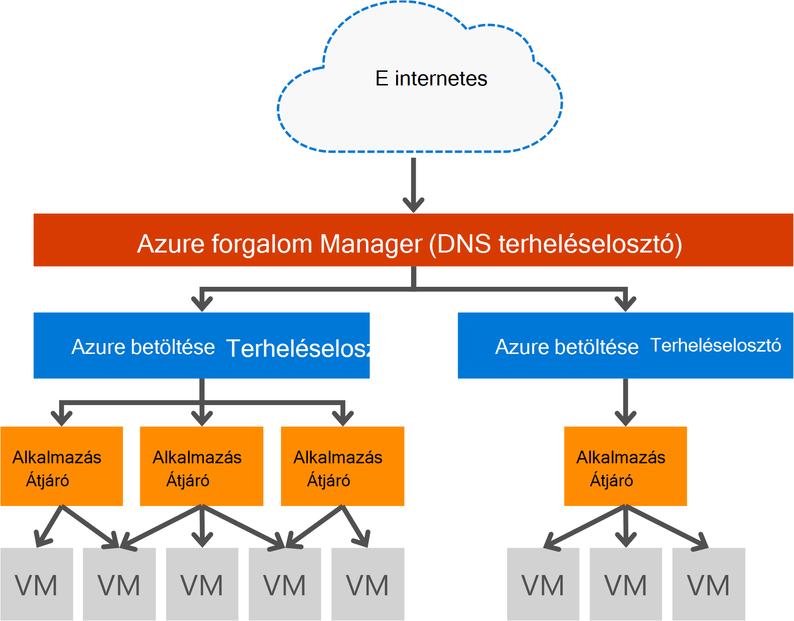

<properties
   pageTitle="Bevezetés az alkalmazás átjáró |} Microsoft Azure"
   description="Ezen az oldalon áttekintést nyújt az alkalmazás átjáró szolgáltatás réteg 7 terheléselosztás, többek között az átjáró méretű HTTP terheléselosztó, cookie-alapú munkamenet affinitás betöltése és SSL kiürítése."
   documentationCenter="na"
   services="application-gateway"
   authors="georgewallace"
   manager="carmonm"
   editor="tysonn"/>
<tags
   ms.service="application-gateway"
   ms.devlang="na"
   ms.topic="hero-article"
   ms.tgt_pltfrm="na"
   ms.workload="infrastructure-services"
   ms.date="10/25/2016"
   ms.author="gwallace"/>

# Alkalmazás átjáró – áttekintés

## Mi az átjáró alkalmazás

Microsoft Azure alkalmazás átjáró alkalmazás kézbesítési vezérlő LÉPETT szolgáltatásként, mely nyújt különböző réteg 7 terheléselosztási az alkalmazás lehetőségeit. Azt lehetővé teszi a felhasználóknak, mert Processzor intenzív SSL lemondási az alkalmazás átjáróval optimalizálja a webes farm hatékonyság. Más réteghez 7 útválasztási lehetőségeit, köztük a bejövő forgalom ciklikus terjesztési is tartalmaz, cookie-k alapú munkamenet affinitás, URL-címe alapján útmegadás és azt jelenti, hogy több webhelyek alkalmazás egyetlen átjáró mögött üzemeltetni. Alkalmazás átjáró szintén a webes alkalmazás tűzfala (WAF) az alkalmazás, a legtöbb OWASP felső 10 közös webes biztonsági ellen védelmet nyújt. Alkalmazás átjáró beállíthatók internet szemben lévő átjáró, belső egyetlen átjáró vagy mindkettőt. Alkalmazás átjáró teljes körű Azure egy felügyelt, méretezhető és könnyen hozzáférhető. Jobb kezelhetőséget biztosít széles körű diagnosztikai és naplózási funkcióval. Alkalmazás átjáró működik-e a virtuális gépeken futó, a felhőszolgáltatások és a belső és külső szemben lévő webalkalmazások.

Alkalmazás átjáró egy dedikált virtuális készülék az alkalmazás és méretezhetőség és magas elérhetősége több dolgozó példányon áll. Az alkalmazás átjáró létrehozásakor zárólap (nyilvános virtuális vagy belső ILB IP) tartozó és használt bejövő adatok hálózati forgalmának engedélyezésére. A virtuális vagy a ILB IP-által biztosított Azure betöltése terheléselosztó átviteli szintre (TCP/UDP) dolgozik, és problémákat terheléselosztást az alkalmazás átjárópéldány dolgozó az összes bejövő hálózati forgalmat. A alkalmazás átjáró, majd a HTTP-/ HTTPS-forgalom az konfigurációjától függően a virtuális gép legyen útvonalak cloud szolgáltatást, belső és külső IP-címet. A SZOLGÁLTATÁSISZINT- és árak, a [SLA](https://azure.microsoft.com/support/legal/sla/) és [árak](https://azure.microsoft.com/pricing/details/application-gateway/) lapok hivatkoznak.

## Szolgáltatások

Alkalmazás átjáró jelenleg támogatott réteg 7 alkalmazás javításként a következő funkciók:

- **[Webes alkalmazás tűzfal (előzetes verzió)](application-gateway-webapplicationfirewall-overview.md)** – a webes alkalmazás tűzfal (WAF) Azure alkalmazás átjáró webalkalmazások közös webes célú támadásokkal például SQL-beszúrás, a webhelyközi parancsfájl célú támadásokkal és a munkamenet kihasználásának védelmet nyújt.
- **HTTP terheléselosztási** - alkalmazás átjáró itt ciklikus terheléselosztás. Terheléselosztás réteg 7 befejeződött, és csak a HTTP (S) forgalom használatos.
- **Cookie-alapú munkamenet affinitás** – Ez a funkció akkor hasznos, ha a ahhoz, hogy a felhasználói munkamenet a azonos háttéradatbázist. Felügyelt átjáró cookie-k használata esetén az alkalmazás átjáró, képes irányítsa át a azonos feldolgozásra háttéradatbázist felhasználói munkamenetből későbbi forgalmat. Ez a funkció a munkamenet-állapot tároló helyileg a háttéradatbázist kiszolgálón felhasználói munkamenet esetben fontos.
- A HTTPS-forgalom kikapcsolása a webkiszolgálón titkosításának költséges tevékenység **[kiürítése secure Sockets Layer (SSL)](application-gateway-ssl-arm.md)** – Ez a funkció vesz igénybe. A az alkalmazás átjáró SSL-kapcsolat megszüntetése, majd a hívásátirányítás az értekezlet-összehívást a kiszolgáló titkosított nem, a webkiszolgáló által a visszafejtés van unburdened.  Alkalmazás átjáró újra titkosítja a válasz elküldése az ügyfélnek előtt. Ez a funkció akkor hasznos, az alkalmazás átjáró Azure azonos védett virtuális hálózaton helyét a háttéradatbázis helyzetekben.
- **[Végpont az SSL](application-gateway-backend-ssl.md)** - alkalmazás átjáró forgalom végpont titkosítását támogatja. Alkalmazás átjáró végzi az SSL-kapcsolat a az alkalmazás átjáró leállítása. Az átjáró majd útválasztási szabályok vonatkozik a forgalmat, újra titkosítja a csomagot, és továbbítja az alapján meghatározott útválasztási szabályoknak megfelelő kódmentes a csomagot. Az érintett webkiszolgálóra válaszának végig a ugyanezt az eljárást, vissza kell a végfelhasználó.
- **[Tartalom útválasztás URL-alapú](application-gateway-url-route-overview.md)** – Ez a szolgáltatás lehetővé teszi másik háttéradatbázis kiszolgálók használható különböző forgalmat. Egy másik háttéradatbázis, a háttérkiszolgálókon, amelyek nem szolgálják az adott tartalmat a szükségtelen terhelés csökkentését is lehet továbbítani mappája, a webkiszolgáló vagy a CDN-forgalmat.
- **[Több elem webhely útválasztás](application-gateway-multi-site-overview.md)** - alkalmazás átjáró lehetővé teszi, hogy legfeljebb 20 webhelyek egyetlen alkalmazásból az átjárók összesítése.
- A natív támogatása Websocket **[Websocket támogatja](application-gateway-websocket.md)** - alkalmazás átjáró egy másik nagyszerű szolgáltatás.
- **[Rendszerállapot figyelése](application-gateway-probe-overview.md)** - alkalmazás átjáró biztosít alapértelmezett szolgáltatásállapot nyomon követése, kódmentes erőforrások és egyéni ellenőrzi-e a Lync-e több különböző forgatókönyvekben.

## Legfontosabb előny

Alkalmazás átjáró akkor hasznos, ha:

- Az azonos felhasználó/ügyfél munkamenetből kérések elérje a háttéradatbázist virtuális ugyanarra a gépre igénylő alkalmazásokat. Példák ezeket az alkalmazásokat szeretne vásárlás, a bevásárlókocsi-alkalmazások és webes levelezési kiszolgálóját.
- Ingyenes webes kiszolgálófarm SSL lemondási terhelést a kívánt alkalmazást.
- Alkalmazások, például a tartalomkézbesítési hálózatai igénylő azonos hosszabb ideig futó TCP-kapcsolaton továbbíthatók és betöltése több HTTP-kérések kiegyensúlyozott másik háttéradatbázis kiszolgálókhoz.
- Websocket forgalom támogató alkalmazások
- A közös webes célú támadásokkal védelméről webalkalmazások, például SQL utasítások beszúrását, webhelyközi parancsfájlok futtatására és munkamenet kihasználásának.

Alkalmazás átjáró terheléselosztás, az Azure-felügyelt szolgáltatás lehetővé teszi, hogy az egy réteg 7 terheléselosztó mögött az Azure szoftver terheléselosztó kiépítési. Töltse ki az alkalmazási példát, az alábbi képen látható módon a forgalom manager használható. Adatforgalom-kezelővel átirányítás és az elérhetőség, ahol terheléselosztó régió méretezhetőség és elérhetőség tartalmaz, és alkalmazás átjáró biztosít közötti terület a réteg 7 terheléselosztás.

[AZURE.INCLUDE [load-balancer-compare-tm-ag-lb-include.md](../../includes/load-balancer-compare-tm-ag-lb-include.md)]

## Átjáró méretét és a példányok

Alkalmazás átjáró amely jelenleg három méretű: kicsi, közepes és nagy. Kis példány méretű fejlesztés és tesztelés esetek szolgálnak.

Jelenleg két termékváltozatok alkalmazás átjáró: WAF és a szokásos.

Legfeljebb 50 alkalmazás átjárók előfizetésenként hozhat létre, és minden egyes alkalmazás átjáró beállíthatja, hogy legfeljebb 10 példányok. Egyes alkalmazások átjáró 20 http hallgatók állhat. Látogasson el a [Szolgáltatás korlátai](../azure-subscription-service-limits.md#application-gateway) alkalmazás átjáró korlátoknak teljes listáját.

A következő táblázat mutatja az átlagos teljesítmény átviteli a minden alkalmazás átjárópéldány:

| Háttéradatbázis lap válasz | Kis | Közepes | Nagy|
|---|---|---|---|
| 6K | 7.5 MB | 13 MB | 50 MB |
|100 KB | 35 MB | 100 MB| 200 MB |

>[AZURE.NOTE] Ezeket az értékeket az alkalmazás az átjáró átviteli a közelítő értékeket. A tényleges átvitel függ, hogy különböző környezet részleteket, például átlag az oldalméret háttér-példányok és feldolgozási idő kiszolgálására, oldal helyét. Pontos teljesítmény számokhoz futtatnia kell a saját vizsgálatok ezek az értékek vannak csak, feltéve, kapacitás tervezési útmutató.

## Állapot ellenőrzése

Azure alkalmazás átjáró automatikusan figyeli a háttéradatbázist példányok keresztül basic állapotának vagy egyéni állapot ellenőrzi. Állapot szondákat használatával ezzel biztosíthatja, hogy csak a megfelelő hosts megválaszolása forgalmat. További információt az [alkalmazás átjáró állapota felügyeleti áttekintése](application-gateway-probe-overview.md)című témakörben találhat.

## Konfigurálása és kezelése

Végpontját, az alkalmazás átjáró beállíthatja, hogy egy nyilvános IP vagy magánjellegű IP amikor úgy van beállítva. Alkalmazás átjáró úgy van konfigurálva, a saját alhálózat virtuális hálózaton belül. A létrehozott, vagy használja az alkalmazás átjáró alhálózathoz nem tartalmazhat más típusú erőforrásokat, az csak azokat az erőforrásokat, amely az alhálózathoz engedélyezése a más alkalmazás átjárók. Biztonságos kódmentes erőforrásait a kódmentes kiszolgálók is tartalmaz, az alkalmazás átjáró virtuális ugyanabba a hálózatba különböző alhálózat. Az további alhálózathoz, akkor nem szükséges kódmentes alkalmazások mindaddig, amíg az alkalmazás átjáró tudják elérni az IP-cím, a alkalmazás átjáró kódmentes kiszolgálók LÉPETT funkciók rendelkezésére áll.

Létrehozhat és kezelése egy alkalmazás átjáró REST API-hoz, PowerShell-parancsmagok, Azure CLI vagy [Azure portál](https://portal.azure.com/)használatával.

## Következő lépések

Alkalmazás átjáró megtanulása, után hozhat [létre olyan átjárót](application-gateway-create-gateway-portal.md) , vagy [Hozzon létre egy alkalmazás átjáró SSL kiürítése](application-gateway-ssl-arm.md) terhelést HTTPS-kapcsolatokat is.

Megtudhatja, hogy miként hozhat létre olyan tartalom útválasztás URL-alapú használatával átjárót, nyissa meg [az URL-alapú útválasztás használatával alkalmazás átjáró létrehozása](application-gateway-create-url-route-arm-ps.md) további információt.

