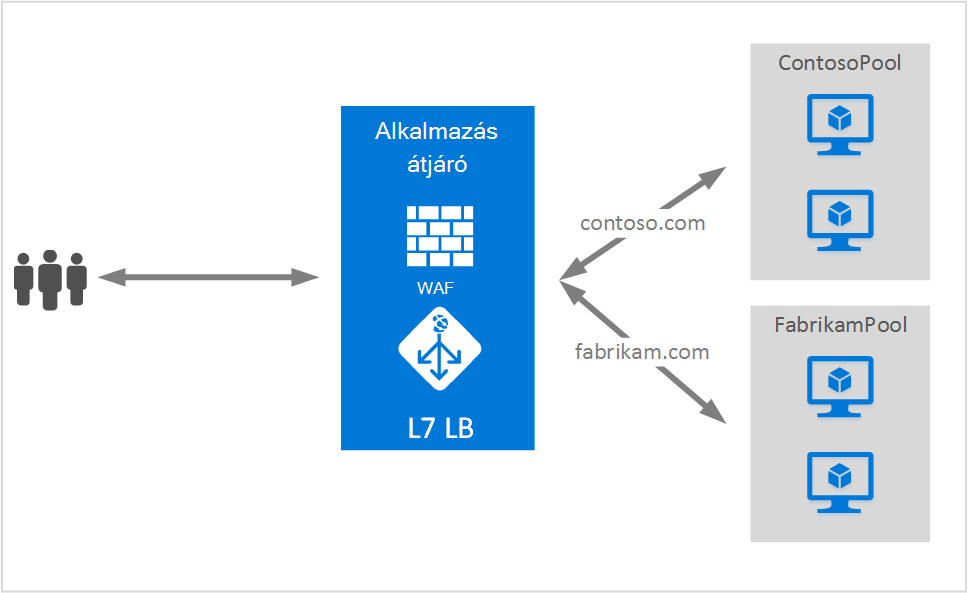

<properties
   pageTitle="Több webhelyek alkalmazás átjárót üzemeltető |} Microsoft Azure"
   description="Ezen az oldalon az alkalmazás átjáró több webhelyen támogatás áttekintése."
   documentationCenter="na"
   services="application-gateway"
   authors="amsriva"
   manager="rossort"
   editor="amsriva"/>
<tags
   ms.service="application-gateway"
   ms.devlang="na"
   ms.topic="hero-article"
   ms.tgt_pltfrm="na"
   ms.workload="infrastructure-services"
   ms.date="10/25/2016"
   ms.author="amsriva"/>

# Alkalmazás átjáró több webhely-üzemeltető

Több webhely-üzemeltető lehetővé teszi, hogy az alkalmazás azonos átjárópéldány egynél több webalkalmazás konfigurálása. Ezzel a funkcióval topológiát egy hatékonyabb a telepítés esetén az alkalmazás egy átjáró legfeljebb 20 webhelyek hozzáadásával. Minden webhely is lehet készletre irányítja át a saját kódmentes. A következő példában alkalmazás átjáró forgalmat a contoso.com és a két háttér-kiszolgálón készletek ContosoServerPool és FabrikamServerPool című fabrikam.com egyszerre szolgál.

Http://contoso.com kérelem ContosoServerPool vannak-e irányítva, és http://fabrikam.com FabrikamServerPool vannak-e irányítva.

Hasonlóképpen két altartományokat azonos szülő tartomány is szerepeltethetők az azonos alkalmazás átjáró telepítési. Példák altartományokat lehetnek http://blog.contoso.com és http://app.contoso.com egyetlen alkalmazásból átjáró telepítés is.

## A Host az élőfej- és kiszolgáló neve megjelölése (SNI)

Vannak olyan három közös mechanizmusok segítségével, így több helyet üzemeltető azonos infrastruktúra.

1. Állomásnév több webalkalmazások minden olyan egyedi IP-cím.
2. A host name használja ugyanazt a címet a több webalkalmazások tárolni.
3. Különböző portokat használja ugyanazt a címet a több webalkalmazások tárolni.

Az alkalmazás átjáró jelenleg megkapja a amelyen, figyeli forgalmához egyetlen nyilvános IP-címet. Ezért támogató több alkalmazásokat, mindegyik saját IP-címet, jelenleg nem támogatott. Alkalmazás átjáró támogatja a több alkalmazást futtató minden más portokra figyel, de ebben az esetben az alkalmazások fogadja el a forgalmat szabványos portokon lenne szükség, és gyakran nem a kívánt konfiguráció. Alkalmazás átjáró HTTP 1.1 host fejlécek tárolni a azonos nyilvános IP-cím és a port egynél több webhely támaszkodik. A webhelyek alkalmazás átjáró is is támogatási SSL kiürítése kiszolgáló neve megjelölése (SNI) TLS kiterjesztésű. Ebben az esetben, az azt jelenti, hogy az ügyfél böngésző- és kódmentes webes farm támogatnia kell a HTTP/1.1-es és TLS-bővítmény RFC 6066 definiálva.

## Figyelő konfigurációs elem

Meglévő HTTPListener konfigurációs elem a támogatási host nevét és a kiszolgáló neve megjelölése elemek van továbbfejlesztett, megfelelő kódmentes készlet forgalom átirányítása átjáró alkalmazás által használt. Az alábbi példa a kódtöredék a sablonfájl HttpListeners elem.

    "httpListeners": [
                {
                    "name": "appGatewayHttpsListener1",
                    "properties": {
                        "FrontendIPConfiguration": {
                            "Id": "/subscriptions/<subid>/resourceGroups/<rgName>/providers/Microsoft.Network/applicationGateways/applicationGateway1/frontendIPConfigurations/DefaultFrontendPublicIP"
                        },
                        "FrontendPort": {
                            "Id": "/subscriptions/<subid>/resourceGroups/<rgName>/providers/Microsoft.Network/applicationGateways/applicationGateway1/frontendPorts/appGatewayFrontendPort443'"
                        },
                        "Protocol": "Https",
                        "SslCertificate": {
                            "Id": "/subscriptions/<subid>/resourceGroups/<rgName>/providers/Microsoft.Network/applicationGateways/applicationGateway1/sslCertificates/appGatewaySslCert1'"
                        },
                        "HostName": "contoso.com",
                        "RequireServerNameIndication": "true"
                    }
                },
                {
                    "name": "appGatewayHttpListener2",
                    "properties": {
                        "FrontendIPConfiguration": {
                            "Id": "/subscriptions/<subid>/resourceGroups/<rgName>/providers/Microsoft.Network/applicationGateways/applicationGateway1/frontendIPConfigurations/appGatewayFrontendIP'"
                        },
                        "FrontendPort": {
                            "Id": "/subscriptions/<subid>/resourceGroups/<rgName>/providers/Microsoft.Network/applicationGateways/applicationGateway1/frontendPorts/appGatewayFrontendPort80'"
                        },
                        "Protocol": "Http",
                        "HostName": "fabrikam.com",
                        "RequireServerNameIndication": "false"
                    }
                }
            ],

[Erőforrás-kezelő sablon használatával több webhely](https://github.com/Azure/azure-quickstart-templates/blob/master/201-application-gateway-multihosting) -végpont sablon-alapú telepítés help.yammer.

## Szabály

Nem kötelező a útválasztási szabály itt nincs változás. "Basic" szabály továbbra is a megfelelő webhely figyelő a megfelelő kódmentes cím kvótáját kötik szeretné behelyettesíteni.

    "requestRoutingRules": [
    {
        "name": "<ruleName1>",
        "properties": {
            "RuleType": "Basic",
            "httpListener": {
                "id": "/subscriptions/<subid>/resourceGroups/<rgName>/providers/Microsoft.Network/applicationGateways/applicationGateway1/httpListeners/appGatewayHttpsListener1')]"
            },
            "backendAddressPool": {
                "id": "/subscriptions/<subid>/resourceGroups/<rgName>/providers/Microsoft.Network/applicationGateways/applicationGateway1/backendAddressPools/ContosoServerPool')]"
            },
            "backendHttpSettings": {
                "id": "/subscriptions/<subid>/resourceGroups/<rgName>/providers/Microsoft.Network/applicationGateways/applicationGateway1/backendHttpSettingsCollection/appGatewayBackendHttpSettings')]"
            }
        }

    },
    {
        "name": "<ruleName2>",
        "properties": {
            "RuleType": "Basic",
            "httpListener": {
                "id": "/subscriptions/<subid>/resourceGroups/<rgName>/providers/Microsoft.Network/applicationGateways/applicationGateway1/httpListeners/appGatewayHttpListener2')]"
            },
            "backendAddressPool": {
                "id": "/subscriptions/<subid>/resourceGroups/<rgName>/providers/Microsoft.Network/applicationGateways/applicationGateway1/backendAddressPools/FabrikamServerPool')]"
            },
            "backendHttpSettings": {
                "id": "/subscriptions/<subid>/resourceGroups/<rgName>/providers/Microsoft.Network/applicationGateways/applicationGateway1/backendHttpSettingsCollection/appGatewayBackendHttpSettings')]"
            }
        }

    }
    ]

## Következő lépések

Több webhely-üzemeltető megtanulása, miután lépjen [egy alkalmazás átjáró használatával több webhely létrehozása](application-gateway-create-multisite-azureresourcemanager-powershell.md) az alkalmazás átjáró létrehozása az azt jelenti, hogy egynél több webalkalmazás támogatja.
