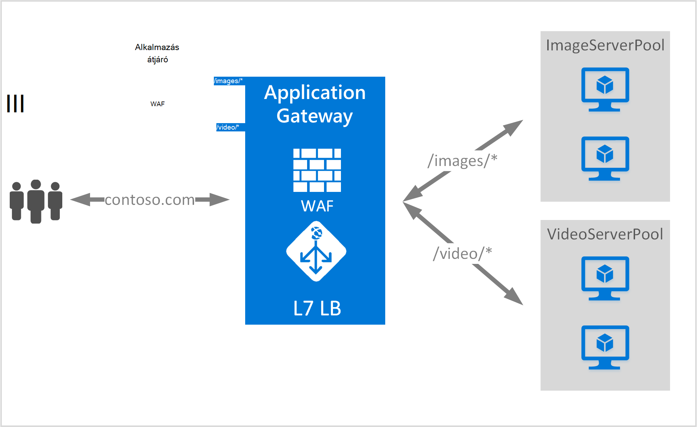

<properties
   pageTitle="Tartalom útválasztási áttekintése URL-alapú |} Microsoft Azure"
   description="Ezen az oldalon az alkalmazás átjáró URL-alapú tartalom útválasztás, UrlPathMap konfigurálása és a PathBasedRouting szabály áttekintést nyújt."
   documentationCenter="na"
   services="application-gateway"
   authors="georgewallace"
   manager="carmonm"
   editor="tysonn"/>
<tags
   ms.service="application-gateway"
   ms.devlang="na"
   ms.topic="hero-article"
   ms.tgt_pltfrm="na"
   ms.workload="infrastructure-services"
   ms.date="10/25/2016"
   ms.author="gwallace"/>

# URL-címe alapján útmegadás – áttekintés

URL-címe alapján útmegadás lehetővé teszi a kérelem URL-cím javaslatok alapján háttéradatbázist kiszolgáló készletek útvonal forgalmat. Az esetek egyike kérelmek a különböző kódmentes kiszolgáló készletek a különböző tartalomtípusok.
A következő példában alkalmazás átjáró van szolgáló három háttéradatbázist kiszolgáló készletek a contoso.com a forgalom például: VideoServerPool ImageServerPool és DefaultServerPool.

Kérelem http://contoso.com/video* VideoServerPool, és http://contoso.com/images résztvevőkhöz* résztvevőkhöz ImageServerPool. DefaultServerPool van kijelölve, ha az elérési út mintázatok egyike sem felel meg.

## UrlPathMap konfigurációs elem

Adja meg a háttéradatbázis kiszolgáló készlet hozzárendelések elérési út mintázatú kiemelésével UrlPathMap elem szolgál. Az alábbi példa a kódtöredék a sablonfájl urlPathMap elem.

    "urlPathMaps": [
    {
    "name": "<urlPathMapName>",
    "id": "/subscriptions/<subscriptionId>/../microsoft.network/applicationGateways/<gatewayName>/ urlPathMaps/<urlPathMapName>",
    "properties": {
        "defaultBackendAddressPool": {
            "id": "/subscriptions/<subscriptionId>/../microsoft.network/applicationGateways/<gatewayName>/backendAddressPools/<poolName>"
        },
        "defaultBackendHttpSettings": {
            "id": "/subscriptions/<subscriptionId>/../microsoft.network/applicationGateways/<gatewayName>/backendHttpSettingsList/<settingsName>"
        },
        "pathRules": [
            {
                "paths": [
                    <pathPattern>
                ],
                "backendAddressPool": {
                    "id": "/subscriptions/<subscriptionId>/../microsoft.network/applicationGateways/<gatewayName>/backendAddressPools/<poolName2>"
                },
                "backendHttpsettings": {
                    "id": "/subscriptions/<subscriptionId>/../microsoft.network/applicationGateways/<gatewayName>/backendHttpsettingsList/<settingsName2>"
                },

            },

        ],

    }
    }
    

>[AZURE.NOTE] PathPattern: Ez a beállítás akkor a megfelelő elérési utat mintázatok listáját. Minden egyes kell kezdődnie / és a csak egy "*" engedélyezve van a befejezési következő jelenleg egy "/". A karakterlánc, hogy az elérési út matcher géppel nem tartalmaz szöveget az első után? vagy #, és ezeket karakter itt nem használhatók. 

Érdemes egy [erőforrás-kezelő sablon URL-alapú útválasztás használata](https://azure.microsoft.com/documentation/templates/201-application-gateway-url-path-based-routing) további információt.

## PathBasedRouting szabály

PathBasedRouting típusú RequestRoutingRule figyelő kötődnek egy urlPathMap szolgál. A értesülnie kapott összes kérelmet résztvevőkhöz urlPathMap megadott házirend alapján.
Kódtöredékének PathBasedRouting szabály:

    "requestRoutingRules": [
    {

    "name": "<ruleName>",
    "id": "/subscriptions/<subscriptionId>/../microsoft.network/applicationGateways/<gatewayName>/requestRoutingRules/<ruleName>",
    "properties": {
        "ruleType": "PathBasedRouting",
        "httpListener": {
            "id": "/subscriptions/<subscriptionId>/../microsoft.network/applicationGateways/<gatewayName>/httpListeners/<listenerName>"
        },
        "urlPathMap": {
            "id": "/subscriptions/<subscriptionId>/../microsoft.network/applicationGateways/<gatewayName>/ urlPathMaps/<urlPathMapName>"
        },

    }
    
## Következő lépések

Tartalom továbbítás URL-alapú tanulási, után nyissa meg a [Hozzon létre egy URL-alapú útválasztás használatával alkalmazás átjáró](application-gateway-create-url-route-portal.md) -alkalmazás átjáró URL-CÍMÉT az útválasztó szabályok létrehozásához.
