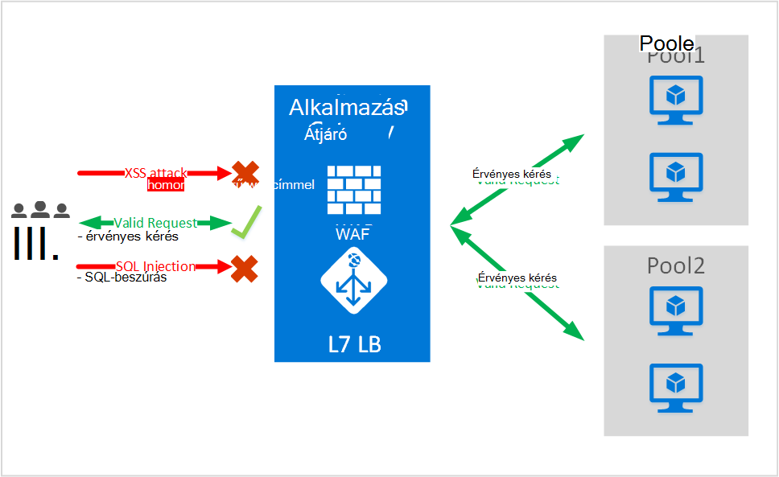
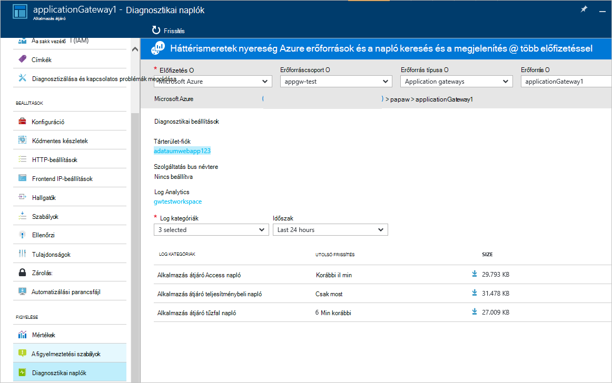

<properties
   pageTitle="Bevezetés a webes alkalmazás tűzfal (WAF) alkalmazás átjáró |} Microsoft Azure"
   description="Ezen az oldalon áttekintést webes alkalmazás tűzfal (WAF) alkalmazás átjáró "
   documentationCenter="na"
   services="application-gateway"
   authors="amsriva"
   manager="rossort"
   editor="amsriva"/>
<tags
   ms.service="application-gateway"
   ms.devlang="na"
   ms.topic="hero-article"
   ms.tgt_pltfrm="na"
   ms.workload="infrastructure-services"
   ms.date="10/25/2016"
   ms.author="amsriva"/>

# Alkalmazás átjáró webes alkalmazás tűzfal (előzetes verzió)

Webes alkalmazás tűzfal (WAF) lehetővé teszi az azure alkalmazás átjáró kihasználhatja a szabványos alkalmazás kézbesítési vezérlő LÉPETT funkciók alkalmazás átjárót futtató webalkalmazások védelmet nyújtó. Webes alkalmazás tűzfal mindezt védelme őket a legtöbb OWASP felső 10 közös webes biztonsági szemben. Webalkalmazások egyre, amely közös ismert biztonsági kihasználni rosszindulatú támadások céljainak. Között az alábbi hasznos gyakori SQL-utasítások beszúrását támadások, neve néhány idegen webhelyekről parancsfájlok támadásokat. Nehéz lehet és szigorú karbantartás, javítása és ellenőrzés rétegeinek a keresőalkalmazás topológiája szükség lehet ilyen támadásokat alkalmazás kódban megakadályozása. A központi webhely alkalmazás tűzfal webes támadások ellen sokkal egyszerűbbé teszi a biztonsági kezelése és, annál hatékonyabb arra, hogy az alkalmazás, a jövő támadásokkal szemben a kockázatok ellen. WAF megoldást is által ismert biztonsági biztonságossá tétele minden egyes webalkalmazások és egy központi helyen javítása egy gyorsabb biztonsági kockázatot reagálni. Meglévő alkalmazás átjárók egyszerűen az alkalmazás tűzfallal weben-alkalmazás átjáró is alakulnak.

Alkalmazás átjáró működik, mint egy alkalmazás kézbesítési vezérlő és SSL lemondási, cookie-alapú munkamenet affinitás, ciklikus terheléselosztási, tartalom alapú továbbításában szerepet azt jelenti, hogy több webhelyekre és biztonsági kapcsolatos fejlesztések szolgáltató kínál. Biztonsági alkalmazás átjáró által kínált fejlesztések SSL házirendkezelő végpont SSL-támogatás. Azt is erősítése alkalmazás biztonsági funkciók a szolgáltatás WAF (webes alkalmazás tűzfal) közvetlenül a kínáló LÉPETT beépített bevezetésével. Ezzel a megoldással egy könnyen megadása központi helyen kezeléséhez, és a webalkalmazások közös webes biztonsági elleni védelmét.

Az alábbi előny WAF konfigurálása a alkalmazás átjáró itt meg:

- A webes alkalmazás webes biztonsági és az kódmentes kód módosítás nélkül támadások védelme.
- Több webalkalmazások védelme egyszerre egy alkalmazás átjáró mögött. Alkalmazás átjáró támogat, amely a jövőben minden védeni webes célú támadásokkal egyetlen átjáró mögött legfeljebb 20 webhelyek szolgáltatója.
- Figyelje meg a webalkalmazás használatával alkalmazás átjáró WAF naplók által generált valós idejű jelentés támadások ellen.
- Bizonyos megfelelőségi vezérlők szükséges összes internetes szemben lévő végpontjait WAF megoldást szerint védett. Alkalmazás átjáró WAF engedélyezve van a használatával felel meg ezeknek a megfelelőségi követelményeknek.

## – Áttekintés

Alkalmazás átjáró WAF új Termékváltozatot (WAF Termékváltozat) a felajánlott és előre beállított ModSecurity és OWASP Core szabálykészlet eredeti védelmet nyújt a legtöbb OWASP felső 10 közös webes biztonsági megtalálható.

- SQL-utasítások beszúrását védelme
- Webhely parancsfájlok védelem Cross
- Például parancs utasítások beszúrását, a HTTP-kérelmek, HTTP-válasz felosztása, és a távoli fájl elküldésének homonimaszerű webcímmel közös webes támadásokat védelme
- HTTP protokoll megsértése elleni védelem
- HTTP protokoll rendellenességeinek, például a hiányzó elleni védelem felhasználói ügynök üzemelteti, és fogadja el a fejlécek
- HTTP DoS védelem, beleértve a HTTP amelyet és a lassú HTTP DoS megelőzése
- Botok webbejárók és víruskeresők megelőzése
- Gyakori alkalmazás problémáinak (azaz Apache, az IIS stb) kimutatása

## WAF módok

Alkalmazás átjáró WAF beállítható úgy, hogy futtassa a következő két módban:

- **Észlelési módot** – észlelési módban alkalmazás átjáró WAF futtatásához konfigurálásakor figyeli, és minden veszélyt riasztást rögzít egy naplófájlt. Győződjön meg arról, hogy alkalmazás átjáró a diagnosztikai naplózás be van kapcsolva diagnosztika szakaszának használatával szüksége. Akkor is kell győződjön meg arról, hogy a WAF napló kijelölt és be van kapcsolva.
- **Megakadályozási mód** – konfigurálásakor futtatásához megelőzése módban alkalmazás átjáró aktívan blokkok támadásokkal szemben észlelt a szabályokat. A támadó kap egy 403 ezzel az illetéktelen hozzáférést kivétel, és a kapcsolat megszakad. Továbbra is ilyen támadásokat jelentkezzen be a WAF naplók megakadályozási mód.

## Alkalmazás átjáró WAF jelentések

Alkalmazás átjáró WAF tartalmaz, minden veszélyt észleli részletes jelentések. Naplózás Azure diagnosztikai naplók integrálva van, és értesítések rögzítése json formátumban.

    {
        "resourceId": "/SUBSCRIPTIONS/<subscriptionId>/RESOURCEGROUPS/<resourceGroupName>/PROVIDERS/MICROSOFT.NETWORK/APPLICATIONGATEWAYS/<applicationGatewayName>",
        "operationName": "ApplicationGatewayFirewall",
        "time": "2016-09-20T00:40:04.9138513Z",
        "category": "ApplicationGatewayFirewallLog",
        "properties":     {
            "instanceId":"ApplicationGatewayRole_IN_0",
            "clientIp":"108.41.16.164",
            "clientPort":1815,
            "requestUri":"/wavsep/active/RXSS-Detection-Evaluation-POST/",
            "ruleId":"OWASP_973336",
            "message":"XSS Filter - Category 1: Script Tag Vector",
            "action":"Logged",
            "site":"Global",
            "message":"XSS Filter - Category 1: Script Tag Vector",
            "details":{"message":" Warning. Pattern match "(?i)(<script","file":"/owasp_crs/base_rules/modsecurity_crs_41_xss_attacks.conf","line":"14"}}
    }

## Alkalmazás átjáró WAF Termékváltozat árak

A minta során vannak nincs további költségeket az alkalmazás átjáró WAF használatát. Továbbra is Önnek kell fizetnie meglévő egyszerű Termékváltozat költségeket. Azt közli, hogy a WAF Termékváltozat költségeket Georgia időben. Azon ügyfelek, akik választotta, hogy az alkalmazás átjáró WAF Termékváltozat üzembe kezdene csak azt követően Georgia bejelentése árak WAF Termékváltozat merülnek fel.

## Következő lépések

További tudnivalók a WAF funkcióinak használatában, miután kérjük, keresse fel a [webes alkalmazás tűzfalat alkalmazás átjáró beállítása](application-gateway-web-application-firewall-portal.md).
