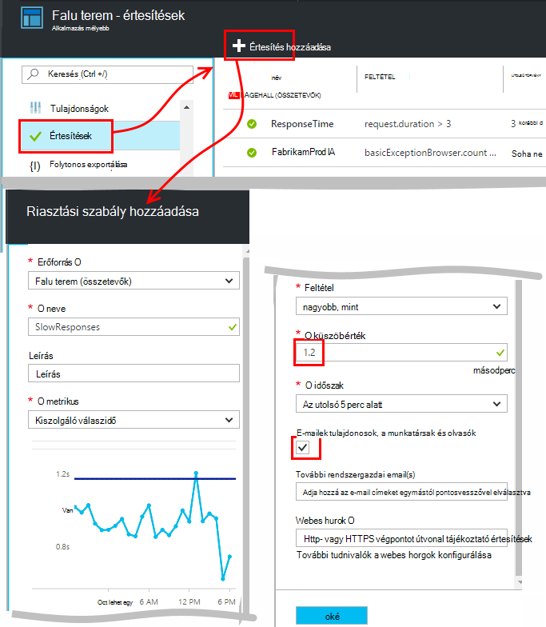
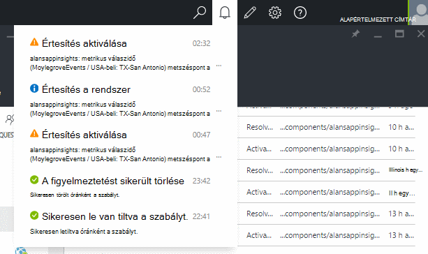
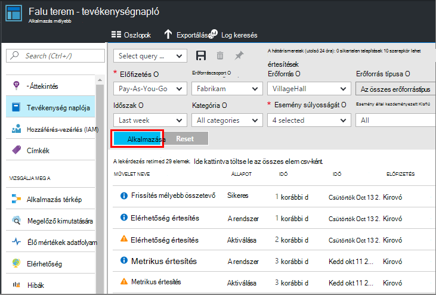

<properties 
    pageTitle="Az alkalmazás az összefüggéseket tájékoztató értesítések beállítása |} Microsoft Azure" 
    description="Értesítést kaphat válaszidejű, kivételeket, és más teljesítményét vagy a web app használatát változását." 
    services="application-insights" 
    documentationCenter=""
    authors="alancameronwills" 
    manager="douge"/>

<tags 
    ms.service="application-insights" 
    ms.workload="tbd" 
    ms.tgt_pltfrm="ibiza" 
    ms.devlang="na" 
    ms.topic="article" 
    ms.date="10/14/2016" 
    ms.author="awills"/>
 
# Az alkalmazás az összefüggéseket tájékoztató értesítések beállítása

[Visual Studio alkalmazás háttérismeretek] [ start] is változásokra figyelmeztető a teljesítmény vagy használatát mértékek, a webalkalmazásban. 

Alkalmazás háttérismeretek figyeli [platformokon számos] , az élő alkalmazás[ platforms] teljesítménybeli problémáinak diagnosztizálása és szokásai megértéséhez.

Az értesítések fő három típusba sorolhatók:

* **Metrikus értesítések** , hogy mikor tetszőleges metrikus metszéspontja néhány időszakra – például válaszidő, a kivétel száma, a processzorhasználata vagy a lap nézetek adott küszöbértéknél.. 
* [**Webes vizsgálatok** ] [ availability] mondani, ha a webhely nem érhető el az interneten, vagy válaszol lassan. [További][availability].
* [**Megelőző diagnosztika**](app-insights-proactive-diagnostics.md) vannak beállítva automatikusan figyelmeztet az mintázatok szokatlan teljesítményét.

Ebben a cikkben metrikus riasztások koncentráljon azt.

## Olyan mérőszám figyelmeztetés beállítása

Nyissa meg a riasztási szabályok lap, és a Hozzáadás gombra. 

* Állítsa az erőforrás, mielőtt a Tulajdonságok parancsot. **Válassza ki a "(összetevők)" erőforrás** Ha be szeretné állítani az értesítések használatát és működésére mérési módja miatt.
* A nevet, amelyet a figyelmeztető adhat a az erőforráscsoport (nem csak az alkalmazás) belül egyedinek kell lennie.
* Vigyázzon, vegye figyelembe az erőforrás-mennyiség, amelyben megkérdezi, hogy írja be a küszöbértéket.
* Ha bejelöli a "... az e-mailek tulajdonosok" jelölőnégyzetet, értesítések küld mailben mindenkinek, aki rendelkezik hozzáféréssel a erőforráscsoport. Bontsa ki a személyek halmaza, felveheti az [erőforráscsoport vagy -előfizetésre](app-insights-resources-roles-access-control.md) (nem az erőforrás).
* Ha a "További e-mailek" adja meg, értesítések küld felhasználók vagy csoportok (függetlenül attól, amelyet bejelölt a "e-mail tulajdonosai..." mező). 
* Állítsa be a [webhook címét](../monitoring-and-diagnostics/insights-webhooks-alerts.md) , ha a riasztások válaszoló webalkalmazást be van állítva. Fog neve, mind aktiválásakor az értesítésre (elindított,), és ha megoldódott-e meg. (Ne feledje azonban, hogy jelenleg lekérdezés nem átadott paraméter keresztül webhook tulajdonságként.)
* Le is tilthatja, vagy engedélyezze a figyelmeztetés: a gomb a lap tetején látható.

*Nem látható a felhasználó hozzáadása gombra.* 

- Szervezeti fiókkal történő? Ha tulajdonosa, vagy a közös munka az alkalmazás erőforráshoz való hozzáférés állíthat be értesítéseket. Nézze meg a hozzáférés-vezérlés lap. [Tudnivalók a hozzáférés-vezérlés][roles].

> [AZURE.NOTE] A riasztások lap láthatja, hogy már létezik egy riasztási beállítás: [Megelőző diagnosztika](app-insights-proactive-failure-diagnostics.md). Az Automatikus értesítés, amely egy adott metrikus, kérelem hiba ráta figyeli. Ha úgy dönt, hogy a megelőző értesítések letiltása, nem kell saját értesítés beállítása a kérelem hiba ráta. 

## Lásd: az értesítések

Kap e-mailben, ha egy figyelmeztető módosítások állam inaktív és aktív között. 

A figyelmeztetési szabályok lap jelenik meg minden riasztás aktuális állapotát.

Nem az értesítés legutóbbi tevékenység összefoglaló legördülő listában:

A tevékenységnapló a állapot a módosítási előzményeit van:

## Értesítések működése

* Értesítés még három állapota: "Soha nem aktiválódik", "Aktív" és "Feloldani." Utolsó kiértékelt volt volt értéke igaz, aktivált jelzi a megadott feltételnek.

* Értesítés jelzést megváltozásakor állapot jön létre. (A figyelmeztető létrehozásakor volt, a riasztási feltétel már igaz, ha esetleg nem értesítést kap mindaddig, amíg a feltétel Ugrás hamis.)

* Minden értesítést e-mailben hoz létre, ha az e-mailekhez jelölőnégyzetet bejelölve, vagy meghatározott e-mail címét. Is megnézheti az értesítések legördülő listában.

* Értesítés minden alkalommal, amikor egy mérőszám megérkezik, de más módon nem értékeli.

* A kiértékelés összesíti a mérőszám megelőző időszak alatt, és összehasonlítja azt határozza meg az új állam küszöbértéket.

* Az időszak, kiválaszthatja, hogy a időköze fölé, amelyhez a rendszer mértékek összesíti. Nincs hatással a figyelmeztető kiértékelt gyakoriságának: érkezésének mértékek gyakoriságának függ.

* Adatokat nem érkezik egy adott mérőszám egy kis időt, ha a térközt riasztási értékelése és a diagramok metrikus explorer különböző effektusok tartalmaz. A metrikus Intézőben adatokat nem látható a hosszabb, mint a diagram mintavételnél időköz, ha a diagram jeleníti meg a 0 értéket. De az azonos metrikus alapján értesítés nem újra kell értékelni, és a figyelmeztetés állam változatlan marad. 

    Adatok ahányat értesítések, a diagram ugrik vissza nullától különböző érték. Az értesítés az eredmény érhető el a időszakra megadott adatok alapján. A csak az egyiket az időszak érhető el az új adatpont esetén összesített alapul, csak a, hogy az adatpont.

* Értesítés is villódzik gyakran figyelmeztetés, és a megfelelő állapot között még akkor is, ha hosszú időn állít be. Ez akkor fordulhat elő, ha a metrikus érték fog megjelenni a küszöbértéke kerülő. Nem kapott szerepel a küszöbértékét: értesítés az áttűnés értéke megegyezik az áttűnés megfelelő a történik.

## Mik azok a jó tájékoztató értesítések beállítása

Az alkalmazás függ. Kezdésként célszerű nem túl sok mértékek beállítása. Néhány időt megjeleníti a metrikus diagramok futtatásakor az alkalmazást, hogy megtudhatja, hogy működése a szokásos módon. Ezzel az elemzéssel tisztábban keresése módokon javíthatja teljesítményét. Mondani, amikor a mértékek lépjen, a normál zónán kívüli, majd állíthat be értesítéseket. 

Népszerű figyelmeztetések a következők:

* [Böngésző mértékek][client], különösen böngésző **lapok betöltésével**webalkalmazások jól használhatók. Ha a lap parancsfájlokat sok van, célszerű oda kell figyelni a **böngésző kivételek**. Ahhoz, hogy ezek a mértékek és értesítések, meg kell beállítania a [weblap figyelése][client].
* **Kiszolgáló válaszidő** webalkalmazások kiszolgálóoldali. Állíthat be értesítéseket, és figyelje a megjelenítéséhez, ha azt művelettől aránytalanul magas kérelem díjak mérőszám:, amely jelezheti, hogy az alkalmazás fogy a erőforrásokat. 
* A **kiszolgáló kivételek** - fájlokat, akkor néhány [további beállítási](app-insights-asp-net-exceptions.md)lehetőségek.

Ne feledje, hogy a [megelőző hiba ráta diagnosztika](app-insights-proactive-failure-diagnostics.md) automatikusan ellenőrizze, amelynél az alkalmazás hibát kódok kérések válaszol mértékét. 

## Automatizálási

* [A PowerShell használatával automatizálhatja a értesítések beállítása](app-insights-powershell-alerts.md)
* [Webhooks használatával automatizálhatja a válasz értesítésekre](../monitoring-and-diagnostics/insights-webhooks-alerts.md)

## Lásd még:

* [Elérhetőség webes vizsgálatok](app-insights-monitor-web-app-availability.md)
* [Értesítések beállításával automatizálása](app-insights-powershell-alerts.md)
* [Megelőző diagnosztika](app-insights-proactive-diagnostics.md) 

<!--Link references-->

[availability]: app-insights-monitor-web-app-availability.md
[client]: app-insights-javascript.md
[platforms]: app-insights-platforms.md
[roles]: app-insights-resources-roles-access-control.md
[start]: app-insights-overview.md

 