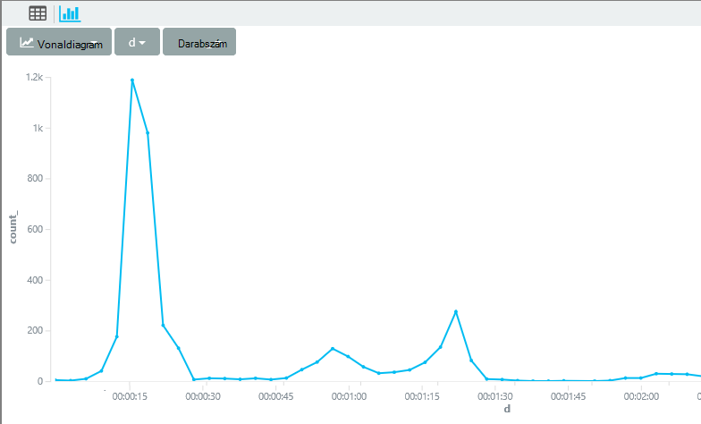

<properties 
    pageTitle="Az alkalmazás az összefüggéseket Analytics egy bemutatóra |} Microsoft Azure" 
    description="A fő lekérdezések Analytics, az alkalmazás az összefüggéseket a hatékony keresés eszköz rövid minta." 
    services="application-insights" 
    documentationCenter=""
    authors="alancameronwills" 
    manager="douge"/>

<tags 
    ms.service="application-insights" 
    ms.workload="tbd" 
    ms.tgt_pltfrm="ibiza" 
    ms.devlang="na" 
    ms.topic="article" 
    ms.date="10/15/2016" 
    ms.author="awills"/>


 
# <a name="a-tour-of-analytics-in-application-insights"></a>Az alkalmazás mélyebb Analytics bemutatása


[Analytics](app-insights-analytics.md) a hatékony keresés funkció az [Alkalmazás az összefüggéseket](app-insights-overview.md). Ezeket a lapokat a lekérdezés Analitikájának lanquage ismertetik.


* **[A bevezető videóból](https://applicationanalytics-media.azureedge.net/home_page_video.mp4)**.
* **[Tesztelése Analytics, hogy szimulált adatait a](https://analytics.applicationinsights.io/demo)** Ha az alkalmazás nem küld adatokat alkalmazás mélyebb még.


Nézzük meg néhány egyszerű lekérdezés első lépések részletes.

## <a name="connect-to-your-application-insights-data"></a>Az alkalmazás mélyebb adatok csatlakoztatása

Nyissa meg az alkalmazás [áttekintése lap](app-insights-dashboards.md) az alkalmazás az összefüggéseket Analytics:


    
## <a name="takeapp-insights-analytics-referencemdtake-operator-show-me-n-rows"></a>[Vegyék](app-insights-analytics-reference.md#take-operator): jelenítsen meg nekem n számú sort

Jelentkezzen be a felhasználó műveleteket (általában HTTP-kérések megkapta az webalkalmazást) adatpontok tárolódnak nevű táblázat `requests`. Minden egyes sor egy telemetriai adatpont, a alkalmazás háttérismeretek SDK csomagjában talál az alkalmazás a kapott.

Első lépésként a táblázat néhány példa sorát vizsgálata:


> [AZURE.NOTE] Helyezze a kurzort valahol a kimutatásban előtt kattintson az Ugrás gombra. Kimutatást szétválaszthatja egynél több sort fölé, de ne okozzon üres sorok a kimutatásokban. Üres sorok megtartása több külön lekérdezések ablakban kényelmesen.


Oszlopok, húzza őket, oszlopok, a csoportosítás és szűrése: 


Bontsa ki a minden elem kattintva megtekintheti a részleteket:
 


> [AZURE.NOTE] Kattintson az eredmények a böngészőben elérhető más sorrendbe oszlop vezetője. De ügyeljen arra, hogy a nagyméretű az eredményhalmaz, a böngészőben letöltött sorok számát korlátozódik. Rendezés, így nem mindig, a tényleges legnagyobb vagy legkisebb elemek megjelenítése. Megbízható rendezni az elemeket, használja a `top` vagy `sort` operátor. 

## <a name="topapp-insights-analytics-referencemdtop-operator-and-sortapp-insights-analytics-referencemdsort-operator"></a>[Felső](app-insights-analytics-reference.md#top-operator) és [rendezése](app-insights-analytics-reference.md#sort-operator)

`take`hasznos lehet ahhoz, hogy az eredményt, rövid minta kérjen, de nem meghatározott sorrendben követik egymást jeleníti meg a tábla sorainak. Használja az rendezett nézet `top` (a minta) vagy `sort` (felett a teljes táblázatot).

Az első n számú sort egy adott oszlop szerint rendezett megjelenítése:

```AIQL

    requests | top 10 by timestamp desc 
```

* *Szintaxist:* A legtöbb operátorok van kulcsszó paraméterek például `by`.
* `desc`csökkenő sorrendben, = `asc` = növekvő.


`top...`További performant történő módja, amely közli `sort ... | take...`. Azt is írt:

```AIQL

    requests | sort by timestamp desc | take 10
```

Az eredmény a következő lesz azonos, de egy kicsit lassabban szeretné futtatni. (Is létrehozható `order`, vagyis az alias `sort`.)

Az oszlopfejlécek a táblázat nézetben is használható a képernyőn megjelenő találatok rendezése. De ha már használta a tanfolyam `take` vagy `top` beolvasásához csak egy részét táblához, meg fog csak más sorrendbe a rekordjával.


## <a name="projectapp-insights-analytics-referencemdproject-operator-select-rename-and-compute-columns"></a>[Projekt](app-insights-analytics-reference.md#project-operator): válassza ki, átnevezése és oszlopok kiszámítása

Használat [`project`](app-insights-analytics-reference.md#project-operator) válassza ki a kívánt oszlopok:

```AIQL

    requests | top 10 by timestamp desc
             | project timestamp, name, resultCode
```


Oszlopok átnevezése is, és újabbakat meghatározása:

```AIQL

    requests 
  	| top 10 by timestamp desc 
  	| project  
            name, 
            response = resultCode,
            timestamp, 
            ['time of day'] = floor(timestamp % 1d, 1s)
```


* [Oszlopnevek](app-insights-analytics-reference.md#names) tartalmazhat szóközöket vagy szimbólumok, ha azokat is címsorainak így: `['...']` vagy`["..."]`
* `%`a program a szokásos módon moduló operátor. 
* `1d`(Ez egy számjegyet, majd a volna ") van egy konstans időszak azaz egynapos. Íme néhány további időszak szövegkonstansok: `12h`, `30m`, `10s`, `0.01s`.
* `floor`(alias `bin`) egy érték lefelé kiszámlázásakor alapérték legközelebbi többszörösére kerekít. Így `floor(aTime, 1s)` kerekítése lefelé a legközelebbi második egyszerre.

[Kifejezések](app-insights-analytics-reference.md#scalars) is elhelyezhet a szokásos operátorokat (`+`, `-`,...), és hasznos függvények cellatartományban.

    

## <a name="extendapp-insights-analytics-referencemdextend-operator-compute-columns"></a>[Meghosszabbítása](app-insights-analytics-reference.md#extend-operator): oszlopok kiszámítása

Ha csak a meglévőket vehet fel oszlopokat, használja [`extend`](app-insights-analytics-reference.md#extend-operator):

```AIQL

    requests 
  	| top 10 by timestamp desc
  	| extend timeOfDay = floor(timestamp % 1d, 1s)
```

Használatával [`extend`](app-insights-analytics-reference.md#extend-operator) -nél kisebb feltárja [`project`](app-insights-analytics-reference.md#project-operator) Ha meg szeretné őrizni a már meglévő oszlopok.


## <a name="summarizeapp-insights-analytics-referencemdsummarize-operator-aggregate-groups-of-rows"></a>[Summarize](app-insights-analytics-reference.md#summarize-operator): csoportok a sorok összesítése

`Summarize`egy megadott *összesítő függvényt* alkalmazza a sorok csoportját fölé. 

Ha például a web app-összehívás megválaszolása szükséges idő a mezőben jelentett `duration`. Lássuk, az átlagos válaszidő kérelmekre:


Vagy más néven kéréseivel sikerült külön azt az eredmény:


`Summarize`az adatfolyamban adatpontok csoportokba, amelynek gyűjti össze a `by` záradék kiértékeli egyaránt. Az egyes értékek a `by` - művelet neveket a fenti példában - kifejezés eredménye egy-egy sor az eredményül kapott táblázat. 

Vagy azt is csoporthoz eredmények időpont szerint:


Figyelje meg, hogyan programmal mutatjuk be a `bin` függvény (más néven `floor`). Ha az imént használt `by timestamp`, minden beviteli sor saját kis csoport volna befejezéséhez. Minden alkalommal például folyamatos skaláris az vagy a számok, akkor kell a folytonos cellatartományban szétválasztani kezelhető számos különálló értéket, és `bin` – vagyis valójában csak a már jól ismert kerekítése lefelé `floor` függvény – ehhez a legegyszerűbb módja.

Ugyanezzel a technikával csökkentheti a karakterláncok cellatartományok használhatja azt:


Figyelje meg, hogy használható `name=` eredmény oszlopának, az összesítés kifejezések vagy a-záradék neve beállításához.

## <a name="counting-sampled-data"></a>Számlálás mintát adatok

`sum(itemCount)`az ajánlott összesítés események tartalmazó cellákat számlálnia van. Sok esetben az elemek száma == 1, így a függvény egyszerűen számolja meg a csoport sorok számát. [Mintavételnél](app-insights-sampling.md) művelet van, ha csak egy részét, az eredeti események megmarad adatpontok alkalmazás hírcsatornájában, mint, hogy az egyes pontjai megjelenik, de `itemCount` eseményeket. 

Ha például ha mintavételnél figyelmen kívül hagyja az eredeti eseményeket, majd az elemek száma 75 %-át == 4 a megőrzött rekordokban – Ez azt jelenti, hogy minden megőrzött rekord volt-négy eredeti rekordot. 

Adaptív mintavételnél hatására az elemek száma lesz magasabb időszakokban, amikor az alkalmazás erősen használatban van.

Az elemek száma összeadásának ezért egy jó becslése események eredeti számát adja vissza.


Szintén a `count()` összesítési (és a darab művelet) azokra az esetekre, ha valóban szeretné számolni csoport sorok számát.


Nincs [összesítő függvények](app-insights-analytics-reference.md#aggregations)cellatartományban.


## <a name="charting-the-results"></a>Az eredmények Diagramkészítés


```AIQL

    exceptions 
       | summarize count()  
         by bin(timestamp, 1d)
```

Alapértelmezés szerint az eredmények táblázatként megjelenítése:


Azt teheti meg jobban, mint a tábla megjelenítése. Tekintse meg az eredmények a diagram nézetben a függőleges a sáv beállítást:


Figyelje meg, hogy annak ellenére azt nem az eredmények rendezésének idő (ahogy láthatja, hogy a táblázat megjelenítési), a diagrammal mindig látható időpontok helyes sorrendben.


## <a name="whereapp-insights-analytics-referencemdwhere-operator-filtering-on-a-condition"></a>[Hol](app-insights-analytics-reference.md#where-operator): szűrés egy feltétel alapján

Ha az alkalmazás az [ügyfél](app-insights-javascript.md) és a kiszolgáló oldalára figyelése alkalmazás háttérismeretek beállította, néhány az adatbázisban a telemetriai származik böngészők.

Lássuk, a böngészőből jelentett csak kivételeket:

```AIQL

    exceptions 
  	| where client_Type == "Browser" 
  	|  summarize count() 
       by client_Browser, outerMessage 
```


A `where` operátor megnyitja logikai kifejezés. Íme néhány legfontosabb mozzanatokat:

 * `and`, `or`: Logikai operátorok
 * `==`, `<>` : egyenlő, és nem egyenlő
 * `=~`, `!=` : egyenlő, és nem egyenlő nagybetűk karakterlánc. Számos további karakterlánc összehasonlító operátorok.

További információ: az összes [skaláris kifejezés](app-insights-analytics-reference.md#scalars).

### <a name="filtering-events"></a>Események szűrése

Keresse meg a sikertelen kérelmek:

```AIQL

    requests 
  	| where isnotempty(resultCode) and toint(resultCode) >= 400
```

`responseCode`karakterlánc típusú, akkor tartoznak, így azt kell [azt leadott](app-insights-analytics-reference.md#casts) numerikus összehasonlítása.

A különböző válaszokat Összefoglalva:

```AIQL

    requests
  	| where isnotempty(resultCode) and toint(resultCode) >= 400
  	| summarize count() 
      by resultCode
```

## <a name="timecharts"></a>Timecharts

Megjelenítése, hány események ott vannak naponta:

```AIQL

    requests
      | summarize event_count=count()
        by bin(timestamp, 1d)
```

Jelölje ki a diagram parancsra:


## <a name="multiple-series"></a>Több adatsort 

A több kifejezés a `summarize` több hasábot hoz létre.

A több kifejezés a `by` záradék létrehoz egyet az egyes értékek kombinációjától több sor.


```AIQL

    requests
  	| summarize count(), avg(duration) 
      by bin(timestamp, 1d), client_StateOrProvince, client_City 
  	| order by timestamp asc, client_StateOrProvince, client_City
```


### <a name="segment-a-chart-by-dimensions"></a>Diagram szegmens szerint

Ha egy karakterlánc oszlopot és egy számokat tartalmazó oszlopot tartalmazó táblázat, diagram, a karakterlánc ossza szét a numerikus adatokat külön sorozat pontjainak használható. Ha egynél több karakterlánc oszlop, megadhatja, hogy melyik oszlopot a Diszkriminátor használni. 


### <a name="display-multiple-metrics"></a>Több mértékek megjelenítése

Ha a táblázat egynél több numerikus oszlopok nevét, az időbélyegző, nemcsak a diagram tetszőleges kombinációját is megjeleníthet.


Nem osztott jelöljön ki több numerikus oszlopok meg nem osztott karakterlánc oszlop szerint bejelölheti a mobilszámával egyidejűleg több számoszlopot megjelenítése előtt. 


## <a name="daily-average-cycle"></a>Napi átlagos ciklus

Hogyan változik a használatát az átlagos nap során?

Darab kérések moduló egy nap, mire az óra binned:

```AIQL

    requests
  	| extend hour = floor(timestamp % 1d , 1h) 
          + datetime("2016-01-01")
  	| summarize event_count=count() by hour
```


>[AZURE.NOTE] Figyelje meg, felkínálunk jelenleg idő időtartamok átalakítása időpontok megjelenítése érdekében a diagramot.


## <a name="compare-multiple-daily-series"></a>Napi több adatsort összehasonlítása

Hogyan használatát változik nap időbeli különböző országokban?

```AIQL

 requests  | where tostring(operation_SyntheticSource)
     | extend hour= floor( timestamp % 1d , 1h)
           + datetime("2001-01-01")
     | summarize event_count=count() 
       by hour, client_CountryOrRegion 
     | render timechart
```


## <a name="plot-a-distribution"></a>Egy eloszlás ábrázolása

Hány munkamenetek vannak-e, eltérő hosszúságú?

```AIQL

    requests 
  	| where isnotnull(session_Id) and isnotempty(session_Id) 
  	| summarize min(timestamp), max(timestamp) 
      by session_Id 
  	| extend sessionDuration = max_timestamp - min_timestamp 
  	| where sessionDuration > 1s and sessionDuration < 3m 
  	| summarize count() by floor(sessionDuration, 3s) 
  	| project d = sessionDuration + datetime("2016-01-01"), count_
```

Dátum és idő átalakítása az utolsó sorban van szükség. Jelenleg az x tengely diagram jelenik meg skaláris csak akkor, ha egy datetime.

A `where` záradék kizárja egyszeri munkamenetek (sessionDuration == 0), és beállítja az x tengely hosszát.





## <a name="percentilesapp-insights-analytics-referencemdpercentiles"></a>[Percentilisek](app-insights-analytics-reference.md#percentiles)

Milyen időtartamok cellatartományok terjed ki a munkamenetek különböző százalékértékek?

A fenti lekérdezésnek használni, de az utolsó sor cseréje:

```AIQL

    requests 
  	| where isnotnull(session_Id) and isnotempty(session_Id) 
  	| summarize min(timestamp), max(timestamp) 
      by session_Id 
  	| extend sesh = max_timestamp - min_timestamp 
  	| where sesh > 1s
  	| summarize count() by floor(sesh, 3s) 
  	| summarize percentiles(sesh, 5, 20, 50, 80, 95)
```

Azt is eltávolítja a felső határ a where záradékba, annak érdekében, hogy a megfelelő számok, többek között az összes munkamenet egynél több kérésével első:


Ahonnan azt láthatja, hogy:

* 5 % tanfolyamainkat futamideje legfeljebb 3 perc 34s; 
* munkamenetek 50 %-os utolsó kisebb, mint 36 minnutes;
* 5 %-munkamenetek utolsó napján több, mint

Az első a külön részletezzük, az egyes országok, csak akkor van ahhoz, hogy a client_CountryOrRegion oszlop külön-külön keresztül mindkét összegzés operátorok:

```AIQL

    requests 
  	| where isnotnull(session_Id) and isnotempty(session_Id) 
  	| summarize min(timestamp), max(timestamp) 
      by session_Id, client_CountryOrRegion
  	| extend sesh = max_timestamp - min_timestamp 
  	| where sesh > 1s
  	| summarize count() by floor(sesh, 3s), client_CountryOrRegion
  	| summarize percentiles(sesh, 5, 20, 50, 80, 95)
      by client_CountryOrRegion
```


## <a name="joinapp-insights-analytics-referencemdjoin"></a>[Csatlakozás](app-insights-analytics-reference.md#join)

Hozzáférés több táblázatok, beleértve az kérések és a kivételek van.

Keresse meg a kivételek kapcsolatos hiba választ adott kérés, azt is csatlakozni a táblák `session_Id`:

```AIQL

    requests 
  	| where toint(responseCode) >= 500 
  	| join (exceptions) on operation_Id 
  	| take 30
```


Célszerű használni `project` az illesztés végrehajtása előtt szükséges oszlopok kiválasztásához.
A azonos záradékok szerepelnek, az azt nevezze át a időbélyegző oszlopot.


## <a name="letapp-insights-analytics-referencemdlet-clause-assign-a-result-to-a-variable"></a>[Tudathatja](app-insights-analytics-reference.md#let-clause): egy változó eredményt hozzárendelése

[Tudathatja](./app-insights-analytics-reference.md#let-statements) segítségével az előző kifejezést alkotó elemek elkülönítésére. Az eredmények nem változik:

```AIQL

    let bad_requests = 
      requests
        | where  toint(resultCode) >= 500  ;
    bad_requests
  	| join (exceptions) on session_Id 
  	| take 30
```

> Tipp: A Analytics ügyfél ne okozzon üres sorok a részei között. Győződjön meg arról, hogy az összes végrehajtani.


## <a name="accessing-nested-objects"></a>Beágyazott objektumok elérése

Beágyazott objektumok könnyen érhető el. Ha például a kivételek adatfolyamban jelenik meg strukturált objektumok jelennek meg:


A tulajdonságok, amely érdekli kiválasztásával konvertálhatók:

```AIQL

    exceptions | take 10
  	| extend method1 = tostring(details[0].parsedStack[1].method)
```

Fontos tudni, hogy Ön [cast](app-insights-analytics-reference.md#casts) a megfelelő típust szeretné használni.

## <a name="custom-properties-and-measurements"></a>Egyéni tulajdonságok és mérés

Ha az alkalmazás [egyéni méretekre (Tulajdonságok), és az egyéni mérések](app-insights-api-custom-events-metrics.md#properties) csatol eseményeket, akkor látni fogja őket a a `customDimensions` és `customMeasurements` objektumok.


Ha például az alkalmazást tartalmazza:

```C#

    var dimensions = new Dictionary<string, string> 
                     {{"p1", "v1"},{"p2", "v2"}};
    var measurements = new Dictionary<string, double>
                     {{"m1", 42.0}, {"m2", 43.2}};
    telemetryClient.TrackEvent("myEvent", dimensions, measurements);
```

Ezek az értékek Analytics kibontásához:

```AIQL

    customEvents
  	| extend p1 = customDimensions.p1, 
      m1 = todouble(customMeasurements.m1) // cast to expected type

``` 

## <a name="tables"></a>Táblák

Az alkalmazás kapott telemetriai az adatfolyam a több tábla keresztül érhető el. Az ablak bal oldalán a rendelkezésre álló táblák tulajdonságok sémájának rendelkezők láthatják.

### <a name="requests-table"></a>Kérések táblázat

Darab HTTP-kérelmek a web app és szakasz, oldal név szerint:


Keresse meg a kérést, amely a legtöbb sikertelen:


### <a name="custom-events-table"></a>Egyéni események táblából

[TrackEvent()](app-insights-api-custom-events-metrics.md#track-event) segítségével küldje el saját eseményeket, ha az alábbi táblázat az erről őket. 

Nézzük példát, ha az alkalmazás-kódot tartalmaz-e ezek azok a sorok:

```C#

    telemetry.TrackEvent("Query", 
       new Dictionary<string,string> {{"query", sqlCmd}},
       new Dictionary<string,double> {
           {"retry", retryCount},
           {"querytime", totalTime}})
```

A gyakoriság az alábbi események megjelenítése:
 


Az események kinyerheti mértékek és a dimenziókat:


### <a name="custom-metrics-table"></a>Egyéni mértékek táblázat

Ha a saját metrikus érték elküldése [TrackMetric()](app-insights-api-custom-events-metrics.md#track-metric) szolgáltatást használ, annak eredményei **customMetrics** adatfolyamban találhatók. Példa:  


> [AZURE.NOTE] [Mértékek Explorer](app-insights-metrics-explorer.md)telemetriai bármilyen típusú csatolva az összes egyéni mérték szókapcsolat szerepel a mértékek küldhetők el együtt a mértékek lap `TrackMetric()`. De Analytics, egyéni mérések továbbra is csatolt bármelyik azok végeztek - események vagy kérelmeket, és így tovább - közben TrackMetric által küldött mértékek jelennek meg a saját adatfolyam telemetriai típusú.

### <a name="performance-counters-table"></a>Teljesítményét számláló táblázat

[Teljesítmény számláló](app-insights-performance-counters.md) mutatja, hogy az alkalmazás, például a Processzor, a memória és a hálózati kihasználtsági alaprendszer mértékek. Beállíthatja, hogy a SDK csomagjában talál további számláló, beleértve a saját egyéni számláló küldhet.

A **performanceCounters** séma elérhetővé teszi a `category`, `counter` nevét, és `instance` minden teljesítmény számláló neve. Csak néhány teljesítményét számláló alkalmazandó számláló példány nevét, és általában azt jelzi, amelyre a darab vonatkozik a folyamat nevét. Az egyes alkalmazások telemetriai látni fogja, hogy az alkalmazás csak a számláló. Például hogy milyen számláló érhetők el: 


A rendelkezésre álló memória diagram beszerzése a legutóbbi időszak: 


Más telemetriai, például **performanceCounters** is van oszlop `cloud_RoleInstance` , amely jelzi, hogy az állomásgép, amelyen fut az alkalmazás azonosítója. Ha például a különböző számítógépeken az alkalmazás teljesítményének összehasonlítása: 


### <a name="exceptions-table"></a>A kivételek táblázat

[Az alkalmazás által jelzett kivételek](app-insights-asp-net-exceptions.md) érhetők el az alábbi táblázatban. 

Ha a HTTP-összehívásba, amelyet az alkalmazás lett kezelését, a kivétel bekövetkezésekor, operation_Id csatlakozhat:


### <a name="browser-timings-table"></a>Böngésző időzítések táblázat

`browserTimings`a felhasználói böngészőkben gyűjtött adatok lap betöltése látható.

[Állítsa be az alkalmazás az ügyféloldali telemetriai](app-insights-javascript.md) ezeket a mértékek megjelenítéséhez. 

A séma tartalmazza a [mértékek, amely jelzi a lap betöltésekor folyamat különböző szakaszok hosszának](app-insights-javascript.md#page-load-performance). (Ezek nem adja meg a felhasználók olvassa el az weblapon idejének hosszát.)  

A különböző oldalak popularities megjelenítése és betöltése időpontok minden lapon:


### <a name="availbility-results-table"></a>Availbility eredmények táblázat

`availabilityResults`a [webes vizsgálat](app-insights-monitor-web-app-availability.md)eredményeit jeleníti meg. Az egyes próba helyről vizsgálatok minden futtatásakor külön kell jelenteni. 


### <a name="dependencies-table"></a>Függőségek táblázat

Hívások, hogy az alkalmazás teszi adatbázisok és a REST API-k és más hívások TrackDependency() eredményét tartalmazza.

### <a name="traces-table"></a>Nyomkövetés táblázat

A telemetriai a alkalmazást TrackTrace() vagy [más naplózás keretek](app-insights-asp-net-trace-logs.md)által küldött tartalmazza.

## <a name="dashboards"></a>Az irányítópultok

Az eredmények irányítópultra annak érdekében, hogy az összes a legfontosabb diagramok és táblázatok eredményét is rögzíthet.

* [Azure megosztott irányítópult](app-insights-dashboards.md#share-dashboards): kattintson a rajzszög ikonra. Mielőtt ezt a megosztott irányítópultok kell rendelkeznie. Az Azure-portálon nyissa meg vagy irányítópult létrehozása, és kattintson a Megosztás gombra.
* [A Power BI-irányítópult](app-insights-export-power-bi.md): Exportálás gombra, a Power BI lekérdezés. Ez az alternatív előnye, hogy a lekérdezés mellett egy másik eredményei nagyon széles köre források megjelenítheti.


## <a name="next-steps"></a>Következő lépések

* [Analytics nyelvi hivatkozás](app-insights-analytics-reference.md)

[AZURE.INCLUDE [app-insights-analytics-footer](../../includes/app-insights-analytics-footer.md)]


