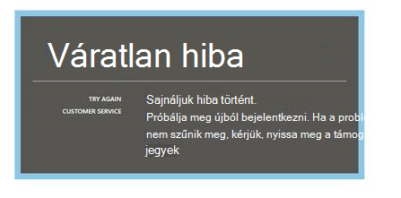
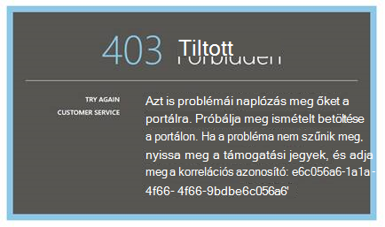
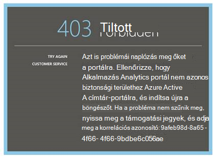
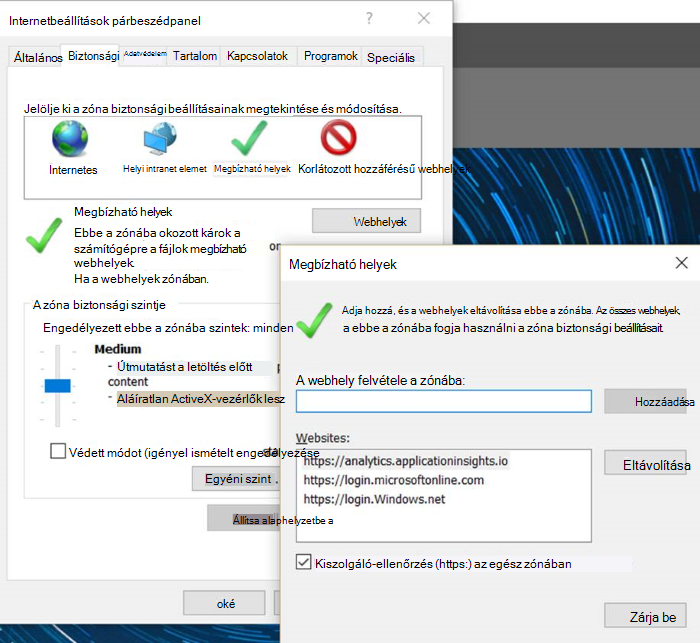
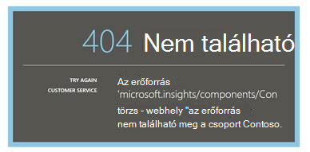
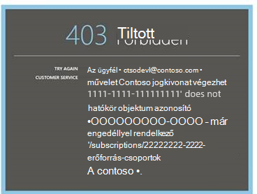
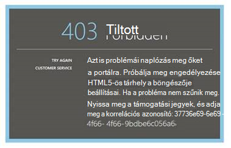
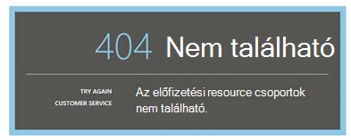
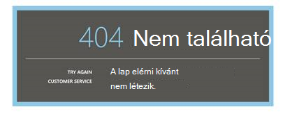

<properties 
    pageTitle="Hibaelhárítás Analytics – az alkalmazás az összefüggéseket a hatékony keresés eszköz |} Microsoft Azure" 
    description="Alkalmazás háttérismeretek analytics problémákat? Innen kell kiindulni. " 
    services="application-insights" 
    documentationCenter=""
    authors="alancameronwills" 
    manager="douge"/>

<tags 
    ms.service="application-insights" 
    ms.workload="tbd" 
    ms.tgt_pltfrm="ibiza" 
    ms.devlang="na" 
    ms.topic="article" 
    ms.date="07/11/2016" 
    ms.author="awills"/>

# Az alkalmazás az összefüggéseket Analytics – problémamegoldás

[Alkalmazás háttérismeretek Analytics](app-insights-analytics.md)problémákat? Innen kell kiindulni. Analytics segédprogram a hatékony keresés a Visual Studio alkalmazásban az összefüggéseket.

## Korlátai

* Jelenleg a lekérdezés eredményét fognak korlátozódni csak a múlt adatokat hetente fölé.
* Hogy tesztelje a böngészők: a Chrome, a szegély és az Internet Explorer legújabb verziója.

## Ismert kompatibilis böngészőbővítményeket

* Ghostery

A bővítmény letiltása vagy más böngészőt használ.

##"Váratlan hiba"

Belső hiba történt a portál futtatókörnyezet – esetén nem kezelt kivétel.

* A böngésző gyorsítótárát jelenjenek meg. 

## 403... Próbálja meg ismételt betöltése

Hitelesítés kapcsolatos hiba (hitelesítés vagy hozzáférési jogkivonat előállítása során). Előfordulhat, hogy a portálon nem tudja helyreállítani böngésző beállításainak módosítása nélkül.

* Ellenőrizze, hogy [engedélyezve van a külső cookie-k használata](#cookies) a böngészőben. 

## 403... biztonsági zóna ellenőrzése

Hitelesítés kapcsolatos hiba (hitelesítés vagy hozzáférési jogkivonat előállítása során). Előfordulhat, hogy a portálon nem tudja helyreállítani böngésző beállításainak módosítása nélkül.

1. Ellenőrizze, hogy [engedélyezve van a külső cookie-k használata](#cookies) a böngészőben. 

2. Használta egy felvétele a Kedvencek közé, a könyvjelző vagy a mentett hivatkozásra kattintva nyissa meg az Analytics-portálra? Vannak, hogy jelentkezett be eltérő, a hivatkozás mentésekor használt hitelesítő adatok?

2. Próbálja meg használni egy a-magánjellegű/incognito böngészőablakban (a minden ablak bezárása) után. Be kell adnia a hitelesítő adatokat. 

2. Nyisson meg egy másik (normál) böngészőablakot, és nyissa meg az [Azure](https://portal.azure.com). Jelentkezzen ki. Ezután nyissa meg a hivatkozást, és be kell jelentkeznie a helyes hitelesítő adatokat.

2. Széle és az Internet Explorer felhasználók is megnyithatja ezt a hibát, ha megbízható zóna beállítások használatának támogatása megszűnik.

    Győződjön meg róla [Analytics-portál](https://analytics.applicationinsights.io) és [Azure Active Directory-portálon](https://portal.azure.com) is ugyanabban a biztonsági zónában:

 * Az Internet Explorerben nyissa meg az **Internetbeállítások párbeszédpanel**, a **Biztonság**, a **Megbízható helyek**, a **webhelyek**:

    

    Webhelyek listájában, ha az alábbi URL-ek szerepelnek, győződjön meg arról, hogy a többiek számításba veszi is:

    https://Analytics.applicationinsights.IO 
   https://Login.microsoftonline.com 
   https://Login.Windows.NET

## 404... Az erőforrás nem található

Alkalmazás erőforrás alkalmazás az összefüggéseket a törölt, és nem érhető el többé. Ez akkor fordulhat elő, ha az URL-címet az elemzés lap mentette.

## 403... Nincs engedély

Nincs engedélye az alkalmazás megnyitásához Analytics.

* Szerezte be a hivatkozást valaki más át? Kérje meg őket, hogy Ön a [olvasók vagy az erőforrás csoport munkatársak](app-insights-resources-roles-access-control.md).
* Történt-e menteni a hivatkozást, eltérő hitelesítő adatokkal? Nyissa meg az [Azure portál](https://portal.azure.com), jelentkezzen ki, és próbálja meg ezt a hivatkozást újra, adja meg a megfelelő hitelesítő adatokat.

## 403... HTML5-ös tárhely

A portálon használja a HTML5-ös localStorage és sessionStorage.

* A Chrome: Beállítások, adatvédelmi, a tartalom beállításait.
* Az Internet Explorer: Internetbeállítások, Speciális lap biztonság, a DOM-tárolás engedélyezése

## 404... Nem található előfizetés

Az URL argumentum valamelyike érvénytelen. 

* Nyissa meg az app erőforrás [Alkalmazás háttérismeretek](https://portal.azure.com)portálon. Ezután hajtsa végre a Analytics gombra.

## 404... lap nem létezik

Az URL argumentum valamelyike érvénytelen.

* Nyissa meg az app erőforrás [Alkalmazás háttérismeretek](https://portal.azure.com)portálon. Ezután hajtsa végre a Analytics gombra.

## Külső cookie-k engedélyezése

  [Hogyan lehet letiltani a harmadik féltől származó sütik](http://www.digitalcitizen.life/how-disable-third-party-cookies-all-major-browsers)megjelennek, de figyelje meg, hogy **engedélyeznie** kell őket.

## Ha nem sikerül egy összes egyéb    

[Kapcsolatfelvétel](app-insights-get-dev-support.md).
 
[AZURE.INCLUDE [app-insights-analytics-footer](../../includes/app-insights-analytics-footer.md)]

